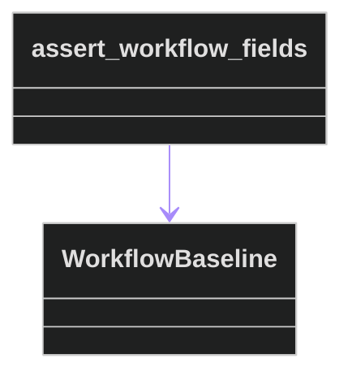
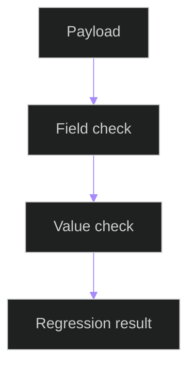

# Workflow Baseline Helpers

## Related Documents

- [full baseline test](../integration/test_full_delivered_baseline.md)
- [full delivered baseline evidence](../../../../specs/006-modular-low-coupling/evidence/baseline/full-delivered-baseline.md)
- [helper source](../../../../backend/tests/utils/workflow_baseline.py)

## Purpose

`backend/tests/utils/workflow_baseline.py` provides a small reusable assertion helper for comparing delivered workflow payloads against public user-visible fields.

## Code Structure

The class diagram shows the helper function delegating to `WorkflowBaseline`. The dataclass stores a workflow name, required public fields, and optional expected values.

## Assertion Flow

The flowchart shows how baseline assertions work. A payload first proves required fields are still present, then optional expected values are compared before the test returns a regression result.
