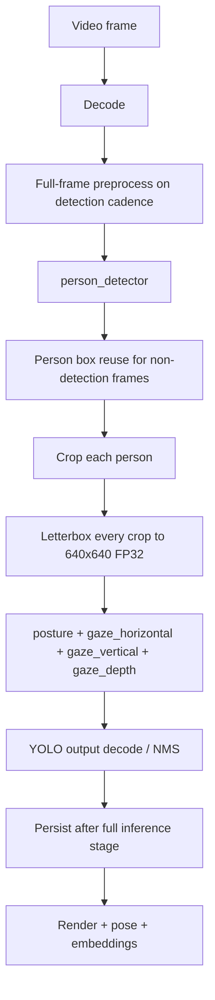
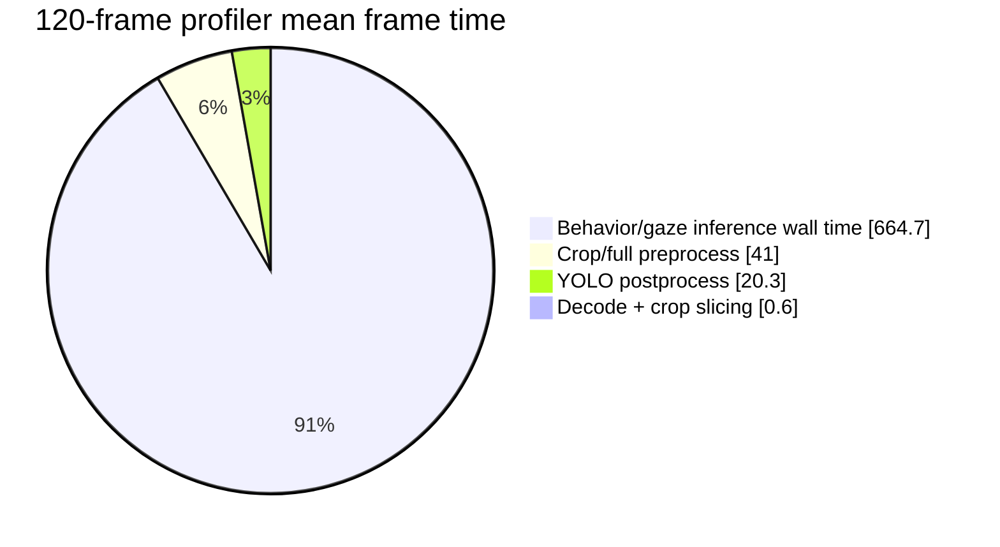
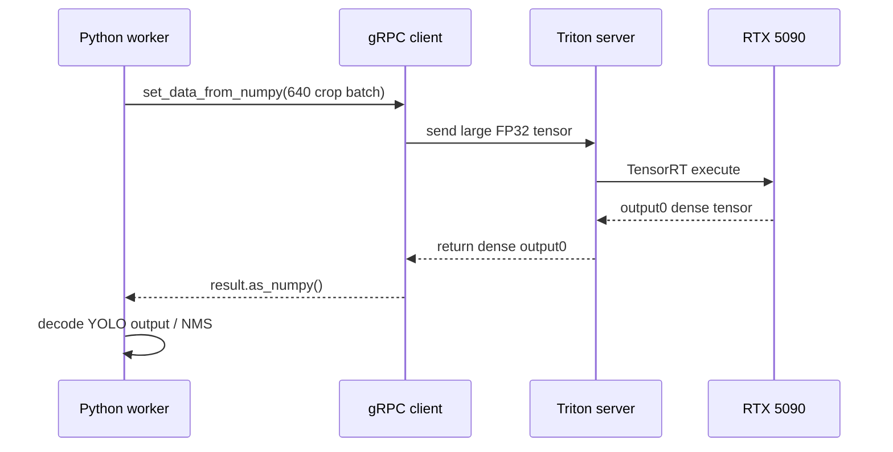
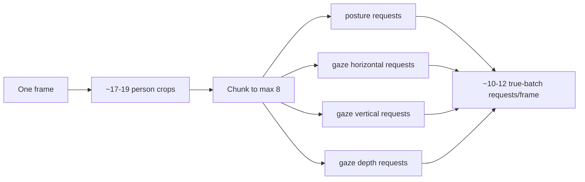
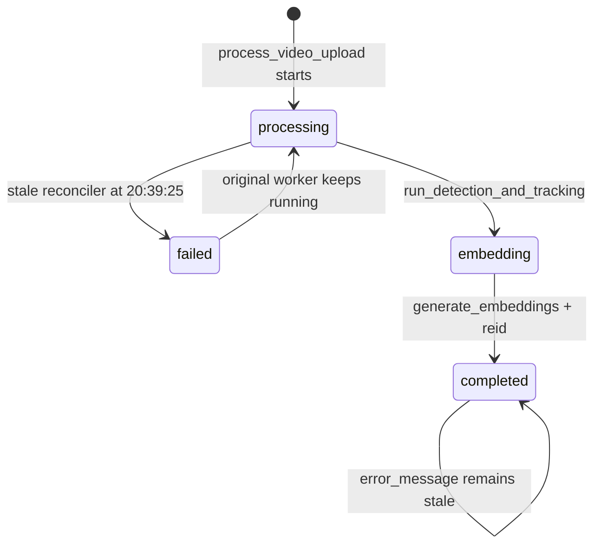
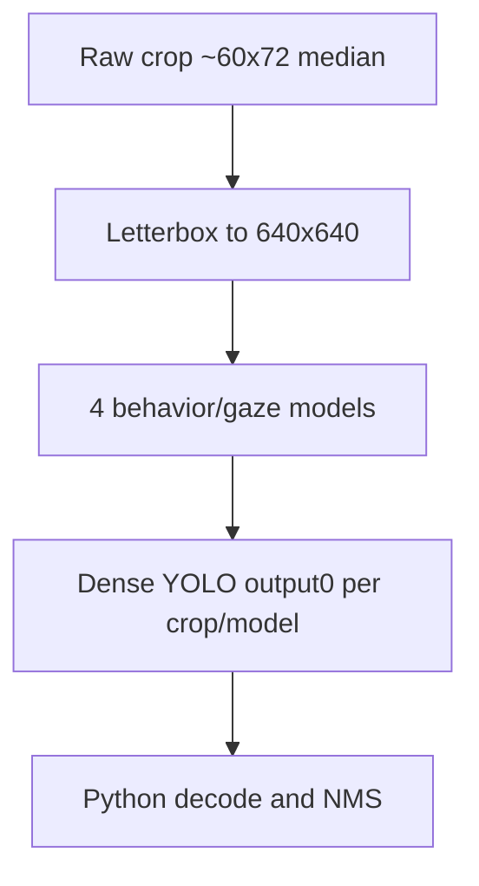
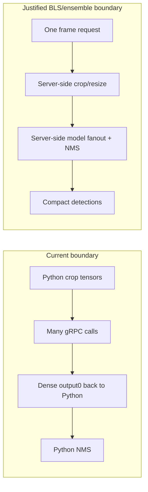
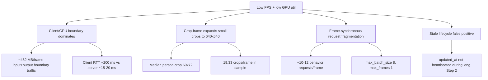

# Crop-Frame RTX 5090 Bottleneck Investigation

## Context

This report documents the production investigation of job
`80027072-a9d4-4be7-9099-4354acd1170b`, replay key
`parallel-per-frame-signals-nms100-crop-frame-20260531T230706`, on the native
Linux RTX 5090 server.

The investigation did not assume a root cause. It used the completed job audit,
Celery logs, Triton model stats, DB state, GPU samples, and a bounded
non-persistent profiler against the same `combined.mp4` video and live Triton
endpoint.

## Evidence Sources

| Source | Evidence |
|---|---|
| Job DB snapshot | Final status `completed`, `4541/4541` frames, `4541` Frame rows, `24348` Detection rows, `24348` BoundingBox rows, `24182` embeddings. |
| Job artifact | `backend/data/videos/80027072-a9d4-4be7-9099-4354acd1170b/inference_audit.json`. |
| Celery log | `backend/logs/celery_offline_control.log`, lines around `20:39:25`, `21:37:55`, `21:38:43`. |
| Benchmark log | `backend/logs/parallel_flow_parallel-per-frame-signals-nms100-crop-frame-20260531T230706.log`. |
| GPU monitor | `backend/logs/gpu_monitor_bench_20260531T230725.csv`, `1885` samples, avg util `13.5%`, peak `38%`. |
| Profiler JSON | `backend/logs/crop_frame_breakdown_20260531T213818Z.json`, `120` sampled frames. |
| Profiler repeat | `backend/logs/crop_frame_profile_time_20260531T213914Z.log` and `crop_frame_profile_gpu_20260531T213914Z.csv`, `60` sampled frames. |
| Triton configs | `backend/models/triton_repository_cuda12/*/config.pbtxt`. |
| Code path | `backend/apps/video_analysis/tasks.py`, `backend/apps/video_analysis/services/inference_orchestrator.py`, `backend/apps/pipeline/services/triton_client.py`, `backend/apps/video_analysis/management/commands/reconcile_runtime_workflows.py`. |

## Runtime Flow



Read this as the measured production path. `crop_frame` reduces full-frame
person detector calls, but every person crop still becomes a `640x640` tensor for
each behavior/gaze model.

## Phase 1: True Bottleneck

The completed job audit recorded:

| Metric | Total for 4541 frames | Per frame |
|---|---:|---:|
| `decode_ms` | `67.524 ms` | `0.015 ms` |
| `preprocess_ms` | `4511.048 ms` | `0.994 ms` |
| `inference_ms` | `3357164.349 ms` | `739.28 ms` |
| `postprocess_ms` | `3344795.660 ms` | `736.56 ms` |

The audit's `postprocess_ms` is not pure postprocess for `crop_frame`: code
starts the timer at `tasks.py` line `2301`, before crop behavior inference, and
reads it at lines `2378-2389`, after `_run_crop_behaviour_for_items()`. Therefore
it overlaps behavior inference and must not be added to `inference_ms`.

The bounded profiler separated those stages cleanly:

| Stage | 120-frame mean | 120-frame p95 | Evidence |
|---|---:|---:|---|
| Decode | `0.366 ms` | `0.329 ms` | `crop_frame_breakdown_20260531T213818Z.json` |
| Crop slicing | `0.186 ms` | `0.242 ms` | same |
| Preprocess | `40.997 ms` | `46.778 ms` | same |
| Queue wait | `0.000 ms` | `0.000 ms` | same |
| Inference wall time | `666.353 ms` | `761.190 ms` | same |
| Postprocess | `20.327 ms` | `24.357 ms` | same |
| Persistence | `0.000 ms` | `0.000 ms` | profiler intentionally non-persistent |
| Total frame time | `728.229 ms` | `823.191 ms` | same |

Dominant contributor: behavior/gaze inference wall time, specifically the
client-side request/response boundary around many `640x640` crop batches.



## Phase 2: Why GPU Utilization Is Low

The 60-frame profiler repeat measured:

| Measurement | Value |
|---|---:|
| Observed profiler FPS | `1.335` |
| GPU average utilization | `15.49%` |
| GPU peak utilization | `37%` |
| GPU average power | `101.85 W` |
| Process CPU | `114%` of one CPU |
| User CPU time | `23.07 s` |
| System CPU time | `31.68 s` |
| Max RSS | `2057508 KB` |

Triton server work per request was short while client RTT was long:

| Model task | Client RTT mean | Triton success time per execution | Profiler request count |
|---|---:|---:|---:|
| `person_detection` | `9.42 ms` | `4.83 ms` | `12` |
| `posture_detection` | `211.91 ms` | `15.69 ms` | `180` |
| `gaze_horizontal` | `212.10 ms` | `19.70 ms` | `180` |
| `gaze_vertical` | `200.55 ms` | `14.87 ms` | `180` |
| `gaze_depth` | `192.37 ms` | `15.62 ms` | `180` |

This proves the GPU is not busy for the full client wall time. The dominant gap
is outside TensorRT execution: Python/gRPC input transfer, dense output transfer,
response materialization, and frame-synchronized orchestration.



## Phase 2 Cases

### Case A: GPU Waiting For CPU / Client Boundary

Confirmed. `preprocess_ms` itself is not larger than inference, but the
CPU/client boundary is dominant:

- 60-frame behavior input bytes measured by `set_data_from_numpy`:
  `5.701632 GB` per behavior model, `22.806528 GB` total, `380.1 MB/frame`.
- `gaze_horizontal_model` output shape is `[84, 8400]` FP32, or about
  `2.82 MB/crop`; the other behavior outputs are `[14, 8400]`, about
  `0.47 MB/crop`.
- With `19.33` crops/frame in the profiler, dense behavior outputs are about
  `81.8 MB/frame`.
- Input plus output crossing the Python/gRPC boundary is about
  `461.9 MB/frame` before Python postprocess.

### Case B: GPU Waiting For Batches

Partially confirmed, but not because dynamic batching is broken.

Triton reached batch size `8`:

| Evidence | Value |
|---|---:|
| 60-frame behavior inference count per model | `1160` crops |
| 60-frame behavior execution count per model | `180` executions |
| Average effective batch | `6.44` |
| Batch size `8` executions | `120/180` per behavior model |
| Full-run behavior average effective batch | `77677 / 11693 = 6.64` |

The low `max_effective_batch_size=4` from `ModelCallEvent` is not representative:
only four model-call rows were recorded for the job because the active telemetry
ContextVar did not propagate into the job-scoped async gRPC loop.

The real batching limit is architectural:

- `TRITON_OFFLINE_BATCH_QUEUE_MAX_FRAMES=1` processes one frame at a time.
- Model configs have `max_batch_size: 8`, so batches of `16/32` cannot occur.
- Each frame creates `ceil(person_count / 8)` true-batch requests per behavior
  model, then waits before the next frame.

### Case C: GPU Kernels Are Too Small / Too Brief

Confirmed as "brief relative to client wall time." Behavior model server success
time is `14.87-19.70 ms` per true-batch execution, while client RTT is
`192-212 ms`. GPU samples from the benchmark averaged `13.5%` and peaked at
`38%`, matching short bursts followed by idle gaps.

### Case D: Request Fragmentation

Confirmed.



Production Triton stats after the run showed:

- `person_detector`: `910` executions, matching `4541 / 5` detection cadence.
- Each behavior/gaze model: `77677` crop inferences, `11692-11693` executions.
- Across four behavior models: about `46772` true-batch executions, or
  `10.3` behavior requests/frame.

The 60-frame profiler measured `720` behavior requests for `60` frames, or
`12` behavior requests/frame.

### Case E: Persistence Or Orchestration

Persistence is not the FPS bottleneck:

- Step 3 persisted `4541` frames and `24348` detections from `21:37:55.167` to
  `21:38:18.093`: `22.93 s`.
- Rendering two videos ran from `21:38:18.093` to `21:38:43.247`: `25.15 s`.
- Embedding then ran CPU-bound and completed with `24182` embeddings.

The stale failure was a lifecycle bug:



Root cause:

- `reconcile_runtime_workflows.py` marks `PROCESSING` or `EMBEDDING` jobs failed
  when `updated_at < now - 30 minutes`.
- The long streaming inference path updates progress with
  `VideoAnalysisJob.objects.filter(...).update(...)` in `tasks.py` lines
  `3579-3583`, which does not refresh Django `auto_now` `updated_at`.
- Beat ran reconciliation at `20:39:25` and logged `reconciled_jobs=1`.
- The original worker continued to Step 3, render, embedding, and completion.
- Completion did not clear `error_message`, so the final row is
  `status=completed` with `error_message=reconciled_stale_processing_state`.

## Phase 3: Crop-Frame Assumption Verification

`crop_frame` does not reduce behavior/gaze model compute in the current design.
It reduces full-frame person detector calls, but every detected person crop is
letterboxed to `640x640` in `tasks.py` line `2033`, and behavior model Triton
configs require `dims: [3, 640, 640]`.

Measured person crop dimensions from persisted `person_detection` boxes:

| Dimension | Mean | P50 | P95 | Min | Max |
|---|---:|---:|---:|---:|---:|
| Width | `69.27 px` | `62.50 px` | `127.50 px` | `13.91 px` | `228.12 px` |
| Height | `74.55 px` | `69.38 px` | `129.38 px` | `20.62 px` | `269.31 px` |
| Area | `5903 px` | `4322 px` | `15040 px` | `313 px` | `53508 px` |

Representative crop sizes:

- P05: `34.8 x 39.2`
- P25: `46.3 x 47.5`
- P50: `60.0 x 72.0`
- P75: `96.4 x 84.7`
- P95: `120.6 x 124.7`

The 60-frame profiler measured:

- `19.33` crops/frame.
- Raw crop pixels: `97,255` per frame.
- Model pixels before multiplying by behavior models: `7,918,933` per frame.
- `640x640` expansion ratio: `81.42x`.
- With four behavior models, crop-frame behavior pixels are
  `31,675,733` model pixels/frame.
- Full-frame behavior mode would be `4 * 640 * 640 = 1,638,400` model
  pixels/frame.

Therefore current `crop_frame` behavior/gaze compute is about `19.33x` the
full-frame behavior model pixel volume for the sampled segment.



## Phase 4: Is Triton Ensemble / BLS Justified?

Yes, but only if it moves the measured bottleneck. A simple ensemble that still
returns dense `output0` tensors for every crop would not solve the problem.

Evidence criteria:

| Criterion | Result |
|---|---|
| Multiple Triton calls per frame dominate latency | Confirmed: `10.3-12` behavior true-batch requests/frame. |
| GPU utilization remains low | Confirmed: benchmark avg `13.5%`, profiler avg `15.49%`. |
| CPU/GPU boundary dominates runtime | Confirmed: client RTT `192-212 ms` vs server execution `14.87-19.70 ms`; about `462 MB/frame` input+output boundary traffic. |

Recommended only if the ensemble/BLS design keeps frame/crop tensors on the
server side and returns compact detections, not raw YOLO grids.



## Root Cause Tree



### Candidate 1: Python/gRPC boundary and dense tensor transfer

- Confidence: `92%`
- Evidence: profiler client RTT `192-212 ms`; Triton server success
  `14.87-19.70 ms`; measured behavior input `380 MB/frame`; configured dense
  output about `82 MB/frame`; GPU util `13.5-15.49%`.
- Expected speedup: `3x-8x` if crop/resize/model fanout/NMS move server-side and
  Python receives compact detections only.

### Candidate 2: `crop_frame` increases behavior/gaze compute volume

- Confidence: `90%`
- Evidence: persisted person box mean area `5903 px`; profiler expansion ratio
  `81.42x`; `19.33` crops/frame; behavior model tensors are still `640x640`.
- Expected speedup: up to `10x-15x` for behavior/gaze stages if true ROI-sized
  engines or a single full-frame behavior pass are acceptable and validated.

### Candidate 3: Frame-synchronous fragmentation caps effective GPU occupancy

- Confidence: `86%`
- Evidence: full run has `11693` executions/model for behavior tasks; profiler
  has `180` executions/model for `60` frames; batches reach `8`, but only within
  one frame and then the worker waits.
- Expected speedup: `1.5x-3x` from continuous per-model crop queues across
  multiple frames and larger TRT batch profiles, assuming memory remains bounded.

### Candidate 4: Stale reconciler incorrectly failed the job

- Confidence: `99%`
- Evidence: beat logged `reconciled_jobs=1` at `20:39:25`; Step 3 started at
  `21:37:55`; final DB row is `completed` with stale error still present;
  code uses `QuerySet.update()` without `updated_at` heartbeat.
- Expected speedup: none. Expected reliability improvement: prevents false
  failed state and duplicate/stale task confusion.

## Action Plan

| Rank | Change | Code locations | Risk | Validation | Expected FPS/GPU impact |
|---:|---|---|---|---|---|
| 1 | Add real stage telemetry and fix timing definitions. | `tasks.py` lines `2301`, `2378-2389`; `triton_client.py` `_infer_grpc`; telemetry ContextVar around `_AsyncLoopRunner`. | Low | Per-frame JSON/DB rows include `decode`, `crop`, `preprocess`, `queue_wait`, `serialization`, `rtt`, `server`, `postprocess`, `persistence`. | No speedup, but removes blind spots. |
| 2 | Fix job heartbeat and stale completion cleanup. | `tasks.py` progress updates `3579-3583`, persistence updates `3952-3955`, `_set_job_status`; `reconcile_runtime_workflows.py`. | Low | Long job remains non-terminal while active; final completed job has empty error. | Reliability only. |
| 3 | Move crop/resize/model fanout/NMS server-side using BLS/ensemble or equivalent ROI graph. | Triton model repo; `tasks.py` crop dispatch; `triton_client.py` route. | High | One request/frame, compact detections, GPU util rises, no DB contract regression. | `3x-8x`, GPU util materially higher. |
| 4 | Reduce behavior/gaze input size with true ROI-sized TensorRT engines. | TensorRT export scripts and `triton_repository_cuda12/*/config.pbtxt`; `_build_crop_payload`. | Medium/High | Accuracy comparison on labeled frames; output parity threshold; latency benchmark. | Up to `10x-15x` behavior stage reduction if accuracy holds. |
| 5 | Continuous per-model crop queues across frames. | `_run_crop_behaviour_for_items`, `_dispatch_task_inputs`, `_flush_pending` in `tasks.py`. | Medium | Triton batch histogram reaches larger supported sizes, latency/ordering tests pass. | `1.5x-3x`, especially if engines support batch `16/32`. |
| 6 | Avoid returning dense YOLO grids to Python. | Engine/export/postprocess path; BLS or TensorRT NMS plugin. | High | Output payload bytes drop; detections match baseline. | Large boundary reduction; depends on implementation. |

## Verification Commands

```bash
cd /home/bamby/grad_project
bash tools/prod/prod_parallel_flow_probe.sh --job-id 80027072-a9d4-4be7-9099-4354acd1170b --watch 0
```

```bash
cd /home/bamby/grad_project/backend
source .venv/bin/activate
DJANGO_SETTINGS_MODULE=config.settings APP_ENV=prod python - <<'PY'
import django
django.setup()
from apps.video_analysis.models import VideoAnalysisJob, Frame, Detection, BoundingBox, FrameEmbedding
j=VideoAnalysisJob.objects.get(job_id='80027072-a9d4-4be7-9099-4354acd1170b')
print(j.status, j.processed_frames, j.total_frames, j.error_message)
print(Frame.objects.filter(job=j).count())
print(Detection.objects.filter(frame__job=j).count())
print(BoundingBox.objects.filter(frame__job=j).count())
print(FrameEmbedding.objects.filter(detection__frame__job=j).count())
PY
```

