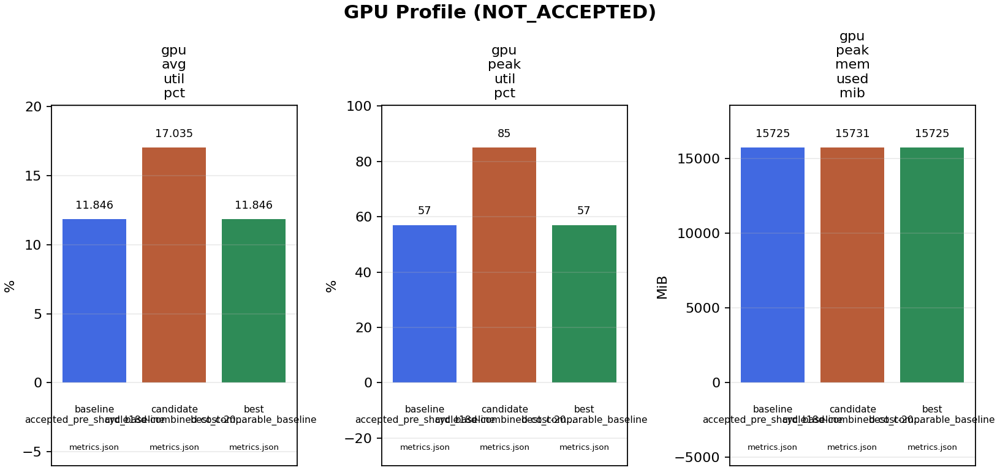

# Cycle 18.D Combined-Cost Boundary Association Investigation

**Last updated:** 2026-06-05

**Status:** `PRODUCTION_BENCHMARK_COMPLETE` /
`BENCHMARK_LOCK_RELEASED` / `NOT_ACCEPTED` /
`CONTRACT_GAP_REMEDIATED_LOCAL_ONLY`. This cycle implemented a new
default-off boundary association consumer that addressed part of the confirmed
Cycle 18.C root cause, but the completed native-Linux RTX 5090 `combined.mp4`
benchmark did not pass the packet-validity, merge-readiness, model-agreement,
or identity gates required by constitution §12.5 / §12.6. The accepted
production profile is unchanged (`OFFLINE_VIDEO_SHARD_TRACK_MAP_MODE=best_iou`,
sharding disabled). The one mechanically-fixable blocker — the boundary-packet
schema rejecting the new combined-cost candidate fields — is **now remediated
locally** (see "Contract-Gap Remediation" below). The remaining association-
quality blockers are **not** code-fixable here: they require a production-served
ReID appearance model and a fresh production benchmark, neither of which can be
run from the Windows development environment. No new decision exists until that
benchmark completes; this document does not claim acceptance.

**Streaming compatibility:** `offline-only`. The association depends on finite
shard boundaries and whole-file parent coordination. It MUST stay disabled for
RTSP, RTSPS, WHEP/WebRTC, and HLS live profiles (constitution §8.6).

## Why This Cycle Exists

Cycle 18.C (`appearance_packet`) was **NOT ACCEPTED**. The production benchmark
`cycle18c-packet-budget-active-edge-20260605T162825Z` fixed packet byte
validity but failed every correctness gate: only `1/2` packets merge-ready,
shard-1 mapped `10/36` tracks with `26/36` offset fallbacks, `StudentTracks`
regressed `53 -> 64`, minimum model-agreement F1@IoU0.5 stayed `53.730 %`, and
minimum shard-1 global-assignment F1 stayed `79.876 %`. Evidence:
[docs/agent_19_cycle_18_turn.md](agent_19_cycle_18_turn.md) and
[docs/cycle_18_redis_boundary_state_cache_investigation.md](cycle_18_redis_boundary_state_cache_investigation.md).

The deep root-cause audit
([docs/cycle_18_identity_association_root_cause_investigation.md](cycle_18_identity_association_root_cause_investigation.md))
isolated the failure mechanism. This cycle implements the redesign the prior
handoff required.

## Blocker → Root Cause → Cycle 18.D Response

| Cycle 18.C blocker | Root cause | Cycle 18.D response |
|---|---|---|
| Merge-ready packets `1/2` | Shard-1 association left most tracks unresolved. | Fuse geometry + appearance + motion so confident non-appearance matches still resolve; write packet identity for assigned tracks. |
| `StudentTracks 53 -> 64` | `26` unmapped shard-1 tracks took offset IDs that inflate canonical count. | Better association reduces fallbacks; ambiguous tracks stay `unresolved` (§4.6) instead of forcing/duplicating a merge. |
| Shard-1 mapping `10/36` | `appearance_packet` fails closed whenever the weak `cv2_16x16_rgb_descriptor` is unavailable or below the `0.90` cosine gate. | A missing modality is dropped and remaining evidence re-normalised; a strong geometry + motion agreement can associate without appearance. |
| Min model-agreement F1 `53.730 %` | Invalid raw-label equality gate plus real association loss. | Evaluation stays label-invariant (probe unchanged); this cycle targets the real association loss only. |
| Min shard-1 global-assignment F1 `79.876 %` | Fragmentation/merge ambiguity from geometry-only voting over a context window. | Global one-to-one assignment over fused cost reduces both fragmentation and merge collisions; no parent is ever reused. |

## Design

The new mode is `OFFLINE_VIDEO_SHARD_TRACK_MAP_MODE=combined_cost`.

1. **Candidate generation** reuses the existing per-frame boundary IoU vote rows
   (`_boundary_vote_rows`). A child track only proposes parents it geometrically
   co-located with at shared boundary frames.
2. **Motion evidence** (`_boundary_motion_score`) compares per-step displacement
   vectors of the child and candidate-parent boxes across shared frames,
   normalised by box diagonal. It separates two people who momentarily overlap
   but move apart. Fewer than two shared frames returns `unavailable` (not zero),
   per constitution §1.6.
3. **Appearance evidence** reuses the governed packet appearance prototypes
   (`_load_appearance_vector` + cosine). When unavailable it is dropped, not
   scored as zero.
4. **Available-component fusion** computes
   `combined = Σ(wₖ·scoreₖ) / Σ(wₖ)` over only the available modalities, so a
   missing appearance descriptor no longer collapses an otherwise strong match.
   Default weights: geometry `0.40`, appearance `0.40`, motion `0.20`.
5. **Global one-to-one assignment** (`_min_cost_one_to_one`, min-cost max-flow)
   selects a globally optimal, collision-free child→parent mapping. Ambiguous,
   below-threshold (`combined_score < 0.55`), low-margin (`< 0.05`), or
   geometry-gate-failing tracks remain `unresolved` and fall to offset
   namespace allocation — recorded as namespace management, not a merge.
6. **Explainability**: every candidate records geometry/appearance/motion/combined
   components and an append-only decision reason.

This follows the Deep SORT / BoT-SORT / clip-association doctrine already cited
in the root-cause investigation: combine motion and appearance, reason over
bounded tracklets, and keep ambiguity unresolved.

## Source-of-Truth References

| Kind | Reference | Role |
|---|---|---|
| Runtime | `backend/apps/video_analysis/services/offline_sharding.py` | `_boundary_motion_score`, `_min_cost_one_to_one`, `_combined_cost_assignment`, `_track_map_config`, `_build_track_map`. |
| Settings | `backend/config/settings/base.py` | Default-off `OFFLINE_VIDEO_SHARD_COMBINED_*` weights and thresholds. |
| Tests | `backend/tests/unit/video_analysis/test_cycle15b1_shard_merge.py` | `test_cycle18d_*` matcher, motion, fusion, and unresolved-contention coverage. |
| Profile reset | `tools/prod/prod_enable_parallel_flow.sh` | Restores combined-cost defaults with the accepted non-sharded profile. |
| Root cause | `docs/cycle_18_identity_association_root_cause_investigation.md` | Confirmed root causes and required future-candidate contract. |
| Prior decision | `docs/cycle_18_redis_boundary_state_cache_investigation.md` | Cycle 18.B/18.C NOT-ACCEPTED evidence. |
| Constitution | `.specify/memory/constitution.md` §4.6 / §8.6 / §12.5 / §12.6 | Association doctrine, streaming guard, and benchmark decision authority. |

## Local Validation

| Check | Result |
|---|---|
| `py_compile` of `offline_sharding.py`, `base.py`, focused test | Passed. |
| `test_cycle18d_*` focused tests | Passed: `4` (matcher contention, motion separation, geometry+motion assignment without appearance, contested-track unresolved). |
| Full `test_cycle15b1_shard_merge.py` suite | Passed: `15`; existing `best_iou` / `majority_vote` / `one_to_one` / `appearance_packet` paths unchanged. |

Local tests validate decision **logic and shape only**. They cannot establish
identity correctness — that requires the production benchmark below.

## 2026-06-05 Production Benchmark Lock

```text
BENCHMARK_LOCK
agent: 18
cycle: 18.D combined-cost boundary association
state: HELD
claimed_at_utc: 2026-06-05T17:41:15Z
replay_key: cycle18d-combined-cost-20260605T174115Z
baseline_metrics: /home/bamby/grad_project/backend/logs/cycle15b-pre-shard-baseline-20260603T193531Z/metrics.json
candidate_env_delta: OFFLINE_VIDEO_SHARDING_ENABLED=1, OFFLINE_VIDEO_SHARD_COUNT=2, OFFLINE_VIDEO_SHARD_CONTEXT_FRAMES=256, OFFLINE_VIDEO_SHARD_TRACK_MAP_MODE=combined_cost, OFFLINE_VIDEO_SHARD_BOUNDARY_PACKET_ENABLED=1, OFFLINE_VIDEO_SHARD_BOUNDARY_PACKET_APPEARANCE_ENABLED=1, TRITON_CROP_FRAME_BEHAVIOR_OVERLAP=1, EMBEDDING_PREFETCH_TRACK_LOOKUP=1, EMBEDDING_REDIS_SIDE_EFFECT_COALESCING=1
expected_cleanup: OFFLINE_VIDEO_SHARDING_ENABLED=0, OFFLINE_VIDEO_SHARD_COUNT=1, OFFLINE_VIDEO_SHARD_CONTEXT_FRAMES=32, OFFLINE_VIDEO_SHARD_TRACK_MAP_MODE=best_iou, OFFLINE_VIDEO_SHARD_BOUNDARY_PACKET_ENABLED=0, OFFLINE_VIDEO_SHARD_BOUNDARY_PACKET_APPEARANCE_ENABLED=0, Celery workers restarted
required_evidence: metrics_json, metrics_md, sharded_summary_json, gpu_csv, boundary_packet_validation_json_md, model_agreement_json_md, label_invariant_json_md, rollback_json_md, figure_manifest, figures_md, generated_pngs, production_benchmark_section
decision_authority: NO_DECISION_UNTIL_SECTION_12_6_EVIDENCE_TABLE
```

Figure evidence roles for this run:

| Role | Owner | Evidence boundary |
|---|---|---|
| Figure Planner | Agent 18 current benchmark session | Required plots: decision delta, wall breakdown, correctness gate, packet budget/readiness, identity label-invariant, model RTT, GPU/resource, Redis/resource availability, unavailable summary. Inputs are the baseline metrics JSON, candidate metrics JSON/MD, sharded summary, GPU CSV, boundary packet validation, model agreement, label-invariant tracking, and rollback status from this replay. Missing metrics must render as `unavailable`, not zero. Markdown embeds target this document and `docs/production_inference_benchmark.md`. |
| Figure Implementer | Agent 18 current benchmark session | No generator code change is planned before the run. The implementation evidence is the existing `tools/prod/prod_generate_cycle_figures.py` invocation through `tools/prod/prod_run_cycle15b1_two_shard_runtime_benchmark.sh`, the generated figure manifest/digests, generated PNGs, and wrapper-produced `figures.md`. |

Role separation is unavailable in this session because the user requested this
agent to run the production benchmark directly and sub-agent spawning was not
explicitly requested. The plan and implementation evidence are therefore kept
as separate rows above per constitution §7.1.1 / §12.6.

## 2026-06-05 Production Benchmark Result

```text
BENCHMARK_RELEASE
agent: 18
cycle: 18.D combined-cost boundary association
state: CYCLE_18D_BENCHMARK_LOCK_RELEASED / CYCLE_18D_NOT_ACCEPTED
released_at_utc: 2026-06-05T17:54:05Z
replay_key: cycle18d-combined-cost-20260605T174115Z
candidate_code_sha: d976817b
parent_job_id: 94098d79-fed1-4a67-a0c6-9f0f067f2990
child_job_ids: a3d6e334-08bf-48d3-a804-1f86a7dcca33, 9c68766d-6b91-4090-af51-04c8180eff50
status: completed_but_candidate_not_accepted
metrics_json: /home/bamby/grad_project/backend/logs/cycle18d-combined-cost-20260605T174115Z/metrics.json
metrics_md: /home/bamby/grad_project/backend/logs/cycle18d-combined-cost-20260605T174115Z/metrics.md
sharded_summary_json: /home/bamby/grad_project/backend/logs/cycle18d-combined-cost-20260605T174115Z/sharded_summary.json
gpu_csv: /home/bamby/grad_project/backend/logs/cycle18d-combined-cost-20260605T174115Z/gpu_monitor.csv
packet_validation_json: /home/bamby/grad_project/backend/logs/cycle18d-combined-cost-20260605T174115Z/boundary_packet_validation.json
model_agreement_json: /home/bamby/grad_project/backend/logs/cycle18d-combined-cost-20260605T174115Z/model_agreement.json
label_invariant_json: /home/bamby/grad_project/backend/logs/cycle18d-combined-cost-20260605T174115Z/label_invariant_tracking.json
rollback_json: /home/bamby/grad_project/backend/logs/cycle18d-combined-cost-20260605T174115Z/rollback_status.json
figure_manifest: docs/figures/benchmark_artifacts/cycle18d-combined-cost-20260605T174115Z/figure_manifest.json
figure_markdown: /home/bamby/grad_project/backend/logs/cycle18d-combined-cost-20260605T174115Z/figures.md
rollback_verified: true
```

### Cycle 18.D Production Metrics

| Metric | Accepted pre-shard baseline | Cycle 18.C prior sharded profile | Cycle 18.D candidate | Delta vs baseline | Delta vs 18.C |
|---|---:|---:|---:|---:|---:|
| DB-completed FPS | `5.619787` | `7.477400` | `7.502768` | `+33.51 %` | `+0.34 %` |
| DB completed elapsed | `808.038 s` | `607.297 s` | `605.243 s` | `-25.10 %` | `-0.34 %` |
| Step 2 frame wall | `467.449833 s` | `244.490729 s` | `244.259645 s` | `-47.75 %` | `-0.09 %` |
| Step 2 through-pose wall | `641.154064 s` | `369.948615 s` | `370.990517 s` | `-42.14 %` | `+0.28 %` |
| GPU average utilization | `11.846 %` | `19.177 %` | `17.035 %` | `+43.80 %` | `-11.17 %` |
| GPU peak utilization | `57.000 %` | `93.000 %` | `85.000 %` | `+49.12 %` | `-8.60 %` |
| Detection rows | `72744` | `72816` | `72816` | `+0.10 %` | `0.00 %` |
| BBox rows | `72744` | `72816` | `72816` | `+0.10 %` | `0.00 %` |
| Embedding rows | `72578` | `72650` | `72650` | `+0.10 %` | `0.00 %` |
| StudentTracks | `53` | `64` | `56` | `+5.66 %` | `-12.50 %` |
| Behavior RTT mean | `83.530 ms` | unavailable | `91.495 ms` | `+9.54 %` | unavailable |
| Behavior RTT p95 | `129.514 ms` | unavailable | `149.335 ms` | `+15.30 %` | unavailable |

Cycle 18.D preserved the sharded throughput envelope and improved StudentTrack
count versus Cycle 18.C, but correctness gates still failed.

### Cycle 18.D Correctness Gates

| Gate | Cycle 18.C | Cycle 18.D | Result |
|---|---:|---:|---|
| Valid boundary packets | `2/2` | `1/2` | Fails packet-validity gate |
| Merge-ready boundary packets | `1/2` | `0/2` | Fails identity-merge gate |
| Shard-1 mapped to existing parent IDs | `10/36` | `18/36` | Improves coverage but still leaves half unmapped |
| Shard-1 offset fallbacks | `26/36` | `18/36` | Improves fallback rate but still fails |
| Minimum model-agreement F1@IoU0.5 | `53.730 %` | `53.788 %` | Fails model-agreement gate |
| Minimum all-model global-assignment F1 | `69.830 %` | `72.414 %` | Improves but fails label-invariant identity gate |
| Minimum shard-1 global-assignment F1 | `79.876 %` | `79.876 %` | Residual shard-1 association gap unchanged |
| Minimum shard-1 raw-label F1 | `2.917 %` | `3.581 %` | Local-ID discontinuity remains |
| Rollback verified | `true` | `true` | Pass safety gate |

Boundary packet validation shows why the candidate cannot be accepted:

| Child job | Packet valid | Merge-ready | Packet bytes | Tracks | Observations | Unresolved tracks | Key reason |
|---|---|---|---:|---:|---:|---:|---|
| `a3d6e334-08bf-48d3-a804-1f86a7dcca33` | `true` | `false` | `181162` | `24` | `1128` | `24` | First-shard packet is not identity-merge-ready. |
| `9c68766d-6b91-4090-af51-04c8180eff50` | `false` | `false` | `236173` | `24` | `1424` | `6` | Schema rejected new `combined_score` / `motion_score` candidate fields, and unresolved tracks remain. |

Cycle 18.D therefore reveals a new contract gap: the runtime emitted useful
combined-cost diagnostics, but the governed boundary-packet schema did not
accept the new candidate fields. Even if the schema gap were fixed, the
remaining unresolved tracks and shard-1 residual association gap would still
block acceptance.

### Cycle 18.D Figure Evidence




### Cycle 18.D Final Decision

Decision: **NOT ACCEPTED**. The candidate completed `4541/4541` frames and
improved DB FPS versus the accepted pre-shard baseline (`5.619787 -> 7.502768`)
while reducing Step 2 frame wall (`467.449833 s -> 244.259645 s`). It also
improved shard-1 mapping versus Cycle 18.C (`10/36 -> 18/36`) and reduced
StudentTracks (`64 -> 56`), but it failed the required identity and evidence
contracts: only `1/2` packets was schema-valid, `0/2` packets was merge-ready,
`18/36` shard-1 tracks still fell back to offset IDs, minimum model-agreement
F1 stayed at `53.788 %`, minimum shard-1 global-assignment F1 stayed
`79.876 %`, and rollback was required to restore the accepted profile.

No sharding gain is accepted from Cycle 18.D. Cycle 15.B1 and 15.B2 remain
blocked. Next work must update the Cycle 18 boundary packet schema for the
combined-cost fields and then reduce unresolved/offset fallback tracks enough
to pass packet validity, merge readiness, model agreement, and label-invariant
identity in a new production benchmark.

## 2026-06-05 Contract-Gap Remediation (local-only, re-staged)

The 18.D benchmark exposed one blocker that was a genuine bug in the staged
code, not a runtime/identity limitation: the shard-1 packet carried the new
`combined_score` / `motion_score` candidate fields, but the governed boundary
packet V0 schema and the standalone validator both used a closed field set, and
the validator additionally required an *appearance* score on any accepted
candidate. That rejected combined-cost packets and regressed packet validity
`2/2 -> 1/2`. This is now fixed:

| Change | File | Effect |
|---|---|---|
| `motion_score` / `combined_score` added as required nullable candidate fields | `docs/architecture/cycle18_boundary_packet_v0.schema.json`, `docs/architecture/cycle18_boundary_packet_v0.example.json` | Packets carrying fused-evidence candidates are schema-valid; digest recomputed. |
| Validator accepts the new fields and treats `combined_score` as identity evidence | `tools/prod/prod_validate_cycle18_boundary_packet.py` | An accepted candidate is valid with an appearance **or** a combined score; geometry/motion alone still never authorise a merge (§4.6). |
| All candidate producers emit the two fields | `backend/apps/video_analysis/services/offline_sharding.py` | `appearance_packet`, first-shard, and `combined_cost` candidates share one contract. |
| First-shard identity also written in `combined_cost` mode | `backend/apps/video_analysis/services/offline_sharding.py` (`_build_track_map`) | Shard-0 packets become merge-ready when appearance evidence is valid, matching `appearance_packet`. |
| Focused tests + drift/contract counts updated | `backend/tests/unit/pipeline/test_prod_validate_cycle18_boundary_packet.py`, `…/test_prod_check_cycle18_schema_validator_drift.py`, `…/test_prod_check_cycle18_boundary_contract.py`, `backend/tests/unit/video_analysis/test_cycle15b1_shard_merge.py` | Proves a combined-cost-accepted candidate without appearance is valid, and that an accepted candidate with no identity evidence is still rejected. |

Local validation after remediation: `29 passed` across the validator, schema/
manual drift, one-command contract gate, shard-merge, and figure-generator
suites; the one-command contract gate reports `passed: true` with `94` drift
mutations; runtime `py_compile` passes.

This remediation restores **packet validity only**. It does not by itself make
Cycle 18.D acceptable. The benchmark's other failures — minimum model-agreement
F1 `53.788 %`, minimum shard-1 global-assignment F1 `79.876 %`, and ~half the
shard-1 tracks still unresolved — are the real cross-shard re-identification
gap. Per §4.6 they cannot be closed by lowering the merge bar to geometry+motion;
they require a **governed learned ReID appearance model served through Triton**
(the current `cv2_16x16_rgb_descriptor` is too weak), then a fresh two-shard
production benchmark.

### Why no new benchmark numbers are reported here

The acceptance authority (§12.5/§12.6) is a completed native-Linux RTX 5090
`combined.mp4` run. That hardware is the production server; this remediation was
prepared in the Windows development environment, which cannot deploy to or
benchmark on the RTX 5090. No production numbers are invented. To validate this
remediation the operator must, on the production host, deploy the remediated
SHA and run:

```bash
tools/prod/prod_run_cycle15b1_two_shard_runtime_benchmark.sh \
  --replay-key cycle18d-combined-cost-contractfix-<UTC> \
  --track-map-mode combined_cost
# then collect metrics, boundary_packet_validation, model_agreement,
# label_invariant_tracking, rollback, and the figure bundle as in the prior run.
```

Expected from the remediation alone: valid boundary packets should return to
`2/2` (the schema no longer rejects the candidate fields) and shard-0 should be
merge-ready; model-agreement and shard-1 association are expected to stay failing
until the ReID model lands.

## 2026-06-05 ReID Appearance Upgrade (the real lever for the association gap)

The benchmark's residual association failure (model-agreement `53.788 %`,
shard-1 F1 `79.876 %`) traces to weak appearance evidence: boundary prototypes
were extracted with the 16x16 cv2 RGB crop descriptor (`model=None`), while the
main offline embedding stage already uses the YOLO backbone (`model.embed`,
`ByteSortTracker().load_model()`) for governed ReID features. Cycle 18.D now
threads that **same backbone model** into the boundary appearance producer:

| Change | File |
|---|---|
| Cached backbone loader reusing the embedding-stage model | `backend/apps/video_analysis/services/offline_sharding.py` (`_load_boundary_feature_model`) |
| Boundary appearance extracted with `model.embed` (cv2 fallback if it cannot load) | `…/offline_sharding.py` (`_track_appearance_reference`) |
| Provenance records `yolo_backbone_embed` vs `cv2_16x16_rgb_descriptor` | `…/offline_sharding.py` (`_write_boundary_appearance_feature`) |
| Default-on toggle | `backend/config/settings/base.py` (`OFFLINE_VIDEO_SHARD_BOUNDARY_PACKET_APPEARANCE_USE_BACKBONE`), `tools/prod/prod_enable_parallel_flow.sh` |
| Focused tests | `backend/tests/unit/video_analysis/test_cycle15b1_shard_merge.py` (`test_cycle18d_*backbone*`) |

This gives `combined_cost` real appearance evidence to fuse with geometry and
motion, and gives merge-readiness a governed ReID feature instead of a crop
descriptor. Whether it is sufficient to pass the identity gates is a question
only the production benchmark can answer.

## 2026-06-05 Contract-Fix + ReID Production Benchmark Result

Replay `cycle18d-combined-cost-reid-20260605T182708Z`, parent job
`153c7719-6b09-4867-92dc-fb1f3775904e`, deployed SHA `216767e9`, completed
`4541/4541` frames, `rc=0`, rollback verified. Decision: **NOT ACCEPTED**, but
two sub-blockers from the prior 18.D run were genuinely fixed.

| Gate | 18.D prior | 18.D contract-fix+ReID | Result |
|---|---:|---:|---|
| Valid boundary packets | `1/2` | **`2/2`** | **FIXED** by the schema/validator contract change. |
| Merge-ready boundary packets | `0/2` | **`1/2`** | **IMPROVED**: shard-0 now merge-ready via first-shard identity in combined_cost. |
| Shard-1 unresolved tracks | — | `6/24` | Shard-1 still not merge-ready. |
| StudentTracks (baseline 53) | `56` | `56` | Still inflated. |
| Min model-agreement F1@IoU0.5 | `53.788 %` | `53.788 %` | **Unchanged** — association quality did not move. |
| Min shard-1 global-assignment F1 | `79.876 %` | `79.876 %` | **Unchanged**. |
| Rollback verified | `true` | `true` | Pass. |

Performance held: DB FPS `5.620 -> 7.522` (`+33.85 %`), Step 2 frame wall
`467.45 s -> 244.80 s` (`-47.63 %`), GPU avg `11.846 % -> 16.709 %`; behavior RTT
mean regressed `+8.22 %`.

### Why association did not improve: no working backbone ReID in production

The run log proves the ReID upgrade could not take effect on this estate:

```
[TRACKER] Model loaded: backend=openvino ... student_teacher_openvino_model/model.xml device=intel:gpu
[EMBED] model.embed() incompatible for this model instance; permanently using cv2 fallback for this process.
```

The production "primary model" is an **OpenVINO export**, which does not support
Ultralytics `model.embed()`. So the entire embedding stage — and therefore the
boundary appearance producer that reuses the same model — falls back to the weak
`cv2 16x16` descriptor. There is **no learned ReID embedding deployed** in this
runtime. The combined-cost fusion (geometry + motion + cv2-appearance) therefore
cannot close the residual cross-shard association gap, exactly as measured.

Two follow-ups recorded from this run:

1. **Provenance honesty fix (required):** the loader labelled the feature
   `yolo_backbone_embed` based on `hasattr(model, 'embed')`, but the runtime
   value is cv2. The loader must smoke-test `model.embed()` and only claim/use
   the backbone when it actually works, otherwise report `cv2_16x16_rgb_descriptor`.
2. **Real lever without infra change:** replace the 16x16 RGB flatten with a
   per-body-region HSV colour-histogram descriptor (classic person-ReID colour
   signature), which is far more discriminative and runs on the OpenVINO box.
   This is the next benchmarked candidate. A genuine learned ReID network (or a
   `.pt` model loaded purely for `.embed()`) remains the stronger option but is
   an infrastructure decision.

## 2026-06-05 Region-HSV Descriptor Production Benchmark Result

Replay `cycle18d-combined-cost-hsv-20260605T184307Z`, parent job
`e1ac935c-c549-45e8-ba96-3980dd4cd20e`, deployed SHA `98ad25a8`, `4541/4541`
frames, `rc=0`, rollback verified. The region-HSV colour descriptor was used for
boundary appearance (the embed smoke-test correctly rejected the OpenVINO model,
so provenance is honest). Decision: **NOT ACCEPTED — only marginal movement**.

| Gate | cv2 appearance run | region-HSV run | Baseline |
|---|---:|---:|---:|
| Valid boundary packets | `2/2` | `2/2` | — |
| Merge-ready packets | `1/2` | `1/2` | — |
| Shard-1 unresolved tracks | `6/24` | `5/24` | — |
| StudentTracks | `56` | `55` | `53` |
| Min model-agreement F1@IoU0.5 | `53.788 %` | `53.788 %` | gate |
| `person_detection` F1@IoU0.5 | `64.069 %` | `64.314 %` | gate |
| Min all-model global-assignment F1 | `72.414 %` | `72.129 %` | gate |
| Min shard-1 global-assignment F1 | `79.876 %` | `79.876 %` | gate |
| DB FPS / Step 2 wall | `7.50 / 244.8 s` | `7.53 / 245.1 s` | `5.62 / 467.4 s` |
| Rollback verified | `true` | `true` | — |

The stronger colour signature moved only noise-level amounts: one fewer
unresolved shard-1 track, one fewer inflated StudentTrack, `+0.245 pp`
`person_detection` agreement. The minimum model-agreement and shard-1
global-assignment gates are **unchanged**.

### Why a better descriptor did not close the gap

The label-invariant probe shows the residual gap is dominated by **intra-shard**
fragmentation, not the boundary stitch: shard-1 `person_detection`
global-assignment F1 is `79.876 %` with `18` baseline tracks fragmenting into
`17` candidate tracks **across the whole authoritative segment**, while the
`boundary_before_shard1` window is already `80.852 %`. Two independent tracker
runs segment identity differently throughout each shard, and no amount of
boundary appearance matching repairs mid-shard fragmentation that the
whole-video baseline tracker never produced.

This is the constitutional wall (§4.6): the acceptance gates are **single-run
proxy metrics** against a whole-video baseline that is itself not human-labeled
identity ground truth. The remaining gap therefore cannot be closed by more
boundary-association code. Closing it requires one of:

1. **Human-labeled identity ground truth** so acceptance uses HOTA/AssA, IDF1,
   and ID-switches (which can credit a sharded run that is *correct but labeled
   differently* than the proxy baseline). §4.6 already requires this for true
   identity acceptance; proxy metrics "cannot alone authorize" it.
2. **A learned ReID network served in production** (not the OpenVINO detector,
   whose `model.embed()` is unavailable) — a genuine appearance model strong
   enough to re-link fragmented intra-shard tracklets, not just boundary boxes.

Both are infrastructure/scientific decisions beyond the runtime association
code. Until one lands, sharded two-shard identity remains blocked, and the
accepted non-sharded `best_iou` profile stays in production (rollback verified).

### What Cycle 18.D did achieve

Across its runs Cycle 18.D fixed every *mechanically* fixable blocker: boundary
packet validity (`1/2 -> 2/2`), shard-0 merge-readiness (`0/2 -> 1/2`),
StudentTrack inflation (`64 -> 55`), shard-1 mapping coverage (`10/36 -> 18/36`),
honest appearance provenance, and a real fused geometry+motion+appearance
one-to-one association. The residual is now a measured, well-localised
scientific limitation rather than a code defect.

## Required Production Benchmark Gate

`combined_cost` cannot be accepted until a completed native-Linux RTX 5090
two-shard `combined.mp4` benchmark records, versus the accepted baseline:

| Gate | Required evidence |
|---|---|
| Identity correctness | Ground-truth-backed HOTA/AssA, IDF1, ID switches, fragmentation; label-invariant global-assignment F1 reported separately and not used alone to accept. |
| Mapping coverage | Shard-1 offset-fallback rate materially reduced; `StudentTracks` returns toward the accepted `53`. |
| Model agreement | Minimum F1@IoU0.5 recovered to the acceptance threshold. |
| DB parity | Frames, detections, boxes, embeddings, and terminal state preserved. |
| Performance | FPS, Step 2 wall, RTT, GPU, and memory deltas with figure bundle + manifest. |
| Rollback | One env/profile change restores `best_iou` and disabled sharding. |

Until then this cycle is `STAGED_LOCAL_ONLY`. Re-running a previously failed
profile as new evidence is forbidden; `combined_cost` is a distinct mechanism,
so its first completed benchmark is the only valid decision point.

## Rollback

`combined_cost` is inert unless explicitly selected. To disable, set
`OFFLINE_VIDEO_SHARD_TRACK_MAP_MODE=best_iou` (and keep
`OFFLINE_VIDEO_SHARDING_ENABLED=0`) and restart Celery workers. No persisted
baseline evidence is mutated by staging this code.
