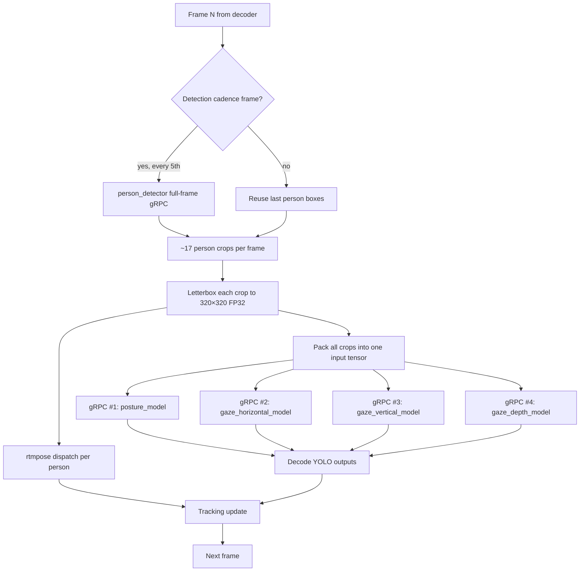

# Cycles 9-13 Implementation Playbook

**Status:** Historical playbook plus execution roadmap — no acceptance until each cycle has its own measured before/after on prod RTX 5090 against the canonical `combined.mp4` benchmark.
**Last updated:** 2026-06-02
**Filename note:** `cycles_9_to_12_implementation_playbook.md` is historical; the restaged sequence now includes Cycle 12 persistent async-dispatch measurement and shifts render/persistence cleanup to Cycle 13.
**Latest accepted baseline:** Cycle 9b B.2.c exact slice + Top-K, job `be4ba9ee-4786-48e9-8334-28feb237a1fb`, **4.429 FPS overall (DB completed), 17.0 min total**. Earlier cycle projections in this file are retained as historical planning context; use `docs/cycle_9_and_10_improvements_todo.md` § Z and `docs/runtime_sla_video_plus_5min.md` for current sequencing.
**SLA target** (per `docs/runtime_sla_video_plus_5min.md`): `total_wall ≤ duration(video) + 5 min`. For `combined.mp4` (2 m 31 s): **≤ 7 m 31 s = ≥ 10.07 FPS overall**.
**Current gap to close:** ~9.5 min over budget.

---

## 0. Why "4 behavior models" and not all 6?

The Triton model repository deploys **6 models**. They are *not* interchangeable from an ensemble perspective:

| Model | Input shape | Output | Cadence | Same input as the 4 behaviour models? |
|---|---|---|---|---|
| `person_detector` | `[N, 3, 640, 640]` (full frame, FP32) | `[14, 8400]` (YOLO grid) | every 5th frame (sparse detect) | **No** — different shape (640 vs 320), different per-frame cadence, runs on the *full* frame not on per-person crops |
| `posture_model` | `[N, 3, 320, 320]` (person crop, FP32) | `[14, 2100]` | every frame, per detected person | **Yes** |
| `gaze_horizontal_model` | `[N, 3, 320, 320]` (person crop, FP32) | `[84, 2100]` | every frame, per detected person | **Yes** |
| `gaze_vertical_model` | `[N, 3, 320, 320]` (person crop, FP32) | `[14, 2100]` | every frame, per detected person | **Yes** |
| `gaze_depth_model` | `[N, 3, 320, 320]` (person crop, FP32) | `[14, 2100]` | every frame, per detected person | **Yes** |
| `rtmpose_model` | `[N, 3, 256, 192]` (re-cropped, different aspect) | `simcc_x`, `simcc_y` | per detected person | **No** — different shape (256×192 vs 320×320), different crop preprocessing |

**The four behavior models share an identical input contract** — same shape, same dtype, same letterboxed person crop. That is the prerequisite for a Triton **ensemble**: the runtime can route the *same* uploaded tensor through 4 internal model instances and return 4 outputs in one round-trip.

`person_detector` and `rtmpose_model` cannot join that ensemble because their input tensors are different shapes and come from different preprocessing paths. They keep their own gRPC calls.

So Cycle 9 attacks exactly the place where one shared input is sent **four times** across the gRPC boundary today — the highest-payoff bit of the inference hot path.

---

## 1. The current inference flow (post-Cycle 8)



**The 4 parallel arrows from `BATCH` to `G1..G4` are the cost** Cycle 9 collapses: same 17-crop tensor (~20 MB FP32) is serialized and transmitted 4× per frame, just because Triton sees 4 separate model contracts. The ensemble change keeps the model *implementations* identical and adds a thin Triton "ensemble" layer that fans the same input out to the 4 sub-models on the server side.

---

## 2. Cycle 9 — Triton Ensemble for the 4 behaviour models

### Goal
One gRPC call per frame for behavior signals instead of four. Same models, same outputs, same accuracy — only the transport boundary changes.

### Why this is the next attack
After Cycle 8 the per-stage budget for `combined.mp4` looks like:

| Stage | Cycle 8 wall (s) | % of total |
|---|---:|---:|
| Step 2 frame inference | **852.8** | **65.0 %** |
| Pose post-processing | 220.7 | 16.8 % |
| Embedding | ~174 | 13.3 % |
| Persistence | 39.4 | 3.0 % |
| Render | 25.7 | 2.0 % |

Step 2 alone is now ~14 min, and within it the 4 behavior gRPC calls per frame dominate. From the gRPC RTT probe in `docs/rtt_root_cause_investigation_77650001.md`:

- Concurrent dispatch (`TRITON_CONCURRENT_MODELS=1`): max-of-4 RTT ≈ **130 ms / frame**
- The four sub-RTTs in parallel: 145, 168, 156, 176 ms
- Triton server compute per sub-call: only 11–15 ms
- → ~110 ms of every frame is *not* GPU work — it's gRPC transport + Triton scheduling across 4 redundant trips

### Mechanism — what an "ensemble" actually is in Triton

A Triton **ensemble model** is a server-side declarative pipeline. It is *not* a new model file — it's a `config.pbtxt` that says:

```
name: "behavior_ensemble"
platform: "ensemble"
max_batch_size: 32
input  [ { name: "images" dims: [3,320,320] datatype: TYPE_FP32 } ]
output [
  { name: "posture_out"     dims: [14,2100] datatype: TYPE_FP32 }
  { name: "gaze_h_out"      dims: [84,2100] datatype: TYPE_FP32 }
  { name: "gaze_v_out"      dims: [14,2100] datatype: TYPE_FP32 }
  { name: "gaze_d_out"      dims: [14,2100] datatype: TYPE_FP32 }
]
ensemble_scheduling {
  step [
    { model_name: "posture_model"          model_version: -1
      input_map  { key: "images" value: "images" }
      output_map { key: "output0" value: "posture_out" } }
    { model_name: "gaze_horizontal_model"  model_version: -1
      input_map  { key: "images" value: "images" }
      output_map { key: "output0" value: "gaze_h_out" } }
    { model_name: "gaze_vertical_model"    model_version: -1
      input_map  { key: "images" value: "images" }
      output_map { key: "output0" value: "gaze_v_out" } }
    { model_name: "gaze_depth_model"       model_version: -1
      input_map  { key: "images" value: "images" }
      output_map { key: "output0" value: "gaze_d_out" } }
  ]
}
```

The 4 underlying TensorRT engines **do not change at all**. The ensemble just declares "for one ensemble call, route the input to all 4 in parallel and return all 4 outputs in one response."

### How it is applied — concrete steps

1. **Author the ensemble config** at `backend/models/triton_repository_cuda12/behavior_ensemble/config.pbtxt` and create an empty `1/` version directory next to it (Triton accepts ensembles with no model file).
2. **Add an `ensemble_steps_validator.py` startup check** so Triton refuses to start if any of the 4 sub-models are missing or have mismatched dims.
3. **Add a route**: `model_route_service.py` learns `behavior_ensemble: {model_name: "behavior_ensemble", model_version: "v1"}` for a new task_key `behavior_all`. Existing `posture_detection`/`gaze_*` task_keys remain (we keep the rollback path).
4. **Add a `TRITON_BEHAVIOR_ENSEMBLE` env flag** (default OFF). When ON, `_run_crop_behaviour_for_items` dispatches once to `behavior_all` and splits the 4 outputs locally instead of 4 dispatches.
5. **Add `_split_ensemble_response`** in the orchestrator: unpack `posture_out`/`gaze_h_out`/`gaze_v_out`/`gaze_d_out` from one response into the same 4 result lists the existing decoder expects.
6. **Unit tests**: shape parity vs separate-dispatch, output-byte parity (output bytes must be identical to the existing 4-call path on the same input tensor).
7. **Parity probe**: run a 60-frame side-by-side on prod with flag OFF then flag ON, compute pixel-level diff on the YOLO output tensors. Acceptance gate: ≤ 1e-6 max abs diff per output channel (matches FP32 noise).

### Expected gains

| Metric | Mechanism | Conservative | Optimistic |
|---|---|---:|---:|
| gRPC calls / frame for behavior | 4 → 1 | −75 % | −75 % |
| Input bytes / frame transferred | 4× 20.9 MB → 1× 20.9 MB | −62.7 MB | −62.7 MB |
| Step 2 wall | 852 s → ~620–700 s | **−18 %** | **−27 %** |
| Total job wall | 21.87 min → 19–20.5 min | −7 % | −13 % |
| Overall FPS (DB completed) | 3.46 → 3.7–4.0 | +7 % | +16 % |

The gain is bounded above because Cycle 8 measurements already proved that with `TRITON_CONCURRENT_MODELS=1` the 4 calls run in parallel at the **client** side — the 4-call cost was `max(call) = 130 ms`, not `sum(calls) = 645 ms`. The ensemble removes 3× the *transport* and 3× the Triton scheduling/queue per frame, but the GPU compute is identical. That's why we project +7–16 % overall FPS, not +75 %.

### Risk

- **Medium.** Ensembles are stable in Triton ≥ 2.50, but ours would be the first one in this repo. Possible failure modes: ensemble fails to load because of dim mismatches; ensemble can't honor `max_batch_size=32` if any sub-model has a smaller cap.
- The accuracy contract is *bit-identical* because the 4 engines are the same — we just call them through one wrapper.

### Rollback
Flip `TRITON_BEHAVIOR_ENSEMBLE=0`. The 4 standalone models stay in the repo; the per-model dispatch path is untouched.

### Acceptance criteria (constitution-aligned)
1. Prod benchmark on `combined.mp4` shows reduced Step 2 wall ≥ 10 %.
2. Per-class bbox counts within 0.1 % of Cycle 8 (`attention/hand/person/sitting`).
3. Detection / bbox / embedding row counts within 0.05 % of baseline.
4. Output tensor byte-parity probe passes (≤ 1e-6 max abs diff vs 4-call path).
5. ≥ 4 new unit tests covering ensemble config validation, response-splitting, fallback to 4-call path on error, flag-gated route selection.

### Production outcome (2026-06-01)

Cycle 9 was implemented and production-benchmarked. The result is **NOT
ACCEPTED** for the chosen acceptance gate (Step 2 wall ≥ 10 % reduction);
overall DB-completed FPS improved nonetheless. The ensemble candidate is
kept available behind a flag but is not the route to the SLA.

See [`docs/cycle_9_results.md`](cycle_9_results.md) for the full post-mortem,
the five concrete follow-up options (server-side compact postprocessing,
output fusion, child critical-path optimization, larger ensemble batches,
"stop optimizing gRPC call count alone" discipline), and the lesson
formalized for future cycles.

**The optimization sequencing is updated:** Cycle 10 (originally pose
parallelization) is repurposed for the **Logical Path Matrix (LPM)** — see
[`docs/logical_path_matrix_spec.md`](logical_path_matrix_spec.md). Pose
parallelization moves to Cycle 10b. The 5 ensemble follow-ups become
Cycle 9b candidates and stay STAGED until prod evidence selects which to
implement.

- Replay key: `cycle9-behavior-ensemble-crop-frame-20260601T180847`
- Job: `c1651663-e08a-4e29-9ee3-fd0f09884b98`
- Candidate SHA: `0fa847af43186017316cc11a8c76645ff463e574`
- Tensor parity: max abs diff `0.0`
- Step 2 wall: `852.8 s` → `858.1 s` (`+0.6 %`, failed acceptance gate)
- DB-completed FPS: `3.46` → `4.09` (`+18.1 %`)
- App-level behavior calls: `14 391` → `3 597` (`-75.0 %`)

New production finding: the pinned Triton build originally had
`TRITON_ENABLE_ENSEMBLE=OFF`; it was rebuilt in place with
`TRITON_ENABLE_ENSEMBLE=ON`.

Lesson for future cycles: do not repeat a plain dense-output ensemble. The next
design must reduce dense output movement, the four-child server-side critical
path, or frame-level process serialization. See
[`docs/cycle_9_results.md`](cycle_9_results.md).

---

## 3. Cycle 10 — Pose parallelization across frames

### Goal
Run pose post-processing concurrently across multiple frames instead of serially. Eliminate the dedicated 220 s "pose stage" between Step 2 and Step 3.

### Why this is needed
Today the pose loop in `apps/video_analysis/tasks.py:3787` looks like:

```python
for frame_idx, fd in sorted(frame_detections.items()):
    # ... read frame from disk ...
    results = pose_runtime.infer_from_detections(frame_bgr, detections_payload)
    # ... accumulate results ...
```

Frames are processed **one at a time, in order**, after Step 2 has finished. Cycle 6 fixed the rtmpose `batch_size>16` warnings but kept the serial-across-frames structure. Server-side rtmpose is already fast (~1.21 ms / exec, batch ~1.44). The 220 s = 4 541 frames × 48.6 ms / frame is dominated by:
- Per-frame `cv2.imread(frame_path)` from `predict/input_frames/{N}.jpg` (~5 ms),
- Per-frame `PoseRuntime.infer_from_detections` building crops + chunked gRPC (~25–35 ms),
- Per-frame Python overhead (Django ORM lookups for boxes, etc.).

### Mechanism — two complementary approaches

**Option A (preferred): frame-window pipeline inside the existing pose loop.**

Use `concurrent.futures.ThreadPoolExecutor` with `max_workers = POSE_PARALLEL_FRAMES (default 4)` and a producer / consumer pattern:
1. Producer thread reads JPGs from disk into a bounded queue (max 8 frames).
2. Worker threads each pull one frame, build the rtmpose dispatch request, and submit it through the shared `orchestrator.run_inference_batch(...)` (which is already async-safe and chunks at the 16-max contract from Cycle 6).
3. A collector thread orders results back by `frame_index` for the downstream merge.

Because the GPU is mostly idle during the post-Step-2 pose loop (server time ~1.21 ms but client-side serialized), parallelizing 4 frames at a time keeps Triton in flight and stops the cv2 + Django ORM work from being the gating cost.

**Option B (more invasive): inline pose into Step 2.**

Dispatch pose alongside the behavior models on every frame inside the Step 2 loop. Reduces pose phase to ~0 by absorbing it into Step 2 wall (Step 2 grows slightly but total drops). Higher engineering cost and more code paths to test; defer behind Option A unless A doesn't reach the target.

### How Option A is applied — concrete steps

1. Refactor `apps/video_analysis/tasks.py:3787` loop into:
   - a `_load_frame(frame_obj)` worker (cv2 read + Django select_related lookup),
   - a `_pose_frame(frame_bgr, detections, frame_obj)` worker (calls `PoseRuntime.infer_from_detections`, returns `(frame_index, pose_records)`),
   - a serial collector that accumulates into `pose_payload` and `pose_records_by_frame` in frame-index order.
2. Add `POSE_PARALLEL_FRAMES` env flag (default `4`; bounded by `TRITON_MAX_INFLIGHT_REQUESTS / pose_max_batch`).
3. Preserve current per-frame deadline accounting (`avg_pose_ms_per_person`, `dynamic_cap`) by computing them after a frame's pose result lands rather than during dispatch.
4. Keep the cv2 video read pattern from Cycle 8's lazy seek: forward-skip with `.grab()`, only `.read()` when needed.

### Expected gains

| Metric | Mechanism | Conservative | Optimistic |
|---|---|---:|---:|
| Pose post wall | 4× concurrency, GPU-bound becomes the floor | 220 s → **~80 s** | 220 s → **~55 s** |
| Total job wall | −140 to −165 s | **−11 to −13 %** | |
| Overall FPS | 3.46 → 3.9–4.1 | +13 to +18 % | |

### Risk
Medium. ThreadPoolExecutor inside Django/Celery requires care for ORM connection handling; we already do `select_related` so each worker uses a single query. Bounded queues prevent the prior 100 GiB RSS spike.

### Rollback
Set `POSE_PARALLEL_FRAMES=1` to restore serial behavior. The new code path falls back automatically when the worker count is 1.

### Acceptance criteria
1. Prod benchmark: pose-upload stage wall reduces ≥ 50 % vs Cycle 9.
2. `pose_record_count` (currently 19 157) within 0.1 %.
3. `pose_confidence_diagnostics.mean` within 0.5 %.
4. No new rtmpose error log lines.
5. Worker RSS stays under 2 GiB.

---

## 4. Cycle 11 — Smaller behavior input (320 × 320 → 256 × 256)

**2026-06-02 outcome update:** Cycle 11.A was implemented, built on
production, and **NOT ACCEPTED by real production benchmark**. The synthetic
pre-benchmark parity gate failed (`posture_model` class agreement `0.695`,
`gaze_vertical_model` `0.955`, large centroid drift on posture / vertical /
depth), but that was recorded only as a warning. The full `combined.mp4`
benchmark then ran and proved the speed hypothesis while failing correctness:
Step 2 frame wall improved `540.399 s → 391.673 s`, behavior RTT mean improved
`84.865 ms → 51.529 ms`, but detection/bbox rows regressed
`72,762 → 101,213`, `attention_tracking` boxes regressed
`11,781 → 20,558`, and average GPU utilization fell `9.344 % → 7.367 %`.
Tooling now exists to reproduce the matrix:
`tools/prod/prod_run_behavior_input_size_matrix.sh` and
`tools/prod/prod_collect_benchmark_metrics.py`. Production was rolled back to
the accepted 320 exact-slice + Top-K profile. See
[`docs/cycle_11_input_size_results.md`](cycle_11_input_size_results.md).

### Goal
Reduce the per-crop GPU compute by re-exporting the 4 behavior TensorRT engines at a smaller input resolution. The model topology is unchanged — only `imgsz` shrinks.

### Why this is needed
After Cycles 9 + 10, Step 2 is projected at ~580–650 s, still dominating the remaining gap. The Triton server compute per behavior model at 320×320 averages 11–15 ms / execution. Pixel volume scales linearly with `H × W`:

| Input size | Pixels per crop | Relative compute (rough) |
|---|---:|---:|
| 640×640 (pre-ROI baseline) | 409 600 | 4.00× |
| 320×320 (Cycle 1+ default) | 102 400 | 1.00× |
| 256×256 (Cycle 11 target) | 65 536 | 0.64× |
| 192×192 (Cycle 11 stretch) | 36 864 | 0.36× |

At 256×256 the per-batch server compute should drop from ~14 ms to ~9 ms. Combined with reduced PCIe H2D traffic (input bytes drop from 1.17 MB / crop to 0.75 MB / crop), the per-frame Triton portion of Step 2 should shrink ~30 %.

### Mechanism

1. **Re-export the 4 engines** with the new `imgsz` using the existing `backend/scripts/build_tensorrt_engines.py --behavior-imgsz 256` (the script already supports this flag — added during the ROI-320 cycle).
2. **Update Triton configs** `triton_repository_cuda12/{posture_model,gaze_*_model}/config.pbtxt` dims `[3, 256, 256]`.
3. **Update `TRITON_CROP_BEHAVIOR_INPUT_SIZE=256`** in prod env.
4. **Accuracy parity gate** — see below.

### How it is applied — concrete steps

1. Build the 4 engines locally (RTX 3050 Ti dev box) with `--behavior-imgsz 256` and verify the `.plan` files load.
2. Ship the engines + new `config.pbtxt` files to prod via `tools/prod/prod-rebuild-tensorrt-engines.sh` (already-existing helper).
3. Run the existing prod **accuracy parity probe**: feed 200 random crops from `combined.mp4` through both the current 320 engines and the new 256 engines, then compute:
   - Top-1 class agreement (must be ≥ 99.5 %).
   - Bounding-box centroid drift in normalized coords (must be ≤ 0.5 px @ 256 scale).
   - Per-class confidence delta (must be ≤ 5 % absolute).
4. Record parity as a warning signal, then run the full `combined.mp4`
   benchmark before accepting, rejecting, skipping, or neglecting the candidate.

### Expected gains

| Metric | Mechanism | Conservative | Optimistic |
|---|---|---:|---:|
| Behavior server compute per call | linear in `H × W` | −36 % | −36 % |
| Step 2 wall | ~580 s → ~470 s | **−13 % on top of C9 + C10** | |
| Total job wall | ~−110 s | −9 % | |
| Overall FPS | ~4.1 → ~4.5 | +10 % | |

### Risk
**Medium-high.** A smaller pixel budget can lose detail. The accuracy parity
gate above is mandatory as a warning signal, but the final decision requires a
real production benchmark and DB/signal parity comparison.

### Rollback
Flip `TRITON_CROP_BEHAVIOR_INPUT_SIZE=320` and re-deploy the existing 320 engines (we never delete them). One env change + Triton restart.

### Acceptance criteria
1. Accuracy parity probe is recorded as warning evidence.
2. Prod benchmark Step 2 wall reduces ≥ 10 %.
3. Per-class bbox counts stay within the documented correctness gate.
4. Overall FPS improves.

**Actual 2026-06-02 decision:** criteria 2 and 4 passed, but criterion 3 failed
badly. Cycle 11.A is not accepted and should not be retried until the
over-detection cause is explained by a real-crop parity harness.

---

## 5. Cycle 12 — Persistent async dispatcher

### Goal
Measure and then remove the single-process orchestration boundary around
`async_runner.run(...)` in the crop-frame Step 2 loop. The first deliverable is
measurement only: `TRITON_ASYNC_DISPATCH_PROFILING=1` records async-boundary
cost in `inference_audit.json`, and the production benchmark on `combined.mp4`
decides whether the persistent dispatcher implementation is worth shipping.

### Why
Cycle 9b B.2.c already reduced behavior output traffic to the Top-K contract,
and two B.1 repeat benchmarks showed Python decode/NMS is small compared with
infer wait plus server/orchestration. Cycle 11.A proved smaller 256 inputs are
fast but not correct. Cycle 9b B.4 proved larger frame windows are not safe for
tracking/model agreement. The remaining near-term inference-wall candidate is
therefore the Python orchestration boundary inside the accepted 320 Top-K route.

### How it is applied
1. Add opt-in `TRITON_ASYNC_DISPATCH_PROFILING` and record each
   `async_runner.run(...)` boundary in Step 2.
2. Extend the production metric collector and watcher so async dispatch cost is
   visible beside RTT, Step 2 wall, FPS, GPU, memory, and correctness.
3. Run the measurement benchmark on production Linux RTX 5090 with
   `/home/bamby/grad_project/Raw Data/Diverse Classroom Enviroments/combined.mp4`.
4. If the production table proves material boundary cost, implement the
   persistent producer/consumer dispatcher behind an env flag and benchmark it
   against the same baseline.

### Expected gains
- Measurement phase completed: clean production replay
  `cycle12-async-dispatch-profile-clean-20260602T213441Z` measured
  `349.643 s` async-dispatch blocking wall and `338.779 s` inside
  `behavior_all`. No optimization decision exists because no persistent
  dispatcher candidate was deployed.
- Candidate phase: must overlap behavior wait/server execution. A candidate
  that only removes the synchronous loop-crossing bridge is probably below the
  `>=10 %` Step 2 gate.

### Risk
Medium. A persistent dispatcher can change task scheduling and result-order
handling, so the rollout must preserve per-frame output ordering and use the
accepted model-agreement parity gates. Rollback is disabling the env flag and
returning to the current `_AsyncLoopRunner.run(...)` path.

---

## 6. Cycle 13 — Render & persistence cleanup

### Goal
Soak up the last small structural costs: parallel render writers + PostgreSQL `COPY FROM` for persistence. Total budget impact ~15–25 s but it's needed to land at the SLA.

### Why
Render today writes two MP4 outputs sequentially (`annotated_combined.mp4` + `pose_output_video.mp4`). Persistence today uses Django `bulk_create` (already batched by Cycle 1–5) but each batch is a multi-row `INSERT`. PostgreSQL `COPY FROM` is 5–10× faster on dense numeric inserts of the size we have (72 k detections + 72 k bboxes + 72 k embeddings).

### How it is applied
1. **Parallel render**: kick off the pose-video render in a background process while the annotated-video render runs in the main process. Use `multiprocessing.Process` (the renders are CPU-bound and don't share state).
2. **`COPY FROM` for embeddings**: replace `FrameEmbedding.objects.bulk_create(...)` in Cycle 8's helper with `psycopg2.copy_expert("COPY ... FROM STDIN ...")`. Detection / BoundingBox tables already use bulk_create; only embeddings (the largest row count) gets the COPY upgrade.
3. **Persistence connection pool**: ensure the celery worker reuses one DB connection across persistence and embedding writes (it already does via Django's `CONN_MAX_AGE`).

### Expected gains
- Render: 25.7 s → ~14 s (-10 s).
- Persistence: 39.4 s → ~28 s (-11 s).
- Total: ~20 s saved.

### Risk
Low. Parallel render is independent processes — failure of one doesn't take the other down. `COPY FROM` is well-understood PostgreSQL; transaction semantics unchanged.

---

## 6. Projected trajectory toward the SLA

| Cycle | What changes | Expected total wall | Expected FPS (DB completed) | SLA gap |
|---|---|---:|---:|---:|
| Baseline | — | 3 469 s | 1.31 | +50.3 min |
| 1–5 + 6 + 7 + 8 (accepted) | bundle + pose chunk + redis + embed | **1 312 s** | **3.46** | +14.4 min |
| **+ Cycle 9** | Triton ensemble for 4 behavior models | ~1 180 s | ~3.85 | +12.1 min |
| **+ Cycle 10** | Pose parallelization (4× concurrent frames) | ~1 040 s | ~4.37 | +9.8 min |
| **+ Cycle 11.A** | Behavior input 320 → 256 | **NOT ACCEPTED** | Speed improved, correctness regressed | baseline remains Cycle 9b Top-K |
| **+ Cycle 12** | Persistent async dispatcher | Phase A measured | no decision | candidate benchmark required |
| **+ Cycle 13** | Parallel render + COPY persistence | ~910 s | ~4.99 | +7.6 min |

**After Cycle 13 we are projected at ≈ 5 FPS (≈ 15.2 min total)** only if the
pending production benchmarks preserve correctness and produce the expected
wall-time savings. That is **still ~7.6 min over the 7.5-min SLA target**. The
remaining gap is fundamental: Step 2 still dispatches 4 541 frames worth of GPU
work *serially after decode*. To go further we need either:

- **Cycle 14a (architectural)**: move all per-frame fan-out (crop preprocess → behavior ensemble → pose → embedding-vector compute) onto the Triton server via a single **BLS (Business Logic Scripting) Python backend**. One gRPC per frame returns compact detection tuples. Removes the per-frame Python orchestration round-trip. Projected: 5 FPS → **8–10 FPS** (lands on the SLA boundary).
- **Cycle 14b (parallelism)**: shard the offline pipeline across multiple Celery worker processes (currently `CELERY_OFFLINE_WORKER_CONCURRENCY=4` but each video runs on ONE process). Split a video into 4 segments processed in parallel, then stitch tracking + embeddings at the end. Projected: 5 FPS → **15–18 FPS**. Tracking stitching is the hard part.

Cycles 13+ are documented separately because they each cost a week-class engineering effort and need an accuracy/lifecycle review beyond the per-cycle constitution checklist.

---

## 7. Constitutional discipline — same as cycles 6–8

Every cycle on this list independently:

1. **Measures** the relevant stage on a fresh prod baseline before any code change (no speculation).
2. **Documents** hypothesis + risk + rollback in `docs/crop_frame_optimization_execution.md` before implementation.
3. Implements **one focused change** with regression unit tests.
4. Runs `tools/prod/prod_run_parallel_flow_benchmark.sh` on `combined.mp4`.
5. Compares **before / after FPS, stage wall, and correctness counters** (detections, bboxes, embeddings, pose records — all within ≤ 0.1 %).
6. **ACCEPTS only when measurable improvement AND zero correctness regression.** Otherwise REJECTS or NEEDS-MORE-DATA.
7. Updates `docs/production_inference_benchmark.md`, `AGENTS.md`, `docs/inference_parallelization_plan.md` after acceptance.

The four cycles in this playbook are sequenced because each one's measurement is invalidated if a later cycle ships first (e.g., ensemble metrics differ if pose is still serial). They must land in the listed order.

---

## 8. Quick reference — file touchpoints per cycle

| Cycle | New files | Edited files | New env flags | New tests |
|---|---|---|---|---|
| **9** | `backend/models/triton_repository_cuda12/behavior_ensemble/config.pbtxt`, `backend/apps/pipeline/services/ensemble_validator.py` | `model_route_service.py`, `inference_orchestrator.py` (response split), `tasks.py` (`_run_crop_behaviour_for_items`) | `TRITON_BEHAVIOR_ENSEMBLE` | `test_behavior_ensemble_dispatch.py` |
| **10** | (none — refactor) | `tasks.py` (pose loop), `apps/pipeline/services/pose_runtime.py` | `POSE_PARALLEL_FRAMES` | `test_pose_parallel_frames.py` |
| **11** | (engines + configs only) | `tools/prod/prod_enable_roi_crop_behavior.sh` (default 256), `prod_enable_parallel_flow.sh` (env), `triton_repository_cuda12/*/config.pbtxt` | `TRITON_CROP_BEHAVIOR_INPUT_SIZE=256` | `test_engine_accuracy_parity.py` |
| **12** | `docs/cycle_12_persistent_dispatcher_investigation.md`, `tools/prod/prod_run_async_dispatch_profile_benchmark.sh` | `tasks.py` (async-boundary summary), `prod_collect_benchmark_metrics.py`, `prod_watch_benchmark_metrics.sh` | `TRITON_ASYNC_DISPATCH_PROFILING`, candidate flag TBD after measurement | `test_concurrent_model_dispatch.py` |
| **13** | `apps/tracking/embeddings_copy_writer.py` | `tasks.py` (render dispatcher), `embeddings.py` (bulk path) | `EMBEDDING_USE_COPY_FROM`, `RENDER_PARALLEL=1` | `test_copy_from_writer.py`, `test_parallel_render.py` |
