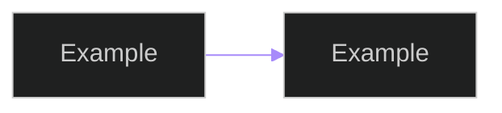

# Mermaid Style System

Use this style contract across all architecture diagrams so docs remain visually consistent with `README.md`.

## Canonical Mermaid Init Block

```text
%%{init: {'theme': 'dark', 'themeVariables': {'primaryColor': '#7C3AED', 'lineColor': '#A78BFA'}}}%%
```

## Usage Rule

Every Mermaid block should start with:



## Semantic Grouping Conventions

- **Edge/Gateway**: nginx, go2rtc, stream relay components.
- **Application**: Django APIs, Channels, Celery, policy services.
- **AI/Inference**: Triton, local runtimes, tracking/ReID stages.
- **State**: PostgreSQL, Redis, media/artifact storage.

## Diagram Consistency Rules

1. Keep flow direction explicit (left-to-right for path docs, top-to-bottom for topology).
2. Use implementation names when possible (`runtime_policy.py`, `model_route_service.py`).
3. Show fallback edges for Triton/local routing where runtime policy applies.
4. Keep Redis vs PostgreSQL responsibilities explicit in diagrams.
