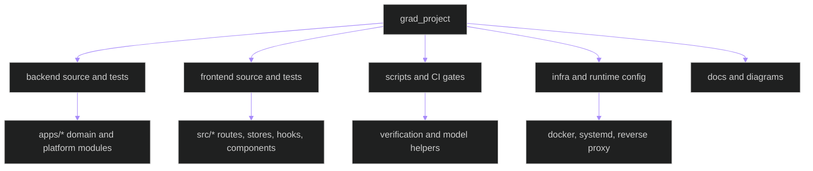

# Source File Mirror

Generated from the current repository inventory on 2026-05-09. This mirrors project-owned source, tests, scripts, infrastructure, and generated documentation pages by area and role.

## Inventory Flow

## Counts By Area

| Area | Files |
|------|-------|
| Backend domain app source | 111 |
| Backend pipeline source | 51 |
| Backend platform source | 25 |
| Backend tracking source | 15 |
| Backend video analysis source | 19 |
| Documentation | 415 |
| Frontend API source | 12 |
| Frontend component source | 41 |
| Frontend hook source | 11 |
| Frontend page source | 18 |
| Frontend store source | 8 |
| Frontend tests | 33 |
| Frontend type source | 5 |
| Infrastructure | 5 |
| Other project files | 2 |
| Scripts | 6 |

## Backend domain app source

| File | Role |
|------|------|
| `backend/apps/__init__.py` | Python module behavior |
| `backend/apps/accounts/__init__.py` | Python module behavior |
| `backend/apps/accounts/admin_urls.py` | Python module behavior |
| `backend/apps/accounts/apps.py` | Django app registration |
| `backend/apps/accounts/boundary.py` | module boundary declaration |
| `backend/apps/accounts/models.py` | database and ORM shape |
| `backend/apps/accounts/permissions.py` | authorization logic |
| `backend/apps/accounts/serializers.py` | serialization contract |
| `backend/apps/accounts/services.py` | service orchestration |
| `backend/apps/accounts/urls.py` | HTTP route registration |
| `backend/apps/accounts/views.py` | HTTP endpoint behavior |
| `backend/apps/anomalies/README.md` | project file |
| `backend/apps/anomalies/__init__.py` | Python module behavior |
| `backend/apps/anomalies/admin_urls.py` | Python module behavior |
| `backend/apps/anomalies/apps.py` | Django app registration |
| `backend/apps/anomalies/boundary.py` | module boundary declaration |
| `backend/apps/anomalies/consumers.py` | WebSocket consumer behavior |
| `backend/apps/anomalies/models.py` | database and ORM shape |
| `backend/apps/anomalies/routing.py` | WebSocket route registration |
| `backend/apps/anomalies/serializers.py` | serialization contract |
| `backend/apps/anomalies/services.py` | service orchestration |
| `backend/apps/anomalies/urls.py` | HTTP route registration |
| `backend/apps/anomalies/views.py` | HTTP endpoint behavior |
| `backend/apps/audit/__init__.py` | Python module behavior |
| `backend/apps/audit/admin_urls.py` | Python module behavior |
| `backend/apps/audit/apps.py` | Django app registration |
| `backend/apps/audit/boundary.py` | module boundary declaration |
| `backend/apps/audit/middleware.py` | middleware pipeline |
| `backend/apps/audit/models.py` | database and ORM shape |
| `backend/apps/audit/serializers.py` | serialization contract |
| `backend/apps/audit/services.py` | service orchestration |
| `backend/apps/audit/urls.py` | HTTP route registration |
| `backend/apps/audit/views.py` | HTTP endpoint behavior |
| `backend/apps/cameras/README.md` | project file |
| `backend/apps/cameras/__init__.py` | Python module behavior |
| `backend/apps/cameras/admin_urls.py` | Python module behavior |
| `backend/apps/cameras/apps.py` | Django app registration |
| `backend/apps/cameras/boundary.py` | module boundary declaration |
| `backend/apps/cameras/constants.py` | Python module behavior |
| `backend/apps/cameras/consumers.py` | WebSocket consumer behavior |
| `backend/apps/cameras/exceptions.py` | Python module behavior |
| `backend/apps/cameras/fields.py` | Python module behavior |
| `backend/apps/cameras/models.py` | database and ORM shape |
| `backend/apps/cameras/routing.py` | WebSocket route registration |
| `backend/apps/cameras/serializers.py` | serialization contract |
| `backend/apps/cameras/services.py` | service orchestration |
| `backend/apps/cameras/tasks.py` | background task flow |
| `backend/apps/cameras/urls.py` | HTTP route registration |
| `backend/apps/cameras/views.py` | HTTP endpoint behavior |
| `backend/apps/detections/README.md` | project file |
| `backend/apps/detections/__init__.py` | Python module behavior |
| `backend/apps/detections/apps.py` | Django app registration |
| `backend/apps/detections/boundary.py` | module boundary declaration |
| `backend/apps/detections/consumers.py` | WebSocket consumer behavior |
| `backend/apps/detections/models.py` | database and ORM shape |
| `backend/apps/detections/routing.py` | WebSocket route registration |
| `backend/apps/detections/serializers.py` | serialization contract |
| `backend/apps/detections/services.py` | service orchestration |
| `backend/apps/detections/services/detection_service.py` | Python module behavior |
| `backend/apps/detections/urls.py` | HTTP route registration |
| `backend/apps/detections/views.py` | HTTP endpoint behavior |
| `backend/apps/exams/__init__.py` | Python module behavior |
| `backend/apps/exams/admin_urls.py` | Python module behavior |
| `backend/apps/exams/apps.py` | Django app registration |
| `backend/apps/exams/boundary.py` | module boundary declaration |
| `backend/apps/exams/models.py` | database and ORM shape |
| `backend/apps/exams/serializers.py` | serialization contract |
| `backend/apps/exams/urls.py` | HTTP route registration |
| `backend/apps/exams/views.py` | HTTP endpoint behavior |
| `backend/apps/exports/__init__.py` | Python module behavior |
| `backend/apps/exports/apps.py` | Django app registration |
| `backend/apps/exports/boundary.py` | module boundary declaration |
| `backend/apps/exports/models.py` | database and ORM shape |
| `backend/apps/exports/serializers.py` | serialization contract |
| `backend/apps/exports/services.py` | service orchestration |
| `backend/apps/exports/tasks.py` | background task flow |
| `backend/apps/exports/urls.py` | HTTP route registration |
| `backend/apps/exports/views.py` | HTTP endpoint behavior |
| `backend/apps/health/README.md` | project file |
| `backend/apps/health/__init__.py` | Python module behavior |
| `backend/apps/health/apps.py` | Django app registration |
| `backend/apps/health/boundary.py` | module boundary declaration |
| `backend/apps/health/consumers.py` | WebSocket consumer behavior |
| `backend/apps/health/model_serving_health.py` | Python module behavior |
| `backend/apps/health/routing.py` | WebSocket route registration |
| `backend/apps/health/services.py` | service orchestration |
| `backend/apps/health/services/model_serving_health.py` | Python module behavior |
| `backend/apps/health/urls.py` | HTTP route registration |
| `backend/apps/health/views.py` | HTTP endpoint behavior |
| `backend/apps/recordings/__init__.py` | Python module behavior |
| `backend/apps/recordings/admin_urls.py` | Python module behavior |
| `backend/apps/recordings/apps.py` | Django app registration |
| `backend/apps/recordings/boundary.py` | module boundary declaration |
| `backend/apps/recordings/models.py` | database and ORM shape |
| `backend/apps/recordings/serializers.py` | serialization contract |
| `backend/apps/recordings/services.py` | service orchestration |
| `backend/apps/recordings/urls.py` | HTTP route registration |
| `backend/apps/recordings/views.py` | HTTP endpoint behavior |
| `backend/apps/sessions/README.md` | project file |
| `backend/apps/sessions/__init__.py` | Python module behavior |
| `backend/apps/sessions/admin_urls.py` | Python module behavior |
| `backend/apps/sessions/apps.py` | Django app registration |
| `backend/apps/sessions/boundary.py` | module boundary declaration |
| `backend/apps/sessions/consumers.py` | WebSocket consumer behavior |
| `backend/apps/sessions/dashboard_urls.py` | Python module behavior |
| `backend/apps/sessions/models.py` | database and ORM shape |
| `backend/apps/sessions/routing.py` | WebSocket route registration |
| `backend/apps/sessions/serializers.py` | serialization contract |
| `backend/apps/sessions/services.py` | service orchestration |
| `backend/apps/sessions/urls.py` | HTTP route registration |
| `backend/apps/sessions/views.py` | HTTP endpoint behavior |

## Backend pipeline source

| File | Role |
|------|------|
| `backend/apps/pipeline/README.md` | project file |
| `backend/apps/pipeline/__init__.py` | Python module behavior |
| `backend/apps/pipeline/apps.py` | Django app registration |
| `backend/apps/pipeline/audit_schema.py` | Python module behavior |
| `backend/apps/pipeline/base.py` | Python module behavior |
| `backend/apps/pipeline/boundary.py` | module boundary declaration |
| `backend/apps/pipeline/config.py` | Python module behavior |
| `backend/apps/pipeline/contracts.py` | Python module behavior |
| `backend/apps/pipeline/cropper.py` | Python module behavior |
| `backend/apps/pipeline/detector.py` | Python module behavior |
| `backend/apps/pipeline/exceptions.py` | Python module behavior |
| `backend/apps/pipeline/exporter.py` | Python module behavior |
| `backend/apps/pipeline/layers/README.md` | project file |
| `backend/apps/pipeline/layers/__init__.py` | Python module behavior |
| `backend/apps/pipeline/layers/base_behavior.py` | Python module behavior |
| `backend/apps/pipeline/layers/depth_gaze.py` | Python module behavior |
| `backend/apps/pipeline/layers/horizontal_gaze.py` | Python module behavior |
| `backend/apps/pipeline/layers/posture.py` | Python module behavior |
| `backend/apps/pipeline/layers/vertical_gaze.py` | Python module behavior |
| `backend/apps/pipeline/merger.py` | Python module behavior |
| `backend/apps/pipeline/model_lifecycle/README.md` | project file |
| `backend/apps/pipeline/model_lifecycle/__init__.py` | Python module behavior |
| `backend/apps/pipeline/model_lifecycle/benchmark_orchestrator.py` | Python module behavior |
| `backend/apps/pipeline/model_lifecycle/benchmark_runner.py` | Python module behavior |
| `backend/apps/pipeline/model_lifecycle/capabilities.py` | Python module behavior |
| `backend/apps/pipeline/model_lifecycle/deployment_matrix.py` | Python module behavior |
| `backend/apps/pipeline/model_lifecycle/explainability.py` | Python module behavior |
| `backend/apps/pipeline/model_lifecycle/export_orchestrator.py` | Python module behavior |
| `backend/apps/pipeline/model_lifecycle/export_worker.py` | Python module behavior |
| `backend/apps/pipeline/model_lifecycle/inventory.py` | Python module behavior |
| `backend/apps/pipeline/model_lifecycle/metrics.py` | Python module behavior |
| `backend/apps/pipeline/model_lifecycle/triton_adapter.py` | Python module behavior |
| `backend/apps/pipeline/model_lifecycle/visualizations.py` | Python module behavior |
| `backend/apps/pipeline/models.py` | database and ORM shape |
| `backend/apps/pipeline/multi_model.py` | Python module behavior |
| `backend/apps/pipeline/openvino_compat.py` | Python module behavior |
| `backend/apps/pipeline/pipeline_service.py` | Python module behavior |
| `backend/apps/pipeline/results.py` | Python module behavior |
| `backend/apps/pipeline/rule_engine.py` | Python module behavior |
| `backend/apps/pipeline/schemas/__init__.py` | Python module behavior |
| `backend/apps/pipeline/schemas/triton.py` | Python module behavior |
| `backend/apps/pipeline/services.py` | service orchestration |
| `backend/apps/pipeline/services/__init__.py` | Python module behavior |
| `backend/apps/pipeline/services/base_inference_client.py` | Python module behavior |
| `backend/apps/pipeline/services/degradation_service.py` | Python module behavior |
| `backend/apps/pipeline/services/inference_client_factory.py` | Python module behavior |
| `backend/apps/pipeline/services/model_route_service.py` | Python module behavior |
| `backend/apps/pipeline/services/runtime_policy.py` | Python module behavior |
| `backend/apps/pipeline/services/triton_client.py` | Python module behavior |
| `backend/apps/pipeline/tracker.py` | Python module behavior |
| `backend/apps/pipeline/utils.py` | Python module behavior |

## Backend platform source

| File | Role |
|------|------|
| `backend/config/__init__.py` | Python module behavior |
| `backend/config/asgi.py` | Python module behavior |
| `backend/config/celery.py` | Python module behavior |
| `backend/config/settings/__init__.py` | Python module behavior |
| `backend/config/settings/base.py` | Python module behavior |
| `backend/config/settings/development.py` | Python module behavior |
| `backend/config/settings/production.py` | Python module behavior |
| `backend/config/settings/test.py` | Python module behavior |
| `backend/config/urls.py` | HTTP route registration |
| `backend/config/wsgi.py` | Python module behavior |
| `backend/core/__init__.py` | Python module behavior |
| `backend/core/boundaries.py` | Python module behavior |
| `backend/core/configuration.py` | Python module behavior |
| `backend/core/evidence.py` | Python module behavior |
| `backend/core/exceptions.py` | Python module behavior |
| `backend/core/logger.py` | Python module behavior |
| `backend/core/middleware.py` | middleware pipeline |
| `backend/core/observability.py` | Python module behavior |
| `backend/core/pagination.py` | Python module behavior |
| `backend/core/routers.py` | Python module behavior |
| `backend/core/settings_models.py` | Python module behavior |
| `backend/manage.py` | Python module behavior |
| `backend/tools/export_models.py` | Python module behavior |
| `backend/tools/export_tensorrt_models.py` | Python module behavior |
| `backend/tools/openvino_person_detector.py` | Python module behavior |

## Backend tracking source

| File | Role |
|------|------|
| `backend/apps/tracking/README.md` | project file |
| `backend/apps/tracking/__init__.py` | Python module behavior |
| `backend/apps/tracking/apps.py` | Django app registration |
| `backend/apps/tracking/association.py` | Python module behavior |
| `backend/apps/tracking/boundary.py` | module boundary declaration |
| `backend/apps/tracking/colors.py` | Python module behavior |
| `backend/apps/tracking/embeddings.py` | Python module behavior |
| `backend/apps/tracking/pipeline.py` | Python module behavior |
| `backend/apps/tracking/pipeline_mode.py` | Python module behavior |
| `backend/apps/tracking/reid.py` | Python module behavior |
| `backend/apps/tracking/rendering.py` | Python module behavior |
| `backend/apps/tracking/services/__init__.py` | Python module behavior |
| `backend/apps/tracking/services/tracking_service.py` | Python module behavior |
| `backend/apps/tracking/tracker.py` | Python module behavior |
| `backend/apps/tracking/video_exporter.py` | Python module behavior |

## Backend video analysis source

| File | Role |
|------|------|
| `backend/apps/video_analysis/README.md` | project file |
| `backend/apps/video_analysis/__init__.py` | Python module behavior |
| `backend/apps/video_analysis/admin.py` | Python module behavior |
| `backend/apps/video_analysis/apps.py` | Django app registration |
| `backend/apps/video_analysis/boundary.py` | module boundary declaration |
| `backend/apps/video_analysis/consumers.py` | WebSocket consumer behavior |
| `backend/apps/video_analysis/management/__init__.py` | Python module behavior |
| `backend/apps/video_analysis/management/commands/__init__.py` | Python module behavior |
| `backend/apps/video_analysis/management/commands/flush_video_jobs.py` | Python module behavior |
| `backend/apps/video_analysis/management/commands/validate_inference_runtime.py` | Python module behavior |
| `backend/apps/video_analysis/management/commands/validate_preview.py` | Python module behavior |
| `backend/apps/video_analysis/metrics.py` | Python module behavior |
| `backend/apps/video_analysis/models.py` | database and ORM shape |
| `backend/apps/video_analysis/routing.py` | WebSocket route registration |
| `backend/apps/video_analysis/serializers.py` | serialization contract |
| `backend/apps/video_analysis/services/inference_orchestrator.py` | Python module behavior |
| `backend/apps/video_analysis/tasks.py` | background task flow |
| `backend/apps/video_analysis/urls.py` | HTTP route registration |
| `backend/apps/video_analysis/views.py` | HTTP endpoint behavior |

## Documentation

| File | Role |
|------|------|
| `docs/ARCHITECTURE.md` | documentation/specification |
| `docs/External Resources/Anomaly ML Layer/pre-db-plan.md` | documentation/specification |
| `docs/External Resources/Anomaly ML Layer/pre-plan.md` | documentation/specification |
| `docs/External Resources/Anomaly ML Layer/risk_engine_score.md` | documentation/specification |
| `docs/External Resources/Intel_GPU_Instructions_Hardware_Compatibility_matrix.md` | documentation/specification |
| `docs/External Resources/export_skill.md` | documentation/specification |
| `docs/External Resources/ultralytics_docs.md` | documentation/specification |
| `docs/External Resources/ultralytics_openvino_integration_docs.md` | documentation/specification |
| `docs/INDEX.md` | documentation/specification |
| `docs/architecture/compatibility-contracts.md` | documentation/specification |
| `docs/architecture/coupling-risk-register.md` | documentation/specification |
| `docs/architecture/documentation-diagram-coverage.md` | documentation/specification |
| `docs/architecture/modular-system-overview.md` | documentation/specification |
| `docs/architecture/module-boundary-map.md` | documentation/specification |
| `docs/architecture/runtime-scenario-matrix.md` | documentation/specification |
| `docs/backend/JOB_STATE_DIAGRAM.md` | documentation/specification |
| `docs/backend/VIDEO_UPLOAD_SEQUENCE.md` | documentation/specification |
| `docs/backend/api/README.md` | documentation/specification |
| `docs/backend/apps/__init__.md` | documentation/specification |
| `docs/backend/apps/accounts/__init__.md` | documentation/specification |
| `docs/backend/apps/accounts/admin_urls.md` | documentation/specification |
| `docs/backend/apps/accounts/apps.md` | documentation/specification |
| `docs/backend/apps/accounts/boundary.md` | documentation/specification |
| `docs/backend/apps/accounts/models.md` | documentation/specification |
| `docs/backend/apps/accounts/permissions.md` | documentation/specification |
| `docs/backend/apps/accounts/serializers.md` | documentation/specification |
| `docs/backend/apps/accounts/services.md` | documentation/specification |
| `docs/backend/apps/accounts/urls.md` | documentation/specification |
| `docs/backend/apps/accounts/views.md` | documentation/specification |
| `docs/backend/apps/anomalies/README.md` | documentation/specification |
| `docs/backend/apps/anomalies/__init__.md` | documentation/specification |
| `docs/backend/apps/anomalies/admin_urls.md` | documentation/specification |
| `docs/backend/apps/anomalies/apps.md` | documentation/specification |
| `docs/backend/apps/anomalies/boundary.md` | documentation/specification |
| `docs/backend/apps/anomalies/consumers.md` | documentation/specification |
| `docs/backend/apps/anomalies/models.md` | documentation/specification |
| `docs/backend/apps/anomalies/routing.md` | documentation/specification |
| `docs/backend/apps/anomalies/serializers.md` | documentation/specification |
| `docs/backend/apps/anomalies/services.md` | documentation/specification |
| `docs/backend/apps/anomalies/urls.md` | documentation/specification |
| `docs/backend/apps/anomalies/views.md` | documentation/specification |
| `docs/backend/apps/audit/__init__.md` | documentation/specification |
| `docs/backend/apps/audit/admin_urls.md` | documentation/specification |
| `docs/backend/apps/audit/apps.md` | documentation/specification |
| `docs/backend/apps/audit/boundary.md` | documentation/specification |
| `docs/backend/apps/audit/middleware.md` | documentation/specification |
| `docs/backend/apps/audit/models.md` | documentation/specification |
| `docs/backend/apps/audit/serializers.md` | documentation/specification |
| `docs/backend/apps/audit/services.md` | documentation/specification |
| `docs/backend/apps/audit/urls.md` | documentation/specification |
| `docs/backend/apps/audit/views.md` | documentation/specification |
| `docs/backend/apps/cameras/README.md` | documentation/specification |
| `docs/backend/apps/cameras/__init__.md` | documentation/specification |
| `docs/backend/apps/cameras/admin_urls.md` | documentation/specification |
| `docs/backend/apps/cameras/apps.md` | documentation/specification |
| `docs/backend/apps/cameras/boundary.md` | documentation/specification |
| `docs/backend/apps/cameras/constants.md` | documentation/specification |
| `docs/backend/apps/cameras/consumers.md` | documentation/specification |
| `docs/backend/apps/cameras/exceptions.md` | documentation/specification |
| `docs/backend/apps/cameras/fields.md` | documentation/specification |
| `docs/backend/apps/cameras/models.md` | documentation/specification |
| `docs/backend/apps/cameras/routing.md` | documentation/specification |
| `docs/backend/apps/cameras/serializers.md` | documentation/specification |
| `docs/backend/apps/cameras/services.md` | documentation/specification |
| `docs/backend/apps/cameras/tasks.md` | documentation/specification |
| `docs/backend/apps/cameras/urls.md` | documentation/specification |
| `docs/backend/apps/cameras/views.md` | documentation/specification |
| `docs/backend/apps/detections/README.md` | documentation/specification |
| `docs/backend/apps/detections/__init__.md` | documentation/specification |
| `docs/backend/apps/detections/apps.md` | documentation/specification |
| `docs/backend/apps/detections/boundary.md` | documentation/specification |
| `docs/backend/apps/detections/consumers.md` | documentation/specification |
| `docs/backend/apps/detections/models.md` | documentation/specification |
| `docs/backend/apps/detections/routing.md` | documentation/specification |
| `docs/backend/apps/detections/serializers.md` | documentation/specification |
| `docs/backend/apps/detections/services.md` | documentation/specification |
| `docs/backend/apps/detections/services/detection_service.md` | documentation/specification |
| `docs/backend/apps/detections/urls.md` | documentation/specification |
| `docs/backend/apps/detections/views.md` | documentation/specification |
| `docs/backend/apps/exams/__init__.md` | documentation/specification |
| `docs/backend/apps/exams/admin_urls.md` | documentation/specification |
| `docs/backend/apps/exams/apps.md` | documentation/specification |
| `docs/backend/apps/exams/boundary.md` | documentation/specification |
| `docs/backend/apps/exams/models.md` | documentation/specification |
| `docs/backend/apps/exams/serializers.md` | documentation/specification |
| `docs/backend/apps/exams/urls.md` | documentation/specification |
| `docs/backend/apps/exams/views.md` | documentation/specification |
| `docs/backend/apps/exports/__init__.md` | documentation/specification |
| `docs/backend/apps/exports/apps.md` | documentation/specification |
| `docs/backend/apps/exports/boundary.md` | documentation/specification |
| `docs/backend/apps/exports/models.md` | documentation/specification |
| `docs/backend/apps/exports/serializers.md` | documentation/specification |
| `docs/backend/apps/exports/services.md` | documentation/specification |
| `docs/backend/apps/exports/tasks.md` | documentation/specification |
| `docs/backend/apps/exports/urls.md` | documentation/specification |
| `docs/backend/apps/exports/views.md` | documentation/specification |
| `docs/backend/apps/health/README.md` | documentation/specification |
| `docs/backend/apps/health/__init__.md` | documentation/specification |
| `docs/backend/apps/health/apps.md` | documentation/specification |
| `docs/backend/apps/health/boundary.md` | documentation/specification |
| `docs/backend/apps/health/consumers.md` | documentation/specification |
| `docs/backend/apps/health/model_serving_health.md` | documentation/specification |
| `docs/backend/apps/health/routing.md` | documentation/specification |
| `docs/backend/apps/health/services.md` | documentation/specification |
| `docs/backend/apps/health/services/model_serving_health.md` | documentation/specification |
| `docs/backend/apps/health/urls.md` | documentation/specification |
| `docs/backend/apps/health/views.md` | documentation/specification |
| `docs/backend/apps/pipeline/README.md` | documentation/specification |
| `docs/backend/apps/pipeline/__init__.md` | documentation/specification |
| `docs/backend/apps/pipeline/apps.md` | documentation/specification |
| `docs/backend/apps/pipeline/audit_schema.md` | documentation/specification |
| `docs/backend/apps/pipeline/base.md` | documentation/specification |
| `docs/backend/apps/pipeline/boundary.md` | documentation/specification |
| `docs/backend/apps/pipeline/config.md` | documentation/specification |
| `docs/backend/apps/pipeline/contracts.md` | documentation/specification |
| `docs/backend/apps/pipeline/cropper.md` | documentation/specification |
| `docs/backend/apps/pipeline/detector.md` | documentation/specification |
| `docs/backend/apps/pipeline/exceptions.md` | documentation/specification |
| `docs/backend/apps/pipeline/exporter.md` | documentation/specification |
| `docs/backend/apps/pipeline/layers/README.md` | documentation/specification |
| `docs/backend/apps/pipeline/layers/__init__.md` | documentation/specification |
| `docs/backend/apps/pipeline/layers/base_behavior.md` | documentation/specification |
| `docs/backend/apps/pipeline/layers/depth_gaze.md` | documentation/specification |
| `docs/backend/apps/pipeline/layers/horizontal_gaze.md` | documentation/specification |
| `docs/backend/apps/pipeline/layers/posture.md` | documentation/specification |
| `docs/backend/apps/pipeline/layers/vertical_gaze.md` | documentation/specification |
| `docs/backend/apps/pipeline/merger.md` | documentation/specification |
| `docs/backend/apps/pipeline/model_lifecycle/README.md` | documentation/specification |
| `docs/backend/apps/pipeline/model_lifecycle/__init__.md` | documentation/specification |
| `docs/backend/apps/pipeline/model_lifecycle/benchmark_orchestrator.md` | documentation/specification |
| `docs/backend/apps/pipeline/model_lifecycle/benchmark_runner.md` | documentation/specification |
| `docs/backend/apps/pipeline/model_lifecycle/capabilities.md` | documentation/specification |
| `docs/backend/apps/pipeline/model_lifecycle/deployment_matrix.md` | documentation/specification |
| `docs/backend/apps/pipeline/model_lifecycle/explainability.md` | documentation/specification |
| `docs/backend/apps/pipeline/model_lifecycle/export_orchestrator.md` | documentation/specification |
| `docs/backend/apps/pipeline/model_lifecycle/export_worker.md` | documentation/specification |
| `docs/backend/apps/pipeline/model_lifecycle/inventory.md` | documentation/specification |
| `docs/backend/apps/pipeline/model_lifecycle/metrics.md` | documentation/specification |
| `docs/backend/apps/pipeline/model_lifecycle/triton_adapter.md` | documentation/specification |
| `docs/backend/apps/pipeline/model_lifecycle/visualizations.md` | documentation/specification |
| `docs/backend/apps/pipeline/models.md` | documentation/specification |
| `docs/backend/apps/pipeline/multi_model.md` | documentation/specification |
| `docs/backend/apps/pipeline/openvino_compat.md` | documentation/specification |
| `docs/backend/apps/pipeline/pipeline_service.md` | documentation/specification |
| `docs/backend/apps/pipeline/results.md` | documentation/specification |
| `docs/backend/apps/pipeline/rule_engine.md` | documentation/specification |
| `docs/backend/apps/pipeline/schemas/__init__.md` | documentation/specification |
| `docs/backend/apps/pipeline/schemas/triton.md` | documentation/specification |
| `docs/backend/apps/pipeline/services.md` | documentation/specification |
| `docs/backend/apps/pipeline/services/__init__.md` | documentation/specification |
| `docs/backend/apps/pipeline/services/base_inference_client.md` | documentation/specification |
| `docs/backend/apps/pipeline/services/degradation_service.md` | documentation/specification |
| `docs/backend/apps/pipeline/services/inference_client_factory.md` | documentation/specification |
| `docs/backend/apps/pipeline/services/model_route_service.md` | documentation/specification |
| `docs/backend/apps/pipeline/services/runtime_policy.md` | documentation/specification |
| `docs/backend/apps/pipeline/services/triton_client.md` | documentation/specification |
| `docs/backend/apps/pipeline/tracker.md` | documentation/specification |
| `docs/backend/apps/pipeline/utils.md` | documentation/specification |
| `docs/backend/apps/recordings/__init__.md` | documentation/specification |
| `docs/backend/apps/recordings/admin_urls.md` | documentation/specification |
| `docs/backend/apps/recordings/apps.md` | documentation/specification |
| `docs/backend/apps/recordings/boundary.md` | documentation/specification |
| `docs/backend/apps/recordings/models.md` | documentation/specification |
| `docs/backend/apps/recordings/serializers.md` | documentation/specification |
| `docs/backend/apps/recordings/services.md` | documentation/specification |
| `docs/backend/apps/recordings/urls.md` | documentation/specification |
| `docs/backend/apps/recordings/views.md` | documentation/specification |
| `docs/backend/apps/sessions/README.md` | documentation/specification |
| `docs/backend/apps/sessions/__init__.md` | documentation/specification |
| `docs/backend/apps/sessions/admin_urls.md` | documentation/specification |
| `docs/backend/apps/sessions/apps.md` | documentation/specification |
| `docs/backend/apps/sessions/boundary.md` | documentation/specification |
| `docs/backend/apps/sessions/consumers.md` | documentation/specification |
| `docs/backend/apps/sessions/dashboard_urls.md` | documentation/specification |
| `docs/backend/apps/sessions/models.md` | documentation/specification |
| `docs/backend/apps/sessions/routing.md` | documentation/specification |
| `docs/backend/apps/sessions/serializers.md` | documentation/specification |
| `docs/backend/apps/sessions/services.md` | documentation/specification |
| `docs/backend/apps/sessions/urls.md` | documentation/specification |
| `docs/backend/apps/sessions/views.md` | documentation/specification |
| `docs/backend/apps/tracking/README.md` | documentation/specification |
| `docs/backend/apps/tracking/__init__.md` | documentation/specification |
| `docs/backend/apps/tracking/apps.md` | documentation/specification |
| `docs/backend/apps/tracking/association.md` | documentation/specification |
| `docs/backend/apps/tracking/boundary.md` | documentation/specification |
| `docs/backend/apps/tracking/class-diagram.md` | documentation/specification |
| `docs/backend/apps/tracking/color-assignment-flowchart.md` | documentation/specification |
| `docs/backend/apps/tracking/colors.md` | documentation/specification |
| `docs/backend/apps/tracking/embeddings.md` | documentation/specification |
| `docs/backend/apps/tracking/pipeline.md` | documentation/specification |
| `docs/backend/apps/tracking/pipeline_mode.md` | documentation/specification |
| `docs/backend/apps/tracking/reid-flowchart.md` | documentation/specification |
| `docs/backend/apps/tracking/reid.md` | documentation/specification |
| `docs/backend/apps/tracking/rendering.md` | documentation/specification |
| `docs/backend/apps/tracking/services/__init__.md` | documentation/specification |
| `docs/backend/apps/tracking/services/tracking_service.md` | documentation/specification |
| `docs/backend/apps/tracking/tracker.md` | documentation/specification |
| `docs/backend/apps/tracking/video_exporter.md` | documentation/specification |
| `docs/backend/apps/video_analysis/README.md` | documentation/specification |
| `docs/backend/apps/video_analysis/__init__.md` | documentation/specification |
| `docs/backend/apps/video_analysis/admin.md` | documentation/specification |
| `docs/backend/apps/video_analysis/apps.md` | documentation/specification |
| `docs/backend/apps/video_analysis/boundary.md` | documentation/specification |
| `docs/backend/apps/video_analysis/consumers.md` | documentation/specification |
| `docs/backend/apps/video_analysis/data-model-diagram.md` | documentation/specification |
| `docs/backend/apps/video_analysis/management/__init__.md` | documentation/specification |
| `docs/backend/apps/video_analysis/management/commands/__init__.md` | documentation/specification |
| `docs/backend/apps/video_analysis/management/commands/flush_video_jobs.md` | documentation/specification |
| `docs/backend/apps/video_analysis/management/commands/validate_inference_runtime.md` | documentation/specification |
| `docs/backend/apps/video_analysis/management/commands/validate_preview.md` | documentation/specification |
| `docs/backend/apps/video_analysis/metrics.md` | documentation/specification |
| `docs/backend/apps/video_analysis/models.md` | documentation/specification |
| `docs/backend/apps/video_analysis/routing.md` | documentation/specification |
| `docs/backend/apps/video_analysis/serializers.md` | documentation/specification |
| `docs/backend/apps/video_analysis/services/inference_orchestrator.md` | documentation/specification |
| `docs/backend/apps/video_analysis/tasks.md` | documentation/specification |
| `docs/backend/apps/video_analysis/urls.md` | documentation/specification |
| `docs/backend/apps/video_analysis/views.md` | documentation/specification |
| `docs/backend/architecture/data-flow.md` | documentation/specification |
| `docs/backend/architecture/deployment-topology.md` | documentation/specification |
| `docs/backend/architecture/observability-runbook.md` | documentation/specification |
| `docs/backend/architecture/triton-operations.md` | documentation/specification |
| `docs/backend/config/__init__.md` | documentation/specification |
| `docs/backend/config/asgi.md` | documentation/specification |
| `docs/backend/config/celery.md` | documentation/specification |
| `docs/backend/config/settings.md` | documentation/specification |
| `docs/backend/config/settings/__init__.md` | documentation/specification |
| `docs/backend/config/settings/base.md` | documentation/specification |
| `docs/backend/config/settings/development.md` | documentation/specification |
| `docs/backend/config/settings/production.md` | documentation/specification |
| `docs/backend/config/settings/test.md` | documentation/specification |
| `docs/backend/config/urls.md` | documentation/specification |
| `docs/backend/config/wsgi.md` | documentation/specification |
| `docs/backend/core/__init__.md` | documentation/specification |
| `docs/backend/core/boundaries.md` | documentation/specification |
| `docs/backend/core/configuration.md` | documentation/specification |
| `docs/backend/core/evidence.md` | documentation/specification |
| `docs/backend/core/exceptions.md` | documentation/specification |
| `docs/backend/core/logger.md` | documentation/specification |
| `docs/backend/core/middleware.md` | documentation/specification |
| `docs/backend/core/observability.md` | documentation/specification |
| `docs/backend/core/pagination.md` | documentation/specification |
| `docs/backend/core/routers.md` | documentation/specification |
| `docs/backend/core/settings_models.md` | documentation/specification |
| `docs/backend/manage.md` | documentation/specification |
| `docs/backend/testing/ci-policy.md` | documentation/specification |
| `docs/backend/testing/onboarding-baseline.md` | documentation/specification |
| `docs/backend/testing/real-data-test-policy.md` | documentation/specification |
| `docs/backend/testing/release-quality-tracker.md` | documentation/specification |
| `docs/backend/tests/contract/test_coupling_risk_register.md` | documentation/specification |
| `docs/backend/tests/contract/test_dependency_direction.md` | documentation/specification |
| `docs/backend/tests/contract/test_documentation_diagram_contract.md` | documentation/specification |
| `docs/backend/tests/contract/test_module_boundary_contracts.md` | documentation/specification |
| `docs/backend/tests/contract/test_native_linux_deployment_contract.md` | documentation/specification |
| `docs/backend/tests/contract/test_runtime_scenario_contracts.md` | documentation/specification |
| `docs/backend/tests/integration/test_boundary_docs_alignment.md` | documentation/specification |
| `docs/backend/tests/integration/test_docs_contract_alignment.md` | documentation/specification |
| `docs/backend/tests/integration/test_full_delivered_baseline.md` | documentation/specification |
| `docs/backend/tests/integration/test_modular_failure_boundaries.md` | documentation/specification |
| `docs/backend/tests/integration/test_modular_inference_contract.md` | documentation/specification |
| `docs/backend/tests/system/test_live_stream_modular_equivalence.md` | documentation/specification |
| `docs/backend/tests/system/test_offline_video_modular_equivalence.md` | documentation/specification |
| `docs/backend/tests/unit/docs/test_docs_link_and_mermaid_validation.md` | documentation/specification |
| `docs/backend/tests/unit/docs/test_documentation_diagram_coverage.md` | documentation/specification |
| `docs/backend/tests/unit/test_backend_boundary_declarations.md` | documentation/specification |
| `docs/backend/tests/unit/tracking/test_modular_contract_isolation.md` | documentation/specification |
| `docs/backend/tests/utils/workflow_baseline.md` | documentation/specification |
| `docs/backend/tools/export_models.md` | documentation/specification |
| `docs/backend/tools/export_tensorrt_models.md` | documentation/specification |
| `docs/backend/tools/openvino_person_detector.md` | documentation/specification |
| `docs/diagrams/SOURCE_FILE_MIRROR.md` | documentation/specification |
| `docs/diagrams/SYSTEM_MERMAID_ATLAS.md` | documentation/specification |
| `docs/docker-compose.dev.md` | documentation/specification |
| `docs/frontend/eslint.config.md` | documentation/specification |
| `docs/frontend/src/App.md` | documentation/specification |
| `docs/frontend/src/api/README.md` | documentation/specification |
| `docs/frontend/src/api/anomalies.md` | documentation/specification |
| `docs/frontend/src/api/auth.md` | documentation/specification |
| `docs/frontend/src/api/cameras.md` | documentation/specification |
| `docs/frontend/src/api/client.md` | documentation/specification |
| `docs/frontend/src/api/dashboard.md` | documentation/specification |
| `docs/frontend/src/api/detections.md` | documentation/specification |
| `docs/frontend/src/api/exports.md` | documentation/specification |
| `docs/frontend/src/api/health.md` | documentation/specification |
| `docs/frontend/src/api/recordings.md` | documentation/specification |
| `docs/frontend/src/api/sessions.md` | documentation/specification |
| `docs/frontend/src/api/videoAnalysis.md` | documentation/specification |
| `docs/frontend/src/components/ModelVisibilityToggles/ModelVisibilityToggles.md` | documentation/specification |
| `docs/frontend/src/components/PreviewPlayer.md` | documentation/specification |
| `docs/frontend/src/components/README.md` | documentation/specification |
| `docs/frontend/src/components/VideoPlayer/VideoPlayer.md` | documentation/specification |
| `docs/frontend/src/components/VideoUploadTab/JobsList.md` | documentation/specification |
| `docs/frontend/src/components/VideoUploadTab/VideoUploadTab.md` | documentation/specification |
| `docs/frontend/src/components/anomaly/AlertHistory.md` | documentation/specification |
| `docs/frontend/src/components/anomaly/AnomalyAlert.md` | documentation/specification |
| `docs/frontend/src/components/anomaly/TriageActions.md` | documentation/specification |
| `docs/frontend/src/components/auth/RouteGuards.md` | documentation/specification |
| `docs/frontend/src/components/camera/AddCameraDialog.md` | documentation/specification |
| `docs/frontend/src/components/camera/BoundingBoxCanvas.md` | documentation/specification |
| `docs/frontend/src/components/camera/CameraFeed.md` | documentation/specification |
| `docs/frontend/src/components/camera/CameraGrid.md` | documentation/specification |
| `docs/frontend/src/components/camera/CameraStatusBadge.md` | documentation/specification |
| `docs/frontend/src/components/camera/ClassFilterPanel.md` | documentation/specification |
| `docs/frontend/src/components/camera/ConnectionProgress.md` | documentation/specification |
| `docs/frontend/src/components/camera/ErrorBanner.md` | documentation/specification |
| `docs/frontend/src/components/camera/README.md` | documentation/specification |
| `docs/frontend/src/components/detection/PredictionsPanel.md` | documentation/specification |
| `docs/frontend/src/components/detection/StudentCard.md` | documentation/specification |
| `docs/frontend/src/components/detection/VideoPredictionDisplay.md` | documentation/specification |
| `docs/frontend/src/components/detection/VideoUploadForm.md` | documentation/specification |
| `docs/frontend/src/components/health/HealthPanel.md` | documentation/specification |
| `docs/frontend/src/components/layout/AppLayout.md` | documentation/specification |
| `docs/frontend/src/components/layout/Header.md` | documentation/specification |
| `docs/frontend/src/components/layout/Sidebar.md` | documentation/specification |
| `docs/frontend/src/components/layout/StorageWarningBanner.md` | documentation/specification |
| `docs/frontend/src/components/layout/ThemeSelector.md` | documentation/specification |
| `docs/frontend/src/components/recording/AnomalyTimeline.md` | documentation/specification |
| `docs/frontend/src/components/recording/ExportButton.md` | documentation/specification |
| `docs/frontend/src/components/recording/RecordingList.md` | documentation/specification |
| `docs/frontend/src/components/recording/RecordingPlayer.md` | documentation/specification |
| `docs/frontend/src/components/ui/Button.md` | documentation/specification |
| `docs/frontend/src/components/ui/Card.md` | documentation/specification |
| `docs/frontend/src/components/ui/ErrorBoundary.md` | documentation/specification |
| `docs/frontend/src/components/ui/FormInput.md` | documentation/specification |
| `docs/frontend/src/components/ui/LoadingSpinner.md` | documentation/specification |
| `docs/frontend/src/components/ui/Modal.md` | documentation/specification |
| `docs/frontend/src/components/ui/StatusBadge.md` | documentation/specification |
| `docs/frontend/src/components/ui/Toggle.md` | documentation/specification |
| `docs/frontend/src/components/ui/index.md` | documentation/specification |
| `docs/frontend/src/constants/README.md` | documentation/specification |
| `docs/frontend/src/constants/cameraMessages.md` | documentation/specification |
| `docs/frontend/src/hooks/README.md` | documentation/specification |
| `docs/frontend/src/hooks/useAnomalySocket.md` | documentation/specification |
| `docs/frontend/src/hooks/useAuth.md` | documentation/specification |
| `docs/frontend/src/hooks/useBulkFailure.md` | documentation/specification |
| `docs/frontend/src/hooks/useCameraStatus.md` | documentation/specification |
| `docs/frontend/src/hooks/useDetectionSocket.md` | documentation/specification |
| `docs/frontend/src/hooks/useHealthSocket.md` | documentation/specification |
| `docs/frontend/src/hooks/useKeyboardNav.md` | documentation/specification |
| `docs/frontend/src/hooks/useVideoAnalysisLive.md` | documentation/specification |
| `docs/frontend/src/hooks/useWebSocket.md` | documentation/specification |
| `docs/frontend/src/hooks/useWhepClient.md` | documentation/specification |
| `docs/frontend/src/main.md` | documentation/specification |
| `docs/frontend/src/pages/AnomalyListPage.md` | documentation/specification |
| `docs/frontend/src/pages/CameraFeedPage.md` | documentation/specification |
| `docs/frontend/src/pages/CameraListPage.md` | documentation/specification |
| `docs/frontend/src/pages/ChangePasswordPage.md` | documentation/specification |
| `docs/frontend/src/pages/DashboardPage.md` | documentation/specification |
| `docs/frontend/src/pages/HealthPage.md` | documentation/specification |
| `docs/frontend/src/pages/JobDetail.md` | documentation/specification |
| `docs/frontend/src/pages/LoginPage.md` | documentation/specification |
| `docs/frontend/src/pages/NotFoundPage.md` | documentation/specification |
| `docs/frontend/src/pages/PredictionsPage.md` | documentation/specification |
| `docs/frontend/src/pages/RecordingDetailPage.md` | documentation/specification |
| `docs/frontend/src/pages/RecordingsPage.md` | documentation/specification |
| `docs/frontend/src/pages/SessionDetailPage.md` | documentation/specification |
| `docs/frontend/src/pages/SessionListPage.md` | documentation/specification |
| `docs/frontend/src/pages/SettingsPage.md` | documentation/specification |
| `docs/frontend/src/pages/VideoAnalysisPage.md` | documentation/specification |
| `docs/frontend/src/stores/anomalyStore.md` | documentation/specification |
| `docs/frontend/src/stores/authStore.md` | documentation/specification |
| `docs/frontend/src/stores/cameraStore.md` | documentation/specification |
| `docs/frontend/src/stores/detectionStore.md` | documentation/specification |
| `docs/frontend/src/stores/healthStore.md` | documentation/specification |
| `docs/frontend/src/stores/themeStore.md` | documentation/specification |
| `docs/frontend/src/stores/uploadStore.md` | documentation/specification |
| `docs/frontend/src/stores/visibilityStore.md` | documentation/specification |
| `docs/frontend/src/types/api.md` | documentation/specification |
| `docs/frontend/src/types/boundaries.md` | documentation/specification |
| `docs/frontend/src/types/predictions.md` | documentation/specification |
| `docs/frontend/src/types/videoAnalysis.md` | documentation/specification |
| `docs/frontend/src/types/websocket.md` | documentation/specification |
| `docs/frontend/tests/e2e/anomaly-triage.spec.md` | documentation/specification |
| `docs/frontend/tests/e2e/camera-feed.spec.md` | documentation/specification |
| `docs/frontend/tests/e2e/full-baseline.spec.md` | documentation/specification |
| `docs/frontend/tests/e2e/login.spec.md` | documentation/specification |
| `docs/frontend/tests/e2e/recording-playback.spec.md` | documentation/specification |
| `docs/frontend/tests/integration/modular-performance.test.md` | documentation/specification |
| `docs/frontend/tests/integration/performance.test.md` | documentation/specification |
| `docs/frontend/tests/integration/theme.test.md` | documentation/specification |
| `docs/frontend/tests/unit/api/backend-contracts.test.md` | documentation/specification |
| `docs/frontend/tests/unit/api/modular_contracts.test.md` | documentation/specification |
| `docs/frontend/tests/unit/boundaries/frontend-boundaries.test.md` | documentation/specification |
| `docs/frontend/tests/unit/components/DashboardPage.test.md` | documentation/specification |
| `docs/frontend/tests/unit/components/LoginPage.test.md` | documentation/specification |
| `docs/frontend/tests/unit/components/anomaly/AlertHistory.test.md` | documentation/specification |
| `docs/frontend/tests/unit/components/anomaly/TriageActions.test.md` | documentation/specification |
| `docs/frontend/tests/unit/components/camera/AddCameraDialog.test.md` | documentation/specification |
| `docs/frontend/tests/unit/components/camera/BoundingBoxCanvas.test.md` | documentation/specification |
| `docs/frontend/tests/unit/components/camera/BoundingBoxFiltered.test.md` | documentation/specification |
| `docs/frontend/tests/unit/components/camera/CameraGrid.test.md` | documentation/specification |
| `docs/frontend/tests/unit/components/camera/CameraGridFullscreen.test.md` | documentation/specification |
| `docs/frontend/tests/unit/components/camera/ClassFilterPanel.test.md` | documentation/specification |
| `docs/frontend/tests/unit/components/detection/PredictionsPanel.test.md` | documentation/specification |
| `docs/frontend/tests/unit/components/recording/AnomalyTimeline.test.md` | documentation/specification |
| `docs/frontend/tests/unit/components/recording/ExportButton.test.md` | documentation/specification |
| `docs/frontend/tests/unit/components/recording/RecordingPlayer.test.md` | documentation/specification |
| `docs/frontend/tests/unit/components/ui/ui.test.md` | documentation/specification |
| `docs/frontend/tests/unit/hooks/useVideoAnalysisLive.test.md` | documentation/specification |
| `docs/frontend/tests/unit/stores/anomalyStore.test.md` | documentation/specification |
| `docs/frontend/tests/unit/stores/authStore.test.md` | documentation/specification |
| `docs/frontend/tests/unit/stores/cameraStore.test.md` | documentation/specification |
| `docs/frontend/tests/unit/stores/detectionStore.test.md` | documentation/specification |
| `docs/frontend/tests/unit/stores/themeStore.test.md` | documentation/specification |
| `docs/frontend/tests/unit/stores/uploadStore.test.md` | documentation/specification |
| `docs/go2rtc.md` | documentation/specification |
| `docs/infra/docker/triton/Dockerfile.md` | documentation/specification |
| `docs/infra/systemd/triton-server.md` | documentation/specification |
| `docs/nginx.md` | documentation/specification |
| `docs/scripts/ci/verify_docs_diagrams.md` | documentation/specification |
| `docs/scripts/ci/verify_module_boundaries.md` | documentation/specification |
| `docs/scripts/ci/verify_release_gate.md` | documentation/specification |
| `docs/scripts/export-tensorrt-models.md` | documentation/specification |
| `docs/scripts/pull-triton-image.md` | documentation/specification |
| `docs/scripts/sync-triton-tensorrt-repository.md` | documentation/specification |

## Frontend API source

| File | Role |
|------|------|
| `frontend/src/api/README.md` | project file |
| `frontend/src/api/anomalies.ts` | TypeScript module behavior |
| `frontend/src/api/auth.ts` | TypeScript module behavior |
| `frontend/src/api/cameras.ts` | TypeScript module behavior |
| `frontend/src/api/client.ts` | TypeScript module behavior |
| `frontend/src/api/dashboard.ts` | TypeScript module behavior |
| `frontend/src/api/detections.ts` | TypeScript module behavior |
| `frontend/src/api/exports.ts` | TypeScript module behavior |
| `frontend/src/api/health.ts` | TypeScript module behavior |
| `frontend/src/api/recordings.ts` | TypeScript module behavior |
| `frontend/src/api/sessions.ts` | TypeScript module behavior |
| `frontend/src/api/videoAnalysis.ts` | TypeScript module behavior |

## Frontend component source

| File | Role |
|------|------|
| `frontend/src/components/ModelVisibilityToggles/ModelVisibilityToggles.tsx` | TypeScript module behavior |
| `frontend/src/components/PreviewPlayer.tsx` | TypeScript module behavior |
| `frontend/src/components/VideoPlayer/VideoPlayer.tsx` | TypeScript module behavior |
| `frontend/src/components/VideoUploadTab/JobsList.tsx` | TypeScript module behavior |
| `frontend/src/components/VideoUploadTab/VideoUploadTab.tsx` | TypeScript module behavior |
| `frontend/src/components/anomaly/AlertHistory.tsx` | TypeScript module behavior |
| `frontend/src/components/anomaly/AnomalyAlert.tsx` | TypeScript module behavior |
| `frontend/src/components/anomaly/TriageActions.tsx` | TypeScript module behavior |
| `frontend/src/components/auth/RouteGuards.tsx` | TypeScript module behavior |
| `frontend/src/components/camera/AddCameraDialog.tsx` | TypeScript module behavior |
| `frontend/src/components/camera/BoundingBoxCanvas.tsx` | TypeScript module behavior |
| `frontend/src/components/camera/CameraFeed.tsx` | TypeScript module behavior |
| `frontend/src/components/camera/CameraGrid.tsx` | TypeScript module behavior |
| `frontend/src/components/camera/CameraStatusBadge.tsx` | TypeScript module behavior |
| `frontend/src/components/camera/ClassFilterPanel.tsx` | TypeScript module behavior |
| `frontend/src/components/camera/ConnectionProgress.tsx` | TypeScript module behavior |
| `frontend/src/components/camera/ErrorBanner.tsx` | TypeScript module behavior |
| `frontend/src/components/camera/README.md` | project file |
| `frontend/src/components/detection/PredictionsPanel.tsx` | TypeScript module behavior |
| `frontend/src/components/detection/StudentCard.tsx` | TypeScript module behavior |
| `frontend/src/components/detection/VideoPredictionDisplay.tsx` | TypeScript module behavior |
| `frontend/src/components/detection/VideoUploadForm.tsx` | TypeScript module behavior |
| `frontend/src/components/health/HealthPanel.tsx` | TypeScript module behavior |
| `frontend/src/components/layout/AppLayout.tsx` | TypeScript module behavior |
| `frontend/src/components/layout/Header.tsx` | TypeScript module behavior |
| `frontend/src/components/layout/Sidebar.tsx` | TypeScript module behavior |
| `frontend/src/components/layout/StorageWarningBanner.tsx` | TypeScript module behavior |
| `frontend/src/components/layout/ThemeSelector.tsx` | TypeScript module behavior |
| `frontend/src/components/recording/AnomalyTimeline.tsx` | TypeScript module behavior |
| `frontend/src/components/recording/ExportButton.tsx` | TypeScript module behavior |
| `frontend/src/components/recording/RecordingList.tsx` | TypeScript module behavior |
| `frontend/src/components/recording/RecordingPlayer.tsx` | TypeScript module behavior |
| `frontend/src/components/ui/Button.tsx` | TypeScript module behavior |
| `frontend/src/components/ui/Card.tsx` | TypeScript module behavior |
| `frontend/src/components/ui/ErrorBoundary.tsx` | TypeScript module behavior |
| `frontend/src/components/ui/FormInput.tsx` | TypeScript module behavior |
| `frontend/src/components/ui/LoadingSpinner.tsx` | TypeScript module behavior |
| `frontend/src/components/ui/Modal.tsx` | TypeScript module behavior |
| `frontend/src/components/ui/StatusBadge.tsx` | TypeScript module behavior |
| `frontend/src/components/ui/Toggle.tsx` | TypeScript module behavior |
| `frontend/src/components/ui/index.ts` | TypeScript module behavior |

## Frontend hook source

| File | Role |
|------|------|
| `frontend/src/hooks/README.md` | project file |
| `frontend/src/hooks/useAnomalySocket.ts` | TypeScript module behavior |
| `frontend/src/hooks/useAuth.ts` | TypeScript module behavior |
| `frontend/src/hooks/useBulkFailure.ts` | TypeScript module behavior |
| `frontend/src/hooks/useCameraStatus.ts` | TypeScript module behavior |
| `frontend/src/hooks/useDetectionSocket.ts` | TypeScript module behavior |
| `frontend/src/hooks/useHealthSocket.ts` | TypeScript module behavior |
| `frontend/src/hooks/useKeyboardNav.ts` | TypeScript module behavior |
| `frontend/src/hooks/useVideoAnalysisLive.ts` | TypeScript module behavior |
| `frontend/src/hooks/useWebSocket.ts` | TypeScript module behavior |
| `frontend/src/hooks/useWhepClient.ts` | TypeScript module behavior |

## Frontend page source

| File | Role |
|------|------|
| `frontend/src/App.tsx` | route shell and top-level composition |
| `frontend/src/main.tsx` | frontend bootstrap entrypoint |
| `frontend/src/pages/AnomalyListPage.tsx` | TypeScript module behavior |
| `frontend/src/pages/CameraFeedPage.tsx` | TypeScript module behavior |
| `frontend/src/pages/CameraListPage.tsx` | TypeScript module behavior |
| `frontend/src/pages/ChangePasswordPage.tsx` | TypeScript module behavior |
| `frontend/src/pages/DashboardPage.tsx` | TypeScript module behavior |
| `frontend/src/pages/HealthPage.tsx` | TypeScript module behavior |
| `frontend/src/pages/JobDetail.tsx` | TypeScript module behavior |
| `frontend/src/pages/LoginPage.tsx` | TypeScript module behavior |
| `frontend/src/pages/NotFoundPage.tsx` | TypeScript module behavior |
| `frontend/src/pages/PredictionsPage.tsx` | TypeScript module behavior |
| `frontend/src/pages/RecordingDetailPage.tsx` | TypeScript module behavior |
| `frontend/src/pages/RecordingsPage.tsx` | TypeScript module behavior |
| `frontend/src/pages/SessionDetailPage.tsx` | TypeScript module behavior |
| `frontend/src/pages/SessionListPage.tsx` | TypeScript module behavior |
| `frontend/src/pages/SettingsPage.tsx` | TypeScript module behavior |
| `frontend/src/pages/VideoAnalysisPage.tsx` | TypeScript module behavior |

## Frontend store source

| File | Role |
|------|------|
| `frontend/src/stores/anomalyStore.ts` | TypeScript module behavior |
| `frontend/src/stores/authStore.ts` | TypeScript module behavior |
| `frontend/src/stores/cameraStore.ts` | TypeScript module behavior |
| `frontend/src/stores/detectionStore.ts` | TypeScript module behavior |
| `frontend/src/stores/healthStore.ts` | TypeScript module behavior |
| `frontend/src/stores/themeStore.ts` | TypeScript module behavior |
| `frontend/src/stores/uploadStore.ts` | TypeScript module behavior |
| `frontend/src/stores/visibilityStore.ts` | TypeScript module behavior |

## Frontend tests

| File | Role |
|------|------|
| `frontend/tests/e2e/anomaly-triage.spec.ts` | test/regression coverage |
| `frontend/tests/e2e/camera-feed.spec.ts` | test/regression coverage |
| `frontend/tests/e2e/full-baseline.spec.ts` | test/regression coverage |
| `frontend/tests/e2e/login.spec.ts` | test/regression coverage |
| `frontend/tests/e2e/recording-playback.spec.ts` | test/regression coverage |
| `frontend/tests/integration/modular-performance.test.ts` | test/regression coverage |
| `frontend/tests/integration/performance.test.ts` | test/regression coverage |
| `frontend/tests/integration/theme.test.tsx` | test/regression coverage |
| `frontend/tests/unit/api/backend-contracts.test.ts` | test/regression coverage |
| `frontend/tests/unit/api/modular_contracts.test.ts` | test/regression coverage |
| `frontend/tests/unit/boundaries/frontend-boundaries.test.ts` | test/regression coverage |
| `frontend/tests/unit/components/DashboardPage.test.tsx` | test/regression coverage |
| `frontend/tests/unit/components/LoginPage.test.tsx` | test/regression coverage |
| `frontend/tests/unit/components/anomaly/AlertHistory.test.tsx` | test/regression coverage |
| `frontend/tests/unit/components/anomaly/TriageActions.test.tsx` | test/regression coverage |
| `frontend/tests/unit/components/camera/AddCameraDialog.test.tsx` | test/regression coverage |
| `frontend/tests/unit/components/camera/BoundingBoxCanvas.test.tsx` | test/regression coverage |
| `frontend/tests/unit/components/camera/BoundingBoxFiltered.test.tsx` | test/regression coverage |
| `frontend/tests/unit/components/camera/CameraGrid.test.tsx` | test/regression coverage |
| `frontend/tests/unit/components/camera/CameraGridFullscreen.test.tsx` | test/regression coverage |
| `frontend/tests/unit/components/camera/ClassFilterPanel.test.tsx` | test/regression coverage |
| `frontend/tests/unit/components/detection/PredictionsPanel.test.tsx` | test/regression coverage |
| `frontend/tests/unit/components/recording/AnomalyTimeline.test.tsx` | test/regression coverage |
| `frontend/tests/unit/components/recording/ExportButton.test.tsx` | test/regression coverage |
| `frontend/tests/unit/components/recording/RecordingPlayer.test.tsx` | test/regression coverage |
| `frontend/tests/unit/components/ui/ui.test.tsx` | test/regression coverage |
| `frontend/tests/unit/hooks/useVideoAnalysisLive.test.tsx` | test/regression coverage |
| `frontend/tests/unit/stores/anomalyStore.test.ts` | test/regression coverage |
| `frontend/tests/unit/stores/authStore.test.ts` | test/regression coverage |
| `frontend/tests/unit/stores/cameraStore.test.ts` | test/regression coverage |
| `frontend/tests/unit/stores/detectionStore.test.ts` | test/regression coverage |
| `frontend/tests/unit/stores/themeStore.test.ts` | test/regression coverage |
| `frontend/tests/unit/stores/uploadStore.test.ts` | test/regression coverage |

## Frontend type source

| File | Role |
|------|------|
| `frontend/src/types/api.ts` | TypeScript module behavior |
| `frontend/src/types/boundaries.ts` | TypeScript module behavior |
| `frontend/src/types/predictions.ts` | TypeScript module behavior |
| `frontend/src/types/videoAnalysis.ts` | TypeScript module behavior |
| `frontend/src/types/websocket.ts` | TypeScript module behavior |

## Infrastructure

| File | Role |
|------|------|
| `docker-compose.dev.yml` | configuration/infrastructure |
| `go2rtc.yaml` | configuration/infrastructure |
| `infra/docker/triton/Dockerfile` | container build recipe |
| `infra/systemd/triton-server.service` | configuration/infrastructure |
| `nginx.conf` | configuration/infrastructure |

## Other project files

| File | Role |
|------|------|
| `frontend/src/constants/README.md` | project file |
| `frontend/src/constants/cameraMessages.ts` | TypeScript module behavior |

## Scripts

| File | Role |
|------|------|
| `scripts/ci/verify_docs_diagrams.py` | Python module behavior |
| `scripts/ci/verify_module_boundaries.py` | Python module behavior |
| `scripts/ci/verify_release_gate.py` | Python module behavior |
| `scripts/export-tensorrt-models.ps1` | automation script |
| `scripts/pull-triton-image.ps1` | automation script |
| `scripts/sync-triton-tensorrt-repository.ps1` | automation script |
