# System Mermaid Atlas

This atlas mirrors the implementation as it exists in the repository. It focuses on project-owned source, tests, scripts, infrastructure, and documentation flows. Generated caches, virtual environments, node modules, compiled Python bytecode, and built assets are intentionally excluded.

## Source Coverage Map

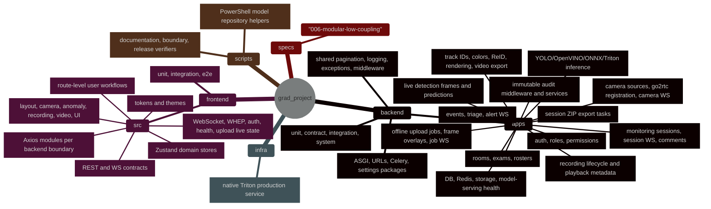

## Runtime Container Flow

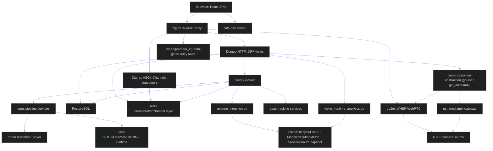

## Backend Module Boundaries

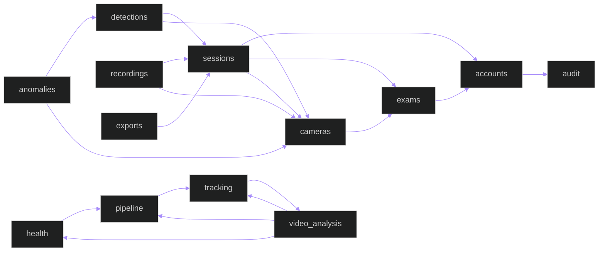

## Frontend Route And File Flow

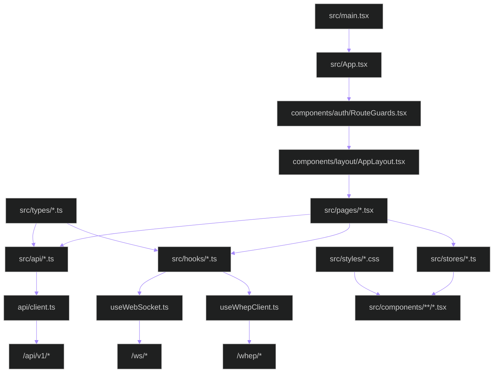

## User Journey

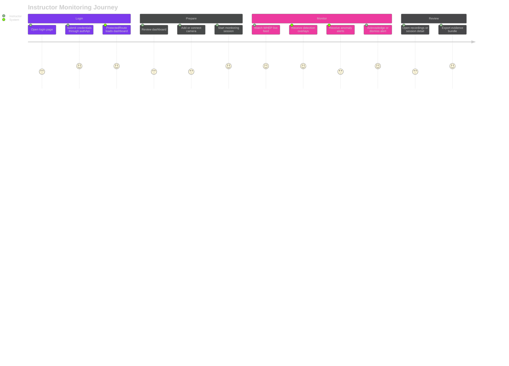

## Offline Video Upload Sequence

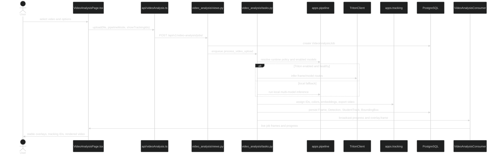

## Live Streaming Sequence

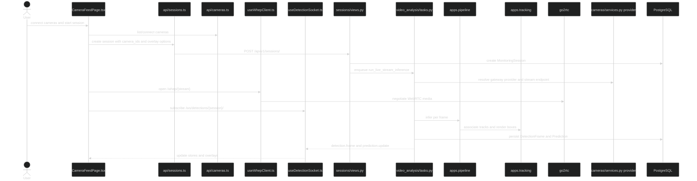

## Database Entity Relationships

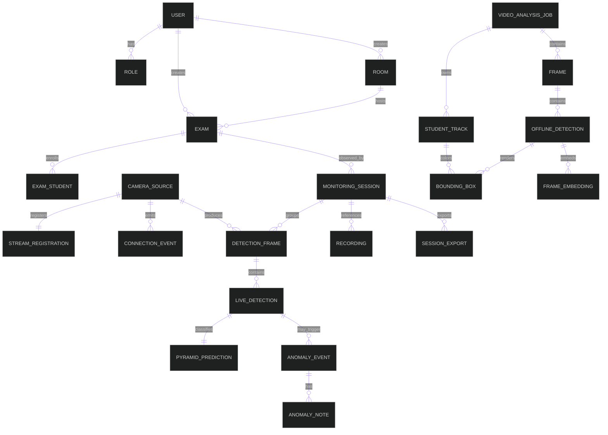

## Offline Job State Machine

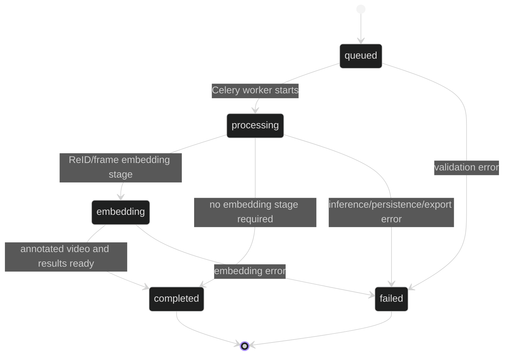

## Video Processing Data Flow

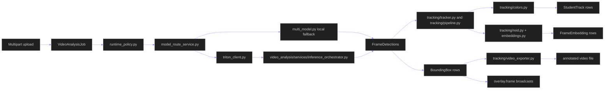

## Frontend Offline Overlay Flow

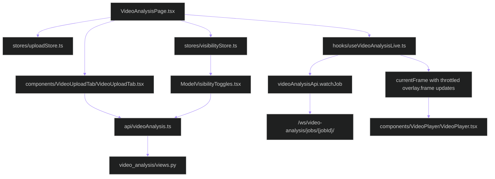

## WebSocket Contract Map

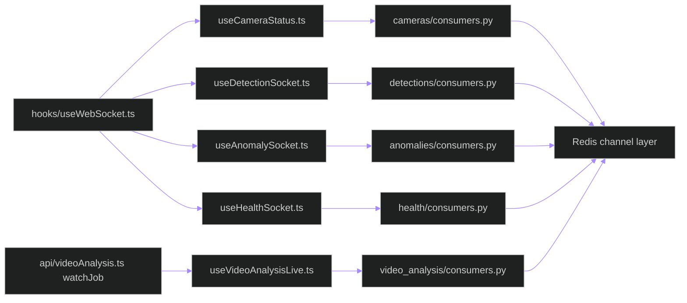

## Test Architecture

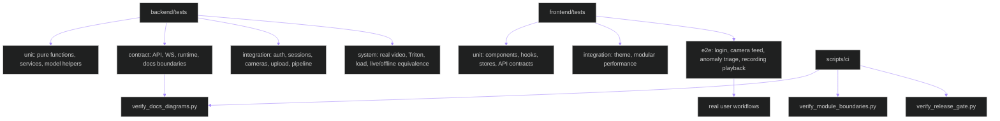

## Script And Infrastructure Flow

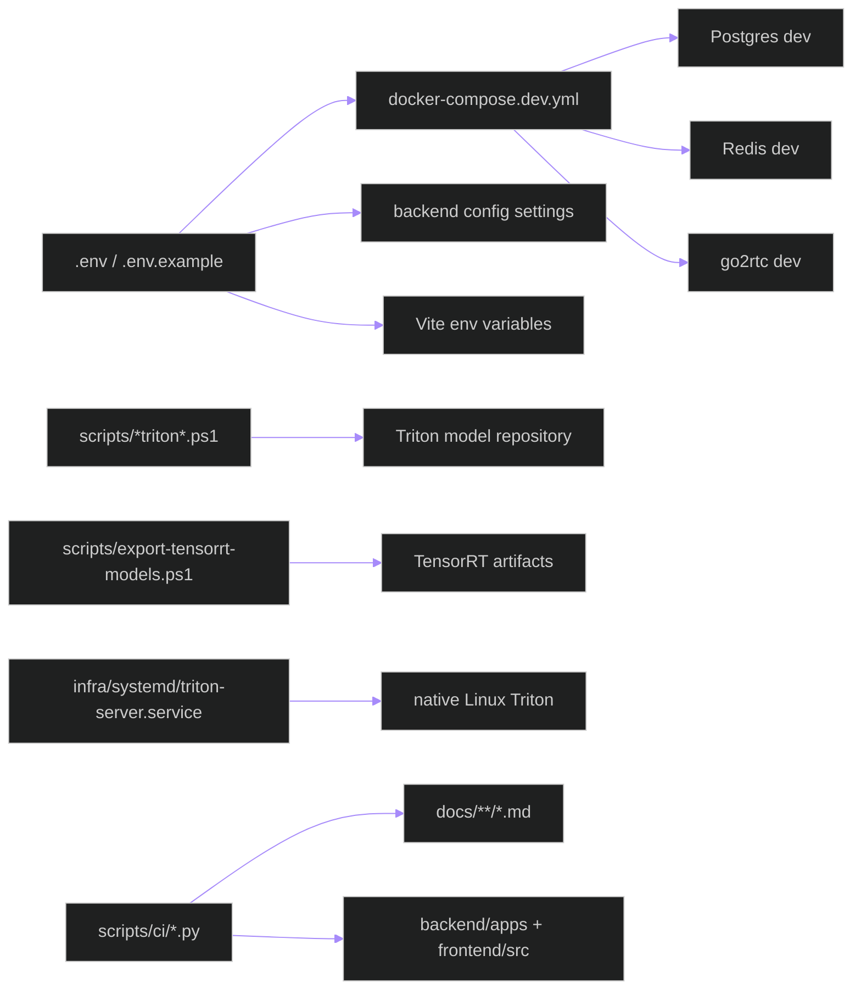

## Model Serving Decision Timeline

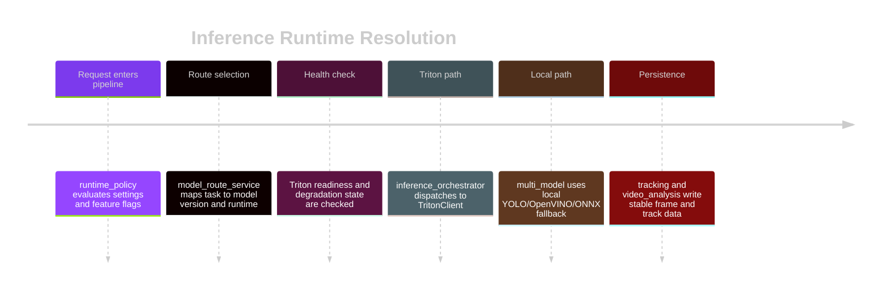

## Dependency Risk Quadrants

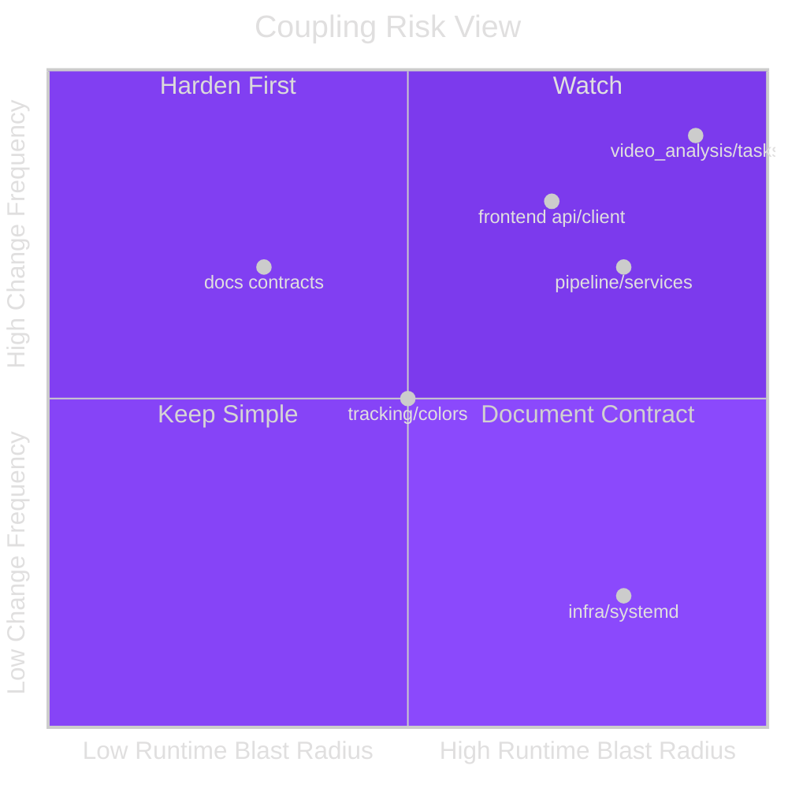

## Requirement Coverage

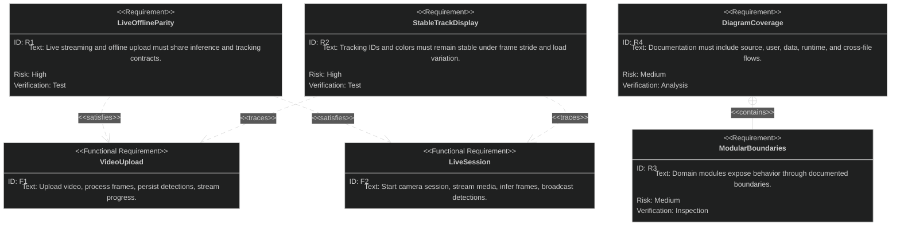

## Git And Release Evidence Flow

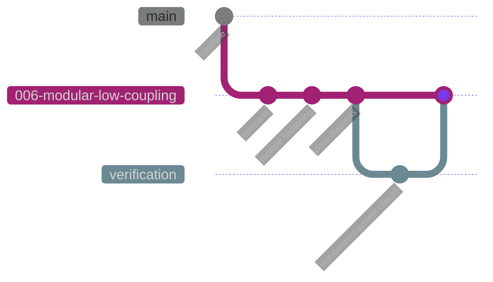

## File Responsibility Matrix

| Area | Representative files | Responsibility | Primary flows |
|------|----------------------|----------------|---------------|
| Backend config | `backend/config/*`, `backend/manage.py` | ASGI/WSGI, URL routing, Celery bootstrap, settings composition | HTTP, WS, task queue |
| Backend core | `backend/core/*` | Shared exceptions, logging, pagination, middleware | all DRF requests |
| Accounts | `backend/apps/accounts/*` | users, roles, auth serializers, permissions | login, protected API |
| Exams | `backend/apps/exams/*` | rooms, exams, rosters | session planning |
| Cameras | `backend/apps/cameras/*` | camera CRUD, stream registration, camera status | live monitoring |
| Sessions | `backend/apps/sessions/*` | monitoring session lifecycle and comments | live monitoring |
| Detections | `backend/apps/detections/*` | live detection frames and predictions | live overlays |
| Anomalies | `backend/apps/anomalies/*` | event creation and triage | alerting workflow |
| Recordings | `backend/apps/recordings/*` | recording metadata and playback | review workflow |
| Exports | `backend/apps/exports/*` | async export model, services, Celery tasks | evidence bundle |
| Audit | `backend/apps/audit/*` | append-only action history | compliance trail |
| Health | `backend/apps/health/*` | subsystem health and model serving health | dashboard health |
| Pipeline | `backend/apps/pipeline/**/*` | inference layers, runtime clients, model lifecycle | live and offline inference |
| Tracking | `backend/apps/tracking/**/*` | track association, colors, ReID, rendering, export | stable identity overlays |
| Video analysis | `backend/apps/video_analysis/**/*` | upload jobs, job API, job WS, Celery processing | offline upload |
| Frontend API | `frontend/src/api/*.ts` | REST/WS client modules | frontend-backend contract |
| Frontend pages | `frontend/src/pages/*.tsx` | user workflow screens | route-level behavior |
| Frontend components | `frontend/src/components/**/*` | rendered UI and overlays | user-visible state |
| Frontend hooks | `frontend/src/hooks/*.ts` | WebSocket/WHEP/live state hooks | real-time behavior |
| Frontend stores | `frontend/src/stores/*.ts` | Zustand state per domain | UI state propagation |
| Frontend types | `frontend/src/types/*.ts` | shared TS contracts | compile-time validation |
| Tests | `backend/tests/**/*`, `frontend/tests/**/*` | unit, contract, integration, system, e2e checks | regression evidence |
| Scripts | `scripts/**/*` | CI gates and Triton artifact helpers | release and model operations |
| Infra | `infra/**/*`, `docker-compose.dev.yml`, `nginx.conf`, `go2rtc.yaml` | dev services, reverse proxy, native service config | deployment/runtime |
| Specs/docs | `specs/**/*`, `docs/**/*` | feature contracts and diagram evidence | planning and verification |
