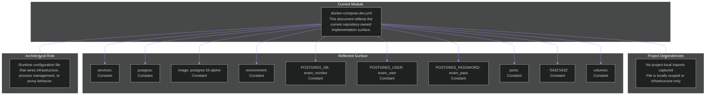

# docker-compose.dev.yml

## Related Documents

- [source](../docker-compose.dev.yml)
- [system atlas](diagrams/SYSTEM_MERMAID_ATLAS.md)
- [source mirror](diagrams/SOURCE_FILE_MIRROR.md)

## Executive View

This document reflects the current repository-owned implementation surface.

## Triton Dual-Profile Launch Wiring (Phase 2)

`docker-compose.dev.yml` now supports optional Triton `--model-config-name` launch flags for dual runtime profiles:

- `triton` service (live path): uses `TRITON_LIVE_MODEL_CONFIG_NAME`, falling back to `TRITON_MODEL_CONFIG_NAME`.
- `triton-offline` service (offline path): uses `TRITON_OFFLINE_MODEL_CONFIG_NAME`, falling back to `TRITON_MODEL_CONFIG_NAME`.
- Backward compatibility: if all variables are empty/unset, Triton starts without `--model-config-name` and behavior remains unchanged.

Examples:

```bash
# Global profile for both services
TRITON_MODEL_CONFIG_NAME=configs/live.pbtxt

# Explicit per-profile overrides
TRITON_LIVE_MODEL_CONFIG_NAME=configs/live.pbtxt
TRITON_OFFLINE_MODEL_CONFIG_NAME=configs/offline.pbtxt
```

## Architectural Role

Runtime configuration file that wires infrastructure, process management, or proxy behavior.

## Reflected Surface

| Symbol | Kind | Reflection |
|------|------|------------|
| `services:` | Constant | Reflected directly from the current top-level implementation surface. |
| `postgres:` | Constant | Reflected directly from the current top-level implementation surface. |
| `image: postgres:16-alpine` | Constant | Reflected directly from the current top-level implementation surface. |
| `environment:` | Constant | Reflected directly from the current top-level implementation surface. |
| `POSTGRES_DB: exam_monitor` | Constant | Reflected directly from the current top-level implementation surface. |
| `POSTGRES_USER: exam_user` | Constant | Reflected directly from the current top-level implementation surface. |
| `POSTGRES_PASSWORD: exam_pass` | Constant | Reflected directly from the current top-level implementation surface. |
| `ports:` | Constant | Reflected directly from the current top-level implementation surface. |
| `- "5432:5432"` | Constant | Reflected directly from the current top-level implementation surface. |
| `volumes:` | Constant | Reflected directly from the current top-level implementation surface. |

## Architecture Diagram



This diagram uses the same visual language as the root architecture view: one subgraph for the current module, one for concrete repository dependencies, one for the reflected implementation surface, and one for the architectural role that the file currently occupies.

## Detailed Reflection

This module sits at `docker-compose.dev.yml` and acts as a concrete implementation boundary inside the repository. Runtime configuration file that wires infrastructure, process management, or proxy behavior.

From a dependency perspective, the file currently reaches into no project-local imports in the captured surface. Those links were read from the real source file so the diagram reflects the actual local coupling rather than an inferred architecture.

From a surface perspective, the top-level implementation currently exposes or declares `services:`, `postgres:`, `image: postgres:16-alpine`, `environment:`, `POSTGRES_DB: exam_monitor`, `POSTGRES_USER: exam_user`, `POSTGRES_PASSWORD: exam_pass`, `ports:`. That reflected surface is intentionally tied to the source file itself, so if the code changes the document should be regenerated with it.

From an accuracy perspective, this page focuses on project-local structure: repository imports, top-level classes/functions/constants, and the architectural role implied by the file location and concrete implementation type. External library imports are intentionally omitted from the diagram so the repository interaction map remains readable while staying faithful to the codebase.
