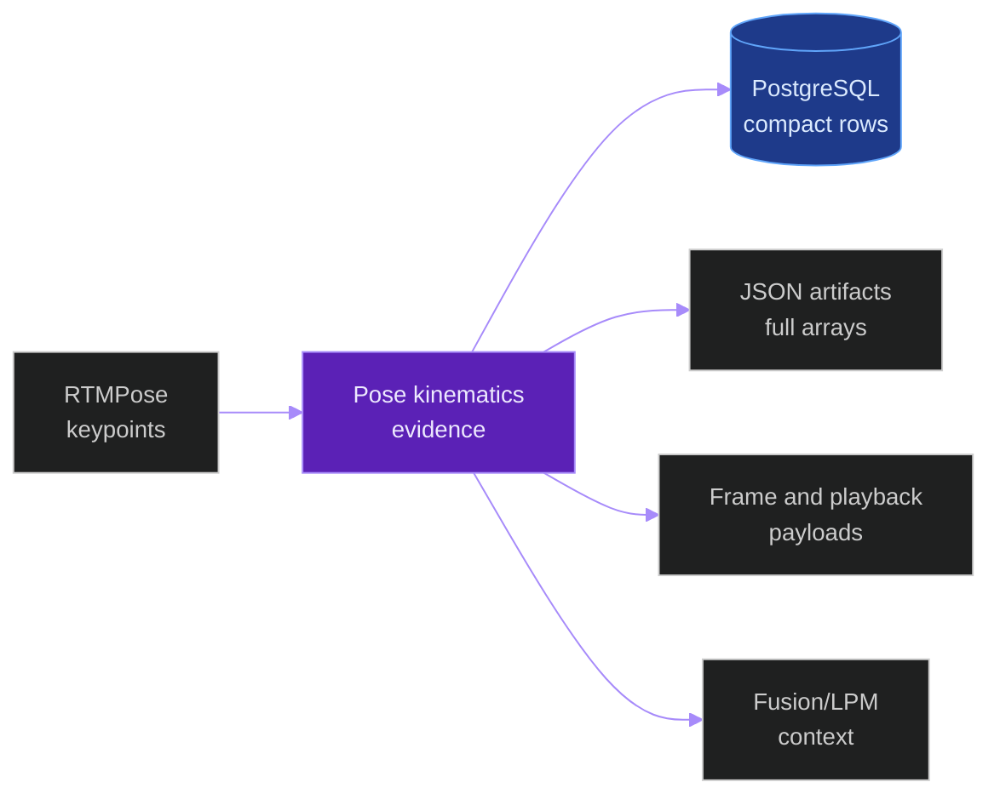
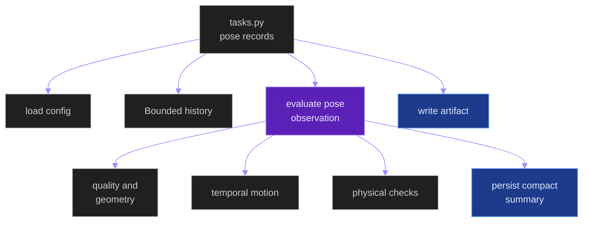
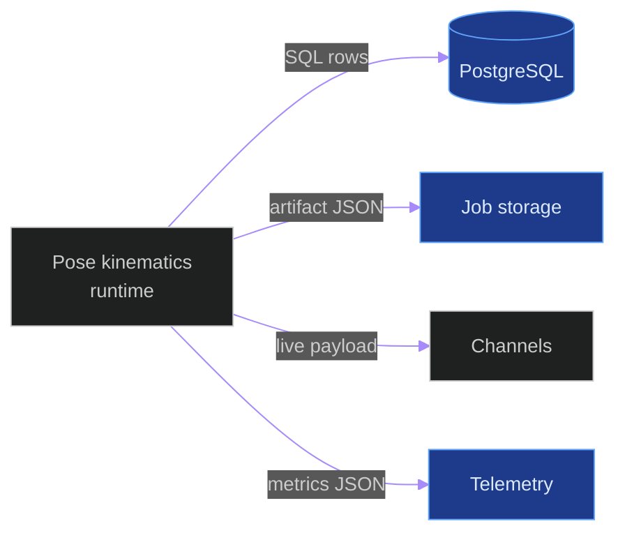
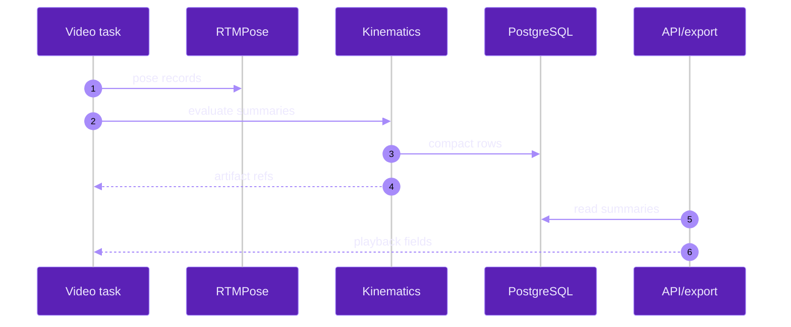
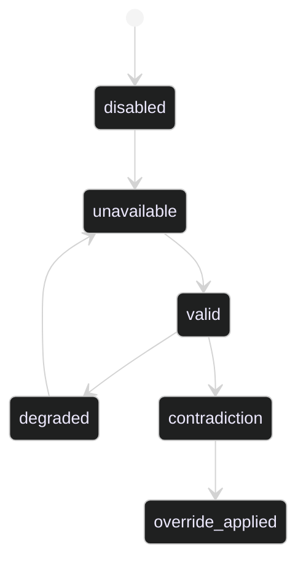

# Cycle 013 Human Pose Kinematics

**Last updated:** 2026-06-05
**Entity kind:** `cycle`
**Status:** `not_accepted`

Deterministic post-RTMPose body-mechanics evidence for offline and live
classroom inference.

## Source-of-truth references

| Kind | Reference |
|---|---|
| File | `backend/apps/pipeline/services/pose_kinematics.py` |
| File | `backend/apps/pipeline/services/pose_kinematics_config.py` |
| File | `backend/apps/pipeline/services/pose_kinematics_history.py` |
| File | `backend/apps/video_analysis/services/pose_kinematics_persistence.py` |
| File | `backend/apps/video_analysis/services/pose_kinematics_artifacts.py` |
| File | `backend/apps/video_analysis/models.py` |
| File | `backend/apps/video_analysis/tasks.py` |
| File | `backend/apps/video_analysis/serializers.py` |
| File | `backend/apps/video_analysis/views.py` |
| File | `tools/prod/prod_run_pose_kinematics_benchmark.sh` |
| File | `tools/prod/prod_run_pose_kinematics_live_validation.sh` |
| File | `tools/prod/prod_check_pose_kinematics_reconciliation.py` |
| File | `tools/prod/prod_collect_pose_kinematics_label_agreement.py` |
| File | `tools/prod/prod_verify_pose_kinematics_rollback.sh` |
| Workflow | `.github/workflows/inference-parallelization.yml` |
| Doc | `specs/013-human-pose-kinematics/plan.md` |
| Doc | `specs/013-human-pose-kinematics/tasks.md` |
| Doc | `specs/013-human-pose-kinematics/quickstart.md` |

## 1. Purpose and scope

Streaming compatibility: `stream-safe-with-config` only when the live profile
keeps `POSE_KINEMATICS_ENABLED=0` until
`tools/prod/prod_run_pose_kinematics_live_validation.sh` produces governed
real-media evidence for SC-007.

Cycle 013 adds a deterministic Human Pose Kinematics Layer after RTMPose and
before higher-level fusion/export. It converts RTMPose keypoints into compact
quality, geometry, orientation, posture, gesture, motion, IK, contradiction,
and override evidence. It does not add a new inference model and does not
change RTMPose authority.

## 2. Position in the system



## 3. Internal structure

| Phase | Implemented surface |
|---|---|
| Config | `pose_kinematics_config.py` reads bounded `POSE_KINEMATICS_*` values. |
| Evidence | `pose_kinematics.py` builds compact summaries and fusion signals. |
| History | `pose_kinematics_history.py` keeps bounded same-track samples. |
| Persistence | `PoseKinematicsRecord` and `PoseKinematicsOverrideEvent` persist compact evidence. |
| Artifacts | `pose_kinematics_artifacts.py` writes digest-addressed full arrays. |
| Runtime | `tasks.py` enriches offline and live pose records. |
| API/export | `serializers.py` and `views.py` expose summaries and override events. |
| Production | `tools/prod/prod_run_pose_kinematics_benchmark.sh` runs the offline matrix. |

## 4. Call graph



## 5. External connections



## 6. API surface

| Interface | Schema | Caller |
|---|---|---|
| `FrameSerializer.pose_kinematics` | `PoseKinematicsRecordSerializer` | frame detail and playback APIs |
| `FrameSerializer.pose_kinematics_overrides` | `PoseKinematicsOverrideEventSerializer` | frame detail and playback APIs |
| `build_pose_fusion_signal(...)` | dict payload | fusion/LPM integration |
| `prod_check_pose_kinematics_reconciliation.py` | JSON/Markdown report | production validation |

## 7. Dependencies

| Dependency | Reason | Pinned version |
|---|---|---|
| Django ORM | PostgreSQL compact evidence writes | project requirements |
| RTMPose output | Source keypoints | existing Triton route |
| Celery task runtime | Offline and live execution | project settings |
| Channels payloads | Live overlay projection | project requirements |

## 8. Environment variables read

| Variable | Default | Required? | Effect |
|---|---|---|---|
| `POSE_KINEMATICS_ENABLED` | `0` | no | Master feature switch. |
| `POSE_KINEMATICS_HISTORY_SECONDS` | `5` | no | Bounded history time window. |
| `POSE_KINEMATICS_HISTORY_MAX_SAMPLES` | `150` | no | Bounded history sample count. |
| `POSE_KINEMATICS_OVERRIDE_MARGIN` | `0.15` | no | Pose-vs-model confidence margin. |
| `POSE_KINEMATICS_OVERRIDE_MIN_FRAMES` | `3` | no | Same-track support requirement. |
| `POSE_KINEMATICS_MIN_KEYPOINT_CONFIDENCE` | `0.30` | no | Visible keypoint threshold. |
| `POSE_KINEMATICS_ARTIFACTS_ENABLED` | `1` | no | Offline full-array artifact writing. |
| `POSE_KINEMATICS_TELEMETRY_ENABLED` | `1` | no | Kinematics metric emission. |

## 9. Sequence diagram



## 10. State machine



## 11. Failure modes

| Failure | Detection | Recovery |
|---|---|---|
| Feature disabled | `POSE_KINEMATICS_ENABLED=0` | Existing pose/behavior flow continues. |
| Invalid keypoints | summary state `unavailable` | Persist unavailable reason. |
| Live gap or no pose | live `pose_kinematics_state` | Emit degraded/unavailable payload. |
| Artifact write issue | task exception logging | Compact DB summary remains attempted. |
| Override blocked | event decision `blocked` | Preserve original model prediction. |

## 12. Performance characteristics

Production values were collected on the production Linux RTX 5090 host at
deployed SHA `bbc30af7`.

| Metric | Baseline disabled | Candidate enabled | Delta |
|---|---:|---:|---:|
| Replay key | `pose-kinematics-prod-20260605T015300Z-baseline-disabled-rerun` | `pose-kinematics-prod-20260605T013200Z-candidate-enabled` | n/a |
| Job ID | `c83f3c7d-226d-41e6-a9cc-b5dfcd9a150f` | `545bdec2-96b8-4c72-b8c1-b06453cd8e9c` | n/a |
| Status | `completed`, `4541/4541` frames | `completed`, `4541/4541` frames | n/a |
| DB-completed FPS | `5.655908` | `5.361580` | `-5.20 %` |
| Step 2 frame wall | `460.804618 s` | `451.563517 s` | `-2.01 %` |
| Step 2 through pose upload | `635.637226 s` | `680.034363 s` | `+6.98 %` |
| GPU avg util | `11.667 %` | `10.925 %` | `-6.36 %` |
| Detection rows | `72744` | `72744` | `0.00 %` |
| BBox rows | `72744` | `72744` | `0.00 %` |
| Embedding rows | `72578` | `72578` | `0.00 %` |
| StudentTracks | `53` | `53` | `0.00 %` |
| Pose kinematics records | `0` | `19129` | Evidence added |
| Pose artifact refs | `0` | `19129` | Evidence added |
| History bound violations | `0` | `0` | Pass |

Evidence paths:

| Evidence | Reference |
|---|---|
| Baseline metrics | `/home/bamby/grad_project/backend/logs/pose-kinematics-prod-20260605T015300Z-baseline-rerun/baseline_disabled_metrics.json` |
| Candidate metrics | `/home/bamby/grad_project/backend/logs/pose-kinematics-prod-20260605T013200Z/candidate_enabled_vs_baseline_rerun_metrics.json` |
| Baseline reconciliation | `/home/bamby/grad_project/backend/logs/pose-kinematics-prod-20260605T015300Z-baseline-rerun/baseline_reconciliation.json` |
| Candidate reconciliation | `/home/bamby/grad_project/backend/logs/pose-kinematics-prod-20260605T013200Z/candidate_reconciliation.json` |
| Rollback report | `/home/bamby/grad_project/backend/logs/pose-kinematics-rollback-20260605T021500Z/rollback_report.json` |
| Enabled retry metrics | `/home/bamby/grad_project/backend/logs/pose-kinematics-enabled-retry-20260605T121611Z/candidate_enabled_metrics.json` |
| Enabled retry reconciliation | `/home/bamby/grad_project/backend/logs/pose-kinematics-enabled-retry-20260605T121611Z/candidate_reconciliation.json` |
| Enabled retry artifact | `/home/bamby/grad_project/backend/data/videos/6833a227-3738-4dec-afc8-fab149c172e1/pose_kinematics_3a46008e4ebf280a051f9945b25c09597d3a20234988f68e53d0a9f4db9acefa.json` |

## 13. Validation and gates

| Gate | Script or test |
|---|---|
| Local unit/contract/integration | `specs/013-human-pose-kinematics/quickstart.md` |
| Static hardening | `scripts/ci/verify_pose_kinematics_requirements_gates.py` |
| Offline production matrix | `tools/prod/prod_run_pose_kinematics_benchmark.sh` |
| Live production validation | `tools/prod/prod_run_pose_kinematics_live_validation.sh` |
| Runtime reconciliation | `tools/prod/prod_check_pose_kinematics_reconciliation.py` |
| Reviewer-label agreement | `tools/prod/prod_collect_pose_kinematics_label_agreement.py` |
| Rollback proof | `tools/prod/prod_verify_pose_kinematics_rollback.sh` |

Deployment-validation benchmark release:

```text
BENCHMARK_RELEASE
agent: Codex deployment session
cycle: Cycle 013 Human Pose Kinematics
replay_key: pose-kinematics-deploy-20260605T112419Z
baseline_job_id: e2f218f6-97e4-4900-8365-f46158116fa0
candidate_job_id: 5d02260f-f54c-4246-b247-e942bbd06dfe
status: completed; both attempts processed 4541/4541 frames
metrics_json: /home/bamby/grad_project/backend/logs/pose-kinematics-deploy-20260605T112419Z/candidate_enabled_metrics.json
metrics_md: /home/bamby/grad_project/backend/logs/pose-kinematics-deploy-20260605T112419Z/candidate_enabled_metrics.md
reconciliation_json: /home/bamby/grad_project/backend/logs/pose-kinematics-deploy-20260605T112419Z/candidate_reconciliation.json
reconciliation_md: /home/bamby/grad_project/backend/logs/pose-kinematics-deploy-20260605T112419Z/candidate_reconciliation.md
rollback_verified: yes; POSE_KINEMATICS_ENABLED=0, active jobs=0, Triton ready HTTP 200
released_at_utc: 2026-06-05T11:54:02Z
```

Candidate-only enabled retry benchmark release:

```text
BENCHMARK_RELEASE
agent: Codex deployment session
cycle: Cycle 013 Human Pose Kinematics
replay_key: pose-kinematics-enabled-retry-20260605T121611Z-candidate-enabled
candidate_job_id: 6833a227-3738-4dec-afc8-fab149c172e1
baseline_metrics: prior same-head disabled baseline e2f218f6-97e4-4900-8365-f46158116fa0
candidate_env_delta: POSE_KINEMATICS_ENABLED=1 for candidate-only retry at production HEAD 3870d40b
status: completed; candidate processed 4541/4541 frames
metrics_json: /home/bamby/grad_project/backend/logs/pose-kinematics-enabled-retry-20260605T121611Z/candidate_enabled_metrics.json
metrics_md: /home/bamby/grad_project/backend/logs/pose-kinematics-enabled-retry-20260605T121611Z/candidate_enabled_metrics.md
reconciliation_json: /home/bamby/grad_project/backend/logs/pose-kinematics-enabled-retry-20260605T121611Z/candidate_reconciliation.json
reconciliation_md: /home/bamby/grad_project/backend/logs/pose-kinematics-enabled-retry-20260605T121611Z/candidate_reconciliation.md
artifact_path: /home/bamby/grad_project/backend/data/videos/6833a227-3738-4dec-afc8-fab149c172e1/pose_kinematics_3a46008e4ebf280a051f9945b25c09597d3a20234988f68e53d0a9f4db9acefa.json
result: overall_ok=true; 19129 pose records; 19129 artifact refs; zero history-bound violations
rollback_verified: yes; POSE_KINEMATICS_ENABLED=0, active jobs=0, Triton ready HTTP 200
released_at_utc: 2026-06-05T12:43:00Z
```

## 14. Current decision

Decision on 2026-06-05: `not_accepted` for production enablement.

The offline matrix and disabled-layer rollback proof exist and pass their
evidence checks. The candidate produced `19129` pose kinematics records and
`19129` artifact refs with zero history-bound violations, while DB/model row
counts stayed unchanged against baseline. Rollback job
`1011ee9f-2d53-43b8-93de-d2238bf6f7f5` completed `4541/4541` frames with
`POSE_KINEMATICS_ENABLED=0`, zero pose records, and `overall_ok=true` in
`rollback_report.json`.

Full production acceptance remains blocked because no Cycle 013
`reviewer_label_manifest.json` or generated agreement report exists, and no
real-media live validation manifest exists. Keep `POSE_KINEMATICS_ENABLED=0`
as the production default until reviewer-label agreement and live validation
are backed by governed evidence.
