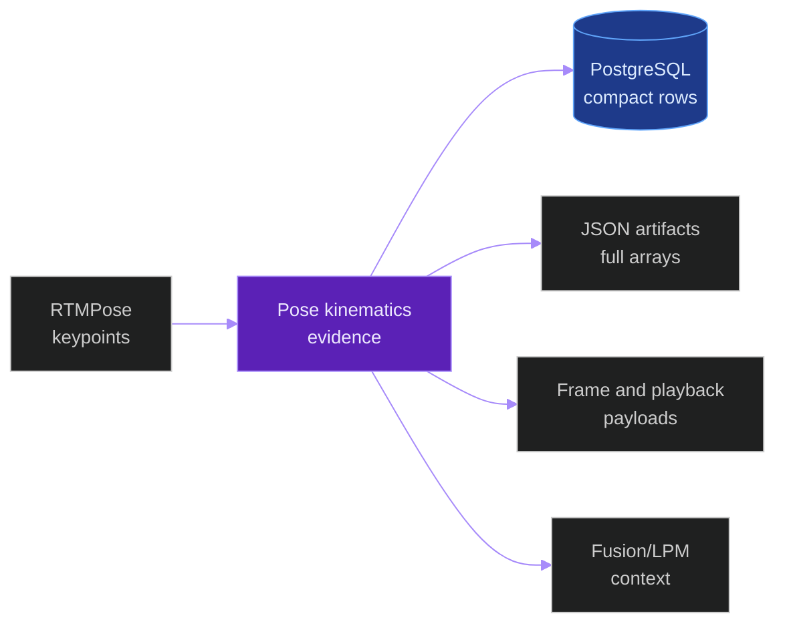
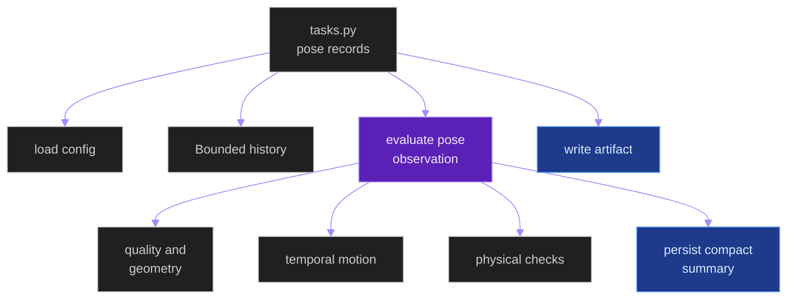
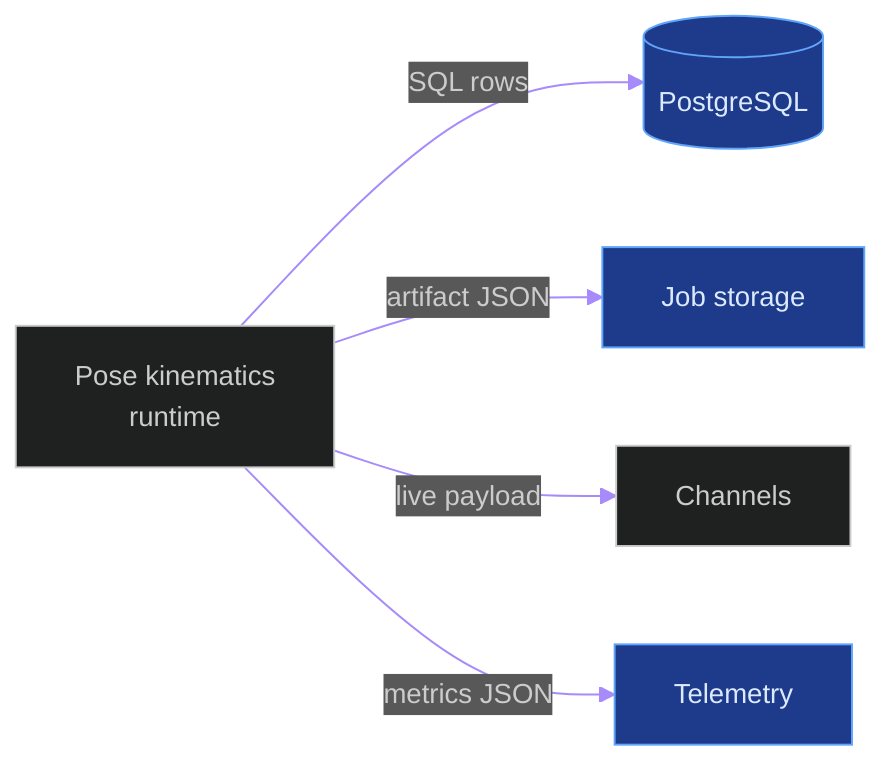
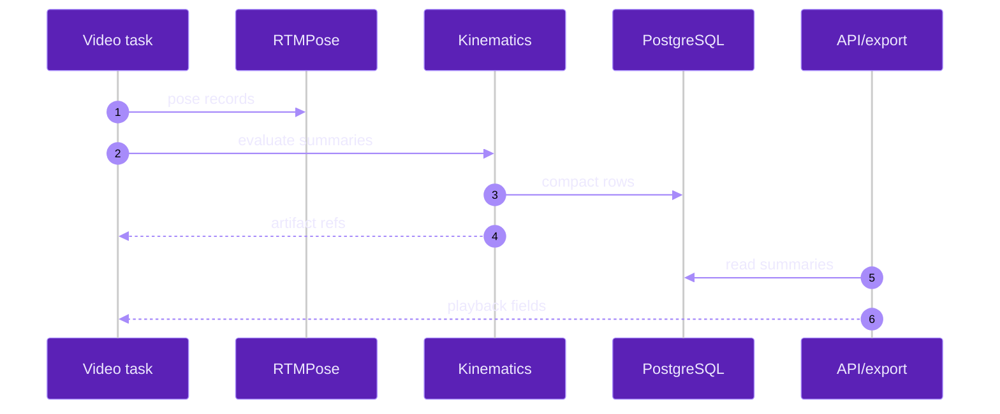
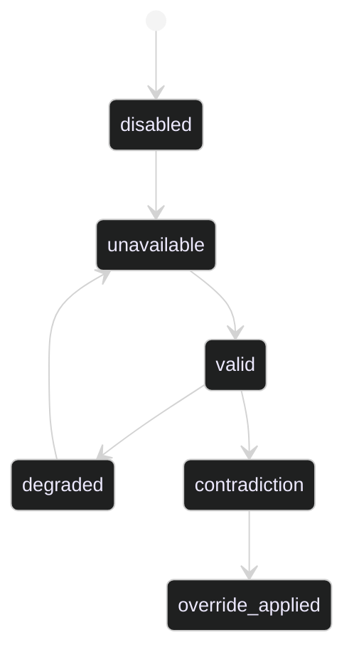

# Cycle 013 Human Pose Kinematics

**Last updated:** 2026-06-05
**Entity kind:** `cycle`
**Status:** `active`

Deterministic post-RTMPose body-mechanics evidence for offline and live
classroom inference.

## Source-of-truth references

| Kind | Reference |
|---|---|
| File | `backend/apps/pipeline/services/pose_kinematics.py` |
| File | `backend/apps/pipeline/services/pose_kinematics_config.py` |
| File | `backend/apps/pipeline/services/pose_kinematics_history.py` |
| File | `backend/apps/video_analysis/services/pose_kinematics_persistence.py` |
| File | `backend/apps/video_analysis/services/pose_kinematics_artifacts.py` |
| File | `backend/apps/video_analysis/models.py` |
| File | `backend/apps/video_analysis/tasks.py` |
| File | `backend/apps/video_analysis/serializers.py` |
| File | `backend/apps/video_analysis/views.py` |
| File | `tools/prod/prod_run_pose_kinematics_benchmark.sh` |
| File | `tools/prod/prod_run_pose_kinematics_live_validation.sh` |
| File | `tools/prod/prod_check_pose_kinematics_reconciliation.py` |
| File | `tools/prod/prod_collect_pose_kinematics_label_agreement.py` |
| File | `tools/prod/prod_verify_pose_kinematics_rollback.sh` |
| Workflow | `.github/workflows/inference-parallelization.yml` |
| Doc | `specs/013-human-pose-kinematics/plan.md` |
| Doc | `specs/013-human-pose-kinematics/tasks.md` |
| Doc | `specs/013-human-pose-kinematics/quickstart.md` |

## 1. Purpose and scope

Streaming compatibility: `stream-safe-with-config`.

Cycle 013 adds a deterministic Human Pose Kinematics Layer after RTMPose and
before higher-level fusion/export. It converts RTMPose keypoints into compact
quality, geometry, orientation, posture, gesture, motion, IK, contradiction,
and override evidence. It does not add a new inference model and does not
change RTMPose authority.

## 2. Position in the system

## 3. Internal structure

| Phase | Implemented surface |
|---|---|
| Config | `pose_kinematics_config.py` reads bounded `POSE_KINEMATICS_*` values. |
| Evidence | `pose_kinematics.py` builds compact summaries and fusion signals. |
| History | `pose_kinematics_history.py` keeps bounded same-track samples. |
| Persistence | `PoseKinematicsRecord` and `PoseKinematicsOverrideEvent` persist compact evidence. |
| Artifacts | `pose_kinematics_artifacts.py` writes digest-addressed full arrays. |
| Runtime | `tasks.py` enriches offline and live pose records. |
| API/export | `serializers.py` and `views.py` expose summaries and override events. |
| Production | `tools/prod/prod_run_pose_kinematics_benchmark.sh` runs the offline matrix. |

## 4. Call graph

## 5. External connections

## 6. API surface

| Interface | Schema | Caller |
|---|---|---|
| `FrameSerializer.pose_kinematics` | `PoseKinematicsRecordSerializer` | frame detail and playback APIs |
| `FrameSerializer.pose_kinematics_overrides` | `PoseKinematicsOverrideEventSerializer` | frame detail and playback APIs |
| `build_pose_fusion_signal(...)` | dict payload | fusion/LPM integration |
| `prod_check_pose_kinematics_reconciliation.py` | JSON/Markdown report | production validation |

## 7. Dependencies

| Dependency | Reason | Pinned version |
|---|---|---|
| Django ORM | PostgreSQL compact evidence writes | project requirements |
| RTMPose output | Source keypoints | existing Triton route |
| Celery task runtime | Offline and live execution | project settings |
| Channels payloads | Live overlay projection | project requirements |

## 8. Environment variables read

| Variable | Default | Required? | Effect |
|---|---|---|---|
| `POSE_KINEMATICS_ENABLED` | `0` | no | Master feature switch. |
| `POSE_KINEMATICS_HISTORY_SECONDS` | `5` | no | Bounded history time window. |
| `POSE_KINEMATICS_HISTORY_MAX_SAMPLES` | `150` | no | Bounded history sample count. |
| `POSE_KINEMATICS_OVERRIDE_MARGIN` | `0.15` | no | Pose-vs-model confidence margin. |
| `POSE_KINEMATICS_OVERRIDE_MIN_FRAMES` | `3` | no | Same-track support requirement. |
| `POSE_KINEMATICS_MIN_KEYPOINT_CONFIDENCE` | `0.30` | no | Visible keypoint threshold. |
| `POSE_KINEMATICS_ARTIFACTS_ENABLED` | `1` | no | Offline full-array artifact writing. |
| `POSE_KINEMATICS_TELEMETRY_ENABLED` | `1` | no | Kinematics metric emission. |

## 9. Sequence diagram

## 10. State machine

## 11. Failure modes

| Failure | Detection | Recovery |
|---|---|---|
| Feature disabled | `POSE_KINEMATICS_ENABLED=0` | Existing pose/behavior flow continues. |
| Invalid keypoints | summary state `unavailable` | Persist unavailable reason. |
| Live gap or no pose | live `pose_kinematics_state` | Emit degraded/unavailable payload. |
| Artifact write issue | task exception logging | Compact DB summary remains attempted. |
| Override blocked | event decision `blocked` | Preserve original model prediction. |

## 12. Performance characteristics

Production values are not recorded in this entity doc until
`prod_run_pose_kinematics_benchmark.sh` completes baseline and candidate
runs on the production RTX 5090 host.

## 13. Validation and gates

| Gate | Script or test |
|---|---|
| Local unit/contract/integration | `specs/013-human-pose-kinematics/quickstart.md` |
| Static hardening | `scripts/ci/verify_pose_kinematics_requirements_gates.py` |
| Offline production matrix | `tools/prod/prod_run_pose_kinematics_benchmark.sh` |
| Live production validation | `tools/prod/prod_run_pose_kinematics_live_validation.sh` |
| Runtime reconciliation | `tools/prod/prod_check_pose_kinematics_reconciliation.py` |
| Reviewer-label agreement | `tools/prod/prod_collect_pose_kinematics_label_agreement.py` |
| Rollback proof | `tools/prod/prod_verify_pose_kinematics_rollback.sh` |

## 14. Current decision

No production acceptance decision is recorded yet. The feature remains
candidate-stage until the required production offline matrix, live validation,
label-agreement report, reconciliation report, and rollback proof exist.
