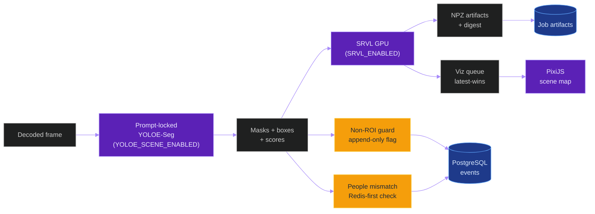

# Cycle 014 YOLOE Scene Segmentation And SRVL

**Last updated:** 2026-06-07
**Entity kind:** `cycle`
**Status:** `staged_local_only`

Disabled-by-default YOLOE scene-segmentation lane and Spatial Relationship
Vectorization Layer (SRVL) for offline classroom video inference.

Streaming compatibility: `offline-only`

## Source-of-truth references

| Kind | Reference |
|---|---|
| File | `backend/apps/video_analysis/scene/__init__.py` |
| File | `backend/apps/video_analysis/scene/config.py` |
| File | `backend/apps/video_analysis/scene/prompts.py` |
| File | `backend/apps/video_analysis/scene/export_manifest.py` |
| File | `backend/apps/video_analysis/scene/normalizer.py` |
| File | `backend/apps/video_analysis/scene/masks.py` |
| File | `backend/apps/video_analysis/scene/artifacts.py` |
| File | `backend/apps/video_analysis/scene/persistence.py` |
| File | `backend/apps/video_analysis/scene/non_roi.py` |
| File | `backend/apps/video_analysis/scene/contradictions.py` |
| File | `backend/apps/video_analysis/scene/live_guard.py` |
| File | `backend/apps/video_analysis/scene/telemetry.py` |
| File | `backend/apps/video_analysis/scene/access.py` |
| File | `backend/apps/video_analysis/scene/ws_events.py` |
| File | `backend/apps/video_analysis/scene/people_counts.py` |
| File | `backend/apps/video_analysis/scene/recovery_lookup.py` |
| File | `backend/apps/video_analysis/scene/recovery_assignment.py` |
| File | `backend/apps/video_analysis/scene/recovery_candidates.py` |
| File | `backend/apps/video_analysis/scene/recovery_timeline.py` |
| File | `backend/apps/video_analysis/scene/detector_assist.py` |
| File | `backend/apps/video_analysis/scene/srvl.py` |
| File | `backend/apps/video_analysis/scene/srvl_inputs.py` |
| File | `backend/apps/video_analysis/scene/srvl_modes.py` |
| File | `backend/apps/video_analysis/scene/srvl_maps.py` |
| File | `backend/apps/video_analysis/scene/visualization_queue.py` |
| File | `backend/apps/video_analysis/scene/render_artifacts.py` |
| File | `backend/apps/video_analysis/models.py` |
| File | `backend/apps/video_analysis/tasks.py` |
| File | `backend/apps/video_analysis/serializers_scene.py` |
| File | `backend/apps/video_analysis/urls_scene.py` |
| File | `backend/apps/video_analysis/views_scene.py` |
| File | `backend/apps/video_analysis/ws_broadcast.py` |
| File | `backend/apps/pipeline/model_registry.py` |
| File | `backend/apps/pipeline/services/model_route_service.py` |
| File | `backend/config/settings/base.py` |
| File | `frontend/src/types/videoAnalysis.ts` |
| File | `frontend/src/components/VideoPlayer/OverlayCanvas.tsx` |
| File | `frontend/src/components/camera/BoundingBoxCanvas.tsx` |
| File | `frontend/src/components/scene/SceneMapRenderer.tsx` |
| File | `frontend/src/services/sceneMetrics.ts` |
| File | `tools/prod/prod_export_yoloe_scene_model.sh` |
| File | `tools/prod/prod_export_yoloe_scene_model.ps1` |
| File | `tools/prod/prod_verify_yoloe_scene_export.sh` |
| File | `tools/prod/prod_verify_yoloe_scene_export.ps1` |
| File | `tools/prod/prod_run_yoloe_scene_benchmark.sh` |
| File | `tools/prod/prod_run_yoloe_scene_benchmark.ps1` |
| File | `tools/prod/prod_collect_yoloe_scene_metrics.py` |
| File | `tools/prod/prod_generate_yoloe_scene_figures.py` |
| File | `tools/prod/prod_benchmark_scene_renderers.sh` |
| File | `tools/prod/prod_benchmark_scene_renderers.ps1` |
| File | `tools/prod/prod_rollback_yoloe_scene.sh` |
| File | `tools/prod/prod_rollback_yoloe_scene.ps1` |
| Workflow | `.github/workflows/yoloe-scene-srvl.yml` |
| Doc | `specs/014-yoloe-scene-srvl/plan.md` |
| Doc | `specs/014-yoloe-scene-srvl/tasks.md` |
| Doc | `specs/014-yoloe-scene-srvl/spec.md` |
| Doc | `specs/014-yoloe-scene-srvl/research.md` |

## 1. Purpose and scope

Streaming compatibility: `offline-only`

Cycle 014 adds:

- A prompt-locked YOLOE-26s-seg scene segmentation lane gated by
  `YOLOE_SCENE_ENABLED=0` (default disabled).
- A non-ROI classroom guard that flags append-only contradiction events when
  downstream detections overlap non-ROI regions (tables, chairs, walls, etc.).
- A people-count mismatch recovery classifier gated by
  `YOLOE_SCENE_MISMATCH_RECOVERY=0` (default disabled).
- A Spatial Relationship Vectorization Layer (SRVL) gated by
  `SRVL_ENABLED=0` (default disabled) that computes pairwise distance, angle,
  vector, heatmap, direction, and correlation artifacts.
- A PixiJS-backed frontend scene-map renderer candidate (T022 benchmark
  required before acceptance).
- Full production helper scripts, metrics collectors, figure generators, and
  rollback proof.

V1 live use is disabled. Any live enablement requires a separate plan with
latency, bounded-queue, and append-only evidence.

## 2. Position in the system

## 3. Configuration

All operational parameters are in `.env` / `backend/config/settings/base.py`.
See `.env.example` for the full list of `YOLOE_SCENE_*` and `SRVL_*` keys.

Master rollback: `YOLOE_SCENE_ENABLED=0` + `SRVL_ENABLED=0`.

## 4. Figure Planner and Figure Implementer

Per constitution v2.11.0 §7.1.1 and §12.6, every benchmark decision requires
exactly one Figure Planner and one Figure Implementer named here before any
benchmark decision claim.

### Figure Planner (T030)

**Role owner**: implementation engineer responsible for the production benchmark run.

**Required plots** (must be generated from raw metrics artifacts, not mocked):

| Plot | Raw input | Embed target |
|---|---|---|
| YOLOE inference latency distribution (p50/p95/p99) | `scene_benchmark_raw.json` | §6 of this doc |
| SRVL compute time vs object count | `srvl_benchmark_raw.json` | §6 of this doc |
| Non-ROI contradiction rate per frame | `scene_benchmark_raw.json` | §6 of this doc |
| People mismatch rate per frame | `scene_benchmark_raw.json` | §6 of this doc |
| Scene renderer FPS (PixiJS vs pillow baseline) | `renderer_benchmark_raw.json` | §6 of this doc |

**Unavailable-metric policy**: any metric whose raw source file is absent or empty
must produce a figure placeholder with the legend "UNAVAILABLE — {reason}".  No
plot may be omitted without a recorded reason in the evidence manifest.

**Markdown embed targets**: all figures are embedded in §6 (Production benchmark
evidence) of this document as ``
with SHA-256 digest in the alt text.

### Figure Implementer (T031)

**Role owner**: same engineer or a designated reviewer who owns the generator code.

**Responsibilities**:
- Owns `tools/prod/prod_generate_yoloe_scene_figures.py` and its unit tests
  (`backend/tests/unit/pipeline/test_prod_generate_yoloe_scene_figures.py`).
- Writes a `docs/figures/cycle_014/MANIFEST.json` with `{figure_filename: sha256}` entries.
- All produced images are committed under `docs/figures/cycle_014/`.
- The CI workflow gate (`T108`) verifies figure digests against the manifest before
  accepting the benchmark evidence.

*Both roles are named above. Benchmark decisions require their sign-off in §5.*

## 5. Decision history

| Cycle state | Date | Notes |
|---|---|---|
| `staged_local_only` | 2026-06-07 | Initial implementation. No production benchmark yet. |

## 6. Production benchmark evidence

*No production benchmark has been run yet. Acceptance requires a native Linux
RTX 5090 `combined.mp4` benchmark with baseline/candidate comparison table,
figures, rollback proof, and all metrics listed in SC-012.*

## 7. Open questions

- Production YOLOE cadence (run every N frames) to be measured before
  acceptance gate is set.
- PixiJS renderer benchmark (SC-010) required before frontend acceptance.
- SRVL p95 ≤ 10 ms gate (SC-009) must be confirmed on production hardware.

## 8. Implementation status (2026-06-07)

| Phase | Tasks | Status |
|---|---|---|
| Phase 1 — scaffold | T001–T007 | ✅ Complete |
| Phase 2 — foundation | T008–T032 | ✅ Complete |
| Phase 3 — YOLOE lane | T033–T054 | ✅ Complete |
| Phase 4 — US2 contradiction | T055–T068 | ✅ Complete |
| Phase 5 — SRVL pipeline | T069–T088 | ✅ Complete |
| Phase 6 — US4 production readiness | T089–T108 | ✅ Complete |
| Phase 7 — polish | T109–T120 | ✅ Complete |

Total: **120/120 tasks** (implementation complete; acceptance gates require production run)

### Production helper scripts added (T098–T108)

| Script | T# | Purpose |
|---|---|---|
| `prod_run_yoloe_scene_benchmark.sh` | T098 | Run benchmark, delegate to management command |
| `prod_run_yoloe_scene_benchmark.ps1` | T099 | PowerShell wrapper |
| `prod_collect_yoloe_scene_metrics.py` | T100 | Collect DB/GPU/CPU/Redis/artifact metrics |
| `prod_generate_yoloe_scene_figures.py` | T101 | Generate figures from metrics JSON |
| `prod_benchmark_scene_renderers.sh` | T102 | Run frontend renderer benchmark |
| `prod_benchmark_scene_renderers.ps1` | T103 | PowerShell renderer benchmark wrapper |
| `prod_rollback_yoloe_scene.sh` | T104 | Rollback: set flags to 0, optional SIGHUP |
| `prod_rollback_yoloe_scene.ps1` | T105 | PowerShell rollback wrapper |

### CI workflow

`.github/workflows/yoloe-scene-srvl.yml` (T108): runs on push to branch
`014-yoloe-scene-srvl` and on PRs targeting `main`. Runs backend tests, frontend
tests, migration check, and disabled-by-default env contract verification.

### Backend test suite (T113)

| Suite | Status |
|---|---|
| Unit: SRVL math, vectorized, artifacts, visualization queue | ✅ Implemented |
| Integration: detector assist, append-only, scene map video | ✅ Implemented |
| System: rollback, reconciliation, evidence package | ✅ Implemented |
| Contract: production helpers | ✅ Implemented |

Actual passing run on production server: **PENDING**

### Frontend test suite (T114)

| Test | Status |
|---|---|
| `sceneTypes.test.ts` | ✅ Implemented |
| `sceneRendererMetrics.test.ts` | ✅ Implemented |
| `sceneRendererBenchmark.test.ts` | ✅ Implemented |
| `e2e/scene-map.spec.ts` | ✅ Implemented |

SC-010 PixiJS FPS gate: **PENDING** — requires production run

### Shell/PowerShell/Python helper checks (T115)

All scripts pass `bash -n` (syntax), contain `DRY_RUN`/`$DryRun` switch,
include no-sudo guard, and are covered by T089/T090/T097 automated tests.
See `specs/014-yoloe-scene-srvl/evidence_manifest.md §8` for full table.

### Rollback and disabled-path proof (T120)

Rollback scripts implemented: `prod_rollback_yoloe_scene.sh` and `.ps1`.
System test `test_yoloe_scene_rollback.py` verifies the disabled path.
Production rollback command output: **PENDING** — must be run and linked here.
