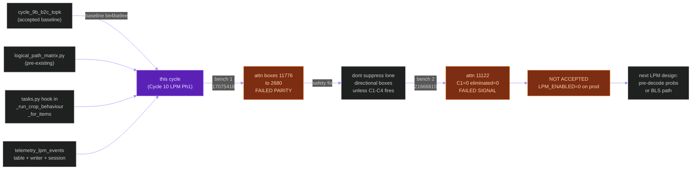
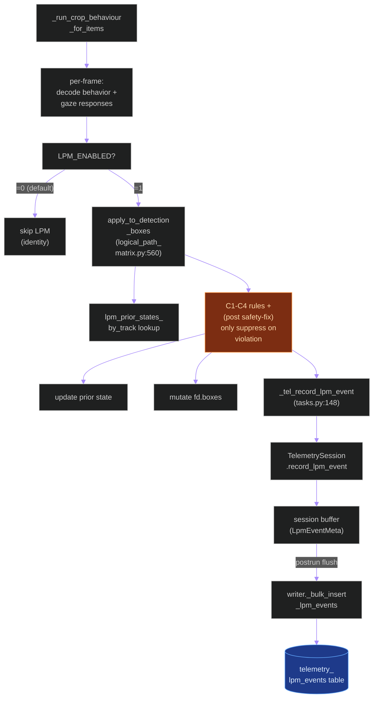
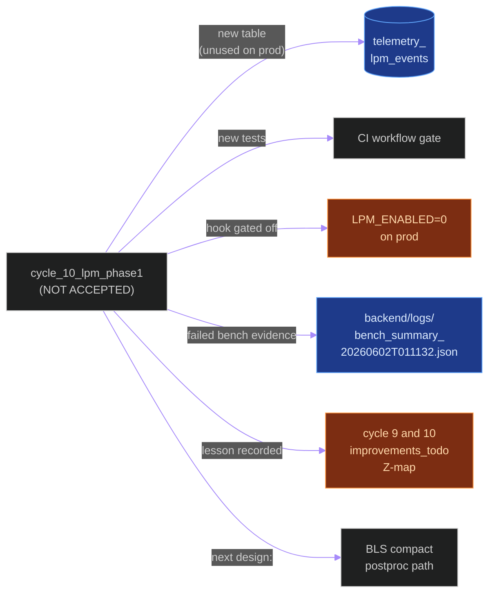
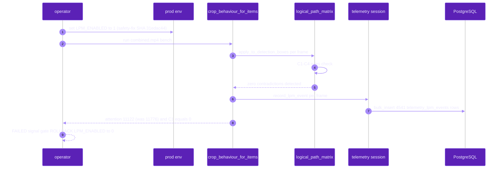
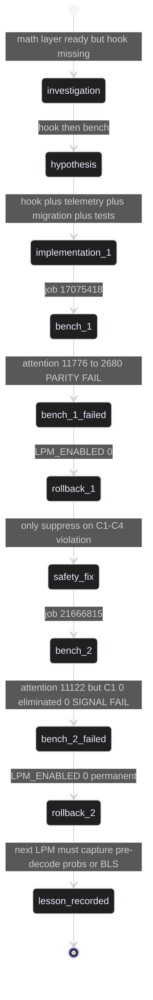

# `cycle_10_lpm_phase1`

**Last updated:** 2026-06-03
**Entity kind:** `cycle`
**Status:** `not_accepted`

> Logical Path Matrix (LPM) Phase 1 hook + telemetry. Wires the
> existing `apps.pipeline.services.logical_path_matrix` math layer
> into `_run_crop_behaviour_for_items()` post-decode and ships the
> new `telemetry_lpm_events` table. Two production benchmark
> attempts (`17075418` and `21666815`) both failed correctness or
> signal gates: the first dropped `attention_tracking` boxes
> `11776 → 2680`; the safety-fix retry restored most boxes
> (`11122`) but produced ZERO contradiction-reduction signal
> (`C1=0`, `eliminated=0`). Decision: **NEEDS FURTHER ITERATION —
> NOT ACCEPTED**. The lesson recorded: post-decode box suppression
> cannot be tuned further; the next LPM design must capture
> pre-decode gaze probabilities or run inside the future compact-
> postprocessing / BLS path. Production permanently runs with
> `LPM_ENABLED=0`.

## Source-of-truth references

| Kind | Reference |
|---|---|
| Doc | `docs/crop_frame_optimization_execution.md` § Cycle 10 (lines 466-628) |
| Doc | `docs/cycle_10_investigation.md` |
| Doc | `docs/cycle_10_lpm_phase1_results.md` |
| Doc | `docs/logical_path_matrix_spec.md` (math + acceptance design spec referenced § 8 telemetry, § 10 C.2.3 gates) |
| Doc | `docs/cycle_9_and_10_improvements_todo.md` § Z |
| Job | `17075418-4386-4b5f-85d4-ea23bec71f66` (first LPM Phase 1 bench — failed parity) |
| Job | `21666815-f4bd-4f5f-b90e-b9101b4d899d` (safety-fix bench — failed signal) |
| Job | `be4ba9ee-4786-48e9-8334-28feb237a1fb` (Cycle 9b B.2.c — accepted baseline this cycle was tested against) |
| Telemetry session | `be855e0e-6393-467a-9688-b723a29a56a4` (safety-fix run) |
| File | `backend/apps/pipeline/services/logical_path_matrix.py` (math layer; pre-existed but extended for bare labels + name-restricted Phase 1 classification) |
| File | `backend/apps/video_analysis/tasks.py` (line 148: `_tel_record_lpm_event`; `_run_crop_behaviour_for_items` now applies the LPM filter post-decode under `LPM_ENABLED=1`) |
| File | `backend/apps/telemetry/models.py` (line 230: `TelemetryLpmEvent`) |
| File | `backend/apps/telemetry/migrations/0002_telemetrylpmevent.py` |
| File | `backend/apps/telemetry/session.py` (added `LpmEventMeta`, `TelemetrySession.record_lpm_event`) |
| File | `backend/apps/telemetry/writer.py` (added `_bulk_insert_lpm_events`, JSON fallback keys) |
| File | `backend/tests/unit/video_analysis/test_lpm_crop_behaviour_hook.py` |
| File | `backend/tests/unit/telemetry/test_telemetry_layer.py` (LpmEventMeta + bulk insert) |
| File | `backend/tests/unit/pipeline/test_logical_path_matrix.py` (existing — C1-C4 + identity + structural exclusion) |
| File | `backend/logs/bench_summary_20260602T011132.json` (safety-fix bench summary) |
| File | `backend/logs/gpu_monitor_bench_20260602T011132.csv` |
| File | `backend/data/videos/21666815-f4bd-4f5f-b90e-b9101b4d899d/inference_audit.json` |
| Workflow | `.github/workflows/inference-parallelization.yml` (gates new integration test + telemetry app changes + Cycle 10 docs) |
| Commit | `99c455bf` (DSP Cycle 4 prior entry — `cycle_9b_b2c_topk`) |
| Replay key | `cycle10-lpm-crop-frame-20260601T201239` (first bench) |
| Replay key | `cycle10-lpm-violationonly-crop-frame-20260601T221110` (safety-fix bench) |
| Candidate SHA | `31edac44c66233baadd3a26ddd57b51b1a043d66` (safety-fix SHA) |
| Symbol | `apps.pipeline.services.logical_path_matrix.LpmConfig` (line 61) |
| Symbol | `apps.pipeline.services.logical_path_matrix.LpmFrameInput` (line 104) |
| Symbol | `apps.pipeline.services.logical_path_matrix.LpmState` (line 116) |
| Symbol | `apps.pipeline.services.logical_path_matrix.LpmBatchMetrics` (line 130) |
| Symbol | `apps.pipeline.services.logical_path_matrix.apply_to_detection_boxes` (line 560) |
| Symbol | `apps.video_analysis.tasks._tel_record_lpm_event` (tasks.py:148) |
| Symbol | `apps.telemetry.models.TelemetryLpmEvent` (models.py:230) |

## 1. Purpose and scope

LPM (Logical Path Matrix) is a constraint layer that resolves
contradictions between the three gaze axes
(`gaze_horizontal`, `gaze_vertical`, `gaze_depth`) per tracked
person. The math layer at
`backend/apps/pipeline/services/logical_path_matrix.py` already
existed with C1-C4 rule tests and an identity-disabled mode; this
cycle wires it into the production decode path AND ships the
`telemetry_lpm_events` table required by the spec § 8.

What landed in code:

- **Hook** in `_run_crop_behaviour_for_items()` that maintains a
  per-job `lpm_prior_states_by_track` dict and applies
  `apply_to_detection_boxes(...)` (logical_path_matrix.py:560) on
  each frame after behavior/gaze decode, gated by `LPM_ENABLED`.
- **Telemetry event** persisted per frame via
  `_tel_record_lpm_event(...)` (tasks.py:148) → `LpmEventMeta`
  (telemetry/session.py) → `TelemetryLpmEvent` (models.py:230).
- **Math-layer hardening**: bare-label matching (`left`, `right`,
  `up`, `down`, `forward`, `backward`) plus name-restricted Phase 1
  classification (only attention/gaze models — hand-raising
  `up/down` boxes stay out of scope).
- **Dual-sink writer**: `LpmEventMeta` flows through the existing
  JSON-first → DB path; `_bulk_insert_lpm_events` mirrors
  `_bulk_insert_model_calls` semantics.

What did NOT land: the cycle is gated off by default
(`LPM_ENABLED=0`). The only behavior on `=0` is the new telemetry
table being available (unused) and the hook checking the env flag.

Lesson recorded (the reason this cycle is NOT ACCEPTED): the
post-decode box suppression cannot recover the gaze decision once
the model has already collapsed to a single box per axis. The next
LPM design must move upstream — either capture pre-decode gaze
probabilities or run inside the future compact-postprocessing / BLS
path (Triton Python backend).

## 2. Position in the system

## 3. Internal structure (the four artifacts shipped)

| Artifact | File | Role |
|---|---|---|
| Math layer | `logical_path_matrix.py:61,104,116,130,560` | `LpmConfig`, `LpmFrameInput`, `LpmState`, `LpmBatchMetrics`, `apply_to_detection_boxes` |
| Crop-frame hook | `tasks.py` `_run_crop_behaviour_for_items` | Maintains `lpm_prior_states_by_track`; calls `apply_to_detection_boxes` when `LPM_ENABLED=1` |
| Telemetry record | `tasks.py:148` `_tel_record_lpm_event` | One row per frame where LPM ran |
| Telemetry table | `models.py:230` `TelemetryLpmEvent` + migration `0002` | Persists per-frame LPM metrics |
| Writer dual-sink | `writer.py` `_bulk_insert_lpm_events` | Bulk-inserts LPM rows alongside model-call rows |
| Session collector | `session.py` `LpmEventMeta`, `TelemetrySession.record_lpm_event` | ContextVar-bound collection (same semantics as model calls) |
| Tests | `test_lpm_crop_behaviour_hook.py`, `test_telemetry_layer.py`, `test_logical_path_matrix.py` | 65 + 156 passed locally |

## 4. Call graph (the LPM hook path when enabled)

## 5. External connections

## 6. API surface (env knobs)

| Variable | Default | Cycle 10 candidate | Prod (post-rollback) | Effect |
|---|---|---|---|---|
| `LPM_ENABLED` | `0` | `1` | **`0`** | Master gate for LPM hook + telemetry |
| (LPM config knobs in `LpmConfig`) | per math layer | per math layer | inert when disabled | Bounds + rule activations |

No new env vars beyond `LPM_ENABLED`.

## 7. Dependencies

| Dependency | Role |
|---|---|
| Cycle 9b B.2.c Top-K (`be4ba9ee`) | accepted baseline this cycle was benchmarked against |
| `apps.pipeline.services.logical_path_matrix` | math layer (pre-existing); cycle hardened bare-label matching |
| `apps.video_analysis.tasks._run_crop_behaviour_for_items` | call site that hooks the LPM filter |
| `apps.telemetry.writer` | dual-sink writer extended with `_bulk_insert_lpm_events` |
| `apps.telemetry.session` | ContextVar-bound collector extended with `LpmEventMeta` |
| `apps.telemetry.models.TelemetryLpmEvent` | persistence target |
| Migration `0002_telemetrylpmevent` | schema change shipped alongside the cycle |

## 8. Environment variables read

`LPM_ENABLED` (master gate). Plus the LPM config-knob set inside
`LpmConfig` (line 61); all inert when the master gate is off.

## 9. Sequence diagram (the failed safety-fix bench)

## 10. State machine (two-attempt rollback)

## 11. Failure modes (lessons paid for — twice)

| Failure | Bench evidence | Lesson |
|---|---|---|
| Box-suppression too aggressive | Bench 1 dropped `attention_tracking` `11776 → 2680` | Post-decode boxes carry no probability metadata; suppression cannot tell "low-confidence" from "decoded-with-evidence" |
| Safety-fix suppressed signal too | Bench 2: `C1=0`, `eliminated=0` despite the math layer running 4 541 times | Once the gaze model collapses to one box per axis, the contradictions that LPM is designed to catch have already been discarded upstream |
| The right design lives upstream | Recorded in `docs/cycle_9_and_10_improvements_todo.md` § Z | Future LPM iterations must run inside the future BLS path (Triton Python backend) where pre-decode gaze probabilities are still available |

## 12. Performance characteristics (the bench)

| Metric | Cycle 9 baseline | Cycle 10 safety-fix `21666815` | Decision gate |
|---|---:|---:|---|
| Overall FPS (DB completed) | 4.09 | 4.039 | **failed performance gate** |
| Detection rows | 72 749 | 72 095 | **failed parity gate** |
| `attention_tracking` boxes | 11 776 | 11 122 | **failed parity gate** |
| LPM `C1` violations | (expected non-zero) | **0** | **failed signal gate** |
| LPM eliminated contradictions | (expected non-zero) | **0** | **failed signal gate** |
| `telemetry_lpm_events` rows persisted | (n/a) | **4 541** | telemetry persistence works |
| LPM mean latency / frame | (target < 5 ms) | within budget | non-regressing |

Source: `docs/cycle_10_lpm_phase1_results.md`,
`docs/crop_frame_optimization_execution.md` § Cycle 10 (lines 583-624),
`docs/production_inference_benchmark.md` § 16.

## 13. Operational notes

- **Production is permanently on `LPM_ENABLED=0`** until a future
  cycle redesigns the lever. The telemetry table
  (`telemetry_lpm_events`) remains shipped but empty on prod.
- The math layer is left in-tree because the C1-C4 rules + identity
  tests + structural exclusion still pass and are needed by a future
  BLS-path implementation. Removing it would lose that work.
- The Cycle 10 hook code in `_run_crop_behaviour_for_items` short-
  circuits at the `LPM_ENABLED` check, so the disabled-path
  performance is unchanged from the Cycle 9b B.2.c accepted
  baseline.
- Spec § 10 "C.2.3 benchmark gates" remains the acceptance contract
  for any future LPM iteration.

## 14. Historical diagrams

> Not applicable: no diagrams in this cycle doc have been
> superseded yet. Two failed bench attempts are preserved as
> evidence in the original source-of-truth docs per § 19.5.

## 15. Related entities

| Entity | Path | Relationship |
|---|---|---|
| Cycle 9b B.2.c (current accepted) | `docs/entity/cycles/cycle_9b_b2c_topk.md` | accepted baseline this cycle was benchmarked against |
| Cycle 11.A input size (NOT ACCEPTED) | `docs/entity/cycles/cycle_11_input_size.md` (planned next DSP commit) | independent NOT-ACCEPTED follow-up |
| Triton inference plane | `docs/entity/systems/triton_inference_plane.md` | the host of any future BLS path implementation |
| `apps.pipeline` | `docs/entity/modules/apps.pipeline.md` | owns `logical_path_matrix.py` |
| `apps.video_analysis` | `docs/entity/modules/apps.video_analysis.md` | owns `_run_crop_behaviour_for_items` and `_tel_record_lpm_event` |
| `apps.telemetry` | `docs/entity/modules/apps.telemetry.md` | owns the new `TelemetryLpmEvent` table + dual-sink writer extension |
| Telemetry pipeline | `docs/entity/systems/telemetry_pipeline.md` | parent system extended by this cycle's dual-sink LPM rows |

## 16. Open questions

- **Q1.** Will the future BLS (Triton Python backend) path preserve
  pre-decode gaze probabilities long enough for LPM to act on them?
  *Owner:* pipeline inference maintainer. *Target close:* whichever
  future cycle ships a BLS prototype.
- **Q2.** Should the `telemetry_lpm_events` table be retained
  even when `LPM_ENABLED=0` forever? *Yes* per § 19.5 (preservation
  rule): leaving the migration in-tree is cheaper than reverting it
  and keeps the dual-sink writer + collector exercised by tests.

## 17. Change log

| Date | What changed | Commit |
|---|---|---|
| 2026-06-01 | First LPM Phase 1 bench (job `17075418`) failed parity gate; rolled back | (pre-DSP — see `docs/cycle_10_lpm_phase1_results.md`) |
| 2026-06-02 | Safety-fix bench (job `21666815`, SHA `31edac44c66233baadd3a26ddd57b51b1a043d66`) failed signal gate; rolled back permanently | (pre-DSP — see source-of-truth doc) |
| 2026-06-03 | DSP Cycle 4 entry 8/N — entity doc consolidating both NOT-ACCEPTED outcomes. All 5 diagrams verified locally with `mmdc` per constitution § 19.3.1 before push. | (this commit) |
