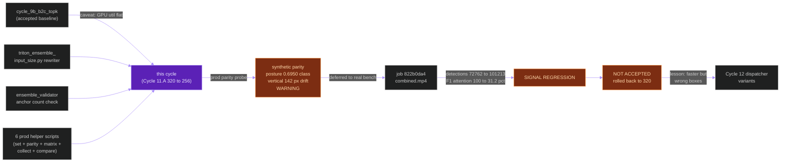
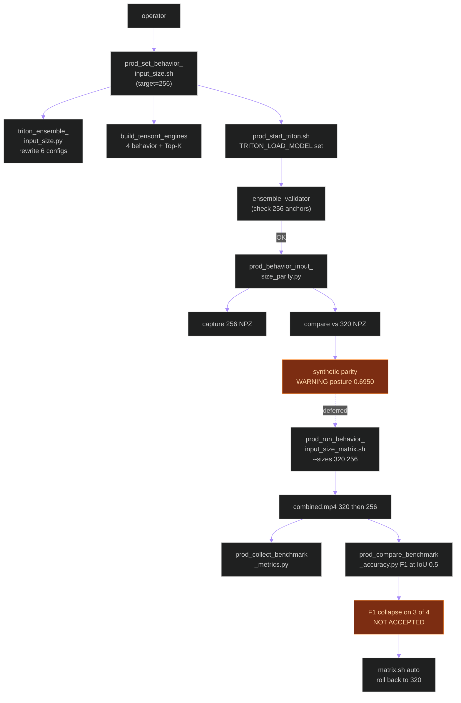
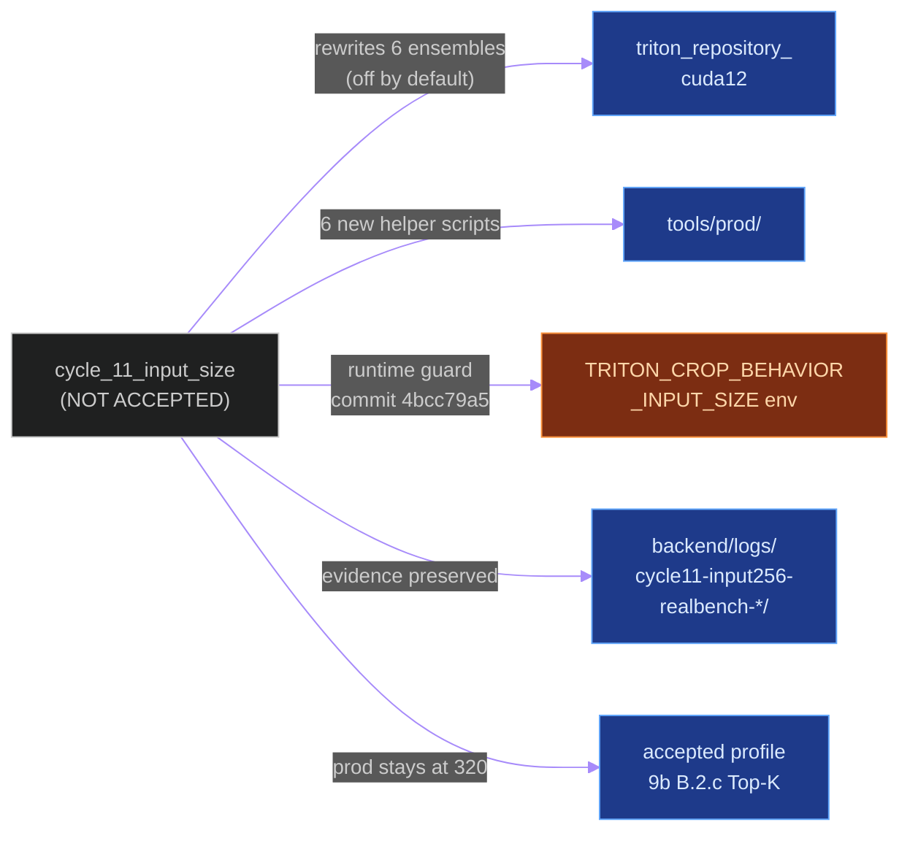
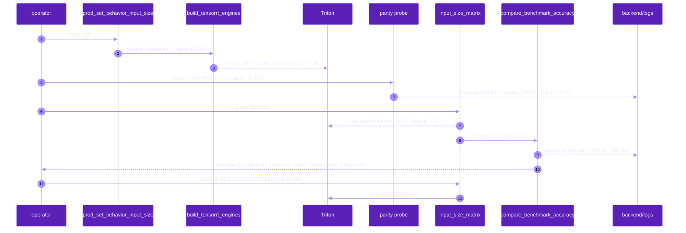
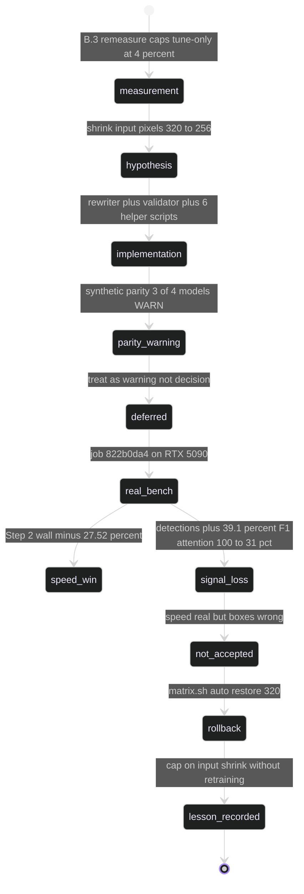

# `cycle_11_input_size`

**Last updated:** 2026-06-03
**Entity kind:** `cycle`
**Status:** `not_accepted`

> Third NOT-ACCEPTED cycle. Targeted the Cycle 9b B.2.c Top-K
> "GPU util flat" caveat by shrinking the four behavior-child input
> tensors from `320x320` to `256x256`. Production parity probe
> flagged class-agreement / centroid-drift WARNING but acceptance
> was deferred to the real benchmark. Real benchmark job
> `822b0da4-fbf2-4186-a5a6-dd066f2eb571` improved speed (Step 2 wall
> −27.5 %, DB FPS +8.58 %) but produced an unacceptable signal
> regression: detection rows surged `72 762 → 101 213` (+39.1 %)
> with `attention_tracking` agreement F1@IoU=0.5 collapsing
> `100 % → 31.2 %`. Production rolled back to `TRITON_CROP_BEHAVIOR
> _INPUT_SIZE=320`. Lesson: speed wins from input-pixel reduction
> are real but the new boxes are false positives, not better
> detections.

## Source-of-truth references

| Kind | Reference |
|---|---|
| Doc | `docs/crop_frame_optimization_execution.md` § Cycle 11.A (lines 951-1074) |
| Doc | `docs/cycle_11_input_size_investigation.md` |
| Doc | `docs/cycle_11_input_size_results.md` |
| Doc | `docs/cycle_9_and_10_improvements_todo.md` § Z |
| Job | `822b0da4-fbf2-4186-a5a6-dd066f2eb571` (NOT-ACCEPTED real benchmark, 256 candidate) |
| Job | `be4ba9ee-4786-48e9-8334-28feb237a1fb` (Cycle 9b B.2.c 320 Top-K — accepted baseline) |
| Replay key | `cycle11-input256-realbench-20260602T161641Z-input256` |
| File | `backend/apps/pipeline/services/triton_ensemble_input_size.py` (idempotent rewriter for ensemble `images` input dims) |
| File | `backend/apps/pipeline/services/ensemble_validator.py` (now validates `behavior_input_size` and derived YOLO anchor counts) |
| File | `tools/prod/prod_set_behavior_input_size.sh` (orchestrates config rewrite + engine rebuild + Top-K rebuild + restart) |
| File | `tools/prod/prod_behavior_input_size_parity.py` (two-pass capture/compare parity probe) |
| File | `tools/prod/prod_collect_benchmark_metrics.py` (collects DB + telemetry RTT + GPU CSV + audit metrics into one JSON/MD bundle) |
| File | `tools/prod/prod_run_behavior_input_size_matrix.sh` (320/256 matrix runner; rolls back to 320 by default) |
| File | `tools/prod/prod_compare_benchmark_accuracy.py` (agreement-F1 helper used by the bench) |
| File | `tools/prod/prod_start_triton.sh` (now uses explicit model loading when `TRITON_LOAD_MODEL` set; lets a different input-size experiment ignore stale compatibility ensembles) |
| File | `backend/logs/parity_capture_320_20260602T123459.npz` |
| File | `backend/logs/parity_capture_256_20260602T154826.npz` |
| File | `backend/logs/parity_input_size_256_20260602T154842.json` (synthetic parity WARNING) |
| File | `backend/logs/cycle11-input256-realbench-20260602T161641Z/input_256_metrics.json` |
| File | `backend/logs/cycle11-input256-realbench-20260602T161641Z/input_256_metrics.md` |
| File | `backend/logs/cycle11-input256-realbench-20260602T161641Z/model_agreement_320_vs_256.json` |
| File | `backend/logs/cycle11-input256-realbench-20260602T161641Z/model_agreement_320_vs_256.md` |
| File | `backend/logs/cycle11-input256-realbench-20260602T161641Z/matrix_runs.tsv` |
| Workflow | `.github/workflows/inference-parallelization.yml` |
| Commit | `89ef901c` (DSP Cycle 4 prior entry — `cycle_10_lpm_phase1`) |
| Commit | `4bcc79a5a4ea7c4d452b6fcd3ae3a6ff064a3bb5` (runtime guard for `TRITON_CROP_BEHAVIOR_INPUT_SIZE`) |

## 1. Purpose and scope

This cycle attacks the Cycle 9b B.2.c Top-K **caveat** (avg GPU util
did NOT improve). The named lever: **behavior-child input pixels**.
Shrinking `320x320 → 256x256` reduces per-crop FLOPs (~36 %) and
reduces dense intermediate activations.

Shipped artifacts (all helper-tier; the Triton repository changes
live only when `TRITON_CROP_BEHAVIOR_INPUT_SIZE=256` is enabled):

- **Idempotent input-size rewriter** for the six ensemble
  `images` input declarations
  (`triton_ensemble_input_size.py`).
- **Ensemble validator** now derives YOLO anchor counts from
  `behavior_input_size`; rejects ensembles whose anchor count does
  not match.
- **Operator scripts**:
  - `prod_set_behavior_input_size.sh` — rewrite + rebuild + restart.
  - `prod_behavior_input_size_parity.py` — two-pass capture-and-
    compare parity probe.
  - `prod_run_behavior_input_size_matrix.sh` — reproducible
    320 vs 256 matrix runner; rolls back by default.
  - `prod_collect_benchmark_metrics.py` — bundles DB + telemetry +
    GPU + audit into a single evidence file.
  - `prod_compare_benchmark_accuracy.py` — agreement-F1 helper at
    fixed IoU.

It does NOT change Triton engines without the env knob set; it does
NOT touch LPM, embedding stage, pose-runtime chunking, or any
non-behavior path.

## 2. Position in the system

## 3. Internal structure (the helper layer)

| File | Role |
|---|---|
| `triton_ensemble_input_size.py` | Idempotent rewriter for the 6 ensemble `images` input dims (`behavior_ensemble`, `behavior_ensemble_gaze2`, `behavior_ensemble_gaze_slice`, `behavior_ensemble_gaze_slice_topk`, plus the two slice/Top-K adapters' chained inputs) |
| `ensemble_validator.py` | `validate_behavior_ensemble_repository(behavior_input_size=...)` now also verifies derived YOLO anchor counts match the declared input dim |
| `prod_set_behavior_input_size.sh` | Rewrite config + rebuild engines + rebuild Top-K + restart Triton |
| `prod_behavior_input_size_parity.py` | Two-pass capture-and-compare against a frozen baseline NPZ |
| `prod_collect_benchmark_metrics.py` | Aggregates DB correctness + telemetry RTT + GPU CSV + inference audit into one evidence bundle |
| `prod_run_behavior_input_size_matrix.sh` | Reproducible 320 vs 256 matrix benchmark; rolls back to 320 on completion |
| `prod_compare_benchmark_accuracy.py` | Agreement F1 @ IoU helper used by the matrix runner |
| `prod_start_triton.sh` | Explicit model loading via `TRITON_LOAD_MODEL` — lets a 256 experiment ignore the stale 320 compatibility ensembles |

## 4. Call graph (the input-size switchboard)

## 5. External connections

## 6. API surface (env knobs)

| Variable | Pre-cycle | Cycle 11.A candidate | Prod (post-rollback) | Effect |
|---|---|---|---|---|
| `TRITON_CROP_BEHAVIOR_INPUT_SIZE` | `320` (implicit) | `256` | **`320`** | Drives rewriter + builder + validator |
| `TRITON_LOAD_MODEL` | unset | per-model set | unset | Explicit model loading so stale 320 compatibility ensembles don't block 256 |
| `GAZE_HORIZONTAL_HEAD_VARIANT` | `slice` | `slice` | `slice` | Unchanged from B.2.b |
| `TRITON_BEHAVIOR_TOP_K_ENABLED` / `_VALUE` | `1` / `100` | `1` / `100` | `1` / `100` | Unchanged |
| `MODEL_ROUTE_BEHAVIOR_ALL_MODEL_NAME` | `behavior_ensemble_gaze_slice_topk` | `behavior_ensemble_gaze_slice_topk` | unchanged | Same route — the candidate rebuilds the engines, not the route |

## 7. Dependencies

| Dependency | Role |
|---|---|
| Cycle 9b B.2.c Top-K (`be4ba9ee`) | accepted baseline this cycle was benchmarked against |
| `apps.pipeline.services.triton_ensemble_input_size` | new rewriter that this cycle introduced |
| `apps.pipeline.services.ensemble_validator` | extended with `behavior_input_size` + anchor count derivation |
| Triton inference plane | engines + adapters rebuilt at 256 then rolled back to 320 |
| `backend/scripts/build_tensorrt_engines.py` | rebuilds at the chosen input size |
| `.github/workflows/inference-parallelization.yml` | gates the new helper modules + tests |

## 8. Environment variables read

`TRITON_CROP_BEHAVIOR_INPUT_SIZE` (the cycle's primary knob),
`TRITON_LOAD_MODEL`, plus the Cycle 9b B.2.c env set inherited as
baseline.

## 9. Sequence diagram (the real benchmark + rollback)

## 10. State machine

## 11. Failure modes (lessons)

| Lesson | Why it matters |
|---|---|
| Synthetic parity is a WARNING not a DECISION | The synthetic probe flagged posture / gaze-vertical / gaze-depth as failing centroid drift; the team still ran the real bench to determine acceptance, per § 12 ("only real production benchmark gates acceptance") |
| Speed wins from input shrink are real | Step 2 wall did drop 27.52 % and behavior RTT mean dropped 39.28 % — the lever moved as predicted |
| But the new boxes are NOT better detections | Detection count rose +39.1 % while agreement F1@IoU=0.5 collapsed by 35-69 pp across 3 of 4 behavior children. The model produces more *false* detections at 256 |
| Anchor-count derivation belongs in the validator | `ensemble_validator.behavior_input_size` is now mandatory; any future input-size experiment must declare it or the startup gate rejects the ensemble |
| Engine rebuild is reversible | `prod_run_behavior_input_size_matrix.sh` rolls back to 320 automatically after every run, regardless of acceptance |

## 12. Performance characteristics (the bench)

| Metric | 320 Top-K baseline (`be4ba9ee`) | 256 candidate (`822b0da4`) | Δ | Decision gate |
|---|---:|---:|---:|---|
| DB-completed FPS | 4.439 | 4.820 | **+8.58 %** | speed gate passed |
| Step 2 FPS | 8.403 | 11.594 | **+37.97 %** | speed gate passed |
| Step 2 frame wall | 540.399 s | 391.673 s | **−27.52 %** | speed gate passed |
| Behavior RTT mean | 84.865 ms | 51.529 ms | **−39.28 %** | speed gate passed |
| GPU avg util | 9.344 % | 7.367 % | **−21.16 %** | (caveat target — got worse) |
| Detection rows | 72 762 | **101 213** | **+39.10 %** | **signal regression** |
| BBox rows | 72 762 | 101 213 | +39.10 % | signal regression |
| `attention_tracking` F1@IoU=0.5 | 100.000 % | **31.195 %** | **−68.805 pp** | **signal regression** |
| `hand_raising` F1@IoU=0.5 | 100.000 % | 38.032 % | −61.968 pp | signal regression |
| `person_detection` F1@IoU=0.5 | 100.000 % | 100.000 % | 0 pp | unchanged |
| `sitting_standing` F1@IoU=0.5 | 100.000 % | 65.250 % | −34.750 pp | signal regression |

Agreement F1 is from `prod_compare_benchmark_accuracy.py` — a
baseline-reference metric, not human-labeled ground truth. Per
spec, agreement loss this large is sufficient to reject.

Source: `docs/cycle_11_input_size_results.md`,
`docs/crop_frame_optimization_execution.md` § Cycle 11.A
(lines 1035-1067).

## 13. Operational notes

- Production runs `TRITON_CROP_BEHAVIOR_INPUT_SIZE=320` permanently.
- The 256 engines + adapter plans + the 6 helper scripts stay in
  the repo per § 19.5; they're cheap to keep and a prerequisite
  for any future "shrink-and-retrain" cycle.
- The `prod_run_behavior_input_size_matrix.sh` runner is the
  recommended way to reproduce any future input-size A/B; it
  rolls back to 320 by default.
- Any future input-size attempt MUST add a human-labeled accuracy
  gate before acceptance — agreement F1 against the 320 baseline
  is not enough because the 320 baseline itself isn't ground truth.

## 14. Historical diagrams

> Not applicable: no diagrams in this cycle doc have been
> superseded yet. The synthetic-parity warnings + real-bench
> agreement matrix are preserved as evidence per § 19.5.

## 15. Related entities

| Entity | Path | Relationship |
|---|---|---|
| Cycle 9b B.2.c (accepted) | `docs/entity/cycles/cycle_9b_b2c_topk.md` | accepted baseline this cycle was tested against |
| Cycle 10 LPM Phase 1 (NOT ACCEPTED) | `docs/entity/cycles/cycle_10_lpm_phase1.md` | sibling failed cycle on the same baseline |
| Cycle 12 dispatcher variants | `docs/entity/cycles/cycle_12_dispatcher_variants.md` (planned next DSP commit) | next attack on GPU util |
| Triton inference plane | `docs/entity/systems/triton_inference_plane.md` | system whose engines + ensembles the rewriter mutates |
| `apps.pipeline` | `docs/entity/modules/apps.pipeline.md` | owns `triton_ensemble_input_size`, `ensemble_validator` |
| `tools/prod/prod_set_behavior_input_size.sh` | (planned DSP Cycle 5) | the rewriter switchboard |
| `tools/prod/prod_run_behavior_input_size_matrix.sh` | (planned DSP Cycle 5) | the matrix runner |
| `tools/prod/prod_compare_benchmark_accuracy.py` | (planned DSP Cycle 5) | agreement F1 helper |

## 16. Open questions

- **Q1.** Can the four behavior children be retrained at 256 to
  recover agreement F1? *Owner:* modelling lead. *Target close:*
  whichever future cycle proposes a retrain bundle.
- **Q2.** Should `ensemble_validator.behavior_input_size` reject
  experiments that don't ship a paired human-labeled gate? *Yes
  per § 12* — current behavior is to warn; tighter enforcement is
  a future cycle.

## 17. Change log

| Date | What changed | Commit |
|---|---|---|
| 2026-06-02 | Cycle 11.A real benchmark NOT ACCEPTED; rolled back to 320 | runtime guard `4bcc79a5a4ea7c4d452b6fcd3ae3a6ff064a3bb5` |
| 2026-06-03 | DSP Cycle 4 entry 9/N — entity doc consolidating Cycle 11.A's NOT-ACCEPTED outcome. All 5 diagrams verified locally with `mmdc` per constitution § 19.3.1 before push. | (this commit) |
