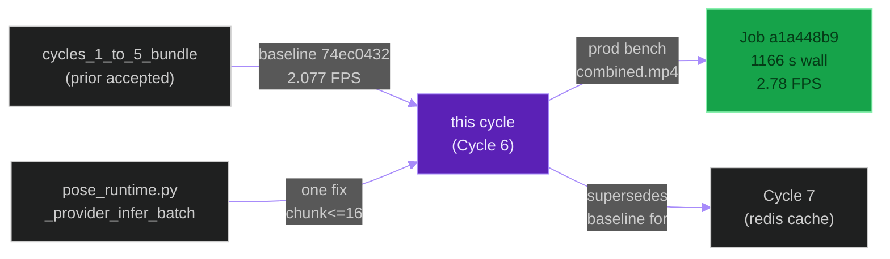
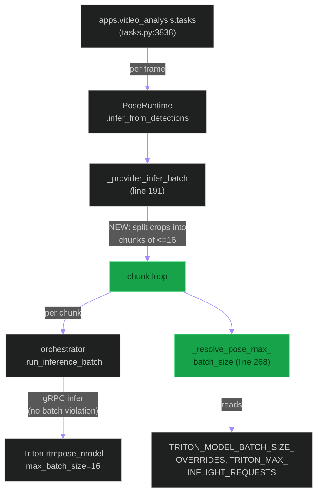
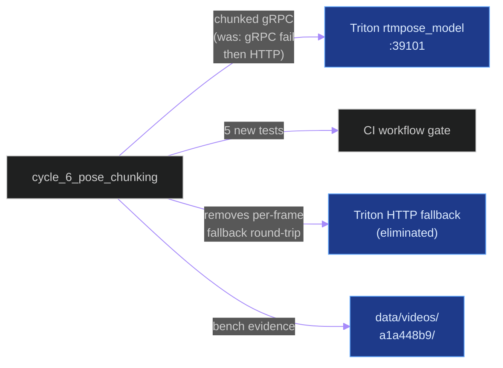
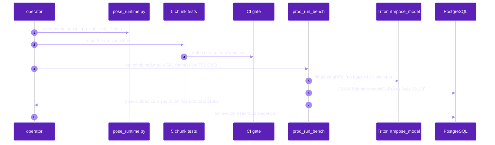
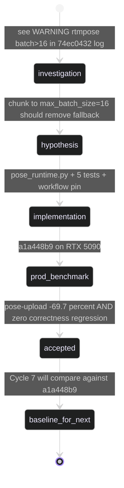

# `cycle_6_pose_chunking`

**Last updated:** 2026-06-03
**Entity kind:** `cycle`
**Status:** `accepted`

> Pose-runtime `rtmpose_model` batch>16 fix. Before this cycle every
> frame whose dynamic pose cap exceeded 16 person crops fell back to
> HTTP (the gRPC call was rejected with `INVALID_ARGUMENT`). This
> cycle made `PoseRuntime._provider_infer_batch` chunk its payloads
> to `max_batch_size=16` before dispatch. Accepted by production job
> `a1a448b9-474f-4dea-942b-3288bcae6900` on 2026-06-01: pose-upload
> block dropped 12 m 13 s → 3 m 42 s (−69.7 %), overall FPS
> (DB-completed basis) 2.077 → 2.78 (+33.8 % over Cycles 1-5,
> +112 % over the original baseline `77650001`).

## Source-of-truth references

| Kind | Reference |
|---|---|
| Doc | `docs/crop_frame_optimization_execution.md` § Cycle 6 (lines 134-238) |
| Doc | `docs/production_inference_benchmark.md` (Cycle 6 row at line 736 onward) |
| Doc | `docs/inference_parallelization_plan.md` (parent plan) |
| Doc | `docs/cycle_9_and_10_improvements_todo.md` § Z |
| Job | `a1a448b9-474f-4dea-942b-3288bcae6900` (accepted production benchmark) |
| Job | `74ec0432-995c-487e-9d77-1048ec109fb1` (Cycles 1-5 reference baseline) |
| File | `backend/apps/pipeline/services/pose_runtime.py` (the file changed) |
| File | `backend/tests/unit/pipeline/test_pose_runtime_batch_chunking.py` (5 regression tests) |
| File | `backend/apps/video_analysis/tasks.py` (line 3838: `PoseRuntime.infer_from_detections` call site) |
| File | `backend/models/triton_repository_cuda12/rtmpose_model/config.pbtxt` (the engine whose `max_batch_size=16` was violated) |
| Workflow | `.github/workflows/inference-parallelization.yml` (gate updated to require the new tests) |
| Commit | `17b3745d` (the implementation commit referenced by `crop_frame_optimization_execution.md` § Cycle 6 Phase 3) |
| Commit | `691ecf3e` (DSP Cycle 4 prior entry — `cycles_1_to_5_bundle`) |
| Symbol | `apps.pipeline.services.pose_runtime.PoseRuntime` (pose_runtime.py:28) |
| Symbol | `apps.pipeline.services.pose_runtime.PoseRuntime._provider_infer_batch` (pose_runtime.py:191) |
| Symbol | `apps.pipeline.services.pose_runtime.PoseRuntime._resolve_pose_max_batch_size` (pose_runtime.py:268) |
| Symbol | `apps.pipeline.services.pose_runtime.PoseRuntimeResult` (pose_runtime.py:21) |
| Symbol | `apps.pipeline.services.pose_runtime.map_provider_fallback_reason` (pose_runtime.py:355) |

## 1. Purpose and scope

This cycle attacks a **single** root cause: the pose dispatcher
bypassed the chunking helper that every other model path used.
Concretely:

- `PoseRuntime._provider_infer_batch` (pose_runtime.py:191) built one
  Triton payload per detection crop and called
  `orchestrator.run_inference_batch(frame_payloads=...)` for the
  whole list.
- With `TRITON_TRUE_BATCH_REQUESTS=1` (set by Cycle 5), the
  orchestrator stacked all payloads into one gRPC call **without**
  enforcing the model's `max_batch_size=16`.
- `rtmpose_model/config.pbtxt` declares `max_batch_size=16`; the
  Triton server returned `INVALID_ARGUMENT` and the client fell back
  to a per-frame HTTP request (~50-100 ms each) per
  `tasks.py:3838` log evidence.

The behavior-model path in `apps.video_analysis.tasks._infer_task_batch`
already chunks via `_effective_task_batch_size(...)`. This cycle
replicates that discipline for pose.

It does NOT change Triton engines, does NOT change the dynamic cap
math at `tasks.py:3817`, does NOT touch Cycles 1-5 env knobs. It only
inserts a chunked dispatch loop in one method.

## 2. Position in the system

## 3. Internal structure (the single fix)

| File | Change |
|---|---|
| `pose_runtime.py:191` `_provider_infer_batch` | Wrap the orchestrator call in a chunked loop where the chunk size = `_resolve_pose_max_batch_size()` |
| `pose_runtime.py:268` `_resolve_pose_max_batch_size` | New helper reading `TRITON_MODEL_BATCH_SIZE_OVERRIDES["pose_estimation"]`, default 16, bounded by `TRITON_MAX_INFLIGHT_REQUESTS` |
| `test_pose_runtime_batch_chunking.py` | 5 unit tests: 4 crops (1 chunk), 20 crops (2 chunks: 16+4), 40 crops (3 chunks), invalid override fallback, empty input |
| `.github/workflows/inference-parallelization.yml` | Pin the new test file + Cycle 1-5 telemetry-writer regression suite |

## 4. Call graph (where the chunk loop sits)

## 5. External connections

## 6. API surface (env knobs touched)

| Variable | Pre-cycle | Post-cycle | Effect |
|---|---|---|---|
| `TRITON_MODEL_BATCH_SIZE_OVERRIDES` | (unread by pose) | **read by `_resolve_pose_max_batch_size`** | Allows per-model chunk size override; defaults to engine's `max_batch_size=16` |
| `TRITON_MAX_INFLIGHT_REQUESTS` | (unread by pose) | **read as chunk upper bound** | Caps the chunk size to inflight limit if smaller |

No new env vars were introduced; the cycle adopted two existing ones.

## 7. Dependencies

| Dependency | Role |
|---|---|
| Cycles 1-5 bundle | Baseline reference (job `74ec0432`) |
| `apps.video_analysis.tasks` | Calls `PoseRuntime.infer_from_detections` at `tasks.py:3838` |
| `apps.pipeline.services.inference_orchestrator` | `run_inference_batch` is the orchestrator entry the chunk loop calls |
| Triton `rtmpose_model` | `max_batch_size=16` is the contract this cycle finally respects |
| `.github/workflows/inference-parallelization.yml` | Gate updated alongside the code change per constitution § 12.7 |

## 8. Environment variables read

`TRITON_MODEL_BATCH_SIZE_OVERRIDES["pose_estimation"]`,
`TRITON_MAX_INFLIGHT_REQUESTS` — both via
`_resolve_pose_max_batch_size` at `pose_runtime.py:268`.

## 9. Sequence diagram (the bench run that proved Cycle 6)

## 10. State machine (the acceptance flow per § 12)

## 11. Failure modes (what the cycle's authors considered)

| Considered | Why rejected |
|---|---|
| Raise `rtmpose_model max_batch_size` to 32 | Requires rebuilding the TensorRT engine; risk of accuracy drift; the per-frame chunk loop achieves the same throughput |
| Cap `dynamic_cap` to 16 at `tasks.py:3817` | Would lose pose data for frames with >16 detections; correctness regression |
| Switch pose to HTTP only | Per-frame HTTP fallback was already the slow path; making it the only path is strictly worse |

## 12. Performance characteristics (the bench)

| Metric | Cycles 1-5 `74ec0432` | Cycle 6 `a1a448b9` | Δ vs Cycles 1-5 | Δ vs `77650001` baseline |
|---|---:|---:|---:|---:|
| Total wall (s) | 2 186 | **1 166** | **−46.7 %** | −66.4 % |
| Step 2 frame inference wall | 883 s | 879 s | −0.5 % (unchanged, as designed) | — |
| Step 2 → step 3 transition | 13 m 27 s | **5 m 10 s** | **−61.5 %** | — |
| Pose-upload block | 12 m 13 s | **3 m 42 s** | **−69.7 %** | — |
| Overall FPS (bench probe) | 2.644 | 2.776 | +5.0 % | — |
| Overall FPS (DB-completed) | 2.077 | **2.78** | **+33.8 %** | **+112 %** |
| Frames persisted | 4 541 | 4 541 | parity | parity |
| Detections | 72 743 | 72 752 | +9 (+0.012 %) | — |
| `rtmpose batch>16` warnings | many | **0** | bug fixed | bug fixed |
| TelemetryModelCall rows / job | 29 123 | 20 348 | −30 % (fewer pose retry calls) | — |
| Worker RSS | ~2 GiB | ~2 GiB | parity | parity |

Source: `docs/crop_frame_optimization_execution.md` § Cycle 6 Phase 4
(lines 198-227).

## 13. Operational notes

- The chunk size is read each call via `_resolve_pose_max_batch_size`,
  so an operator can override it without rebuilding by exporting
  `TRITON_MODEL_BATCH_SIZE_OVERRIDES='{"pose_estimation": 8}'`.
- Pose-runtime fallback to HTTP is **still** wired up — it now only
  fires on genuine gRPC errors (not batch-size violations), which
  preserves the fail-open contract for transient transport issues.
- The pose-upload block is no longer the dominant tail; Cycle 7
  targets the next-largest tail (embedding loop redis chatter).

## 14. Historical diagrams

> Not applicable: no diagrams in this cycle doc have been superseded
> yet.

## 15. Related entities

| Entity | Path | Relationship |
|---|---|---|
| Cycles 1-5 bundle | `docs/entity/cycles/cycles_1_to_5_bundle.md` | predecessor baseline (job `74ec0432`) |
| Cycle 7 (redis cache) | `docs/entity/cycles/cycle_7_redis_client_cache.md` (planned next DSP commit) | successor; compares against Cycle 6 `a1a448b9` |
| Offline inference pipeline | `docs/entity/systems/offline_inference_pipeline.md` | the system this cycle optimised |
| `apps.pipeline` | `docs/entity/modules/apps.pipeline.md` | owns `pose_runtime.py` |
| `apps.video_analysis` | `docs/entity/modules/apps.video_analysis.md` | call-site `tasks.py:3838` |
| Triton inference plane | `docs/entity/systems/triton_inference_plane.md` | `rtmpose_model` engine + its `max_batch_size=16` constraint |
| `pose_runtime.py` | `docs/entity/code/pose_runtime.md` (planned DSP Cycle 6) | code-level doc that will cover the chunked-dispatch invariant |

## 16. Open questions

> All closed by the prod-bench acceptance on 2026-06-01. No
> outstanding follow-up for the cycle itself; further pose tail
> work belongs to Cycle 14a (`cycle_14a_pose_tail_decomposition`).

## 17. Change log

| Date | What changed | Commit |
|---|---|---|
| 2026-06-01 | Cycle 6 accepted by production benchmark `a1a448b9` | `17b3745d` (Cycle 6 implementation) |
| 2026-06-03 | DSP Cycle 4 entry 2/N — entity doc consolidating the cycle. All 5 diagrams verified locally with `mmdc` per constitution § 19.3.1 before push. | (this commit) |
