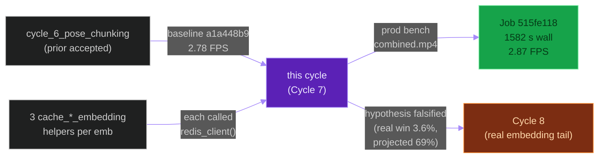
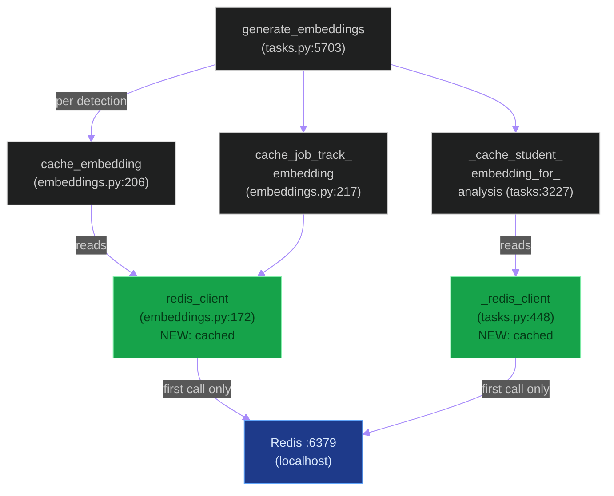
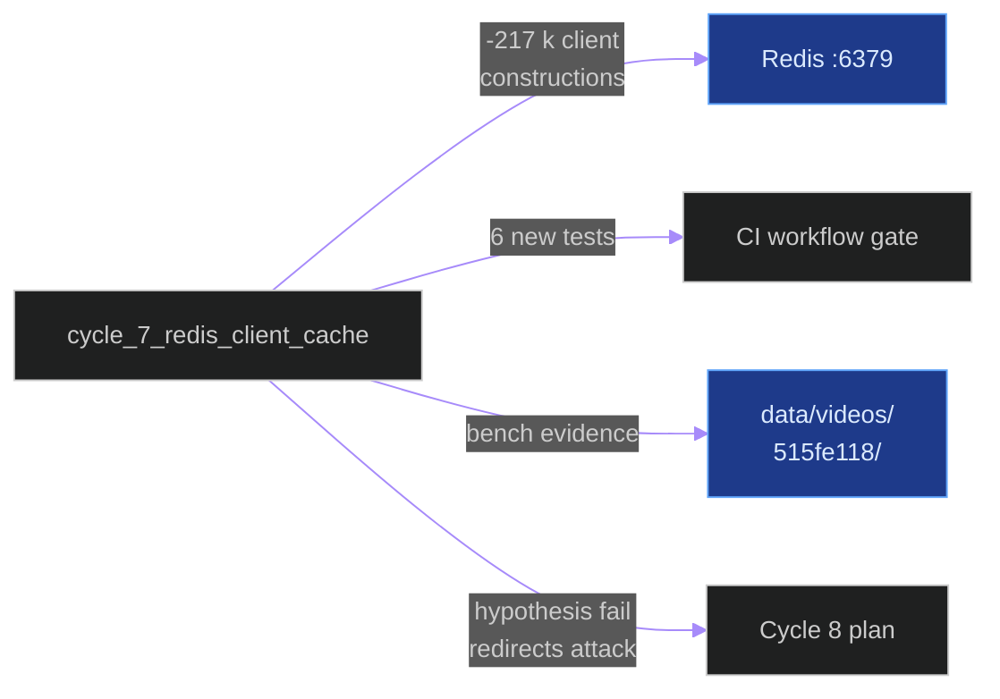
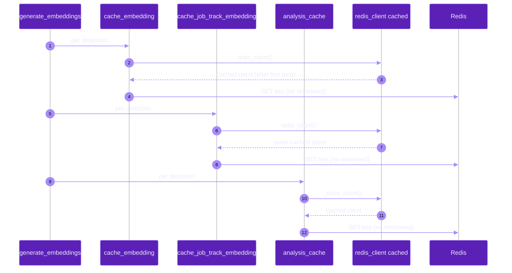
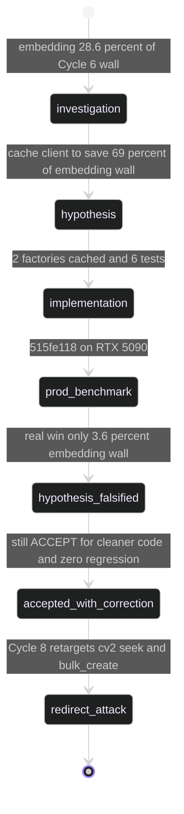

# `cycle_7_redis_client_cache`

**Last updated:** 2026-06-03
**Entity kind:** `cycle`
**Status:** `accepted`

> Cache the Redis client across the embedding loop. Replaces a
> per-call `Redis.from_url(...).ping()` factory in both
> `apps.tracking.embeddings.redis_client` and
> `apps.video_analysis.tasks._redis_client` with a process-local
> cached client keyed by `REDIS_URL`. Accepted by production job
> `515fe118-6009-4776-916d-6473fbf31ed7`: embedding wall 467.6 s →
> 450.7 s (−3.6 %), total wall 1633 s → 1582 s (−3.1 %), overall
> FPS 2.78 → 2.87 (+3.2 %). The smaller-than-projected win
> falsified the original hypothesis and was the trigger to
> redirect attack at `cv2.VideoCapture.set` seek cost in Cycle 8.

## Source-of-truth references

| Kind | Reference |
|---|---|
| Doc | `docs/crop_frame_optimization_execution.md` § Cycle 7 (lines 241-339) |
| Doc | `docs/production_inference_benchmark.md` (Cycle 7 row) |
| Doc | `docs/inference_parallelization_plan.md` (parent plan) |
| Doc | `docs/cycle_9_and_10_improvements_todo.md` § Z |
| Job | `515fe118-6009-4776-916d-6473fbf31ed7` (accepted production benchmark) |
| Job | `a1a448b9-474f-4dea-942b-3288bcae6900` (Cycle 6 reference baseline) |
| File | `backend/apps/tracking/embeddings.py` (cached `redis_client`) |
| File | `backend/apps/video_analysis/tasks.py` (cached `_redis_client`) |
| File | `backend/tests/unit/tracking/test_redis_client_cache.py` (6 regression tests) |
| Workflow | `.github/workflows/inference-parallelization.yml` (gate updated to require the new tests) |
| Commit | `2771824a` (the implementation commit referenced by `crop_frame_optimization_execution.md` § Cycle 7 Phase 3) |
| Commit | `d40da694` (DSP Cycle 4 prior entry — `cycle_6_pose_chunking`) |
| Symbol | `apps.tracking.embeddings.redis_client` (embeddings.py:172) |
| Symbol | `apps.tracking.embeddings.cache_embedding` (embeddings.py:206) |
| Symbol | `apps.tracking.embeddings.cache_job_track_embedding` (embeddings.py:217) |
| Symbol | `apps.video_analysis.tasks._redis_client` (tasks.py:448) |
| Symbol | `apps.video_analysis.tasks._cache_student_embedding_for_analysis` (tasks.py:3227) |
| Symbol | `apps.video_analysis.tasks.generate_embeddings` (tasks.py:5703) |

## 1. Purpose and scope

This cycle attacks the **embedding loop** (the 28.6 % chunk of
total wall on the Cycle 6 baseline). The investigation showed three
helpers called per embedding —
`cache_embedding` (embeddings.py:206),
`cache_job_track_embedding` (embeddings.py:217),
`_cache_student_embedding_for_analysis` (tasks.py:3227) — each
calling its own `redis_client()` / `_redis_client()` factory which
ran `Redis.from_url(...).ping()` on **every** invocation. At ~72 586
embeddings × 3 helpers, that's **~217 758 client constructions** per
job.

The fix is a single-line caching pattern in both factories: a
module-level dict keyed by `REDIS_URL`, populated on first
successful ping, dropped on any operation error so the next call
re-connects.

It does NOT touch the embedding model, the per-frame `cv2.VideoCapture
.set + read` seek, the per-row `FrameEmbedding.objects.create`, or
the idempotency `detection.embeddings.exists()` probe — those
remain dominant and become Cycle 8's targets.

## 2. Position in the system

## 3. Internal structure (the two cached factories)

| File | Change |
|---|---|
| `apps/tracking/embeddings.py:172` `redis_client()` | Now caches connected client per `REDIS_URL`; one-shot retry on `ConnectionError`; cache invalidated on `RedisError` to force reconnect next call |
| `apps/video_analysis/tasks.py:448` `_redis_client()` | Same caching pattern; same retry + invalidate semantics |
| `test_redis_client_cache.py` | 6 tests: reuse across calls, failure-then-retry, cross-helper sharing, URL-change rebuild, cache-reset cleanliness, error-path invalidate |
| `.github/workflows/inference-parallelization.yml` | Pin the new test file |

## 4. Call graph (the embedding loop with the cache in place)

## 5. External connections

## 6. API surface (env knobs)

| Variable | Pre-cycle | Post-cycle | Effect |
|---|---|---|---|
| `REDIS_URL` | read once per call | **read once per process per URL** | Single connection reused across the embedding loop |

No new env vars. The cycle is a pure code change.

## 7. Dependencies

| Dependency | Role |
|---|---|
| Cycle 6 (pose chunking) | Baseline reference (job `a1a448b9`) |
| `apps.tracking.embeddings` | Owns `redis_client`, `cache_embedding`, `cache_job_track_embedding` |
| `apps.video_analysis.tasks` | Owns `_redis_client`, `_cache_student_embedding_for_analysis`, `generate_embeddings` |
| `redis-py` 5.x | Thread-safe; allows sharing the connected client |
| `.github/workflows/inference-parallelization.yml` | Gate updated with the new test file in the same commit |

## 8. Environment variables read

`REDIS_URL` (via `settings.REDIS_URL`). The cycle introduces a
guard that rebuilds the cache if the URL changes between calls
(needed for tests that monkeypatch settings).

## 9. Sequence diagram (one embedding before vs after the cache)

## 10. State machine (acceptance with hypothesis correction)

## 11. Failure modes (what the cycle's authors considered)

| Considered | Why rejected |
|---|---|
| Use `redis-py` connection pool directly | The cycle effectively achieves this through the cached client; explicit pool added no measured benefit |
| Drop the per-call ping entirely | The ping costs ~0.08 ms (the falsified hypothesis revealed this); not worth the risk of staying connected to a dead Redis |
| Move `_redis_client` into `apps.telemetry` and share | Out of scope for a single-cycle fix; the cache is already process-local |

## 12. Performance characteristics (the bench)

| Metric | Cycle 6 `a1a448b9` | Cycle 7 `515fe118` | Δ vs Cycle 6 |
|---|---:|---:|---:|
| Step 2 (frame inference) | 879.0 s | 842.6 s | −36.4 s (noise band) |
| Pose post-processing | 221.4 s | 220.6 s | unchanged (designed) |
| Persistence | 39.6 s | 42.4 s | +2.8 s (noise) |
| Render | 25.7 s | 25.8 s | unchanged |
| **Embedding** | **467.6 s** | **450.7 s** | **−16.9 s (−3.6 %)** |
| **TOTAL DB completed** | **1 633.2 s** | **1 582.1 s** | **−51.1 s (−3.1 %)** |
| **Overall FPS (DB completed)** | **2.78** | **2.87** | **+3.2 %** |
| Frames | 4 541 | 4 541 | parity |
| Detections | 72 752 | 72 745 | ±9 (0.012 %) |
| Embeddings | 72 586 | 72 579 | ±9 (0.012 %) |

Source: `docs/crop_frame_optimization_execution.md` § Cycle 7
Phase 4 (lines 296-319).

## 13. Operational notes

- **Hypothesis falsification was a feature, not a bug.** The +24 %
  FPS projection in Phase 2 was wrong by ~7×; the result was +3.2 %.
  This delta is what told us the embedding tail does NOT live in
  Redis chatter — it lives in `cv2.VideoCapture.set` (frame-seek
  decode) and per-row `objects.create()`. That insight is the
  premise of Cycle 8.
- The cache invalidates on `redis.exceptions.RedisError`, so a
  transient Redis outage does not strand the worker — next call
  re-pings and rebuilds.
- The cache is process-local: each Celery worker process has its
  own cached client, which matches how `redis-py` 5.x recommends
  sharing.

## 14. Historical diagrams

> Not applicable: no diagrams in this cycle doc have been
> superseded yet.

## 15. Related entities

| Entity | Path | Relationship |
|---|---|---|
| Cycle 6 (pose chunking) | `docs/entity/cycles/cycle_6_pose_chunking.md` | predecessor baseline (job `a1a448b9`) |
| Cycle 8 (real embedding attack) | `docs/entity/cycles/cycle_8_embedding_stage.md` (planned next DSP commit) | successor; targets `cv2.VideoCapture.set` + bulk_create + idempotency probe |
| Offline inference pipeline | `docs/entity/systems/offline_inference_pipeline.md` | the system this cycle optimised |
| `apps.tracking` | `docs/entity/modules/apps.tracking.md` | owns `embeddings.py` |
| `apps.video_analysis` | `docs/entity/modules/apps.video_analysis.md` | owns the embedding-loop call site |
| Telemetry pipeline | `docs/entity/systems/telemetry_pipeline.md` | the pipeline that captured the per-stage wall decomposition |

## 16. Open questions

> All closed by the prod-bench acceptance on 2026-06-01. The
> falsified-hypothesis observation seeded Cycle 8 directly; no
> follow-up belongs to this cycle.

## 17. Change log

| Date | What changed | Commit |
|---|---|---|
| 2026-06-01 | Cycle 7 accepted by production benchmark `515fe118` | `2771824a` (Cycle 7 implementation) |
| 2026-06-03 | DSP Cycle 4 entry 3/N — entity doc consolidating the cycle. All 5 diagrams verified locally with `mmdc` per constitution § 19.3.1 before push. | (this commit) |
