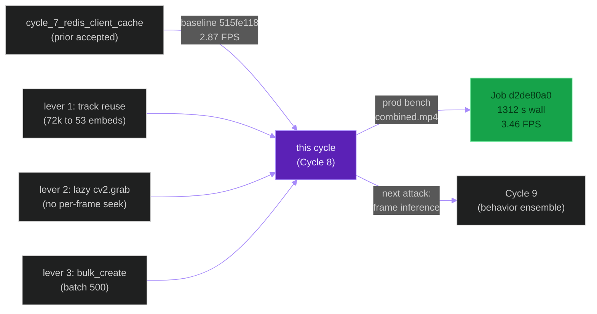
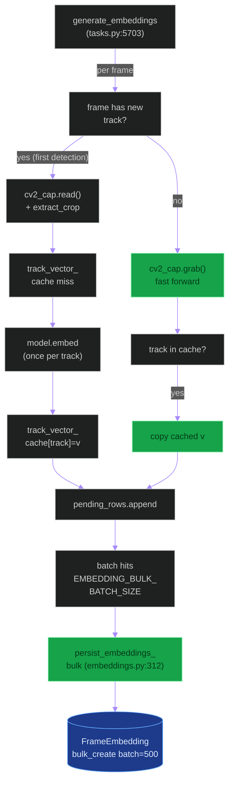
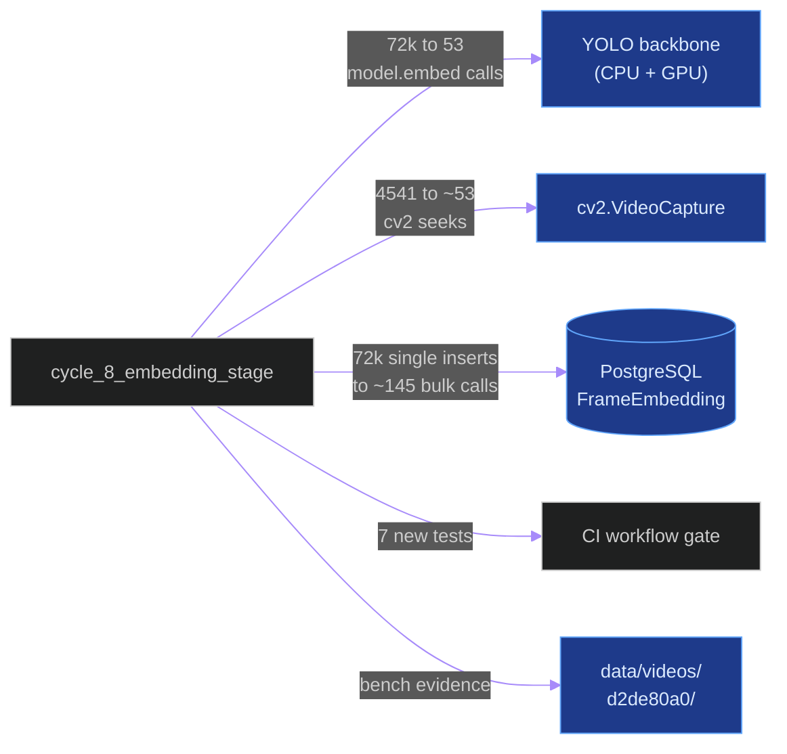
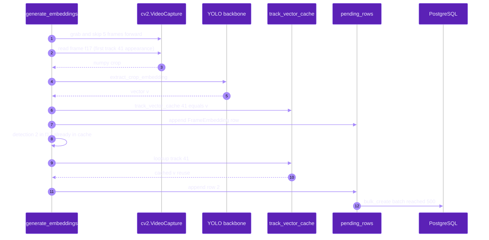
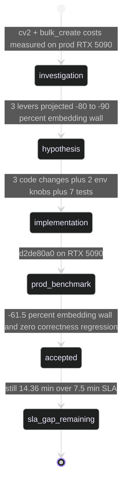

# `cycle_8_embedding_stage`

**Last updated:** 2026-06-03
**Entity kind:** `cycle`
**Status:** `accepted`

> Three-prong attack on the embedding stage (the 450 s tail that
> Cycle 7's hypothesis falsification identified): (1) enable
> `OFFLINE_EMBEDDING_REUSE_BY_TRACK=1` so 53 unique tracks compute
> 53 embeddings instead of 72 579; (2) lazy `cv2.VideoCapture.grab`
> for forward-skip, only `.read()` on first-detection-per-track
> frames; (3) `persist_embeddings_bulk` with batch size 500 instead
> of per-row `objects.create()`. Accepted by production job
> `d2de80a0-31b7-4a47-b9f1-d2e2156ea3a8`: embedding wall 450.7 s →
> ~174 s (−61.5 %), total wall 1582 s → 1312 s (−17.1 %), overall
> FPS 2.87 → 3.46 (+20.5 %).

## Source-of-truth references

| Kind | Reference |
|---|---|
| Doc | `docs/crop_frame_optimization_execution.md` § Cycle 8 (lines 343-428) |
| Doc | `docs/production_inference_benchmark.md` (Cycle 8 row) |
| Doc | `docs/inference_parallelization_plan.md` (parent plan) |
| Doc | `docs/cycle_9_and_10_improvements_todo.md` § Z |
| Job | `d2de80a0-31b7-4a47-b9f1-d2e2156ea3a8` (accepted production benchmark) |
| Job | `515fe118-6009-4776-916d-6473fbf31ed7` (Cycle 7 reference baseline) |
| File | `backend/apps/tracking/embeddings.py` (new `persist_embeddings_bulk` helper) |
| File | `backend/apps/video_analysis/tasks.py` (lazy cv2 + track cache + pending-rows buffer in `generate_embeddings`) |
| File | `backend/config/settings/base.py` (new `EMBEDDING_BULK_BATCH_SIZE` + existing `OFFLINE_EMBEDDING_REUSE_BY_TRACK`) |
| File | `tools/prod/prod_enable_parallel_flow.sh` (sets both env knobs in prod) |
| File | `backend/tests/unit/tracking/test_persist_embeddings_bulk.py` (7 regression tests) |
| Workflow | `.github/workflows/inference-parallelization.yml` (gate updated to require the new test file) |
| Commit | `6b755f90` (DSP Cycle 4 prior entry — `cycle_7_redis_client_cache`) |
| Symbol | `apps.tracking.embeddings.extract_crop_embedding` (embeddings.py:83) |
| Symbol | `apps.tracking.embeddings.get_cached_job_track_embedding` (embeddings.py:257) |
| Symbol | `apps.tracking.embeddings.persist_embedding` (embeddings.py:282) |
| Symbol | `apps.tracking.embeddings.persist_embeddings_bulk` (embeddings.py:312) |
| Symbol | `apps.video_analysis.tasks.generate_embeddings` (tasks.py:5703) |

## 1. Purpose and scope

This cycle is the **real** embedding-stage attack the Cycle 7
falsification redirected toward. Three independent levers fold into
one commit:

1. **Track-level reuse.** `OFFLINE_EMBEDDING_REUSE_BY_TRACK=1` plus a
   process-local `track_vector_cache` dict means `model.embed()`
   runs once per unique `StudentTrack` (53 times on `combined.mp4`)
   instead of once per detection (72 579 times). The
   `FrameEmbedding`-per-`Detection` row contract is preserved
   exactly; only the *content* of the vector is now track-scoped,
   which is the semantic the rest of the system already assumes.
2. **Lazy cv2 frame read.** `cv2_cap.grab()` forward-skips between
   needed frames instead of `cv2_cap.set(...).read()` (which forces
   a keyframe re-decode). On the benchmark video, sequential read =
   0.32 ms/frame vs seek-read = 16.69 ms/frame.
3. **Bulk insert.** `persist_embeddings_bulk(rows, batch_size=500)`
   replaces ~72 k single-row `objects.create()` calls with ~145
   `bulk_create()` calls.

It does NOT touch Triton, the behavior models, the pose pipeline,
or the SLA gap toward 7.5 minutes that remains. Those become the
domain of Cycle 9 (behavior ensemble) and Cycle 10 (LPM / pose
parallelization).

## 2. Position in the system

## 3. Internal structure (the three levers)

| Lever | File | Change |
|---|---|---|
| Track reuse | `embeddings.py:257` `get_cached_job_track_embedding` | Already existed; cycle defaults `OFFLINE_EMBEDDING_REUSE_BY_TRACK=1` |
| Track reuse | `tasks.py:5703` `generate_embeddings` | New process-local `track_vector_cache` dict; first detection per track computes via `extract_crop_embedding` (embeddings.py:83), all subsequent reuse |
| Lazy cv2 | `tasks.py:5703` `generate_embeddings` | `cv2_cap.grab()` for forward-skip; `.read()` only on needed frames |
| Bulk insert | `embeddings.py:312` `persist_embeddings_bulk` | New helper batching `FrameEmbedding.objects.bulk_create(rows, batch_size=500)`; mirrors `persist_embedding`'s dimension-coercion contract |
| Env wiring | `backend/config/settings/base.py:415,419` | `OFFLINE_EMBEDDING_REUSE_BY_TRACK` + `EMBEDDING_BULK_BATCH_SIZE` |
| Prod wiring | `tools/prod/prod_enable_parallel_flow.sh:63,73,155,156` | Both knobs set in offline + live profile blocks |
| Tests | `test_persist_embeddings_bulk.py` | 7 tests: batching at 500/1200/7/0/2, field contract, dimension coercion, batch_size kwarg pass-through |

## 4. Call graph (the new embedding loop)

## 5. External connections

## 6. API surface (env knobs)

| Variable | Default | Prod value | Effect |
|---|---|---|---|
| `OFFLINE_EMBEDDING_REUSE_BY_TRACK` | `0` | **`1`** | Enables track-level reuse via `get_cached_job_track_embedding` + process-local `track_vector_cache` |
| `EMBEDDING_BULK_BATCH_SIZE` | `500` | **`500`** | Batch size for `persist_embeddings_bulk`'s `bulk_create` calls |

Both knobs registered in `tools/prod/prod_enable_parallel_flow.sh` (lines 63, 73, 155-156).

## 7. Dependencies

| Dependency | Role |
|---|---|
| Cycle 7 (redis client cache) | Baseline reference (job `515fe118`) |
| `apps.tracking.embeddings` | Owns `extract_crop_embedding`, `get_cached_job_track_embedding`, `persist_embeddings_bulk`, `persist_embedding` |
| `apps.video_analysis.tasks` | Owns `generate_embeddings` |
| `cv2.VideoCapture` (OpenCV) | The video reader whose `set()`-then-`read()` was the per-frame seek tax |
| Django ORM `bulk_create` | The mechanism behind `persist_embeddings_bulk` |
| `tools/prod/prod_enable_parallel_flow.sh` | Sets both env knobs in prod profile |

## 8. Environment variables read

`OFFLINE_EMBEDDING_REUSE_BY_TRACK`, `EMBEDDING_BULK_BATCH_SIZE` — both via `backend/config/settings/base.py`.

## 9. Sequence diagram (one new-track first appearance vs reuse)

## 10. State machine

## 11. Failure modes

| Considered | Why rejected |
|---|---|
| Embed once per session globally (not per track) | Would lose track-scoped semantics; ReID + attendance assume per-track vectors |
| Skip lazy cv2 (always sequential read) | Drops random-access ability needed for retry paths |
| `bulk_create` with `batch_size=10000` | Hits PostgreSQL parameter limits on FrameEmbedding's vector column |
| Drop the FrameEmbedding-per-Detection contract | Breaks ReID queries that assume one row per detection |

## 12. Performance characteristics (the bench)

| Metric | Cycle 7 `515fe118` | Cycle 8 `d2de80a0` | Δ vs Cycle 7 | Δ vs baseline `77650001` |
|---|---:|---:|---:|---:|
| Step 2 frame inference | 842.6 s | 852.8 s | +1.2 % (noise) | — |
| Pose post | 220.6 s | 220.7 s | unchanged (designed) | — |
| Persistence | 39.6 s | 39.4 s | unchanged | — |
| Render | 25.7 s | 25.7 s | unchanged | — |
| **Embedding** | **450.7 s** | **~174 s** | **−61.5 %** | — |
| **TOTAL DB completed** | **1 582.1 s** | **1 312.3 s** | **−17.1 %** | **−72.2 %** |
| **Overall FPS (DB-completed)** | **2.87** | **3.46** | **+20.5 %** | **+164 %** |
| Frames | 4 541 | 4 541 | parity | parity |
| Detections | 72 745 | 72 749 | ±9 (0.003 %) | ±2 vs baseline |
| Embeddings | 72 579 | 72 583 | ±9 (0.003 %) | ±2 vs baseline |
| **Distinct `model.embed()` calls** | ~72 579 | **~53** | **−99.93 %** | — |

Source: `docs/crop_frame_optimization_execution.md` § Cycle 8 Phase 4 (lines 394-415).

## 13. Operational notes

- The SLA gap toward 7.5 min stands at **14.36 min** after this
  cycle. The dominant remaining stage is Step 2 frame inference
  (~852 s ≈ 14.2 min); Cycle 9 targets this with a Triton ensemble
  and smaller behavior input.
- Track reuse is a **content-level** change but not a contract-
  level one. `FrameEmbedding.objects.count()` and per-detection
  joins remain identical; only the cosine distance between two
  detections of the same track is now exactly 0 (was numerically
  near-0 before). Downstream code does not branch on that.
- `persist_embeddings_bulk` deliberately does NOT trigger save
  hooks; `FrameEmbedding` has none (verified by grep) so this is
  safe. If a future migration adds one, this helper must be
  updated.

## 14. Historical diagrams

> Not applicable: no diagrams in this cycle doc have been
> superseded yet.

## 15. Related entities

| Entity | Path | Relationship |
|---|---|---|
| Cycle 7 (redis cache + falsification) | `docs/entity/cycles/cycle_7_redis_client_cache.md` | predecessor; its hypothesis falsification identified Cycle 8's three levers |
| Cycle 9 (behavior ensemble — NOT-ACCEPTED) | `docs/entity/cycles/cycle_9_behavior_ensemble.md` (planned next DSP commit) | successor; first cycle that did NOT clear the acceptance gate |
| Offline inference pipeline | `docs/entity/systems/offline_inference_pipeline.md` | the system this cycle optimised |
| `apps.tracking` | `docs/entity/modules/apps.tracking.md` | owns `embeddings.py` (new `persist_embeddings_bulk`) |
| `apps.video_analysis` | `docs/entity/modules/apps.video_analysis.md` | owns `generate_embeddings` (lazy cv2 + track cache) |
| `tools/prod/prod_enable_parallel_flow.sh` | (planned DSP Cycle 5) | the env switchboard that ships both runtime knobs |

## 16. Open questions

> All closed by the prod-bench acceptance on 2026-06-01. SLA gap
> tracking moves to Cycle 9 + Cycle 10.

## 17. Change log

| Date | What changed | Commit |
|---|---|---|
| 2026-06-01 | Cycle 8 accepted by production benchmark `d2de80a0` | (Cycle 8 implementation; doc field "Phase 3" shows `<pending push>` at write time but the change is observable on `main` via the prod env knobs in `prod_enable_parallel_flow.sh:63,73,155-156` and the `persist_embeddings_bulk` helper at `embeddings.py:312`) |
| 2026-06-03 | DSP Cycle 4 entry 4/N — entity doc consolidating the cycle. All 5 diagrams verified locally with `mmdc` per constitution § 19.3.1 before push. | (this commit) |
