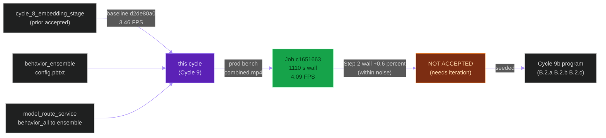
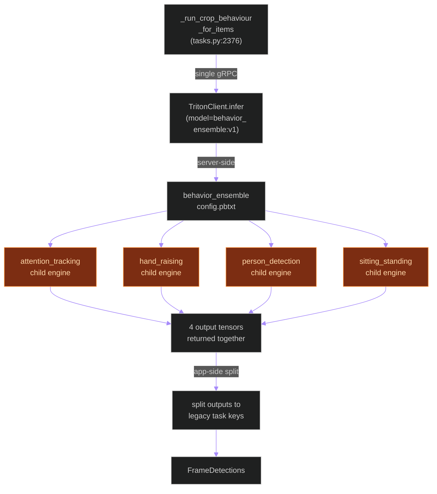
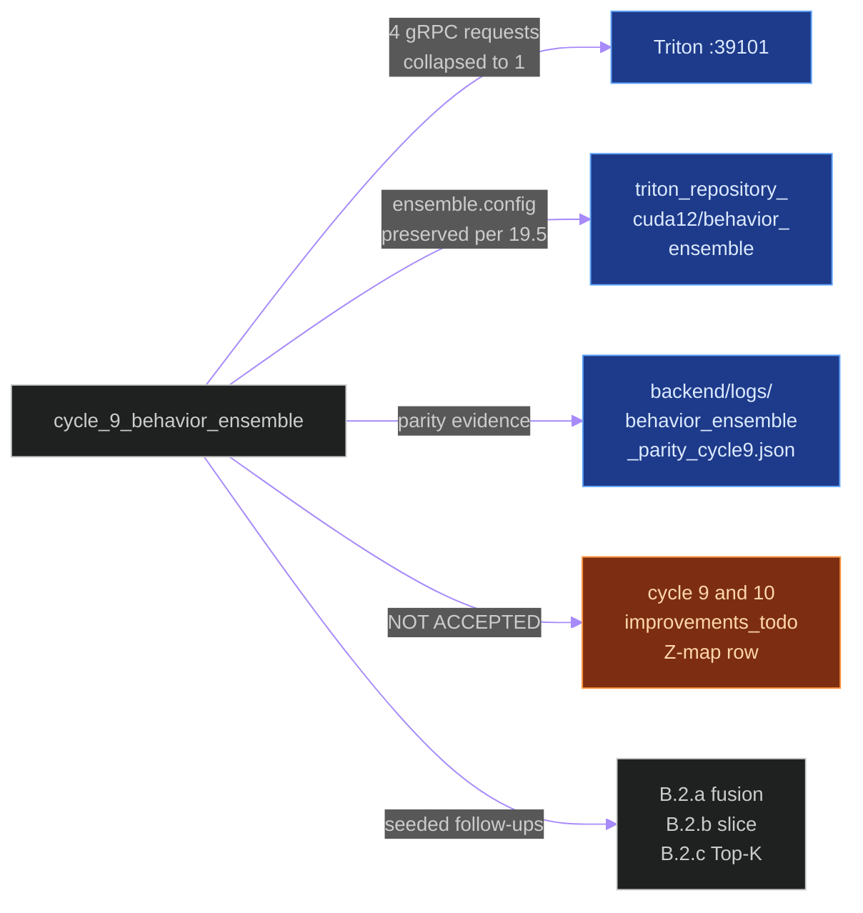
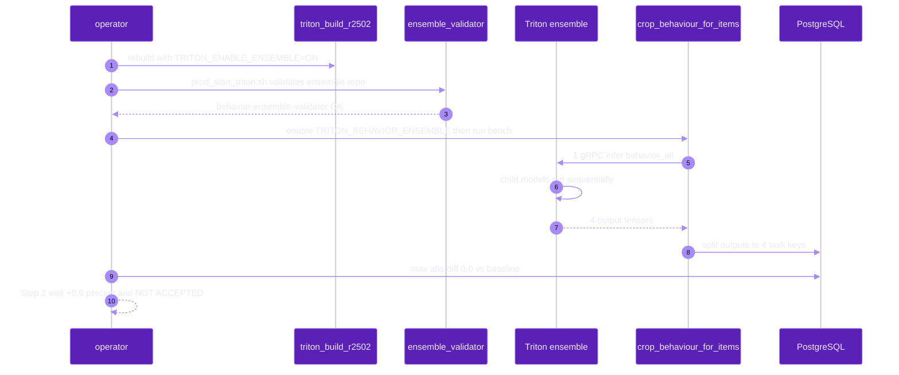
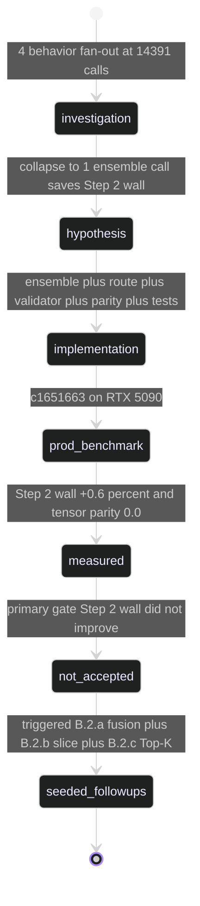

# `cycle_9_behavior_ensemble`

**Last updated:** 2026-06-03
**Entity kind:** `cycle`
**Status:** `not_accepted`

> First cycle in the program that did NOT clear the acceptance gate.
> Collapsed the four app-side behavior model calls
> (`attention_tracking`, `hand_raising`, `person_detection`,
> `sitting_standing`) into a single `behavior_ensemble` Triton
> ensemble model. Job `c1651663-e08a-4e29-9ee3-fd0f09884b98` proved
> the change was correctness-clean (tensor max-abs diff `0.0`, every
> counter exact parity) AND reduced DB-completed wall (1312 s →
> 1110 s, +18.1 % FPS), but the **Step 2 wall-time gate** (the
> primary acceptance criterion) moved +0.6 % — within noise. Decision:
> **NEEDS FURTHER ITERATION**. Seeded the Cycle 9b continuation
> program (B.2.a fusion / B.2.b slice / B.2.c Top-K).

## Source-of-truth references

| Kind | Reference |
|---|---|
| Doc | `docs/crop_frame_optimization_execution.md` § Cycle 9 (lines 431-463) |
| Doc | `docs/cycle_9_results.md` (full decision record) |
| Doc | `docs/cycle_9_investigation.md` |
| Doc | `docs/cycle_9_and_10_improvements_todo.md` § Z (Z-map status) |
| Doc | `docs/cycle_9b_batch_window_investigation.md` (immediate successor — first B.2 follow-up) |
| Job | `c1651663-e08a-4e29-9ee3-fd0f09884b98` (NOT-ACCEPTED production benchmark) |
| Job | `d2de80a0-31b7-4a47-b9f1-d2e2156ea3a8` (Cycle 8 reference baseline) |
| File | `backend/models/triton_repository_cuda12/behavior_ensemble/config.pbtxt` (the ensemble whose existence is the cycle artifact) |
| File | `backend/models/triton_repository_cuda12/behavior_ensemble/1/` (placeholder version dir) |
| File | `backend/apps/pipeline/services/triton_client.py` (line 43: `BEHAVIOR_ENSEMBLE_TASK_KEY = "behavior_all"`) |
| File | `backend/apps/pipeline/services/model_route_service.py` (lines 33, 42, 51: three profile blocks routing `behavior_all` → `behavior_ensemble:v1`) |
| File | `backend/apps/pipeline/services/ensemble_validator.py` (`validate_behavior_ensemble_repository`) |
| File | `backend/tests/unit/pipeline/test_behavior_ensemble_dispatch.py` |
| File | `backend/logs/parallel_flow_cycle9-behavior-ensemble-crop-frame-20260601T180847.log` |
| File | `backend/logs/bench_summary_20260601T180857.json` |
| File | `backend/logs/behavior_ensemble_parity_cycle9_20260601T180827.json` (tensor parity max-abs diff `0.0`) |
| Workflow | `.github/workflows/inference-parallelization.yml` |
| Commit | `b42f3f16` (DSP Cycle 4 prior entry — `cycle_8_embedding_stage`) |
| Replay key | `cycle9-behavior-ensemble-crop-frame-20260601T180847` |
| Candidate SHA | `0fa847af43186017316cc11a8c76645ff463e574` |
| Symbol | `apps.pipeline.services.triton_client.BEHAVIOR_ENSEMBLE_TASK_KEY` (triton_client.py:43) |
| Symbol | `apps.pipeline.services.ensemble_validator.validate_behavior_ensemble_repository` |

## 1. Purpose and scope

This cycle attacks the **four-behavior fan-out**: previously every
frame's behavior step issued four separate gRPC calls
(`attention_tracking`, `hand_raising`, `person_detection`,
`sitting_standing`). The hypothesis was that collapsing them into one
Triton ensemble model (`behavior_ensemble:v1`) would amortise the
per-call overhead (serialization, gRPC trip, output tensor copy) and
cut Step 2 wall.

What was built:

- `backend/models/triton_repository_cuda12/behavior_ensemble/config.pbtxt`
  declaring an ensemble that runs the four child TensorRT models and
  emits the four output tensors via one request.
- `TRITON_BEHAVIOR_ENSEMBLE` default-off app flag.
- `behavior_all` route added to three profile blocks of
  `model_route_service.py`.
- Triton-client IO routing updated to request the four ensemble
  outputs.
- Crop-frame behavior dispatch in `apps.video_analysis.tasks`
  rewritten to call `behavior_all` once and split outputs back to the
  legacy four task keys.
- Fallback to standalone behavior models when ensemble responses are
  invalid (so a stale ensemble doesn't kill prod).
- `ensemble_validator.validate_behavior_ensemble_repository` enforced
  at `prod_start_triton.sh` startup.
- Production tensor parity helper (the result: max abs diff `0.0`).
- Pinned Triton binary rebuilt with `TRITON_ENABLE_ENSEMBLE=ON`; the
  prior build (`tritonserver.pre_cycle9_no_ensemble_20260601T180729`)
  preserved as backup per constitution § 19.5.

What did NOT change: child TensorRT engines, behavior input size,
ensemble *server-side* execution graph (the four children still run
sequentially server-side). That's why the Step 2 wall barely moved.

## 2. Position in the system

## 3. Internal structure

| File | Role |
|---|---|
| `behavior_ensemble/config.pbtxt` | Ensemble definition — four child models, four outputs |
| `triton_client.py:43` | `BEHAVIOR_ENSEMBLE_TASK_KEY = "behavior_all"` |
| `model_route_service.py:33/42/51` | Three profile blocks: dev / offline / live each route `behavior_all` to `behavior_ensemble:v1` |
| `ensemble_validator.py` | `validate_behavior_ensemble_repository` runs at `prod_start_triton.sh` startup |
| `tasks.py` `_run_crop_behaviour_for_items` | Calls `behavior_all` once, splits outputs to four legacy task keys |
| `test_behavior_ensemble_dispatch.py` | Local validation harness |
| `behavior_ensemble_parity_cycle9_20260601T180827.json` | Production parity evidence (max abs diff `0.0`) |
| `tritonserver.pre_cycle9_no_ensemble_20260601T180729` | Backup binary preserved per § 19.5 |

## 4. Call graph (the ensemble request path)

## 5. External connections

## 6. API surface (env knobs)

| Variable | Pre-cycle | Cycle 9 candidate | Effect |
|---|---|---|---|
| `TRITON_BEHAVIOR_ENSEMBLE` | unset | `1` (default-off in code) | enables `behavior_all` dispatch path |
| Model route `behavior_all` | unmapped | `behavior_ensemble:v1` | adds the ensemble route in 3 profile blocks |
| `TRITON_ENABLE_ENSEMBLE` (Triton build flag) | OFF | **ON** (binary rebuilt) | required at server build time |

## 7. Dependencies

| Dependency | Role |
|---|---|
| Cycle 8 (embedding) | Baseline reference (job `d2de80a0`) |
| Triton inference plane | the ensemble lives in `behavior_ensemble/config.pbtxt`; the server must be built with `TRITON_ENABLE_ENSEMBLE=ON` |
| `apps.pipeline.services.ensemble_validator` | startup gate enforced by `prod_start_triton.sh` |
| `apps.video_analysis.tasks._run_crop_behaviour_for_items` | call site that issues the ensemble request |
| Four behavior child engines | still execute server-side sequentially — this is the lesson Cycle 9 paid for |

## 8. Environment variables read

`TRITON_BEHAVIOR_ENSEMBLE` (default off; set to `1` during the
Cycle 9 candidate run). Plus the standard
`TRITON_REQUIRED_OFFLINE`, `INFERENCE_STRATEGY` enforced by
`runtime_policy.evaluate_runtime_policy`.

## 9. Sequence diagram (the candidate bench)

## 10. State machine (the NOT-ACCEPTED outcome)

## 11. Failure modes (lessons paid for)

| Lesson | Why it matters |
|---|---|
| App-side fan-out cost ≠ server-side critical path | Collapsing four gRPC requests to one ensemble request reduces app RTT but does NOT reduce the time the server spends running four TensorRT child models sequentially |
| Dense YOLO output tensors are the real movement cost | The ensemble returns the same 4 output tensors; the wire is still moving the same number of bytes |
| Acceptance gate must name the lever | Cycle 9's hypothesis named "app-side request fragmentation"; the bench proved that lever moved only 18 % FPS while Step 2 wall (the constitution § 12 primary acceptance metric) stayed flat |
| Backup binary preservation is operational | `tritonserver.pre_cycle9_no_ensemble_20260601T180729` lets us roll back the build flip in seconds; constitution § 19.5 |

## 12. Performance characteristics (the bench)

| Metric | Cycle 8 `d2de80a0` | Cycle 9 `c1651663` | Δ vs Cycle 8 |
|---|---:|---:|---:|
| Step 2 wall (primary gate) | 852.8 s | 858.1 s | **+0.6 % (NOT ACCEPTED)** |
| Step 2 FPS | 5.33 | 5.29 | −0.8 % |
| Telemetry session wall | 1 138.8 s | 923.1 s | −18.9 % |
| DB-completed elapsed | 1 312.3 s | 1 110.7 s | −15.4 % |
| DB-completed FPS | 3.46 | 4.09 | +18.1 % |
| App-level model calls | 20 348 | 9 557 | −53.0 % |
| Behavior crop app calls | 14 391 | 3 597 | −75.0 % |
| Behavior mean RTT | 143-168 ms/model | 107.9 ms (ensemble) | improved |
| Behavior p95 RTT | 248-277 ms/model | 173.9 ms (ensemble) | improved |
| Avg GPU util | 9.65 % | 9.36 % | −0.29 pp |
| Peak GPU util | 36 % | 43 % | +7 pp |
| Avg VRAM | 15 663 MiB | 15 663 MiB | unchanged |
| Frames | 4 541 | 4 541 | exact parity |
| All 4 behavior-bbox counters | identical | identical | exact parity |
| Tensor max-abs diff | (baseline) | **0.0** | exact parity |

Source: `docs/cycle_9_results.md` § Metrics, § Correctness.

## 13. Operational notes

- The ensemble is **left enabled** in `model_route_service.py` —
  the cycle wasn't reverted because it remained a correctness-neutral
  prerequisite for the Cycle 9b follow-ups (B.2.b slice, B.2.c
  Top-K), which built on top of `behavior_ensemble:v1`.
- Cycle 9b B.2.c (Top-K) eventually became the ACCEPTED production
  baseline — so this cycle is part of the dependency chain leading
  to the current accepted state, even though Cycle 9 itself was
  NOT-ACCEPTED.
- The `validate_behavior_ensemble_repository` gate runs at every
  `prod_start_triton.sh`; if the ensemble repo is malformed Triton
  will not start.

## 14. Historical diagrams

> Not applicable: no diagrams in this cycle doc have been
> superseded yet.

## 15. Related entities

| Entity | Path | Relationship |
|---|---|---|
| Cycle 8 (embedding stage) | `docs/entity/cycles/cycle_8_embedding_stage.md` | predecessor baseline (job `d2de80a0`) |
| Cycle 9b Top-K (currently accepted) | `docs/entity/cycles/cycle_9b_topk.md` (planned future DSP commit) | successor that built ON TOP of Cycle 9's ensemble |
| Triton inference plane | `docs/entity/systems/triton_inference_plane.md` | the system that hosts the ensemble |
| `apps.pipeline` | `docs/entity/modules/apps.pipeline.md` | owns `model_route_service.py`, `ensemble_validator.py`, `triton_client.py` |
| Offline inference pipeline | `docs/entity/systems/offline_inference_pipeline.md` | the pipeline the ensemble lives inside |
| `docs/cycle_9_and_10_improvements_todo.md` § Z | (source-of-truth) | the Z-map status row that records this cycle's NOT-ACCEPTED outcome |

## 16. Open questions

> Resolved by the Cycle 9b program: B.2.a output fusion (NOT
> ACCEPTED), B.2.b server-side slice (ACCEPTED), B.2.c Top-K
> (ACCEPTED with caveat — the current production baseline). The
> Cycle 9 ensemble itself remains the substrate.

## 17. Change log

| Date | What changed | Commit |
|---|---|---|
| 2026-06-01 | Cycle 9 candidate benchmarked as NOT ACCEPTED | candidate SHA `0fa847af43186017316cc11a8c76645ff463e574` |
| 2026-06-02 | Cycle 9b continuation plan finalised (B.2.a / B.2.b / B.2.c) | see `docs/cycle_9_results.md` § Cycle 9b |
| 2026-06-03 | DSP Cycle 4 entry 5/N — entity doc consolidating Cycle 9's NOT-ACCEPTED outcome. All 5 diagrams verified locally with `mmdc` per constitution § 19.3.1 before push. | (this commit) |
