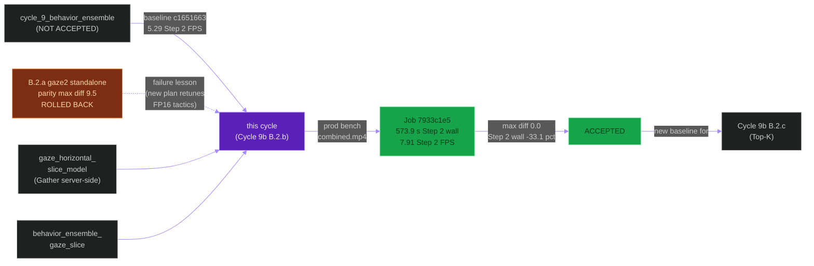
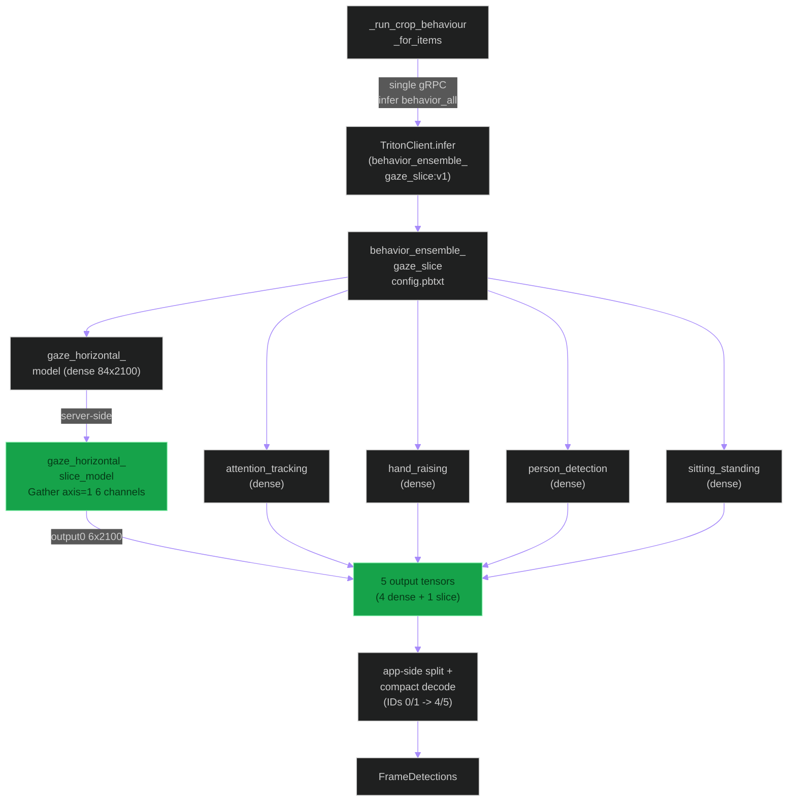
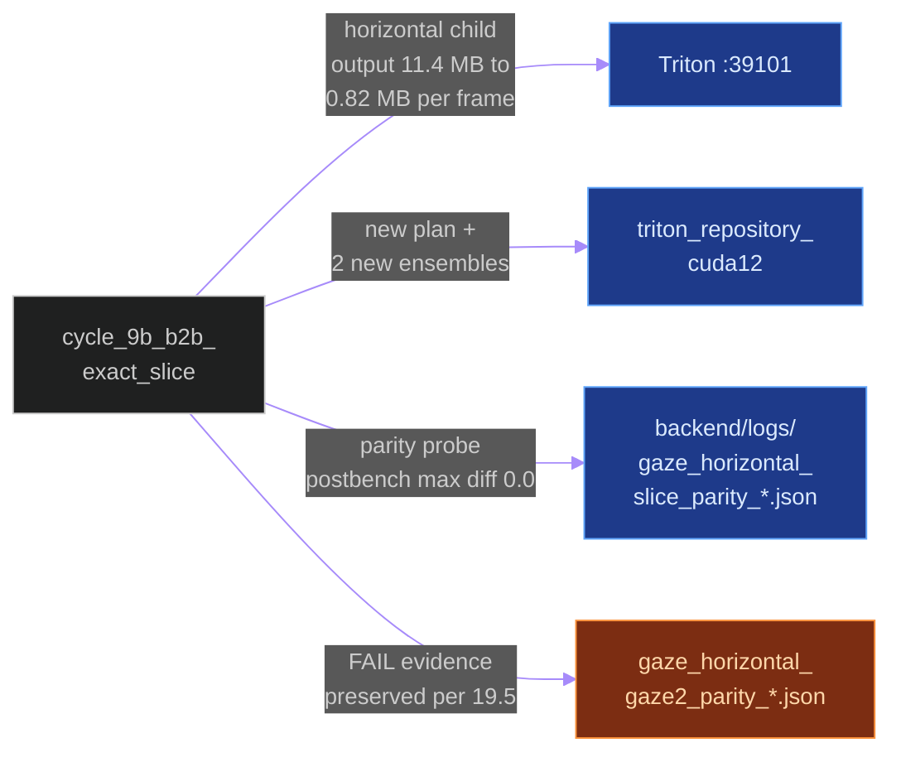
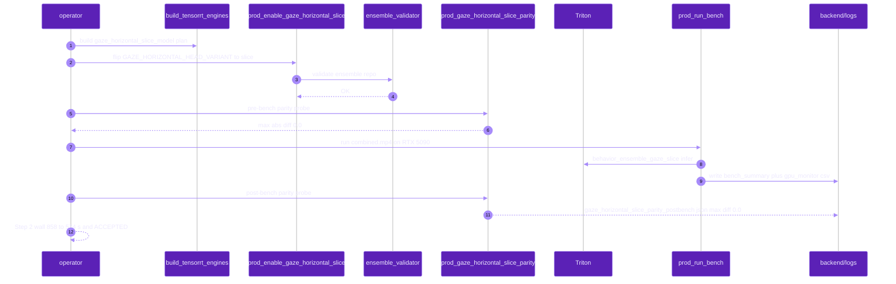
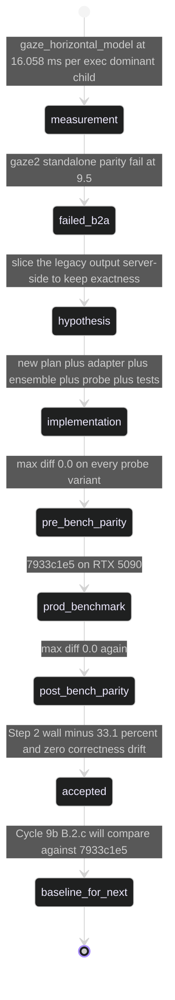

# `cycle_9b_b2b_exact_slice`

**Last updated:** 2026-06-03
**Entity kind:** `cycle`
**Status:** `accepted`

> First ACCEPTED cycle in the Cycle 9b continuation program. Adds a
> tiny TensorRT Gather model after `gaze_horizontal_model` that
> slices the dense `[N,84,2100]` output down to `[N,6,2100]`
> (`xywh` + class channels 4/5 only). Routed via
> `behavior_ensemble_gaze_slice:v1` when
> `GAZE_HORIZONTAL_HEAD_VARIANT=slice`. Accepted by production job
> `7933c1e5-a970-47a3-81c5-0c9bd01bd332`: Step 2 wall 858.1 s →
> 573.9 s (−33.1 %), Step 2 FPS 5.29 → 7.91 (+49.6 %), with
> raw-tensor parity `max_abs_diff=0.0` post-bench. This is the first
> follow-up that recovered after the B.2.a (`gaze2` standalone)
> parity-failure rollback.

## Source-of-truth references

| Kind | Reference |
|---|---|
| Doc | `docs/crop_frame_optimization_execution.md` § "Cycle 9b B.2.b — Exact Server-Side Horizontal Slice (ACCEPTED)" (lines 718-834) |
| Doc | `docs/crop_frame_optimization_execution.md` § "Cycle 9b B.2.b — Gaze-Horizontal Output Fusion (NOT ACCEPTED)" (lines 632-715) — the failed B.2.a-style standalone attempt this cycle superseded |
| Doc | `docs/cycle_9b_exact_slice_investigation.md` |
| Doc | `docs/cycle_9b_output_fusion_investigation.md` (the failed precursor) |
| Doc | `docs/cycle_9_and_10_improvements_todo.md` § Z |
| Job | `7933c1e5-a970-47a3-81c5-0c9bd01bd332` (ACCEPTED production benchmark) |
| Job | `c1651663-e08a-4e29-9ee3-fd0f09884b98` (Cycle 9 reference baseline) |
| File | `backend/models/triton_repository_cuda12/gaze_horizontal_slice_model/config.pbtxt` (TensorRT Gather plan; input `dense_input [84,2100]`, output `output0 [6,2100]`) |
| File | `backend/models/triton_repository_cuda12/gaze_horizontal_slice_adapter/config.pbtxt` (standalone ensemble fallback) |
| File | `backend/models/triton_repository_cuda12/behavior_ensemble_gaze_slice/config.pbtxt` (the cycle's primary new ensemble; routes only horizontal-gaze through the slice) |
| File | `backend/scripts/build_tensorrt_engines.py` (can build the slice plan from a generated ONNX gather graph) |
| File | `tools/prod/prod_enable_gaze_horizontal_slice.sh` (builds + enables the route; sets `GAZE_HORIZONTAL_HEAD_VARIANT=slice`) |
| File | `tools/prod/prod_gaze_horizontal_slice_parity.py` (production parity probe for direct slice + adapter + full ensemble) |
| File | `backend/tests/unit/pipeline/test_behavior_ensemble_dispatch.py` (route + compact decode/remap + repository validator coverage) |
| File | `backend/logs/bench_summary_20260602T023450.json` |
| File | `backend/logs/gpu_monitor_bench_20260602T023450.csv` |
| File | `backend/data/videos/7933c1e5-a970-47a3-81c5-0c9bd01bd332/inference_audit.json` |
| File | `backend/logs/gaze_horizontal_slice_parity_20260601T235623_postbench.json` (max_abs_diff=0.0 post-bench) |
| File | `backend/logs/gaze_horizontal_gaze2_parity_20260601T230548.json` (the FAIL evidence of the rolled-back B.2.a attempt; preserved per § 19.5) |
| File | `backend/logs/gaze_horizontal_gaze2_parity_20260601T231503_postrebuild.json` (FAIL #2 post-engine-rebuild) |
| Workflow | `.github/workflows/inference-parallelization.yml` |
| Commit | `cb41ad23` (DSP Cycle 4 prior entry — `cycle_9_behavior_ensemble`) |
| Replay key | `cycle9b-exactslice-crop-frame-20260601T233211` |
| Candidate SHA | `ca69f02a8ceb214d7ef55cd2ae4b7ec75549c257` |
| Rolled-back precursor SHA | `49932a22bfb429a74075e6952788af63eb007810` (B.2.a `gaze2` standalone — parity failed) |

## 1. Purpose and scope

This cycle's **named lever is dense output bytes** (constitution § 12
"name the lever before benching" rule). It attacks the dominant
behavior child measured in Cycle 9b Step 1: `gaze_horizontal_model`
at 16.058 ms/exec, producing `[84,2100]` ≈ 689 KB / crop, of which
the runtime keeps only the `right_left` class filter `(4,5)`.

What the cycle ships:

- **`gaze_horizontal_slice_model`** — TensorRT plan with input
  `dense_input [84,2100]` and output `output0 [6,2100]` (Gather on
  axis=1 picking indices `[0,1,2,3,8,9]` — xywh + class channels 4/5).
- **`gaze_horizontal_slice_adapter`** — standalone ensemble fallback
  for direct debugging (image → legacy horizontal → slice).
- **`behavior_ensemble_gaze_slice`** — the main behavior ensemble
  that routes ONLY horizontal gaze through the slice; other children
  remain dense.
- **`prod_enable_gaze_horizontal_slice.sh`** — flips
  `GAZE_HORIZONTAL_HEAD_VARIANT=slice` + builds the plan +
  validates the ensemble repo + restarts Triton.
- **`prod_gaze_horizontal_slice_parity.py`** — pre/post-benchmark
  parity probe; the post-bench JSON reports `max_abs_diff=0.0`.

What this cycle did NOT do: it did not change `gaze_horizontal_model`
itself (which is the failure mode of the rolled-back B.2.a `gaze2`
standalone variant — TensorRT picked different FP16 tactics when
the graph output channels changed). The slice operates server-side
on the *already-computed* legacy output, so exactness is
mathematically preserved.

## 2. Position in the system

## 3. Internal structure

| File | Role |
|---|---|
| `gaze_horizontal_slice_model/config.pbtxt` | TensorRT Gather plan, dense_input `[84,2100]` → output0 `[6,2100]` |
| `gaze_horizontal_slice_adapter/config.pbtxt` | Standalone fallback ensemble (image → legacy horizontal → slice) for parity probes |
| `behavior_ensemble_gaze_slice/config.pbtxt` | Main behavior ensemble for `slice` variant; horizontal child only is sliced |
| `build_tensorrt_engines.py` | Knows how to build the slice plan from a generated ONNX gather graph |
| `prod_enable_gaze_horizontal_slice.sh` | Flips env + builds + validates + restarts |
| `prod_gaze_horizontal_slice_parity.py` | Parity probe for direct slice + adapter + ensemble |
| `test_behavior_ensemble_dispatch.py` | Route, compact decode/remap (`gaze2` IDs 0/1 → legacy 4/5), validator coverage |

## 4. Call graph (the exact-slice dispatch path)

## 5. External connections

## 6. API surface (env knobs)

| Variable | Pre-cycle | Post-cycle (ACCEPTED) | Effect |
|---|---|---|---|
| `GAZE_HORIZONTAL_HEAD_VARIANT` | `coco80` | **`slice`** | Routes horizontal gaze through the slice plan |
| `MODEL_ROUTE_BEHAVIOR_ALL_MODEL_NAME` | `behavior_ensemble` | **`behavior_ensemble_gaze_slice`** | Switches behavior ensemble at runtime |
| `LPM_ENABLED` | (any) | **`0`** | LPM stays off; this cycle does not interact with the logical-path matrix |

Rollback: `bash tools/prod/prod_enable_parallel_flow.sh --profile per-frame-signals` flips both back.

## 7. Dependencies

| Dependency | Role |
|---|---|
| Cycle 9 (`behavior_ensemble`) | substrate the slice ensemble extends |
| Triton inference plane | hosts the slice plan + the new ensembles |
| `apps.pipeline.services.ensemble_validator` | startup gate validates new ensemble repos |
| `apps.pipeline.services.triton_ensemble_input_size` | unaffected (input shape unchanged) |
| `backend/scripts/build_tensorrt_engines.py` | builds the slice plan from a generated ONNX gather graph |
| `tools/prod/prod_enable_gaze_horizontal_slice.sh` | switchboard |
| `tools/prod/prod_gaze_horizontal_slice_parity.py` | parity probe; gate before AND after the benchmark |

## 8. Environment variables read

`GAZE_HORIZONTAL_HEAD_VARIANT`,
`MODEL_ROUTE_BEHAVIOR_ALL_MODEL_NAME`, `LPM_ENABLED`,
plus the standard Triton-required-set
(`TRITON_REQUIRED_OFFLINE`, `INFERENCE_STRATEGY`).

## 9. Sequence diagram (the parity-gated bench)

## 10. State machine

## 11. Failure modes (the lessons that shaped the cycle)

| Lesson | Source |
|---|---|
| New TensorRT plans retune FP16 tactics | B.2.a standalone `gaze2` model showed max-abs diff 9.5 → 7.125 across two plan rebuilds; the *graph* changed → TensorRT picked different kernels → bit-level drift |
| Server-side slice preserves exactness | This cycle's slice runs Gather on the *already-computed* dense output; no new TensorRT tactic involved → max abs diff 0.0 reproducibly |
| Parity must gate BOTH pre- and post-benchmark | Cycle 9b B.2.a was caught pre-bench; Cycle 9b B.2.b proved both gates pass — that's the contract |
| `LPM_ENABLED` is orthogonal | Kept off during the bench so the lever attribution is unambiguous |

## 12. Performance characteristics (the bench)

| Metric | Cycle 9 `c1651663` | Cycle 9b B.2.b `7933c1e5` | Δ vs Cycle 9 |
|---|---:|---:|---:|
| **Step 2 wall (primary gate)** | 858.1 s | **573.927 s** | **−33.1 %** |
| **Step 2 FPS** | 5.29 | **7.912** | **+49.6 %** |
| DB-completed elapsed | 1 110.7 s | ~1 054 s | −5.1 % |
| DB-completed FPS | 4.09 | 4.307 | +5.3 % |
| Behavior RTT mean | 107.9 ms | 91.470 ms | −15.2 % |
| Behavior RTT p95 | 173.9 ms | 146.015 ms | −16.0 % |
| Avg GPU util | 9.36 % | 9.595 % | +0.235 pp |
| Peak GPU util | 43 % | 45 % | +2 pp |
| Frames | 4 541 | 4 541 | parity |
| Detections | 72 749 | 72 747 | −2 (0.003 %) |
| `hand_raising` boxes | 8 800 | 8 801 | +1 |
| `sitting_standing` boxes | 33 011 | 33 008 | −3 |
| Other behavior-bbox counters | parity | parity | parity |
| **Raw tensor parity max abs diff** | (baseline) | **0.0** | exact |

Source: `docs/crop_frame_optimization_execution.md` § Cycle 9b B.2.b
Phase 4 (lines 782-821).

## 13. Operational notes

- This baseline runs with `LPM_ENABLED=0` deliberately — the
  acceptance lever is "dense output bytes", not LPM math. Cycle 10
  staged LPM math separately.
- The `gaze_horizontal_slice_adapter` is the recommended debug
  surface for slice-output regressions (`prod_gaze_horizontal
  _slice_parity.py` exercises it directly).
- All three new repo dirs
  (`gaze_horizontal_slice_model/`,
  `gaze_horizontal_slice_adapter/`,
  `behavior_ensemble_gaze_slice/`) are tracked in git per the
  `.gitignore` allowlist; the underlying `.plan` engine inside
  `gaze_horizontal_slice_model/1/` is built per host by
  `build_tensorrt_engines.py`.
- Rollback is one shell command; the rolled-back precursor parity
  JSONs (`gaze_horizontal_gaze2_parity_*.json`) are preserved as
  evidence per constitution § 19.5.

## 14. Historical diagrams

> The "failed precursor" (B.2.a `gaze2` standalone) was preserved
> in the source-of-truth doc `crop_frame_optimization_execution.md`
> lines 632-715. This DSP entity doc references that section as
> the history, per § 19.5 ("do not delete diagrams or evidence —
> reference and supersede them").

## 15. Related entities

| Entity | Path | Relationship |
|---|---|---|
| Cycle 9 (NOT ACCEPTED ensemble) | `docs/entity/cycles/cycle_9_behavior_ensemble.md` | substrate this cycle extends |
| Cycle 9b B.2.c Top-K (current accepted) | `docs/entity/cycles/cycle_9b_b2c_topk.md` (planned next DSP commit) | successor; built on top of B.2.b |
| Triton inference plane | `docs/entity/systems/triton_inference_plane.md` | hosts the slice plan + the two new ensembles |
| `apps.pipeline` | `docs/entity/modules/apps.pipeline.md` | owns `ensemble_validator`, `model_route_service`, `triton_client` |
| `tools/prod/prod_enable_gaze_horizontal_slice.sh` | (planned DSP Cycle 5) | the switchboard script |
| `tools/prod/prod_gaze_horizontal_slice_parity.py` | (planned DSP Cycle 5) | the parity probe |
| `backend/scripts/build_tensorrt_engines.py` | (planned DSP Cycle 5) | the per-host engine builder |

## 16. Open questions

> All closed by the bench-time + post-bench `max_abs_diff=0.0`
> evidence. Subsequent work (Top-K, input-size investigations)
> belongs to Cycles 9b B.2.c and 11 respectively.

## 17. Change log

| Date | What changed | Commit |
|---|---|---|
| 2026-06-01 | Cycle 9b B.2.b ACCEPTED by production benchmark `7933c1e5` | candidate SHA `ca69f02a8ceb214d7ef55cd2ae4b7ec75549c257` |
| 2026-06-01 | B.2.a precursor (gaze2 standalone) rolled back; parity JSONs preserved | precursor SHA `49932a22bfb429a74075e6952788af63eb007810` |
| 2026-06-03 | DSP Cycle 4 entry 6/N — entity doc consolidating the cycle + its rolled-back precursor. All 5 diagrams verified locally with `mmdc` per constitution § 19.3.1 before push. | (this commit) |
