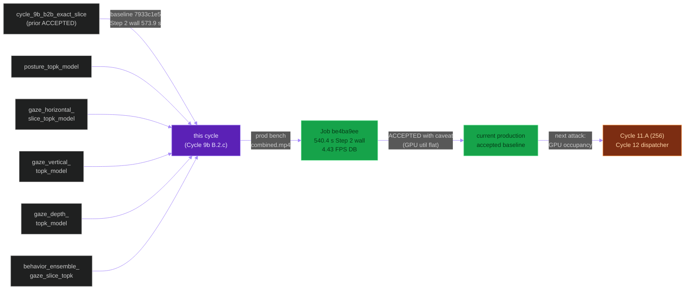
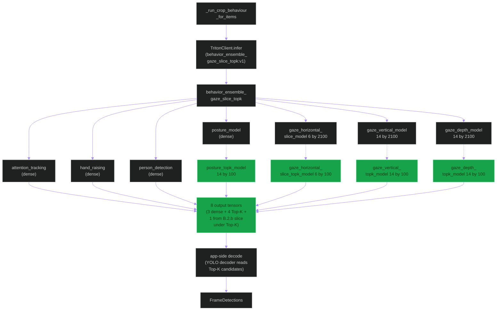
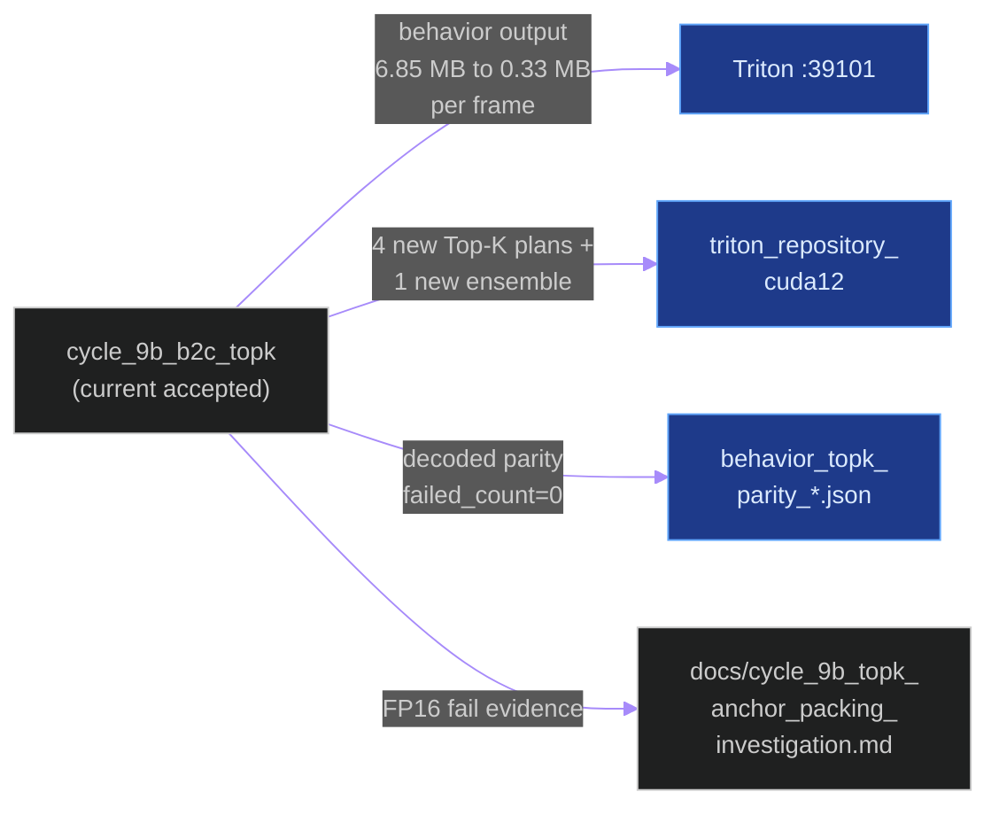
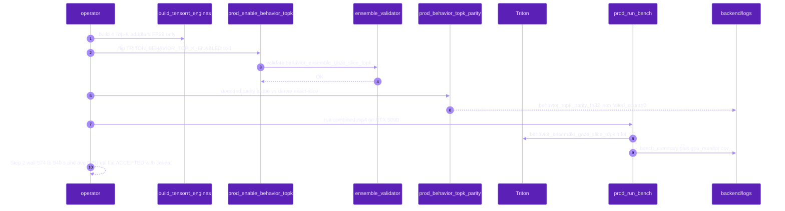
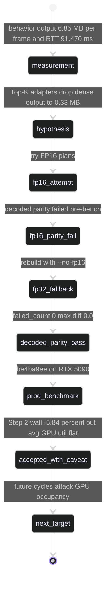

# `cycle_9b_b2c_topk`

**Last updated:** 2026-06-03
**Entity kind:** `cycle`
**Status:** `accepted_with_caveat`

> **The currently-active production accepted baseline.** Adds
> TensorRT Top-K adapters after all four remaining dense behavior
> children (posture, gaze-horizontal-slice, gaze-vertical,
> gaze-depth). Each adapter folds the dense `[N,C,2100]` grid down
> to `[N,C,100]` candidates while preserving the Python decoder's
> top-candidate semantics
> (`TRITON_BEHAVIOR_TOP_K_VALUE=100` matches
> `TRITON_YOLO_MAX_DECODE_CANDIDATES`). Routed via
> `behavior_ensemble_gaze_slice_topk:v1`. Accepted (with caveat) by
> production job `be4ba9ee-4786-48e9-8334-28feb237a1fb`: Step 2
> wall 573.9 s → 540.4 s (−5.84 %), DB-completed FPS 4.307 → 4.429
> (+2.8 %), behavior output traffic 6.85 MB/frame → 0.33 MB/frame
> (~95 % less). Caveat: avg GPU util did NOT improve — next
> optimizations must target GPU occupancy, not response bytes.

## Source-of-truth references

| Kind | Reference |
|---|---|
| Doc | `docs/crop_frame_optimization_execution.md` § "Cycle 9b B.2.c — Exact Slice + Top-K Anchor Packing (ACCEPTED WITH CAVEAT)" (lines 838-947) |
| Doc | `docs/cycle_9b_topk_anchor_packing_investigation.md` |
| Doc | `docs/cycle_9b_topk_anchor_packing_results.md` |
| Doc | `docs/cycle_9b_child_critical_path_remeasure_topk_results.md` (Cycle 9b B.3 Step 1 remeasure built on this baseline) |
| Doc | `docs/cycle_9_and_10_improvements_todo.md` § Z |
| Job | `be4ba9ee-4786-48e9-8334-28feb237a1fb` (ACCEPTED production benchmark — current prod baseline) |
| Job | `7933c1e5-a970-47a3-81c5-0c9bd01bd332` (Cycle 9b B.2.b reference baseline) |
| Telemetry session | `c4710435-4ec0-49e1-8ffb-60012fa878c9` |
| File | `backend/models/triton_repository_cuda12/behavior_ensemble_gaze_slice_topk/config.pbtxt` (current accepted route) |
| File | `backend/models/triton_repository_cuda12/posture_topk_model/config.pbtxt` |
| File | `backend/models/triton_repository_cuda12/gaze_horizontal_slice_topk_model/config.pbtxt` |
| File | `backend/models/triton_repository_cuda12/gaze_vertical_topk_model/config.pbtxt` |
| File | `backend/models/triton_repository_cuda12/gaze_depth_topk_model/config.pbtxt` |
| File | `backend/scripts/build_tensorrt_engines.py` (Top-K ONNX export + FP32 plan build; FP16 failed decoded parity so the helper uses `--no-fp16`) |
| File | `tools/prod/prod_enable_behavior_topk.sh` (builds/enables the route; sets `TRITON_BEHAVIOR_TOP_K_ENABLED=1`) |
| File | `tools/prod/prod_behavior_topk_parity.py` (decoded parity probe — dense exact-slice vs Top-K outputs) |
| File | `backend/tests/unit/pipeline/test_behavior_ensemble_dispatch.py` |
| File | `backend/tests/unit/pipeline/test_yolo_decode_dynamic_shapes.py` |
| File | `backend/tests/unit/docs/test_triton_phase_knob_docs_consistency.py` |
| File | `backend/logs/bench_summary_20260602T042139.json` |
| File | `backend/logs/gpu_monitor_bench_20260602T042139.csv` |
| File | `backend/logs/behavior_topk_parity_20260602T011830Z_fp32.json` (decoded parity: `failed_count=0`, `max_score_diff=0.0`, `max_box_diff=0.0`) |
| File | `backend/data/videos/be4ba9ee-4786-48e9-8334-28feb237a1fb/inference_audit.json` |
| Workflow | `.github/workflows/inference-parallelization.yml` |
| Commit | `333285cc` (DSP Cycle 4 prior entry — `cycle_9b_b2b_exact_slice`) |
| Commit | `9bc53d86` (per `docs/entity/systems/triton_inference_plane.md`: "Cycle 9b Top-K accepted — current default ensemble route") |
| Replay key | `cycle9b-topk-crop-frame-20260602T041900` |
| Candidate SHA | `9f879affeb4478e63a09276b10a2d64844bcbc44` |

## 1. Purpose and scope

This cycle's **named lever is dense output bytes** (continuation of
B.2.b's lever). It attacks the four remaining dense behavior child
outputs that B.2.b did NOT touch (B.2.b only sliced
gaze-horizontal):

| Behavior child | Dense (B.2.b) | Top-K (B.2.c) |
|---|---|---|
| `posture_model` | `[N,14,2100]` | `posture_topk_model [N,14,100]` |
| `gaze_horizontal_slice_model` | `[N,6,2100]` | `gaze_horizontal_slice_topk_model [N,6,100]` |
| `gaze_vertical_model` | `[N,14,2100]` | `gaze_vertical_topk_model [N,14,100]` |
| `gaze_depth_model` | `[N,14,2100]` | `gaze_depth_topk_model [N,14,100]` |

The Top-K value `100` matches `TRITON_YOLO_MAX_DECODE_CANDIDATES`,
so the Python decoder receives exactly the candidates it would have
kept anyway — no semantic change. Total behavior output traffic
drops from ~6.85 MB/frame to ~0.33 MB/frame (~95 % reduction).

Implementation lesson preserved: **FP16 adapters failed decoded
parity** pre-benchmark, so the production helper builds Top-K
adapters with `--no-fp16` (FP32). The cycle accepts the modest
plan-size and per-step cost increase that FP32 brings, to keep the
acceptance bench reproducible.

It does NOT touch `LPM_ENABLED` (stays `0`), embedding stage,
pose-runtime chunking, or any non-behavior path. Subsequent cycles
(B.3 remeasure, Cycle 11.A 256-input) build on this baseline.

## 2. Position in the system



## 3. Internal structure

| File | Role |
|---|---|
| `behavior_ensemble_gaze_slice_topk/config.pbtxt` | Main behavior ensemble; routes posture + 3 gaze children through Top-K adapters |
| `posture_topk_model/config.pbtxt` | `[N,14,2100]` → `[N,14,100]` adapter |
| `gaze_horizontal_slice_topk_model/config.pbtxt` | `[N,6,2100]` → `[N,6,100]` adapter (chained after B.2.b slice) |
| `gaze_vertical_topk_model/config.pbtxt` | `[N,14,2100]` → `[N,14,100]` adapter |
| `gaze_depth_topk_model/config.pbtxt` | `[N,14,2100]` → `[N,14,100]` adapter |
| `build_tensorrt_engines.py` | Top-K ONNX export + FP32 TensorRT plan build (FP16 disabled via `--no-fp16`) |
| `prod_enable_behavior_topk.sh` | Builds + enables the route; sets `TRITON_BEHAVIOR_TOP_K_ENABLED=1` |
| `prod_behavior_topk_parity.py` | Decoded-parity probe vs dense exact-slice |
| `test_behavior_ensemble_dispatch.py` | Route + dispatch coverage |
| `test_yolo_decode_dynamic_shapes.py` | Decoder shape coverage |
| `test_triton_phase_knob_docs_consistency.py` | Doc/knob consistency |

## 4. Call graph (the Top-K dispatch path)



## 5. External connections



## 6. API surface (env knobs)

| Variable | Pre-cycle | Post-cycle (ACCEPTED) | Effect |
|---|---|---|---|
| `GAZE_HORIZONTAL_HEAD_VARIANT` | `slice` | **`slice`** (unchanged from B.2.b) | Horizontal still routes through B.2.b slice |
| `TRITON_BEHAVIOR_TOP_K_ENABLED` | `0` | **`1`** | Enables Top-K dispatch path |
| `TRITON_BEHAVIOR_TOP_K_VALUE` | (unread) | **`100`** | Matches `TRITON_YOLO_MAX_DECODE_CANDIDATES` |
| `MODEL_ROUTE_BEHAVIOR_ALL_MODEL_NAME` | `behavior_ensemble_gaze_slice` | **`behavior_ensemble_gaze_slice_topk`** | Switches the ensemble route |
| `LPM_ENABLED` | `0` | `0` (unchanged) | LPM still off |

Rollback (to exact-slice without Top-K):
`bash tools/prod/prod_enable_gaze_horizontal_slice.sh --input-size 320 --skip-build` then restart Triton + Celery.

## 7. Dependencies

| Dependency | Role |
|---|---|
| Cycle 9b B.2.b (`behavior_ensemble_gaze_slice`) | substrate this cycle extends |
| Triton inference plane | hosts the 4 new Top-K plans + the chained ensemble |
| `apps.pipeline.services.ensemble_validator` | startup gate validates the Top-K ensemble |
| `apps.pipeline.services.triton_ensemble_input_size` | unaffected (input shape unchanged at 320) |
| `backend/scripts/build_tensorrt_engines.py` | builds Top-K plans (FP32 only — FP16 failed parity) |
| `tools/prod/prod_enable_behavior_topk.sh` | switchboard |
| `tools/prod/prod_behavior_topk_parity.py` | decoded parity probe |

## 8. Environment variables read

`GAZE_HORIZONTAL_HEAD_VARIANT` (from B.2.b),
`TRITON_BEHAVIOR_TOP_K_ENABLED`, `TRITON_BEHAVIOR_TOP_K_VALUE`,
`MODEL_ROUTE_BEHAVIOR_ALL_MODEL_NAME`, `LPM_ENABLED`,
plus the standard Triton-required-set.

## 9. Sequence diagram (the Top-K bench)



## 10. State machine



## 11. Failure modes (lessons)

| Lesson | Why it matters |
|---|---|
| FP16 Top-K plans failed decoded parity | TensorRT FP16 tactic choice changed score ordering; production helper now forces `--no-fp16` |
| Avg GPU util did NOT improve | Confirms that "dense output bytes" was a real lever but is now exhausted; next levers must target GPU occupancy / server execution graph / orchestration |
| Caveat acceptance is permitted by constitution § 12 | When a named lever moves and correctness is preserved, the cycle is ACCEPTED even if a secondary metric stays flat; the caveat is what defines the next cycle's scope |
| Decoded parity is the right gate | Raw-tensor parity is too strict for Top-K (the ordering of equi-score candidates can differ); decoded parity (score / box diff) is the meaningful contract |

## 12. Performance characteristics (the bench)

| Metric | B.2.b `7933c1e5` | B.2.c `be4ba9ee` | Δ vs B.2.b |
|---|---:|---:|---:|
| **Step 2 frame wall (primary gate)** | 573.927 s | **540.399 s** | **−5.84 %** |
| Step 2 through pose upload | 799.345 s | 767.589 s | −3.97 % |
| Audit `run.complete` wall | 865.419 s | 833.810 s | −3.65 % |
| **DB-completed elapsed** | 1 052.281 s | **1 022.952 s** | **−2.79 %** |
| **DB-completed FPS** | 4.307 | **4.429** | **+2.8 %** |
| **Behavior RTT mean** | 91.470 ms | **84.865 ms** | **−7.22 %** |
| **Behavior RTT p95** | 146.072 ms | **128.138 ms** | **−12.28 %** |
| **Behavior output / frame** | ~6.85 MB | **~0.33 MB** | **~95 % less** |
| Avg GPU util (the caveat) | 9.595 % | 9.3 % | **−0.295 pp** |
| Peak GPU util | 45 % | 53 % | +8 pp |
| Frames | 4 541 | 4 541 | parity |
| Detections | 72 747 | 72 762 | +0.0206 % |
| `attention_tracking` boxes | 11 776 | 11 781 | +0.0425 % |
| `person_detection` boxes | 19 162 | 19 162 | unchanged |
| StudentTracks | 53 | 53 | unchanged |
| **Decoded parity** (failed_count / max_score_diff / max_box_diff) | (baseline) | **0 / 0.0 / 0.0** | exact |

Source: `docs/crop_frame_optimization_execution.md` § Cycle 9b B.2.c Phase 4 (lines 886-918).

## 13. Operational notes

- This is the **currently-active production accepted baseline**.
  Every later cycle compares against this (`be4ba9ee` / replay
  `cycle9b-topk-crop-frame-20260602T041900`).
- Production environment block:
  ```
  GAZE_HORIZONTAL_HEAD_VARIANT=slice
  TRITON_BEHAVIOR_TOP_K_ENABLED=1
  TRITON_BEHAVIOR_TOP_K_VALUE=100
  MODEL_ROUTE_BEHAVIOR_ALL_MODEL_NAME=behavior_ensemble_gaze_slice_topk
  LPM_ENABLED=0
  ```
- The `--no-fp16` constraint applies ONLY to the Top-K adapters;
  the upstream behavior child engines remain FP16. The Top-K
  adapters are tiny (`[N,C,2100] → [N,C,100]` Gather/TopK kernels),
  so the FP32 cost is negligible (`Step 2 wall −5.84 %` already
  accounts for it).
- The caveat (avg GPU util flat) is what makes the Cycle 9b B.3
  remeasure + Cycle 12 (dispatcher variants) the logical next
  attacks. Cycle 11.A (256 input size) tried — and failed — to
  move GPU util via input reduction.

## 14. Historical diagrams

> Not applicable: no diagrams in this cycle doc have been
> superseded yet. The FP16 → FP32 lesson lives in
> `docs/cycle_9b_topk_anchor_packing_investigation.md` per § 19.5.

## 15. Related entities

| Entity | Path | Relationship |
|---|---|---|
| Cycle 9b B.2.b (slice) | `docs/entity/cycles/cycle_9b_b2b_exact_slice.md` | predecessor baseline (job `7933c1e5`); B.2.c chained Top-K after B.2.b's slice |
| Cycle 10 (LPM staged) | `docs/entity/cycles/cycle_10_lpm_phase1.md` (planned next DSP commit) | independent staged cycle on this baseline |
| Cycle 11.A (256 input — NOT ACCEPTED) | `docs/entity/cycles/cycle_11_input_size.md` (planned future DSP commit) | tried to attack the GPU-util caveat; rejected |
| Triton inference plane | `docs/entity/systems/triton_inference_plane.md` | hosts the 4 new Top-K plans + the chained ensemble (currently the prod default route) |
| `apps.pipeline` | `docs/entity/modules/apps.pipeline.md` | owns `ensemble_validator`, `model_route_service`, `triton_client`, decoder |
| `tools/prod/prod_enable_behavior_topk.sh` | (planned DSP Cycle 5) | the switchboard script |
| `tools/prod/prod_behavior_topk_parity.py` | (planned DSP Cycle 5) | the parity probe |

## 16. Open questions

- **Q1.** Can the Top-K adapters be safely re-attempted in FP16 once
  TensorRT 10.x lands an updated picker? *Owner:* prod inference
  maintainer. *Target close:* Cycle 11+ environment refresh.
- **Q2.** Is the +8 pp peak GPU util a leading indicator that the
  next bottleneck is server-side execution graph saturation
  (not response bytes)? *Owner:* prod inference maintainer.
  *Target close:* Cycle 12 dispatcher results.

## 17. Change log

| Date | What changed | Commit |
|---|---|---|
| 2026-06-02 | Cycle 9b B.2.c ACCEPTED with caveat by production benchmark `be4ba9ee` | candidate SHA `9f879affeb4478e63a09276b10a2d64844bcbc44`; sibling commit `9bc53d86` (cited by `triton_inference_plane.md`) |
| 2026-06-03 | DSP Cycle 4 entry 7/N — entity doc consolidating the current production accepted baseline. All 5 diagrams verified locally with `mmdc` per constitution § 19.3.1 before push. | (this commit) |
