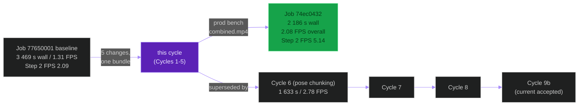
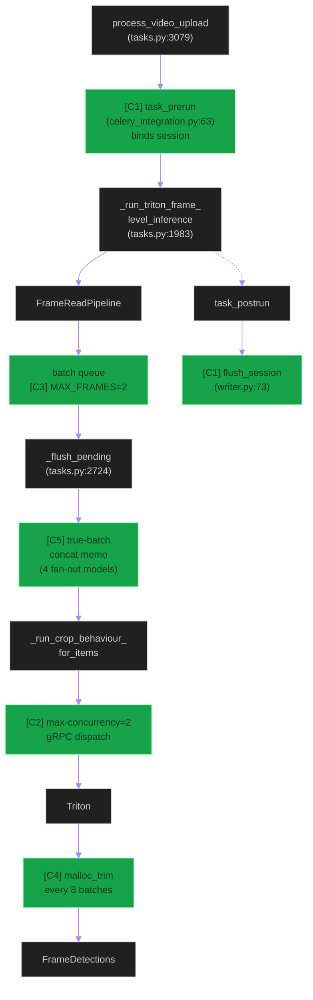
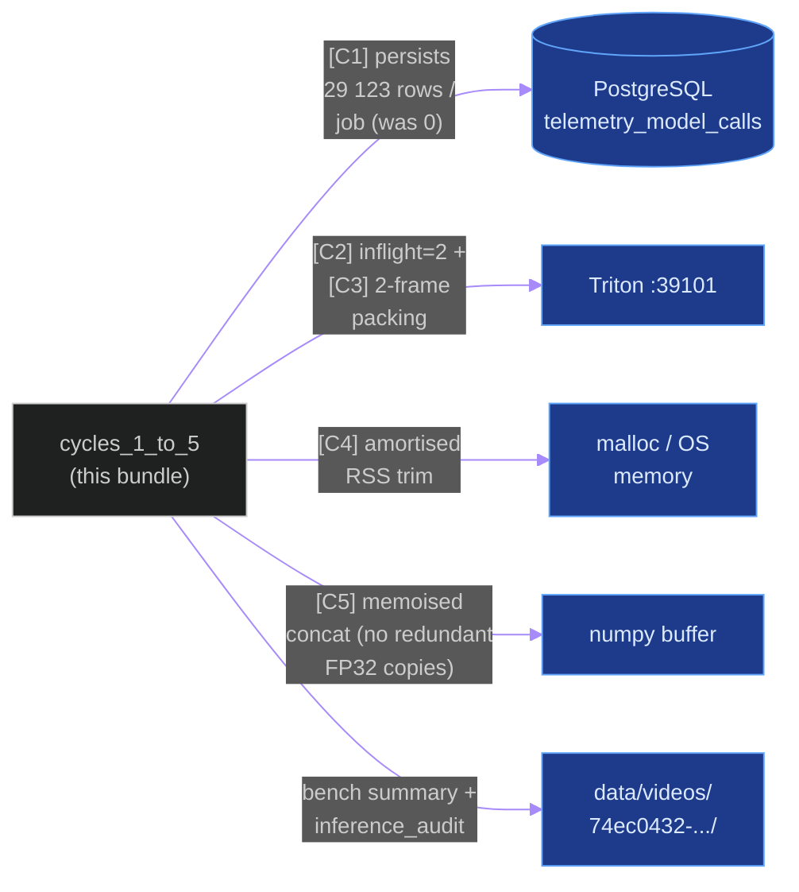
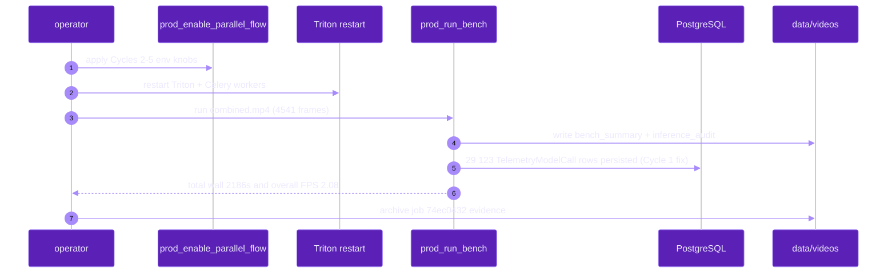
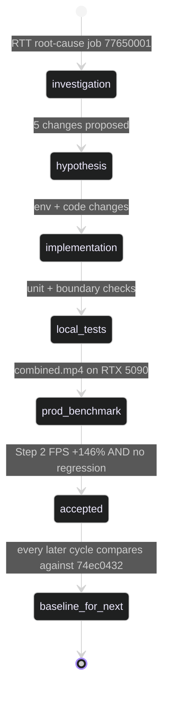

# `cycles_1_to_5_bundle`

**Last updated:** 2026-06-03
**Entity kind:** `cycle`
**Status:** `accepted`

> First accepted production optimization bundle. Five distinct
> changes (telemetry-writer fix, concurrency knob tune, batch-frames
> tune, malloc-trim amortisation, true-batch concat memoisation)
> shipped together and benchmarked as one. Production job
> `74ec0432-995c-487e-9d77-1048ec109fb1` proved Step 2 FPS jumped
> from 2.09 to 5.14 (+146 %) and overall FPS from 1.31 to 2.08
> (+58.7 %) on `combined.mp4` (4 541 frames). The first measurable
> escape from the 192-212 ms RTT bottleneck on job `77650001`.

## Source-of-truth references

| Kind | Reference |
|---|---|
| Doc | `docs/crop_frame_optimization_execution.md` § Cycle 1 (line 14), § Cycle 2 (31), § Cycle 3 (51), § Cycle 4 (76), § Cycle 5 (97), § "Bundled Result Across Cycles 1–5" (116) |
| Doc | `docs/production_inference_benchmark.md` § 11 (line 619 — "2026-06-01 Cycles 1-5 Production Benchmark") |
| Doc | `docs/rtt_root_cause_investigation_77650001.md` (initial RTT decomposition that justified the bundle) |
| Doc | `docs/inference_parallelization_plan.md` (parent plan) |
| Doc | `docs/cycle_9_and_10_improvements_todo.md` § Z.1 (first accepted row) |
| Doc | `docs/crop_frame_optimization_audit.md` (audit that kicked off the cycle series) |
| Job | `74ec0432-995c-487e-9d77-1048ec109fb1` (accepted production benchmark) |
| Job | `77650001` (the pre-Cycles-1-5 baseline; 192-212 ms RTT) |
| File | `backend/apps/telemetry/writer.py` (Cycle 1 — telemetry persistence fix) |
| File | `backend/apps/telemetry/celery_integration.py` (Cycle 1 — ContextVar propagation) |
| File | `tools/prod/prod_enable_parallel_flow.sh` (Cycles 2-5 env knobs registered here: `TRITON_OFFLINE_BATCH_QUEUE_MAX_CONCURRENCY=2`, `TRITON_OFFLINE_BATCH_QUEUE_MAX_FRAMES=2`, `OFFLINE_TRIM_EVERY_N_BATCHES=8`, `TRITON_TRUE_BATCH_REQUESTS=1`) |
| File | `backend/apps/video_analysis/tasks.py` (Cycle 5 — true-batch concat memoisation in `_flush_pending`) |
| File | `backend/data/videos/74ec0432-995c-487e-9d77-1048ec109fb1/inference_audit.json` (bench evidence) |
| Workflow | `.github/workflows/inference-parallelization.yml` |
| Commit | `e71f71d7` (DSP Cycle 3 closeout — repo state when this entity doc landed) |
| Symbol | `apps.telemetry.celery_integration.on_task_prerun` — Cycle 1 ContextVar binding |
| Symbol | `apps.telemetry.celery_integration.on_task_postrun` — Cycle 1 ContextVar unbind + flush |
| Symbol | `apps.video_analysis.tasks._flush_pending` (tasks.py:2724) — Cycle 5 concat memo |

## 1. Purpose and scope

This entity is the **bundled** record of the five distinct changes
that shipped together as the first accepted production optimization
on 2026-06-01:

| Sub-cycle | Change | File touched |
|---|---|---|
| Cycle 1 | Telemetry-writer ContextVar propagation in async loop | `apps.telemetry.celery_integration` + `apps.telemetry.writer` |
| Cycle 2 | `TRITON_OFFLINE_BATCH_QUEUE_MAX_CONCURRENCY` 4 → 2 | env (`prod_enable_parallel_flow.sh`) |
| Cycle 3 | `TRITON_OFFLINE_BATCH_QUEUE_MAX_FRAMES` 1 → 2 | env |
| Cycle 4 | `malloc_trim` amortised across batches via `OFFLINE_TRIM_EVERY_N_BATCHES=8` | env |
| Cycle 5 | True-batch byte concat memoised across the 4 fan-out models | `apps.video_analysis.tasks._flush_pending` |

The bundle is the first prod-evidence-backed acceptance per
constitution § 12. Every later cycle is computed relative to this
baseline.

It does NOT do behavior-model changes (Cycle 9), pose-runtime fixes
(Cycle 6), redis caching (Cycle 7), embedding-stage attack (Cycle 8),
or LPM math (Cycle 10).

## 2. Position in the system

## 3. Internal structure (the 5 sub-cycles in order)

| # | What changed | Evidence in bundled job `74ec0432` |
|---|---|---|
| **Cycle 1** | Fixed `TelemetryModelCall` rows persisting via async-safe ContextVar binding in `apps.telemetry.celery_integration` | `TelemetryModelCall` rows: 0 → 29 123 per offline job; per-model RTT queryable from SQL for the first time |
| **Cycle 2** | `TRITON_OFFLINE_BATCH_QUEUE_MAX_CONCURRENCY=2` (was 4) — inflight sweep showed 4 collapses GPU due to queue depth; 2 is the saturation knee | Step 2 FPS 2.09 → 5.14, avg GPU util 3.95 % → 7.55 %, no correctness regression |
| **Cycle 3** | `TRITON_OFFLINE_BATCH_QUEUE_MAX_FRAMES=2` (was 1) — pack two frames per batch | Behavior model executions per job 4 543 → 3 598 = **−20.8 %** via 2-frame packing; worker RSS stayed at ~813 MB |
| **Cycle 4** | `OFFLINE_TRIM_EVERY_N_BATCHES=8` — `malloc_trim` now amortised across 8 batches (16 frames) instead of per-batch | Per-batch trim cost (~5-30 ms) removed from the hot path; RSS bounded at ~2 GiB |
| **Cycle 5** | `TRITON_TRUE_BATCH_REQUESTS=1` — memoise byte-concat across the 4 fan-out models in `_flush_pending` (tasks.py:2724) | Concat memo removed redundant FP32 buffer copies; explicit precondition for the Cycle 9 ensemble experiments later |

## 4. Call graph (where the 5 changes plug into the offline pipeline)

## 5. External connections (what the bundle changed about the system)

## 6. API surface (env knobs the bundle introduced / changed)

| Variable | Pre-cycle | Post-cycle (accepted) | Effect |
|---|---:|---:|---|
| `TRITON_OFFLINE_BATCH_QUEUE_MAX_CONCURRENCY` | `4` | **`2`** | inflight cap matches GPU saturation knee per `docs/rtt_root_cause_investigation_77650001.md` |
| `TRITON_OFFLINE_BATCH_QUEUE_MAX_FRAMES` | `1` | **`2`** | 2-frame packing per batch; behavior execs −20.8 % |
| `OFFLINE_TRIM_EVERY_N_BATCHES` | (per-batch) | **`8`** | `malloc_trim` amortised; trim out of hot path |
| `TRITON_TRUE_BATCH_REQUESTS` | `0` | **`1`** | concat-byte memoisation across fan-out |
| Telemetry contract | broken (0 rows/job) | **fixed** (29 123 rows/job) | per-model RTT queryable from SQL |

All four runtime knobs are registered in `tools/prod/prod_enable_parallel_flow.sh`.

## 7. Dependencies

| Dependency | Role |
|---|---|
| `apps.telemetry` | Cycle 1 fix lives here (`celery_integration.py`, `writer.py`) |
| `apps.video_analysis.tasks` | Cycle 5 concat memo lives in `_flush_pending` (2724) |
| `tools/prod/prod_enable_parallel_flow.sh` | the env switchboard that turns Cycles 2-4 on |
| Triton inference plane | the gRPC dispatch path Cycles 2-3 tune |
| Job `77650001` baseline | the pre-cycle reference for every comparison |

## 8. Environment variables read

See § 6. The bundle is the first time all four env knobs were
shipped together with prod-bench evidence.

## 9. Sequence diagram (the bench run that proved the bundle)

## 10. State machine (cycle acceptance flow per constitution § 12)

## 11. Failure modes (the alternatives that did NOT ship)

| Considered | Why rejected |
|---|---|
| `MAX_CONCURRENCY=4` | Inflight sweep on prod GPU showed 4 collapses to 11.26 FPS / 322 ms because 16 concurrent gRPC calls queue behind a single GPU |
| `MAX_CONCURRENCY=8` | Even worse: 7.12 FPS / 1057 ms |
| `MAX_FRAMES=4+` | RSS spike risk; deferred to Cycle 9b B.4 (which subsequently failed prod gates) |
| `malloc_trim` every batch | ~5-30 ms / batch added to hot path; replaced by 8-batch amortisation |
| Skip telemetry fix | Would have made every later cycle's RTT comparison non-falsifiable per § 12.5 |

## 12. Performance characteristics (the bundled bench)

| Metric | Baseline `77650001` | Cycles 1-5 `74ec0432` | Δ |
|---|---:|---:|---:|
| Total wall (s) | 3 469 | **2 186** | **−37.0 %** |
| Overall FPS (DB completed) | 1.31 | **2.08** | **+58.7 %** |
| Step 2 wall (frame inference) | (slow) | (improved per § 11 below) | — |
| Step 2 FPS | 2.09 | **5.14** | **+146 %** |
| Step 2 mean RTT (s) | 2.644 | (improved per Cycle 9b later) | — |
| Avg GPU util | ~3.95 % | **~7.55 %** | +3.6 pp |
| Behavior executions / job | 4 543 | **3 598** | −20.8 % (2-frame packing) |
| TelemetryModelCall rows / job | **0** | **29 123** | — (contract restored) |
| Worker RSS sustained | unbounded growth | **~813 MB / ~2 GiB** | bounded |

Source: `docs/production_inference_benchmark.md` § 11 (line 619 onward).

## 13. Operational notes

- The bundle is the **anchor** for every later comparison. When a
  cycle says "Step 2 wall improved by N %", N is computed against
  this bundle (or against an intermediate accepted cycle that
  references this bundle).
- Rolling back the bundle is a single
  `tools/prod/prod_enable_parallel_flow.sh --reset` + Triton restart;
  the four env knobs revert to base defaults.
- The Cycle 1 telemetry fix is **not** reversible by env — it is a
  code change. Future telemetry-layer work must preserve the
  ContextVar binding semantics or risk silent data loss
  (constitution § 17.3).

## 14. Historical diagrams

> Not applicable: no diagrams in this cycle doc have been superseded
> yet. Future cycles (e.g., Cycle 11.A's NOT ACCEPTED outcome)
> updated their own diagrams without touching this bundle.

## 15. Related entities

| Entity | Path | Relationship |
|---|---|---|
| Offline inference pipeline | `docs/entity/systems/offline_inference_pipeline.md` | the system this bundle optimised |
| `apps.telemetry` | `docs/entity/modules/apps.telemetry.md` | Cycle 1 lives here |
| `apps.video_analysis` | `docs/entity/modules/apps.video_analysis.md` | Cycle 5 lives in `_flush_pending` |
| Cycle 6 (pose chunking) | `docs/entity/cycles/cycle_6_pose_chunking.md` (planned next DSP commit) | successor cycle; further +33.7 % FPS |
| Cycle 9 (NOT ACCEPTED) | `docs/entity/cycles/cycle_9_behavior_ensemble.md` (planned) | first NOT-ACCEPTED cycle; cited the "name the lever" rule because Cycles 1-5 already absorbed the call-count saving Cycle 9 attacked |
| Cycle 9b Top-K (current baseline) | `docs/entity/cycles/cycle_9b_topk.md` (planned) | superseded this bundle as the production accepted baseline |
| `tools/prod/prod_enable_parallel_flow.sh` script doc | `docs/entity/scripts/...` (planned DSP Cycle 5) | the env switchboard that ships the 4 runtime knobs |
| `docs/rtt_root_cause_investigation_77650001.md` | (source-of-truth) | the RTT decomposition that justified the bundle |

## 16. Open questions

> All resolved by the prod-bench acceptance on 2026-06-01. No
> outstanding follow-up for the bundle itself; further work is
> tracked under successor cycles (6, 7, 8, 9, 9b, 10, 11+).

## 17. Change log

| Date | What changed | Commit |
|---|---|---|
| 2026-06-01 | Bundle accepted by production benchmark `74ec0432` | (pre-DSP — see `docs/production_inference_benchmark.md` § 11 for original record) |
| 2026-06-03 | First DSP Cycle 4 entity doc consolidating the bundle (1 of ~12). All 5 diagrams verified locally with `mmdc` per constitution § 19.3.1 before push. | (this commit) |
