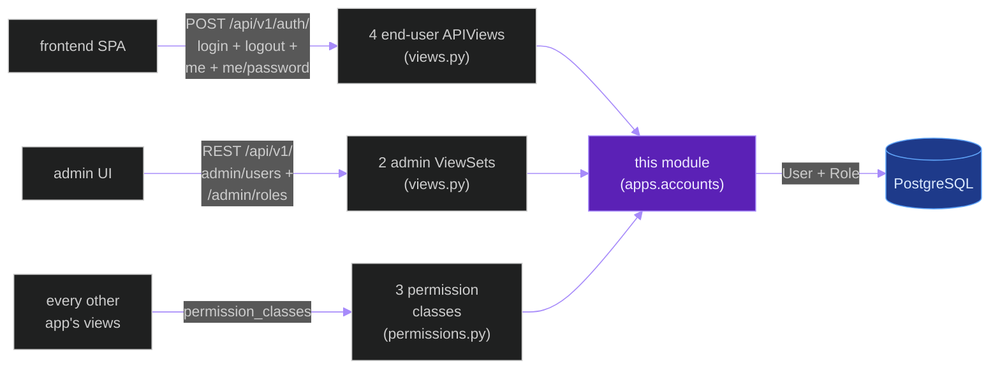
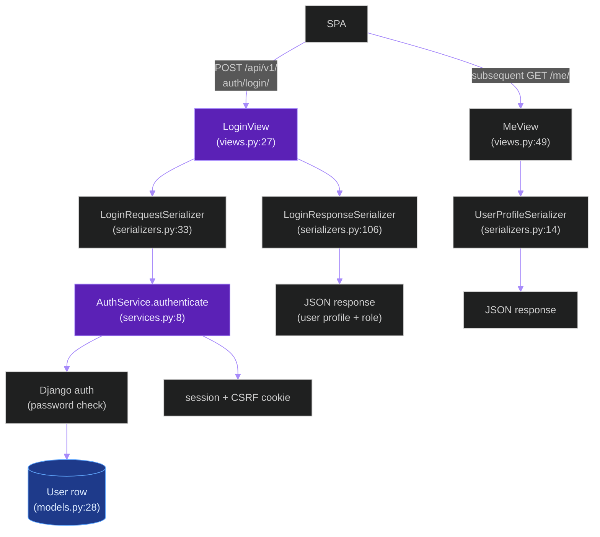
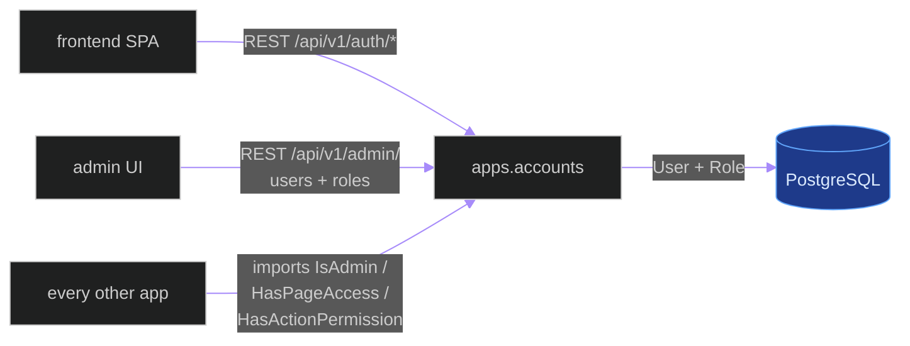
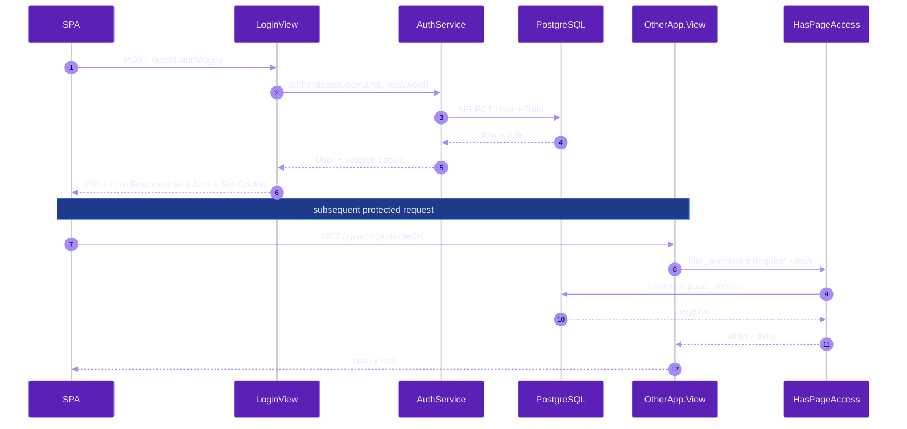
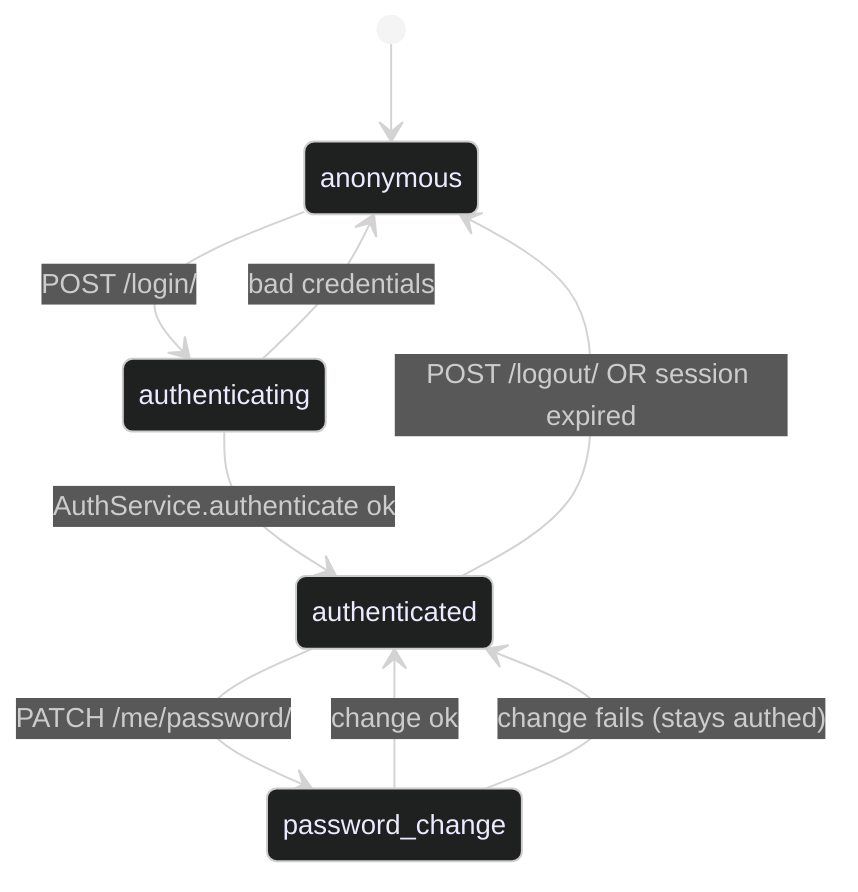

# `apps.accounts`

**Last updated:** 2026-06-03
**Entity kind:** `module`
**Status:** `active`

> Django app for authentication, roles, page-access / action-permission
> guards, and admin user/role CRUD. Owns the `User` (AbstractUser
> subclass) + `Role` models, the login/logout/me/change-password REST
> surface for end users, and the admin ViewSets for user/role
> management. Every other app's view-level permission check imports
> from here.

## Source-of-truth references

| Kind | Reference |
|---|---|
| File | `backend/apps/accounts/__init__.py` |
| File | `backend/apps/accounts/apps.py` |
| File | `backend/apps/accounts/admin_urls.py` |
| File | `backend/apps/accounts/boundary.py` |
| File | `backend/apps/accounts/models.py` |
| File | `backend/apps/accounts/permissions.py` |
| File | `backend/apps/accounts/serializers.py` |
| File | `backend/apps/accounts/services.py` |
| File | `backend/apps/accounts/urls.py` |
| File | `backend/apps/accounts/views.py` |
| File | `backend/apps/accounts/migrations/0003_initial.py` |
| File | `backend/apps/accounts/migrations/0004_seed_builtin_roles.py` |
| Symbol | `apps.accounts.models.Role` (models.py:7) |
| Symbol | `apps.accounts.models.User` (AbstractUser subclass, models.py:28) |
| Symbol | `apps.accounts.views.LoginView` (views.py:27) |
| Symbol | `apps.accounts.views.LogoutView` (views.py:41) |
| Symbol | `apps.accounts.views.MeView` (views.py:49) |
| Symbol | `apps.accounts.views.ChangePasswordView` (views.py:62) |
| Symbol | `apps.accounts.views.UserAdminViewSet` (views.py:84) |
| Symbol | `apps.accounts.views.RoleAdminViewSet` (views.py:108) |
| Symbol | `apps.accounts.serializers.RoleSerializer` (serializers.py:8) |
| Symbol | `apps.accounts.serializers.UserProfileSerializer` (serializers.py:14) |
| Symbol | `apps.accounts.serializers.LoginRequestSerializer` (serializers.py:33) |
| Symbol | `apps.accounts.serializers.PasswordChangeSerializer` (serializers.py:56) |
| Symbol | `apps.accounts.serializers.UserUpdateSerializer` (serializers.py:67) |
| Symbol | `apps.accounts.serializers.UserAdminSerializer` (serializers.py:73) |
| Symbol | `apps.accounts.serializers.RoleAdminSerializer` (serializers.py:91) |
| Symbol | `apps.accounts.serializers.LoginResponseSerializer` (serializers.py:106) |
| Symbol | `apps.accounts.permissions.IsAdmin` (permissions.py:6) |
| Symbol | `apps.accounts.permissions.HasPageAccess` (permissions.py:12) |
| Symbol | `apps.accounts.permissions.HasActionPermission` (permissions.py:24) |
| Symbol | `apps.accounts.services.AuthService` (services.py:8) |
| Symbol | `apps.accounts.services.RoleService` (services.py:18) |
| Commit | `29f0b6ad` (DSP Cycle 3 11/N — sibling `apps.contracts`) |
| Workflow | `.github/workflows/inference-parallelization.yml` |
| Workflow | `.github/workflows/mermaid-diagrams.yml` |

## 1. Purpose and scope

This module owns authentication + authorisation. Concretely:

- **2 Django models** (`models.py`): `Role` (7) with declared
  page-access and action-permission lists; `User` (28) as
  `AbstractUser` subclass with a FK to `Role`.
- **2 migrations**: `0003_initial.py` + `0004_seed_builtin_roles.py`
  (seeds operator / admin / read-only roles).
- **4 end-user APIViews** (`views.py`):
  `LoginView` (27), `LogoutView` (41), `MeView` (49),
  `ChangePasswordView` (62).
- **2 admin ViewSets** (`views.py`):
  `UserAdminViewSet` (84), `RoleAdminViewSet` (108).
- **8 serializers** (`serializers.py`):
  `RoleSerializer` (8), `UserProfileSerializer` (14),
  `LoginRequestSerializer` (33), `PasswordChangeSerializer` (56),
  `UserUpdateSerializer` (67), `UserAdminSerializer` (73),
  `RoleAdminSerializer` (91), `LoginResponseSerializer` (106).
- **3 DRF permission classes** (`permissions.py`):
  `IsAdmin` (6), `HasPageAccess` (12), `HasActionPermission` (24).
  Every other app's restricted view imports one of these.
- **2 services** (`services.py`): `AuthService` (8), `RoleService` (18).
- **URL surfaces**: `urls.py` (4 end-user paths under
  `/api/v1/auth/`), `admin_urls.py` (admin router for users + roles).

It does NOT own anomaly triage, inference, or session lifecycle —
only the auth + authorisation primitives every other app builds on.

## 2. Position in the system

## 3. Internal structure

| Path | Role |
|---|---|
| `apps.py` | Django AppConfig. |
| `boundary.py` | Cross-module import declarations. |
| `models.py` | `Role` (7), `User` AbstractUser subclass (28). |
| `views.py` | 4 end-user APIViews + 2 admin ViewSets. |
| `serializers.py` | 8 serializers covering login + me + admin CRUD. |
| `permissions.py` | 3 DRF permission classes consumed by every other app. |
| `services.py` | `AuthService` (8) + `RoleService` (18). |
| `urls.py` | 4 end-user paths: `login/`, `logout/`, `me/`, `me/password/`. |
| `admin_urls.py` | Admin router (`include(router.urls)`). |
| `migrations/0003_initial.py` | First tables. |
| `migrations/0004_seed_builtin_roles.py` | Seeds operator / admin / read-only roles. |

## 4. Call graph (one end-user login)

## 5. External connections

## 6. API surface (external calls into this module)

### REST (from `urls.py`)

| Method + path | Handler |
|---|---|
| `POST /api/v1/auth/login/` | `LoginView` (views.py:27) |
| `POST /api/v1/auth/logout/` | `LogoutView` (views.py:41) |
| `GET /api/v1/auth/me/` | `MeView` (views.py:49) |
| `PATCH /api/v1/auth/me/password/` | `ChangePasswordView` (views.py:62) |

### REST (from `admin_urls.py`)

| Method + path | Handler |
|---|---|
| `GET/POST/PUT/PATCH /api/v1/admin/users/` (+ detail) | `UserAdminViewSet` (views.py:84) |
| `GET/POST/PUT/PATCH /api/v1/admin/roles/` (+ detail) | `RoleAdminViewSet` (views.py:108) |

### Python API consumed by every other app

| Class | Purpose |
|---|---|
| `IsAdmin` (permissions.py:6) | applied to admin-only views |
| `HasPageAccess` (permissions.py:12) | role-based page-level access |
| `HasActionPermission` (permissions.py:24) | role-based per-action authz |
| `User` (models.py:28) | every FK to the auth user |
| `Role` (models.py:7) | every role lookup |

## 7. Dependencies

| Dependency | Role | Pin |
|---|---|---|
| `Django + DRF` | auth framework + REST | 5.1.5 / 3.15.2 |
| `apps.contracts` | `governed_fields` for serializer Meta declarations | internal |

Every other Django app reverses this dependency by importing one of
the 3 permission classes.

## 8. Environment variables read

| Variable | Effect |
|---|---|
| `DJANGO_SECRET_KEY` | session signing |
| `DJANGO_ALLOWED_HOSTS` | host-header validation (upstream of auth) |
| Standard DB env (`POSTGRES_*`) | ORM persistence |

## 9. Sequence diagram (SPA login + protected request)

## 10. State machine (`User` session lifecycle)

## 11. Failure modes

| Failure | Detection | Recovery |
|---|---|---|
| Bad credentials | `AuthService.authenticate` returns None | 401; SPA re-prompts |
| Stale session cookie | Django middleware sees expired session | 401; SPA redirects to `/login` |
| Role missing for `HasPageAccess` check | `User.role` None | 403; admin assigns a role |
| Builtin-role seed not run | `User` save fails on FK | run `manage.py migrate` (0004 seeds roles) |
| `DJANGO_SECRET_KEY` changed | every session invalidated | expected on key rotation; users re-login |

## 12. Performance characteristics

Sub-millisecond auth checks (Django session + Role FK lookup, both
indexed). Module is not on any per-frame critical path.

## 13. Operational notes

- The `User` model is an `AbstractUser` subclass — `AUTH_USER_MODEL`
  in settings points here. Changing this model later requires a
  major migration; constitution-style invariant.
- The seeded roles in `0004_seed_builtin_roles.py` are operator /
  admin / read-only by convention. Custom roles can be added at
  runtime via the admin UI.
- Every protected view in every other app MUST set
  `permission_classes = [HasPageAccess, ...]` or one of the other
  two — never bare `IsAuthenticated`.

## 14. Historical diagrams

> Not applicable: no diagrams in this doc have been superseded yet.

## 15. Related entities

| Entity | Path | Relationship |
|---|---|---|
| Frontend SPA | `docs/entity/systems/frontend_spa.md` | consumer of `/api/v1/auth/*` |
| `apps.contracts` | `docs/entity/modules/apps.contracts.md` | `governed_fields` used in this app's serializers |
| `apps.audit` | `docs/entity/modules/apps.audit.md` (planned) | records login + admin actions via audit hooks |
| Every other Django app | `docs/entity/modules/apps.*.md` | imports permission classes |

## 16. Open questions

- **Q1.** Should `User` carry a `last_login_ip` for audit? Not present today. *Owner:* security maintainer. *Target close:* next audit pass.
- **Q2.** `HasActionPermission` decision currently per-call; cache per request? *Owner:* module maintainer. *Target close:* DSP Cycle 6 code-level doc.

## 17. Change log

| Date | What changed | Commit |
|---|---|---|
| 2026-06-03 | First version landed under DSP Cycle 3 (12 of ~18 modules). All 5 diagrams verified locally with `mmdc` per constitution § 19.3.1 before push. | (this commit) |
