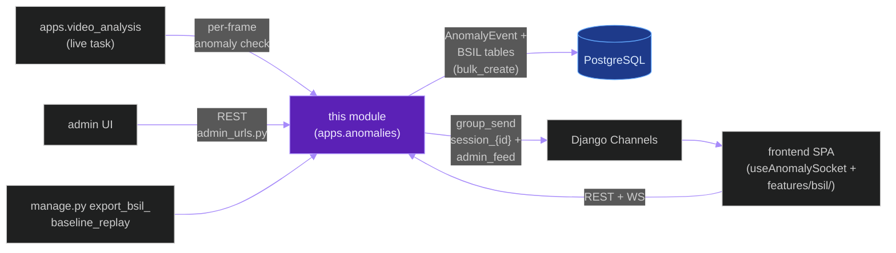
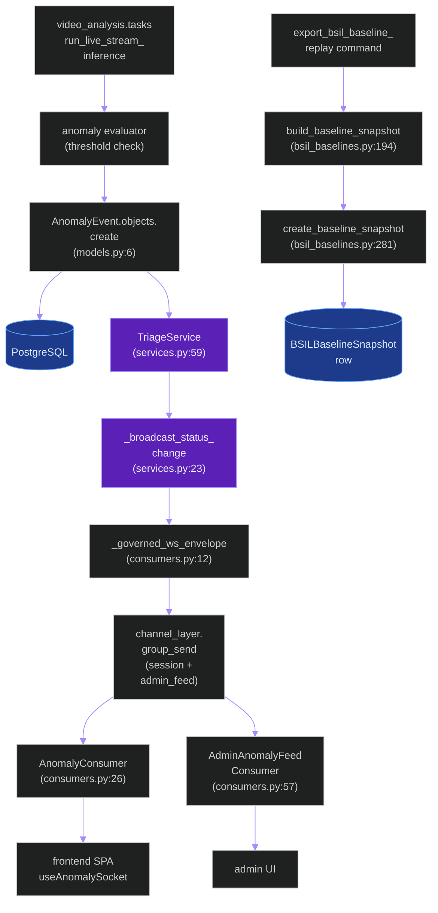
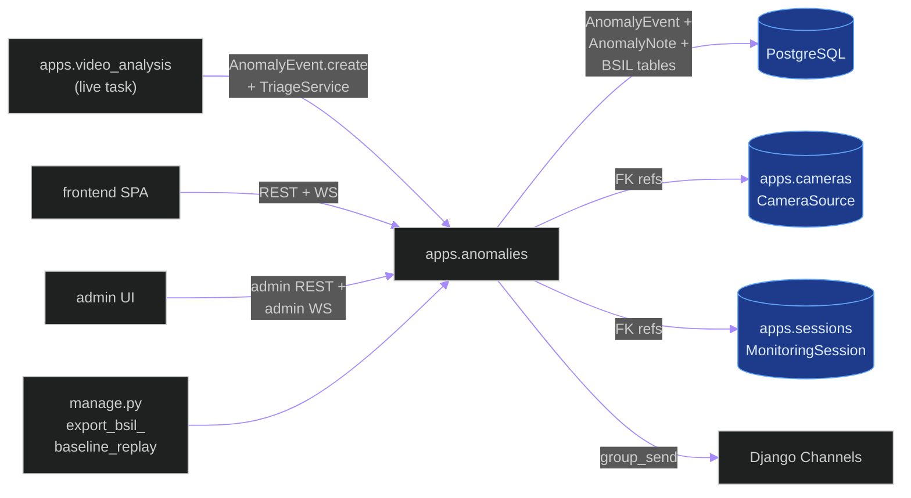
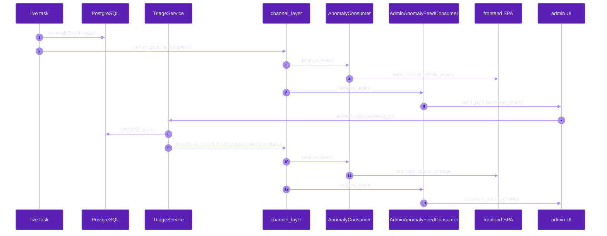
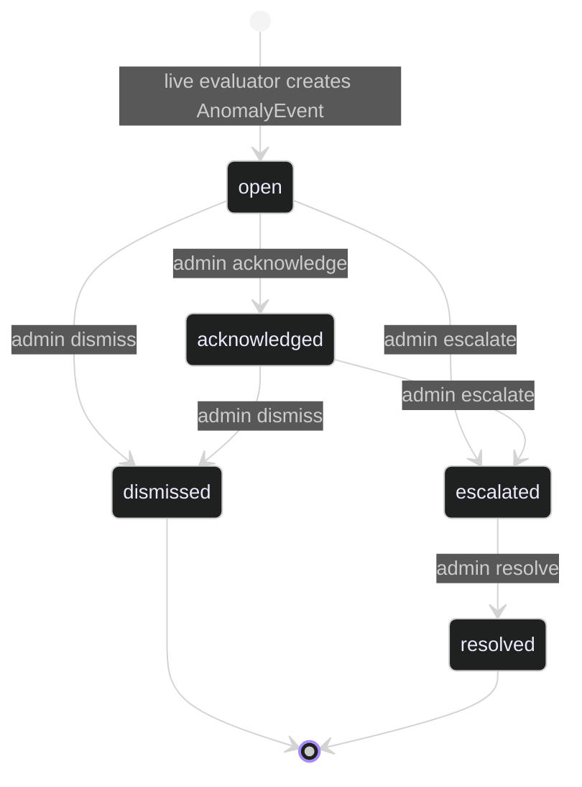

# `apps.anomalies`

**Last updated:** 2026-06-03
**Entity kind:** `module`
**Status:** `active`

> Django app for anomaly triage + BSIL (Behavioral Semantic Inference
> Layer) baselining + drift detection + review-label persistence.
> Owns the `AnomalyEvent` model, the `TriageService`, two WebSocket
> consumers (per-session + admin feed), the BSIL baseline-snapshot +
> drift-evaluation engine, the BSIL threshold-shift recorder, and the
> review-label record. Called by the live pipeline whenever a frame
> exceeds an anomaly threshold and by admin tools for review +
> retraining.

## Source-of-truth references

| Kind | Reference |
|---|---|
| File | `backend/apps/anomalies/__init__.py` |
| File | `backend/apps/anomalies/apps.py` |
| File | `backend/apps/anomalies/admin_urls.py` |
| File | `backend/apps/anomalies/boundary.py` |
| File | `backend/apps/anomalies/bsil_baselines.py` |
| File | `backend/apps/anomalies/bsil_drift.py` |
| File | `backend/apps/anomalies/bsil_review_labels.py` |
| File | `backend/apps/anomalies/bsil_thresholds.py` |
| File | `backend/apps/anomalies/consumers.py` |
| File | `backend/apps/anomalies/models.py` |
| File | `backend/apps/anomalies/routing.py` |
| File | `backend/apps/anomalies/serializers.py` |
| File | `backend/apps/anomalies/services.py` |
| File | `backend/apps/anomalies/urls.py` |
| File | `backend/apps/anomalies/views.py` |
| File | `backend/apps/anomalies/management/commands/export_bsil_baseline_replay.py` |
| File | `backend/apps/anomalies/migrations/0001_initial.py` |
| File | `backend/apps/anomalies/migrations/0002_alter_anomalyevent_camera_source_set_null.py` |
| File | `backend/apps/anomalies/migrations/0003_bsilbaselinesnapshot_bsilreviewlabelrecord_and_more.py` |
| File | `backend/apps/anomalies/README.md` |
| Symbol | `apps.anomalies.models.AnomalyEvent` (models.py:6) |
| Symbol | `apps.anomalies.models.AnomalyNote` (models.py:39) |
| Symbol | `apps.anomalies.models.BSILBaselineSnapshot` (models.py:47) |
| Symbol | `apps.anomalies.models.BSILThresholdShift` (models.py:72) |
| Symbol | `apps.anomalies.models.BSILReviewLabelRecord` (models.py:89) |
| Symbol | `apps.anomalies.views.AnomalyEventViewSet` (views.py:18) |
| Symbol | `apps.anomalies.views.AdminAnomalyFeedViewSet` (views.py:88) |
| Symbol | `apps.anomalies.views.BSILBaselineSnapshotViewSet` (views.py:103) |
| Symbol | `apps.anomalies.views.BSILThresholdShiftViewSet` (views.py:118) |
| Symbol | `apps.anomalies.views.BSILReviewLabelRecordViewSet` (views.py:126) |
| Symbol | `apps.anomalies.services.TriageConflictError` (services.py:19) |
| Symbol | `apps.anomalies.services._broadcast_status_change` (services.py:23) |
| Symbol | `apps.anomalies.services.TriageService` (services.py:59) |
| Symbol | `apps.anomalies.consumers.AnomalyConsumer` (consumers.py:26) |
| Symbol | `apps.anomalies.consumers.AdminAnomalyFeedConsumer` (consumers.py:57) |
| Symbol | `apps.anomalies.consumers._governed_ws_envelope` (consumers.py:12) |
| Symbol | `apps.anomalies.bsil_baselines.BaselineObservation` (bsil_baselines.py:17) |
| Symbol | `apps.anomalies.bsil_baselines.BaselineSnapshotConfig` (bsil_baselines.py:32) |
| Symbol | `apps.anomalies.bsil_baselines.BaselineSnapshotResult` (bsil_baselines.py:39) |
| Symbol | `apps.anomalies.bsil_baselines.BaselineDriftResult` (bsil_baselines.py:58) |
| Symbol | `apps.anomalies.bsil_baselines.BaselineSnapshotPolicy` (bsil_baselines.py:103) |
| Symbol | `apps.anomalies.bsil_baselines.BaselineSnapshot` (bsil_baselines.py:110) |
| Symbol | `apps.anomalies.bsil_baselines.build_baseline_snapshot` (bsil_baselines.py:194) |
| Symbol | `apps.anomalies.bsil_baselines.create_baseline_snapshot` (bsil_baselines.py:281) |
| Symbol | `apps.anomalies.bsil_baselines.evaluate_baseline_drift` (bsil_baselines.py:339) |
| Symbol | `apps.anomalies.bsil_drift.BaselineDriftPolicy` (bsil_drift.py:13) |
| Symbol | `apps.anomalies.bsil_drift.BaselineDriftDecision` (bsil_drift.py:26) |
| Commit | `3cccf3b1` (DSP Cycle 3 6/N — sibling `apps.detections`) |
| Workflow | `.github/workflows/inference-parallelization.yml` |
| Workflow | `.github/workflows/mermaid-diagrams.yml` |
| Doc | `docs/entity/systems/live_streaming_pipeline.md` |
| Doc | `docs/entity/systems/frontend_spa.md` |
| Doc | `docs/entity/modules/apps.detections.md` (sibling live-WS pattern) |
| Doc | `frontend/src/features/bsil/README.md` |
| Doc | `backend/apps/anomalies/README.md` |

## 1. Purpose and scope

This module is the anomaly + BSIL governance layer. It owns:

- **5 Django models** (`models.py`): `AnomalyEvent` (6) per anomaly,
  `AnomalyNote` (39) per triage note, plus 3 BSIL governance tables:
  `BSILBaselineSnapshot` (47), `BSILThresholdShift` (72),
  `BSILReviewLabelRecord` (89).
- **5 DRF ViewSets** (`views.py`): `AnomalyEventViewSet` (18) for
  triage, `AdminAnomalyFeedViewSet` (88) for admin feed,
  `BSILBaselineSnapshotViewSet` (103), `BSILThresholdShiftViewSet`
  (118), `BSILReviewLabelRecordViewSet` (126).
- **`TriageService`** (`services.py:59`) — anomaly triage state
  machine with `TriageConflictError` (19) raised on conflicting
  triage actions, `_broadcast_status_change` (23) for WS push.
- **2 WebSocket consumers** (`consumers.py`):
  `AnomalyConsumer` (26) at `ws/anomalies/{session_id}/`,
  `AdminAnomalyFeedConsumer` (57) at `ws/admin/anomalies/`, both
  wrapped by `_governed_ws_envelope` (12) for contract versioning.
- **BSIL baseline engine** (`bsil_baselines.py`):
  `BaselineObservation` (17), `BaselineSnapshotConfig` (32),
  `BaselineSnapshotResult` (39), `BaselineDriftResult` (58),
  `BaselineSample` (69), `BaselineFeatureStats` (79),
  `BaselineSnapshotPolicy` (103), `BaselineSnapshot` (110), plus
  `build_baseline_snapshot` (194), `create_baseline_snapshot` (281),
  `evaluate_baseline_drift` (339).
- **BSIL drift policy** (`bsil_drift.py`): `BaselineDriftPolicy` (13),
  `BaselineDriftDecision` (26).
- **BSIL review labels** (`bsil_review_labels.py`) + thresholds
  (`bsil_thresholds.py`).
- **Management command** `export_bsil_baseline_replay.py`.
- **3 migrations**: initial + camera-FK SET_NULL +
  `0003_bsilbaselinesnapshot_...` (BSIL tables).

It does NOT do live inference, tracking, or general detection
persistence. It consumes the live pipeline's outputs and produces
governed anomaly events + BSIL snapshots.

## 2. Position in the system

## 3. Internal structure

| Path | Role |
|---|---|
| `apps.py` | Django AppConfig — registers signals. |
| `boundary.py` | Cross-module import declarations. |
| `models.py` | 5 ORM tables (see above). |
| `views.py` | 5 DRF ViewSets covering triage + BSIL governance. |
| `consumers.py` | 2 WS consumers + `_governed_ws_envelope` (12) wrapper. |
| `routing.py` | 2 Channels routes: `ws/anomalies/{session_id}/` + `ws/admin/anomalies/`. |
| `urls.py` | DRF router registering 4 ViewSets (`''`, `bsil/baselines`, `bsil/threshold-shifts`, `bsil/review-labels`). |
| `admin_urls.py` | Per-admin paths (admin feed). |
| `serializers.py` | DRF serializers for every ViewSet. |
| `services.py` | `TriageService` (59) + `TriageConflictError` (19) + `_broadcast_status_change` (23). |
| `bsil_baselines.py` | Baseline snapshot engine: 8 dataclasses + 5 functions. The largest BSIL file. |
| `bsil_drift.py` | Drift policy + decision DTOs. |
| `bsil_review_labels.py` | Review-label persistence helpers. |
| `bsil_thresholds.py` | Threshold-shift recorder. |
| `management/commands/export_bsil_baseline_replay.py` | Operator CLI to export a replayable baseline. |
| `migrations/0001_initial.py` | First tables. |
| `migrations/0002_alter_anomalyevent_camera_source_set_null.py` | `SET_NULL` on camera FK delete. |
| `migrations/0003_bsilbaselinesnapshot_bsilreviewlabelrecord_and_more.py` | BSIL governance tables. |

## 4. Call graph (live pipeline raises anomaly → SPA notified)

## 5. External connections

## 6. API surface (external calls into this module)

### REST (from `urls.py` + `admin_urls.py`)

| Method + path | Handler |
|---|---|
| `GET/POST/PUT/PATCH /api/v1/anomalies/` (+ detail) | `AnomalyEventViewSet` (views.py:18) |
| `GET /api/v1/anomalies/bsil/baselines/` (+ detail) | `BSILBaselineSnapshotViewSet` (views.py:103) |
| `GET /api/v1/anomalies/bsil/threshold-shifts/` (+ detail) | `BSILThresholdShiftViewSet` (views.py:118) |
| `GET/POST/PUT/PATCH /api/v1/anomalies/bsil/review-labels/` | `BSILReviewLabelRecordViewSet` (views.py:126) |
| `GET /api/v1/admin/anomalies/feed/` | `AdminAnomalyFeedViewSet` (views.py:88) |

### WebSocket (from `routing.py`)

| Path | Consumer | Events |
|---|---|---|
| `ws/anomalies/{session_id}/` | `AnomalyConsumer` (consumers.py:26) | per-session `anomaly_event`, `anomaly_status_change` |
| `ws/admin/anomalies/` | `AdminAnomalyFeedConsumer` (consumers.py:57) | global admin feed |

### Python API consumed by sibling modules

| Function | Caller |
|---|---|
| `TriageService.acknowledge/dismiss/escalate(anomaly_id)` | view + admin actions |
| `_broadcast_status_change(anomaly, extra)` | `TriageService` (internal) |
| `build_baseline_snapshot(observations, config)` | management command + admin retrain flow |
| `evaluate_baseline_drift(snapshot, observations)` | live anomaly evaluator inside `apps.video_analysis` |

## 7. Dependencies

| Dependency | Role | Pin |
|---|---|---|
| `Django + DRF + Channels` | model + view + serializers + WS | 5.1.5 / 3.15.2 / 4.2.2 |
| `apps.cameras` (FK) | `CameraSource` FK on `AnomalyEvent` | internal |
| `apps.sessions` (FK) | `MonitoringSession` FK | internal |
| `apps.video_analysis` (caller) | live task triggers anomaly evaluation | internal (reverse) |
| `numpy` | BSIL baseline statistics | per requirements |
| `redis-py` (via Channels) | WS group routing | per requirements |
| `frontend/src/features/bsil` | downstream UI consumer | internal |

## 8. Environment variables read

| Variable | Effect |
|---|---|
| `REDIS_URL` | Channels layer routing |
| `PYRAMID_BEHAVIOR_CONFIDENCE_THRESHOLD` | upstream confidence floor that gates whether the live evaluator raises an anomaly |
| BSIL-specific thresholds | wired through `BaselineSnapshotPolicy` (bsil_baselines.py:103) + `BaselineDriftPolicy` (bsil_drift.py:13); not env-driven in current build |

## 9. Sequence diagram (live anomaly → triage → admin notified)

## 10. State machine (`AnomalyEvent.status` per `TriageService`)

## 11. Failure modes

| Failure | Detection | Recovery |
|---|---|---|
| Concurrent triage actions on same anomaly | `TriageConflictError` (services.py:19) raised | view returns 409; client refetches state |
| Channels layer down | `group_send` raises | event still persisted in DB; SPA backfills via REST |
| `BSILBaselineSnapshot` digest mismatch | `reconstruct_snapshot_digest` (bsil_baselines.py:259) check | snapshot invalidated; operator re-runs `export_bsil_baseline_replay` |
| Drift evaluation finds no baseline | `evaluate_baseline_drift` raises | live evaluator falls back to raw threshold |
| Camera FK deleted | migration 0002 sets it `NULL` | history preserved |

## 12. Performance characteristics

The live-anomaly hot path is `AnomalyEvent.create` + `group_send` per
anomaly — comparable to `apps.detections` group-send latency
(~ms-scale). BSIL baseline snapshot build is offline / management-
command driven, not on the live critical path.

## 13. Operational notes

- The `_governed_ws_envelope` wrapper (consumers.py:12) is the
  contract-versioning boundary — every WS payload from this module
  carries a `stream` + `event_type` for downstream contract checks.
  Do not bypass.
- BSIL baseline snapshots are immutable once persisted; the
  reconstruct-digest check enforces this. To retrain, run
  `manage.py export_bsil_baseline_replay` then create a fresh
  snapshot.
- The admin feed (`/ws/admin/anomalies/`) is a global broadcast — do
  not subscribe from low-trust client roles.

## 14. Historical diagrams

> Not applicable: no diagrams in this doc have been superseded yet.

## 15. Related entities

| Entity | Path | Relationship |
|---|---|---|
| Live streaming pipeline | `docs/entity/systems/live_streaming_pipeline.md` | upstream producer |
| Frontend SPA | `docs/entity/systems/frontend_spa.md` | downstream WS/REST consumer |
| `apps.detections` | `docs/entity/modules/apps.detections.md` | sibling live-WS pattern (governed envelope mirrors the same approach) |
| `apps.cameras` | `docs/entity/modules/apps.cameras.md` | FK source |
| `apps.sessions` | `docs/entity/modules/apps.sessions.md` (planned) | FK source |
| `apps.video_analysis` | `docs/entity/modules/apps.video_analysis.md` | live task caller |
| `frontend/src/features/bsil` | `docs/entity/modules/frontend.src.features.bsil.md` (planned) | downstream BSIL UI |
| `bsil_baselines.py` code | `docs/entity/code/apps.anomalies.bsil_baselines.md` (planned DSP Cycle 6) | hot file with snapshot engine |
| `services.py` code | `docs/entity/code/apps.anomalies.services.md` (planned DSP Cycle 6) | hot file with `TriageService` |

## 16. Open questions

- **Q1.** Should BSIL threshold values (currently policy-driven in `BaselineDriftPolicy`) move to env vars for per-deployment tuning? *Owner:* BSIL maintainer. *Target close:* DSP Cycle 6 code-level doc.
- **Q2.** Admin-feed scaling: every anomaly fans out to every admin client. Should there be a `severity >= X` filter at the WS layer to reduce bandwidth? *Owner:* live-runtime maintainer. *Target close:* next admin-UX iteration.

## 17. Change log

| Date | What changed | Commit |
|---|---|---|
| 2026-06-03 | First version landed under DSP Cycle 3 (7 of ~18 modules). All 5 diagrams verified locally with `mmdc` per constitution § 19.3.1 before push. | (this commit) |
