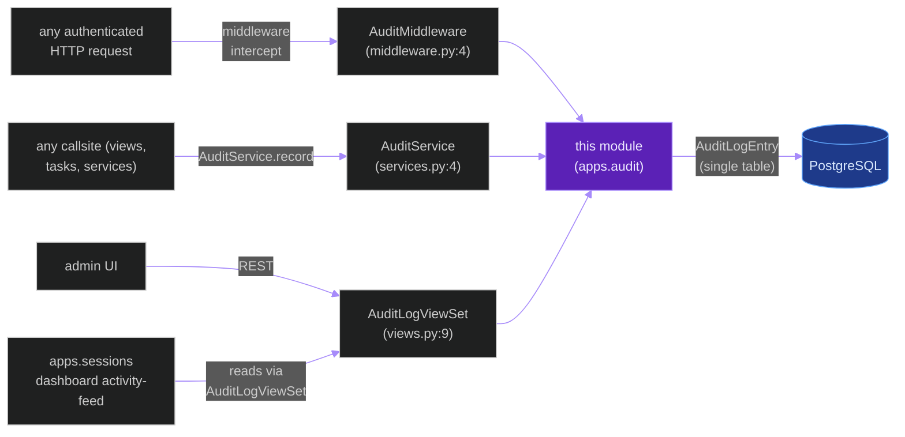
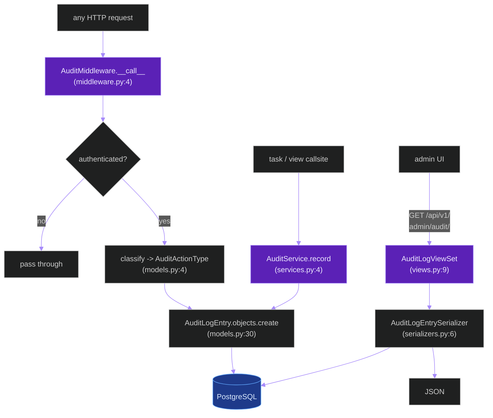
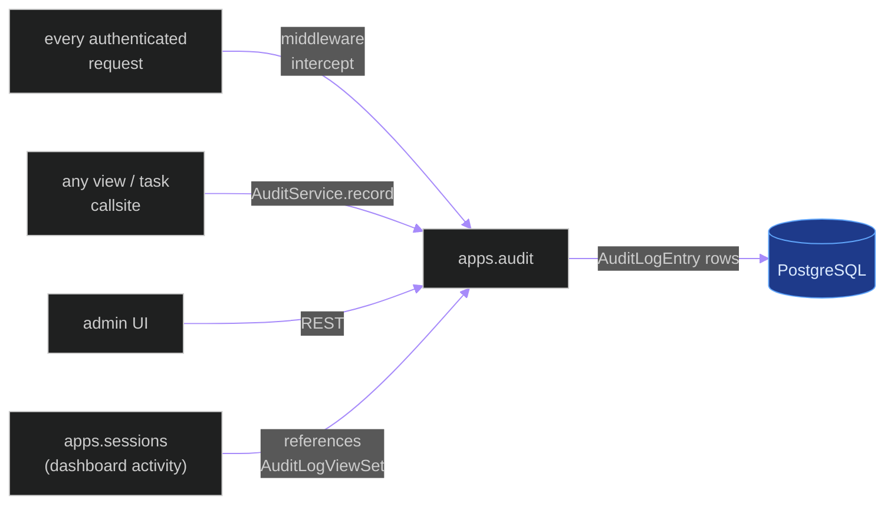
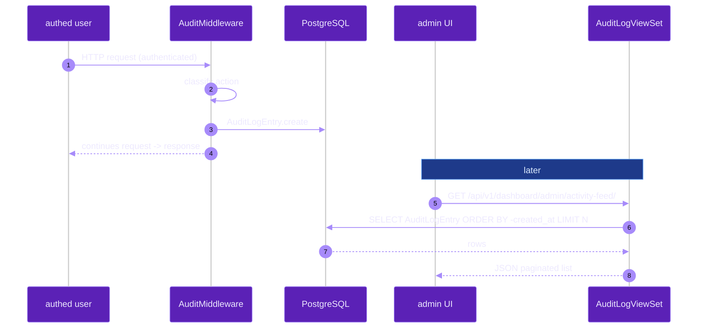

# `apps.audit`

**Last updated:** 2026-06-03
**Entity kind:** `module`
**Status:** `active`

> Django app for HTTP-request audit logging. Owns the
> `AuditLogEntry` model, an `AuditMiddleware` that records every
> authenticated request, the `AuditActionType` enum, the
> `AuditService` recorder helper, and a read-only `AuditLogViewSet`
> for admin browsing. The dashboard activity-feed (from
> `apps.sessions`) reads from this app.

## Source-of-truth references

| Kind | Reference |
|---|---|
| File | `backend/apps/audit/__init__.py` |
| File | `backend/apps/audit/apps.py` |
| File | `backend/apps/audit/admin_urls.py` |
| File | `backend/apps/audit/boundary.py` |
| File | `backend/apps/audit/middleware.py` |
| File | `backend/apps/audit/models.py` |
| File | `backend/apps/audit/serializers.py` |
| File | `backend/apps/audit/services.py` |
| File | `backend/apps/audit/urls.py` |
| File | `backend/apps/audit/views.py` |
| File | `backend/apps/audit/migrations/0001_initial.py` |
| Symbol | `apps.audit.apps.AuditConfig` (apps.py:4) |
| Symbol | `apps.audit.middleware.AuditMiddleware` (middleware.py:4) |
| Symbol | `apps.audit.models.AuditActionType` (models.py:4) |
| Symbol | `apps.audit.models.AuditLogEntry` (models.py:30) |
| Symbol | `apps.audit.serializers.AuditLogEntrySerializer` (serializers.py:6) |
| Symbol | `apps.audit.services.AuditService` (services.py:4) |
| Symbol | `apps.audit.views.AuditLogViewSet` (views.py:9) |
| Commit | `db5d6613` (DSP Cycle 3 12/N — sibling `apps.accounts`) |
| Workflow | `.github/workflows/inference-parallelization.yml` |
| Workflow | `.github/workflows/mermaid-diagrams.yml` |

## 1. Purpose and scope

This module records auditable events. Concretely:

- **`AuditActionType`** (`models.py:4`) — TextChoices enum of every
  recorded action kind.
- **`AuditLogEntry`** (`models.py:30`) — the single ORM table.
- **`AuditMiddleware`** (`middleware.py:4`) — Django middleware
  that recognises authenticated requests and writes an
  `AuditLogEntry` per qualifying call.
- **`AuditService`** (`services.py:4`) — programmatic recorder
  used by views that need to record an event outside the
  middleware's normal request flow (e.g., a Celery-task-side
  action).
- **`AuditLogViewSet`** (`views.py:9`) — read-only DRF ViewSet for
  admin browsing.
- **2 URL surfaces**: `urls.py` (read paths) + `admin_urls.py`
  (admin paths). The dashboard activity-feed in
  `apps.sessions/dashboard_urls.py:11` references this app's
  `AuditLogViewSet`.

It does NOT write to the activity stream of any specific user
session — that's a different concept owned by `apps.sessions`. It
does NOT do anomaly triage or business logic.

## 2. Position in the system

## 3. Internal structure

| Path | Role |
|---|---|
| `apps.py` | `AuditConfig` Django AppConfig (line 4). |
| `boundary.py` | Cross-module import declarations. |
| `middleware.py` | `AuditMiddleware` (4) — intercepts every request, records `AuditLogEntry` per authenticated authenticated qualifying call. |
| `models.py` | `AuditActionType` (4) enum + `AuditLogEntry` (30) table. |
| `serializers.py` | `AuditLogEntrySerializer` (6) for read paths. |
| `services.py` | `AuditService` (4) recorder helper for non-middleware sites. |
| `views.py` | `AuditLogViewSet` (9) read-only ViewSet. |
| `urls.py` | read-path URLs. |
| `admin_urls.py` | admin paths. |
| `migrations/0001_initial.py` | First (and only) migration. |

## 4. Call graph (request → middleware → recorded entry → admin browse)

## 5. External connections

## 6. API surface (external calls into this module)

### REST

| Method + path | Handler |
|---|---|
| `GET /api/v1/admin/audit/` (+ detail) | `AuditLogViewSet` (views.py:9) |
| `GET /api/v1/dashboard/admin/activity-feed/` | `AuditLogViewSet` mounted via `apps.sessions/dashboard_urls.py:11` |

### Django middleware

| Class | Triggered by |
|---|---|
| `AuditMiddleware` (middleware.py:4) | every HTTP request through the WSGI / ASGI stack (per Django `MIDDLEWARE` setting) |

### Python API

| Function | Caller |
|---|---|
| `AuditService.record(action_type, **kwargs)` (services.py:4) | views + tasks that need to record outside the middleware path |

## 7. Dependencies

| Dependency | Role | Pin |
|---|---|---|
| `Django + DRF` | middleware + ORM + read view | 5.1.5 / 3.15.2 |
| `apps.accounts` | request `user` resolution | internal |
| `apps.contracts` | `governed_fields` for `AuditLogEntrySerializer` | internal |
| `apps.sessions` | mounts `AuditLogViewSet` under dashboard URL | internal (reverse) |

## 8. Environment variables read

None — module is pure middleware + ORM.

## 9. Sequence diagram (admin browses activity feed)

## 10. State machine

> Not applicable: `AuditLogEntry` is append-only with no lifecycle.

## 11. Failure modes

| Failure | Detection | Recovery |
|---|---|---|
| Middleware raises before recording | Django returns 500; no entry written | bug; fix; the *miss* is itself recorded by web-server logs |
| PostgreSQL down during middleware write | exception swallowed by best-effort write OR raised per `middleware.py` policy | acceptable to drop one audit entry rather than fail the user request; constitution § 17 governs DB unavailability |
| `AuditService.record` called with bad `action_type` | `AuditActionType` choice validator rejects | caller bug; fix |
| Read view exposes more fields than `governed_fields` allows | DRF init fails | caller bug per `apps.contracts` governance |

## 12. Performance characteristics

Middleware adds one write per qualifying request. With Django's
default DB connection pool this is sub-millisecond. The module is
not on any frame-rate-critical path.

## 13. Operational notes

- `AuditMiddleware` must be registered in Django `MIDDLEWARE` setting
  (in `backend/config/settings/base.py`) for any auditing to happen.
- `AuditLogEntry` is append-only by convention. Retention is a
  separate concern; consider a Celery beat sweeper.
- Use `AuditService.record(...)` for any action that does not arise
  from an HTTP request (Celery tasks, signal handlers).

## 14. Historical diagrams

> Not applicable: no diagrams in this doc have been superseded yet.

## 15. Related entities

| Entity | Path | Relationship |
|---|---|---|
| `apps.accounts` | `docs/entity/modules/apps.accounts.md` | resolves request.user for the audit row |
| `apps.contracts` | `docs/entity/modules/apps.contracts.md` | governance of `AuditLogEntrySerializer` fields |
| `apps.sessions` | `docs/entity/modules/apps.sessions.md` | mounts `AuditLogViewSet` under dashboard activity-feed |
| `middleware.py` code | `docs/entity/code/apps.audit.middleware.md` (planned DSP Cycle 6) | hot file (intercepts every request) |

## 16. Open questions

- **Q1.** Should `AuditLogEntry` rows TTL out after N days? Currently retained indefinitely. *Owner:* operations maintainer. *Target close:* next retention-policy iteration.
- **Q2.** Should middleware policy be skip-on-error or fail-on-error? Currently best-effort. *Owner:* security maintainer. *Target close:* DSP Cycle 6 code-level doc.

## 17. Change log

| Date | What changed | Commit |
|---|---|---|
| 2026-06-03 | First version landed under DSP Cycle 3 (13 of ~18 modules). All 4 diagrams verified locally with `mmdc` per constitution § 19.3.1 before push. | (this commit) |
