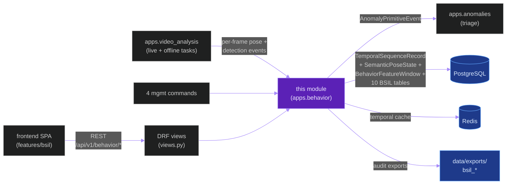
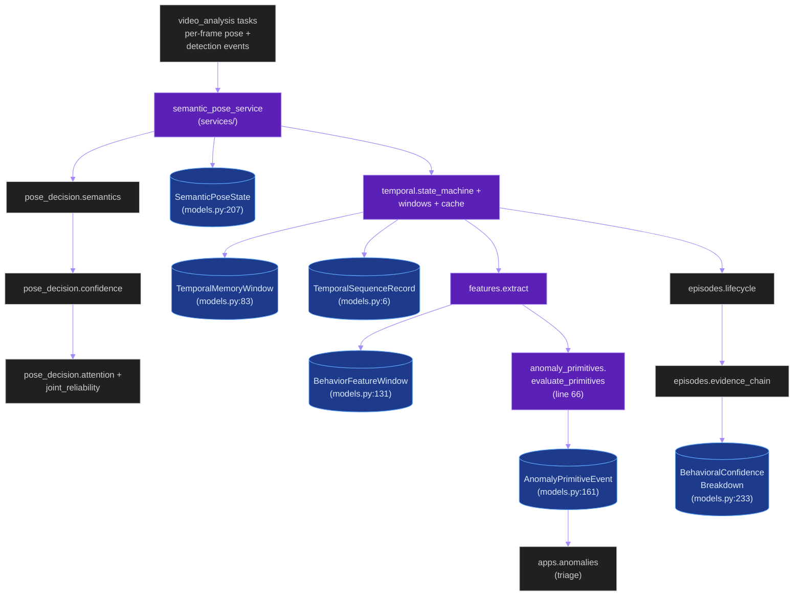
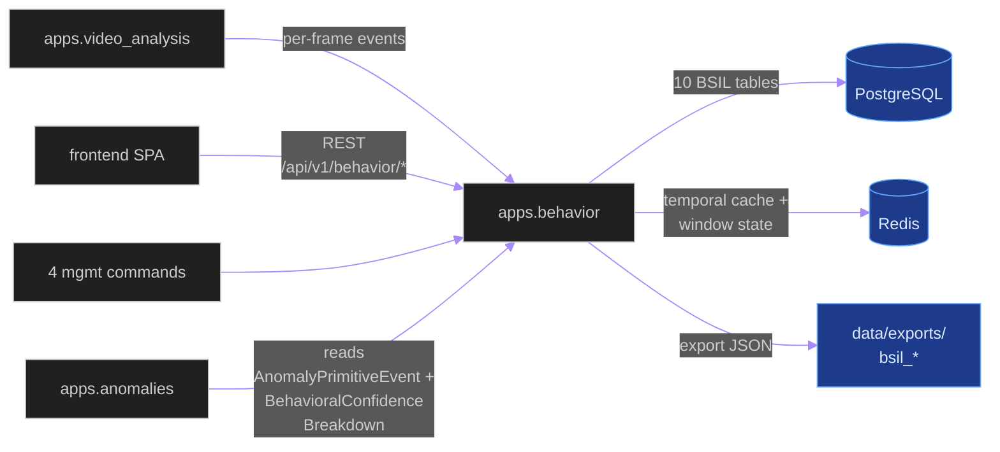
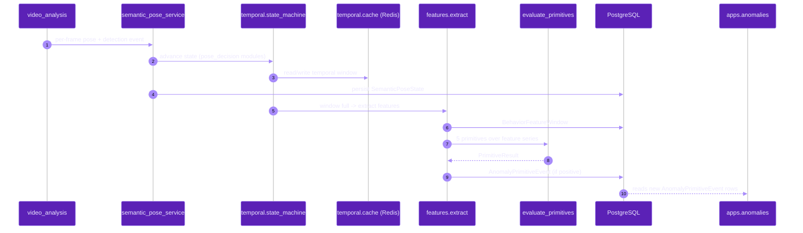
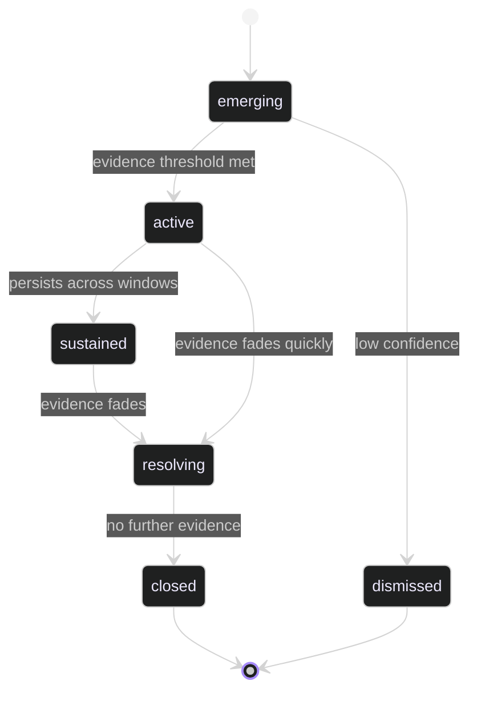

# `apps.behavior`

**Last updated:** 2026-06-03
**Entity kind:** `module`
**Status:** `active`

> Behavioral Semantic Inference Layer (BSIL) — the large Django app
> that turns per-frame detection + pose outputs into temporal
> sequences, semantic-pose states, behavioral episodes, anomaly
> primitives, attention/interaction graphs, and confidence-banded
> review records. Owns 10+ models, 5 sub-packages (`episodes/`,
> `graph/`, `pose_decision/`, `services/`, `temporal/`), 4 BSIL audit
> export commands, and a contracts module enumerating ontology
> labels, lifecycle states, and review labels.

## Source-of-truth references

| Kind | Reference |
|---|---|
| File | `backend/apps/behavior/__init__.py` |
| File | `backend/apps/behavior/apps.py` |
| File | `backend/apps/behavior/admin.py` |
| File | `backend/apps/behavior/anomaly_primitives.py` |
| File | `backend/apps/behavior/contracts.py` |
| File | `backend/apps/behavior/event_schemas.py` |
| File | `backend/apps/behavior/exports.py` |
| File | `backend/apps/behavior/features.py` |
| File | `backend/apps/behavior/forensics.py` |
| File | `backend/apps/behavior/memory.py` |
| File | `backend/apps/behavior/models.py` |
| File | `backend/apps/behavior/ontology.py` |
| File | `backend/apps/behavior/repositories.py` |
| File | `backend/apps/behavior/sequences.py` |
| File | `backend/apps/behavior/serializers.py` |
| File | `backend/apps/behavior/urls.py` |
| File | `backend/apps/behavior/views.py` |
| File | `backend/apps/behavior/episodes/confidence.py` |
| File | `backend/apps/behavior/episodes/evidence_chain.py` |
| File | `backend/apps/behavior/episodes/language.py` |
| File | `backend/apps/behavior/episodes/lifecycle.py` |
| File | `backend/apps/behavior/episodes/review_tasks.py` |
| File | `backend/apps/behavior/graph/attention_edges.py` |
| File | `backend/apps/behavior/graph/context.py` |
| File | `backend/apps/behavior/graph/edges.py` |
| File | `backend/apps/behavior/pose_decision/attention.py` |
| File | `backend/apps/behavior/pose_decision/confidence.py` |
| File | `backend/apps/behavior/pose_decision/joint_reliability.py` |
| File | `backend/apps/behavior/pose_decision/semantics.py` |
| File | `backend/apps/behavior/pose_decision/transitions.py` |
| File | `backend/apps/behavior/services/semantic_pose_service.py` |
| File | `backend/apps/behavior/temporal/cache.py` |
| File | `backend/apps/behavior/temporal/decay.py` |
| File | `backend/apps/behavior/temporal/rebuild.py` |
| File | `backend/apps/behavior/temporal/state_machine.py` |
| File | `backend/apps/behavior/temporal/time_authority.py` |
| File | `backend/apps/behavior/temporal/windows.py` |
| File | `backend/apps/behavior/management/commands/export_bsil_interaction_graph_audit.py` |
| File | `backend/apps/behavior/management/commands/export_bsil_semantic_traces.py` |
| File | `backend/apps/behavior/management/commands/export_bsil_temporal_audit.py` |
| File | `backend/apps/behavior/management/commands/run_bsil_acceptance.py` |
| File | `backend/apps/behavior/migrations/0001_initial.py` |
| File | `backend/apps/behavior/migrations/0002_behavioralconfidencebreakdown_decisionlineagerecord_and_more.py` |
| File | `backend/apps/behavior/README.md` |
| Symbol | `apps.behavior.models.TemporalSequenceRecord` (models.py:6) |
| Symbol | `apps.behavior.models.TemporalSequenceRetentionAction` (models.py:53) |
| Symbol | `apps.behavior.models.TemporalMemoryWindow` (models.py:83) |
| Symbol | `apps.behavior.models.BehaviorOntologyVersion` (models.py:105) |
| Symbol | `apps.behavior.models.BehaviorFeatureWindow` (models.py:131) |
| Symbol | `apps.behavior.models.AnomalyPrimitiveEvent` (models.py:161) |
| Symbol | `apps.behavior.models.BSILConfidenceBand` (models.py:190) |
| Symbol | `apps.behavior.models.BSILTruthState` (models.py:198) |
| Symbol | `apps.behavior.models.SemanticPoseState` (models.py:207) |
| Symbol | `apps.behavior.models.BehavioralConfidenceBreakdown` (models.py:233) |
| Symbol | `apps.behavior.anomaly_primitives.PrimitiveResult` (anomaly_primitives.py:10) |
| Symbol | `apps.behavior.anomaly_primitives.change_point` (anomaly_primitives.py:22) |
| Symbol | `apps.behavior.anomaly_primitives.drift` (anomaly_primitives.py:30) |
| Symbol | `apps.behavior.anomaly_primitives.repeated_pattern` (anomaly_primitives.py:37) |
| Symbol | `apps.behavior.anomaly_primitives.instability` (anomaly_primitives.py:51) |
| Symbol | `apps.behavior.anomaly_primitives.attention_deviation` (anomaly_primitives.py:59) |
| Symbol | `apps.behavior.anomaly_primitives.evaluate_primitives` (anomaly_primitives.py:66) |
| Symbol | `apps.behavior.contracts.ConfidenceBand` (contracts.py:6) |
| Symbol | `apps.behavior.contracts.TruthState` (contracts.py:14) |
| Symbol | `apps.behavior.contracts.FailureSeverity` (contracts.py:23) |
| Symbol | `apps.behavior.contracts.BSILFailureCategory` (contracts.py:30) |
| Symbol | `apps.behavior.contracts.EpisodeLifecycle` (contracts.py:51) |
| Symbol | `apps.behavior.contracts.InteractionEdgeLifecycle` (contracts.py:62) |
| Symbol | `apps.behavior.contracts.ReviewLabel` (contracts.py:72) |
| Symbol | `apps.behavior.event_schemas.BSILEventEnvelope` (event_schemas.py:19) |
| Symbol | `apps.behavior.event_schemas.SemanticPoseEventPayload` (event_schemas.py:38) |
| Symbol | `apps.behavior.event_schemas.TemporalStateEventPayload` (event_schemas.py:48) |
| Symbol | `apps.behavior.event_schemas.EpisodeEventPayload` (event_schemas.py:57) |
| Commit | `0d2318aa` (DSP Cycle 3 9/N — sibling `apps.health`) |
| Workflow | `.github/workflows/inference-parallelization.yml` |
| Workflow | `.github/workflows/mermaid-diagrams.yml` |
| Doc | `docs/production/behavioral_ontology_v1.md` |
| Doc | `docs/production/temporal_sequence_retention.md` |
| Doc | `frontend/src/features/bsil/README.md` |
| Doc | `backend/apps/behavior/README.md` |

## 1. Purpose and scope

`apps.behavior` is the BSIL implementation — it converts the raw
per-frame detection/pose outputs from the inference plane into
semantically-versioned behavioral evidence. It owns:

- **10 Django models** (`models.py`): `TemporalSequenceRecord` (6),
  `TemporalSequenceRetentionAction` (53), `TemporalMemoryWindow` (83),
  `BehaviorOntologyVersion` (105), `BehaviorFeatureWindow` (131),
  `AnomalyPrimitiveEvent` (161), `BSILConfidenceBand` (190 — choices),
  `BSILTruthState` (198 — choices), `SemanticPoseState` (207),
  `BehavioralConfidenceBreakdown` (233). Migration `0002_*`
  adds the breakdown + decision-lineage records.
- **`contracts.py`** — 7 StrEnums: `ConfidenceBand` (6),
  `TruthState` (14), `FailureSeverity` (23), `BSILFailureCategory` (30),
  `EpisodeLifecycle` (51), `InteractionEdgeLifecycle` (62),
  `ReviewLabel` (72). These define the public BSIL ontology surface.
- **`event_schemas.py`** — `BSILEventEnvelope` (19) +
  `SemanticPoseEventPayload` (38) + `TemporalStateEventPayload` (48) +
  `EpisodeEventPayload` (57) versioned payload dataclasses.
- **5 anomaly primitives** (`anomaly_primitives.py`):
  `change_point` (22), `drift` (30), `repeated_pattern` (37),
  `instability` (51), `attention_deviation` (59), composed by
  `evaluate_primitives` (66) into `PrimitiveResult` (10).
- **`episodes/`** — episode lifecycle: `confidence.py`,
  `evidence_chain.py`, `language.py`, `lifecycle.py`,
  `review_tasks.py`.
- **`graph/`** — attention + interaction edges: `attention_edges.py`,
  `context.py`, `edges.py`.
- **`pose_decision/`** — semantic-pose decision engine: `attention.py`,
  `confidence.py`, `joint_reliability.py`, `semantics.py`,
  `transitions.py`.
- **`services/semantic_pose_service.py`** — public service entry.
- **`temporal/`** — time authority + windows + cache + decay +
  rebuild + state machine.
- **`features.py` + `forensics.py` + `memory.py` + `ontology.py` +
  `repositories.py` + `sequences.py`** — shared utilities.
- **4 management commands**: `export_bsil_interaction_graph_audit`,
  `export_bsil_semantic_traces`, `export_bsil_temporal_audit`,
  `run_bsil_acceptance`.
- **DRF surface** (`views.py` + `urls.py` + `serializers.py`) for
  BSIL data access.
- **Admin classes** (`admin.py`) for 6 BSIL models.

It does NOT do raw inference (that's `apps.pipeline`) or anomaly
triage (that's `apps.anomalies`). It feeds anomaly detection by
producing `AnomalyPrimitiveEvent` rows + semantic state.

## 2. Position in the system

## 3. Internal structure (sub-packages)

| Path | Role |
|---|---|
| `contracts.py` | 7 StrEnums defining BSIL public ontology surface. |
| `event_schemas.py` | Versioned event-payload dataclasses (BSILEventEnvelope wrapper + 3 payload types). |
| `anomaly_primitives.py` | 5 detection primitives + composer `evaluate_primitives`. |
| `models.py` | 10 ORM tables + 2 TextChoices enums. |
| `admin.py` | 6 Django admin classes. |
| `episodes/` | Episode lifecycle + confidence + evidence-chain + language + review tasks. |
| `graph/` | Attention edges + interaction-edge context + graph builders. |
| `pose_decision/` | Semantic-pose decision: attention, confidence, joint-reliability, semantics, transitions. |
| `services/semantic_pose_service.py` | Service-layer entry for the pose-decision engine. |
| `temporal/` | Time authority + windows + cache + decay + rebuild + state machine. |
| `features.py` | Feature extraction from raw events into `BehaviorFeatureWindow` rows. |
| `forensics.py` | Forensic-trace builders for audit exports. |
| `memory.py` | Cross-window memory for episode continuity. |
| `ontology.py` | Ontology label + version helpers tied to `BehaviorOntologyVersion`. |
| `repositories.py` | Repository pattern wrappers over the 10 ORM tables. |
| `sequences.py` | `TemporalSequenceRecord` builders. |
| `views.py` + `urls.py` + `serializers.py` | DRF surface. |
| `management/commands/export_bsil_*` (3 audit exports) | Operator CLIs for forensic export. |
| `management/commands/run_bsil_acceptance.py` | BSIL acceptance gate (per `docs/production/behavioral_ontology_v1.md`). |
| `migrations/0001_initial.py` + `0002_*` | First tables + Cycle 2 confidence/lineage additions. |

## 4. Call graph (per-frame pose → semantic state → anomaly primitive)

## 5. External connections

## 6. API surface

### REST (from `urls.py`)

| Method + path | Handler |
|---|---|
| `GET /api/v1/behavior/...` (BSIL queries) | DRF ViewSets in `views.py` (over 10 tables) |

### Management commands

| Command | Purpose |
|---|---|
| `manage.py export_bsil_interaction_graph_audit` | export interaction-edge audit |
| `manage.py export_bsil_semantic_traces` | export per-student semantic traces |
| `manage.py export_bsil_temporal_audit` | export temporal-sequence audit |
| `manage.py run_bsil_acceptance` | BSIL acceptance gate run |

### Python API consumed by sibling modules

| Function / class | Caller |
|---|---|
| `services.semantic_pose_service.*` | `apps.video_analysis` per-frame hook |
| `anomaly_primitives.evaluate_primitives` | feature-window flush |
| `event_schemas.BSILEventEnvelope` + payloads | cross-module event wire format |
| `contracts.*` enums | every BSIL consumer in `apps.anomalies` |

## 7. Dependencies

| Dependency | Role | Pin |
|---|---|---|
| `Django + DRF` | ORM + REST surface | 5.1.5 / 3.15.2 |
| `apps.video_analysis` (caller) | per-frame event source | internal (reverse) |
| `apps.anomalies` (downstream) | reads `AnomalyPrimitiveEvent` for triage | internal |
| `redis-py` | temporal cache + window state | per requirements |
| `numpy` | feature extraction in `features.py` + primitives | per requirements |

## 8. Environment variables read

| Variable | Effect |
|---|---|
| `REDIS_URL` | temporal cache + window state |
| `PYRAMID_BEHAVIOR_CONFIDENCE_THRESHOLD` | upstream confidence floor that gates per-frame events feeding `semantic_pose_service` |

## 9. Sequence diagram (live pose event → BSIL pipeline)

## 10. State machine (episode lifecycle from `EpisodeLifecycle` contract)

## 11. Failure modes

| Failure | Detection | Recovery |
|---|---|---|
| Ontology version mismatch (event payload uses stale labels) | `BehaviorOntologyVersion` reconciliation in `ontology.py` | event rejected; lineage recorded; operator runs `run_bsil_acceptance` |
| Temporal cache (Redis) down | `temporal.cache` raises | feature extraction degraded; live state preserved in DB but cross-window memory lost |
| Confidence breakdown invariants violated | DB constraint + acceptance gate | acceptance run fails; operator reviews `BehavioralConfidenceBreakdown` rows |
| Primitive threshold misconfigured (e.g. drift never fires) | acceptance gate notices empty `AnomalyPrimitiveEvent` over a known-positive replay | operator re-runs `run_bsil_acceptance` after threshold change |
| Retention action incomplete (constitution Section 17) | `TemporalSequenceRetentionAction` row left pending | reconciler sweeps; operator inspects retention queue |

## 12. Performance characteristics

This module is **off the per-frame inference critical path** — it
runs over already-decoded events. The hot path is the per-window
flush from `temporal.state_machine` → `features.extract` →
`evaluate_primitives`, which is cheap CPU work (sub-ms per
primitive over typical window sizes).

## 13. Operational notes

- The 4 export commands produce auditable JSON under
  `data/exports/bsil_*` — operators MUST run these before any BSIL
  acceptance closeout.
- `BehaviorOntologyVersion` enforces ontology immutability — to
  add a label, create a new version row and migrate consumers.
- `temporal.cache` Redis keys are short-lived; rebuild via
  `temporal.rebuild` is supported but expensive over long sessions.

## 14. Historical diagrams

> Not applicable: no diagrams in this doc have been superseded yet.

## 15. Related entities

| Entity | Path | Relationship |
|---|---|---|
| `apps.video_analysis` | `docs/entity/modules/apps.video_analysis.md` | upstream per-frame event source |
| `apps.anomalies` | `docs/entity/modules/apps.anomalies.md` | downstream consumer of `AnomalyPrimitiveEvent` + BSIL baselines |
| `frontend/src/features/bsil` | `docs/entity/modules/frontend.src.features.bsil.md` (planned) | downstream UI consumer |
| `apps.telemetry_mcp` | `docs/entity/modules/apps.telemetry_mcp.md` (planned) | external reader of BSIL tables |
| `services/semantic_pose_service.py` code | `docs/entity/code/apps.behavior.services.semantic_pose_service.md` (planned DSP Cycle 6) | hot file with the pose-decision entry |
| `anomaly_primitives.py` code | `docs/entity/code/apps.behavior.anomaly_primitives.md` (planned DSP Cycle 6) | hot file with 5 primitives |
| Behavioral ontology v1 | `docs/production/behavioral_ontology_v1.md` | public ontology label spec |
| Temporal sequence retention | `docs/production/temporal_sequence_retention.md` | retention policy spec (constitution § 17) |

## 16. Open questions

- **Q1.** Should `pose_decision/` consume the LPM solver output when `LPM_ENABLED=1`, or remain independent? Currently independent (LPM is in `apps.pipeline`). *Owner:* BSIL maintainer. *Target close:* before LPM re-acceptance.
- **Q2.** The 5 anomaly primitives all use hardcoded thresholds (`anomaly_primitives.py:22,30,37,51,59`). Should these move to a config table referenced by `BehaviorOntologyVersion`? *Owner:* BSIL maintainer. *Target close:* DSP Cycle 6 code-level doc.

## 17. Change log

| Date | What changed | Commit |
|---|---|---|
| 2026-06-03 | First version landed under DSP Cycle 3 (10 of ~18 modules). All 5 diagrams verified locally with `mmdc` per constitution § 19.3.1 before push. | (this commit) |
