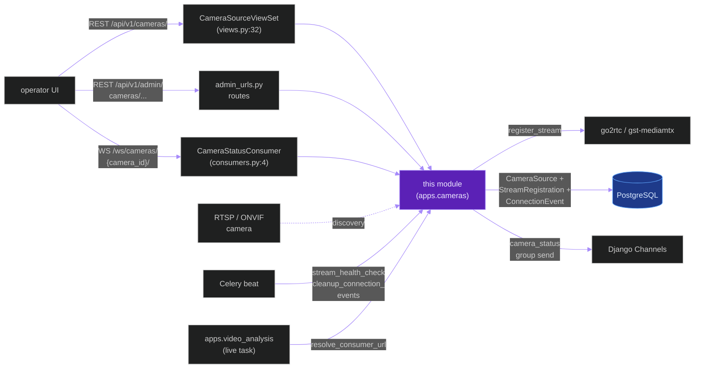
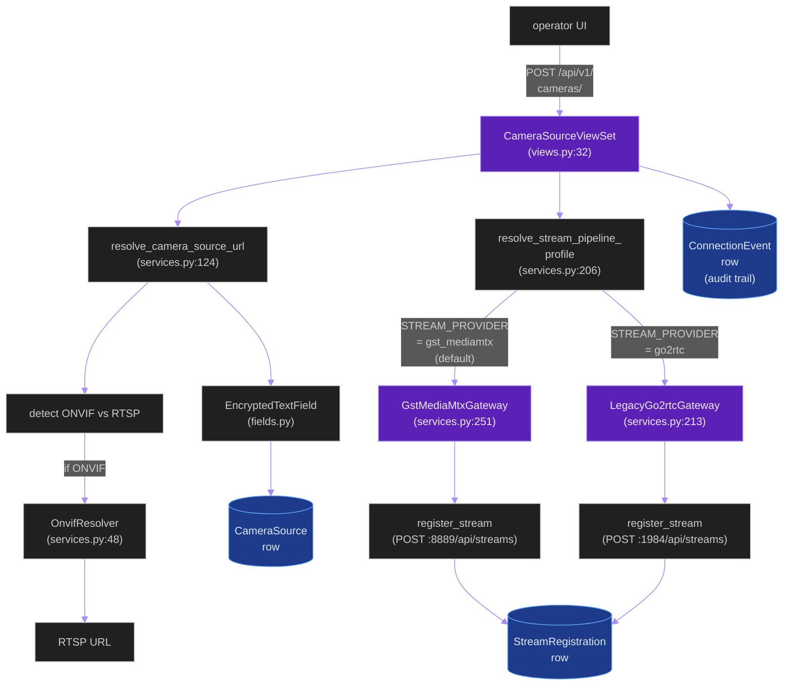
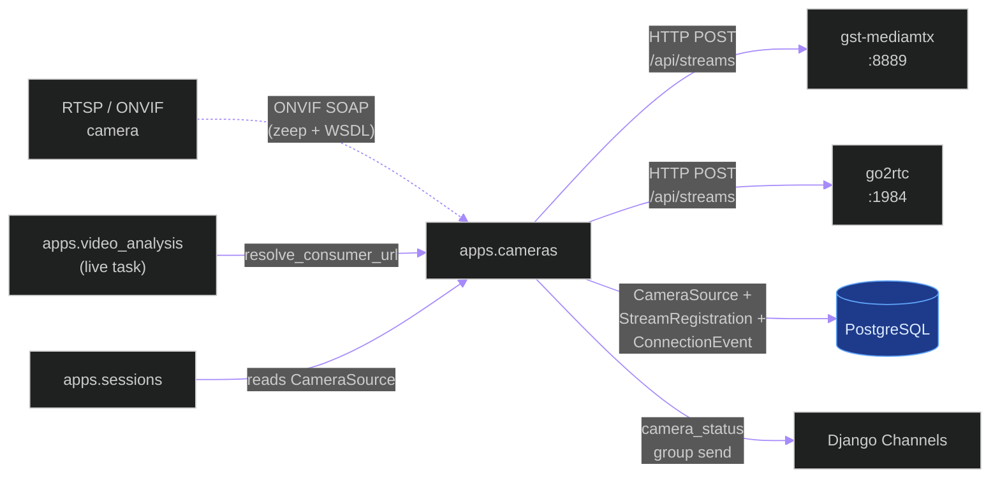
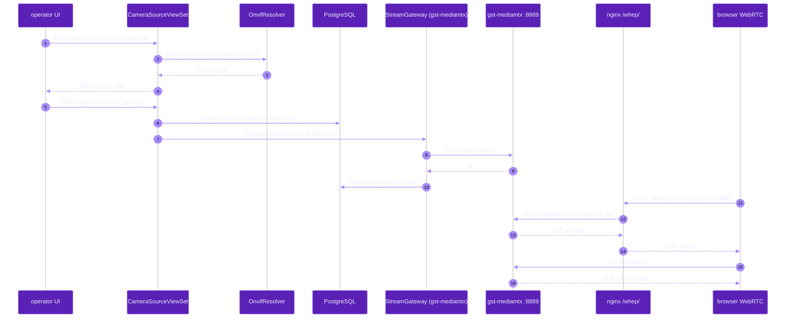
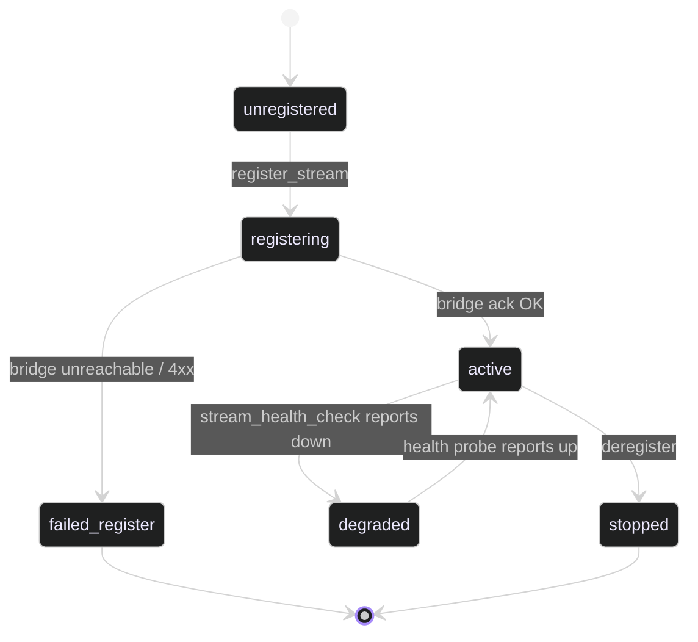

# `apps.cameras`

**Last updated:** 2026-06-03
**Entity kind:** `module`
**Status:** `active`

> Django app implementing the camera-streaming-bridge: ONVIF
> resolution, RTSP source registration with go2rtc / gst-mediamtx,
> the `CameraSource` Django model with `EncryptedTextField`-encrypted
> connection URLs, the `CameraStatusConsumer` WebSocket, and the
> `stream_health_check` + `cleanup_connection_events` Celery tasks.
> The system-level narrative lives in
> [`docs/entity/systems/camera_streaming_bridge.md`](../systems/camera_streaming_bridge.md).

## Source-of-truth references

| Kind | Reference |
|---|---|
| File | `backend/apps/cameras/__init__.py` |
| File | `backend/apps/cameras/apps.py` |
| File | `backend/apps/cameras/admin_urls.py` |
| File | `backend/apps/cameras/boundary.py` |
| File | `backend/apps/cameras/constants.py` |
| File | `backend/apps/cameras/consumers.py` |
| File | `backend/apps/cameras/exceptions.py` |
| File | `backend/apps/cameras/fields.py` |
| File | `backend/apps/cameras/gateway.py` |
| File | `backend/apps/cameras/models.py` |
| File | `backend/apps/cameras/routing.py` |
| File | `backend/apps/cameras/serializers.py` |
| File | `backend/apps/cameras/services.py` |
| File | `backend/apps/cameras/tasks.py` |
| File | `backend/apps/cameras/urls.py` |
| File | `backend/apps/cameras/views.py` |
| File | `backend/apps/cameras/migrations/0001_initial.py` |
| File | `backend/apps/cameras/migrations/0002_connection_foundation.py` |
| File | `backend/apps/cameras/migrations/0003_encrypt_existing_urls.py` |
| File | `backend/apps/cameras/migrations/0004_alter_camerasource_connection_type.py` |
| File | `backend/apps/cameras/README.md` |
| Symbol | `apps.cameras.models.CameraSource` (models.py:9) |
| Symbol | `apps.cameras.models.StreamRegistration` (models.py:62) |
| Symbol | `apps.cameras.models.ConnectionEvent` (models.py:82) |
| Symbol | `apps.cameras.views.CameraSourceViewSet` (views.py:32) |
| Symbol | `apps.cameras.consumers.CameraStatusConsumer` (consumers.py:4) |
| Symbol | `apps.cameras.serializers.CameraSourceSerializer` (serializers.py:25) |
| Symbol | `apps.cameras.serializers.ConnectionEventSerializer` (serializers.py:147) |
| Symbol | `apps.cameras.serializers.AdminCameraSerializer` (serializers.py:166) |
| Symbol | `apps.cameras.serializers.RelayHealthSerializer` (serializers.py:179) |
| Symbol | `apps.cameras.tasks.stream_health_check` (tasks.py:26) |
| Symbol | `apps.cameras.tasks.cleanup_connection_events` (tasks.py:163) |
| Symbol | `apps.cameras.tasks._active_session_for_camera` (tasks.py:15) |
| Symbol | `apps.cameras.services.OnvifResolver` (services.py:48) |
| Symbol | `apps.cameras.services.resolve_camera_source_url` (services.py:124) |
| Symbol | `apps.cameras.services.StreamGateway` (Protocol, services.py:175) |
| Symbol | `apps.cameras.services.LegacyGo2rtcGateway` (services.py:213) |
| Symbol | `apps.cameras.services.GstMediaMtxGateway` (services.py:251) |
| Symbol | `apps.cameras.services.resolve_stream_pipeline_profile` (services.py:206) |
| Symbol | `apps.cameras.fields.EncryptedTextField` |
| Symbol | `apps.cameras.fields.build_connection_url_hash` |
| Commit | `5af3e23c` (DSP Cycle 3 4/N — sibling `apps.telemetry`) |
| Workflow | `.github/workflows/inference-parallelization.yml` |
| Workflow | `.github/workflows/mermaid-diagrams.yml` |
| Doc | `docs/entity/systems/camera_streaming_bridge.md` (system view) |
| Doc | `docs/entity/systems/live_streaming_pipeline.md` (downstream consumer) |
| Doc | `docs/go2rtc.md` |
| Doc | `docs/nginx.md` |
| Doc | `backend/apps/cameras/README.md` |

## 1. Purpose and scope

This module is the Django app behind the camera-streaming-bridge
system. It owns:

- **3 Django models** (`models.py`): `CameraSource` (9) with
  encrypted `connection_url`, `StreamRegistration` (62), and
  `ConnectionEvent` (82) for audit/event trail.
- **`CameraSourceViewSet`** (`views.py:32`) — DRF REST surface.
- **`CameraStatusConsumer`** (`consumers.py:4`) — WebSocket consumer
  for `ws/cameras/{camera_id}/` + `ws/cameras/`.
- **Stream services** (`services.py`): `OnvifResolver` (48),
  `resolve_camera_source_url` (124), `StreamGateway` Protocol (175),
  `LegacyGo2rtcGateway` (213), `GstMediaMtxGateway` (251),
  `resolve_stream_pipeline_profile` (206) selector.
- **`EncryptedTextField` + `build_connection_url_hash`** (`fields.py`)
  — Fernet-encrypted persistence for camera URLs + dedup hash.
- **2 Celery tasks** (`tasks.py`): `stream_health_check` (26) for
  periodic per-stream readiness + `cleanup_connection_events` (163)
  for retention.
- **5 serializers** (`serializers.py`): `CameraSourceSerializer` (25),
  `ConnectionEventSerializer` (147), `AdminCameraSerializer` (166),
  `RelayHealthSerializer` (179), plus 2 inner DTOs.
- **2 URL surfaces**: `urls.py` (REST router) + `admin_urls.py`
  (per-camera ONVIF + relay-health admin paths).
- **4 migrations** — including `0003_encrypt_existing_urls.py`
  (backfills `EncryptedTextField` for pre-existing rows) and
  `0004_alter_camerasource_connection_type.py`.

It does NOT do inference, tracking, or telemetry persistence (those
belong to other apps).

## 2. Position in the system

## 3. Internal structure

| Path | Role |
|---|---|
| `apps.py` | Django AppConfig — registers signals + Channels routes. |
| `boundary.py` | Cross-module import declarations enforced by `backend/core/boundaries.py`. |
| `constants.py` | Per-app constants (stream-state names, default TTLs). |
| `exceptions.py` | Provider-specific failure types raised by `services.py`. |
| `fields.py` | `EncryptedTextField` (Fernet) + `build_connection_url_hash` for dedup. |
| `gateway.py` | Higher-level per-camera gateway helper API on top of `services.py`. |
| `models.py` | 3 ORM tables: `CameraSource` (9), `StreamRegistration` (62), `ConnectionEvent` (82). |
| `serializers.py` | `CameraSourceSerializer` (25), `ConnectionEventSerializer` (147), `AdminCameraSerializer` (166), `RelayHealthSerializer` (179). |
| `services.py` | Stream gateways + ONVIF: `OnvifResolver` (48), `resolve_camera_source_url` (124), `StreamGateway` Protocol (175), `resolve_stream_pipeline_profile` (206), `LegacyGo2rtcGateway` (213), `GstMediaMtxGateway` (251). |
| `views.py` | `CameraSourceViewSet` (32) — REST surface. |
| `consumers.py` | `CameraStatusConsumer` (4) — WS push of camera-status events. |
| `routing.py` | Channels WS routes: `ws/cameras/{camera_id}/` + `ws/cameras/`. |
| `urls.py` | DRF router for `/api/v1/cameras/` (line 7 registers ViewSet). |
| `admin_urls.py` | Per-camera ONVIF + admin-list paths. |
| `tasks.py` | `stream_health_check` (26) + `cleanup_connection_events` (163) + `_active_session_for_camera` (15). |
| `migrations/0001_initial.py` | First tables. |
| `migrations/0002_connection_foundation.py` | `ConnectionEvent` table + foundation columns. |
| `migrations/0003_encrypt_existing_urls.py` | Backfill — encrypts pre-existing `connection_url` values. |
| `migrations/0004_alter_camerasource_connection_type.py` | Type-column alter. |

## 4. Call graph (operator-driven camera registration)

## 5. External connections

## 6. API surface (external calls into this module)

### REST (from `urls.py` + `admin_urls.py`)

| Method + path | Handler |
|---|---|
| `GET/POST /api/v1/cameras/` (+ DRF ViewSet defaults: detail, list, update, partial, destroy) | `CameraSourceViewSet` (views.py:32) |
| `POST /api/v1/cameras/onvif/resolve/` (admin) | ViewSet action (`OnvifResolver`) |
| `POST /api/v1/cameras/onvif/test/` (admin) | ViewSet action |
| `POST /api/v1/cameras/{camera_id}/onvif/sync/` (admin) | ViewSet action |
| `GET /api/v1/admin/cameras/` (admin list) | `admin_urls.py:6` |
| Other admin paths under `admin_urls.py:7-27` | per-camera admin actions |

### WebSocket (from `routing.py`)

| Path | Consumer | Events |
|---|---|---|
| `ws/cameras/` | `CameraStatusConsumer` (consumers.py:4) | global camera-status push |
| `ws/cameras/{camera_id}/` | `CameraStatusConsumer` | per-camera status push |

### Celery tasks (from `tasks.py`)

| Task | Schedule | Purpose |
|---|---|---|
| `apps.cameras.tasks.stream_health_check` (line 26) | Celery beat | periodic per-stream readiness probe; records `ConnectionEvent` |
| `apps.cameras.tasks.cleanup_connection_events` (line 163) | Celery beat | retention sweeper for `ConnectionEvent` table |

### Python API consumed by sibling modules

| Function | Caller |
|---|---|
| `services.resolve_camera_source_url(connection_url)` | view + tasks (decrypt + normalise) |
| `services.resolve_stream_pipeline_profile(camera_id=...)` | view + live pipeline |
| `services.OnvifResolver.resolve_stream_uri(...)` | view (admin ONVIF flow) |
| `StreamGateway.register_stream(name, source_url)` | view + live pipeline at session start |
| `StreamGateway.resolve_consumer_url(name)` | live pipeline frame reader |
| `fields.EncryptedTextField` / `fields.build_connection_url_hash` | model layer |

## 7. Dependencies

| Dependency | Role | Pin |
|---|---|---|
| `zeep` + ONVIF WSDL files | ONVIF SOAP calls | per `ONVIF_WSDL_DIR` |
| `cryptography` (Fernet) | `EncryptedTextField` for `connection_url` | per requirements |
| `Django Channels` | `CameraStatusConsumer` | 4.2.2 |
| `DRF` | `CameraSourceViewSet` + serializers | 3.15.2 |
| External: `go2rtc` daemon | legacy bridge | per deployment |
| External: `gst-mediamtx` daemon | default bridge | per deployment |
| `apps.sessions` | reads `CameraSource` for session-start camera fan-out | internal (reverse) |
| `apps.video_analysis` | reads `resolve_consumer_url` at live-task start | internal (reverse) |

## 8. Environment variables read

| Variable | Default | Effect |
|---|---|---|
| `STREAM_PROVIDER` | `gst_mediamtx` | `gst_mediamtx` or `go2rtc` |
| `STREAM_PROVIDER_CAMERA_IDS` | empty | comma-separated camera UUIDs forced to `gst_mediamtx` |
| `GO2RTC_API_URL` | `http://localhost:1984` | base URL for go2rtc registration |
| `GO2RTC_WHEP_URL` | `http://go2rtc:8555` | WHEP listener URL |
| `MEDIAMTX_API_URL` | (per `services.py`) | base URL for gst-mediamtx registration |
| `MEDIAMTX_WHEP_URL` | `http://mediamtx:8889` | WHEP listener URL |
| `ONVIF_USERNAME` / `ONVIF_PASSWORD` / `ONVIF_WSDL_DIR` | empty | ONVIF auth + WSDL path |
| `PYRAMID_RTSP_OVER_TCP` | `true` | force RTSP TCP transport |
| `PYRAMID_RTSP_TRANSPORT` | `tcp` | transport preference |
| `FIELD_ENCRYPTION_KEY` | (must be set) | Fernet key for `EncryptedTextField` |

## 9. Sequence diagram (operator adds camera + live preview opens)

## 10. State machine (per-camera registration / health)

## 11. Failure modes

| Failure | Detection | Recovery |
|---|---|---|
| Camera unreachable (RTSP) | gateway register returns error → `ConnectionEvent` row | operator inspects camera + retries |
| ONVIF auth missing | `OnvifResolver.resolve_stream_uri` raises | set `ONVIF_USERNAME` / `ONVIF_PASSWORD` / `ONVIF_WSDL_DIR` |
| Bridge daemon down | `register_stream` raises | restart bridge; live pipeline + WHEP both unavailable until restored |
| `EncryptedTextField` decryption fails (Fernet key rotated) | model `.connection_url` access raises | restore the prior `FIELD_ENCRYPTION_KEY` |
| `stream_health_check` finds stream missing | logs `ConnectionEvent` with `kind=health_check_failed` | UI shows degraded state via `CameraStatusConsumer` |
| `cleanup_connection_events` retention sweep skips | logged exception | next beat run picks up |

## 12. Performance characteristics

The module's hot path is operator-driven REST + periodic beat tasks
— not on the per-frame inference critical path. ONVIF resolution
+ bridge registration is sub-second per camera. `EncryptedTextField`
Fernet encrypt/decrypt is microseconds per access (`cryptography`
native).

## 13. Operational notes

- The Fernet key (`FIELD_ENCRYPTION_KEY`) rotation invalidates every
  encrypted `connection_url` row — operators MUST migrate via a
  custom `RunPython` re-encryption migration when rotating.
- `STREAM_PROVIDER_CAMERA_IDS` is the per-camera override for the
  `STREAM_PROVIDER` default — used during migration windows.
- The `LegacyGo2rtcGateway` class name is intentional — `gst_mediamtx`
  has been the default for several releases; `go2rtc` is kept only
  for back-compat (see system doc Q1).

## 14. Historical diagrams

> Not applicable: no diagrams in this doc have been superseded yet.

## 15. Related entities

| Entity | Path | Relationship |
|---|---|---|
| Camera streaming bridge (system view) | `docs/entity/systems/camera_streaming_bridge.md` | system this module implements |
| Live streaming pipeline | `docs/entity/systems/live_streaming_pipeline.md` | downstream consumer of registered streams |
| Frontend SPA | `docs/entity/systems/frontend_spa.md` | consumes `/ws/cameras/...` + WHEP previews |
| `apps.sessions` | `docs/entity/modules/apps.sessions.md` (planned) | reads `CameraSource` to enumerate session cameras |
| `apps.video_analysis` | `docs/entity/modules/apps.video_analysis.md` | live task reads `resolve_consumer_url` |
| `services.py` code | `docs/entity/code/apps.cameras.services.md` (planned DSP Cycle 6) | hot file with the gateway selector |

## 16. Open questions

- **Q1.** When does `LegacyGo2rtcGateway` get removed? Default has been `gst_mediamtx` for several releases. *Owner:* infra maintainer. *Target close:* next breaking-change window.
- **Q2.** Should `connection_url_hash` index be unique per `added_by`? Currently indexed on `(added_by, connection_url_hash)` but not declared `unique=True`. *Owner:* cameras maintainer. *Target close:* during DSP Cycle 6 code-level doc.

## 17. Change log

| Date | What changed | Commit |
|---|---|---|
| 2026-06-03 | First version landed under DSP Cycle 3 (5 of ~18 modules). All 5 diagrams verified locally with `mmdc` per constitution § 19.3.1 before push. | (this commit) |
