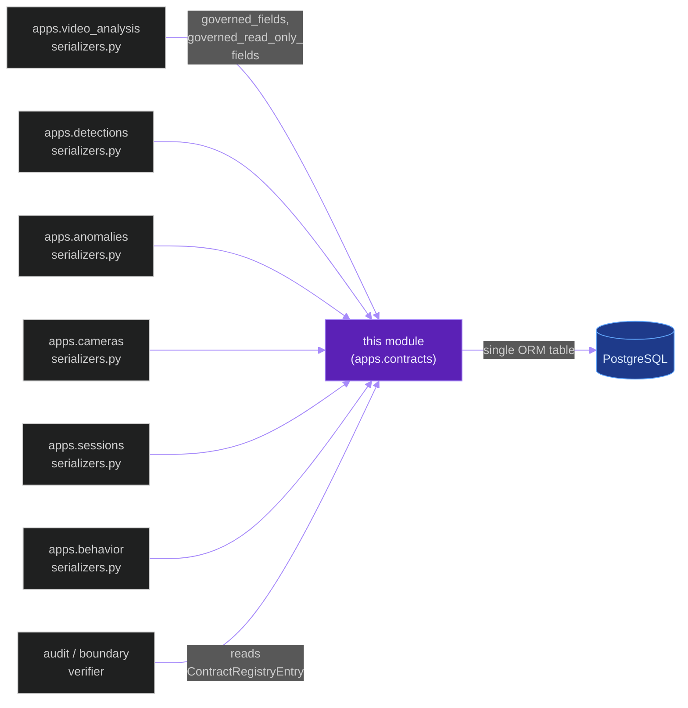
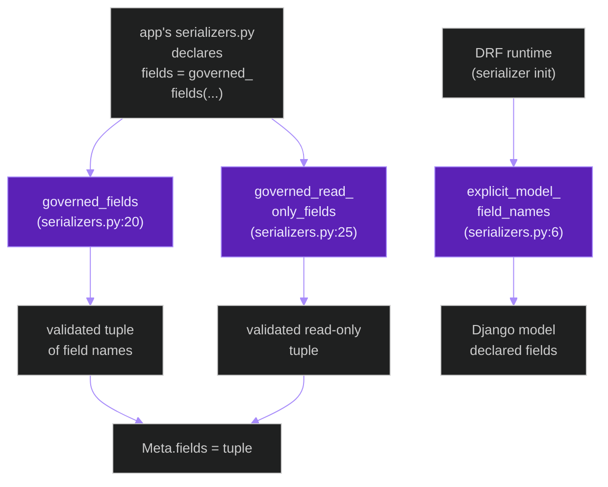
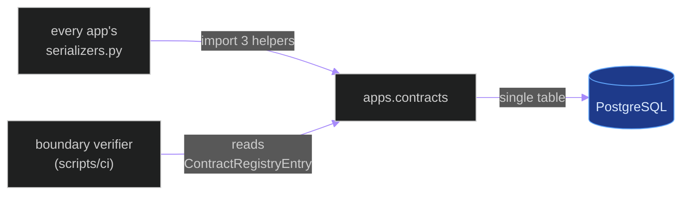
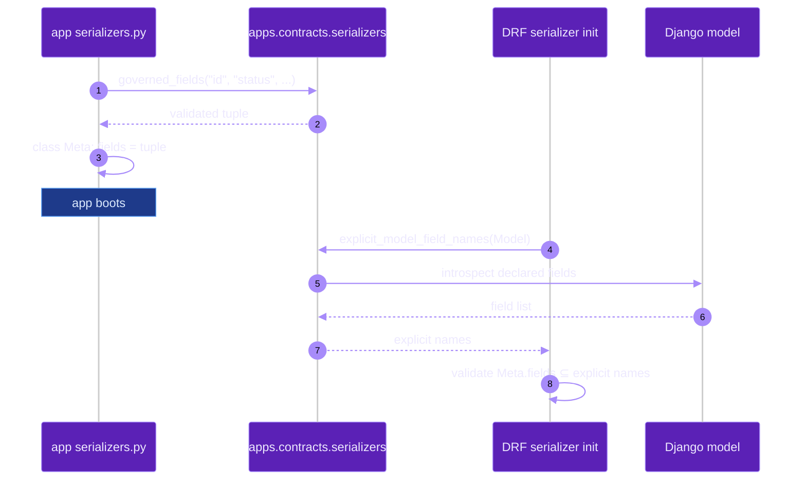

# `apps.contracts`

**Last updated:** 2026-06-03
**Entity kind:** `module`
**Status:** `active`

> Cross-app contracts registry. Tiny app — one ORM model
> (`ContractRegistryEntry`) plus 3 serializer helpers that enforce
> the "explicit-fields" governance rule (no `__all__` in DRF
> serializers). Every other Django app's `serializers.py` consumes
> the helpers here so contract drift can be tracked and audited.

## Source-of-truth references

| Kind | Reference |
|---|---|
| File | `backend/apps/contracts/__init__.py` |
| File | `backend/apps/contracts/apps.py` |
| File | `backend/apps/contracts/models.py` |
| File | `backend/apps/contracts/serializers.py` |
| File | `backend/apps/contracts/migrations/0001_initial.py` |
| File | `backend/apps/contracts/README.md` |
| Symbol | `apps.contracts.apps.ContractsConfig` (apps.py:4) |
| Symbol | `apps.contracts.models.ContractRegistryEntry` (models.py:8) |
| Symbol | `apps.contracts.serializers.explicit_model_field_names` (serializers.py:6) |
| Symbol | `apps.contracts.serializers.governed_fields` (serializers.py:20) |
| Symbol | `apps.contracts.serializers.governed_read_only_fields` (serializers.py:25) |
| Commit | `1bef724e` (DSP Cycle 3 10/N — sibling `apps.behavior`) |
| Workflow | `.github/workflows/inference-parallelization.yml` |
| Workflow | `.github/workflows/mermaid-diagrams.yml` |
| Doc | `docs/architecture/compatibility-contracts.md` |
| Doc | `backend/apps/contracts/README.md` |

## 1. Purpose and scope

This app exists so cross-app contract evolution can be tracked. It
owns:

- **1 Django model**: `ContractRegistryEntry` (models.py:8) —
  per-contract version + status row that records when a wire
  contract was created / updated / deprecated.
- **3 serializer helpers** (`serializers.py`):
  `explicit_model_field_names(model)` (6) returns the actual
  declared fields on a Django model (used to forbid `fields = '__all__'`),
  `governed_fields(*field_names)` (20) is the public way to declare
  an opt-in field list, `governed_read_only_fields(field_names)` (25)
  is the matching read-only-only helper.
- **1 migration**: `0001_initial.py`.

It does NOT own any business logic, REST endpoints, or WebSocket
surface. It is a **governance shim** — every other app that ships
public serializers MUST import these helpers.

## 2. Position in the system

## 3. Internal structure

| Path | Role |
|---|---|
| `apps.py` | `ContractsConfig` Django AppConfig (line 4). |
| `models.py` | `ContractRegistryEntry` (8) — single table that tracks contract versions + status. |
| `serializers.py` | 3 helpers (lines 6, 20, 25) every cross-app serializer consumes. |
| `migrations/0001_initial.py` | First (and only) migration. |
| `README.md` | App overview. |

## 4. Call graph (one DRF serializer instantiation)

## 5. External connections

## 6. API surface (external calls into this module)

This module exposes **no** REST, WebSocket, or CLI surface. Its
public API is pure-Python:

| Function | Caller |
|---|---|
| `governed_fields(*field_names) -> tuple[str, ...]` | every cross-app `serializers.py` Meta.fields declaration |
| `governed_read_only_fields(field_names) -> tuple[str, ...]` | every cross-app `serializers.py` Meta.read_only_fields declaration |
| `explicit_model_field_names(model) -> tuple[str, ...]` | introspection / governance audit tools |
| `ContractRegistryEntry` ORM model | governance audit + migration |

## 7. Dependencies

| Dependency | Role | Pin |
|---|---|---|
| `Django + DRF` | model + serializer helper context | 5.1.5 / 3.15.2 |

No reverse-app dependencies — every other app depends on this; this
app depends on nothing internal.

## 8. Environment variables read

None — the module is pure code + a single table.

## 9. Sequence diagram (app declares + uses a governed serializer)

## 10. State machine

> Not applicable: this module has no per-row lifecycle beyond
> standard Django CRUD on `ContractRegistryEntry`.

## 11. Failure modes

| Failure | Detection | Recovery |
|---|---|---|
| App uses `fields = '__all__'` instead of `governed_fields(...)` | `scripts/ci/verify_module_boundaries.py` | reviewer rejects PR; offending serializer migrated to `governed_fields` |
| New contract not registered in `ContractRegistryEntry` | governance audit fails | operator adds row before merge |
| Helper returns an empty tuple | DRF raises `ImproperlyConfigured` | upstream caller bug — fix the field list |

## 12. Performance characteristics

Pure-Python helpers run at import time. Negligible runtime cost.

## 13. Operational notes

- **Forbidden pattern**: `class Meta: fields = '__all__'` in any
  app's `serializers.py`. Replace with `fields = governed_fields(...)`.
  This is checked by `scripts/ci/verify_module_boundaries.py` per the
  architecture contracts doc.
- `ContractRegistryEntry` rows are append-only by convention; never
  delete a row, mark it `deprecated` instead.
- The module is intentionally tiny — adding logic here would couple
  every app to the governance layer.

## 14. Historical diagrams

> Not applicable: no diagrams in this doc have been superseded yet.

## 15. Related entities

| Entity | Path | Relationship |
|---|---|---|
| Compatibility contracts spec | `docs/architecture/compatibility-contracts.md` | declares the governance rule this module enforces |
| Module boundary map | `docs/architecture/module-boundary-map.md` | references this app as the contracts-publisher |
| `apps.video_analysis` + every other Django app | `docs/entity/modules/apps.*.md` | every app's `serializers.py` consumes the 3 helpers |
| `scripts/ci/verify_module_boundaries.py` | (planned DSP Cycle 5) | enforces the forbidden `'__all__'` pattern |

## 16. Open questions

- **Q1.** Should `ContractRegistryEntry` rows be auto-populated from a CI scan of `serializers.py` Meta.fields rather than hand-maintained? *Owner:* contracts maintainer. *Target close:* DSP Cycle 5 script audit.
- **Q2.** Should the helpers raise on accidental duplicates in the `*field_names` varargs? Currently allowed. *Owner:* contracts maintainer. *Target close:* DSP Cycle 6 code-level doc.

## 17. Change log

| Date | What changed | Commit |
|---|---|---|
| 2026-06-03 | First version landed under DSP Cycle 3 (11 of ~18 modules). All 4 diagrams verified locally with `mmdc` per constitution § 19.3.1 before push. | (this commit) |
