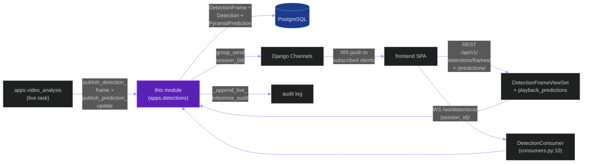
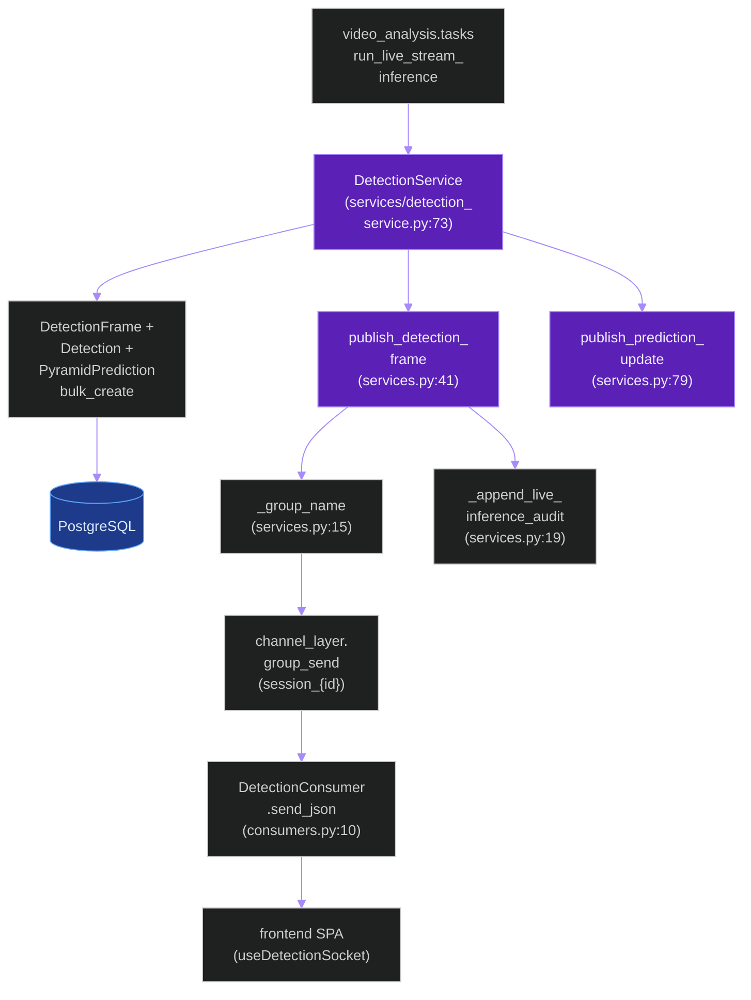
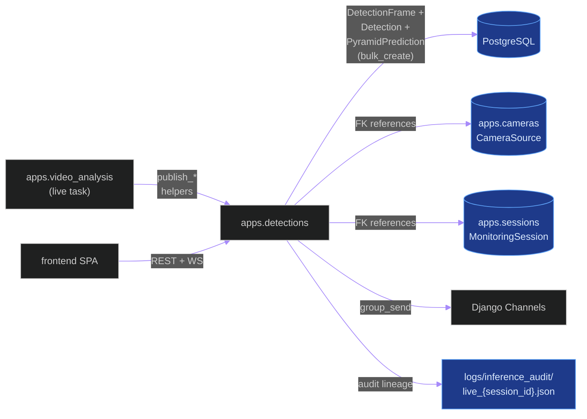
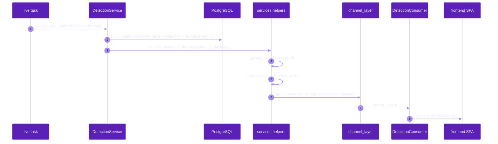
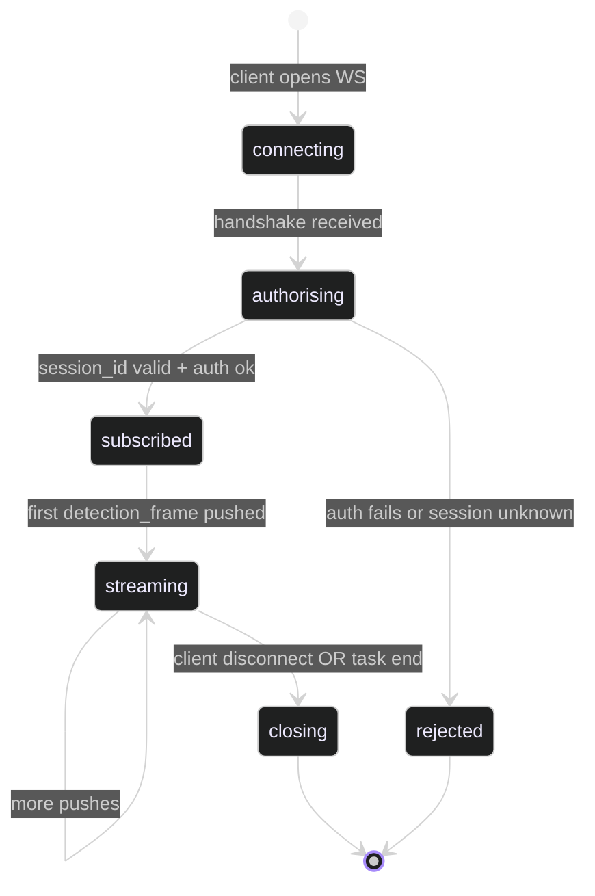

# `apps.detections`

**Last updated:** 2026-06-03
**Entity kind:** `module`
**Status:** `active`

> Django app for **live** per-session detection persistence + WebSocket
> push. Owns `DetectionFrame` + `Detection` + `PyramidPrediction`
> models, the `DetectionConsumer` WebSocket for `/ws/detections/{session_id}/`,
> `publish_detection_frame` + `publish_prediction_update` group-send
> helpers, and the higher-level `DetectionService` wrapper. Note: the
> live `DetectionFrame` model here is distinct from the offline
> `apps.video_analysis.models.Detection` (which persists per-job
> uploaded-video detections); this app handles the live monitoring
> path.

## Source-of-truth references

| Kind | Reference |
|---|---|
| File | `backend/apps/detections/__init__.py` |
| File | `backend/apps/detections/apps.py` |
| File | `backend/apps/detections/boundary.py` |
| File | `backend/apps/detections/consumers.py` |
| File | `backend/apps/detections/models.py` |
| File | `backend/apps/detections/routing.py` |
| File | `backend/apps/detections/serializers.py` |
| File | `backend/apps/detections/services.py` |
| File | `backend/apps/detections/services/detection_service.py` |
| File | `backend/apps/detections/urls.py` |
| File | `backend/apps/detections/views.py` |
| File | `backend/apps/detections/migrations/0001_initial.py` |
| File | `backend/apps/detections/migrations/0002_alter_detectionframe_camera_source_set_null.py` |
| File | `backend/apps/detections/README.md` |
| Symbol | `apps.detections.models.DetectionFrame` (models.py:6) |
| Symbol | `apps.detections.models.Detection` (models.py:25) |
| Symbol | `apps.detections.models.PyramidPrediction` (models.py:41) |
| Symbol | `apps.detections.views.DetectionFrameViewSet` (views.py:16) |
| Symbol | `apps.detections.views.playback_predictions` (views.py:24) |
| Symbol | `apps.detections.consumers.DetectionConsumer` (consumers.py:10) |
| Symbol | `apps.detections.services._group_name` (services.py:15) |
| Symbol | `apps.detections.services._append_live_inference_audit` (services.py:19) |
| Symbol | `apps.detections.services.publish_detection_frame` (services.py:41) |
| Symbol | `apps.detections.services.publish_prediction_update` (services.py:79) |
| Symbol | `apps.detections.services.detection_service.DetectionResult` (services/detection_service.py:29) |
| Symbol | `apps.detections.services.detection_service.DetectionService` (services/detection_service.py:73) |
| Symbol | `apps.detections.serializers.DetectionSerializer` (serializers.py:6) |
| Symbol | `apps.detections.serializers.PyramidPredictionSerializer` (serializers.py:22) |
| Symbol | `apps.detections.serializers.DetectionFrameSerializer` (serializers.py:28) |
| Commit | `9b872a35` (DSP Cycle 3 5/N — sibling `apps.cameras`) |
| Workflow | `.github/workflows/inference-parallelization.yml` |
| Workflow | `.github/workflows/mermaid-diagrams.yml` |
| Doc | `docs/entity/systems/live_streaming_pipeline.md` (the upstream producer of live detections) |
| Doc | `docs/entity/systems/frontend_spa.md` (downstream WS consumer) |
| Doc | `docs/entity/modules/apps.video_analysis.md` (parallel offline detection persistence) |
| Doc | `backend/apps/detections/README.md` |

## 1. Purpose and scope

This module is the live-detection surface. It owns:

- **3 Django models** (`models.py`): `DetectionFrame` (6) per
  per-camera frame, `Detection` (25) per-detection row, and
  `PyramidPrediction` (41) for playback summary.
- **REST surface** (`urls.py` + `views.py`):
  `DetectionFrameViewSet` (line 16) read-only list + retrieve,
  `playback_predictions` (line 24) function view at
  `/api/v1/detections/predictions/`. DRF router registers the
  ViewSet at `/api/v1/detections/frames/` (`urls.py:7`).
- **WebSocket** (`routing.py` + `consumers.py`):
  `DetectionConsumer` (consumers.py:10) at
  `ws/detections/{session_id}/`.
- **Group-send helpers** (`services.py`):
  `publish_detection_frame(session_id, payload)` (line 41) and
  `publish_prediction_update(session_id, payload)` (line 79).
  Both gated by `_group_name` (line 15) and emit
  `_append_live_inference_audit` (line 19) for audit lineage.
- **Higher-level wrapper** (`services/detection_service.py`):
  `DetectionResult` DTO (line 29) + `DetectionService` (line 73)
  used by the live Celery task.
- **3 serializers** (`serializers.py`): `DetectionSerializer` (6),
  `PyramidPredictionSerializer` (22), `DetectionFrameSerializer` (28).
- **2 migrations**: `0001_initial.py`,
  `0002_alter_detectionframe_camera_source_set_null.py` (camera FK
  `on_delete=SET_NULL`).

It does NOT do inference (that's `apps.pipeline`), tracking
(`apps.tracking`), or anomaly evaluation (`apps.anomalies`). It does
NOT own the offline-job per-frame detection persistence (that lives
in `apps.video_analysis.models.Detection` + `BoundingBox` — these are
parallel apps with similar names but different scopes; the live app
is per-session, the offline app is per-job).

## 2. Position in the system

## 3. Internal structure

| Path | Role |
|---|---|
| `apps.py` | Django AppConfig — registers boundary hooks. |
| `boundary.py` | Cross-module import declarations. |
| `models.py` | `DetectionFrame` (6), `Detection` (25), `PyramidPrediction` (41). |
| `views.py` | `DetectionFrameViewSet` (16) read-only DRF ViewSet + `playback_predictions` (24) function view. |
| `consumers.py` | `DetectionConsumer` (10) WebSocket consumer for the live session group. |
| `routing.py` | One Channels route: `ws/detections/{session_id}/` → `DetectionConsumer`. |
| `serializers.py` | `DetectionSerializer` (6), `PyramidPredictionSerializer` (22), `DetectionFrameSerializer` (28). |
| `services.py` | Low-level group-send helpers: `_group_name` (15), `_append_live_inference_audit` (19), `publish_detection_frame` (41), `publish_prediction_update` (79). |
| `services/detection_service.py` | Higher-level service wrapper: `DetectionResult` DTO (29), `DetectionService` (73). |
| `urls.py` | DRF router `frames` (line 7) + function-view `predictions/` (line 11). |
| `migrations/0001_initial.py` | First tables. |
| `migrations/0002_alter_detectionframe_camera_source_set_null.py` | `SET_NULL` on `CameraSource` FK delete. |

## 4. Call graph (live pipeline pushes detections + browser receives them)

## 5. External connections

## 6. API surface (external calls into this module)

### REST (from `urls.py`)

| Method + path | Handler |
|---|---|
| `GET /api/v1/detections/frames/` | `DetectionFrameViewSet.list` (views.py:16) |
| `GET /api/v1/detections/frames/{id}/` | `DetectionFrameViewSet.retrieve` |
| `GET /api/v1/detections/predictions/` | `playback_predictions` (views.py:24) |

### WebSocket (from `routing.py`)

| Path | Consumer | Events |
|---|---|---|
| `ws/detections/{session_id}/` (UUID) | `DetectionConsumer` (consumers.py:10) | server-push `detection_frame`, `prediction_update` |

### Python API consumed by sibling modules

| Function | Caller |
|---|---|
| `publish_detection_frame(session_id, payload)` (services.py:41) | `apps.video_analysis.tasks.run_live_stream_inference` (per detection batch) |
| `publish_prediction_update(session_id, payload)` (services.py:79) | live pipeline (per pyramid prediction) |
| `DetectionService.persist_and_publish(...)` (services/detection_service.py:73) | live pipeline (single-call wrapper) |

## 7. Dependencies

| Dependency | Role | Pin |
|---|---|---|
| `Django` + `DRF` | model + view + serializers | 5.1.5 / 3.15.2 |
| `Django Channels` | `DetectionConsumer` + `group_send` | 4.2.2 |
| `apps.cameras` (model FK) | `CameraSource` FK on `DetectionFrame` | internal |
| `apps.sessions` (model FK) | `MonitoringSession` FK on `DetectionFrame` | internal |
| `apps.video_analysis` (caller) | live task pushes detections via this module | internal (reverse) |
| `redis-py` (via Channels layer) | WS group routing | per requirements |

## 8. Environment variables read

This module reads no `apps.detections`-specific env vars directly.
It relies on:

| Variable | Effect (where read) |
|---|---|
| `REDIS_URL` | Channels layer routing (via Django Channels settings) |
| `PYRAMID_INFERENCE_AUDIT_LIVE_ENABLED` | gates the `_append_live_inference_audit` call from sibling code path |

## 9. Sequence diagram (live task → browser receives detection)

## 10. State machine (per-session WebSocket subscription)

## 11. Failure modes

| Failure | Detection | Recovery |
|---|---|---|
| Channels layer down | `group_send` raises | live task continues; persisted row still made; client reconnects + uses REST polling |
| PostgreSQL down at persist | `bulk_create` raises | live task fails closed; constitution § 17.3 stage outcome accounting |
| Unknown `session_id` on WS connect | `DetectionConsumer` rejects | client retries with valid session id |
| `DetectionFrame.camera_source` FK target deleted | migration 0002 sets it `NULL` rather than cascade | history preserved; client UI shows `(camera deleted)` |
| WS client subscribes mid-stream | `group_send` only reaches currently-connected consumers | client backfills via REST `/detections/frames/` |

## 12. Performance characteristics

This module's hot path is the per-frame `bulk_create` + `group_send`
loop driven by the live task. Per-batch wall is dominated by the
Channels `group_send` round-trip (a few ms via Redis). The REST
playback path is read-only and paginated; no notable hot-spot.

## 13. Operational notes

- The `live` `Detection` model in this app is per-session, distinct
  from `apps.video_analysis.models.Detection` (per-job offline). The
  two names overlap by design — sibling apps with parallel schemas
  for live vs offline.
- The audit lineage at `logs/inference_audit/live_{session_id}.json`
  is the canonical evidence file for live runs (constitution § 12.5
  applies).
- `DetectionConsumer` does not filter by camera — clients subscribe
  per *session* and receive every camera's events on that session.
  Per-camera filtering is the frontend's job.

## 14. Historical diagrams

> Not applicable: no diagrams in this doc have been superseded yet.

## 15. Related entities

| Entity | Path | Relationship |
|---|---|---|
| Live streaming pipeline | `docs/entity/systems/live_streaming_pipeline.md` | upstream producer |
| Frontend SPA | `docs/entity/systems/frontend_spa.md` | downstream WS + REST consumer |
| `apps.video_analysis` | `docs/entity/modules/apps.video_analysis.md` | live task caller AND parallel offline detection persistence |
| `apps.cameras` | `docs/entity/modules/apps.cameras.md` | FK source for `DetectionFrame.camera_source` |
| `apps.sessions` | `docs/entity/modules/apps.sessions.md` (planned) | FK source for `DetectionFrame.monitoring_session` |
| `apps.anomalies` | `docs/entity/modules/apps.anomalies.md` (planned) | sibling live evaluator (uses similar WS pattern on `/ws/anomalies/...`) |
| `services.py` code | `docs/entity/code/apps.detections.services.md` (planned DSP Cycle 6) | hot file with group-send helpers |

## 16. Open questions

- **Q1.** Should `publish_detection_frame` payload size be bounded to keep WS frames under the daphne 64 KiB default? Currently unbounded; very busy classrooms could exceed. *Owner:* live-runtime maintainer. *Target close:* during DSP Cycle 6 code-level doc.
- **Q2.** Naming clash with `apps.video_analysis.models.Detection` — should one of them be renamed (e.g. `LiveDetection` vs `OfflineDetection`) to reduce import-site confusion? *Owner:* module maintainer. *Target close:* next breaking-change window.

## 17. Change log

| Date | What changed | Commit |
|---|---|---|
| 2026-06-03 | First version landed under DSP Cycle 3 (6 of ~18 modules). All 5 diagrams verified locally with `mmdc` per constitution § 19.3.1 before push. | (this commit) |
