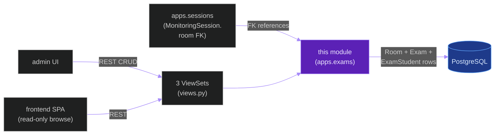
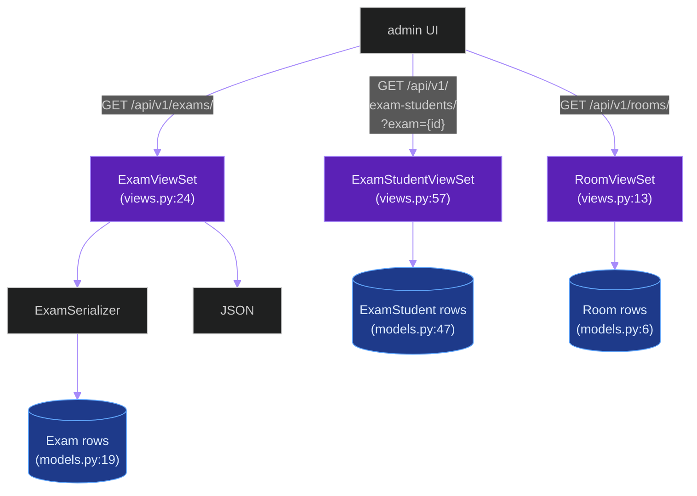
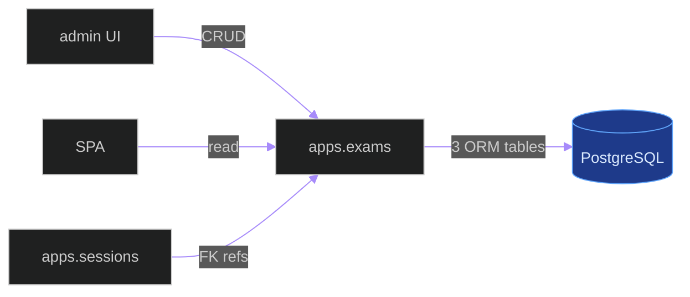

# `apps.exams`

**Last updated:** 2026-06-03
**Entity kind:** `module`
**Status:** `active`

> Django app for exam-room metadata: `Room`, `Exam`, `ExamStudent`
> ORM models + 3 DRF ModelViewSets. Static reference data for the
> live + offline pipelines — rooms are referenced from
> `MonitoringSession`, exams pin a roster + schedule, exam-students
> link the roster to identity records.

## Source-of-truth references

| Kind | Reference |
|---|---|
| File | `backend/apps/exams/__init__.py` |
| File | `backend/apps/exams/apps.py` |
| File | `backend/apps/exams/admin_urls.py` |
| File | `backend/apps/exams/boundary.py` |
| File | `backend/apps/exams/models.py` |
| File | `backend/apps/exams/serializers.py` |
| File | `backend/apps/exams/urls.py` |
| File | `backend/apps/exams/views.py` |
| File | `backend/apps/exams/migrations/0001_initial.py` |
| Symbol | `apps.exams.models.Room` (models.py:6) |
| Symbol | `apps.exams.models.Exam` (models.py:19) |
| Symbol | `apps.exams.models.ExamStudent` (models.py:47) |
| Symbol | `apps.exams.views.RoomViewSet` (views.py:13) |
| Symbol | `apps.exams.views.ExamViewSet` (views.py:24) |
| Symbol | `apps.exams.views.ExamStudentViewSet` (views.py:57) |
| Commit | `55ede47c` (DSP Cycle 3 14/N — sibling `apps.recordings`) |
| Workflow | `.github/workflows/inference-parallelization.yml` |
| Workflow | `.github/workflows/mermaid-diagrams.yml` |

## 1. Purpose and scope

This module is the exam-room reference-data CRUD. It owns:

- **3 ORM models** (`models.py`): `Room` (6) — physical classroom;
  `Exam` (19) — scheduled exam linked to a `Room`; `ExamStudent`
  (47) — per-student roster row linking a student identity to an `Exam`.
- **3 DRF ModelViewSets** (`views.py`): `RoomViewSet` (13),
  `ExamViewSet` (24), `ExamStudentViewSet` (57).
- **URL surfaces**: `urls.py` (DRF router — registers `ExamViewSet`)
  + `admin_urls.py`.
- **1 migration**: `0001_initial.py`.

It does NOT do scheduling logic, identity reconciliation, or
inference. It is the database surface for exam metadata.

## 2. Position in the system

## 3. Internal structure

| Path | Role |
|---|---|
| `apps.py` | Django AppConfig. |
| `boundary.py` | Cross-module import declarations. |
| `models.py` | 3 ORM tables (6, 19, 47). |
| `views.py` | 3 ModelViewSets. |
| `serializers.py` | DRF serializers for the 3 ViewSets. |
| `urls.py` | DRF router (`urls.py:7` registers `ExamViewSet`). |
| `admin_urls.py` | admin paths for the 3 resources. |
| `migrations/0001_initial.py` | First migration. |

## 4. Call graph (admin browses exam roster)

## 5. External connections

## 6. API surface

### REST

| Method + path | Handler |
|---|---|
| `GET/POST/PUT/PATCH /api/v1/exams/` (+ detail) | `ExamViewSet` (views.py:24, registered at `urls.py:7`) |
| `GET/POST/PUT/PATCH /api/v1/rooms/` (+ detail) | `RoomViewSet` (views.py:13) |
| `GET/POST/PUT/PATCH /api/v1/exam-students/` (+ detail) | `ExamStudentViewSet` (views.py:57) |

## 7. Dependencies

| Dependency | Role | Pin |
|---|---|---|
| `Django + DRF` | ORM + REST | 5.1.5 / 3.15.2 |
| `apps.contracts` | `governed_fields` | internal |
| `apps.sessions` | downstream — `MonitoringSession.room` FK | internal (reverse) |

## 8. Environment variables read

None.

## 9. Sequence diagram

> Not applicable: pure CRUD with no cross-system interaction beyond
> standard DRF read/write.

## 10. State machine

> Not applicable.

## 11. Failure modes

| Failure | Detection | Recovery |
|---|---|---|
| `Exam.room` FK target deleted | DB-level `on_delete` policy | per migration setting |
| Concurrent CRUD races | Django ORM transactional defaults | minimal risk per-row |

## 12. Performance characteristics

Pure CRUD; sub-millisecond.

## 13. Operational notes

- The seed data for `Room` is typically populated via admin UI or
  data migration, not built-in defaults.

## 14. Historical diagrams

> Not applicable: no diagrams in this doc have been superseded yet.

## 15. Related entities

| Entity | Path | Relationship |
|---|---|---|
| `apps.sessions` | `docs/entity/modules/apps.sessions.md` | `MonitoringSession.room` FK to `Room` |
| `apps.contracts` | `docs/entity/modules/apps.contracts.md` | serializer governance |

## 16. Open questions

- **Q1.** Should `Exam.scheduled_start` carry timezone explicitly? Currently per-Django USE_TZ. *Owner:* module maintainer. *Target close:* DSP Cycle 6.

## 17. Change log

| Date | What changed | Commit |
|---|---|---|
| 2026-06-03 | First version landed under DSP Cycle 3 (15 of ~18 modules). All 3 diagrams verified locally with `mmdc` per constitution § 19.3.1 before push. | (this commit) |
