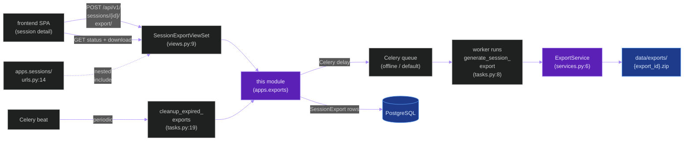
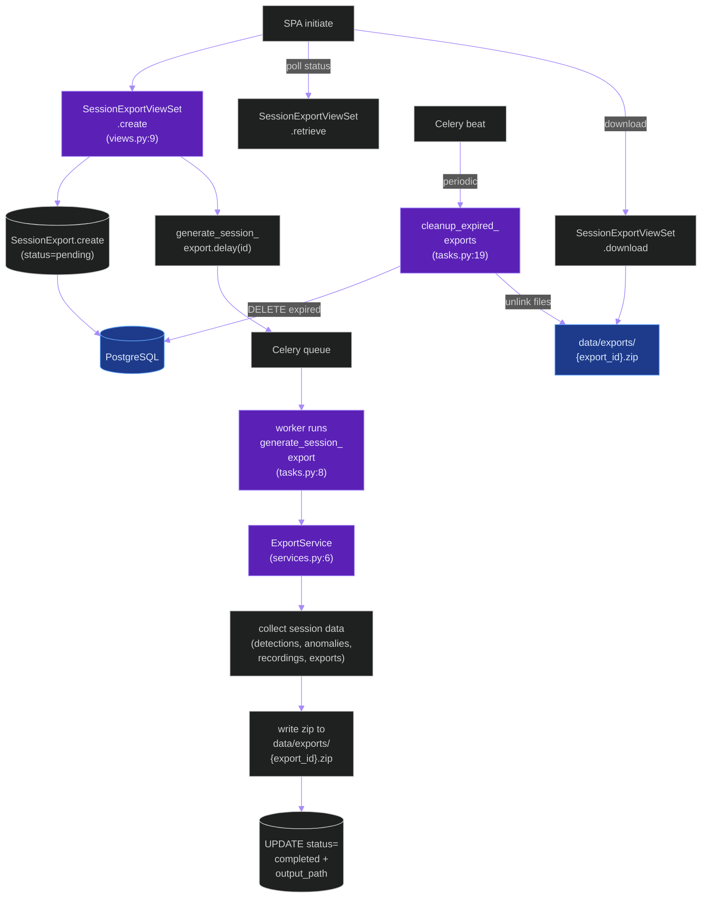
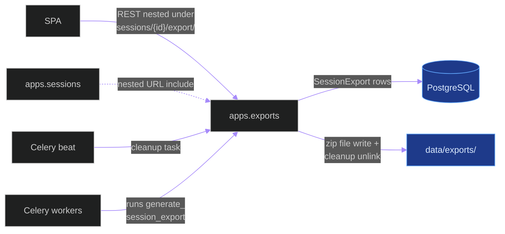
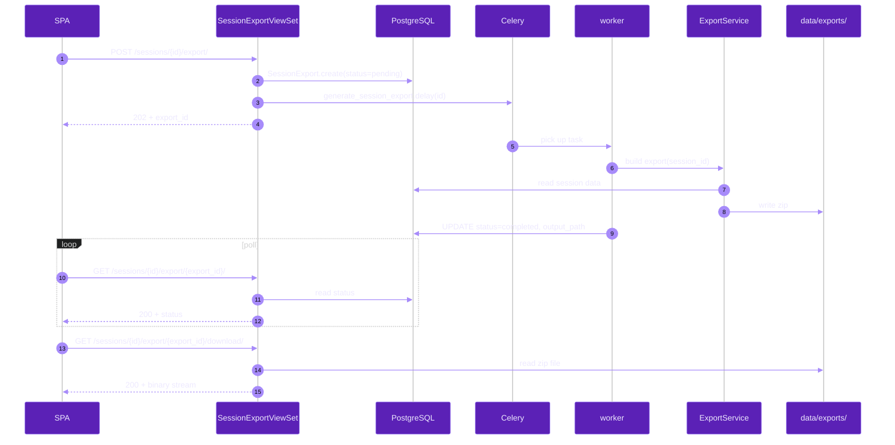
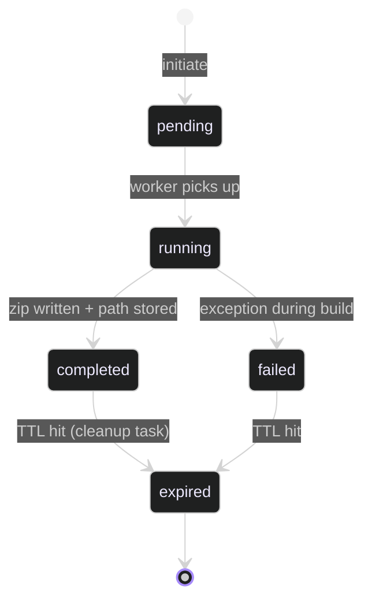

# `apps.exports`

**Last updated:** 2026-06-03
**Entity kind:** `module`
**Status:** `active`

> Django app for per-session asynchronous export generation. Owns
> `SessionExport` model, `ExportService` operator, 2 Celery beat
> tasks (`generate_session_export`, `cleanup_expired_exports`), and
> a 3-action `SessionExportViewSet` (initiate + status + download).
> Mounted as a nested route under
> `/api/v1/sessions/{session_id}/export/` per
> `apps.sessions/urls.py:14`.

## Source-of-truth references

| Kind | Reference |
|---|---|
| File | `backend/apps/exports/__init__.py` |
| File | `backend/apps/exports/apps.py` |
| File | `backend/apps/exports/boundary.py` |
| File | `backend/apps/exports/models.py` |
| File | `backend/apps/exports/serializers.py` |
| File | `backend/apps/exports/services.py` |
| File | `backend/apps/exports/tasks.py` |
| File | `backend/apps/exports/urls.py` |
| File | `backend/apps/exports/views.py` |
| File | `backend/apps/exports/migrations/0001_initial.py` |
| File | `backend/apps/exports/migrations/0002_add_name_and_created_at.py` |
| File | `backend/apps/exports/migrations/0004_make_session_user_nullable.py` |
| File | `backend/apps/exports/migrations/0005_alter_sessionexport_name.py` |
| Symbol | `apps.exports.models.SessionExport` (models.py:7) |
| Symbol | `apps.exports.views.SessionExportViewSet` (views.py:9) |
| Symbol | `apps.exports.services.ExportService` (services.py:6) |
| Symbol | `apps.exports.tasks.generate_session_export` (tasks.py:8) |
| Symbol | `apps.exports.tasks.cleanup_expired_exports` (tasks.py:19) |
| Commit | `955ca507` (DSP Cycle 3 15/N — sibling `apps.exams`) |
| Workflow | `.github/workflows/inference-parallelization.yml` |
| Workflow | `.github/workflows/mermaid-diagrams.yml` |

## 1. Purpose and scope

This module turns a long-running per-session export job into an
async pattern (initiate → poll status → download). It owns:

- **1 ORM model**: `SessionExport` (models.py:7) — the export job
  row tracking status + output path + expiry.
- **`SessionExportViewSet`** (views.py:9) — 3 actions:
  - `POST /api/v1/sessions/{session_id}/export/` — initiate
  - `GET /api/v1/sessions/{session_id}/export/{pk}/` — status poll
  - `GET /api/v1/sessions/{session_id}/export/{pk}/download/` — file download
- **`ExportService`** (services.py:6) — non-REST callable for
  programmatic export.
- **2 Celery tasks** (tasks.py):
  `generate_session_export(export_id)` (8) — workhorse that produces
  the export file; `cleanup_expired_exports()` (19) — beat task that
  TTLs out old rows + files.
- **4 migrations** including:
  - `0002_add_name_and_created_at.py` — adds export name + created_at
  - `0004_make_session_user_nullable.py` — allow user FK NULL for retention
  - `0005_alter_sessionexport_name.py` — name field tweaks

It does NOT do exam/recording metadata. It is the *job* surface for
exports; mounted under `apps.sessions` URL tree.

## 2. Position in the system

## 3. Internal structure

| Path | Role |
|---|---|
| `apps.py` | Django AppConfig. |
| `models.py` | `SessionExport` (7) — status + output path + expiry row. |
| `views.py` | `SessionExportViewSet` (9) GenericViewSet with 3 actions. |
| `serializers.py` | DRF serializer for status + initiate payloads. |
| `services.py` | `ExportService` (6) operator. |
| `tasks.py` | `generate_session_export` (8) + `cleanup_expired_exports` (19) Celery tasks. |
| `urls.py` | 3 paths — initiate (POST `''`), status (GET `<pk>/`), download (GET `<pk>/download/`). |
| `boundary.py` | Cross-module import declarations. |
| `migrations/*` | 4 migrations tracking schema evolution. |

## 4. Call graph (initiate + worker + download)

## 5. External connections

## 6. API surface

### REST (mounted under `/api/v1/sessions/{session_id}/export/` per `apps.sessions/urls.py:14`)

| Method + path | Handler |
|---|---|
| `POST /api/v1/sessions/{session_id}/export/` | `SessionExportViewSet.create` (views.py:9 + urls.py:7) |
| `GET /api/v1/sessions/{session_id}/export/{pk}/` | `SessionExportViewSet.retrieve` (urls.py:8) |
| `GET /api/v1/sessions/{session_id}/export/{pk}/download/` | `SessionExportViewSet.download` (urls.py:9) |

### Celery tasks

| Task | Schedule | Purpose |
|---|---|---|
| `apps.exports.tasks.generate_session_export(export_id)` (line 8) | one-off `.delay()` from initiate view | builds the zip + updates status |
| `apps.exports.tasks.cleanup_expired_exports()` (line 19) | Celery beat (periodic) | TTLs expired rows + unlinks files |

### Python API

| Function | Caller |
|---|---|
| `ExportService.create(...)` | non-REST callers (tests, programmatic) |

## 7. Dependencies

| Dependency | Role | Pin |
|---|---|---|
| `Django + DRF` | model + REST | 5.1.5 / 3.15.2 |
| `Celery` | async task framework | 5.4.0 |
| `apps.sessions` | upstream — nested URL include + `MonitoringSession` FK | internal (reverse) |
| `apps.detections` + `apps.anomalies` + `apps.recordings` | data sources read by the export | internal |
| `apps.contracts` | `governed_fields` for serializer | internal |

## 8. Environment variables read

| Variable | Effect |
|---|---|
| `CELERY_BROKER_URL` | task dispatch |
| `CELERY_RESULT_BACKEND` | result storage |
| Standard DB env (`POSTGRES_*`) | ORM persistence |

## 9. Sequence diagram (initiate → poll → download)

## 10. State machine (`SessionExport.status`)

## 11. Failure modes

| Failure | Detection | Recovery |
|---|---|---|
| Worker exception during build | task wrapper sets `status=failed` | UI shows failed; user can retry by initiating again |
| Output path missing at download | view raises 404 | row stale; user retries |
| Cleanup runs while user downloads | file unlink race | small race window; download fails 404; user retries |
| `SessionExport.session` FK target deleted | `0004_make_session_user_nullable` allows NULL | export retained for download even after session purge |
| Worker queue down | task never picked up; `status=pending` indefinitely | operator inspects broker + worker; resubmit |

## 12. Performance characteristics

Export build is bounded by per-session data volume; typically
seconds to minutes for a full classroom session. Not on any
frame-rate-critical path.

## 13. Operational notes

- Export files live under `data/exports/` and follow the
  `cleanup_expired_exports` retention (per-row TTL configured at
  create time).
- Initiate is idempotent only by `export_id` — calling initiate
  twice produces two rows. Caller should check existing exports
  via the list endpoint before re-initiating.
- The nested URL pattern means session UUID must match the export's
  `session_id` — DRF check enforces this.

## 14. Historical diagrams

> Not applicable: no diagrams in this doc have been superseded yet.

## 15. Related entities

| Entity | Path | Relationship |
|---|---|---|
| `apps.sessions` | `docs/entity/modules/apps.sessions.md` | parent URL tree + `MonitoringSession` FK |
| `apps.recordings` | `docs/entity/modules/apps.recordings.md` | recording metadata read during export |
| `apps.detections` + `apps.anomalies` | `docs/entity/modules/apps.{detections,anomalies}.md` | data sources |
| `tasks.py` code | `docs/entity/code/apps.exports.tasks.md` (planned DSP Cycle 6) | hot file with the two beat tasks |

## 16. Open questions

- **Q1.** Should `cleanup_expired_exports` page through results (currently sweeps all rows)? *Owner:* operations maintainer. *Target close:* DSP Cycle 6 code-level doc.
- **Q2.** Should export build emit a WS progress event so SPA stops polling? *Owner:* frontend maintainer. *Target close:* next UX iteration.

## 17. Change log

| Date | What changed | Commit |
|---|---|---|
| 2026-06-03 | First version landed under DSP Cycle 3 (16 of ~18 modules). All 5 diagrams verified locally with `mmdc` per constitution § 19.3.1 before push. | (this commit) |
