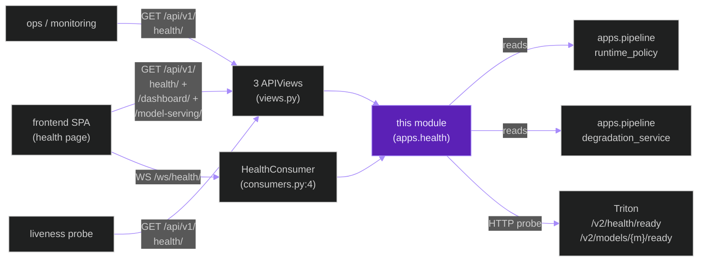
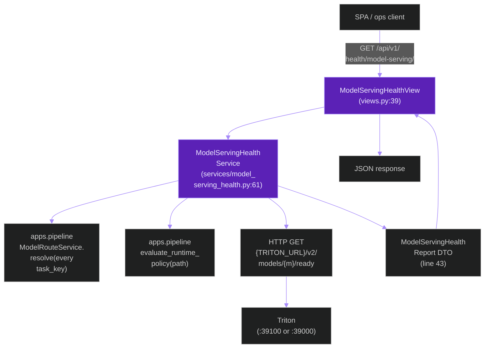
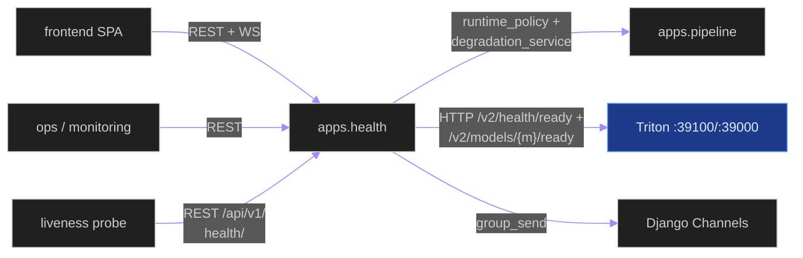
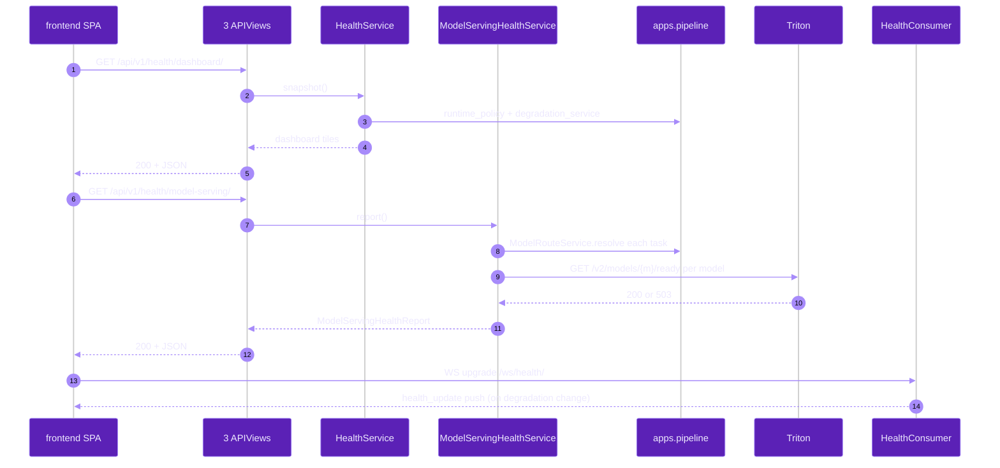
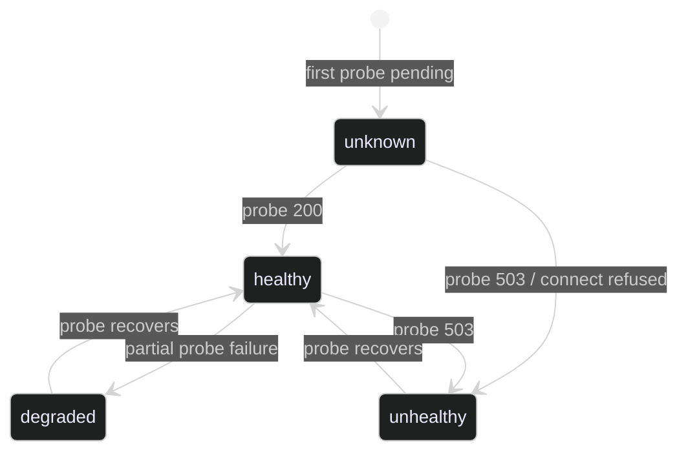

# `apps.health`

**Last updated:** 2026-06-03
**Entity kind:** `module`
**Status:** `active`

> Django app for runtime health surface: REST + WebSocket readiness +
> per-model-serving health reports + dashboard tiles. Reads the
> `apps.pipeline` `runtime_policy` + `degradation_service` state and
> presents it to operators and to the SPA. Owns no models — all output
> derives from upstream services.

## Source-of-truth references

| Kind | Reference |
|---|---|
| File | `backend/apps/health/__init__.py` |
| File | `backend/apps/health/apps.py` |
| File | `backend/apps/health/boundary.py` |
| File | `backend/apps/health/consumers.py` |
| File | `backend/apps/health/model_serving_health.py` |
| File | `backend/apps/health/routing.py` |
| File | `backend/apps/health/services.py` |
| File | `backend/apps/health/services/model_serving_health.py` |
| File | `backend/apps/health/urls.py` |
| File | `backend/apps/health/views.py` |
| File | `backend/apps/health/README.md` |
| Symbol | `apps.health.views.HealthCheckView` (views.py:21) |
| Symbol | `apps.health.views.HealthDashboardView` (views.py:31) |
| Symbol | `apps.health.views.ModelServingHealthView` (views.py:39) |
| Symbol | `apps.health.services.HealthService` (services.py:13) |
| Symbol | `apps.health.consumers.HealthConsumer` (consumers.py:4) |
| Symbol | `apps.health.services.model_serving_health.ModelServingStatus` (services/model_serving_health.py:25) |
| Symbol | `apps.health.services.model_serving_health.ModelHealthDetail` (services/model_serving_health.py:34) |
| Symbol | `apps.health.services.model_serving_health.ModelServingHealthReport` (services/model_serving_health.py:43) |
| Symbol | `apps.health.services.model_serving_health.ModelServingHealthService` (services/model_serving_health.py:61) |
| Symbol | `apps.health.model_serving_health.ModelServingStatus` (model_serving_health.py:16, top-level legacy shim) |
| Symbol | `apps.health.model_serving_health.ModelServingHealthService` (model_serving_health.py:55, legacy shim) |
| Commit | `5babff78` (DSP Cycle 3 8/N — sibling `apps.sessions`) |
| Workflow | `.github/workflows/inference-parallelization.yml` |
| Workflow | `.github/workflows/mermaid-diagrams.yml` |
| Doc | `docs/entity/systems/triton_inference_plane.md` (upstream readiness source) |
| Doc | `docs/entity/modules/apps.pipeline.md` (upstream `runtime_policy` + `degradation_service`) |
| Doc | `backend/apps/health/README.md` |

## 1. Purpose and scope

This module is the **read-only** runtime-health surface. It owns:

- **3 DRF APIView classes** (`views.py`):
  `HealthCheckView` (21) for the basic `/api/v1/health/` ping,
  `HealthDashboardView` (31) for the dashboard tile,
  `ModelServingHealthView` (39) for per-Triton-model readiness.
- **`HealthConsumer`** (`consumers.py:4`) — WebSocket consumer at
  `ws/health/` for live readiness push.
- **`HealthService`** (`services.py:13`) — higher-level aggregator
  used by the dashboard view.
- **`ModelServingHealthService`** (`services/model_serving_health.py:61`)
  with 3 DTOs: `ModelServingStatus` (25) enum, `ModelHealthDetail` (34),
  `ModelServingHealthReport` (43).
- **Legacy top-level shim** (`model_serving_health.py:16,55`) that
  re-exports the names from `services/model_serving_health.py` for
  back-compat imports.
- **No migrations** — module has no models.

It does NOT do inference, persistence of detections, or session
lifecycle. It is a read-only observability layer.

## 2. Position in the system

## 3. Internal structure

| Path | Role |
|---|---|
| `apps.py` | Django AppConfig. |
| `boundary.py` | Cross-module import declarations. |
| `views.py` | 3 APIView classes (lines 21, 31, 39). |
| `services.py` | `HealthService` (13) aggregator. |
| `services/model_serving_health.py` | Per-Triton-model readiness — `ModelServingStatus` enum (25), `ModelHealthDetail` (34), `ModelServingHealthReport` (43), `ModelServingHealthService` (61). |
| `model_serving_health.py` | Top-level legacy shim re-exporting the names from `services/model_serving_health.py`; kept for back-compat with older callers. |
| `consumers.py` | `HealthConsumer` (4) WS consumer at `ws/health/`. |
| `routing.py` | One Channels route: `ws/health/` → `HealthConsumer`. |
| `urls.py` | 3 REST paths (lines 6-8). |
| `README.md` | App overview (also linked from Phase 9 of the README reading order). |

## 4. Call graph (one `/api/v1/health/model-serving/` request)

## 5. External connections

## 6. API surface (external calls into this module)

### REST (from `urls.py`)

| Method + path | Handler |
|---|---|
| `GET /api/v1/health/` | `HealthCheckView` (views.py:21) |
| `GET /api/v1/health/dashboard/` | `HealthDashboardView` (views.py:31) |
| `GET /api/v1/health/model-serving/` | `ModelServingHealthView` (views.py:39) |

### WebSocket (from `routing.py`)

| Path | Consumer | Events |
|---|---|---|
| `ws/health/` | `HealthConsumer` (consumers.py:4) | server-push `health_update` events |

### Python API consumed by sibling modules

| Function | Caller |
|---|---|
| `HealthService.snapshot()` | dashboard view |
| `ModelServingHealthService.report()` | model-serving view |

## 7. Dependencies

| Dependency | Role | Pin |
|---|---|---|
| `Django + DRF + Channels` | view + WS surface | 5.1.5 / 3.15.2 / 4.2.2 |
| `apps.pipeline` | reads `runtime_policy` + `degradation_service` + `ModelRouteService` | internal |
| `requests` (or aiohttp via Channels) | HTTP probe to Triton readiness endpoints | per requirements |

## 8. Environment variables read

| Variable | Effect |
|---|---|
| `TRITON_URL` | base HTTP URL for `/v2/health/ready` probes (via `apps.pipeline`) |
| `TRITON_TIMEOUT_MS` | per-probe timeout |
| `TRITON_REQUIRED_OFFLINE` / `TRITON_REQUIRED_LIVE` | gates the readiness verdict |

## 9. Sequence diagram (SPA opens health page)

## 10. State machine (per-model readiness as reported by `ModelServingStatus`)

## 11. Failure modes

| Failure | Detection | Recovery |
|---|---|---|
| Triton not reachable on either profile | `ModelServingHealthService` probe times out | response status `unhealthy` per model; SPA UI shows red tile; operator runs `prod_start_triton.sh` |
| Both profiles reachable (constitution § 2 violation) | upstream `runtime_policy` reports `blocked` | health dashboard reflects the violation; operator stops the dark profile |
| Channels layer down | `group_send` raises silently | SPA falls back to REST polling |
| `ModelRouteService.resolve` returns None for a logical task_key | health report flags `unknown_route` | operator fixes `MODEL_ROUTE_*` env overrides |

## 12. Performance characteristics

REST handlers are sub-second; per-model HTTP probes to Triton are
parallel and each typically returns in 5-15 ms. WebSocket pushes
are event-driven (only when degradation state changes), so steady
state is zero traffic.

## 13. Operational notes

- The `apps.health.model_serving_health` top-level shim exists for
  back-compat; new code MUST import from
  `apps.health.services.model_serving_health` to avoid the
  module-shim path.
- `/api/v1/health/` is the canonical liveness probe — it does NOT
  hit Triton, so a Triton outage does not bring down liveness
  signals (degraded-ready is a separate concern).
- The WS push is one-way (server → client) on this consumer; do not
  expect to send commands inbound.

## 14. Historical diagrams

> Not applicable: no diagrams in this doc have been superseded yet.

## 15. Related entities

| Entity | Path | Relationship |
|---|---|---|
| Triton inference plane | `docs/entity/systems/triton_inference_plane.md` | upstream readiness source |
| `apps.pipeline` | `docs/entity/modules/apps.pipeline.md` | reads `runtime_policy` + `degradation_service` + `ModelRouteService` |
| Frontend SPA | `docs/entity/systems/frontend_spa.md` | downstream REST + WS consumer (health page) |
| `services/model_serving_health.py` code | `docs/entity/code/apps.health.services.model_serving_health.md` (planned DSP Cycle 6) | hot file with per-model probe logic |

## 16. Open questions

- **Q1.** Should the two `model_serving_health.py` files (top-level + `services/` sub-package) be unified to remove the legacy shim? *Owner:* module maintainer. *Target close:* DSP Cycle 6 code-level doc.
- **Q2.** WebSocket push currently emits only on state change — should it heartbeat (`pong` every N seconds) so SPA can detect a stale connection without a state event? *Owner:* observability maintainer. *Target close:* next health-UX iteration.

## 17. Change log

| Date | What changed | Commit |
|---|---|---|
| 2026-06-03 | First version landed under DSP Cycle 3 (9 of ~18 modules). All 5 diagrams verified locally with `mmdc` per constitution § 19.3.1 before push. | (this commit) |
