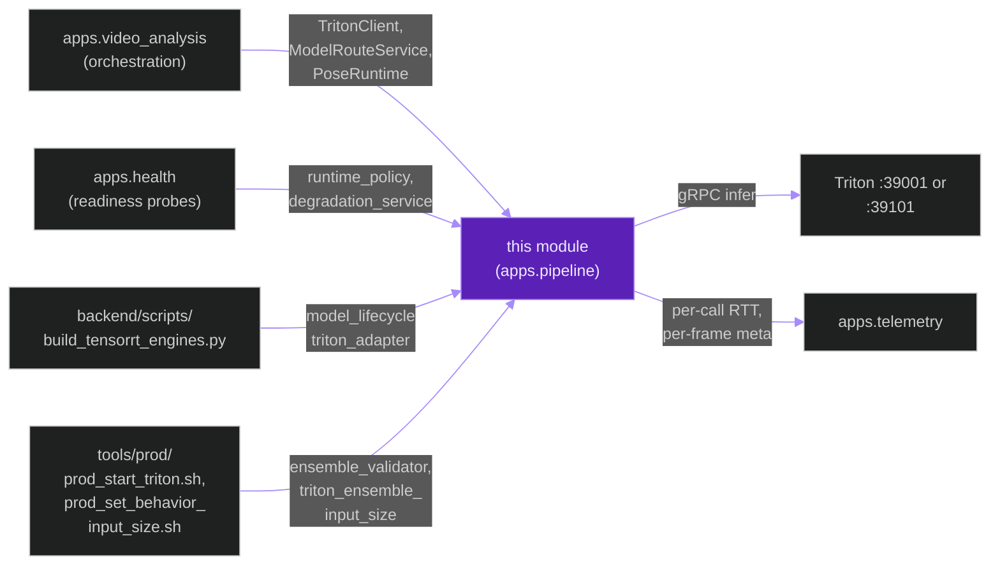
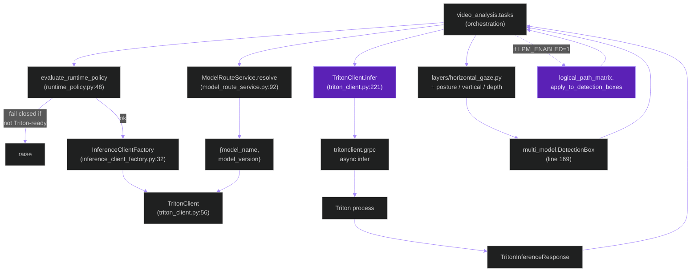
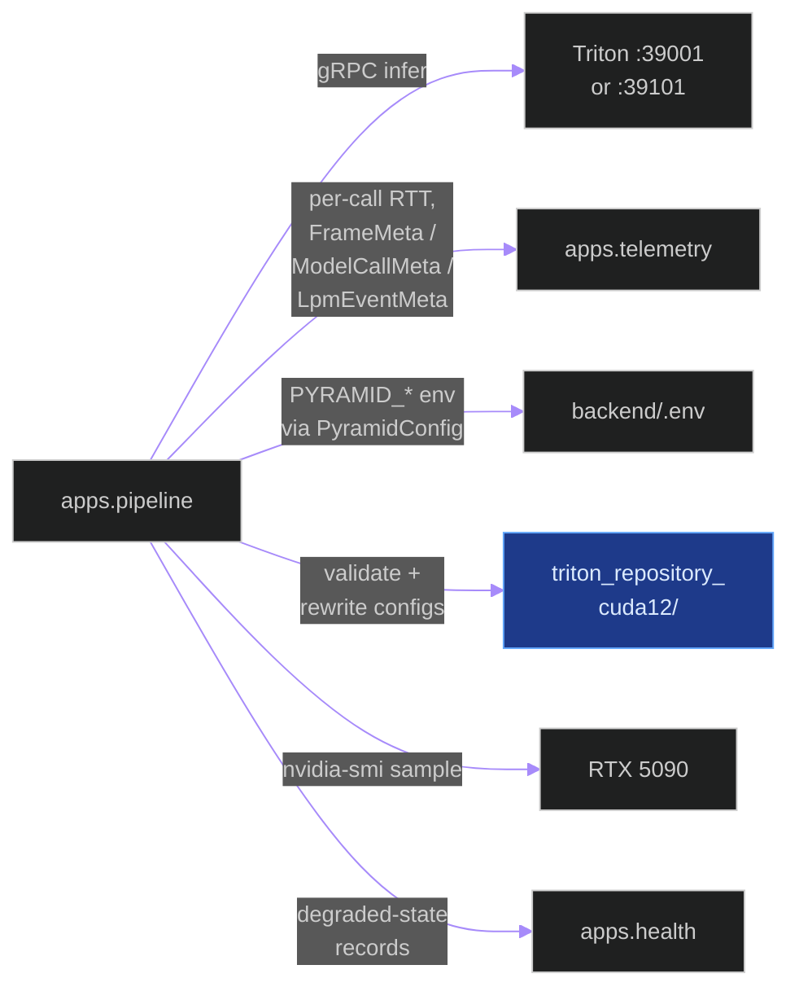
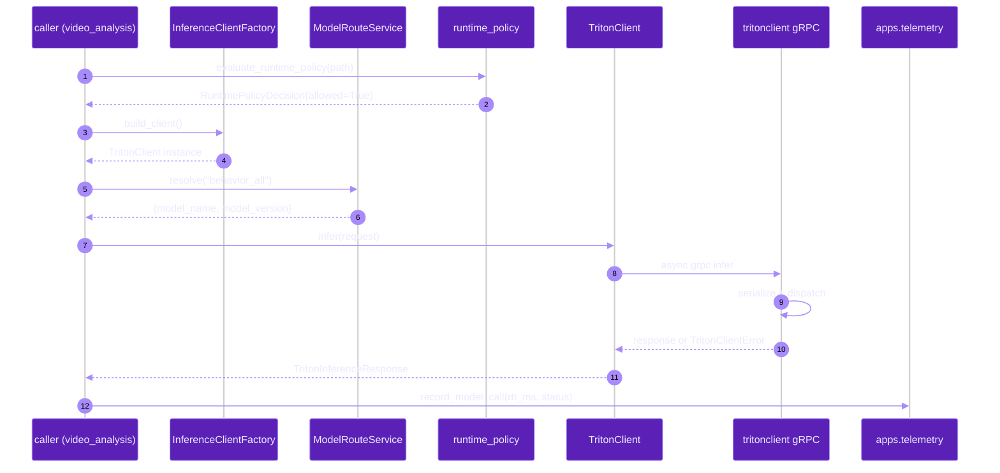
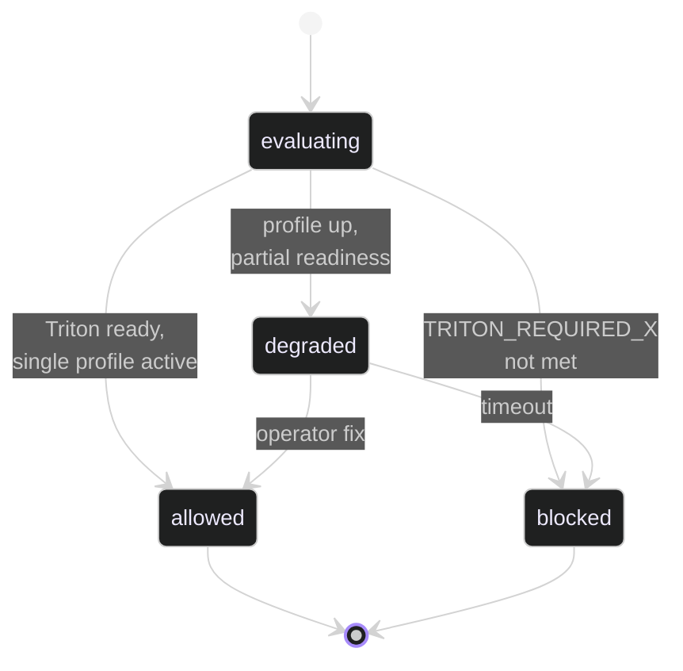

# `apps.pipeline`

**Last updated:** 2026-06-03
**Entity kind:** `module`
**Status:** `active`

> The shared inference infrastructure layer. Owns the `TritonClient`,
> `ModelRouteService`, `InferenceClientFactory`, `runtime_policy`
> fail-closed enforcement, the `ensemble_validator` shape-contract
> gate, the `logical_path_matrix` (LPM) constraint solver, the Cycle 11
> `triton_ensemble_input_size` rewriter, the `PoseRuntime` for RTMPose,
> and the `model_lifecycle` sub-package for build/export/benchmark
> orchestration. Every offline + live inference call goes through this
> module's services.

## Source-of-truth references

| Kind | Reference |
|---|---|
| File | `backend/apps/pipeline/__init__.py` |
| File | `backend/apps/pipeline/apps.py` |
| File | `backend/apps/pipeline/boundary.py` |
| File | `backend/apps/pipeline/config.py` |
| File | `backend/apps/pipeline/contracts.py` |
| File | `backend/apps/pipeline/pipeline_service.py` |
| File | `backend/apps/pipeline/detector.py` |
| File | `backend/apps/pipeline/multi_model.py` |
| File | `backend/apps/pipeline/cropper.py` |
| File | `backend/apps/pipeline/exporter.py` |
| File | `backend/apps/pipeline/inference_runtime.py` |
| File | `backend/apps/pipeline/audit_schema.py` |
| File | `backend/apps/pipeline/backpressure.py` |
| File | `backend/apps/pipeline/benchmark.py` |
| File | `backend/apps/pipeline/benchmark_integrity.py` |
| File | `backend/apps/pipeline/benchmark_statistics.py` |
| File | `backend/apps/pipeline/buffering.py` |
| File | `backend/apps/pipeline/drop_accounting.py` |
| File | `backend/apps/pipeline/evidence.py` |
| File | `backend/apps/pipeline/failure_injection.py` |
| File | `backend/apps/pipeline/gpu_telemetry.py` |
| File | `backend/apps/pipeline/latency_decomposition.py` |
| File | `backend/apps/pipeline/services/__init__.py` |
| File | `backend/apps/pipeline/services/base_inference_client.py` |
| File | `backend/apps/pipeline/services/triton_client.py` |
| File | `backend/apps/pipeline/services/model_route_service.py` |
| File | `backend/apps/pipeline/services/inference_client_factory.py` |
| File | `backend/apps/pipeline/services/runtime_policy.py` |
| File | `backend/apps/pipeline/services/ensemble_validator.py` |
| File | `backend/apps/pipeline/services/logical_path_matrix.py` |
| File | `backend/apps/pipeline/services/triton_ensemble_input_size.py` |
| File | `backend/apps/pipeline/services/pose_runtime.py` |
| File | `backend/apps/pipeline/services/rtmpose_pipeline.py` |
| File | `backend/apps/pipeline/services/degradation_service.py` |
| File | `backend/apps/pipeline/services/runtime_comparison.py` |
| File | `backend/apps/pipeline/services/runtime_payloads.py` |
| File | `backend/apps/pipeline/services/profile_promotion.py` |
| File | `backend/apps/pipeline/services/rollout_execution.py` |
| File | `backend/apps/pipeline/layers/base_behavior.py` |
| File | `backend/apps/pipeline/layers/posture.py` |
| File | `backend/apps/pipeline/layers/horizontal_gaze.py` |
| File | `backend/apps/pipeline/layers/vertical_gaze.py` |
| File | `backend/apps/pipeline/layers/depth_gaze.py` |
| File | `backend/apps/pipeline/model_lifecycle/triton_adapter.py` |
| File | `backend/apps/pipeline/model_lifecycle/benchmark_orchestrator.py` |
| File | `backend/apps/pipeline/model_lifecycle/export_orchestrator.py` |
| File | `backend/apps/pipeline/model_lifecycle/inventory.py` |
| File | `backend/apps/pipeline/model_lifecycle/deployment_matrix.py` |
| File | `backend/apps/pipeline/model_lifecycle/rtmpose_manifest.py` |
| File | `backend/apps/pipeline/README.md` |
| File | `backend/apps/pipeline/layers/README.md` |
| File | `backend/apps/pipeline/model_lifecycle/README.md` |
| File | `backend/tests/unit/pipeline/` (40+ test files) |
| Symbol | `apps.pipeline.services.triton_client.TritonClient` (line 56) |
| Symbol | `apps.pipeline.services.triton_client.TritonClientError` (line 52) |
| Symbol | `apps.pipeline.services.triton_client.TritonClient.infer` (line 221) |
| Symbol | `apps.pipeline.services.base_inference_client.BaseInferenceClient` (line 17) |
| Symbol | `apps.pipeline.services.model_route_service.ModelRouteService` (line 58) |
| Symbol | `apps.pipeline.services.model_route_service.ModelRouteService.resolve` (line 92) |
| Symbol | `apps.pipeline.services.inference_client_factory.InferenceClientFactory` (line 32) |
| Symbol | `apps.pipeline.services.runtime_policy.RuntimePolicyDecision` (line 23) |
| Symbol | `apps.pipeline.services.runtime_policy.evaluate_runtime_policy` (line 48) |
| Symbol | `apps.pipeline.services.ensemble_validator.validate_behavior_ensemble_repository` |
| Symbol | `apps.pipeline.services.logical_path_matrix.apply` |
| Symbol | `apps.pipeline.services.logical_path_matrix.apply_to_detection_boxes` |
| Symbol | `apps.pipeline.services.triton_ensemble_input_size.rewrite_repository` |
| Symbol | `apps.pipeline.services.pose_runtime.PoseRuntime` (line 27) |
| Symbol | `apps.pipeline.services.pose_runtime.PoseRuntimeResult` (line 20) |
| Symbol | `apps.pipeline.services.degradation_service.DegradationService` (line 88) |
| Symbol | `apps.pipeline.detector.PersonDetector` (line 72) |
| Symbol | `apps.pipeline.detector.suppress_duplicate_detections` (line 50) |
| Symbol | `apps.pipeline.pipeline_service.PipelineService` (line 22) |
| Symbol | `apps.pipeline.multi_model.DetectionBox` (line 169) |
| Symbol | `apps.pipeline.multi_model.FrameDetections` (line 181) |
| Symbol | `apps.pipeline.multi_model.FrameBatchQueueConfig` (line 189) |
| Symbol | `apps.pipeline.multi_model.guard_cross_model_person_duplicates` (line 151) |
| Commit | `69882eea` (current HEAD) |
| Commit | `e24f9514` (DSP Cycle 3 1/N — sibling `apps.video_analysis` doc) |
| Workflow | `.github/workflows/inference-parallelization.yml` |
| Workflow | `.github/workflows/mermaid-diagrams.yml` |
| Doc | `docs/entity/systems/triton_inference_plane.md` |
| Doc | `docs/entity/systems/offline_inference_pipeline.md` |
| Doc | `docs/logical_path_matrix_spec.md` |
| Doc | `backend/apps/pipeline/README.md` |

## 1. Purpose and scope

This module is the shared inference infrastructure for both the
offline and live pipelines. It owns:

- **The single gRPC entry point to Triton**: `TritonClient.infer`
  (`triton_client.py:221`) wraps `tritonclient.grpc` with timeout
  policy, retries, and per-call telemetry hooks. Every inference
  call across the system funnels through here.
- **Logical-name routing**: `ModelRouteService.resolve` (`model_route_service.py:92`)
  maps logical task keys (`behavior_all`, `person_detection`,
  `gaze_horizontal`, etc.) to deployed Triton model names. Reads
  `MODEL_ROUTE_*` env overrides so route swaps (e.g., Cycle 9b
  Top-K) are an env flip not a code change.
- **Client factory + runtime policy**: `InferenceClientFactory`
  picks the right client per `INFERENCE_STRATEGY`; `evaluate_runtime_policy`
  enforces single-active-profile + fail-closed semantics.
- **Ensemble shape-contract gate**: `validate_behavior_ensemble_repository`
  runs at Triton start, validates every base / slice / topk
  config against the active `TRITON_CROP_BEHAVIOR_INPUT_SIZE`.
- **LPM constraint solver**: `logical_path_matrix.apply` — pure-
  function C1–C4 contradiction resolver (Cycle 10, currently
  `LPM_ENABLED=0`).
- **Cycle 11 ensemble-input rewriter**: `triton_ensemble_input_size.rewrite_repository`
  pure-Python rewriter for the 6 ensemble `images` input dims.
- **Pose runtime**: `PoseRuntime` (RTMPose dispatch + per-keypoint
  quality scoring).
- **`PersonDetector` + `PipelineService`**: legacy top-level helpers
  used by the dev / hybrid path and by `multi_model.py` data classes
  (`DetectionBox`, `FrameDetections`, `FrameBatchQueueConfig`) that
  every dispatch path imports.
- **`model_lifecycle/` sub-package**: TensorRT build / export /
  benchmark orchestration + Triton-adapter generation +
  deployment-matrix bookkeeping.
- **`layers/` sub-package**: per-behavior-model layer adapters
  (posture, horizontal_gaze, vertical_gaze, depth_gaze).
- **`backpressure.py` + `drop_accounting.py` + `latency_decomposition.py`**:
  observability + flow-control instrumentation used by both pipelines.

It does NOT own Celery orchestration (that lives in
`apps.video_analysis`), tracking (that lives in `apps.tracking`), or
telemetry persistence (`apps.telemetry`). It is consumed by all three
plus by the live `apps.sessions` task dispatcher.

## 2. Position in the system

## 3. Internal structure

### Top-level files

| Path | Role |
|---|---|
| `apps.py` | Django AppConfig — registers signals + boundary hooks. |
| `boundary.py` | Cross-module import declarations enforced by `backend/core/boundaries.py`. |
| `config.py` | Pydantic-validated `PyramidConfig` reading every `PYRAMID_*` env var; central env-truth for the module. |
| `contracts.py` | Versioned data contracts (dataclasses) for inference inputs / outputs. |
| `pipeline_service.py` | `PipelineService` (line 22) — legacy top-level dev pipeline driver; production calls go through `apps.video_analysis.tasks` instead. |
| `detector.py` | `PersonDetector` (line 72) + `suppress_duplicate_detections` (line 50) + `_bbox_iou` (line 30). |
| `multi_model.py` | Shared dataclasses: `DetectionBox` (169), `FrameDetections` (181), `FrameBatchQueueConfig` (189). `guard_cross_model_person_duplicates` (151). |
| `cropper.py` | Per-detection crop extraction. |
| `exporter.py` | Local export helpers (dev only). |
| `inference_runtime.py` | Hybrid runtime helper (dev only). |
| `audit_schema.py` | `inference_audit.json` schema versioning. |
| `backpressure.py` | SLO-aware backpressure policy. |
| `benchmark.py` + `benchmark_integrity.py` + `benchmark_statistics.py` | Per-run benchmark helpers used by `tools/prod/prod_run_parallel_flow_benchmark.sh`. |
| `buffering.py` | Frame ring-buffer for the threaded decoder. |
| `drop_accounting.py` | Per-stage drop counter for fail-closed accounting (constitution § 17.3). |
| `evidence.py` | Per-cycle evidence helpers. |
| `failure_injection.py` | Dev/test fault-injection hooks. |
| `gpu_telemetry.py` | GPU utilisation sampler. |
| `latency_decomposition.py` | Per-call latency breakdown used by RTT probes. |

### Services sub-package (`services/`)

| Path | Role |
|---|---|
| `base_inference_client.py` | `BaseInferenceClient` (17) — abstract base shared by `TritonClient` and any dev adapter. |
| `triton_client.py` | `TritonClient` (56), `TritonClientError` (52), `TritonClient.infer` (221). The single gRPC entry. |
| `model_route_service.py` | `ModelRouteService` (58), `.resolve(task_key)` (92). Logical-name routing + `MODEL_ROUTE_*` env overrides. |
| `inference_client_factory.py` | `InferenceClientFactory` (32). Picks Triton vs dev adapter per `INFERENCE_STRATEGY`. |
| `runtime_policy.py` | `RuntimePolicyDecision` (23), `evaluate_runtime_policy(path)` (48). Single-active-profile + fail-closed enforcement. |
| `ensemble_validator.py` | `validate_behavior_ensemble_repository(...)` — shape-contract pre-start gate; supports `behavior_input_size=` for Cycle 11. |
| `logical_path_matrix.py` | Pure-function LPM solver (Cycle 10); `apply`, `apply_to_detection_boxes`, `estimate_head_yaw_deg`. |
| `triton_ensemble_input_size.py` | Cycle 11 rewriter (`rewrite_repository`); idempotent. |
| `pose_runtime.py` | `PoseRuntime` (27), `PoseRuntimeResult` (20) — RTMPose dispatch + per-frame keypoint quality. |
| `rtmpose_pipeline.py` | Lower-level RTMPose pre/post-process. |
| `degradation_service.py` | `DegradationService` (88) — records degraded runtime states for the health surface. |
| `runtime_comparison.py` | Side-by-side runtime comparison for benchmark reports. |
| `runtime_payloads.py` | Helpers to build `inference_audit.json` payloads. |
| `profile_promotion.py` | Endpoint-profile promotion (live ↔ offline switch). |
| `rollout_execution.py` | Per-rollout execution + reconciliation. |

### Layers sub-package (`layers/`)

Per-model decode + post-process adapters consumed by `multi_model.py`:

| File | Class | Role |
|---|---|---|
| `base_behavior.py` | `BaseBehaviorLayer` | Shared YOLO decode helpers. |
| `posture.py` | `PostureLayer` | 10-class posture decoding. |
| `horizontal_gaze.py` | `HorizontalGazeLayer` | 80-class legacy / 6-class slice / 6-class Top-K decode. |
| `vertical_gaze.py` | `VerticalGazeLayer` | 10-class vertical decode. |
| `depth_gaze.py` | `DepthGazeLayer` | 10-class depth decode. |

### Model lifecycle sub-package (`model_lifecycle/`)

| File | Role |
|---|---|
| `triton_adapter.py` | Generates Triton `config.pbtxt` for each rebuilt engine. |
| `benchmark_orchestrator.py` + `benchmark_runner.py` | Per-engine micro-benchmark driver. |
| `export_orchestrator.py` + `export_worker.py` | ONNX export pipeline (pre-TRT). |
| `inventory.py` | Tracks every built `.plan` + its TRT version. |
| `deployment_matrix.py` | (model × runtime × precision) deployment matrix. |
| `capabilities.py` | Per-engine capability declarations. |
| `explainability.py` + `visualizations.py` + `metrics.py` | Eval / reporting helpers. |
| `rtmpose_convert_openvino.py` + `rtmpose_convert_tensorrt.py` + `rtmpose_manifest.py` | RTMPose-specific export flows. |

## 4. Call graph (internal — one `behavior_all` infer)

## 5. External connections

## 6. API surface (external calls into this module)

| Interface | Schema | Caller |
|---|---|---|
| `TritonClient.infer(TritonInferenceRequest) -> TritonInferenceResponse` | request `model_name`, `model_version`, named inputs, requested outputs | `apps.video_analysis.tasks` (both Celery tasks) |
| `ModelRouteService.resolve(task_key: str) -> dict` | task keys: `behavior_all`, `person_detection`, `posture_detection`, `gaze_horizontal`, `gaze_vertical`, `gaze_depth`, `pose_estimation` | every pre-infer site |
| `evaluate_runtime_policy(path='offline' \| 'live') -> RuntimePolicyDecision` | path + optional rollout_key | every Celery task at start; `tools/prod/prod_runtime_preflight.sh` |
| `validate_behavior_ensemble_repository(repo, ensemble_name, gaze_horizontal_variant, behavior_top_k_enabled, behavior_top_k_value, behavior_input_size)` | repo path + ensemble + variant + flags | `tools/prod/prod_start_triton.sh`, `prod_enable_behavior_topk.sh` |
| `rewrite_repository(repo, new_size)` | repo path + target imgsz | `tools/prod/prod_set_behavior_input_size.sh` (Cycle 11) |
| `logical_path_matrix.apply(inputs, cfg) -> LpmBatchOutput` | LpmFrameInput list + LpmConfig | `apps.video_analysis.tasks._tel_record_lpm_event` (LPM-gated) |
| `PoseRuntime.run(crops) -> PoseRuntimeResult` | NxCxHxW float32 crops | `apps.video_analysis.tasks._run_triton_frame_level_inference` |
| `PersonDetector.detect(frame)` | single frame ndarray | `pipeline_service.PipelineService` (dev only) |

## 7. Dependencies

| Dependency | Role | Pin |
|---|---|---|
| `tritonclient` (gRPC + http) | Triton client | per requirements (aligned with TRT 10.16.1.11) |
| `pydantic` | `PyramidConfig` env validation | per requirements |
| `numpy` | tensor manipulation | per requirements |
| `opencv-python` | cropper, dev-path decode | per requirements |
| `Django` | AppConfig + settings access | 5.1.5 |
| `apps.telemetry` | per-call meta sink | internal |
| `apps.health` | degraded-state surface | internal |
| External: TensorRT runtime | engine load via Triton | 10.16.1.11 |

## 8. Environment variables read (via `PyramidConfig`)

Selection — full list in `config.py`. Most touched by ops:

| Variable | Effect |
|---|---|
| `INFERENCE_STRATEGY` | `triton_only` in prod; anything else fails closed |
| `TRITON_URL` / `TRITON_LIVE_URL` | per-endpoint base URL |
| `TRITON_TIMEOUT_MS` / `TRITON_MAX_TIMEOUT_MS` | per-request timeout caps |
| `TRITON_RETRY_ATTEMPTS` / `TRITON_RETRY_TIMEOUT_SCALE` | retry policy |
| `TRITON_REQUIRED_OFFLINE` / `TRITON_REQUIRED_LIVE` | prod readiness gates |
| `TRITON_ENFORCE_SINGLE_ACTIVE_MODE` | single-active-profile guard |
| `TRITON_BINARY_TENSORS` | binary gRPC tensors vs JSON |
| `TRITON_CONCURRENT_MODELS` | concurrent fan-out toggle |
| `MODEL_ROUTE_*` (every task_key) | logical-name route overrides |
| `PYRAMID_INFERENCE_BACKEND` | dev-only local backend selector |
| `PYRAMID_*_MODEL_PATH` / `*_MODEL_RUNTIME` | per-model artefact paths (dev only; prod uses Triton) |
| `PYRAMID_INFERENCE_AUDIT_ENABLED` / `*_LIVE_ENABLED` | per-frame audit JSON toggles |
| `LPM_ENABLED` + `LPM_LAMBDA_C1..C4` + `LPM_THETA_POSE_THRESHOLD_DEG` + `LPM_TAU_MARGIN` + `LPM_TAU_TEMPORAL_STRICT` + `LPM_DEBUG_LOG` | LPM solver knobs (currently all defaults; `LPM_ENABLED=0`) |

## 9. Sequence diagram (`TritonClient.infer` lifecycle)

## 10. State machine (`RuntimePolicyDecision`)

## 11. Failure modes

| Failure | Detection | Recovery |
|---|---|---|
| Triton endpoint not ready | `evaluate_runtime_policy` shadow precheck | task fails closed; operator runs `prod_start_triton.sh` |
| Both profiles reachable | `prod_triton_endpoint_policy.sh` + `TRITON_ENFORCE_SINGLE_ACTIVE_MODE=1` | operator stops the dark profile |
| Shape-contract drift (Cycle 11 mismatch) | `validate_behavior_ensemble_repository` at startup | operator runs `prod_set_behavior_input_size.sh --input-size <correct>` |
| `INVALID_ARGUMENT batch-size must be <= 32` | gRPC error from Triton | caller chunks at 32 (caller-side guard) |
| LPM solver returns unexpected ambiguity | `record_lpm_event` counters | currently `LPM_ENABLED=0` in prod (Phase 1 NOT ACCEPTED) |
| gRPC timeout | `TritonClientError` raised | configurable retries; persistent → operator inspects `triton.log` |
| TRT-manifest mismatch (wrong engines for installed TRT) | `prod_trt_guard.sh` inside `prod-rebuild-tensorrt-engines.sh` | rebuild engines for the installed TRT |

## 12. Performance characteristics

This module's overhead per `TritonClient.infer` call is dominated by
gRPC serialization + transport, not Python wrapper cost. From the
Cycle 9b Top-K probe (`docs/cycle_9b_child_critical_path_remeasure_topk_results.md`):

| Component | Mean (bs=17 probe) |
|---|---:|
| `behavior_ensemble_gaze_slice_topk` RTT | 63.59 ms |
| Server work | 30.13 ms |
| Transport (input upload + output download) | 33.46 ms |
| Per-crop GPU compute | ~0.94 ms/crop (constant across batch sizes) |
| Ensemble orchestration overhead | ~8.7 ms/call |

`ModelRouteService.resolve` is sub-millisecond (dict lookup + env
fallback). `evaluate_runtime_policy` is sub-millisecond on the cached
path; cold paths do a single Triton readiness probe (~5-15 ms).

## 13. Operational notes

- The `services/__init__.py` package init pulls in `PipelineService`
  which imports Django models — utilities under `services/` are not
  side-effect-free at import time. To use them from a script that
  doesn't bootstrap Django, import the specific submodule directly
  by path (as `tools/prod/prod_set_behavior_input_size.sh` does via
  `importlib.util.spec_from_file_location`).
- `model_lifecycle/triton_adapter.py` is the source of truth for
  auto-generated child `config.pbtxt` files. Hand-editing those
  files is forbidden — they get overwritten on next engine build.
- `layers/horizontal_gaze.py` is the decode site that handles the
  Cycle 9b variant matrix (`coco80` 84-channel / `slice` 6-channel
  / Top-K compact). Adding a new variant means updating both the
  layer AND `ensemble_validator.py`.
- `runtime_policy.py` is intentionally fail-closed in prod — there
  is no override env. Operators MUST run `prod_start_triton.sh`
  before any worker dispatch.

## 14. Historical diagrams

> Not applicable: no diagrams in this doc have been superseded yet.

## 15. Related entities

| Entity | Path | Relationship |
|---|---|---|
| Triton inference plane | `docs/entity/systems/triton_inference_plane.md` | system view; this module is its Python service layer |
| Offline / live pipelines | `docs/entity/systems/{offline,live}_*.md` | callers |
| `apps.video_analysis` | `docs/entity/modules/apps.video_analysis.md` | parent caller of every infer site |
| `apps.tracking` | `docs/entity/modules/apps.tracking.md` (planned) | post-decode consumer of `DetectionBox` / `FrameDetections` |
| `apps.telemetry` | `docs/entity/modules/apps.telemetry.md` (planned) | downstream of every infer call |
| `apps.health` | `docs/entity/modules/apps.health.md` (planned) | reads `degradation_service` state |
| `apps.behavior` | `docs/entity/modules/apps.behavior.md` (planned) | downstream consumer of decoded behavior outputs |
| `apps.contracts` | `docs/entity/modules/apps.contracts.md` (planned) | versioned data-contract publisher |
| `triton_client.py` code | `docs/entity/code/apps.pipeline.services.triton_client.md` (planned DSP Cycle 6) | hot file |
| `ensemble_validator.py` code | `docs/entity/code/apps.pipeline.services.ensemble_validator.md` (planned DSP Cycle 6) | hot file |
| `logical_path_matrix.py` code | `docs/entity/code/apps.pipeline.services.logical_path_matrix.md` (planned DSP Cycle 6) | hot file (currently `LPM_ENABLED=0`) |
| `triton_ensemble_input_size.py` code | `docs/entity/code/apps.pipeline.services.triton_ensemble_input_size.md` (planned DSP Cycle 6) | Cycle 11 rewriter |

## 16. Open questions

- **Q1.** Should `services/__init__.py` lazy-load `PipelineService`? Currently every script importing `apps.pipeline.services.<x>` pays the Django bootstrap cost. Affects script invocation patterns (Cycle 11 `prod_set_behavior_input_size.sh` already works around this). *Owner:* module maintainer. *Target close:* DSP Cycle 6 code-level doc for `triton_client.py`.
- **Q2.** `pipeline_service.PipelineService` (dev-only) — should it be removed now that production never uses it? *Owner:* module maintainer. *Target close:* during DSP Cycle 5 script audit (when we audit the dev-only multi_model path).

## 17. Change log

| Date | What changed | Commit |
|---|---|---|
| 2026-06-03 | First version landed under DSP Cycle 3 (2 of ~18 modules). All 5 diagrams verified locally with `mmdc` per constitution § 19.3.1 before push. | (this commit) |
