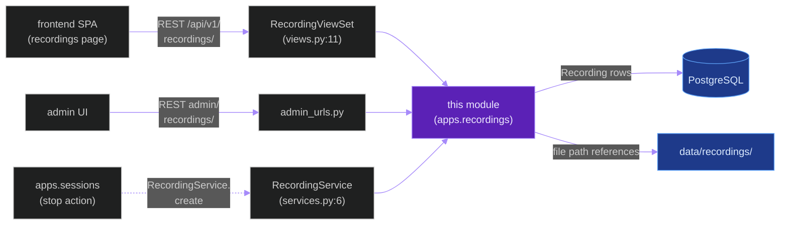
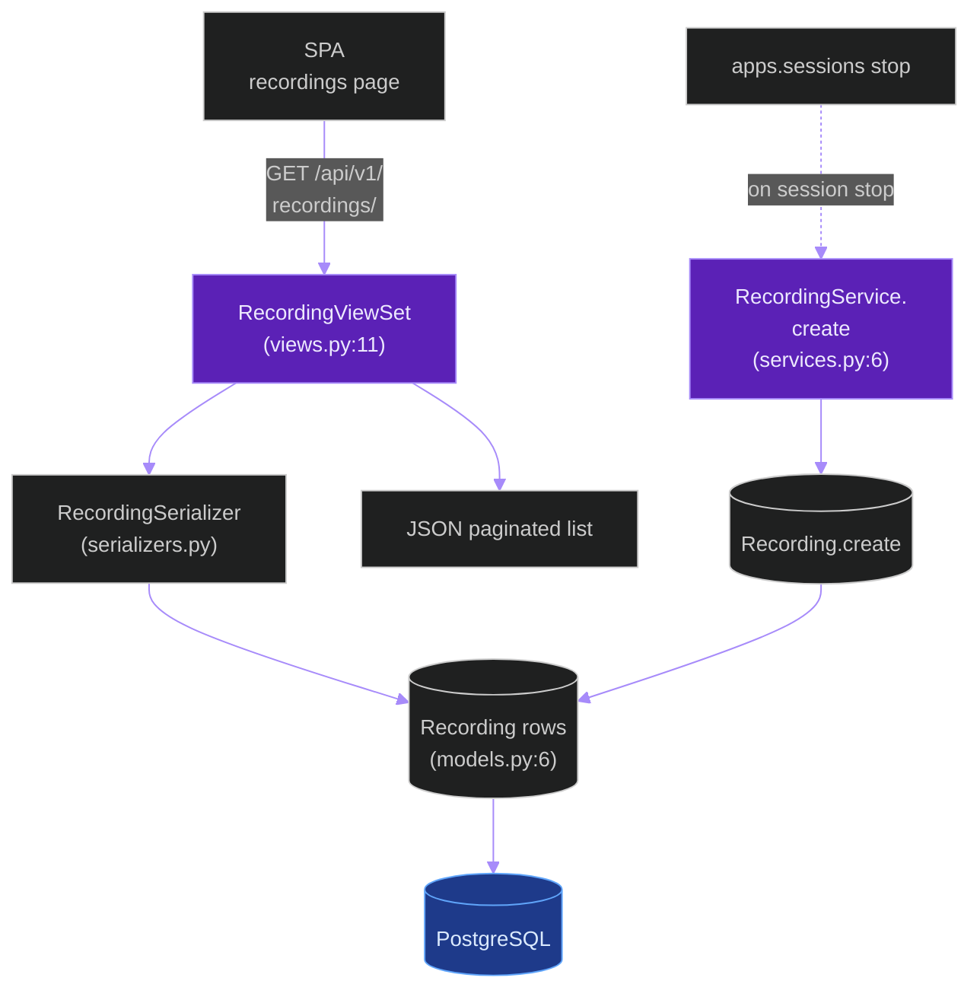
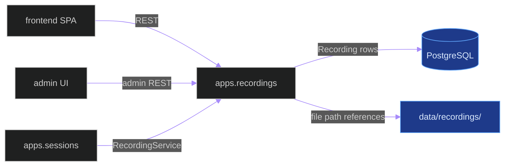
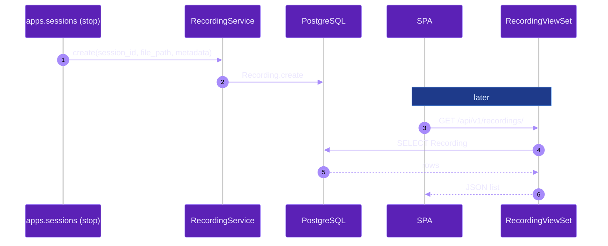

# `apps.recordings`

**Last updated:** 2026-06-03
**Entity kind:** `module`
**Status:** `active`

> Django app for monitoring-session recording metadata + retrieval.
> Owns the `Recording` model, `RecordingViewSet` (full DRF CRUD),
> and the `RecordingService` operator. A small companion app to
> `apps.sessions` — recordings track persisted videos that result
> from completed monitoring sessions.

## Source-of-truth references

| Kind | Reference |
|---|---|
| File | `backend/apps/recordings/__init__.py` |
| File | `backend/apps/recordings/apps.py` |
| File | `backend/apps/recordings/admin_urls.py` |
| File | `backend/apps/recordings/boundary.py` |
| File | `backend/apps/recordings/models.py` |
| File | `backend/apps/recordings/serializers.py` |
| File | `backend/apps/recordings/services.py` |
| File | `backend/apps/recordings/urls.py` |
| File | `backend/apps/recordings/views.py` |
| File | `backend/apps/recordings/migrations/0001_initial.py` |
| Symbol | `apps.recordings.models.Recording` (models.py:6) |
| Symbol | `apps.recordings.views.RecordingViewSet` (views.py:11) |
| Symbol | `apps.recordings.services.RecordingService` (services.py:6) |
| Commit | `401dc538` (DSP Cycle 3 13/N — sibling `apps.audit`) |
| Workflow | `.github/workflows/inference-parallelization.yml` |
| Workflow | `.github/workflows/mermaid-diagrams.yml` |

## 1. Purpose and scope

This module is a thin CRUD layer over the `Recording` ORM model.
It owns:

- **1 ORM model** (`models.py:6`): `Recording` — metadata for a
  persisted video file resulting from a completed monitoring session.
- **`RecordingViewSet`** (`views.py:11`) — full DRF ModelViewSet
  with list / retrieve / create / update / partial / destroy.
- **`RecordingService`** (`services.py:6`) — programmatic operator
  for create / delete from non-REST code paths.
- **2 URL surfaces**: `urls.py` (DRF router) + `admin_urls.py`.
- **1 migration**: `0001_initial.py`.

It does NOT do video recording (that is a recording-pipeline concern
handled at the camera-bridge / live-task level). It is the database
+ REST surface for *metadata* of recordings.

## 2. Position in the system

## 3. Internal structure

| Path | Role |
|---|---|
| `apps.py` | Django AppConfig. |
| `boundary.py` | Cross-module import declarations. |
| `models.py` | `Recording` (6). |
| `views.py` | `RecordingViewSet` (11) DRF ModelViewSet. |
| `serializers.py` | `RecordingSerializer` (uses `governed_fields`). |
| `services.py` | `RecordingService` (6). |
| `urls.py` | DRF router (`urls.py:7` registers ViewSet). |
| `admin_urls.py` | admin paths. |
| `migrations/0001_initial.py` | First migration. |

## 4. Call graph (SPA browses recordings)

## 5. External connections

## 6. API surface

### REST

| Method + path | Handler |
|---|---|
| `GET/POST/PUT/PATCH /api/v1/recordings/` (+ detail; full DRF CRUD) | `RecordingViewSet` (views.py:11) |
| `*/api/v1/admin/recordings/*` | admin_urls.py paths |

### Python API

| Function | Caller |
|---|---|
| `RecordingService.create(...)` (services.py:6) | `apps.sessions` on session stop |

## 7. Dependencies

| Dependency | Role | Pin |
|---|---|---|
| `Django + DRF` | ORM + REST | 5.1.5 / 3.15.2 |
| `apps.sessions` | upstream caller (recording per session) | internal (reverse) |
| `apps.contracts` | `governed_fields` for serializer | internal |

## 8. Environment variables read

| Variable | Effect |
|---|---|
| Standard DB env (`POSTGRES_*`) | ORM persistence |
| (no module-specific env vars) | — |

## 9. Sequence diagram (session stops → recording is created → SPA browses)

## 10. State machine

> Not applicable: `Recording` is a simple metadata row without
> lifecycle transitions in the current implementation.

## 11. Failure modes

| Failure | Detection | Recovery |
|---|---|---|
| Underlying file deleted while row exists | client GET returns 200 but file missing on disk | retention sweeper deletes the row OR operator removes orphaned row |
| `RecordingService.create` called with non-existent path | validator rejects | caller bug; fix |
| Concurrent CRUD races | Django ORM transactional defaults | minimal risk per-row |

## 12. Performance characteristics

Pure CRUD — sub-millisecond for typical recording counts. Not a
hot-path module.

## 13. Operational notes

- Recording **files** themselves live under `data/recordings/`; this
  module owns only the row metadata.
- Retention is the operator's responsibility — there is no built-in
  TTL sweeper.

## 14. Historical diagrams

> Not applicable: no diagrams in this doc have been superseded yet.

## 15. Related entities

| Entity | Path | Relationship |
|---|---|---|
| `apps.sessions` | `docs/entity/modules/apps.sessions.md` | upstream creator on session stop |
| `apps.exports` | `docs/entity/modules/apps.exports.md` (planned) | sibling app for per-session exports |
| Frontend SPA | `docs/entity/systems/frontend_spa.md` | recordings list page |

## 16. Open questions

- **Q1.** Should there be a Celery beat sweeper for orphaned `Recording` rows (file deleted, row remains)? *Owner:* operations maintainer. *Target close:* next retention pass.

## 17. Change log

| Date | What changed | Commit |
|---|---|---|
| 2026-06-03 | First version landed under DSP Cycle 3 (14 of ~18 modules). All 4 diagrams verified locally with `mmdc` per constitution § 19.3.1 before push. | (this commit) |
