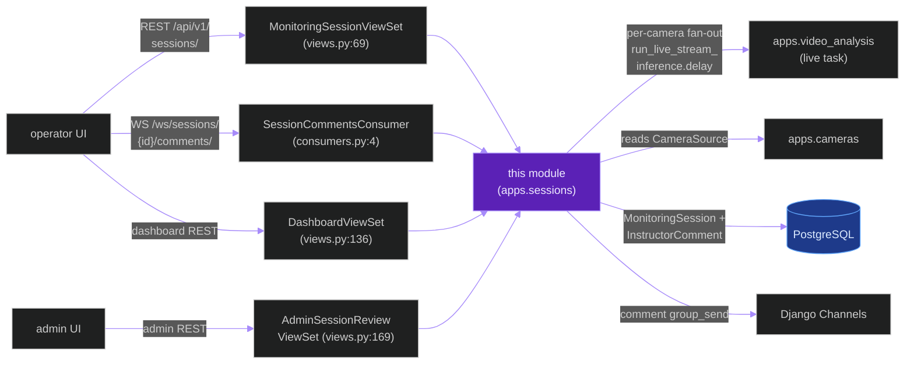
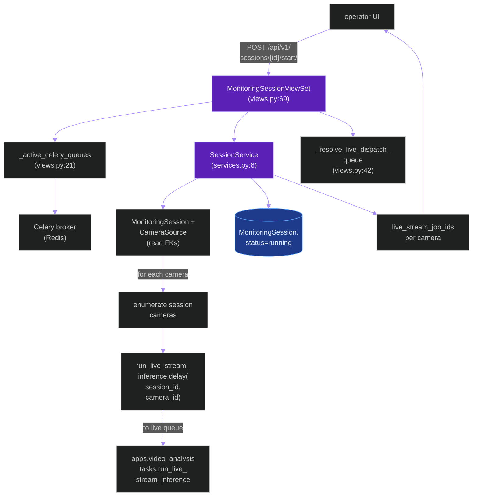
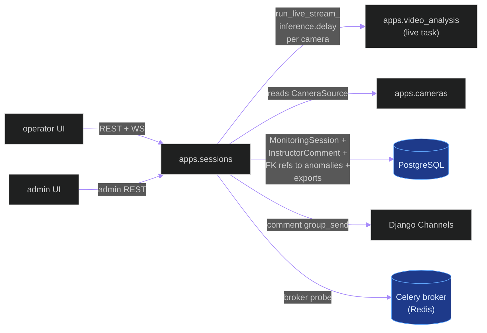
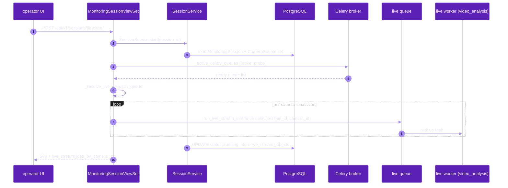
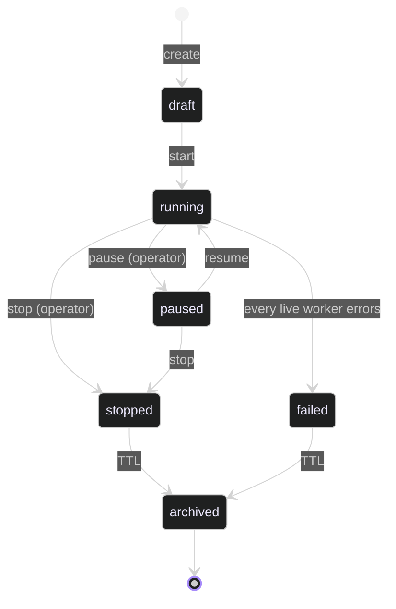

# `apps.sessions`

**Last updated:** 2026-06-03
**Entity kind:** `module`
**Status:** `active`

> Django app for monitoring-session lifecycle: REST surface for
> create / start / stop / list, the `MonitoringSession` +
> `InstructorComment` models, three ViewSets (operator + dashboard +
> admin-review), the `SessionCommentsConsumer` WebSocket, and the
> `live_dispatch_queue` resolver that fans out one
> `run_live_stream_inference` Celery task per session-camera pair.

## Source-of-truth references

| Kind | Reference |
|---|---|
| File | `backend/apps/sessions/__init__.py` |
| File | `backend/apps/sessions/apps.py` |
| File | `backend/apps/sessions/admin_urls.py` |
| File | `backend/apps/sessions/boundary.py` |
| File | `backend/apps/sessions/consumers.py` |
| File | `backend/apps/sessions/dashboard_urls.py` |
| File | `backend/apps/sessions/models.py` |
| File | `backend/apps/sessions/routing.py` |
| File | `backend/apps/sessions/serializers.py` |
| File | `backend/apps/sessions/services.py` |
| File | `backend/apps/sessions/urls.py` |
| File | `backend/apps/sessions/views.py` |
| File | `backend/apps/sessions/migrations/0001_initial.py` |
| File | `backend/apps/sessions/README.md` |
| Symbol | `apps.sessions.models.MonitoringSession` (models.py:6) |
| Symbol | `apps.sessions.models.InstructorComment` (models.py:22) |
| Symbol | `apps.sessions.views._active_celery_queues` (views.py:21) |
| Symbol | `apps.sessions.views._resolve_live_dispatch_queue` (views.py:42) |
| Symbol | `apps.sessions.views.MonitoringSessionViewSet` (views.py:69) |
| Symbol | `apps.sessions.views.InstructorCommentViewSet` (views.py:120) |
| Symbol | `apps.sessions.views.DashboardViewSet` (views.py:136) |
| Symbol | `apps.sessions.views.AdminSessionReviewViewSet` (views.py:169) |
| Symbol | `apps.sessions.consumers.SessionCommentsConsumer` (consumers.py:4) |
| Symbol | `apps.sessions.services.SessionService` (services.py:6) |
| Commit | `e49a9735` (DSP Cycle 3 7/N — sibling `apps.anomalies`) |
| Workflow | `.github/workflows/inference-parallelization.yml` |
| Workflow | `.github/workflows/mermaid-diagrams.yml` |
| Doc | `docs/entity/systems/live_streaming_pipeline.md` (downstream task dispatch) |
| Doc | `docs/entity/modules/apps.video_analysis.md` (`run_live_stream_inference` callee) |
| Doc | `docs/entity/modules/apps.cameras.md` (`CameraSource` FK source) |
| Doc | `backend/apps/sessions/README.md` |

## 1. Purpose and scope

This module owns the monitoring-session lifecycle. Concretely:

- **2 Django models** (`models.py`): `MonitoringSession` (6) — the
  per-classroom monitoring run — and `InstructorComment` (22) — the
  per-instructor note on a session.
- **4 DRF ViewSets** (`views.py`):
  `MonitoringSessionViewSet` (69) for operator CRUD + start/stop
  actions, `InstructorCommentViewSet` (120),
  `DashboardViewSet` (136) for the dashboard summary endpoint,
  `AdminSessionReviewViewSet` (169) for admin read-only review.
- **Live-task dispatch helpers** (`views.py`):
  `_active_celery_queues` (21) probes the broker for ready queues,
  `_resolve_live_dispatch_queue` (42) picks the right live queue
  name. The start action then fires one
  `apps.video_analysis.tasks.run_live_stream_inference.delay(...)`
  per camera (this call is in `views.py:91` per the
  `live_streaming_pipeline` system doc).
- **`SessionService`** (`services.py:6`) — higher-level operator
  for session lifecycle transitions.
- **`SessionCommentsConsumer`** (`consumers.py:4`) — WebSocket
  consumer for `ws/sessions/{session_id}/comments/`.
- **URL surfaces**: `urls.py` (operator REST router + nested
  comments + nested exports), `dashboard_urls.py` (dashboard +
  admin anomaly/activity feeds), `admin_urls.py` (admin review).

It does NOT do inference, tracking, or anomaly evaluation. It is
the **dispatcher** that decides which sessions get a live-pipeline
worker; the worker itself lives in `apps.video_analysis.tasks`.

## 2. Position in the system

## 3. Internal structure

| Path | Role |
|---|---|
| `apps.py` | Django AppConfig — registers signals. |
| `boundary.py` | Cross-module import declarations. |
| `models.py` | `MonitoringSession` (6) + `InstructorComment` (22). |
| `views.py` | 4 ViewSets + 2 helper functions for live-queue resolution. |
| `consumers.py` | `SessionCommentsConsumer` (4) for live comment push. |
| `routing.py` | One Channels route: `ws/sessions/{session_id}/comments/`. |
| `serializers.py` | DRF serializers for the 4 ViewSets. |
| `services.py` | `SessionService` (6). |
| `urls.py` | DRF router for sessions + nested comments + nested exports include. |
| `dashboard_urls.py` | Dashboard summary + admin feeds (anomaly + activity). |
| `admin_urls.py` | Admin session review paths. |
| `migrations/0001_initial.py` | First tables. |

## 4. Call graph (operator starts session → live tasks fan out)

## 5. External connections

## 6. API surface (external calls into this module)

### REST (from `urls.py` + `dashboard_urls.py` + `admin_urls.py`)

| Method + path | Handler |
|---|---|
| `GET/POST/PUT/PATCH /api/v1/sessions/` (+ detail) | `MonitoringSessionViewSet` (views.py:69) |
| `POST /api/v1/sessions/{id}/start/` | `MonitoringSessionViewSet.start` action |
| `POST /api/v1/sessions/{id}/stop/` | `MonitoringSessionViewSet.stop` action |
| `GET/POST /api/v1/sessions/{session_id}/comments/` | `InstructorCommentViewSet` (views.py:120) via nested route in `urls.py:12` |
| `*/api/v1/sessions/{session_id}/export/*` | included from `apps.exports.urls` via `urls.py:14` |
| `GET /api/v1/dashboard/` | `DashboardViewSet` (views.py:136) |
| `GET /api/v1/dashboard/admin/anomaly-feed/` | `AdminAnomalyFeedViewSet` (from `apps.anomalies`) |
| `GET /api/v1/dashboard/admin/activity-feed/` | `AuditLogViewSet` (from `apps.audit`) |
| `GET /api/v1/admin/sessions/` | `AdminSessionReviewViewSet.list` (views.py:169) |
| `GET /api/v1/admin/sessions/{pk}/` | `AdminSessionReviewViewSet.retrieve` |
| `GET /api/v1/admin/sessions/{pk}/review/` | `AdminSessionReviewViewSet.review` action |

### WebSocket (from `routing.py`)

| Path | Consumer | Events |
|---|---|---|
| `ws/sessions/{session_id}/comments/` | `SessionCommentsConsumer` (consumers.py:4) | per-session comment push |

### Celery tasks dispatched (NOT defined here)

| Task | Where defined | Triggered by |
|---|---|---|
| `apps.video_analysis.tasks.run_live_stream_inference(session_id, camera_id, ...)` | `apps.video_analysis.tasks` | `MonitoringSessionViewSet.start` (per camera fan-out) |

## 7. Dependencies

| Dependency | Role | Pin |
|---|---|---|
| `Django + DRF + Channels` | model + view + serializers + WS | 5.1.5 / 3.15.2 / 4.2.2 |
| `apps.cameras` | reads `CameraSource` for session-start fan-out | internal |
| `apps.video_analysis` | dispatches `run_live_stream_inference` | internal |
| `apps.exports` | nested URL include for per-session exports | internal |
| `apps.anomalies` | dashboard admin anomaly-feed view | internal |
| `apps.audit` | dashboard admin activity-feed view | internal |
| `Celery` | broker probe + task delay | 5.4.0 |
| `redis-py` | Channels layer + Celery broker | per requirements |

## 8. Environment variables read

| Variable | Effect |
|---|---|
| `CELERY_BROKER_URL` | `_active_celery_queues` probes this for queue readiness |
| `REDIS_URL` | Channels layer + Celery broker |
| `LIVE_CONTROL_QUEUE_NAME` (per `backend/config/celery.py`) | resolved by `_resolve_live_dispatch_queue` to pick the live-task queue |
| Standard DB env (`POSTGRES_*`) | ORM persistence |

## 9. Sequence diagram (operator starts session)

## 10. State machine (`MonitoringSession.status`)

## 11. Failure modes

| Failure | Detection | Recovery |
|---|---|---|
| No camera assigned to session at start | view rejects with 400 | operator adds at least one camera |
| Celery broker unreachable | `_active_celery_queues` returns empty | view rejects with 503; operator restarts broker |
| Live queue not bound to any worker | `_resolve_live_dispatch_queue` returns no match | view rejects; operator runs `tools/prod/prod_start_celery_workers.sh` |
| One live worker dies mid-session | upstream task transitions to `failed_runtime` (per `live_streaming_pipeline`) | session stays `running` for other cameras; admin can stop |
| Comment WS disconnects | Channels frees group | client reconnects via `useWebSocket` backoff |

## 12. Performance characteristics

This module is dispatch-only — it does not sit on the per-frame
inference critical path. Per-start latency is dominated by the
broker probe + per-camera `delay()` call, both sub-millisecond on
Redis.

## 13. Operational notes

- Live workers MUST be running on the queue that
  `_resolve_live_dispatch_queue` selects, or session start fails
  fast. The active-queue policy lives in
  `backend/config/celery.py:36`.
- Dashboard endpoints aggregate from `apps.anomalies` +
  `apps.audit`; if either is degraded, those tiles show fallbacks.
- The nested `/sessions/{id}/export/` include is the canonical
  per-session export entry; `apps.exports` owns the actual export
  generation.

## 14. Historical diagrams

> Not applicable: no diagrams in this doc have been superseded yet.

## 15. Related entities

| Entity | Path | Relationship |
|---|---|---|
| Live streaming pipeline | `docs/entity/systems/live_streaming_pipeline.md` | system this module's start action dispatches |
| `apps.video_analysis` | `docs/entity/modules/apps.video_analysis.md` | callee — runs the live inference task we fan out |
| `apps.cameras` | `docs/entity/modules/apps.cameras.md` | FK source for `CameraSource` |
| `apps.anomalies` | `docs/entity/modules/apps.anomalies.md` | dashboard anomaly feed reader |
| `apps.audit` | `docs/entity/modules/apps.audit.md` (planned) | dashboard activity feed reader |
| `apps.exports` | `docs/entity/modules/apps.exports.md` (planned) | nested URL include for per-session exports |
| Frontend SPA | `docs/entity/systems/frontend_spa.md` | REST + WS consumer (sessions list / detail page) |
| `views.py` code | `docs/entity/code/apps.sessions.views.md` (planned DSP Cycle 6) | hot file with dispatch helpers |

## 16. Open questions

- **Q1.** Should `_resolve_live_dispatch_queue` cache the broker probe (currently does it per start)? Affects start latency under broker load. *Owner:* module maintainer. *Target close:* DSP Cycle 6 code-level doc.
- **Q2.** Session FK from anomalies / detections / video_analysis all reference this app's `MonitoringSession.id` — is the cross-app FK chain documented somewhere (currently spread across docs)? *Owner:* DSP Cycle 3 reviewer when the cross-app ERD is added. *Target close:* DSP Cycle 7 API surface docs.

## 17. Change log

| Date | What changed | Commit |
|---|---|---|
| 2026-06-03 | First version landed under DSP Cycle 3 (8 of ~18 modules). All 5 diagrams verified locally with `mmdc` per constitution § 19.3.1 before push. | (this commit) |
