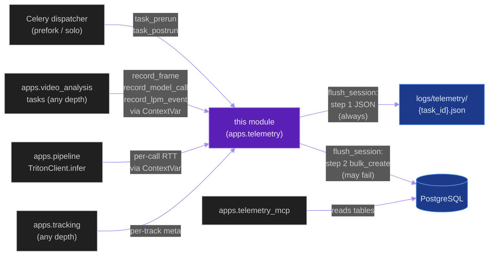
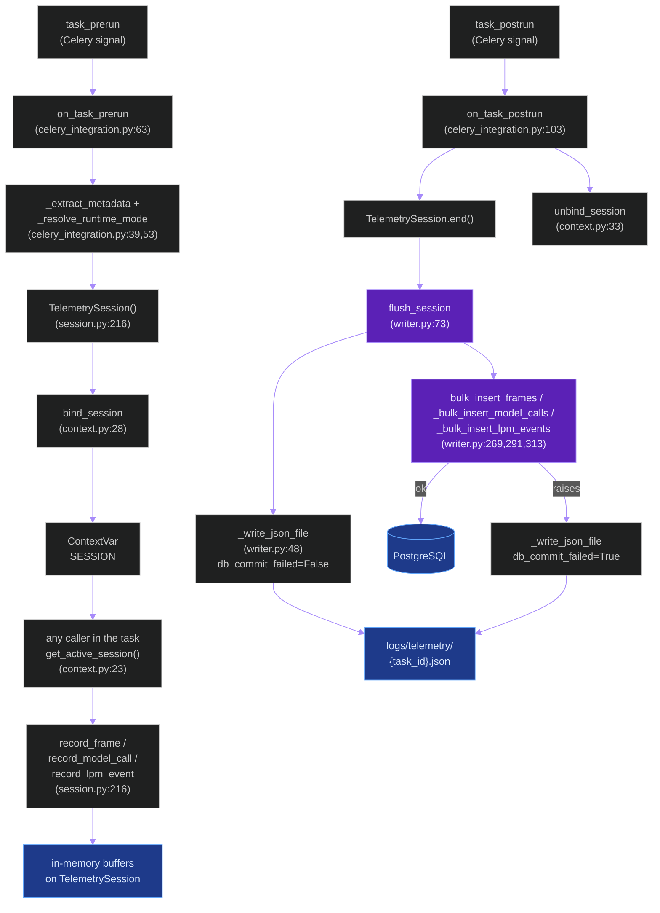
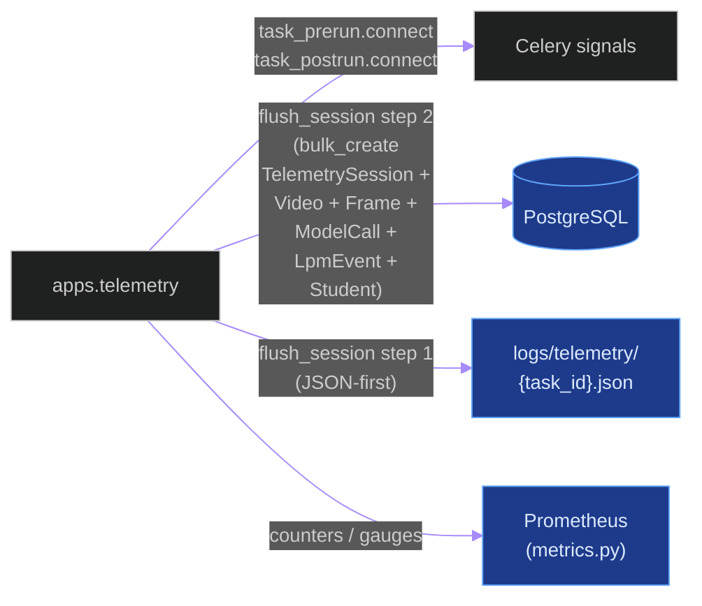
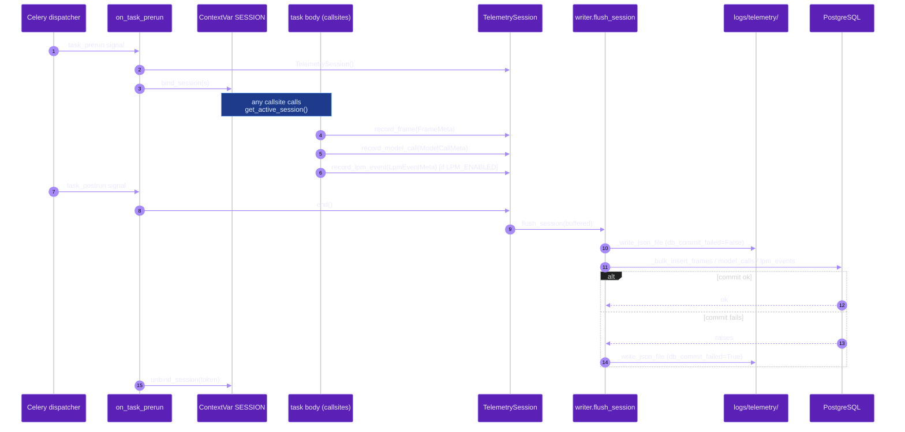
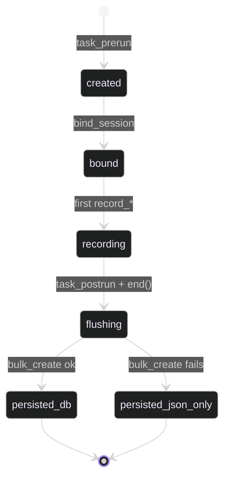

# `apps.telemetry`

**Last updated:** 2026-06-03
**Entity kind:** `module`
**Status:** `active`

> Django app implementing the dual-sink (PostgreSQL + JSON-file)
> telemetry layer. The system-level view of how Celery tasks emit
> telemetry is in
> [`docs/entity/systems/telemetry_pipeline.md`](../systems/telemetry_pipeline.md);
> this module doc is the per-file inventory + symbol map + per-symbol
> line citation for the implementing code.

## Source-of-truth references

| Kind | Reference |
|---|---|
| File | `backend/apps/telemetry/__init__.py` |
| File | `backend/apps/telemetry/apps.py` |
| File | `backend/apps/telemetry/celery_integration.py` |
| File | `backend/apps/telemetry/context.py` |
| File | `backend/apps/telemetry/metrics.py` |
| File | `backend/apps/telemetry/models.py` |
| File | `backend/apps/telemetry/session.py` |
| File | `backend/apps/telemetry/writer.py` |
| File | `backend/apps/telemetry/migrations/0001_initial.py` |
| File | `backend/apps/telemetry/migrations/0002_telemetrylpmevent.py` |
| File | `backend/apps/telemetry/README.md` |
| File | `backend/tests/unit/telemetry/test_telemetry_layer.py` |
| Symbol | `apps.telemetry.session.FrameMeta` (session.py:49) |
| Symbol | `apps.telemetry.session.ModelCallMeta` (session.py:80) |
| Symbol | `apps.telemetry.session.LpmEventMeta` (session.py:109) |
| Symbol | `apps.telemetry.session.StudentMeta` (session.py:135) |
| Symbol | `apps.telemetry.session.VideoSummary` (session.py:161) |
| Symbol | `apps.telemetry.session.SessionSummary` (session.py:197) |
| Symbol | `apps.telemetry.session.TelemetrySession` (session.py:216) |
| Symbol | `apps.telemetry.writer.flush_session` (writer.py:73) |
| Symbol | `apps.telemetry.writer._write_json_file` (writer.py:48) |
| Symbol | `apps.telemetry.writer._ensure_log_dir` (writer.py:35) |
| Symbol | `apps.telemetry.writer._json_default` (writer.py:40) |
| Symbol | `apps.telemetry.writer._bulk_insert_frames` (writer.py:269) |
| Symbol | `apps.telemetry.writer._bulk_insert_model_calls` (writer.py:291) |
| Symbol | `apps.telemetry.writer._bulk_insert_lpm_events` (writer.py:313) |
| Symbol | `apps.telemetry.context.get_active_session` (context.py:23) |
| Symbol | `apps.telemetry.context.bind_session` (context.py:28) |
| Symbol | `apps.telemetry.context.unbind_session` (context.py:33) |
| Symbol | `apps.telemetry.celery_integration._extract_metadata` (celery_integration.py:39) |
| Symbol | `apps.telemetry.celery_integration._resolve_runtime_mode` (celery_integration.py:53) |
| Symbol | `apps.telemetry.celery_integration.on_task_prerun` (celery_integration.py:63) |
| Symbol | `apps.telemetry.celery_integration.on_task_postrun` (celery_integration.py:103) |
| Symbol | `apps.telemetry.celery_integration.register_signals` (celery_integration.py:130) |
| Symbol | `apps.telemetry.models.TelemetrySession` (models.py:33) |
| Symbol | `apps.telemetry.models.TelemetryVideo` (models.py:89) |
| Symbol | `apps.telemetry.models.TelemetryFrame` (models.py:133) |
| Symbol | `apps.telemetry.models.TelemetryModelCall` (models.py:183) |
| Symbol | `apps.telemetry.models.TelemetryLpmEvent` (models.py:230) |
| Symbol | `apps.telemetry.models.TelemetryStudent` (models.py:267) |
| Commit | `60e891ad` (DSP Cycle 3 3/N — sibling `apps.tracking`) |
| Commit | `823a339d` (DSP Cycle 2 4/N — sibling system doc) |
| Workflow | `.github/workflows/inference-parallelization.yml` |
| Workflow | `.github/workflows/mermaid-diagrams.yml` |
| Doc | `docs/entity/systems/telemetry_pipeline.md` (the system-level view) |
| Doc | `backend/apps/telemetry/README.md` |
| Doc | `docs/logical_path_matrix_spec.md` (LPM event schema) |

## 1. Purpose and scope

This module implements the system described in
[`telemetry_pipeline`](../systems/telemetry_pipeline.md). The
narrative of *how* the dual-sink JSON-first flow works lives in the
system doc; this module doc is the *file × symbol* map that proves
every system-level claim resolves to real code.

Concretely the module owns:

- **8 in-memory dataclasses** (`session.py`): `FrameMeta` (49),
  `ModelCallMeta` (80), `LpmEventMeta` (109), `StudentMeta` (135),
  `VideoSummary` (161), `SessionSummary` (197), plus the central
  `TelemetrySession` class (216) that holds the per-task buffers.
- **6 Django models** (`models.py`): `TelemetrySession` (33),
  `TelemetryVideo` (89), `TelemetryFrame` (133),
  `TelemetryModelCall` (183), `TelemetryLpmEvent` (230),
  `TelemetryStudent` (267).
- **The dual-sink writer** (`writer.py`): `_ensure_log_dir` (35),
  `_json_default` (40), `_write_json_file` (48), `flush_session` (73),
  plus three bulk inserters (`_bulk_insert_frames` 269,
  `_bulk_insert_model_calls` 291, `_bulk_insert_lpm_events` 313).
- **ContextVar binding** (`context.py`): `get_active_session` (23),
  `bind_session` (28), `unbind_session` (33).
- **Celery signal handlers** (`celery_integration.py`):
  `_extract_metadata` (39), `_resolve_runtime_mode` (53),
  `on_task_prerun` (63), `on_task_postrun` (103),
  `register_signals` (130).
- **2 migrations**: `0001_initial.py` (sessions / videos / frames /
  model_calls / students), `0002_telemetrylpmevent.py` (Cycle 10
  LPM event table).

It does NOT do telemetry reading / dashboarding (the sibling
`apps.telemetry_mcp` reads the persisted tables for downstream
consumers).

## 2. Position in the system

## 3. Internal structure

| Path | Role |
|---|---|
| `apps.py` | Django AppConfig — calls `celery_integration.register_signals()` on `ready()` to bind `task_prerun` + `task_postrun`. |
| `session.py` | The in-memory state. 6 dataclasses + the `TelemetrySession` class (216) with `record_frame` / `record_model_call` / `record_lpm_event` / `record_student` / `start()` / `end()`. |
| `context.py` | Per-task `ContextVar` plumbing. `bind_session` (28) returns a token; `unbind_session` (33) restores; `get_active_session` (23) is the public read. |
| `celery_integration.py` | The two Celery signal handlers + helpers. `on_task_prerun` (63) constructs `TelemetrySession` + binds the ContextVar; `on_task_postrun` (103) flushes via `writer.flush_session` + unbinds. `_extract_metadata` (39) and `_resolve_runtime_mode` (53) compute the per-task meta. `register_signals` (130) connects via `task_prerun.connect` / `task_postrun.connect`. |
| `writer.py` | The dual-sink flush. `flush_session` (73) is the public entry: step 1 calls `_write_json_file` (48) with `db_commit_failed=False` to write the canonical JSON, then step 2 attempts `_bulk_insert_frames` (269) / `_bulk_insert_model_calls` (291) / `_bulk_insert_lpm_events` (313) in a single transaction; on failure the JSON file is rewritten with `db_commit_failed=True`. `_ensure_log_dir` (35) creates `logs/telemetry/`; `_json_default` (40) handles `datetime` + `UUID` serialisation. |
| `models.py` | The 6 ORM tables. `TelemetrySession` (33) is the top of the tree (UUID PK + status + start/end timestamps); `TelemetryVideo` (89), `TelemetryFrame` (133), `TelemetryModelCall` (183), `TelemetryLpmEvent` (230), `TelemetryStudent` (267) all FK to it. |
| `metrics.py` | Prometheus-style counters / gauges for observability of the telemetry layer itself (flush success vs JSON-only, per-task buffer depth). |
| `migrations/0001_initial.py` | First migration — sessions / videos / frames / model_calls / students tables. |
| `migrations/0002_telemetrylpmevent.py` | Cycle 10 LPM event table. |

## 4. Call graph (one Celery task lifecycle)

## 5. External connections

## 6. API surface (external calls into this module)

| Interface | Schema | Caller |
|---|---|---|
| `TelemetrySession.record_frame(FrameMeta)` | `FrameMeta` dataclass | any callsite in any Celery task (via `get_active_session`) |
| `TelemetrySession.record_model_call(ModelCallMeta)` | `ModelCallMeta` with `model`, `rtt_ms`, `status` | `apps.pipeline.services.triton_client.TritonClient.infer` |
| `TelemetrySession.record_lpm_event(LpmEventMeta)` | per LPM spec | `apps.video_analysis.tasks._tel_record_lpm_event` (gated by `LPM_ENABLED`) |
| `TelemetrySession.record_student(StudentMeta)` | per-student meta | tracking + identity layers |
| `get_active_session()` | none | any caller before the four `record_*` methods |
| `bind_session(session) / unbind_session(token)` | ContextVar plumbing | Celery signal handlers only |
| Signal `task_prerun` (Celery) | task id + args + kwargs | Celery dispatcher (not us; we're the receiver) |
| Signal `task_postrun` (Celery) | task id + retval | Celery dispatcher |
| Django ORM models (the 6 tables) | per `0001_initial.py` + `0002_telemetrylpmevent.py` | downstream readers (telemetry_mcp, dashboards, ad-hoc) |

## 7. Dependencies

| Dependency | Role | Pin |
|---|---|---|
| `Celery` (signal API) | `task_prerun` / `task_postrun` binding | 5.4.0 |
| `Django` (ORM + migrations) | persistence | 5.1.5 |
| Python `contextvars` (stdlib) | per-task session binding | stdlib |
| `apps.video_analysis` (caller) | upstream record source | internal |
| `apps.pipeline` (caller) | per-Triton-call records | internal |
| `apps.tracking` (caller) | per-track records | internal |
| `apps.telemetry_mcp` (downstream reader) | exposes tables | internal |

## 8. Environment variables read

| Variable | Default | Effect |
|---|---|---|
| `PYRAMID_INFERENCE_AUDIT_ENABLED` | `true` | toggles per-frame audit JSON for offline jobs |
| `PYRAMID_INFERENCE_AUDIT_LIVE_ENABLED` | `true` | toggles per-frame audit JSON for live runs |
| `LPM_ENABLED` | `0` | when `1`, `record_lpm_event` is called from the offline-pipeline hook |
| `LPM_DEBUG_LOG` | `0` | extra log lines around LPM events |

The module reads no Triton env vars directly — Triton-side info
arrives via the `ModelCallMeta` dataclass produced by `TritonClient`.

## 9. Sequence diagram (one task: prerun → records → postrun → DB)

## 10. State machine (per-task `TelemetrySession` lifecycle)

## 11. Failure modes

| Failure | Detection | Recovery |
|---|---|---|
| PostgreSQL down at flush | `_bulk_insert_*` raises inside `flush_session` (writer.py:73) | JSON file rewritten with `db_commit_failed=True` — never silent loss (constitution § 17.3) |
| ContextVar not bound (callsite outside Celery) | `get_active_session` returns `None` | caller skips recording silently (by design — non-Celery code is read-only) |
| Task crashed before `task_postrun` | Celery emits `task_postrun` with `exception=...` regardless | writer flushes whatever buffer exists; session marked failed |
| `record_lpm_event` called with `LPM_ENABLED=0` | session helper no-ops at the gate | safe default |
| Wrong vector dimension in embedding meta (§ 17.2) | DB validator at write boundary rejects | telemetry records the rejection event |
| Disk full at `_write_json_file` | `OSError` raised inside step 1 | task_postrun handler catches + logs; PostgreSQL flush is then the only sink |

## 12. Performance characteristics

The telemetry layer's overhead is intentionally negligible — all
records buffer in-memory and only flush at task end. Per-task flush
wall is dominated by the bulk-create round-trip (~ms-scale for the
typical 4 541-frame offline job). No explicit benchmark exists
because the layer's cost has not appeared on any RTT decomposition
probe.

## 13. Operational notes

- JSON files at `logs/telemetry/{task_id}.json` are the authoritative
  fallback evidence. Constitution § 12.5 makes every accepted cycle's
  `inference_audit.json` derive from this surface.
- `grep db_commit_failed: true logs/telemetry/*.json` finds every
  JSON-only run that needs PostgreSQL back-fill.
- `telemetry_lpm_events` table (migration `0002_telemetrylpmevent.py`)
  is currently written-to only when `LPM_ENABLED=1`. Production is
  `LPM_ENABLED=0` because Cycle 10 Phase 1 was NOT ACCEPTED.
- The Celery signal binding is established at `AppConfig.ready()`;
  if the app is not in `INSTALLED_APPS` no telemetry is recorded.

## 14. Historical diagrams

> Not applicable: no diagrams in this doc have been superseded yet.

## 15. Related entities

| Entity | Path | Relationship |
|---|---|---|
| Telemetry pipeline (system view) | `docs/entity/systems/telemetry_pipeline.md` | system this module implements |
| `apps.video_analysis` | `docs/entity/modules/apps.video_analysis.md` | primary caller (every Celery task) |
| `apps.pipeline` | `docs/entity/modules/apps.pipeline.md` | caller for per-Triton-call records |
| `apps.tracking` | `docs/entity/modules/apps.tracking.md` | caller for per-track records |
| `apps.telemetry_mcp` | `docs/entity/modules/apps.telemetry_mcp.md` (planned) | downstream reader of the 6 tables |
| LPM spec | `docs/logical_path_matrix_spec.md` | producer of the `LpmEventMeta` schema |
| `writer.py` code | `docs/entity/code/apps.telemetry.writer.md` (planned DSP Cycle 6) | hot file — owns the dual-sink contract |
| `session.py` code | `docs/entity/code/apps.telemetry.session.md` (planned DSP Cycle 6) | hot file — owns 8 dataclasses |

## 16. Open questions

- **Q1.** JSON sink rotation: every Celery task writes one new file under `logs/telemetry/`. Should the layer rotate / compact / archive? *Owner:* observability maintainer. *Target close:* before the next storage-pressure cycle.
- **Q2.** Should `apps.telemetry_mcp` be folded back into `apps.telemetry` or remain a separate app for read/write isolation? *Owner:* DSP Cycle 3 reviewer when `apps.telemetry_mcp` ships. *Target close:* during that doc.

## 17. Change log

| Date | What changed | Commit |
|---|---|---|
| 2026-06-03 | First version landed under DSP Cycle 3 (4 of ~18 modules). All 5 diagrams verified locally with `mmdc` per constitution § 19.3.1 before push. | (this commit) |
