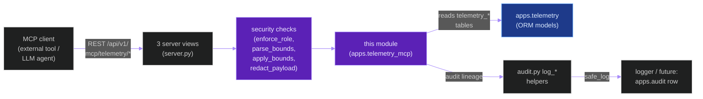
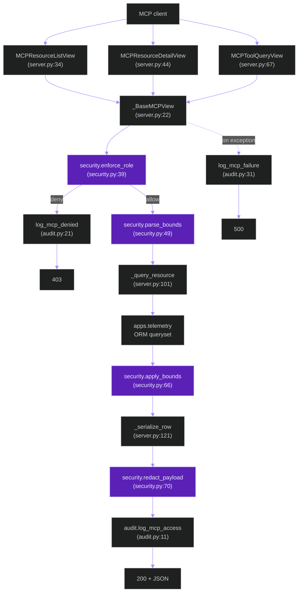
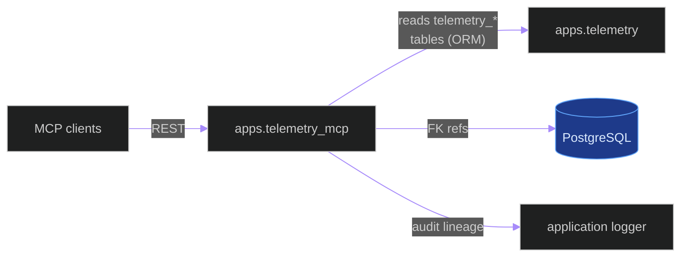
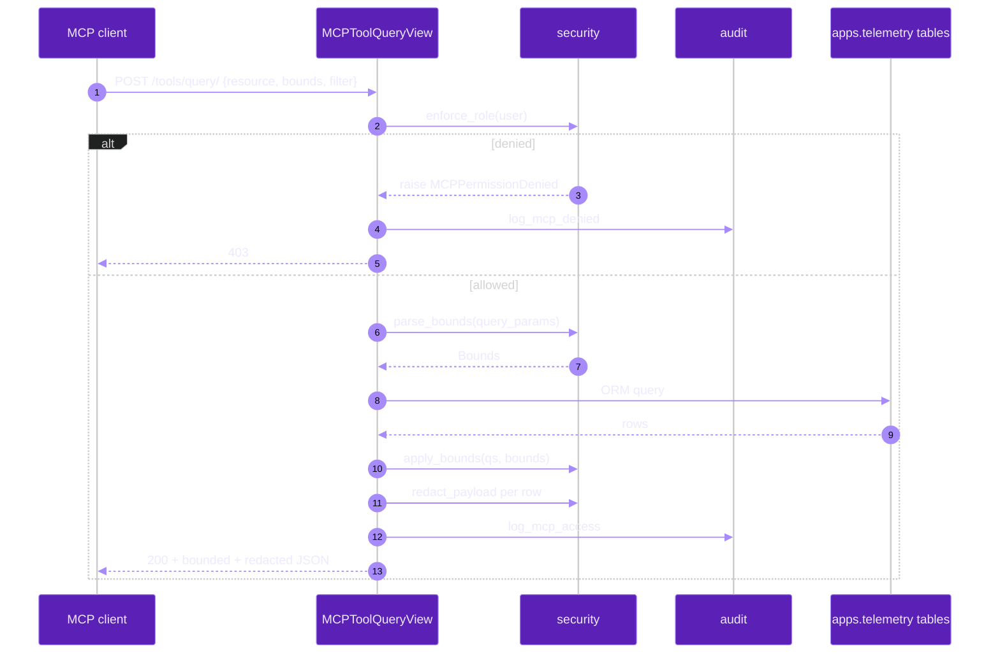

# `apps.telemetry_mcp`

**Last updated:** 2026-06-03
**Entity kind:** `module`
**Status:** `active`

> Django app exposing the `apps.telemetry` persisted tables as an
> MCP (Model Context Protocol) read surface — list resources,
> retrieve resources, run bounded tool queries. Role-gated, bounded,
> redacted, and audit-logged. No models of its own; pure read +
> security shim over the `telemetry_*` tables.

## Source-of-truth references

| Kind | Reference |
|---|---|
| File | `backend/apps/telemetry_mcp/__init__.py` |
| File | `backend/apps/telemetry_mcp/apps.py` |
| File | `backend/apps/telemetry_mcp/audit.py` |
| File | `backend/apps/telemetry_mcp/security.py` |
| File | `backend/apps/telemetry_mcp/server.py` |
| File | `backend/apps/telemetry_mcp/urls.py` |
| File | `backend/apps/telemetry_mcp/README.md` |
| Symbol | `apps.telemetry_mcp.apps.TelemetryMcpConfig` (apps.py:4) |
| Symbol | `apps.telemetry_mcp.audit.log_mcp_access` (audit.py:11) |
| Symbol | `apps.telemetry_mcp.audit.log_mcp_denied` (audit.py:21) |
| Symbol | `apps.telemetry_mcp.audit.log_mcp_failure` (audit.py:31) |
| Symbol | `apps.telemetry_mcp.audit._safe_log` (audit.py:41) |
| Symbol | `apps.telemetry_mcp.security.MCPPermissionDenied` (security.py:29) |
| Symbol | `apps.telemetry_mcp.security.Bounds` (security.py:34) |
| Symbol | `apps.telemetry_mcp.security.enforce_role` (security.py:39) |
| Symbol | `apps.telemetry_mcp.security.parse_bounds` (security.py:49) |
| Symbol | `apps.telemetry_mcp.security.apply_bounds` (security.py:66) |
| Symbol | `apps.telemetry_mcp.security.redact_payload` (security.py:70) |
| Symbol | `apps.telemetry_mcp.server._BaseMCPView` (server.py:22) |
| Symbol | `apps.telemetry_mcp.server.MCPResourceListView` (server.py:34) |
| Symbol | `apps.telemetry_mcp.server.MCPResourceDetailView` (server.py:44) |
| Symbol | `apps.telemetry_mcp.server.MCPToolQueryView` (server.py:67) |
| Symbol | `apps.telemetry_mcp.server._query_resource` (server.py:101) |
| Symbol | `apps.telemetry_mcp.server._serialize_row` (server.py:121) |
| Commit | `a463e1eb` (DSP Cycle 3 16/N — sibling `apps.exports`) |
| Workflow | `.github/workflows/inference-parallelization.yml` |
| Workflow | `.github/workflows/mermaid-diagrams.yml` |
| Doc | `docs/entity/systems/telemetry_pipeline.md` |
| Doc | `docs/entity/modules/apps.telemetry.md` |
| Doc | `backend/apps/telemetry_mcp/README.md` |

## 1. Purpose and scope

This module is the **read shim** for `apps.telemetry`. It exposes
the persisted `telemetry_*` tables to MCP clients (Model Context
Protocol consumers) with three guardrails:

- **Role enforcement** (`security.py:39` `enforce_role`) — only
  authorised users can access.
- **Bounded queries** (`security.py:49` `parse_bounds`, `66` `apply_bounds`)
  — every query is bounded by row + time limits via `Bounds`
  dataclass (34).
- **Payload redaction** (`security.py:70` `redact_payload`) — PII /
  high-cardinality fields are redacted before return.
- **Audit logging** (`audit.py:11,21,31,41`) — every access,
  denial, and failure is recorded for governance.

The 3 REST views (`server.py:34,44,67`) are:

- `MCPResourceListView` — list available resources (telemetry tables).
- `MCPResourceDetailView` — retrieve a specific resource page.
- `MCPToolQueryView` — run a bounded ad-hoc query as a "tool".

No ORM models, no migrations. Read-only surface over the
`apps.telemetry` tables.

## 2. Position in the system

## 3. Internal structure

| Path | Role |
|---|---|
| `apps.py` | `TelemetryMcpConfig` Django AppConfig (line 4). |
| `audit.py` | 4 logging helpers (11, 21, 31, 41) for access/denied/failure. |
| `security.py` | `MCPPermissionDenied` exception (29), `Bounds` dataclass (34), `enforce_role` (39), `parse_bounds` (49), `apply_bounds` (66), `redact_payload` (70). |
| `server.py` | `_BaseMCPView` (22), 3 concrete views (34, 44, 67), `_query_resource` (101), `_serialize_row` (121). |
| `urls.py` | 3 paths: `resources/`, `resources/<name>/`, `tools/query/`. |
| `README.md` | App overview (also linked from Phase 9 reading order). |

## 4. Call graph (MCP client lists + retrieves + queries)

## 5. External connections

## 6. API surface

### REST (from `urls.py`)

| Method + path | Handler |
|---|---|
| `GET /api/v1/mcp/telemetry/resources/` | `MCPResourceListView` (server.py:34, urls.py:9) |
| `GET /api/v1/mcp/telemetry/resources/{resource_name}/` | `MCPResourceDetailView` (server.py:44, urls.py:10) |
| `POST /api/v1/mcp/telemetry/tools/query/` | `MCPToolQueryView` (server.py:67, urls.py:11) |

(Path prefix depends on where the app's `urls.py` is mounted in the
project URLconf; pattern shown is the conventional MCP prefix.)

### Python API

| Function | Role |
|---|---|
| `security.enforce_role(user)` (39) | raises `MCPPermissionDenied` if user lacks the MCP role |
| `security.parse_bounds(query_params)` (49) | builds `Bounds` from request params |
| `security.apply_bounds(qs, bounds)` (66) | applies bounds to a queryset |
| `security.redact_payload(value)` (70) | redacts PII / high-cardinality fields |
| `audit.log_mcp_access(...)` (11), `log_mcp_denied(...)` (21), `log_mcp_failure(...)` (31) | governance logging |

## 7. Dependencies

| Dependency | Role | Pin |
|---|---|---|
| `Django + DRF` | view surface | 5.1.5 / 3.15.2 |
| `apps.telemetry` | source of truth — reads its 6 ORM tables | internal |
| `apps.accounts` | role + permission checks (`enforce_role`) | internal |

## 8. Environment variables read

None directly. Indirectly inherits everything `apps.telemetry` reads
when running ORM queries.

## 9. Sequence diagram (MCP client runs a bounded tool query)

## 10. State machine

> Not applicable: stateless REST surface.

## 11. Failure modes

| Failure | Detection | Recovery |
|---|---|---|
| Caller lacks MCP role | `enforce_role` raises `MCPPermissionDenied` | 403 + `log_mcp_denied` |
| Bounds out of range | `parse_bounds` raises | 400 + `log_mcp_failure` |
| Unknown resource name | `_query_resource` raises | 404 + `log_mcp_failure` |
| ORM query exception | bubbles to `_BaseMCPView` exception handler | 500 + `log_mcp_failure` |
| Redaction logic miss for new field | high-cardinality field leaks | review redact rule; add to `redact_payload` |

## 12. Performance characteristics

Read-only ORM surface; bounded queries ensure per-call cost stays
small (typical: ≤ 100 rows, ≤ 1 MB JSON). Not on any frame-rate
path.

## 13. Operational notes

- The MCP role is administered via `apps.accounts.Role` — assign
  the `mcp_telemetry` permission to elevate.
- `Bounds` defaults are conservative (small page sizes). MCP clients
  must request larger pages explicitly.
- `redact_payload` rules are maintained in `security.py:70` — every
  new sensitive field on `apps.telemetry.models` MUST be added there
  before the MCP surface ships it.

## 14. Historical diagrams

> Not applicable: no diagrams in this doc have been superseded yet.

## 15. Related entities

| Entity | Path | Relationship |
|---|---|---|
| `apps.telemetry` | `docs/entity/modules/apps.telemetry.md` | source of truth (6 ORM tables) |
| Telemetry pipeline | `docs/entity/systems/telemetry_pipeline.md` | system this module reads |
| `apps.accounts` | `docs/entity/modules/apps.accounts.md` | role + permission source |
| `apps.audit` | `docs/entity/modules/apps.audit.md` | sibling app for HTTP-request audit; MCP audit is local for now (see Q1) |
| `security.py` code | `docs/entity/code/apps.telemetry_mcp.security.md` (planned DSP Cycle 6) | hot file with role/bounds/redaction |

## 16. Open questions

- **Q1.** Should `audit.log_mcp_access` write to `apps.audit.AuditLogEntry` rather than the application logger? Currently logger-only. *Owner:* observability + security maintainers. *Target close:* DSP Cycle 6 code-level doc.
- **Q2.** Should `Bounds` carry a max wall-time budget enforced server-side (e.g., 5s query timeout)? *Owner:* operations maintainer. *Target close:* DSP Cycle 6.

## 17. Change log

| Date | What changed | Commit |
|---|---|---|
| 2026-06-03 | First version landed under DSP Cycle 3 (17 of ~18 modules). All 4 diagrams verified locally with `mmdc` per constitution § 19.3.1 before push. | (this commit) |
