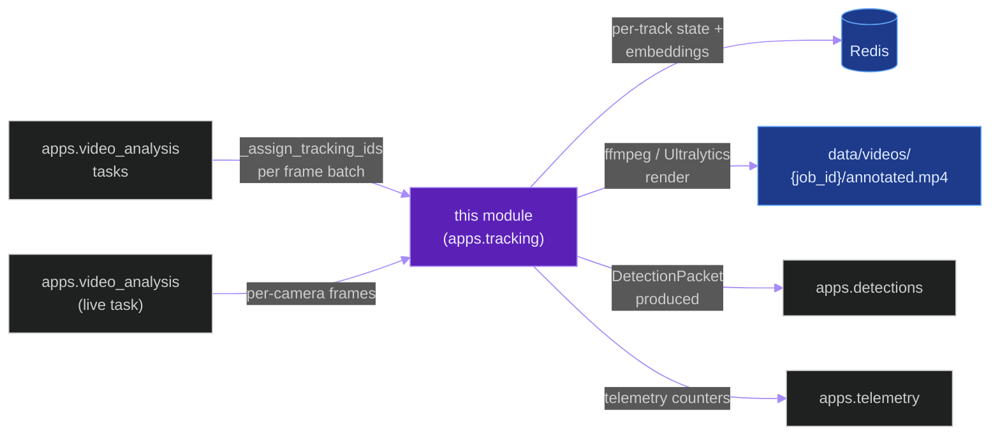
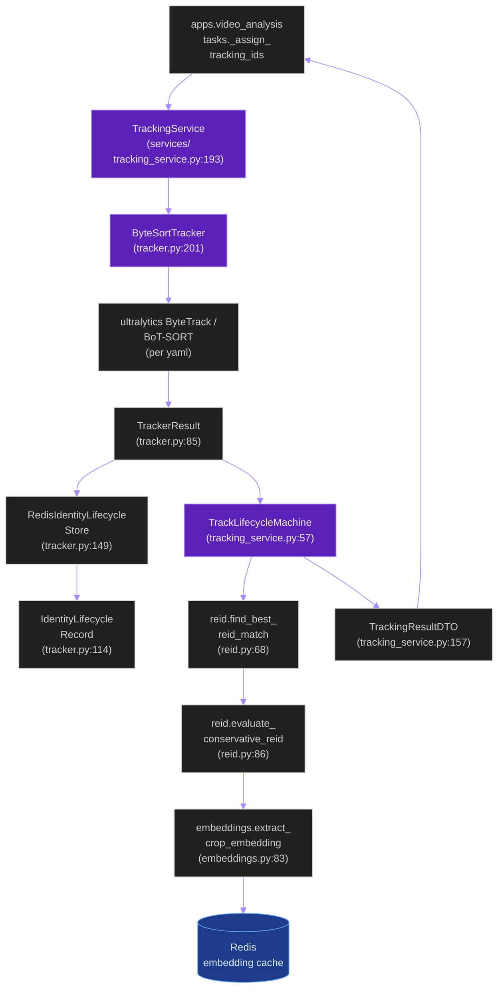
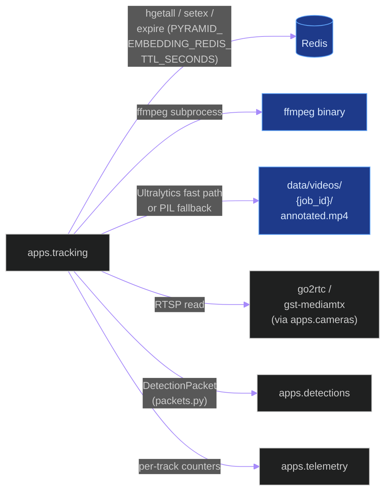
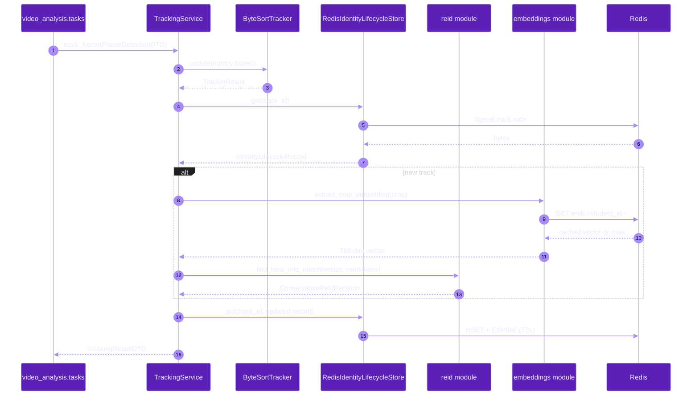
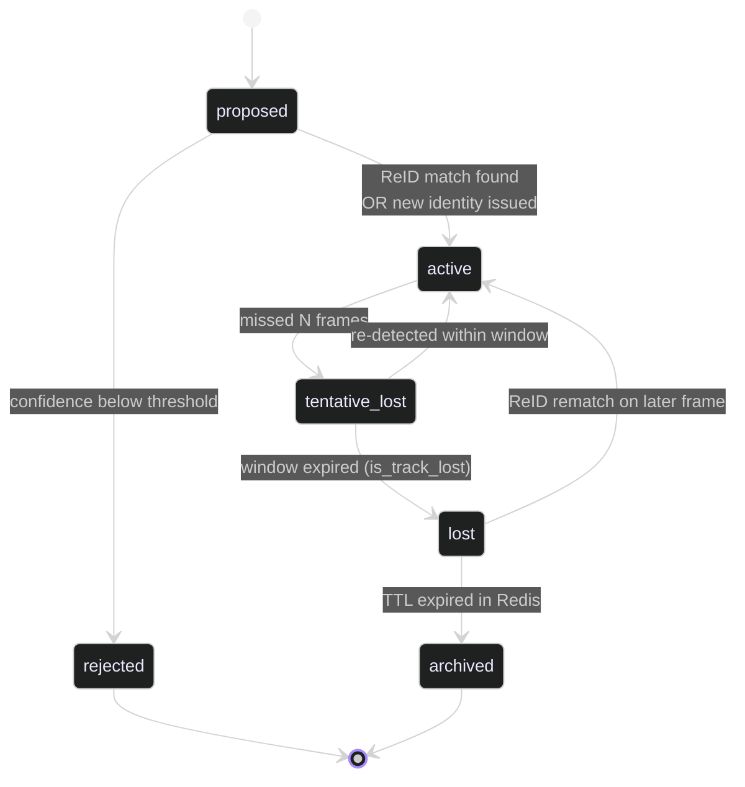

# `apps.tracking`

**Last updated:** 2026-06-03
**Entity kind:** `module`
**Status:** `active`

> Tracking + ReID + render layer. Owns the `ByteSortTracker`
> (ByteTrack / BoT-SORT wrapper), the `TrackingService` lifecycle +
> identity-scope machinery, ReID matching with cosine-similarity
> threshold + conservative-decision policy, embedding extraction
> (single + batched + Redis-cached), the annotated-video renderer
> (`render_annotated_video` with optional pose overlays), and the live
> RTSP capture worker. Called by `apps.video_analysis.tasks` after
> every per-frame detection pass.

## Source-of-truth references

| Kind | Reference |
|---|---|
| File | `backend/apps/tracking/__init__.py` |
| File | `backend/apps/tracking/apps.py` |
| File | `backend/apps/tracking/boundary.py` |
| File | `backend/apps/tracking/association.py` |
| File | `backend/apps/tracking/colors.py` |
| File | `backend/apps/tracking/embeddings.py` |
| File | `backend/apps/tracking/embeddings_batch.py` |
| File | `backend/apps/tracking/identity_metrics.py` |
| File | `backend/apps/tracking/identity_scope.py` |
| File | `backend/apps/tracking/live_capture.py` |
| File | `backend/apps/tracking/packets.py` |
| File | `backend/apps/tracking/pipeline.py` |
| File | `backend/apps/tracking/pipeline_mode.py` |
| File | `backend/apps/tracking/reid.py` |
| File | `backend/apps/tracking/rendering.py` |
| File | `backend/apps/tracking/rtsp_worker.py` |
| File | `backend/apps/tracking/services/tracking_service.py` |
| File | `backend/apps/tracking/tracker.py` |
| File | `backend/apps/tracking/video_exporter.py` |
| File | `backend/apps/tracking/README.md` |
| File | `backend/tests/unit/tracking/test_redis_client_cache.py` |
| File | `backend/tests/unit/tracking/test_persist_embeddings_bulk.py` |
| Symbol | `apps.tracking.tracker.TrackerResult` (tracker.py:85) |
| Symbol | `apps.tracking.tracker.TrackerConfiguration` (tracker.py:104) |
| Symbol | `apps.tracking.tracker.IdentityLifecycleRecord` (tracker.py:114) |
| Symbol | `apps.tracking.tracker.RedisIdentityLifecycleStore` (tracker.py:149) |
| Symbol | `apps.tracking.tracker.ByteSortTracker` (tracker.py:201) |
| Symbol | `apps.tracking.tracker._ensure_custom_yamls` (tracker.py:62) |
| Symbol | `apps.tracking.reid.ReIdCandidate` (reid.py:16) |
| Symbol | `apps.tracking.reid.ConservativeReIdDecision` (reid.py:23) |
| Symbol | `apps.tracking.reid.cosine_similarity` (reid.py:51) |
| Symbol | `apps.tracking.reid.is_reid_match` (reid.py:63) |
| Symbol | `apps.tracking.reid.find_best_reid_match` (reid.py:68) |
| Symbol | `apps.tracking.reid.evaluate_conservative_reid` (reid.py:86) |
| Symbol | `apps.tracking.reid.canonicalize_reid_match` (reid.py:110) |
| Symbol | `apps.tracking.reid.prune_stale_reid_candidates` (reid.py:133) |
| Symbol | `apps.tracking.reid.clear_stale_embedding_cache` (reid.py:151) |
| Symbol | `apps.tracking.embeddings.generate_embedding_vector` (embeddings.py:36) |
| Symbol | `apps.tracking.embeddings.extract_crop_embedding` (embeddings.py:83) |
| Symbol | `apps.tracking.embeddings.normalize_vector` (embeddings.py:158) |
| Symbol | `apps.tracking.embeddings.redis_client` (embeddings.py:172) |
| Symbol | `apps.tracking.services.tracking_service.TrackLifecycleMachine` (services/tracking_service.py:57) |
| Symbol | `apps.tracking.services.tracking_service.BoundingBoxDTO` (services/tracking_service.py:108) |
| Symbol | `apps.tracking.services.tracking_service.FrameDetectionDTO` (services/tracking_service.py:131) |
| Symbol | `apps.tracking.services.tracking_service.TrackStateDTO` (services/tracking_service.py:144) |
| Symbol | `apps.tracking.services.tracking_service.TrackingResultDTO` (services/tracking_service.py:157) |
| Symbol | `apps.tracking.services.tracking_service.TrackingService` (services/tracking_service.py:193) |
| Symbol | `apps.tracking.video_exporter.render_annotated_video` (video_exporter.py:418) |
| Symbol | `apps.tracking.video_exporter._try_ultralytics_render` (video_exporter.py:48) |
| Symbol | `apps.tracking.video_exporter._resolve_ffmpeg_binary` (video_exporter.py:230) |
| Symbol | `apps.tracking.video_exporter._load_pose_records_by_frame` (video_exporter.py:266) |
| Symbol | `apps.tracking.video_exporter._draw_pose_overlay` (video_exporter.py:349) |
| Commit | `7804cfb6` (DSP Cycle 3 2/N — sibling `apps.pipeline` doc) |
| Commit | `e24f9514` (DSP Cycle 3 1/N — `apps.video_analysis`) |
| Workflow | `.github/workflows/inference-parallelization.yml` |
| Workflow | `.github/workflows/mermaid-diagrams.yml` |
| Doc | `docs/entity/systems/offline_inference_pipeline.md` |
| Doc | `docs/entity/systems/live_streaming_pipeline.md` |
| Doc | `docs/entity/modules/apps.video_analysis.md` |
| Doc | `backend/apps/tracking/README.md` |

## 1. Purpose and scope

This module turns per-frame detections into stable identities and
renders them to video. It owns:

- **`ByteSortTracker`** (`tracker.py:201`) — wraps Ultralytics
  ByteTrack + BoT-SORT under one interface; `_ensure_custom_yamls`
  ships our per-tracker YAML configs at import time.
- **`TrackerConfiguration`** / **`TrackerResult`** / **`IdentityLifecycleRecord`** /
  **`RedisIdentityLifecycleStore`** — the lifecycle data classes +
  Redis-backed cross-task state.
- **`TrackingService`** (`services/tracking_service.py:193`) — the
  higher-level lifecycle orchestrator that wraps `ByteSortTracker`
  with `TrackLifecycleMachine` (57), `BoundingBoxDTO` /
  `FrameDetectionDTO` / `TrackStateDTO` / `TrackingResultDTO`.
- **ReID layer (`reid.py`)** — `cosine_similarity` (51),
  `is_reid_match` (63, default threshold 0.85), `find_best_reid_match`
  (68), `evaluate_conservative_reid` (86), `canonicalize_reid_match`
  (110), `prune_stale_reid_candidates` (133),
  `clear_stale_embedding_cache` (151). Plus `ReIdCandidate` (16) and
  `ConservativeReIdDecision` (23) DTOs.
- **Embedding extraction (`embeddings.py` + `embeddings_batch.py`)** —
  `extract_crop_embedding` (embeddings.py:83) for single crops,
  batched helpers in `embeddings_batch.py`, Redis cache via
  `redis_client` (172) with `PYRAMID_EMBEDDING_REDIS_TTL_SECONDS` TTL.
- **`identity_scope.py` + `identity_metrics.py`** — multi-scope
  identity continuity (across sessions / classrooms).
- **`render_annotated_video`** (`video_exporter.py:418`) — produces
  the annotated MP4 + optional pose overlays via `_draw_pose_overlay`
  (349). Ultralytics fast-path (`_try_ultralytics_render` at 48) +
  PIL fallback.
- **Live capture (`live_capture.py` + `rtsp_worker.py`)** — frame
  capture for the live pipeline.
- **`packets.py`** — `DetectionPacket` (cross-app) producer.
- **`pipeline.py` + `pipeline_mode.py`** — top-level orchestration
  helpers invoked by `apps.video_analysis.tasks`.
- **`association.py` + `colors.py` + `rendering.py`** — lower-level
  geometry + per-track color + render primitives.

It does NOT do detection or behavior decode (`apps.pipeline` /
`apps.video_analysis` own those). It does NOT persist `Detection`
rows directly (the caller does; this module returns DTOs).

## 2. Position in the system

## 3. Internal structure

| Path | Role |
|---|---|
| `apps.py` | Django AppConfig — registers signals. |
| `boundary.py` | Cross-module import declarations enforced by `backend/core/boundaries.py`. |
| `tracker.py` | The tracker heart: `_ensure_custom_yamls` (62), `TrackerResult` (85), `TrackerConfiguration` (104), `IdentityLifecycleRecord` (114), `RedisIdentityLifecycleStore` (149), `ByteSortTracker` (201). |
| `services/tracking_service.py` | Higher-level lifecycle orchestrator: `is_track_lost` (29), `compute_track_continuity_score` (43), `TrackLifecycleMachine` (57), DTOs (108-157), `TrackingService` (193). |
| `reid.py` | ReID matching + conservative-decision policy. |
| `embeddings.py` | Single-crop embedding + Redis cache. |
| `embeddings_batch.py` | Batched embedding extraction (Cycle 8 ACCEPTED optimisation). |
| `identity_scope.py` | Per-scope (session/classroom) identity continuity. |
| `identity_metrics.py` | Per-identity metrics + dashboards. |
| `live_capture.py` | Live-pipeline frame capture buffer. |
| `rtsp_worker.py` | RTSP read worker for the live path. |
| `packets.py` | `DetectionPacket` producer (cross-app DTO). |
| `pipeline.py` + `pipeline_mode.py` | Top-level tracking-pipeline orchestration. |
| `association.py` | IoU + centroid-distance association math. |
| `colors.py` | Per-track-id color palette generation. |
| `rendering.py` | Render primitives used by `video_exporter.py`. |
| `video_exporter.py` | Annotated MP4 renderer: `_video_job_root` (36), `_resolve_visible_models` (41), `_try_ultralytics_render` (48), `_resolve_ffmpeg_binary` (230), `_load_pose_records_by_frame` (266), `_resolve_pose_draw_min_conf` (290), `_parse_pose_point` (328), `_draw_pose_overlay` (349), `render_annotated_video` (418). |

## 4. Call graph (per-frame `_assign_tracking_ids`)

## 5. External connections

## 6. API surface

This module is callee-only; its surface is the Python API consumed
by `apps.video_analysis.tasks` and the live capture path.

| Interface | Schema | Caller |
|---|---|---|
| `TrackingService.track_frame(detections, frame_index, ...) -> TrackingResultDTO` | `FrameDetectionDTO` + frame index | `apps.video_analysis.tasks._assign_tracking_ids` (per frame batch) |
| `ByteSortTracker.update(detections)` | numpy detection array | `TrackingService` (internal) |
| `find_best_reid_match(query, candidates, threshold)` | embedding vector + candidates | `TrackLifecycleMachine` (internal) |
| `extract_crop_embedding(image, ...) -> list[float]` | BGR crop ndarray | per-detection-loop helper |
| `render_annotated_video(job, ...)` | `VideoAnalysisJob` | `process_video_upload` post-detection render |
| `RedisIdentityLifecycleStore.get(track_id)` / `.put(track_id, record)` | track id + record | `TrackLifecycleMachine` (internal) |

## 7. Dependencies

| Dependency | Role | Pin |
|---|---|---|
| `ultralytics` (ByteTrack + BoT-SORT) | underlying tracker implementations | 8.3.61 |
| `numpy` | tensor / array math | per requirements |
| `opencv-python` | crop manipulation + render | per requirements |
| `redis-py` | embedding + lifecycle cache | per requirements |
| `Pillow (PIL)` | render fallback when Ultralytics fast path not available | per requirements |
| External: `ffmpeg` binary | mp4 mux / encode | system / image |
| `apps.video_analysis` | upstream caller + `VideoAnalysisJob` model | internal |
| `apps.cameras` | RTSP source for live capture | internal |
| `apps.detections` | downstream `DetectionPacket` consumer | internal |
| `apps.telemetry` | counters + per-frame meta | internal |

## 8. Environment variables read

| Variable | Default | Effect |
|---|---|---|
| `PYRAMID_TRACKING_ALGORITHM` | `bytetrack` | default tracker (see README env table) |
| `PYRAMID_TRACKING_REID_ALGORITHM` | `botsort` | ReID-capable tracker |
| `PYRAMID_TRACKING_LOW_COMPUTE_ALGORITHM` | `bytetrack` | when track IDs disabled |
| `PYRAMID_TRACKING_REID_ENABLED` | `true` | master ReID toggle |
| `PYRAMID_TRACKING_IOU_THRESHOLD` | `0.3` | association IoU threshold |
| `PYRAMID_TRACKING_MAX_CENTER_DISTANCE` | `160.0` | centroid distance cap |
| `PYRAMID_TRACKING_REID_SIMILARITY_THRESHOLD` | `0.85` | cosine threshold for `is_reid_match` |
| `PYRAMID_EMBEDDING_REDIS_TTL_SECONDS` | `2592000` | embedding cache TTL (30 days) |
| `PYRAMID_PRESERVE_SOURCE_QUALITY` | `true` | render fidelity hint |
| `PYRAMID_OUTPUT_VIDEO_CRF` | `18` | H.264 CRF for annotated mp4 |
| `PYRAMID_OUTPUT_VIDEO_PRESET` | `medium` | ffmpeg preset |
| `PYRAMID_OUTPUT_VIDEO_BITRATE` | empty | optional explicit bitrate |
| `PYRAMID_OUTPUT_MAX_WIDTH` / `_HEIGHT` | `0` | optional output downscale caps |
| `PYRAMID_OUTPUT_JPEG_QUALITY` | `95` | intermediate JPEG quality |
| `PYRAMID_RTSP_OVER_TCP` | `true` | force RTSP TCP transport (live capture) |
| `PYRAMID_RTSP_TRANSPORT` | `tcp` | live capture transport preference |
| `REDIS_URL` | `redis://localhost:6379/0` | shared Redis endpoint (via `embeddings.redis_client`) |

## 9. Sequence diagram (frame batch through `TrackingService`)

## 10. State machine (`TrackLifecycleMachine`)

## 11. Failure modes

| Failure | Detection | Recovery |
|---|---|---|
| Redis unavailable mid-job | `redis_client()` returns None | tracker continues without cross-task state; per-job identities still produced; ReID degraded |
| Embedding vector wrong dimension (Section 17.2 violation) | `_coerce_embedding_dimension` (embeddings.py:59) coerces; caller-side validator at DB write rejects on persist | DB validator fails closed; telemetry records the rejection |
| Ultralytics ByteTrack YAML missing | `_ensure_custom_yamls` (tracker.py:62) raises | shipped yamls in repo; missing means install corruption — operator reinstalls |
| ReID false positive (different student matched) | `evaluate_conservative_reid` (reid.py:86) hardens with margin checks | tunable via `PYRAMID_TRACKING_REID_SIMILARITY_THRESHOLD` |
| ffmpeg binary missing | `_resolve_ffmpeg_binary` (video_exporter.py:230) returns None | render falls back to opencv `VideoWriter`; operator installs ffmpeg |
| Pose overlay draw error | `_draw_pose_overlay` (video_exporter.py:349) catches per-record | per-frame skip with telemetry warning; render continues |
| Track explosion under high IoU threshold | `PYRAMID_TRACKING_IOU_THRESHOLD` mis-tune | operator drops back to default 0.3 |

## 12. Performance characteristics

This module's wall cost in the offline pipeline is dominated by:

- **Tracker update**: ~ms per frame batch (cheap; pure CPU)
- **Embedding extraction**: was the dominant stage before Cycle 8 ACCEPTED (`embeddings_batch.py` + track-level reuse + lazy cv2 + `bulk_create`); now ~174 s / 1023 s total wall for `combined.mp4` (4 541 frames, Cycle 9b Top-K baseline)
- **Render**: ~25 s / 1023 s total wall (Cycle 9b Top-K baseline)
- **Redis cache hit rate**: dominant ReID latency factor; TTL 30 days by default

Source: `docs/cycle_9b_topk_anchor_packing_results.md` + Cycle 8
acceptance evidence.

## 13. Operational notes

- The custom ByteTrack + BoT-SORT YAML files are shipped via
  `_ensure_custom_yamls` (tracker.py:62) which writes them on first
  import — operators should NEVER hand-edit those generated yamls.
- `RedisIdentityLifecycleStore` (tracker.py:149) is the cross-task
  hand-off mechanism for the live pipeline. Killing Redis mid-run
  produces a controlled tracking degradation, not a crash.
- `render_annotated_video` (video_exporter.py:418) is the canonical
  render entry — its Ultralytics fast-path is significantly faster
  than PIL when available. Cycle 12 (parallel render) targets this
  exact function; see `docs/cycles_9_to_12_implementation_playbook.md`
  § 5.
- Cycle 8 ACCEPTED proved that `extract_crop_embedding` is fastest
  when called once per *track* (not once per detection): see
  `docs/production_inference_benchmark.md` § 14 for the −61.5 %
  embedding-wall improvement.

## 14. Historical diagrams

> Not applicable: no diagrams in this doc have been superseded yet.

## 15. Related entities

| Entity | Path | Relationship |
|---|---|---|
| `apps.video_analysis` | `docs/entity/modules/apps.video_analysis.md` | parent caller every frame batch |
| `apps.pipeline` | `docs/entity/modules/apps.pipeline.md` | upstream — produces decoded detections we consume |
| `apps.cameras` | `docs/entity/modules/apps.cameras.md` (planned) | RTSP source for `rtsp_worker.py` |
| `apps.detections` | `docs/entity/modules/apps.detections.md` (planned) | downstream `DetectionPacket` consumer |
| `apps.telemetry` | `docs/entity/modules/apps.telemetry.md` (planned) | per-track counters |
| Offline pipeline | `docs/entity/systems/offline_inference_pipeline.md` | system this module serves |
| Live pipeline | `docs/entity/systems/live_streaming_pipeline.md` | system this module serves |
| Cycle 8 ACCEPTED | `docs/entity/cycles/cycle_8.md` (planned DSP Cycle 4) | the optimization cycle that touched this module last |
| `tracker.py` code | `docs/entity/code/apps.tracking.tracker.md` (planned DSP Cycle 6) | hot file |
| `video_exporter.py` code | `docs/entity/code/apps.tracking.video_exporter.md` (planned DSP Cycle 6) | hot file (Cycle 12 candidate) |

## 16. Open questions

- **Q1.** Should `_ensure_custom_yamls` write to a versioned cache path so multiple workers don't race? Currently shared. *Owner:* tracking maintainer. *Target close:* DSP Cycle 6 code-level doc for `tracker.py`.
- **Q2.** Cycle 12 parallel-render investigation (`docs/cycle_13_persistence_render_investigation.md` if linked) — does it move `render_annotated_video` to a separate Celery worker? *Owner:* next optimization-cycle agent. *Target close:* before Cycle 12 prod benchmark.

## 17. Change log

| Date | What changed | Commit |
|---|---|---|
| 2026-06-03 | First version landed under DSP Cycle 3 (3 of ~18 modules). All 5 diagrams verified locally with `mmdc` per constitution § 19.3.1 before push. | (this commit) |
