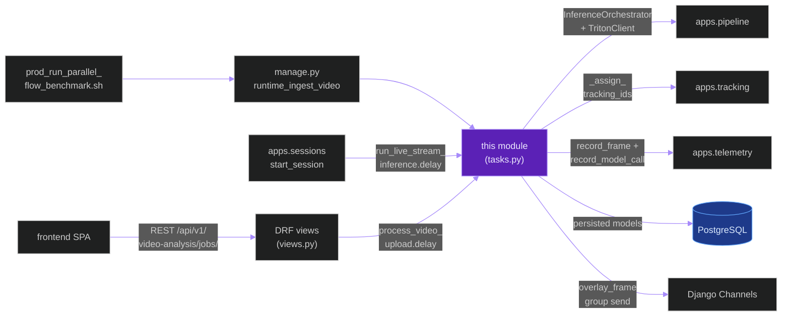
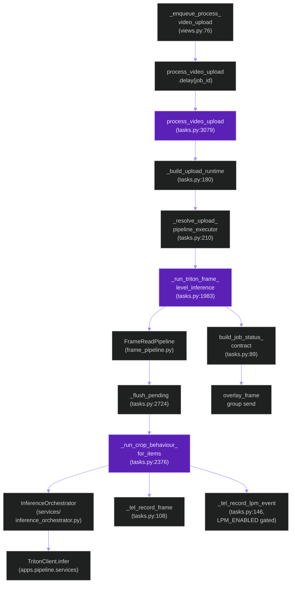
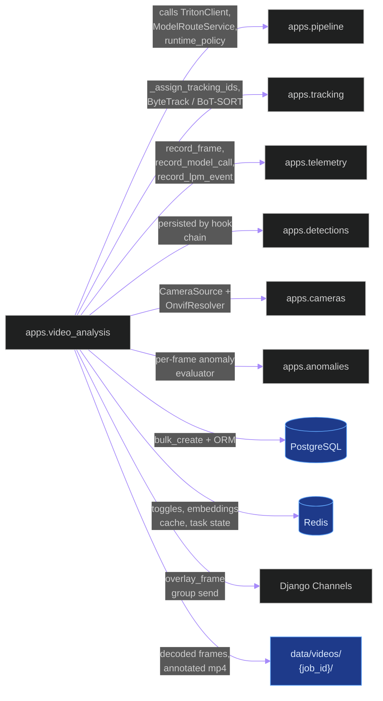
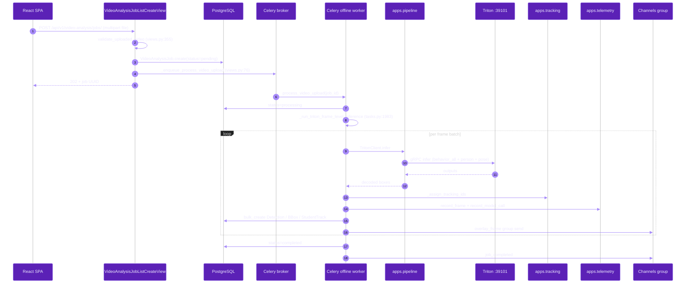
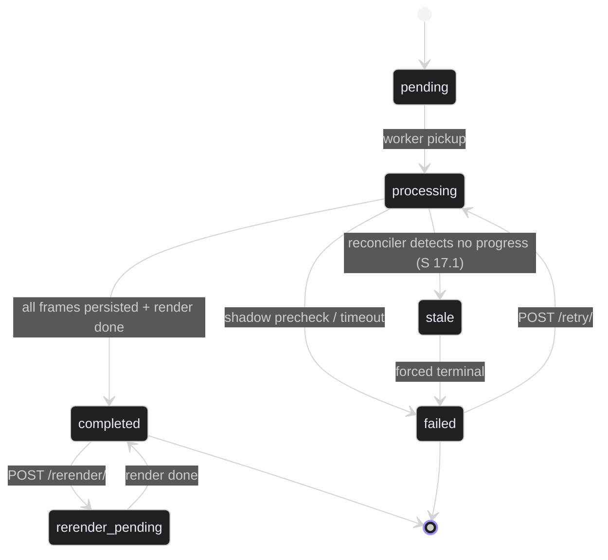

# `apps.video_analysis`

**Last updated:** 2026-06-02
**Entity kind:** `module`
**Status:** `active`

> The largest Django app in the backend. Owns both Celery
> orchestration tasks (`process_video_upload`, `run_live_stream_inference`),
> the REST + WebSocket surface for video-analysis jobs, the
> `VideoAnalysisJob` lifecycle model + 14 related models (`Frame`,
> `Detection`, `DetectionPacket`, `StudentTrack`, `IdentityScope`,
> `TrackAlias`, `ReIdDecision`, `TrackingLifecycleEvent`,
> `FrameEmbedding`, `BoundingBox`, `CameraSource`, ...), the threaded
> frame-read pipeline, and 7 `manage.py` commands. This module is the
> parent of every concrete optimization cycle from Cycle 1 onward.

## Source-of-truth references

| Kind | Reference |
|---|---|
| File | `backend/apps/video_analysis/__init__.py` |
| File | `backend/apps/video_analysis/apps.py` |
| File | `backend/apps/video_analysis/admin.py` |
| File | `backend/apps/video_analysis/boundary.py` |
| File | `backend/apps/video_analysis/constants.py` |
| File | `backend/apps/video_analysis/consumers.py` |
| File | `backend/apps/video_analysis/frame_pipeline.py` |
| File | `backend/apps/video_analysis/metrics.py` |
| File | `backend/apps/video_analysis/models.py` |
| File | `backend/apps/video_analysis/routing.py` |
| File | `backend/apps/video_analysis/serializers.py` |
| File | `backend/apps/video_analysis/services/inference_orchestrator.py` |
| File | `backend/apps/video_analysis/services/pose_quality.py` |
| File | `backend/apps/video_analysis/tasks.py` |
| File | `backend/apps/video_analysis/urls.py` |
| File | `backend/apps/video_analysis/views.py` |
| File | `backend/apps/video_analysis/management/commands/benchmark_offline_video_job.py` |
| File | `backend/apps/video_analysis/management/commands/flush_video_jobs.py` |
| File | `backend/apps/video_analysis/management/commands/reconcile_runtime_workflows.py` |
| File | `backend/apps/video_analysis/management/commands/run_maturity_acceptance.py` |
| File | `backend/apps/video_analysis/management/commands/runtime_ingest_video.py` |
| File | `backend/apps/video_analysis/management/commands/validate_inference_runtime.py` |
| File | `backend/apps/video_analysis/management/commands/validate_preview.py` |
| File | `backend/apps/video_analysis/migrations/0001_initial.py` |
| File | `backend/apps/video_analysis/migrations/0013_alter_videoanalysisjob_pipeline_mode.py` |
| File | `backend/apps/video_analysis/README.md` |
| File | `backend/tests/unit/video_analysis/` (16+ test files) |
| Symbol | `apps.video_analysis.tasks.process_video_upload` (tasks.py:3079) |
| Symbol | `apps.video_analysis.tasks.run_live_stream_inference` (tasks.py:4548) |
| Symbol | `apps.video_analysis.tasks._run_triton_frame_level_inference` (tasks.py:1983) |
| Symbol | `apps.video_analysis.tasks._run_crop_behaviour_for_items` (tasks.py:2376) |
| Symbol | `apps.video_analysis.tasks._flush_pending` (tasks.py:2724) |
| Symbol | `apps.video_analysis.tasks._tel_record_frame` (tasks.py:108) |
| Symbol | `apps.video_analysis.tasks._tel_record_lpm_event` (tasks.py:146) |
| Symbol | `apps.video_analysis.tasks.build_job_status_contract` (tasks.py:89) |
| Symbol | `apps.video_analysis.models.VideoAnalysisJob` (models.py:94) |
| Symbol | `apps.video_analysis.models.Frame` (models.py:165) |
| Symbol | `apps.video_analysis.models.Detection` (models.py:187) |
| Symbol | `apps.video_analysis.models.DetectionPacket` (models.py:200) |
| Symbol | `apps.video_analysis.models.StudentTrack` (models.py:209) |
| Symbol | `apps.video_analysis.models.IdentityScope` (models.py:241) |
| Symbol | `apps.video_analysis.models.TrackAlias` (models.py:259) |
| Symbol | `apps.video_analysis.models.ReIdDecision` (models.py:279) |
| Symbol | `apps.video_analysis.models.TrackingLifecycleEvent` (models.py:300) |
| Symbol | `apps.video_analysis.models.FrameEmbedding` (models.py:318) |
| Symbol | `apps.video_analysis.models.BoundingBox` (models.py:335) |
| Symbol | `apps.video_analysis.models.CameraSource` (models.py:360) |
| Symbol | `apps.video_analysis.frame_pipeline.FrameReadPipeline` |
| Symbol | `apps.video_analysis.services.inference_orchestrator.InferenceOrchestrator` |
| Symbol | `apps.video_analysis.views._enqueue_process_video_upload` (views.py:76) |
| Symbol | `apps.video_analysis.views.validate_uploaded_video` (views.py:355) |
| Commit | `1fd4892b` (mermaid compile gate landed — this doc is the first to ship under it) |
| Commit | `bcc1c0fe` (DSP Cycle 2 closed) |
| Workflow | `.github/workflows/inference-parallelization.yml` |
| Workflow | `.github/workflows/mermaid-diagrams.yml` |
| Doc | `docs/entity/systems/offline_inference_pipeline.md` |
| Doc | `docs/entity/systems/live_streaming_pipeline.md` |
| Doc | `backend/apps/video_analysis/README.md` |

## 1. Purpose and scope

This module is the orchestration hub for every video the system
processes. It owns:

- **Two Celery tasks** that are the canonical entry points for the
  offline (`process_video_upload`) and live (`run_live_stream_inference`)
  pipelines. Both are routed to dedicated queues per
  `backend/config/celery.py`.
- **14 Django models** spanning the job lifecycle (`VideoAnalysisJob`),
  per-frame detections (`Frame`, `Detection`, `DetectionPacket`,
  `BoundingBox`), tracking + ReID (`StudentTrack`, `IdentityScope`,
  `TrackAlias`, `ReIdDecision`, `TrackingLifecycleEvent`), embeddings
  (`FrameEmbedding`), and the legacy `CameraSource` mirror.
- **15+ REST endpoints** for job CRUD, status polling, video / pose /
  annotated-video downloads, rerender, retry, frame-batching config,
  visibility toggles, results, frame-at-time, frame detail, frame
  image, preview frames.
- **WebSocket group** `video-analysis` with `overlay_frame` push
  events sent during offline processing.
- **`FrameReadPipeline`** (threaded disk read + cv2 decode) that feeds
  the async batch queue inside `_run_triton_frame_level_inference`.
- **7 `manage.py` commands** for benchmarking, reconciliation,
  ingestion, validation.

It does NOT own inference dispatch primitives (those live in
`apps.pipeline`), tracking algorithms (those live in `apps.tracking`),
or telemetry plumbing (those live in `apps.telemetry`). It DOES
consume all three.

## 2. Position in the system

## 3. Internal structure

### Top-level files

| Path | Role |
|---|---|
| `apps.py` | Django AppConfig — registers signals + post-migrate hooks. |
| `boundary.py` | Module boundary declarations enforced by `backend/core/boundaries.py`. |
| `constants.py` | Pipeline-mode + queue-name + ENV-key constants. |
| `consumers.py` | `VideoAnalysisConsumer` — WebSocket consumer for the `video-analysis` group. |
| `frame_pipeline.py` | `FrameReadPipeline` — threaded disk read + cv2 decode that feeds the batch queue. |
| `metrics.py` | Prometheus counters / gauges for job state transitions + queue depth. |
| `models.py` | 14 Django models (see § 4 below). |
| `routing.py` | Channels WebSocket routes for the `video-analysis` group. |
| `serializers.py` | DRF serializers for every REST endpoint in `urls.py`. |
| `tasks.py` | The orchestration heart. 5 000+ lines spanning `process_video_upload`, `run_live_stream_inference`, the offline frame loop, the crop-behaviour fan-out, telemetry helpers, render path. |
| `urls.py` | REST URL patterns for the 15+ job endpoints. |
| `views.py` | DRF view classes; `_enqueue_process_video_upload` (views.py:76); `validate_uploaded_video` (views.py:355). |

### Services sub-package

| Path | Role |
|---|---|
| `services/inference_orchestrator.py` | `InferenceOrchestrator` — assembles `TritonClient` + `ModelRouteService` + per-job execution profile. Consumed by `tasks.py`. |
| `services/pose_quality.py` | Per-pose-record quality scoring (used by the pose path inside `_run_triton_frame_level_inference`). |

### Management commands (`management/commands/`)

| Command | Role |
|---|---|
| `benchmark_offline_video_job` | Per-job benchmark driver. |
| `flush_video_jobs` | Operator cleanup tool. |
| `reconcile_runtime_workflows` | Stale-job reconciler (constitution § 17.1). |
| `run_maturity_acceptance` | Production-maturity acceptance gate. |
| `runtime_ingest_video` | CLI ingestion path (mirror of REST upload). |
| `validate_inference_runtime` | Pre-run readiness probe. |
| `validate_preview` | Preview-frame validation. |

### Migrations (`migrations/`)

13 migrations from `0001_initial.py` through `0013_alter_videoanalysisjob_pipeline_mode.py`. Notable:

| Migration | What it adds |
|---|---|
| `0002_add_pipeline_mode_and_annotated_video_path` | Pipeline-mode column + annotated-video path. |
| `0005_identity_continuity` | `IdentityScope`, `TrackAlias`, `ReIdDecision` tables. |
| `0006_pose_streams` | Pose-stream + RTMPose persistence. |
| `0011_detectionpacket_and_more` | `DetectionPacket` proxy model. |
| `0012_runtime_ingest_replay_lineage` | Replay-key lineage column on `VideoAnalysisJob`. |

## 4. Call graph (internal — `process_video_upload` orchestration)

## 5. External connections

## 6. API surface

### REST (`/api/v1/video-analysis/jobs/...`, from `urls.py`)

| Method + path | View class |
|---|---|
| `GET/POST /jobs/` | `VideoAnalysisJobListCreateView` |
| `GET /jobs/<uuid:job_id>/status/` | `VideoAnalysisJobStatusView` |
| `GET /jobs/<uuid:job_id>/video/` | `VideoAnalysisJobVideoView` |
| `GET /jobs/<uuid:job_id>/video/rendered/` | `VideoAnalysisJobRenderedVideoView` |
| `GET /jobs/<uuid:job_id>/video/pose/` | `VideoAnalysisJobPoseVideoView` |
| `GET /jobs/<uuid:job_id>/video/annotated/` | `VideoAnalysisJobAnnotatedVideoView` |
| `POST /jobs/<uuid:job_id>/rerender/` | `VideoAnalysisJobRerenderView` |
| `POST /jobs/<uuid:job_id>/retry/` | `VideoAnalysisJobRetryView` |
| `GET/PATCH /jobs/<uuid:job_id>/frame-batching/` | `VideoAnalysisJobFrameBatchingView` |
| `GET/PATCH /jobs/<uuid:job_id>/visibility/` | `VideoAnalysisJobVisibilityView` |
| `GET /jobs/<uuid:job_id>/results/` | `VideoAnalysisResultsView` |
| `GET /jobs/<uuid:job_id>/frames/at/` | `VideoAnalysisFrameAtTimeView` |
| `GET /jobs/<uuid:job_id>/frames/<uuid:frame_id>/` | `VideoAnalysisFrameDetailView` |
| `GET /jobs/<uuid:job_id>/frames/<uuid:frame_id>/image/` | `VideoAnalysisFrameImageView` |
| `GET /jobs/<uuid:job_id>/preview-frames/` | `VideoAnalysisPreviewFramesView` |

### Celery tasks (`tasks.py`)

| Task | Queue | Purpose |
|---|---|---|
| `apps.video_analysis.tasks.process_video_upload(job_id)` | `offline_control_queue_name` | Offline orchestration entry |
| `apps.video_analysis.tasks.run_live_stream_inference(session_id, camera_id, ...)` | `live_control_queue_name` | Live orchestration entry |

### WebSocket (`routing.py`)

| Path | Consumer | Events |
|---|---|---|
| `ws/video-analysis/` | `VideoAnalysisConsumer` | server-push `overlay_frame`, `job_progress`, `job_completed` |

### Management CLI (`management/commands/`)

| Command | Use |
|---|---|
| `python manage.py runtime_ingest_video --video-path X --replay-key Y` | benchmark / replay ingestion |
| `python manage.py benchmark_offline_video_job` | per-job benchmark |
| `python manage.py reconcile_runtime_workflows` | stale-job reconciler (constitution § 17.1) |
| `python manage.py run_maturity_acceptance` | maturity acceptance gate |
| `python manage.py validate_inference_runtime` | pre-run readiness check |
| `python manage.py validate_preview` | preview-frame validation |
| `python manage.py flush_video_jobs` | operator cleanup |

## 7. Dependencies

| Dependency | Role | Pinned version |
|---|---|---|
| `apps.pipeline` | inference dispatch + Triton client + routing + validators | internal |
| `apps.tracking` | ByteTrack / BoT-SORT + ReID + video_exporter | internal |
| `apps.telemetry` | per-task TelemetrySession + dual-sink writer | internal |
| `apps.detections` | shared detection models | internal |
| `apps.cameras` | `CameraSource` + ONVIF resolver | internal |
| `apps.anomalies` | live anomaly evaluator (live path only) | internal |
| `apps.sessions` | live-stream task dispatcher | internal (reverse — sessions calls into us for live) |
| `Celery` | task framework | 5.4.0 |
| `Django + DRF + Channels` | web framework + REST + WS | 5.1.5 / 3.15.2 / 4.2.2 |
| `tritonclient` (gRPC) | indirect via `apps.pipeline` | per requirements |
| `opencv-python` (cv2) | frame decode + render | per requirements |
| `redis-py` | broker + toggles cache | per requirements |

## 8. Environment variables read (offline + live)

Selection — full env taxonomy in `README.md` § "Root Pipeline And Model Variables". This module reads:

| Variable | Default | Effect |
|---|---|---|
| `INFERENCE_STRATEGY` | `triton_only` (prod) | `runtime_policy.py` fails closed otherwise |
| `TRITON_EXECUTION_PROFILE` / `TRITON_EXECUTION_MODE` | per host | selects offline vs live endpoint |
| `TRITON_ENABLED` | `0` base / `1` dev | dev toggle |
| `TRITON_REQUIRED_OFFLINE` / `TRITON_REQUIRED_LIVE` | per host | prod readiness gate |
| `TRITON_OFFLINE_FRAME_STRIDE` | `10` / `1` (prod parallel) | every-Nth-frame detect cadence |
| `TRITON_OFFLINE_BATCH_QUEUE_ENABLED` | `1` (prod) | enable async batch queue |
| `TRITON_OFFLINE_BATCH_QUEUE_MAX_FRAMES` | `2` (prod) | batch-coalesce window in frames |
| `TRITON_OFFLINE_BATCH_QUEUE_MAX_WAIT_MS` | `40` (prod) | per-batch wait |
| `TRITON_OFFLINE_BATCH_QUEUE_MAX_PENDING` | `512` (prod) | inflight backpressure cap |
| `TRITON_OFFLINE_BATCH_QUEUE_MAX_CONCURRENCY` | `2` (prod) | per-frame concurrency |
| `TRITON_OFFLINE_DECODE_QUEUE_SIZE` | `4` (prod) | frame-read prefetch |
| `TRITON_OFFLINE_PIPELINE_OVERLAP` | `1` (prod) | enable A/B/C stage overlap |
| `TRITON_DYNAMIC_BATCHING_ENABLED` | `1` (prod) | server-side dynamic batching |
| `TRITON_MAX_INFLIGHT_REQUESTS` | `32` (prod) | gRPC inflight cap |
| `TRITON_CONCURRENT_MODELS` | `1` (prod) | concurrent model fan-out toggle |
| `TRITON_MODEL_BATCH_SIZE_OVERRIDES` | per `prod_enable_parallel_flow.sh` line 111 | per-route batch cap |
| `TRITON_BEHAVIOR_ENSEMBLE` | `1` (prod) | route `behavior_all` through the ensemble |
| `TRITON_BEHAVIOR_TOP_K_ENABLED` | `1` (prod) | Cycle 9b B.2.c Top-K route |
| `TRITON_CROP_BEHAVIOR_INPUT_SIZE` | `320` (current accepted) | behavior child input dim |
| `GAZE_HORIZONTAL_HEAD_VARIANT` | `slice` (prod) | horizontal-gaze output contract |
| `LPM_ENABLED` | `0` | Cycle 10 LPM hook gate (Phase 1 NOT ACCEPTED) |
| `TRITON_LOAD_MODEL` / `TRITON_DENY_MODEL` | per host | declarative model load list |
| `TRITON_ENFORCE_SINGLE_ACTIVE_MODE` | `1` (prod) | single-active-profile guard |
| `TRITON_BINARY_TENSORS` | `1` (prod) | binary gRPC tensors vs JSON |
| `TRITON_LIVE_URL` | per host | live endpoint URL override |
| `MODEL_ROUTE_BEHAVIOR_ALL_MODEL_NAME` | `behavior_ensemble_gaze_slice_topk` (prod) | logical-name route override |

## 9. Sequence diagram (REST upload → DB persisted)

## 10. State machine (`VideoAnalysisJob.status`)

## 11. Failure modes

| Failure | Detection | Recovery |
|---|---|---|
| Triton endpoint not ready | `runtime_policy.py` shadow precheck | task fails closed; operator runs `prod_start_triton.sh` |
| Frame embedding wrong dimension | validator at the persist boundary (constitution § 17.2) | reject + fail closed |
| Stage outcome accounting threshold breached | per `_tel_record_frame` counters (constitution § 17.3) | fail closed at the end of the stage |
| Job hangs past per-stage deadline | `reconcile_runtime_workflows` Celery beat task | forced-terminal transition `processing → failed` |
| LPM contradictions silent (Cycle 10 NOT ACCEPTED) | telemetry_lpm_events `C1=0`, `eliminated=0` | `LPM_ENABLED=0` keeps the hook disabled |
| WebSocket consumer disconnect mid-upload | Channels frees group | SPA reconnects via `useWebSocket` backoff |
| `validate_uploaded_video` rejects payload (views.py:355) | size / mimetype / framecount checks | 4xx to client with structured error |

## 12. Performance characteristics

Per the accepted Cycle 9b Top-K baseline (job `be4ba9ee`), this module's offline orchestration cost:

| Stage | Wall (s) | Notes |
|---|---:|---|
| Step 2 frame-inference wall | 540.4 | dominant cost; from `inference_audit.json` |
| Pose stage | ~220 | from Cycle 6 + Cycle 10b planned |
| Embedding stage | ~174 | from Cycle 8 ACCEPTED |
| Render stage | ~25 | covered by Cycle 12 planned |
| Persistence stage | ~39 | covered by Cycle 12 planned |
| **Total wall** | **1 023 s** | 17.0 min for 4 541 frames |
| **Overall FPS** | **4.43** | DB-completed basis |
| **SLA gap** | ~9.5 min over 7.5-min budget | per `docs/runtime_sla_video_plus_5min.md` |

Source: `docs/cycle_9b_topk_anchor_packing_results.md`.

## 13. Operational notes

- The offline worker is the longest-running Celery task in the system
  (~17 min per `combined.mp4`). Soft-limit is intentionally set high
  in `backend/config/settings/base.py:449`.
- `runtime_ingest_video` is the canonical CLI entry for benchmarks
  (mirror of REST upload); used by
  `tools/prod/prod_run_parallel_flow_benchmark.sh`.
- `reconcile_runtime_workflows` MUST be in Celery `beat_schedule` per
  constitution § 17.1 — without it, stuck jobs never reach a terminal
  state.
- The `_tel_record_lpm_event` hook (tasks.py:146) is gated by
  `LPM_ENABLED`; currently `0` because Cycle 10 Phase 1 was NOT
  ACCEPTED. Re-enabling requires the Cycle 10 follow-up redesign.

## 14. Historical diagrams

> Not applicable: no diagrams in this doc have been superseded yet.

## 15. Related entities

| Entity | Path | Relationship |
|---|---|---|
| Offline inference pipeline | `docs/entity/systems/offline_inference_pipeline.md` | this module owns the entry point |
| Live streaming pipeline | `docs/entity/systems/live_streaming_pipeline.md` | this module owns the entry point |
| `apps.pipeline` module | `docs/entity/modules/apps.pipeline.md` (planned later DSP Cycle 3 commit) | callee — inference primitives |
| `apps.tracking` module | `docs/entity/modules/apps.tracking.md` (planned) | callee — tracking + ReID |
| `apps.telemetry` module | `docs/entity/modules/apps.telemetry.md` (planned) | callee — record_frame / record_model_call / record_lpm_event |
| `apps.detections` module | `docs/entity/modules/apps.detections.md` (planned) | shared detection models |
| `apps.cameras` module | `docs/entity/modules/apps.cameras.md` (planned) | source camera + ONVIF |
| `tasks.py` code | `docs/entity/code/apps.video_analysis.tasks.md` (planned DSP Cycle 6) | hot file — 5 000+ lines |
| `frame_pipeline.py` code | `docs/entity/code/apps.video_analysis.frame_pipeline.md` (planned DSP Cycle 6) | threaded decoder |
| Cycle 9b ACCEPTED | `docs/entity/cycles/cycle_9b.md` (planned DSP Cycle 4) | current production-baseline cycle this module runs under |

## 16. Open questions

- **Q1.** `tasks.py` at 5 000+ lines is the single biggest source file in the repo. Should it be split (offline orchestration vs live orchestration vs telemetry helpers vs frame loop)? *Owner:* module maintainer. *Target close:* during DSP Cycle 6 code-level doc.
- **Q2.** `DetectionPacket` is a proxy model (`models.py:200`) added by migration `0011_detectionpacket_and_more`. Is it still used, or is it dead? *Owner:* module maintainer. *Target close:* before DSP Cycle 4 cycle docs cite it.

## 17. Change log

| Date | What changed | Commit |
|---|---|---|
| 2026-06-02 | First version landed under DSP Cycle 3 (1 of ~18 modules). First entity doc authored under the mermaid compile gate (constitution § 19.3.1) — all 5 diagrams verified locally before push. | (this commit) |
