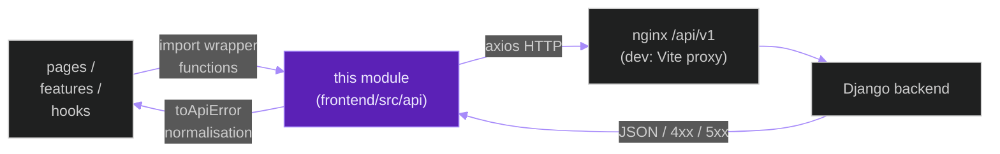
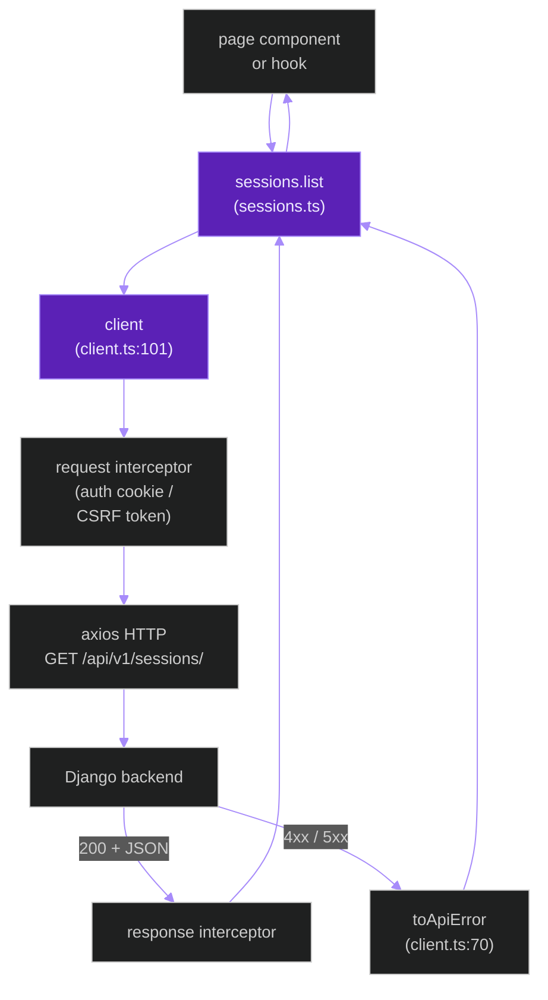
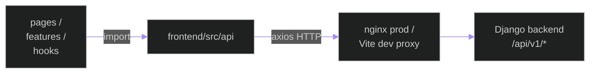
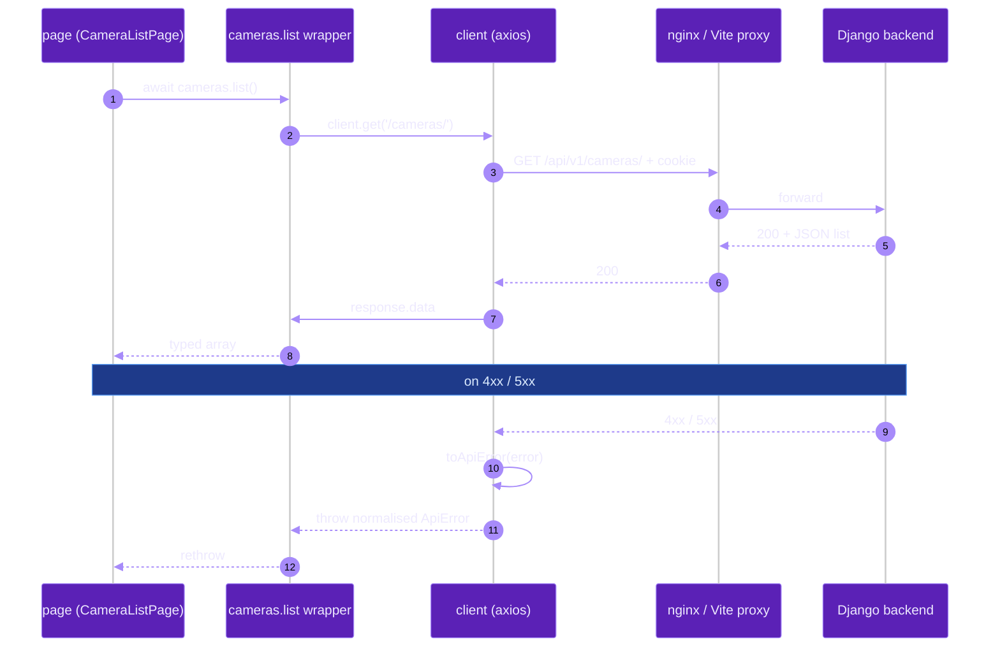

# `frontend/src/api`

**Last updated:** 2026-06-03
**Entity kind:** `module`
**Status:** `active`

> Frontend REST-client module. One axios instance (`client.ts`) +
> 13 per-domain wrapper files (`auth.ts`, `cameras.ts`, `sessions.ts`,
> `videoAnalysis.ts`, `detections.ts`, `anomalies.ts`, `recordings.ts`,
> `exports.ts`, `health.ts`, `dashboard.ts`, `runtime.ts`,
> `forensics.ts`, `admin.ts`). Every backend `/api/v1/*` route the
> SPA consumes goes through this module. Boundary contract published
> via `API_CLIENT_BOUNDARY_CONTRACT`.

## Source-of-truth references

| Kind | Reference |
|---|---|
| File | `frontend/src/api/client.ts` |
| File | `frontend/src/api/auth.ts` |
| File | `frontend/src/api/cameras.ts` |
| File | `frontend/src/api/sessions.ts` |
| File | `frontend/src/api/videoAnalysis.ts` |
| File | `frontend/src/api/detections.ts` |
| File | `frontend/src/api/anomalies.ts` |
| File | `frontend/src/api/recordings.ts` |
| File | `frontend/src/api/exports.ts` |
| File | `frontend/src/api/health.ts` |
| File | `frontend/src/api/dashboard.ts` |
| File | `frontend/src/api/runtime.ts` |
| File | `frontend/src/api/forensics.ts` |
| File | `frontend/src/api/admin.ts` |
| File | `frontend/src/api/README.md` |
| Symbol | `ApiClientBoundaryContract` (client.ts:19) |
| Symbol | `API_CLIENT_BOUNDARY_CONTRACT` (client.ts:29) |
| Symbol | `toApiError` (client.ts:70) |
| Symbol | `client` (default export, client.ts:101) — `AxiosInstance` reading `VITE_API_BASE_URL` |
| Commit | `423dbb76` (DSP Cycle 3 17/N — sibling `apps.telemetry_mcp`) |
| Workflow | `.github/workflows/inference-parallelization.yml` |
| Workflow | `.github/workflows/mermaid-diagrams.yml` |
| Doc | `docs/entity/systems/frontend_spa.md` (parent system) |
| Doc | `frontend/src/api/README.md` |

## 1. Purpose and scope

This module is the **only** place that does HTTP REST against the
Django backend from the SPA. It owns:

- **`client.ts`** — single `AxiosInstance` (default export at line 101)
  configured with `VITE_API_BASE_URL` (default `/api/v1`) +
  request/response interceptors + normalised error helper
  `toApiError` (70). Boundary contract published via
  `ApiClientBoundaryContract` interface (19) +
  `API_CLIENT_BOUNDARY_CONTRACT` value (29).
- **13 per-domain wrappers** — each file (`auth.ts`, `cameras.ts`,
  `sessions.ts`, `videoAnalysis.ts`, `detections.ts`, `anomalies.ts`,
  `recordings.ts`, `exports.ts`, `health.ts`, `dashboard.ts`,
  `runtime.ts`, `forensics.ts`, `admin.ts`) exports a set of typed
  async functions that call the backend through the shared `client`.
- **`README.md`** — per-folder index linked from Phase 9 of the
  README reading order.

It does NOT do WebSocket transport (that's `frontend/src/hooks/useWebSocket`)
or WHEP (`frontend/src/hooks/useWhepClient`).

## 2. Position in the system

## 3. Internal structure

| Path | Role |
|---|---|
| `client.ts` | The axios instance + interceptors + `toApiError` + boundary contract. Single source of HTTP truth. |
| `auth.ts` | login / logout / me / change-password wrappers (mirror of `apps.accounts/urls.py`). |
| `cameras.ts` | camera CRUD + ONVIF helpers (`apps.cameras`). |
| `sessions.ts` | session CRUD + start/stop + comments (`apps.sessions`). |
| `videoAnalysis.ts` | offline-job CRUD + status polling + frame retrieval (`apps.video_analysis`). Note: strips the `/api/v1` prefix the client adds (per comment line 55 in `videoAnalysis.ts`). |
| `detections.ts` | live `DetectionFrame` browse (`apps.detections`). |
| `anomalies.ts` | anomaly triage + BSIL views (`apps.anomalies`). |
| `recordings.ts` | recording CRUD (`apps.recordings`). |
| `exports.ts` | export initiate / status / download (`apps.exports`). |
| `health.ts` | health-check + dashboard + model-serving (`apps.health`). |
| `dashboard.ts` | dashboard tile aggregation (`apps.sessions/dashboard_urls`). |
| `runtime.ts` | runtime analytics (`apps.pipeline/views_runtime_analytics`). |
| `forensics.ts` | forensic queries (BSIL audit exports). |
| `admin.ts` | admin CRUD endpoints (`*_admin_urls.py`). |
| `README.md` | Per-folder index. |

## 4. Call graph (a page calls `sessions.list`)

## 5. External connections

## 6. API surface (functions exposed to consumers)

| Wrapper file | Public functions (typical shape) |
|---|---|
| `auth.ts` | `login`, `logout`, `me`, `changePassword` |
| `cameras.ts` | `list`, `create`, `update`, `delete`, `onvifResolve`, `onvifTest`, `onvifSync` |
| `sessions.ts` | `list`, `retrieve`, `create`, `start`, `stop`, `comments.list`, `comments.create` |
| `videoAnalysis.ts` | `jobs.list`, `jobs.create`, `jobs.status`, `jobs.results`, `jobs.frames.at`, `jobs.video.rendered`, `jobs.rerender`, `jobs.retry` |
| `detections.ts` | `frames.list`, `frames.retrieve`, `predictions.playback` |
| `anomalies.ts` | `list`, `acknowledge`, `dismiss`, `escalate`, `bsil.baselines.list`, `bsil.thresholdShifts.list`, `bsil.reviewLabels.*` |
| `recordings.ts` | `list`, `retrieve`, `create`, `delete` |
| `exports.ts` | `initiate`, `status`, `download` |
| `health.ts` | `check`, `dashboard`, `modelServing` |
| `dashboard.ts` | `summary`, `adminAnomalyFeed`, `adminActivityFeed` |
| `runtime.ts` | runtime analytics endpoints |
| `forensics.ts` | BSIL forensic-export wrappers |
| `admin.ts` | admin user + role + camera CRUD |

`client.ts` is also exported as the default `client` value, used
directly by hooks that need request-level control (timeout overrides,
custom headers).

## 7. Dependencies

| Dependency | Role | Pin (frontend/package.json) |
|---|---|---|
| `axios` | HTTP client | `^1.16.1` |
| `Vite` env (`import.meta.env`) | reads `VITE_API_BASE_URL` | per `^8.0.13` |
| `apps.contracts` backend governance | every wrapper's response type must match the governed-fields contract | internal (cross-stack) |

No reverse-app dependencies from the backend — this is a pure
consumer.

## 8. Environment variables read

| Variable | Default | Effect |
|---|---|---|
| `VITE_API_BASE_URL` | `/api/v1` (relative; proxied by nginx/Vite) | base URL for every wrapper |

## 9. Sequence diagram (page → wrapper → backend → page)

## 10. State machine

> Not applicable: stateless module per request.

## 11. Failure modes

| Failure | Detection | Recovery |
|---|---|---|
| 401 (session expired) | interceptor | page redirects to `/login` via Router error boundary |
| 5xx | `toApiError` normalises | page shows error UI (`ErrorBoundary`) |
| Network error | axios throws; `toApiError` normalises to `NETWORK_ERROR` | page shows offline banner; retry possible |
| `VITE_API_BASE_URL` mis-set | every request fails 404 / network | operator fixes env; rebuild Vite bundle |
| Response shape drift vs backend `governed_fields` | TypeScript compile-time + runtime errors in consumers | reconcile with backend serializer changes |

## 12. Performance characteristics

Axios overhead is negligible (~ms per call). Browser-to-backend RTT
dominates. No caching at this layer — caching is the consumer's job
(typically via Zustand stores or React-Query in higher layers).

## 13. Operational notes

- `videoAnalysis.ts` strips the `/api/v1` prefix because the
  client adds it (note at line 55) — this avoids double-prefixing
  on already-prefixed URLs returned from the backend.
- Every wrapper should use `toApiError` for error handling — never
  swallow exceptions.
- New backend `governed_fields` changes MUST be reflected in
  wrapper return types here, or the page-level TypeScript will
  silently widen.

## 14. Historical diagrams

> Not applicable: no diagrams in this doc have been superseded yet.

## 15. Related entities

| Entity | Path | Relationship |
|---|---|---|
| Frontend SPA | `docs/entity/systems/frontend_spa.md` | parent system |
| `frontend/src/hooks` | `docs/entity/modules/frontend.src.hooks.md` (planned next) | siblings (REST vs WS/WHEP transport layers) |
| Every backend app | `docs/entity/modules/apps.*.md` | each wrapper file maps 1-to-N onto a backend app's REST surface |

## 16. Open questions

- **Q1.** Should the 13 wrapper files be grouped into a single barrel `index.ts` so consumers can `import { cameras, sessions, ... } from '@/api'`? Currently per-file imports. *Owner:* frontend maintainer. *Target close:* DSP Cycle 6 code-level doc.
- **Q2.** Should `client.ts` add a request-id header (`X-Request-Id`) for cross-stack tracing? *Owner:* observability maintainer. *Target close:* next observability iteration.

## 17. Change log

| Date | What changed | Commit |
|---|---|---|
| 2026-06-03 | First version landed under DSP Cycle 3 (18 of ~18 modules — first frontend module). All 4 diagrams verified locally with `mmdc` per constitution § 19.3.1 before push. | (this commit) |
