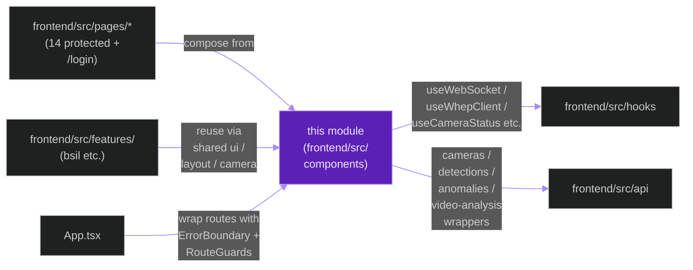
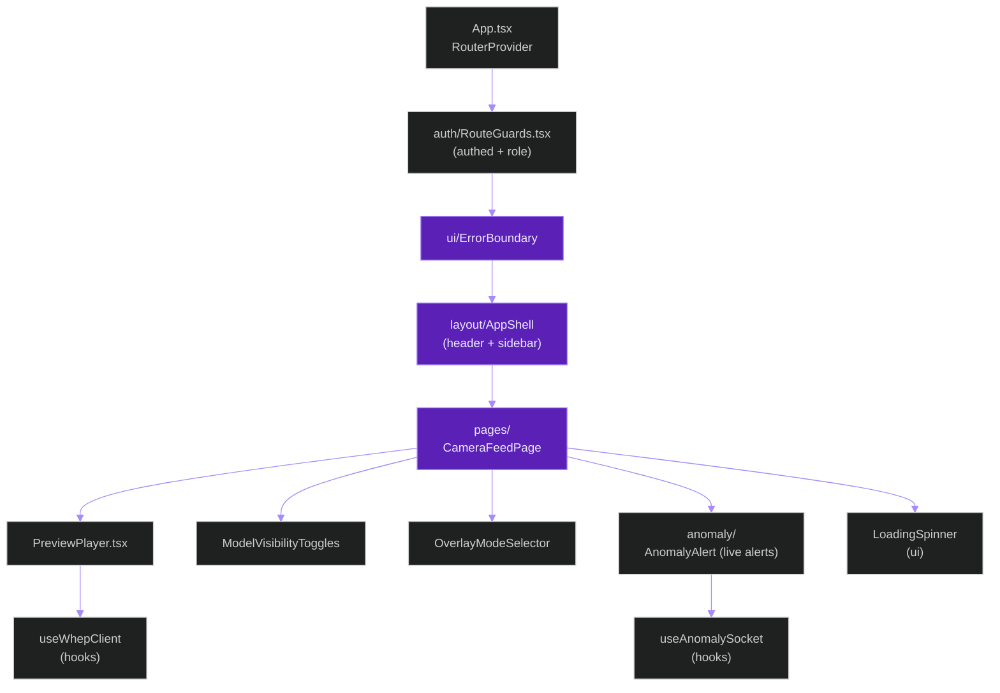
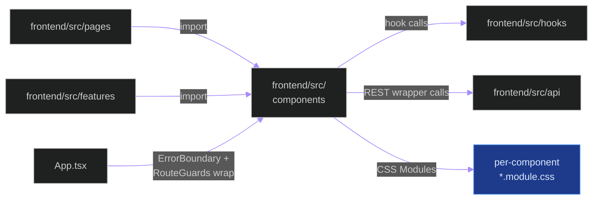
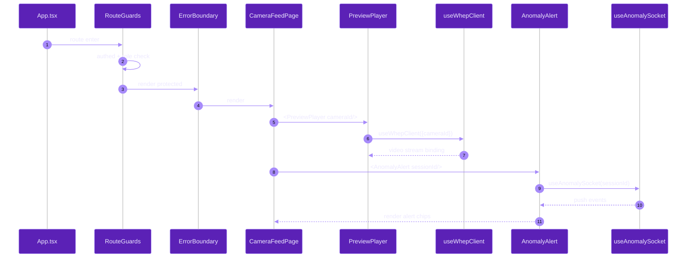

# `frontend/src/components`

**Last updated:** 2026-06-03
**Entity kind:** `module`
**Status:** `active`

> Frontend component library: 13 sub-folders + 2 top-level files
> covering every reusable React component the SPA renders.
> Includes the centralised UI primitives library (`ui/`), the
> `RouteGuards` (auth wrappers around protected pages), `VideoPlayer`
> with overlay-canvas, the camera + recording + detection + anomaly
> + health domain components, the upload-flow tab, and the layout
> shell.

## Source-of-truth references

| Kind | Reference |
|---|---|
| File | `frontend/src/components/PreviewPlayer.tsx` |
| File | `frontend/src/components/ModelVisibilityToggles/ModelVisibilityToggles.tsx` |
| File | `frontend/src/components/OverlayModeSelector/OverlayModeSelector.tsx` |
| File | `frontend/src/components/VideoPlayer/VideoPlayer.tsx` |
| File | `frontend/src/components/VideoPlayer/OverlayCanvas.tsx` |
| File | `frontend/src/components/VideoUploadTab/VideoUploadTab.tsx` |
| File | `frontend/src/components/VideoUploadTab/JobsList.tsx` |
| File | `frontend/src/components/anomaly/AnomalyAlert.tsx` |
| File | `frontend/src/components/anomaly/AlertHistory.tsx` |
| File | `frontend/src/components/anomaly/TriageActions.tsx` |
| File | `frontend/src/components/auth/RouteGuards.tsx` |
| File | `frontend/src/components/camera/AddCameraDialog.tsx` |
| File | `frontend/src/components/camera/README.md` |
| File | `frontend/src/components/detection/` (detection panel components) |
| File | `frontend/src/components/health/` (health-tile components) |
| File | `frontend/src/components/layout/` (app shell, header, sidebar) |
| File | `frontend/src/components/recording/` (recording-card components) |
| File | `frontend/src/components/ui/` (centralised UI primitives — `LoadingSpinner`, `ErrorBoundary`, dialog wrappers, etc.) |
| File | `frontend/src/components//<Comp>.module.css` (per-component scoped CSS modules) |
| Commit | `728b7766` (DSP Cycle 3 19/N — sibling `frontend.src.hooks`) |
| Workflow | `.github/workflows/inference-parallelization.yml` |
| Workflow | `.github/workflows/mermaid-diagrams.yml` |
| Doc | `docs/entity/systems/frontend_spa.md` |
| Doc | `frontend/src/components/camera/README.md` |

## 1. Purpose and scope

This module is the SPA's **component library**. Concretely:

- **13 sub-folders** plus 2 top-level files (`PreviewPlayer.tsx`,
  inferred via `git ls-files`).
- **`ui/`** — centralised primitives used by every page per FR-033:
  `LoadingSpinner`, `ErrorBoundary` (consumed by `App.tsx:28,71` per
  the frontend SPA system doc), modal/dialog wrappers, button/badge
  helpers.
- **`auth/RouteGuards.tsx`** — React Router wrappers that gate
  protected routes; consumes the backend's auth state via
  `useAuth`.
- **`layout/`** — header + sidebar + app-shell + responsive
  containers.
- **`VideoPlayer/`** — `VideoPlayer.tsx` + `OverlayCanvas.tsx`: the
  per-frame detection overlay drawer used by both live + offline
  views.
- **`VideoUploadTab/`** — `VideoUploadTab.tsx` + `JobsList.tsx`: the
  offline-job upload + job-list views.
- **`PreviewPlayer.tsx`** — shared `<video>` wrapper used by the
  camera-feed page (WHEP target).
- **`ModelVisibilityToggles/`** — per-model on/off toggles for the
  overlay canvas.
- **`OverlayModeSelector/`** — overlay-mode picker (full / pose /
  none).
- **Domain folders** (`anomaly/`, `camera/`, `detection/`,
  `health/`, `recording/`) — page-specific components composing
  pages + `ui/` primitives.

Per-component scoped CSS via `*.module.css` files (CSS Modules,
not global). Total: 79 tracked source files in the folder.

It does NOT do HTTP / WS transport (that's `frontend/src/api` and
`frontend/src/hooks`) or page composition + routing (that's
`frontend/src/pages` + `App.tsx`).

## 2. Position in the system

## 3. Internal structure

| Path | Role |
|---|---|
| `ui/` | Centralised primitives (FR-033) — `LoadingSpinner`, `ErrorBoundary`, modals, buttons. Used by every page. |
| `auth/RouteGuards.tsx` | React Router wrappers for protected routes (auth + role gating). |
| `layout/` | App shell — header, sidebar (collapsible per FR-037), responsive containers. |
| `VideoPlayer/` | `VideoPlayer.tsx` HTML video host + `OverlayCanvas.tsx` per-frame detection overlay drawer. Used by live + offline views. |
| `VideoUploadTab/` | `VideoUploadTab.tsx` upload flow + `JobsList.tsx` list of offline jobs. |
| `PreviewPlayer.tsx` | Shared `<video>` wrapper used by `CameraFeedPage` for WHEP previews. |
| `ModelVisibilityToggles/` | Per-model on/off toggles fed into `OverlayCanvas`. |
| `OverlayModeSelector/` | Picker (full / pose / none) fed into `OverlayCanvas`. |
| `anomaly/AnomalyAlert.tsx` + `AlertHistory.tsx` + `TriageActions.tsx` | Live anomaly UI components used by `AnomalyListPage`. |
| `camera/AddCameraDialog.tsx` + `README.md` | Camera-add dialog (ONVIF flow). |
| `detection/` | Live detection panel components. |
| `health/` | Health-tile components used by the dashboard + health page. |
| `recording/` | Recording-card components used by the recordings list. |
| `*.module.css` | CSS Modules — per-component scoped styling. |

## 4. Call graph (CameraFeedPage composes from this module)

## 5. External connections

## 6. API surface (component exports)

This module is a React-component library; its public surface is the
named exports from each sub-folder's `<Component>.tsx`. Sample
exports consumed by pages:

| Sub-folder | Key exports |
|---|---|
| `ui/` | `LoadingSpinner`, `ErrorBoundary`, dialog wrappers, button helpers |
| `auth/` | `ProtectedRoute`, `RoleGate` (per `RouteGuards.tsx`) |
| `layout/` | `AppShell`, `Header`, `Sidebar` |
| `VideoPlayer/` | `VideoPlayer`, `OverlayCanvas` |
| `VideoUploadTab/` | `VideoUploadTab`, `JobsList` |
| (top-level) | `PreviewPlayer` |
| `ModelVisibilityToggles/` | `ModelVisibilityToggles` |
| `OverlayModeSelector/` | `OverlayModeSelector` |
| `anomaly/` | `AnomalyAlert`, `AlertHistory`, `TriageActions` |
| `camera/` | `AddCameraDialog` |
| `detection/`, `health/`, `recording/` | per-domain components |

## 7. Dependencies

| Dependency | Role | Pin |
|---|---|---|
| `react` | UI runtime | `^19.2.6` |
| `react-router` (v7) | `RouteGuards` integration | per `package.json` |
| `zustand` | per-page state stores (composable from components) | `^5.0.13` |
| `frontend/src/api` | REST wrappers | internal |
| `frontend/src/hooks` | WS/WHEP/auth/bulk-failure hooks | internal |
| CSS Modules (`*.module.css`) | scoped styling | Vite built-in |

## 8. Environment variables read

None directly — components consume hooks/API wrappers which read
the `VITE_*` env vars.

## 9. Sequence diagram (CameraFeedPage renders with live + WHEP)

## 10. State machine

> Not applicable: components are stateless or per-instance React
> state — no module-wide lifecycle.

## 11. Failure modes

| Failure | Detection | Recovery |
|---|---|---|
| Underlying hook error (WS/REST) | `ErrorBoundary` catches | UI shows error fallback per FR-036 |
| Missing `cameraId` / `sessionId` prop | runtime TypeError | TypeScript prop typing prevents at compile time |
| CSS Modules class name mismatch | visual regression | Playwright e2e + Vitest snapshot tests |
| Component overflows 1920×1080 baseline (FR-037) | manual / automated visual check | layout reflow at component level |

## 12. Performance characteristics

React 19 + Vite build. Component re-render cost is the dominant
metric per-page. Heavy components (`OverlayCanvas` per-frame draw,
`JobsList` for many jobs) memoise hot data via `useMemo` /
`useCallback`. WCAG keyboard nav (per `useKeyboardNav` from hooks)
is integrated at the layout shell.

## 13. Operational notes

- `ui/` is the canonical home for cross-page primitives — never
  copy-paste a `<LoadingSpinner>` or `<ErrorBoundary>` into a
  page; import from `ui/` per FR-033.
- `auth/RouteGuards.tsx` wraps every protected route declared in
  `App.tsx`; bypassing it is a security regression.
- CSS Modules scope class names per-component — global styles
  belong in `frontend/src/index.css` (not here).
- The component library is **TypeScript-strict** — `any` types
  are reviewed-out at PR time.

## 14. Historical diagrams

> Not applicable: no diagrams in this doc have been superseded yet.

## 15. Related entities

| Entity | Path | Relationship |
|---|---|---|
| Frontend SPA | `docs/entity/systems/frontend_spa.md` | parent system |
| `frontend/src/api` | `docs/entity/modules/frontend.src.api.md` | upstream — REST wrappers |
| `frontend/src/hooks` | `docs/entity/modules/frontend.src.hooks.md` | upstream — WS/WHEP/auth hooks |
| `frontend/src/features/bsil` | `docs/entity/modules/frontend.src.features.bsil.md` (planned next) | consumer of components |

## 16. Open questions

- **Q1.** Should `ui/` be promoted to a separately-versioned package (e.g., `@app/ui`) for cross-app reuse? Currently in-tree. *Owner:* frontend maintainer. *Target close:* future component-extraction iteration.
- **Q2.** `RouteGuards.tsx` currently calls `useAuth` on every protected mount. Should it cache the auth check at the router level? *Owner:* frontend maintainer. *Target close:* DSP Cycle 6 code-level doc.

## 17. Change log

| Date | What changed | Commit |
|---|---|---|
| 2026-06-03 | First version landed under DSP Cycle 3 (20 of ~21 modules). All 4 diagrams verified locally with `mmdc` per constitution § 19.3.1 before push. | (this commit) |
