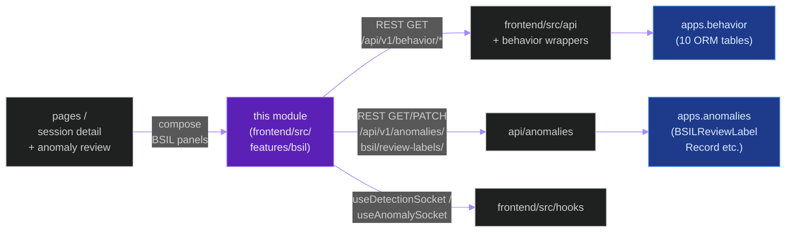
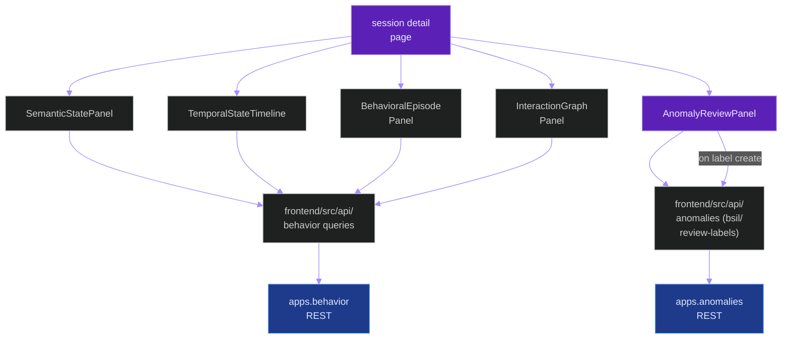
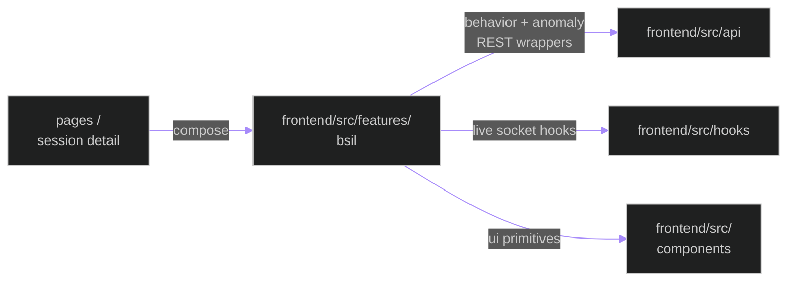
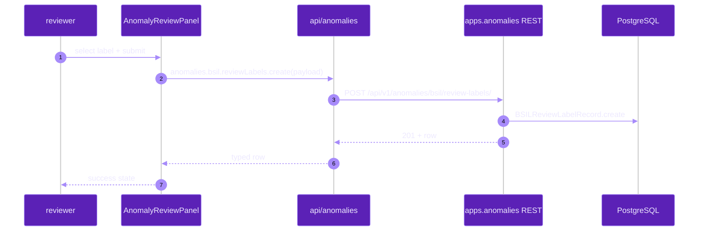

# `frontend/src/features/bsil`

**Last updated:** 2026-06-03
**Entity kind:** `module`
**Status:** `active`

> Frontend BSIL (Behavioral Semantic Inference Layer) feature
> module. 5 panel components rendering the BSIL data exposed by
> `apps.behavior` + `apps.anomalies`: semantic-pose state, temporal-
> state timeline, behavioral-episode panel, interaction-graph
> panel, anomaly-review panel. Closes DSP Cycle 3.

## Source-of-truth references

| Kind | Reference |
|---|---|
| File | `frontend/src/features/bsil/AnomalyReviewPanel.tsx` |
| File | `frontend/src/features/bsil/BehavioralEpisodePanel.tsx` |
| File | `frontend/src/features/bsil/InteractionGraphPanel.tsx` |
| File | `frontend/src/features/bsil/SemanticStatePanel.tsx` |
| File | `frontend/src/features/bsil/TemporalStateTimeline.tsx` |
| File | `frontend/src/features/bsil/README.md` |
| Commit | `d878aed1` (DSP Cycle 3 20/N — sibling `frontend.src.components`) |
| Workflow | `.github/workflows/inference-parallelization.yml` |
| Workflow | `.github/workflows/mermaid-diagrams.yml` |
| Doc | `docs/entity/modules/apps.behavior.md` (backend BSIL implementation) |
| Doc | `docs/entity/modules/apps.anomalies.md` (sibling — anomaly triage + BSIL governance tables) |
| Doc | `frontend/src/features/bsil/README.md` |

## 1. Purpose and scope

This module is the BSIL **UI**. It owns 5 panel components that
render the behavioral evidence produced by the backend BSIL
implementation (`apps.behavior` + `apps.anomalies`):

- **`SemanticStatePanel.tsx`** — current semantic-pose state per
  student (per `apps.behavior.models.SemanticPoseState`).
- **`TemporalStateTimeline.tsx`** — per-session timeline of
  `TemporalSequenceRecord` + window transitions (per
  `apps.behavior.temporal.*`).
- **`BehavioralEpisodePanel.tsx`** — episode lifecycle viewer
  (per `apps.behavior.episodes.*` + `EpisodeLifecycle` enum).
- **`InteractionGraphPanel.tsx`** — attention + interaction-edge
  graph visualisation (per `apps.behavior.graph.*`).
- **`AnomalyReviewPanel.tsx`** — review-label assignment UI tied
  to `apps.anomalies.models.BSILReviewLabelRecord`.
- **`README.md`** — per-folder index linked from Phase 9 reading
  order.

It does NOT do BSIL math (that's `apps.behavior` backend) or
anomaly triage primitives (that's `apps.anomalies` backend +
sibling `anomaly/` UI folder under `frontend/src/components`).

## 2. Position in the system

## 3. Internal structure

| Path | Role |
|---|---|
| `SemanticStatePanel.tsx` | Renders current per-student semantic-pose state. |
| `TemporalStateTimeline.tsx` | Per-session timeline of temporal-state transitions + windows. |
| `BehavioralEpisodePanel.tsx` | Episode lifecycle viewer (emerging → active → sustained → resolving → closed). |
| `InteractionGraphPanel.tsx` | Attention + interaction-edge graph visualisation. |
| `AnomalyReviewPanel.tsx` | Review-label assignment UI for `BSILReviewLabelRecord` writes. |
| `README.md` | Per-folder index (BSIL feature overview). |

## 4. Call graph (session-detail page composes BSIL panels)

## 5. External connections

## 6. API surface (component exports)

| Component | Purpose |
|---|---|
| `SemanticStatePanel` | per-student current semantic-pose state |
| `TemporalStateTimeline` | session timeline of temporal transitions |
| `BehavioralEpisodePanel` | episode lifecycle viewer |
| `InteractionGraphPanel` | attention + interaction-edge graph |
| `AnomalyReviewPanel` | review-label assignment UI |

## 7. Dependencies

| Dependency | Role | Pin |
|---|---|---|
| `react` | UI runtime | `^19.2.6` |
| `frontend/src/api` | behavior + anomalies REST wrappers | internal |
| `frontend/src/hooks` | live socket hooks where needed | internal |
| `frontend/src/components/ui` | primitives (LoadingSpinner, modals) | internal |
| `apps.behavior` (backend) | data source for 4 of the 5 panels | internal (cross-stack) |
| `apps.anomalies` (backend) | data source for `AnomalyReviewPanel` | internal (cross-stack) |

## 8. Environment variables read

None directly — inherits from `frontend/src/api` (`VITE_API_BASE_URL`).

## 9. Sequence diagram (`AnomalyReviewPanel` writes a review label)

## 10. State machine

> Not applicable: per-panel local state only; no module-wide lifecycle.

## 11. Failure modes

| Failure | Detection | Recovery |
|---|---|---|
| Backend REST 4xx/5xx | wrappers throw `ApiError` | panel shows error UI via `ErrorBoundary` (FR-036) |
| Stale BSIL ontology version (label list mismatch) | reviewer sees unknown labels | refresh `BehaviorOntologyVersion`; reload page |
| Permission denied (non-reviewer role tries to write) | 403 from backend | UI hides write controls; read-only fallback |
| Large interaction graph | render slowdown | panel paginates / clusters; backend filter via bounds |

## 12. Performance characteristics

Pure read + occasional write. No live-frame hot path. Big graphs
are paginated or sub-sampled at the panel level.

## 13. Operational notes

- The BSIL ontology is versioned by `apps.behavior.models.BehaviorOntologyVersion`;
  the SPA does not pin a version — it reads the active one. Major
  version changes require a frontend type update + redeploy.
- `AnomalyReviewPanel` is the only write surface in this module —
  read-write isolation matches the `apps.anomalies` role policy.

## 14. Historical diagrams

> Not applicable: no diagrams in this doc have been superseded yet.

## 15. Related entities

| Entity | Path | Relationship |
|---|---|---|
| `apps.behavior` | `docs/entity/modules/apps.behavior.md` | upstream backend (10 ORM tables, 5 sub-packages) |
| `apps.anomalies` | `docs/entity/modules/apps.anomalies.md` | upstream backend (review-label persistence) |
| `frontend/src/api` | `docs/entity/modules/frontend.src.api.md` | REST wrappers consumed |
| `frontend/src/hooks` | `docs/entity/modules/frontend.src.hooks.md` | live-data hooks |
| `frontend/src/components` | `docs/entity/modules/frontend.src.components.md` | UI primitives |
| Frontend SPA | `docs/entity/systems/frontend_spa.md` | parent system |

## 16. Open questions

- **Q1.** Should `InteractionGraphPanel` use a graph library (e.g. d3 / cytoscape) or a hand-rolled SVG layout? Currently hand-rolled. *Owner:* frontend BSIL maintainer. *Target close:* DSP Cycle 6 code-level doc.
- **Q2.** Should the 5 panels share a `BsilSessionProvider` context to dedupe REST queries? Currently each panel fetches independently. *Owner:* frontend maintainer. *Target close:* next BSIL-UX iteration.

## 17. Change log

| Date | What changed | Commit |
|---|---|---|
| 2026-06-03 | First version landed under DSP Cycle 3 (21 of 21 — Cycle 3 CLOSED). All 4 diagrams verified locally with `mmdc` per constitution § 19.3.1 before push. | (this commit) |
