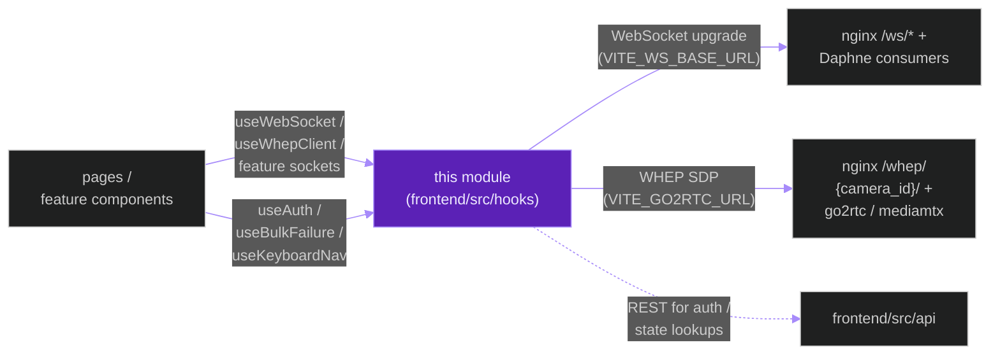
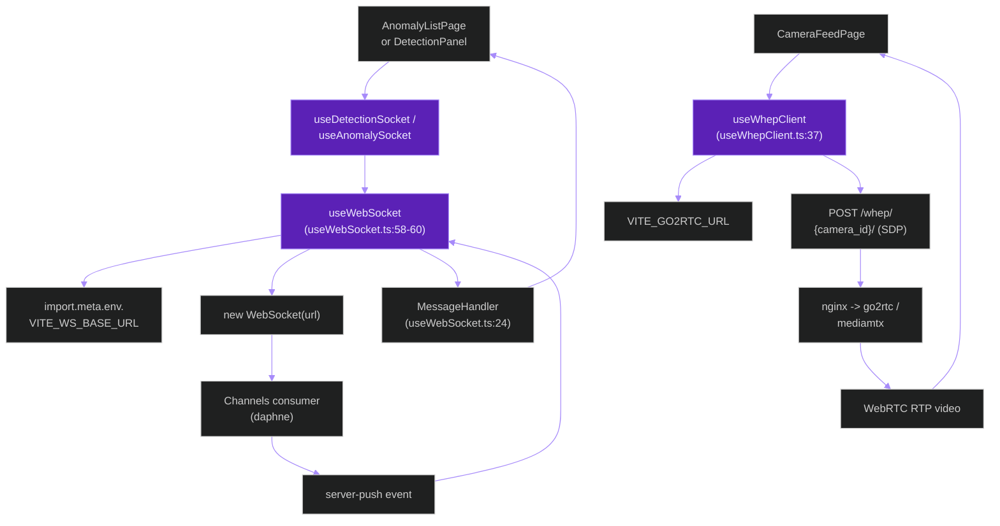
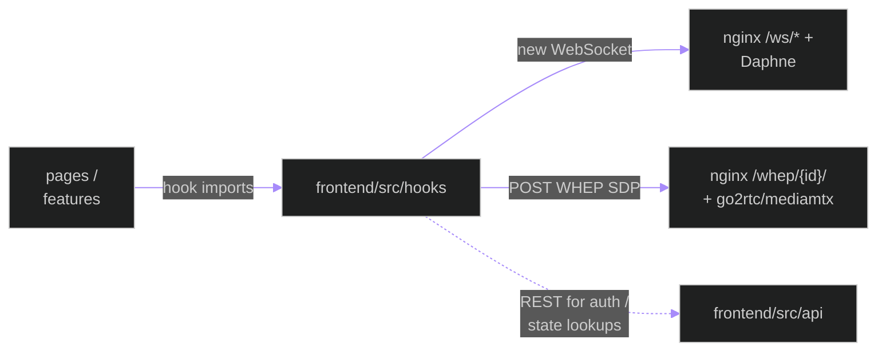
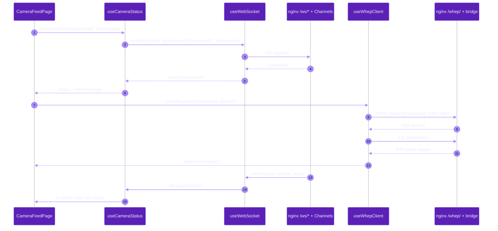
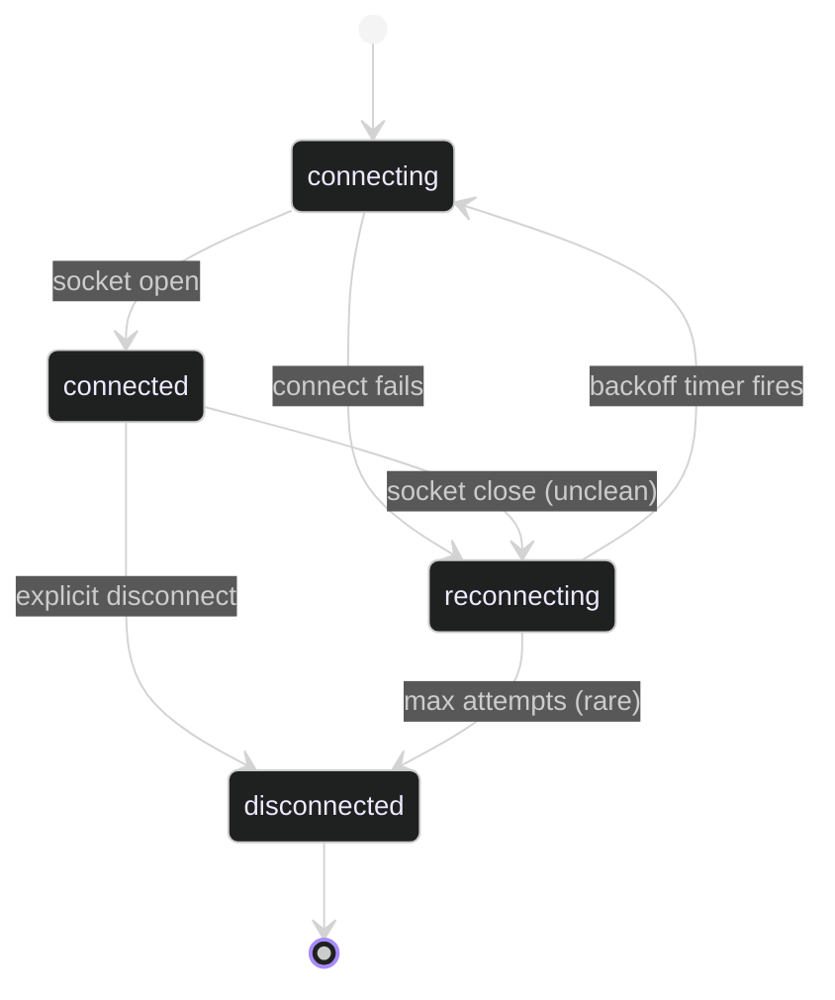

# `frontend/src/hooks`

**Last updated:** 2026-06-03
**Entity kind:** `module`
**Status:** `active`

> Frontend React-hook layer for WebSocket + WHEP + auth + bulk
> failure handling + live-session overlay state + keyboard
> navigation. Built on top of `frontend/src/api` (REST) and the
> backend's `/ws/*` + `/whep/{camera_id}/` routes. Every page that
> needs live data subscribes here.

## Source-of-truth references

| Kind | Reference |
|---|---|
| File | `frontend/src/hooks/useWebSocket.ts` |
| File | `frontend/src/hooks/useWhepClient.ts` |
| File | `frontend/src/hooks/useDetectionSocket.ts` |
| File | `frontend/src/hooks/useAnomalySocket.ts` |
| File | `frontend/src/hooks/useCameraStatus.ts` |
| File | `frontend/src/hooks/useHealthSocket.ts` |
| File | `frontend/src/hooks/useAuth.ts` |
| File | `frontend/src/hooks/useBulkFailure.ts` |
| File | `frontend/src/hooks/useKeyboardNav.ts` |
| File | `frontend/src/hooks/useLiveSessionOverlay.ts` |
| File | `frontend/src/hooks/useVideoAnalysisLive.ts` |
| File | `frontend/src/hooks/__tests__/useRuntimeSocket.versioning.test.ts` |
| File | `frontend/src/hooks/README.md` |
| Symbol | `WsStatus` (useWebSocket.ts:22) |
| Symbol | `MessageHandler` (useWebSocket.ts:24) |
| Symbol | `UseWebSocketOptions` (useWebSocket.ts:26) |
| Symbol | `UseWebSocketReturn` (useWebSocket.ts:37) |
| Symbol | `useWebSocket` (overloaded, useWebSocket.ts:58-60) |
| Symbol | `WhepStatus` (useWhepClient.ts:16) |
| Symbol | `UseWhepClientOptions` (useWhepClient.ts:18) |
| Symbol | `UseWhepClientReturn` (useWhepClient.ts:27) |
| Symbol | `useWhepClient` (useWhepClient.ts:37) |
| Commit | `889cf3c5` (DSP Cycle 3 18/N — sibling `frontend.src.api`) |
| Workflow | `.github/workflows/inference-parallelization.yml` |
| Workflow | `.github/workflows/mermaid-diagrams.yml` |
| Doc | `docs/entity/systems/frontend_spa.md` (parent system) |
| Doc | `docs/entity/modules/frontend.src.api.md` (sibling REST layer) |
| Doc | `frontend/src/hooks/README.md` |

## 1. Purpose and scope

This module is the **live-transport** React-hook layer. It owns:

- **`useWebSocket`** (`useWebSocket.ts:58-60`) — typed WebSocket
  manager with `WsStatus` enum (22), `MessageHandler` (24),
  `UseWebSocketOptions` (26), `UseWebSocketReturn` (37). Two
  overloads: `(path, onMessage?)` short-form and `(options)` full
  form. Reads `VITE_WS_BASE_URL`. Exponential-backoff reconnect.
- **`useWhepClient`** (`useWhepClient.ts:37`) — WHEP/WebRTC
  consumer with `WhepStatus` enum (16), `UseWhepClientOptions` (18),
  `UseWhepClientReturn` (27). Reads `VITE_GO2RTC_URL`. Used by the
  camera-feed page for low-latency preview.
- **3 feature-wrapped sockets** built on `useWebSocket`:
  `useDetectionSocket` (for `/ws/detections/{session_id}/`),
  `useAnomalySocket` (for `/ws/anomalies/{session_id}/`),
  `useCameraStatus` (for `/ws/cameras/{camera_id}/`).
- **`useHealthSocket`** for `/ws/health/`.
- **`useAuth`** — wraps `apps.accounts` REST flow (login state,
  CSRF refresh, logout).
- **`useBulkFailure`** — UI helper that batches and surfaces bulk
  operation errors without overwhelming the user.
- **`useLiveSessionOverlay`** + **`useVideoAnalysisLive`** —
  feature-level overlays consuming detection + anomaly sockets.
- **`useKeyboardNav`** — WCAG keyboard-navigation helper.
- **1 test file**: `__tests__/useRuntimeSocket.versioning.test.ts`
  (governs runtime-socket payload versioning).
- **`README.md`** — per-folder index.

It does NOT do REST (that's `frontend/src/api`) or page composition
(that's `frontend/src/pages` + `frontend/src/components`).

## 2. Position in the system

## 3. Internal structure

| Path | Role |
|---|---|
| `useWebSocket.ts` | The transport heart. Types (22, 24, 26, 37) + two-overload entry (58-60). Reads `VITE_WS_BASE_URL`. Backoff reconnect with jitter. |
| `useWhepClient.ts` | WHEP/WebRTC consumer. Types (16, 18, 27) + entry (37). Reads `VITE_GO2RTC_URL`. |
| `useDetectionSocket.ts` | Feature wrapper over `useWebSocket` for `/ws/detections/{session_id}/`. |
| `useAnomalySocket.ts` | Same pattern for `/ws/anomalies/{session_id}/`. |
| `useCameraStatus.ts` | Same pattern for `/ws/cameras/{camera_id}/`. |
| `useHealthSocket.ts` | Same pattern for `/ws/health/`. |
| `useAuth.ts` | Wraps `api/auth.ts` login/logout/me; reactive auth state. |
| `useBulkFailure.ts` | Batches bulk-operation errors for the UI. |
| `useLiveSessionOverlay.ts` | Higher-level live session overlay using detection + anomaly sockets. |
| `useVideoAnalysisLive.ts` | Live overlay for offline-job processing (uses `/ws/video-analysis/`). |
| `useKeyboardNav.ts` | WCAG keyboard-navigation helper. |
| `__tests__/useRuntimeSocket.versioning.test.ts` | Vitest unit test ensuring runtime-socket payloads match the published versioning contract. |
| `README.md` | Per-folder index. |

## 4. Call graph (page → feature socket → useWebSocket → backend)

## 5. External connections

## 6. API surface (functions exposed to consumers)

| Hook | Where defined | Purpose |
|---|---|---|
| `useWebSocket(path, onMessage?)` / `useWebSocket(options)` | useWebSocket.ts:58-60 | typed WS manager with reconnect |
| `useWhepClient(options)` | useWhepClient.ts:37 | WHEP/WebRTC consumer |
| `useDetectionSocket(sessionId, onMessage)` | useDetectionSocket.ts | feature wrapper |
| `useAnomalySocket(sessionId, onMessage)` | useAnomalySocket.ts | feature wrapper |
| `useCameraStatus(cameraId, onMessage)` | useCameraStatus.ts | feature wrapper |
| `useHealthSocket(onMessage)` | useHealthSocket.ts | feature wrapper |
| `useVideoAnalysisLive(jobId, onMessage)` | useVideoAnalysisLive.ts | offline-job live overlay |
| `useLiveSessionOverlay(sessionId)` | useLiveSessionOverlay.ts | composite live overlay |
| `useAuth()` | useAuth.ts | reactive auth state + login/logout |
| `useBulkFailure()` | useBulkFailure.ts | batched bulk-error surface |
| `useKeyboardNav()` | useKeyboardNav.ts | WCAG keyboard nav |

## 7. Dependencies

| Dependency | Role | Pin |
|---|---|---|
| `react` | hooks runtime | `^19.2.6` |
| `Vite` env (`import.meta.env`) | reads `VITE_WS_BASE_URL`, `VITE_GO2RTC_URL` | per `^8.0.13` |
| Browser `WebSocket` + `RTCPeerConnection` | transport primitives | browser-native |
| `frontend/src/api` | REST calls for auth + state lookups | internal |

## 8. Environment variables read

| Variable | Default | Effect |
|---|---|---|
| `VITE_WS_BASE_URL` | derived from `window.location` | base for `useWebSocket` URLs |
| `VITE_GO2RTC_URL` | `http://localhost:1984` | WHEP origin for `useWhepClient` |

## 9. Sequence diagram (CameraFeedPage subscribes + WHEP preview)

## 10. State machine (`WsStatus` for `useWebSocket`)

## 11. Failure modes

| Failure | Detection | Recovery |
|---|---|---|
| WS connection drops mid-stream | `onclose` handler | exponential-backoff reconnect with jitter; status → `reconnecting` |
| Server closes WS with 4001 (auth expired) | `onclose` code | hook hands off to `useAuth` which redirects to `/login` |
| WHEP SDP exchange fails | `useWhepClient` promise rejection | status → `error`; UI shows preview unavailable + retry button |
| `VITE_WS_BASE_URL` derivation fails (unusual nginx routes) | first WS connect fails | per system doc Q1 — explicit env override needed |
| Message handler throws | logged but not re-thrown (so the socket stays alive) | per-handler bug; fix |
| Runtime-socket payload version drift | `__tests__/useRuntimeSocket.versioning.test.ts` fails in CI | bump frontend type and matching backend serializer |

## 12. Performance characteristics

WebSocket overhead is per-frame negligible (server-push pattern,
no client-side polling). WHEP first-frame latency is the dominant
UX metric — target sub-500ms glass-to-glass at 720p; depends on
the camera bridge, not this module.

## 13. Operational notes

- Every feature socket wraps `useWebSocket` — never `new WebSocket`
  directly anywhere else in the SPA.
- `useWebSocket` reconnect jitter prevents thundering-herd when
  many tiles disconnect simultaneously (e.g. backend restart).
- The runtime-socket versioning test in `__tests__/` MUST pass in
  CI before backend serializer changes ship — it catches contract
  drift between backend events and frontend handlers.

## 14. Historical diagrams

> Not applicable: no diagrams in this doc have been superseded yet.

## 15. Related entities

| Entity | Path | Relationship |
|---|---|---|
| Frontend SPA | `docs/entity/systems/frontend_spa.md` | parent system |
| `frontend/src/api` | `docs/entity/modules/frontend.src.api.md` | sibling — REST vs WS/WHEP transport layers |
| `apps.detections` / `apps.anomalies` / `apps.cameras` / `apps.health` | backend module docs | each exposes a `/ws/*` consumer this module subscribes to |
| Camera streaming bridge | `docs/entity/systems/camera_streaming_bridge.md` | WHEP source for `useWhepClient` |
| `useWebSocket.ts` code | `docs/entity/code/frontend.src.hooks.useWebSocket.md` (planned DSP Cycle 6) | hot file |

## 16. Open questions

- **Q1.** Per-tile WHEP retry currently independent; should there be a global circuit-breaker for permanently-failing cameras? (Mirrors frontend SPA system doc Q2.) *Owner:* frontend + live-runtime maintainers. *Target close:* next bridge release.
- **Q2.** Should `useWebSocket` accept an `AbortController` for explicit teardown (currently teardown is component-unmount-driven)? *Owner:* frontend maintainer. *Target close:* DSP Cycle 6 code-level doc.

## 17. Change log

| Date | What changed | Commit |
|---|---|---|
| 2026-06-03 | First version landed under DSP Cycle 3 (19 of ~21 modules). All 5 diagrams verified locally with `mmdc` per constitution § 19.3.1 before push. | (this commit) |
