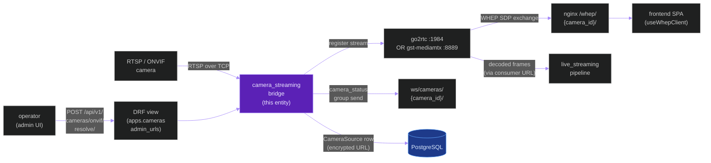
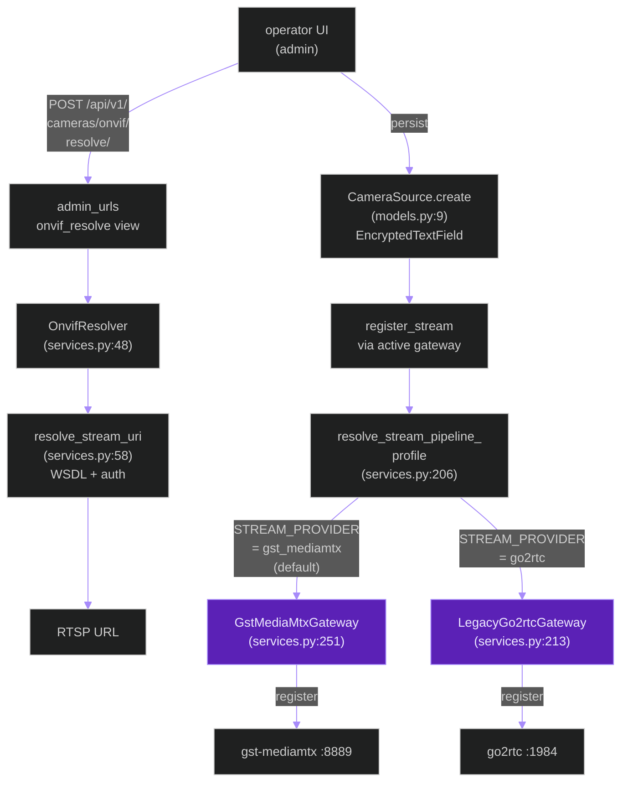
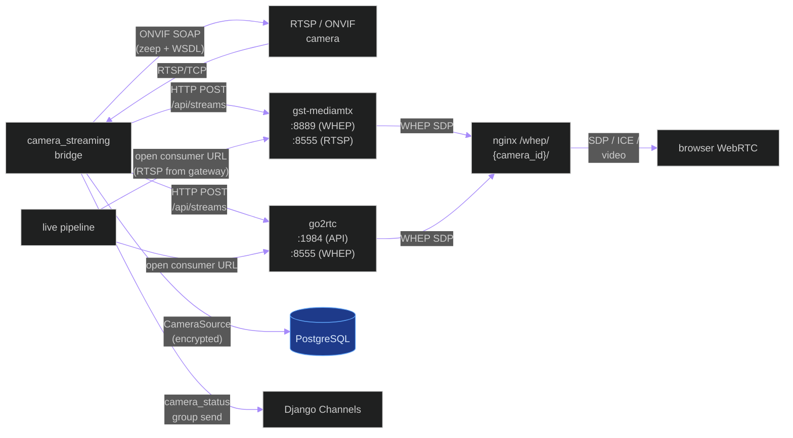
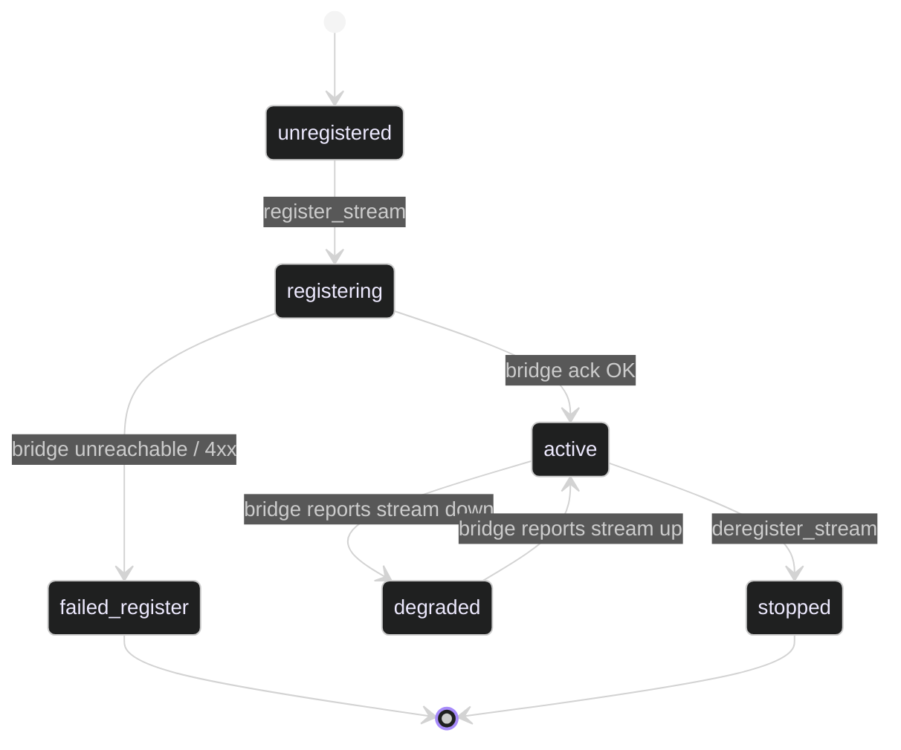

# `camera_streaming_bridge`

**Last updated:** 2026-06-02
**Entity kind:** `system`
**Status:** `active`

> Camera ingestion + low-latency preview bridge. Resolves ONVIF-
> discovered devices to RTSP, registers the RTSP source with either
> the legacy go2rtc relay or the active gst-mediamtx gateway, and
> exposes the stream to the browser via WHEP (WebRTC) through the
> nginx `/whep/{camera_id}/` proxy. The live inference pipeline
> consumes the same registered stream as decoded frames; the browser
> consumes the WHEP endpoint for low-latency preview.

## Source-of-truth references

| Kind | Reference |
|---|---|
| File | `backend/apps/cameras/services.py` |
| File | `backend/apps/cameras/models.py` |
| File | `backend/apps/cameras/fields.py` |
| File | `backend/apps/cameras/gateway.py` |
| File | `backend/apps/cameras/routing.py` |
| File | `backend/apps/cameras/consumers.py` |
| File | `backend/apps/cameras/constants.py` |
| File | `backend/apps/cameras/exceptions.py` |
| File | `backend/apps/cameras/admin_urls.py` |
| File | `backend/apps/cameras/boundary.py` |
| File | `backend/apps/cameras/migrations/0001_initial.py` |
| File | `backend/apps/cameras/migrations/0002_connection_foundation.py` |
| File | `backend/apps/cameras/migrations/0003_encrypt_existing_urls.py` |
| File | `frontend/vite.config.ts` |
| File | `nginx.conf` |
| File | `docs/go2rtc.md` |
| File | `docs/nginx.md` |
| Symbol | `apps.cameras.services.OnvifResolver` (line 48) |
| Symbol | `apps.cameras.services.OnvifResolver.resolve_stream_uri` (line 58) |
| Symbol | `apps.cameras.services.resolve_camera_source_url` (line 124) |
| Symbol | `apps.cameras.services.StreamGateway` (Protocol, line 175) |
| Symbol | `apps.cameras.services.LegacyGo2rtcGateway` (line 213) |
| Symbol | `apps.cameras.services.GstMediaMtxGateway` (line 251) |
| Symbol | `apps.cameras.services.resolve_stream_pipeline_profile` (line 206) |
| Symbol | `apps.cameras.models.CameraSource` (line 9) |
| Symbol | `apps.cameras.fields.EncryptedTextField` |
| Symbol | `apps.cameras.fields.build_connection_url_hash` |
| Commit | `823a339d` (DSP Cycle 2 4/N — sibling telemetry doc) |
| Workflow | `.github/workflows/inference-parallelization.yml` |

## 1. Purpose and scope

The bridge sits between cameras (RTSP / ONVIF) and the rest of the
system. Its responsibilities:

1. **ONVIF resolution** — `OnvifResolver.resolve_stream_uri` takes a
   `connection_url` to an ONVIF device service and returns the
   actual RTSP URL, using credentials from `ONVIF_USERNAME` /
   `ONVIF_PASSWORD` / WSDL files at `ONVIF_WSDL_DIR`.
2. **Camera-source registration** — `resolve_camera_source_url`
   normalises the URL (decrypt from `EncryptedTextField`, force TCP
   transport per `PYRAMID_RTSP_OVER_TCP`).
3. **Stream gateway selection** — `resolve_stream_pipeline_profile`
   picks between `LegacyGo2rtcGateway` (`STREAM_PROVIDER=go2rtc`) and
   `GstMediaMtxGateway` (`STREAM_PROVIDER=gst_mediamtx`, the default),
   with per-camera overrides via `STREAM_PROVIDER_CAMERA_IDS`.
4. **WHEP proxy plumbing** — exposes the registered stream to the
   browser at `/whep/{camera_id}/`; in dev via `frontend/vite.config.ts`
   proxy, in prod via the `nginx.conf` `location ~ ^/whep/(?<camera_id>...)$`
   block.
5. **Camera-status WebSocket** — `apps.cameras.consumers.CameraStatusConsumer`
   pushes camera up/down + reconnect state via `/ws/cameras/{camera_id}/`.

The bridge does NOT do inference, persistence of detections, or
session lifecycle (those belong to the live pipeline + session app).
It owns persistence of `CameraSource` rows only.

## 2. Position in the system



## 3. Internal structure

| Path | Role |
|---|---|
| `backend/apps/cameras/services.py` | The heavy file. `OnvifResolver` (48), `resolve_camera_source_url` (124), `StreamGateway` Protocol (175), `resolve_stream_pipeline_profile` (206) selector, two concrete gateways: `LegacyGo2rtcGateway` (213) for `go2rtc` and `GstMediaMtxGateway` (251) for `gst_mediamtx` (default). |
| `backend/apps/cameras/models.py` | `CameraSource` Django model (9) — id + `connection_url` (encrypted) + `connection_url_hash` for de-dup. |
| `backend/apps/cameras/fields.py` | `EncryptedTextField` (used for `connection_url`) + `build_connection_url_hash`. Uses `FIELD_ENCRYPTION_KEY` (Fernet). |
| `backend/apps/cameras/gateway.py` | High-level gateway helper API (per-camera operations). |
| `backend/apps/cameras/routing.py` | WebSocket route `ws/cameras/{camera_id}/` + bare `ws/cameras/`. |
| `backend/apps/cameras/consumers.py` | `CameraStatusConsumer` — emits camera-status events. |
| `backend/apps/cameras/admin_urls.py` | REST endpoints under `/api/v1/cameras/`: `onvif/resolve/`, `onvif/test/`, `{id}/onvif/sync/`. |
| `backend/apps/cameras/exceptions.py` | Provider-specific failure types. |
| `backend/apps/cameras/migrations/0003_encrypt_existing_urls.py` | Backfill migration that encrypts pre-existing `connection_url` columns. |
| `frontend/vite.config.ts` | Dev proxy: `/whep/{camera_id}/` → `http://localhost:1984/api/webrtc?src=camera_{id}`. |
| `nginx.conf` | Prod proxy: same rewrite, plus optional auth subrequest, plus `upstream go2rtc_api { server go2rtc:1984; }`. |

## 4. Call graph (internal — operator-driven camera registration)



## 5. External connections



## 6. API surface (external calls into this entity)

| Interface | Schema | Caller |
|---|---|---|
| `POST /api/v1/cameras/onvif/resolve/` | `{"connection_url": "http://host/onvif/device_service"}` | admin UI |
| `POST /api/v1/cameras/onvif/test/` | resolved RTSP URL | admin UI |
| `POST /api/v1/cameras/{camera_id}/onvif/sync/` | none | admin UI |
| WebSocket `/ws/cameras/{camera_id}/` | server-push `camera_status` events | frontend camera-feed page |
| WebSocket `/ws/cameras/` | server-push (all cameras) | frontend dashboard |
| HTTP `/whep/{camera_id}/` (proxied to go2rtc or gst-mediamtx) | WHEP SDP offer/answer | browser WebRTC |
| Function `StreamGateway.register_stream(name, source_url)` | stream name + RTSP URL | live pipeline at session start |
| Function `StreamGateway.resolve_consumer_url(name)` | stream name | live pipeline frame reader |

## 7. Dependencies

| Dependency | Reason | Pinned version |
|---|---|---|
| `zeep` + ONVIF WSDL files | ONVIF SOAP calls | per WSDL_DIR |
| `cryptography` (Fernet) | `EncryptedTextField` for `connection_url` | per `requirements.txt` |
| `Django Channels` | `CameraStatusConsumer` WS | 4.2.2 |
| External: `go2rtc` daemon | legacy bridge | per deployment |
| External: `gst-mediamtx` daemon | default bridge | per deployment |
| External: `nginx` | prod `/whep/` proxy + auth subrequest | per deployment |
| `apps.detections` | not a direct dep, but consumers of the live pipeline depend on this for the source RTSP | internal |

## 8. Environment variables read

| Variable | Default | Required? | Effect |
|---|---|---|---|
| `STREAM_PROVIDER` | `gst_mediamtx` | no | `gst_mediamtx` or `go2rtc` |
| `STREAM_PROVIDER_CAMERA_IDS` | empty | no | comma-separated camera UUIDs forced to `gst_mediamtx` even if default is `go2rtc` |
| `GO2RTC_API_URL` | `http://localhost:1984` | yes if go2rtc | base URL for registration |
| `GO2RTC_WHEP_URL` | `http://go2rtc:8555` | yes if go2rtc | WHEP listener URL |
| `MEDIAMTX_API_URL` | (per `services.py`) | yes if gst-mediamtx | base URL for registration |
| `MEDIAMTX_WHEP_URL` | `http://mediamtx:8889` | yes if gst-mediamtx | WHEP listener URL |
| `ONVIF_USERNAME` | empty | yes for ONVIF | ONVIF auth |
| `ONVIF_PASSWORD` | empty | yes for ONVIF | ONVIF auth |
| `ONVIF_WSDL_DIR` | empty | yes for ONVIF | path to ONVIF WSDL files |
| `PYRAMID_RTSP_OVER_TCP` | `true` | no | forces RTSP transport=TCP |
| `PYRAMID_RTSP_TRANSPORT` | `tcp` | no | RTSP transport preference (`tcp` / `udp` / `auto`) |
| `FIELD_ENCRYPTION_KEY` | (must be set) | yes | Fernet key for `EncryptedTextField` |

## 9. Sequence diagram (dominant interaction)

Operator adds a new camera via ONVIF, then a browser opens its WHEP feed:

```mermaid
%%{init: {'theme': 'dark', 'themeVariables': {'primaryColor': '#7C3AED', 'primaryTextColor': '#EDE9FE', 'actorBkg': '#5B21B6', 'actorBorder': '#A78BFA', 'actorTextColor': '#EDE9FE', 'signalColor': '#A78BFA', 'signalTextColor': '#EDE9FE', 'noteBkgColor': '#1E3A8A', 'noteTextColor': '#DBEAFE', 'noteBorderColor': '#60A5FA', 'fontSize': '14px'}}}%%
sequenceDiagram
    autonumber
    participant OP as operator UI
    participant API as DRF view
    participant ONV as OnvifResolver
    participant DB as PostgreSQL
    participant GW as StreamGateway
    participant MMTX as gst-mediamtx
    participant N as nginx /whep/
    participant Br as browser WebRTC
    OP->>API: POST /api/v1/cameras/onvif/resolve/
    API->>ONV: resolve_stream_uri(connection_url)
    ONV-->>API: RTSP URL
    API-->>OP: 200 + RTSP URL
    OP->>API: POST /api/v1/cameras/ (store)
    API->>DB: CameraSource.create (encrypted URL)
    API->>GW: register_stream(name, RTSP URL)
    GW->>MMTX: POST /api/streams
    MMTX-->>GW: ok
    Br->>N: POST /whep/{camera_id}/ (SDP offer)
    N->>MMTX: POST /api/webrtc?src=camera_{id}
    MMTX-->>N: SDP answer
    N-->>Br: SDP answer
    Br<->>MMTX: ICE + RTP video
```

## 10. State machine

Per-camera registration / health state:



## 11. Failure modes

| Failure | Detection | Recovery |
|---|---|---|
| Camera unreachable (RTSP) | gateway register returns error | Operator inspects camera + retries |
| ONVIF auth missing | `OnvifResolver.resolve_stream_uri` raises | Set `ONVIF_USERNAME` / `ONVIF_PASSWORD` / `ONVIF_WSDL_DIR` |
| go2rtc / gst-mediamtx down | gateway HTTP POST raises | Restart bridge daemon; live pipeline + WHEP both fail until restored |
| WHEP SDP exchange fails in browser | `useWhepClient` retry with backoff | Browser retries; operator confirms nginx + bridge reachable |
| Encrypted URL decryption fails (key changed) | `EncryptedTextField` raises | Re-run `cryptography.fernet.Fernet.generate_key()` and restore correct `FIELD_ENCRYPTION_KEY` |
| Both providers configured simultaneously | `resolve_stream_pipeline_profile` picks per `STREAM_PROVIDER`; per-camera override via `STREAM_PROVIDER_CAMERA_IDS` | Documented mixed-mode is supported per `services.py:395-407` |

## 12. Performance characteristics

> WHEP latency is the dominant operational metric (target sub-500 ms
> glass-to-glass at 720p). This is not a benchmark this DSP doc owns;
> see `docs/go2rtc.md` and the upstream bridge documentation for
> measured numbers.

## 13. Operational notes

- WHEP proxy chain in prod: `browser → nginx /whep/{camera_id}/ →
  go2rtc :1984 /api/webrtc?src=camera_{id}` (or gst-mediamtx :8889 for
  the default profile). Nginx rewrites the path AND does the optional
  auth subrequest.
- Dev WHEP proxy is `frontend/vite.config.ts` line 34, same rewrite.
- Bridge selection on a per-camera basis: `STREAM_PROVIDER_CAMERA_IDS`
  takes comma-separated UUIDs that override `STREAM_PROVIDER` for
  individual cameras. Used during migration from go2rtc to gst-mediamtx.
- The `legacy_go2rtc` provider name is intentional — it signals the
  default is now `gst_mediamtx` and go2rtc remains supported only for
  back-compat.

## 14. Historical diagrams

> Not applicable: no diagrams in this doc have been superseded yet.

## 15. Related entities

| Entity | Path | Relationship |
|---|---|---|
| Live streaming pipeline | `docs/entity/systems/live_streaming_pipeline.md` | downstream consumer of the registered RTSP stream |
| Frontend SPA | `docs/entity/systems/frontend_spa.md` (planned DSP Cycle 2) | WHEP browser consumer + `ws/cameras/` subscriber |
| `apps.cameras` module | `docs/entity/modules/apps.cameras.md` (planned DSP Cycle 3) | parent module |
| `apps.sessions` module | `docs/entity/modules/apps.sessions.md` (planned DSP Cycle 3) | uses `CameraSource` to fan out per-camera tasks |

## 16. Open questions

- **Q1.** When does `LegacyGo2rtcGateway` get removed? Currently kept for back-compat; the default has been `gst_mediamtx` for several releases. *Owner:* infra maintainer. *Target close:* next breaking-change window.
- **Q2.** Should `connection_url_hash` index be unique per `added_by` to enforce no duplicate cameras per owner? The current index is on `(added_by, connection_url_hash)` but not declared unique. *Owner:* cameras module maintainer. *Target close:* during DSP Cycle 3 module doc.

## 17. Change log

| Date | What changed | Commit |
|---|---|---|
| 2026-06-02 | First version landed under DSP Cycle 2 (5 of ~6 systems). Corrected `Go2rtcGateway` → `LegacyGo2rtcGateway` and `GstMediamtxGateway` → `GstMediaMtxGateway` in the earlier `live_streaming_pipeline.md` (per § 19.6) in the same commit. | (this commit) |
