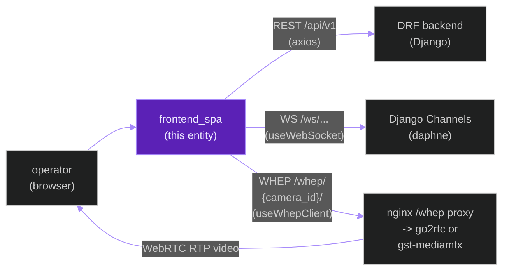
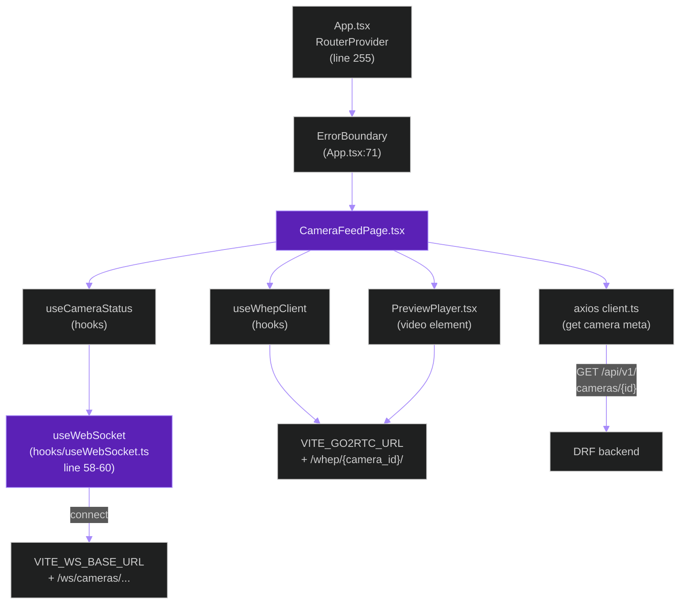
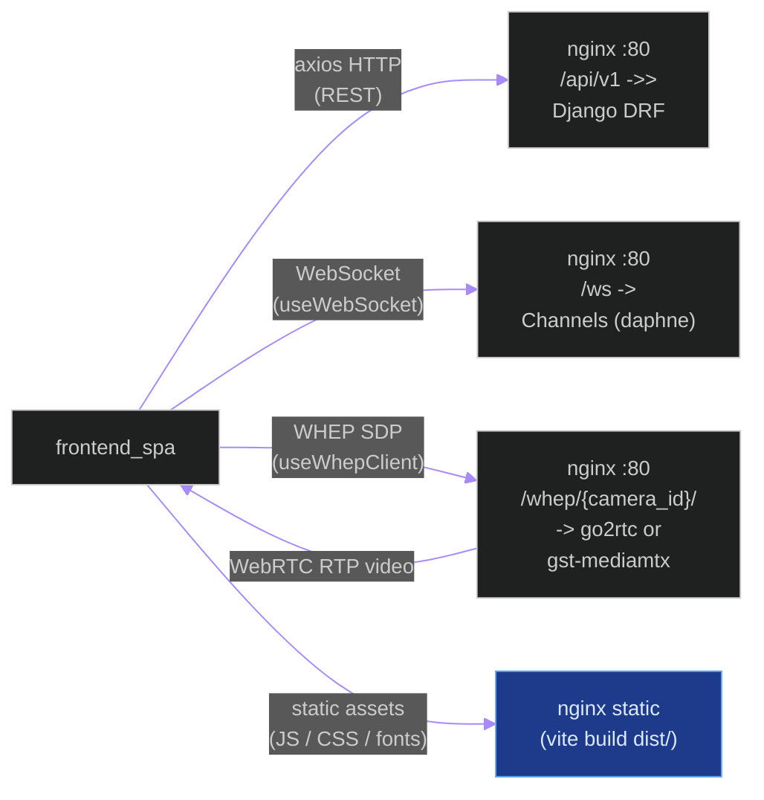
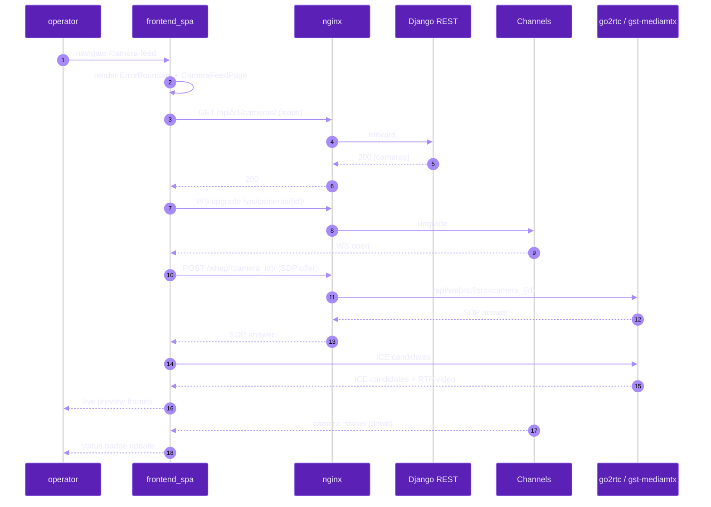
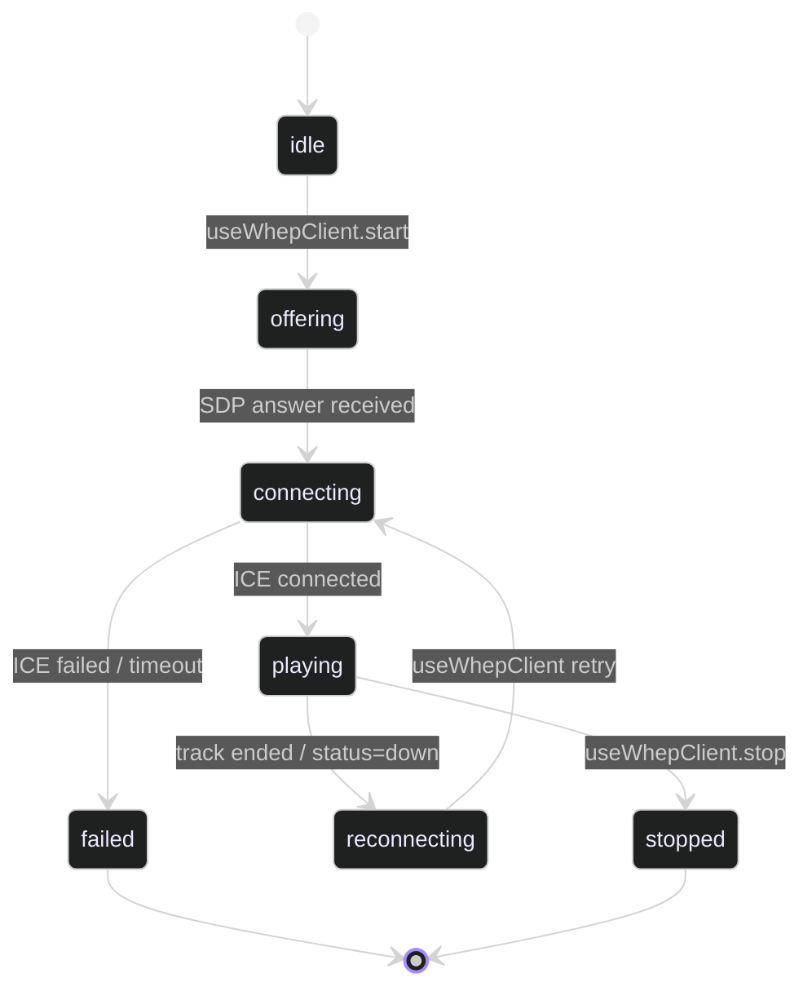

# `frontend_spa`

**Last updated:** 2026-06-02
**Entity kind:** `system`
**Status:** `active`

> React 19 + Vite 8 single-page application. Talks to the Django
> backend via REST (axios) on `/api/v1`, subscribes to live updates
> via WebSocket on `/ws`, and pulls low-latency camera previews via
> WHEP on `/whep/{camera_id}/`. All three transports are routed
> through nginx in prod and the Vite dev-proxy in dev. Uses Zustand
> for state, React Router v7 for routing, and an `ErrorBoundary`
> wrapper per page per constitution FR-036.

## Source-of-truth references

| Kind | Reference |
|---|---|
| File | `frontend/package.json` |
| File | `frontend/vite.config.ts` |
| File | `frontend/src/App.tsx` |
| File | `frontend/src/api/client.ts` |
| File | `frontend/src/api/videoAnalysis.ts` |
| File | `frontend/src/hooks/useWebSocket.ts` |
| File | `frontend/src/hooks/useWhepClient.ts` |
| File | `frontend/src/hooks/useDetectionSocket.ts` |
| File | `frontend/src/hooks/useAnomalySocket.ts` |
| File | `frontend/src/hooks/useCameraStatus.ts` |
| File | `frontend/src/pages/CameraFeedPage.tsx` |
| File | `frontend/src/pages/AnomalyListPage.tsx` |
| File | `frontend/src/pages/CameraListPage.tsx` |
| File | `frontend/src/components/PreviewPlayer.tsx` |
| File | `frontend/src/components/ui` (centralised UI primitives) |
| File | `frontend/src/api/README.md` |
| File | `frontend/src/hooks/README.md` |
| File | `frontend/src/components/camera/README.md` |
| File | `frontend/src/features/bsil/README.md` |
| File | `frontend/WCAG_AUDIT.md` |
| File | `frontend/src/AUDIT_FRONTEND_ASYNC_A11Y_RESPONSIVE.md` |
| File | `frontend/.env.example` |
| File | `frontend/README.md` |
| Symbol | `useWebSocket` (hooks/useWebSocket.ts) — typed WebSocket manager with exponential-backoff reconnect |
| Symbol | `useWhepClient` (hooks/useWhepClient.ts) — WHEP/WebRTC consumer reading `VITE_GO2RTC_URL` |
| Symbol | `useDetectionSocket` (hooks/useDetectionSocket.ts) — wraps `useWebSocket` for `/ws/detections/{session_id}/` |
| Symbol | `useAnomalySocket` (hooks/useAnomalySocket.ts) — wraps `useWebSocket` for `/ws/anomalies/{session_id}/` |
| Symbol | `useCameraStatus` (hooks/useCameraStatus.ts) — wraps `useWebSocket` for `/ws/cameras/...` |
| Symbol | `client` (api/client.ts) — `AxiosInstance` configured with `VITE_API_BASE_URL` |
| Symbol | `ErrorBoundary` (components/ui) — per-page wrapper from `App.tsx:28,71` |
| Commit | `a46bb2c9` (DSP Cycle 2 5/N — sibling camera bridge doc) |
| Workflow | `.github/workflows/inference-parallelization.yml` (frontend tests are gated elsewhere; the workflow watches this entity doc) |
| Doc | `docs/entity/systems/camera_streaming_bridge.md` |
| Doc | `docs/entity/systems/live_streaming_pipeline.md` |
| Doc | `frontend/README.md` |

## 1. Purpose and scope

The SPA is the operator-facing UI. It owns:

- the route table for every page (`App.tsx` declares 14 protected
  routes + `/login` plus an `ErrorBoundary` wrapper around each);
- the REST + WebSocket + WHEP transport abstractions
  (`api/client.ts`, `hooks/useWebSocket.ts`, `hooks/useWhepClient.ts`);
- per-page Zustand stores for ephemeral UI state;
- the centralised UI primitives library at `components/ui/`
  (LoadingSpinner, ErrorBoundary, dialog wrappers, etc.) used by every
  page per FR-033.

It does NOT own auth (handled by the backend `apps.accounts` module
plus a small SPA token handler), does NOT own any inference, and does
NOT touch the database directly.

## 2. Position in the system

## 3. Internal structure

Top-level layout (selection — full inventory via `git ls-files frontend/src/`):

| Path | Role |
|---|---|
| `frontend/src/App.tsx` | Root component. Declares `RouterProvider` (line 255), wraps each route with `ErrorBoundary` (line 71), defines 14 protected routes + `/login`. |
| `frontend/src/api/client.ts` | Axios instance (line 40) reading `VITE_API_BASE_URL` (line 16, default `/api/v1`). Owns request/response interceptors + error normalisation (line 71). |
| `frontend/src/api/videoAnalysis.ts` | REST helpers for video-analysis jobs. Notes (line 55) that the helper strips the `/api/v1` prefix the axios client adds. |
| `frontend/src/api/README.md` | Per-folder index of every API helper. |
| `frontend/src/hooks/useWebSocket.ts` | Typed WS manager. Two-overload `useWebSocket(path)` / `useWebSocket(options)` (line 58-60). Reads `VITE_WS_BASE_URL` (line 88), exponential backoff reconnect. |
| `frontend/src/hooks/useWhepClient.ts` | WHEP/WebRTC consumer. Reads `VITE_GO2RTC_URL` (line 12). |
| `frontend/src/hooks/useDetectionSocket.ts` | Thin wrapper around `useWebSocket` for `/ws/detections/{session_id}/`. |
| `frontend/src/hooks/useAnomalySocket.ts` | Same pattern for `/ws/anomalies/{session_id}/` (line 8,61). |
| `frontend/src/hooks/useCameraStatus.ts` | Same pattern for `/ws/cameras/{camera_id}/` (line 3,27). |
| `frontend/src/hooks/README.md` | Per-folder hooks index. |
| `frontend/src/pages/CameraFeedPage.tsx` | Live preview page; pulls WHEP via `useWhepClient` and per-camera status via `useCameraStatus`. |
| `frontend/src/pages/CameraListPage.tsx` | Camera registry + add/remove flows; calls REST. |
| `frontend/src/pages/AnomalyListPage.tsx` | Live anomaly tracker via `useAnomalySocket`. |
| `frontend/src/components/PreviewPlayer.tsx` | Shared `<video>` wrapper used by camera preview. |
| `frontend/src/components/camera/` + `README.md` | Camera-specific UI primitives. |
| `frontend/src/components/ui/` | Centralised UI primitives (LoadingSpinner, ErrorBoundary, dialog wrappers). |
| `frontend/src/features/bsil/` + `README.md` | Behavioural Semantic Inference Layer (BSIL) feature module. |
| `frontend/vite.config.ts` | Dev proxy: `/api`, `/ws`, `/whep/{camera_id}/` (line 34-39). |
| `frontend/WCAG_AUDIT.md` | WCAG accessibility audit (FR-035 — keyboard navigation). |
| `frontend/src/AUDIT_FRONTEND_ASYNC_A11Y_RESPONSIVE.md` | Cross-cutting async + a11y + responsive audit. |

## 4. Call graph (internal — one CameraFeedPage render)

## 5. External connections

## 6. API surface (external calls into this entity)

The SPA is a **consumer**, not a producer, so its "API surface" is the
URL routes it exposes inside the browser:

| Interface | What it does | Backed by |
|---|---|---|
| Public route `/login` | login page | `apps.accounts` REST |
| Protected route `/dashboard` | overview | summary endpoints |
| Protected route `/sessions` + `/sessions/:id` | session list + detail | `apps.sessions` REST |
| Protected route `/camera-feed` | live preview grid | WHEP + `useCameraStatus` |
| Protected route `/cameras` | camera registry | `apps.cameras` REST + admin |
| Protected route `/predictions` | offline prediction viewer | `apps.video_analysis` REST |
| Protected route `/video-analysis` + `/video-analysis/:jobId` | upload + per-job view | `apps.video_analysis` REST + `/ws/video-analysis/` |
| Protected route `/anomalies` | live anomaly tracker | `useAnomalySocket` |
| Protected route `/recordings` + `/recordings/:id` | recording viewer | `apps.recordings` REST |
| Protected route `/health` | runtime health | `apps.health` REST |
| Protected route `/settings` + `/change-password` | account settings | `apps.accounts` REST |

## 7. Dependencies

| Dependency | Reason | Pinned version (package.json) |
|---|---|---|
| `react` | UI runtime | `^19.2.6` |
| `react-dom` | DOM renderer | per `package.json` |
| `react-router` (v7) | routing | per `package.json` |
| `axios` | REST client | `^1.16.1` |
| `zustand` | state management | `^5.0.13` |
| `vite` | dev server + bundler | `^8.0.13` |
| `@vitejs/plugin-react` | React JSX transform | per `package.json` |
| `vitest` | unit test runner | per `package.json` |
| `@playwright/test` | e2e | per `package.json` |
| backend REST contract | every page consumes one or more REST endpoints | per `apps.*.serializers` (Spec 005) |

## 8. Environment variables read

The SPA reads only `VITE_*` variables; everything else is server-side.

| Variable | Default | Required? | Effect |
|---|---|---|---|
| `VITE_API_BASE_URL` | `/api/v1` (so dev/nginx proxies it) | no | Absolute REST base. Wrong value breaks every REST call. |
| `VITE_WS_BASE_URL` | derived from `window.location` | no | Absolute WS base. Wrong value breaks live updates. |
| `VITE_GO2RTC_URL` | `http://localhost:1984` | no | WHEP origin used by `useWhepClient`. |
| `VITE_API_PROXY_TARGET` | `http://localhost:8000` | no | Vite-dev-only — target the `/api` and `/ws` proxies forward to. |

## 9. Sequence diagram (dominant interaction)

Operator opens the camera-feed page and a WHEP preview starts:

## 10. State machine

WHEP preview connection (per camera tile):

## 11. Failure modes

| Failure | Detection | Recovery |
|---|---|---|
| REST 401 | axios response interceptor | Redirect to `/login` |
| REST 5xx | axios response interceptor | UI displays normalised error message (per FR-036) |
| WS connection lost | `useWebSocket` heartbeat / close handler | Exponential backoff reconnect with jitter |
| WHEP SDP exchange fails | `useWhepClient` promise rejection | UI shows preview unavailable; retry button |
| Backend down | every REST call fails 0/network | UI shows global banner; pages stay mounted with placeholder content |
| Auth token expired mid-WS | server closes WS with 4001 | `useWebSocket` triggers re-auth via the axios interceptor |

## 12. Performance characteristics

> Frontend perf is dominated by network RTT to nginx + WHEP first
> frame. Glass-to-glass target is sub-500 ms at 720p — that depends
> on the camera bridge, not the SPA. The SPA itself ships under the
> standard Vite bundle budget (test plan in `frontend/WCAG_AUDIT.md`
> and `frontend/src/AUDIT_FRONTEND_ASYNC_A11Y_RESPONSIVE.md`).

## 13. Operational notes

- The 1920×1080 baseline (FR-037) is the supported minimum desktop
  resolution; lower resolutions degrade gracefully but are not
  primary-supported.
- Auto-restart policy (FR-049): the dev compose has
  `restart: unless-stopped` for supervisor-style recovery.
- WCAG contrast audit: `cd frontend && npm run audit:contrast` (per
  README "Frontend Quality Gates").
- Unit tests via `vitest`, e2e via `playwright`. Coverage threshold
  `80` for lines/functions/branches/statements per `vite.config.ts`.

## 14. Historical diagrams

> Not applicable: no diagrams in this doc have been superseded yet.

## 15. Related entities

| Entity | Path | Relationship |
|---|---|---|
| Live streaming pipeline | `docs/entity/systems/live_streaming_pipeline.md` | producer of `/ws/detections`, `/ws/anomalies`, `/ws/cameras` events the SPA consumes |
| Offline inference pipeline | `docs/entity/systems/offline_inference_pipeline.md` | producer of `/ws/video-analysis/` events |
| Camera streaming bridge | `docs/entity/systems/camera_streaming_bridge.md` | WHEP source for `useWhepClient` |
| Telemetry pipeline | `docs/entity/systems/telemetry_pipeline.md` | indirect — health page surfaces telemetry counters |
| `frontend/src/api` module | `docs/entity/modules/frontend.src.api.md` (planned DSP Cycle 3) | REST client + per-endpoint helpers |
| `frontend/src/hooks` module | `docs/entity/modules/frontend.src.hooks.md` (planned DSP Cycle 3) | WS / WHEP / data-paging hooks |
| `frontend/src/components/camera` module | `docs/entity/modules/frontend.src.components.camera.md` (planned DSP Cycle 3) | camera UI primitives |
| `frontend/src/features/bsil` module | `docs/entity/modules/frontend.src.features.bsil.md` (planned DSP Cycle 3) | BSIL feature module |

## 16. Open questions

- **Q1.** Should `VITE_WS_BASE_URL` default to `wss://` in prod via build-time injection rather than derive from `window.location`? Currently the derive-from-origin behaviour is correct but fragile under unusual nginx routes. *Owner:* frontend maintainer. *Target close:* during DSP Cycle 3 module doc.
- **Q2.** WHEP retry policy is per-tile in `useWhepClient`; should there be a global circuit-breaker so a permanently-failing camera doesn't spam the bridge? *Owner:* live-runtime maintainer + frontend maintainer. *Target close:* with the next bridge release.

## 17. Change log

| Date | What changed | Commit |
|---|---|---|
| 2026-06-02 | First version landed under DSP Cycle 2 (6 of 6 — Cycle 2 CLOSED). | (this commit) |
