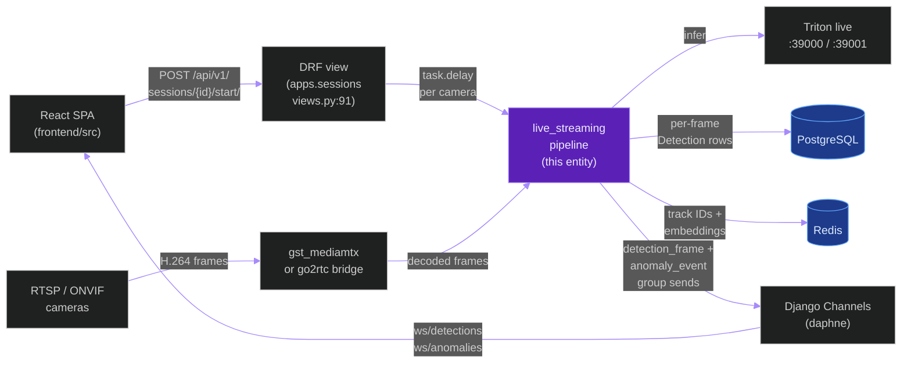
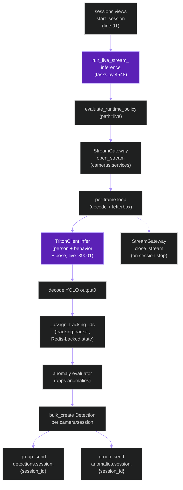
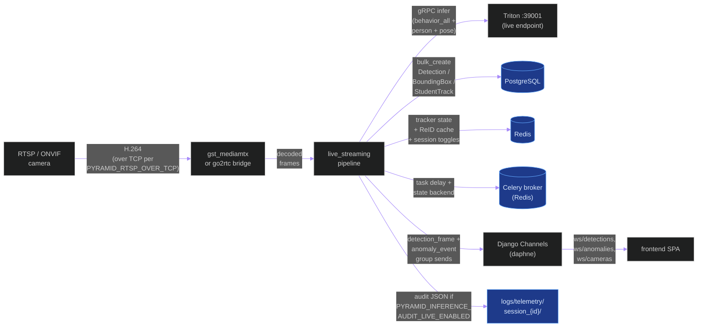
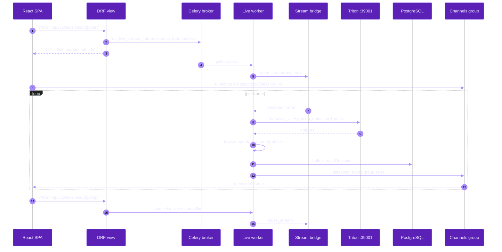
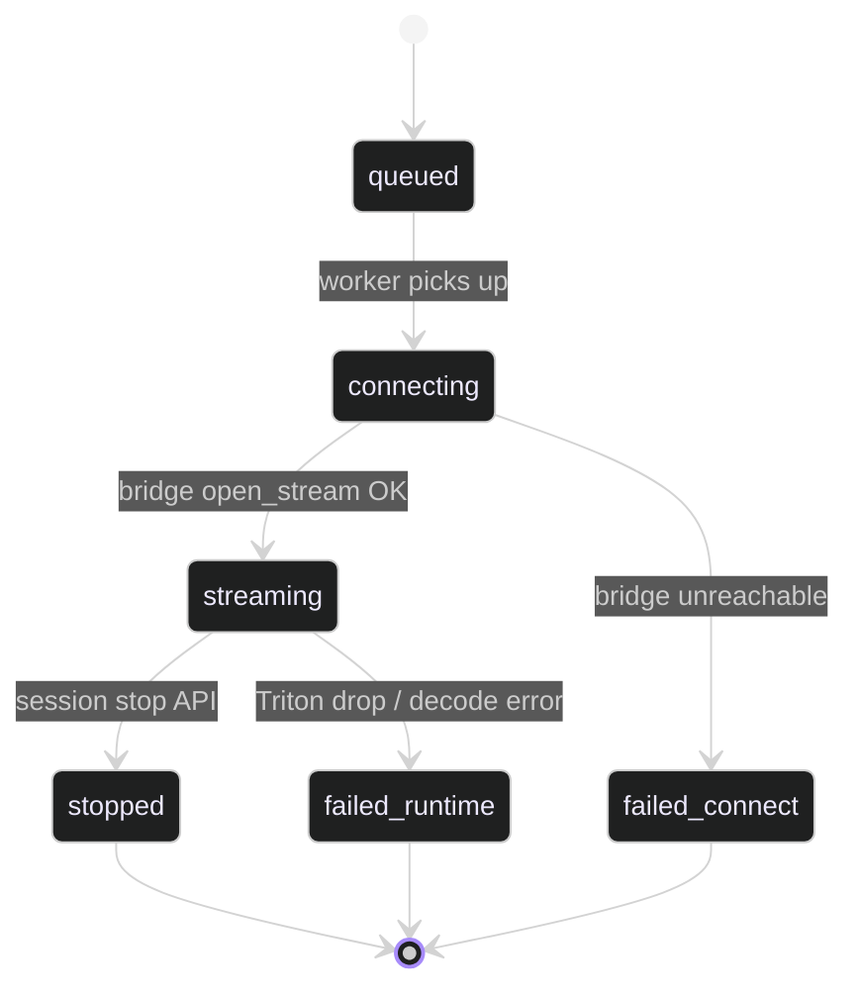

# `live_streaming_pipeline`

**Last updated:** 2026-06-02
**Entity kind:** `system`
**Status:** `active`

> Celery-driven live-streaming inference pipeline. One task per
> camera per session reads RTSP / ONVIF through the go2rtc or
> gst-mediamtx bridge, runs the same Triton-only model fleet as the
> offline pipeline (different endpoint), tracks identities, and
> publishes live detection + anomaly events via Django Channels. The
> active endpoint is `:39000/:39001/:39002` (live); the offline
> endpoint must be unreachable per single-active-profile policy.

## Source-of-truth references

| Kind | Reference |
|---|---|
| File | `backend/apps/video_analysis/tasks.py` |
| File | `backend/apps/sessions/views.py` |
| File | `backend/apps/cameras/services.py` |
| File | `backend/apps/cameras/routing.py` |
| File | `backend/apps/cameras/consumers.py` |
| File | `backend/apps/detections/routing.py` |
| File | `backend/apps/detections/consumers.py` |
| File | `backend/apps/anomalies/routing.py` |
| File | `backend/apps/anomalies/consumers.py` |
| File | `backend/apps/pipeline/services/triton_client.py` |
| File | `backend/apps/pipeline/services/model_route_service.py` |
| File | `backend/apps/pipeline/services/runtime_policy.py` |
| File | `backend/apps/tracking/tracker.py` |
| File | `backend/apps/telemetry/services/writer.py` |
| File | `backend/config/celery.py` |
| File | `backend/config/settings/base.py` |
| File | `tools/prod/prod_start_triton.sh` |
| Symbol | `apps.video_analysis.tasks.run_live_stream_inference` |
| Symbol | `apps.sessions.views` (live-stream start handler at line 91) |
| Symbol | `apps.pipeline.services.runtime_policy.evaluate_runtime_policy` |
| Symbol | `apps.pipeline.services.triton_client.TritonClient` |
| Symbol | `apps.cameras.services.StreamGateway` |
| Symbol | `apps.cameras.services.OnvifResolver` |
| Commit | `665e2a06` (DSP Cycle 1 close — baseline repo state) |
| Commit | `a77a7022` (DSP Cycle 2 1/N — sibling offline entity doc) |
| Workflow | `.github/workflows/inference-parallelization.yml` |
| Doc | `docs/ARCHITECTURE.md` |
| Doc | `docs/entity/systems/offline_inference_pipeline.md` |
| Doc | `docs/go2rtc.md` |
| Doc | `docs/nginx.md` |

## 1. Purpose and scope

This pipeline handles **live** monitoring sessions: an operator starts
a session, the session start view enumerates the session's cameras and
fires one `run_live_stream_inference` Celery task per (session, camera)
pair (`backend/apps/sessions/views.py:91`). Each task reads frames
from the configured stream provider (`gst_mediamtx` by default,
optionally `go2rtc` per `STREAM_PROVIDER`), runs the same model fleet
as offline through the **live** Triton endpoint
(`TRITON_LIVE_HTTP_PORT = 39000`, gRPC :39001, metrics :39002), and
emits live detection events through Django Channels groups consumed by
the frontend SPA via the `/ws/detections/{session_id}/` and
`/ws/anomalies/{session_id}/` WebSockets.

The pipeline does NOT do video archival or rendered MP4 output (that is
the [`offline_inference_pipeline`](offline_inference_pipeline.md)). It
does NOT manage camera lifecycle (that lives in `apps.cameras`).

## 2. Position in the system

## 3. Internal structure

| Path | Role |
|---|---|
| `backend/apps/video_analysis/tasks.py` | `run_live_stream_inference` Celery task at line 4548. Owns the per-camera frame loop, dispatch, tracking, anomaly evaluation, and WS publish. |
| `backend/apps/sessions/views.py` | Session start view at line 91 fans out one task per camera; collects `live_stream_job_ids` for client return. |
| `backend/apps/cameras/services.py` | `StreamGateway` Protocol (line 175) + concrete `LegacyGo2rtcGateway` (line 213) and `GstMediaMtxGateway` (line 251); `OnvifResolver` for ONVIF discovery. Selection driven by `STREAM_PROVIDER` env. |
| `backend/apps/cameras/routing.py` | `CameraStatusConsumer` route `ws/cameras/{camera_id}/`. |
| `backend/apps/cameras/consumers.py` | Camera-status WS consumer. |
| `backend/apps/detections/routing.py` | `DetectionConsumer` route `ws/detections/{session_id}/` — main live detection channel. |
| `backend/apps/detections/consumers.py` | Detection WS consumer. |
| `backend/apps/anomalies/routing.py` | Anomaly-event WS consumer. |
| `backend/apps/pipeline/services/runtime_policy.py` | `evaluate_runtime_policy(path='live')` — picks Triton-only vs hybrid; in prod fails closed unless the **live** endpoint is healthy AND offline is unreachable. |
| `backend/apps/pipeline/services/triton_client.py` | Shared gRPC client (same as offline). |
| `backend/apps/pipeline/services/model_route_service.py` | Same logical-name router as offline. |
| `backend/apps/tracking/tracker.py` | Same ByteTrack / BoT-SORT + ReID logic as offline; per-camera tracker state lives in Redis. |
| `backend/apps/telemetry/services/writer.py` | Per-frame + per-call telemetry; live mode honors `PYRAMID_INFERENCE_AUDIT_LIVE_ENABLED`. |
| `backend/config/celery.py` | Queue routing: `run_live_stream_inference → live_control_queue_name` (line 90). |

## 4. Call graph (internal — one camera-task lifecycle)

## 5. External connections

## 6. API surface (external calls into this entity)

| Interface | Schema | Caller |
|---|---|---|
| `POST /api/v1/sessions/{id}/start/` (DRF) | session id + camera selection | `frontend/src/api/*` |
| Celery task `apps.video_analysis.tasks.run_live_stream_inference(session_id, camera_id, ...)` | session UUID, camera UUID | session start view |
| WebSocket `/ws/detections/{session_id}/` | server-push `detection_frame` events | frontend live-detections page |
| WebSocket `/ws/anomalies/{session_id}/` | server-push `anomaly_event` events | frontend anomaly page |
| WebSocket `/ws/cameras/{camera_id}/` | server-push `camera_status` events | frontend camera-feed page |
| Triton model routes consumed (via `ModelRouteService`) | same as offline (`behavior_all`, `person_detection`, `pose_estimation`, etc.) | internal |

## 7. Dependencies

| Dependency | Reason | Pinned version |
|---|---|---|
| `apps.cameras` (services) | stream provider abstraction (go2rtc, gst-mediamtx, ONVIF resolution) | internal |
| `apps.sessions` (views, models) | session start handler dispatches tasks | internal |
| `apps.pipeline` (services) | shared Triton client + router + policy | internal |
| `apps.tracking` (tracker) | per-camera tracker + Redis-backed state | internal |
| `apps.anomalies` (services) | live anomaly evaluation + persistence | internal |
| `apps.detections` (models) | persisted `Detection` rows | internal |
| `apps.telemetry` (writer) | per-frame + per-call telemetry | internal |
| `Celery` | per-camera task orchestration | 5.4.0 |
| `Django Channels` (Daphne) | live WS push | 4.2.2 |
| `tritonclient` (gRPC) | Triton interaction | aligned with prod Triton 24.x |
| `gst-mediamtx` / `go2rtc` | RTSP / WHEP bridge | external services |
| `Redis` | broker / result / tracker state / session toggles | 7 |
| `PostgreSQL` | per-frame persistence | 16 |

## 8. Environment variables read

| Variable | Default | Required? | Effect |
|---|---|---|---|
| `INFERENCE_STRATEGY` | `triton_only` (prod) | yes (prod) | `runtime_policy.py` fails closed if not `triton_only` |
| `TRITON_EXECUTION_MODE` | (operator-set per host) | yes | must be `live` for this pipeline |
| `TRITON_LIVE_HTTP_PORT` | `39000` | no | live HTTP port |
| `TRITON_LIVE_GRPC_PORT` | `39001` | no | live gRPC port |
| `TRITON_LIVE_METRICS_PORT` | `39002` | no | live metrics port |
| `TRITON_REQUIRED_LIVE` | `0` (base default) | yes (prod = `1`) | prod readiness gate; if `0`, live route is degraded |
| `STREAM_PROVIDER` | `gst_mediamtx` | no | `gst_mediamtx` or `go2rtc` |
| `STREAM_PROVIDER_CAMERA_IDS` | empty | no | comma-separated camera UUIDs routed to `gst_mediamtx` even if default is `go2rtc` |
| `GO2RTC_API_URL` | `http://localhost:1984` | yes if go2rtc | base URL for stream registration |
| `GO2RTC_WHEP_URL` | `http://go2rtc:8555` | yes if go2rtc | WHEP listener for browser clients |
| `MEDIAMTX_WHEP_URL` | `http://mediamtx:8889` | yes if gst-mediamtx | WHEP listener |
| `ONVIF_USERNAME` / `ONVIF_PASSWORD` / `ONVIF_WSDL_DIR` | empty | yes if ONVIF | ONVIF resolution credentials + WSDL path |
| `PYRAMID_RTSP_OVER_TCP` | `true` | no | force TCP transport on unstable networks |
| `PYRAMID_INFERENCE_AUDIT_LIVE_ENABLED` | `true` | no | toggles per-frame audit JSON for live runs |

## 9. Sequence diagram (dominant interaction)

End-to-end from operator session start to live detection event in the browser:

## 10. State machine

## 11. Failure modes

| Failure | Detection | Recovery |
|---|---|---|
| Triton live endpoint not ready | `runtime_policy.py` shadow precheck | Task fails closed; operator confirms `TRITON_EXECUTION_MODE=live` + `prod_start_triton.sh` |
| Both endpoints reachable (single-active-profile violation) | Health view + endpoint policy script | `tools/prod/prod_triton_endpoint_policy.sh` reports + operator stops the dark profile |
| RTSP camera unreachable | `StreamGateway.open_stream` raises | Task transitions `connecting → failed_connect`; client sees `live_stream_job_id` status |
| ONVIF auth missing | `OnvifResolver` raises on first probe | Operator sets `ONVIF_USERNAME` / `ONVIF_PASSWORD` / `ONVIF_WSDL_DIR` |
| Tracker state diverged across worker restarts | Redis-backed state expires per `PYRAMID_EMBEDDING_REDIS_TTL_SECONDS` | Re-warm on next frame; ReID picks up |
| WebSocket consumer disconnect | Channels frees group membership | Client reconnects via `useWebSocket` hook with backoff |

## 12. Performance characteristics

> Live-pipeline benchmarks live in `docs/runtime_v2_optimization_log.md`
> and `docs/runtime_ux_pass.md`. The offline pipeline drives the
> headline SLA in `docs/runtime_sla_video_plus_5min.md`; the live
> pipeline shares engines and theme but has its own per-camera RTT
> budget (target: real-time 25-30 FPS per camera at 720p). No SLA
> numbers are quoted here without a cited bench summary; see those
> docs for canonical values.

## 13. Operational notes

- Live and offline endpoints are **mutually exclusive in prod**. Per
  constitution §2 single-active-profile, the inactive endpoint must be
  unreachable on its ports.
- `tools/prod/prod_triton_endpoint_policy.sh` enforces this at preflight.
- The browser uses WHEP (`/whep/{camera_id}/`) for low-latency video
  preview; that is the camera bridge, NOT this pipeline. This pipeline
  consumes the bridge's decoded frames internally.
- Stop flow: operator hits `POST /api/v1/sessions/{id}/stop/`, which
  cancels every `run_live_stream_inference` task for that session.

## 14. Historical diagrams

> Not applicable: no diagrams in this doc have been superseded yet.

## 15. Related entities

| Entity | Path | Relationship |
|---|---|---|
| Offline inference pipeline | `docs/entity/systems/offline_inference_pipeline.md` | sibling — shares Triton authority + tracking + telemetry stack |
| Triton inference plane | `docs/entity/systems/triton_inference_plane.md` (planned DSP Cycle 2) | callee — different endpoint (:39001 live vs :39101 offline) |
| Telemetry pipeline | `docs/entity/systems/telemetry_pipeline.md` (planned DSP Cycle 2) | observer |
| Camera bridge / streaming layer | `docs/entity/systems/camera_streaming_bridge.md` (planned DSP Cycle 2) | upstream input |
| Frontend SPA | `docs/entity/systems/frontend_spa.md` (planned DSP Cycle 2) | downstream consumer of `/ws/detections`, `/ws/anomalies`, `/ws/cameras` |
| `apps.video_analysis` module | `docs/entity/modules/apps.video_analysis.md` (planned DSP Cycle 3) | parent module of `run_live_stream_inference` |
| `apps.sessions` module | `docs/entity/modules/apps.sessions.md` (planned DSP Cycle 3) | session-start dispatcher |
| `apps.cameras` module | `docs/entity/modules/apps.cameras.md` (planned DSP Cycle 3) | provides `StreamGateway` + `OnvifResolver` |
| `apps.anomalies` module | `docs/entity/modules/apps.anomalies.md` (planned DSP Cycle 3) | downstream evaluator |

## 16. Open questions

- **Q1.** Should per-camera task isolation move from "one Celery task per camera" to a single supervisor task with sub-workers? Trade-off: lower scheduling overhead vs. lost crash isolation. *Owner:* live-runtime maintainer. *Target close:* after next live-runtime bench.
- **Q2.** Per-camera tracker state expiry — should `PYRAMID_EMBEDDING_REDIS_TTL_SECONDS` be tuned down for short sessions? *Owner:* tracking maintainer. *Target close:* when session-length telemetry is summarised.

## 17. Change log

| Date | What changed | Commit |
|---|---|---|
| 2026-06-02 | First version landed under DSP Cycle 2 (2 of ~6 systems) | (this commit) |
