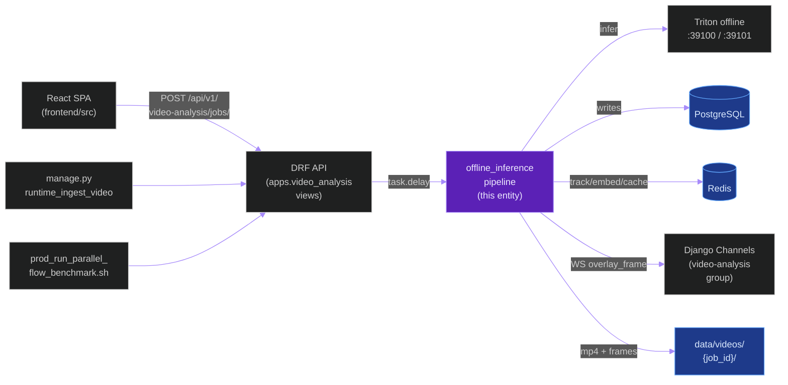
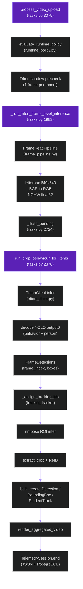
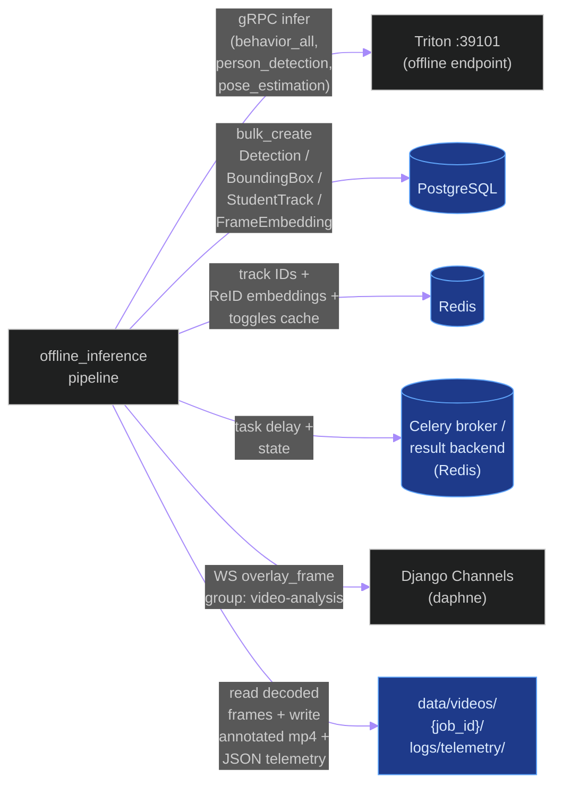
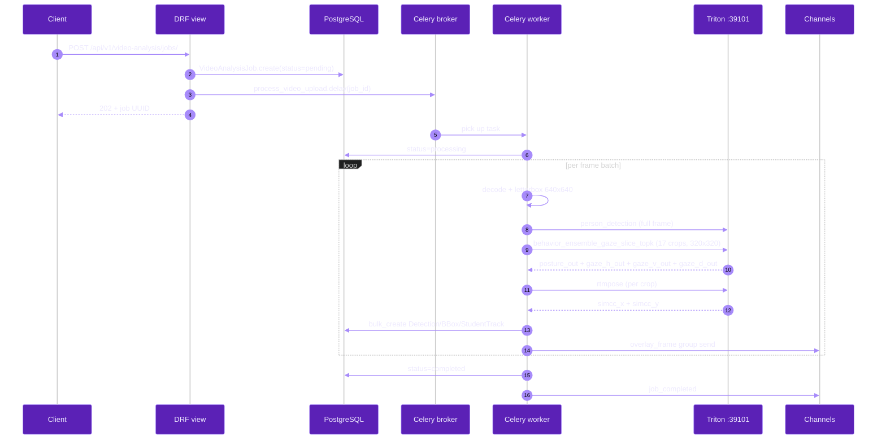
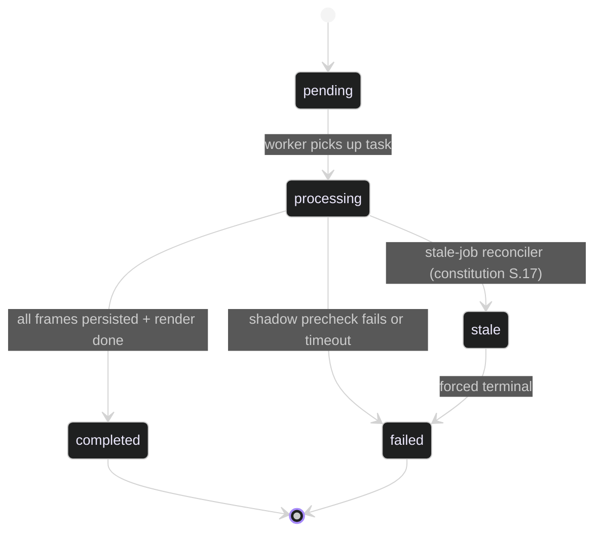

# `offline_inference_pipeline`

**Last updated:** 2026-06-03
**Entity kind:** `system`
**Status:** `active`

> Celery-driven offline video-analysis pipeline that ingests a recorded
> classroom video, runs person detection + behavior models + pose
> through Triton, tracks identities, persists detections, and renders
> annotated output. The active production baseline is the Cycle 9b
> Top-K route through `behavior_ensemble_gaze_slice_topk`.

## Source-of-truth references

| Kind | Reference |
|---|---|
| File | `backend/apps/video_analysis/tasks.py` |
| File | `backend/apps/video_analysis/frame_pipeline.py` |
| File | `backend/apps/video_analysis/models.py` |
| File | `backend/apps/video_analysis/routing.py` |
| File | `backend/apps/pipeline/services/triton_client.py` |
| File | `backend/apps/pipeline/services/model_route_service.py` |
| File | `backend/apps/pipeline/services/inference_client_factory.py` |
| File | `backend/apps/pipeline/services/runtime_policy.py` |
| File | `backend/apps/pipeline/services/ensemble_validator.py` |
| File | `backend/apps/pipeline/services/logical_path_matrix.py` |
| File | `backend/apps/pipeline/services/triton_ensemble_input_size.py` |
| File | `backend/apps/tracking/tracker.py` |
| File | `backend/apps/telemetry/writer.py` |
| File | `backend/apps/telemetry/session.py` |
| File | `backend/apps/telemetry/context.py` |
| File | `backend/apps/telemetry/celery_integration.py` |
| File | `backend/config/celery.py` |
| File | `backend/config/settings/base.py` |
| File | `backend/models/triton_repository_cuda12/behavior_ensemble_gaze_slice_topk/config.pbtxt` |
| File | `tools/prod/prod_run_parallel_flow_benchmark.sh` |
| File | `tools/prod/prod_start_triton.sh` |
| File | `tools/prod/prod_enable_parallel_flow.sh` |
| Symbol | `apps.video_analysis.tasks.process_video_upload` |
| Symbol | `apps.video_analysis.tasks._run_triton_frame_level_inference` |
| Symbol | `apps.video_analysis.tasks._run_crop_behaviour_for_items` |
| Symbol | `apps.video_analysis.tasks._flush_pending` |
| Symbol | `apps.pipeline.services.triton_client.TritonClient` |
| Symbol | `apps.pipeline.services.model_route_service.ModelRouteService` |
| Symbol | `apps.pipeline.services.ensemble_validator.validate_behavior_ensemble_repository` |
| Commit | `665e2a06` (DSP Cycle 1 close) |
| Commit | `a32aa0d7` (DSP Cycle 0 close — constitution v2.5.0) |
| Commit | `9bc53d86` (Cycle 9b Top-K accepted) |
| Job | `be4ba9ee-4786-48e9-8334-28feb237a1fb` (current accepted baseline, 4.429 FPS) |
| Job | `7933c1e5-a970-47a3-81c5-0c9bd01bd332` (Cycle 9b exact slice ACCEPTED) |
| Job | `c1651663-e08a-4e29-9ee3-fd0f09884b98` (Cycle 9 NOT ACCEPTED) |
| Job | `17075418-4386-4b5f-85d4-ea23bec71f66` (Cycle 10 LPM NOT ACCEPTED) |
| Job | `d2de80a0-31b7-4a47-b9f1-d2e2156ea3a8` (Cycle 8 ACCEPTED) |
| Workflow | `.github/workflows/inference-parallelization.yml` |
| Doc | `docs/runtime_sla_video_plus_5min.md` |
| Doc | `docs/cycle_9_and_10_improvements_todo.md` |
| Doc | `docs/cycle_9b_topk_anchor_packing_results.md` |
| Doc | `docs/cycle_9b_child_critical_path_remeasure_topk_results.md` |
| Doc | `docs/triton_models_and_tensor_anatomy.md` |
| Doc | `docs/ARCHITECTURE.md` |

## 1. Purpose and scope

The offline inference pipeline processes a single uploaded video
end-to-end: it decodes frames, runs person detection on every
`TRITON_OFFLINE_FRAME_STRIDE`-th frame, runs the behavior ensemble
(posture + 3 gaze models) on every detected crop, runs RTMPose for
keypoints, runs ReID embeddings, persists everything to PostgreSQL,
and renders an annotated MP4. The SLA (`docs/runtime_sla_video_plus_5min.md`)
is `total_wall ≤ duration(video) + 5 min`; for `combined.mp4`
(4 541 frames @ 30 fps) that means ≥ 10.07 FPS overall.

The system does NOT do live streaming (that is the
[`live_streaming_pipeline`](live_streaming_pipeline.md) — to be
documented in a sibling DSP Cycle 2 commit). It also does NOT touch
the camera bridge, the frontend, or the auth surface.

## 2. Position in the system

## 3. Internal structure

The pipeline lives almost entirely in `backend/apps/video_analysis/`
plus shared services in `backend/apps/pipeline/services/`. Files:

| Path | Role |
|---|---|
| `backend/apps/video_analysis/tasks.py` | Celery tasks (`process_video_upload` at line 3079, `_run_triton_frame_level_inference` at line 1983, `_run_crop_behaviour_for_items` at line 2376, `_flush_pending` at line 2724). Largest file — owns the offline orchestration loop. |
| `backend/apps/video_analysis/frame_pipeline.py` | `FrameReadPipeline` — threaded disk read + cv2 decode that feeds the batch queue. |
| `backend/apps/video_analysis/models.py` | `VideoAnalysisJob` Django model (id, status, processed_frames, progress_percent, etc.). |
| `backend/apps/video_analysis/routing.py` | WebSocket route `video-analysis` group — consumers send `overlay_frame` events. |
| `backend/apps/video_analysis/consumers.py` | Channels consumer for the `overlay_frame` group. |
| `backend/apps/video_analysis/boundary.py` | App boundary declarations (enforced by `backend/core/boundaries.py`). |
| `backend/apps/video_analysis/constants.py` | Pipeline-mode + queue-name constants. |
| `backend/apps/pipeline/services/triton_client.py` | gRPC client (`TritonClient.infer`) — single entry into Triton. |
| `backend/apps/pipeline/services/model_route_service.py` | `ModelRouteService.resolve(route_key)` — maps logical names (`behavior_all`, `gaze_horizontal`) to deployed Triton model names. |
| `backend/apps/pipeline/services/inference_client_factory.py` | Builds the right inference client per `INFERENCE_STRATEGY` (prod: `triton_only`). |
| `backend/apps/pipeline/services/runtime_policy.py` | `evaluate_runtime_policy(path='offline')` — picks Triton-only vs hybrid, fails closed in prod. |
| `backend/apps/pipeline/services/ensemble_validator.py` | Pre-start contract check that the Triton repo matches the expected `[3, S, S]` / anchor shapes. |
| `backend/apps/pipeline/services/logical_path_matrix.py` | LPM constraint solver (Cycle 10, currently `LPM_ENABLED=0` because Phase 1 was NOT ACCEPTED). |
| `backend/apps/pipeline/services/triton_ensemble_input_size.py` | Cycle 11 ensemble-config input-dims rewriter. |
| `backend/apps/tracking/tracker.py` | ByteTrack / BoT-SORT + ReID match logic (called after the per-frame detect+behavior pass). |
| `backend/apps/telemetry/writer.py` + `session.py` + `context.py` + `celery_integration.py` | Dual-sink (PostgreSQL + JSON) writer + per-task `TelemetrySession` bound via ContextVar from Celery signals; persists per-frame meta + per-call RTT. Details in [`docs/entity/systems/telemetry_pipeline.md`](telemetry_pipeline.md). |
| `backend/config/celery.py` | Queue routing (`process_video_upload` → `offline_control_queue_name` at line 89). |

## 4. Call graph (internal — single Celery task lifecycle)

## 5. External connections

## 6. API surface (external calls into this entity)

| Interface | Schema | Caller |
|---|---|---|
| `POST /api/v1/video-analysis/jobs/` (DRF) | multipart `file` + json metadata | `frontend/src/api/*`, `prod_run_parallel_flow_benchmark.sh` |
| `manage.py runtime_ingest_video` CLI | `--video-path`, `--replay-key` | Operator on prod |
| Celery task `apps.video_analysis.tasks.process_video_upload(job_id)` | `str` job UUID | Django view, `runtime_ingest_video` |
| Triton model routes consumed (via `ModelRouteService`) | `behavior_all`, `person_detection`, `pose_estimation`, `gaze_horizontal`, `posture_detection`, `gaze_vertical`, `gaze_depth` | Internal |

## 7. Dependencies

| Dependency | Reason | Pinned version |
|---|---|---|
| `apps.pipeline` (services + config) | inference client, routing, validators | internal |
| `apps.tracking` (tracker, video_exporter) | per-frame tracking + annotated render | internal |
| `apps.telemetry` (writer, models) | per-frame + per-call telemetry capture | internal |
| `apps.detections` (models) | persisted `Detection` + `BoundingBox` rows | internal |
| `apps.cameras` (services) | source-video ingestion path | internal |
| `Celery` | task orchestration | 5.4.0 |
| `Django` (DRF, Channels) | API + WS surfaces | 5.1.5 |
| `tritonclient` (gRPC) | Triton interaction | aligned with prod Triton 24.x |
| `PostgreSQL` | persistence | 16 |
| `Redis` | broker / result / tracking IDs / embedding cache | 7 |
| `OpenCV-Python` (cv2) | decode + render | per `backend/requirements.txt` |

## 8. Environment variables read

| Variable | Default | Required? | Effect |
|---|---|---|---|
| `INFERENCE_STRATEGY` | `triton_only` (prod) | yes (prod) | `runtime_policy.py` fails closed if not `triton_only` in prod |
| `TRITON_EXECUTION_MODE` | `offline` | yes | selects offline endpoint :39100/:39101/:39102 |
| `TRITON_URL` | `http://localhost:8000` | yes | base URL for Triton readiness checks |
| `TRITON_OFFLINE_FRAME_STRIDE` | `10` (default), `1` (prod parallel flow) | no | every Nth frame is "detect-fresh"; others reuse last boxes |
| `TRITON_BEHAVIOR_TOP_K_ENABLED` | `0` | no | when `1`, routes `behavior_all` to `behavior_ensemble_gaze_slice_topk` |
| `TRITON_BEHAVIOR_TOP_K_VALUE` | `100` | no | top-K anchor count for the Cycle 9b B.2.c adapters |
| `GAZE_HORIZONTAL_HEAD_VARIANT` | `coco80` (default), `slice` (accepted prod) | no | selects horizontal-gaze output contract |
| `TRITON_CROP_BEHAVIOR_INPUT_SIZE` | `320` (default + current accepted), `256` (Cycle 11.A — NOT ACCEPTED) | no | square input dim for behavior children |
| `TRITON_CROP_FRAME_BEHAVIOR_OVERLAP` | `1` (accepted prod) | no | Cycle 12.C single-in-flight behavior overlap |
| `MODEL_ROUTE_BEHAVIOR_ALL_MODEL_NAME` | `behavior_ensemble` (default), `behavior_ensemble_gaze_slice_topk` (accepted prod) | no | route-level override for the `behavior_all` logical name |
| `LPM_ENABLED` | `0` | no | gates Cycle 10 LPM constraint solver; currently `0` because Phase 1 was NOT ACCEPTED |
| `TRITON_OFFLINE_BATCH_QUEUE_*` | per `base.py:594-604` | no | Cycle 1-5 batch queue tuning (max_frames=2, max_concurrency=2, max_wait_ms=40 in prod) |
| `TRITON_MAX_INFLIGHT_REQUESTS` | `16` (default), `32` (prod) | no | gRPC inflight cap |

## 9. Sequence diagram (dominant interaction)

End-to-end for one frame through the production Cycle 9b Top-K route:

## 10. State machine

## 11. Failure modes

| Failure | Detection | Recovery |
|---|---|---|
| Triton not ready on the active endpoint | `runtime_policy.py` shadow precheck on 1 frame | Task fails closed; operator runs `tools/prod/prod_start_triton.sh` |
| Ensemble shape contract drift (e.g. `[3,320,320]` config vs `[3,256,256]` engine) | `ensemble_validator.py` pre-start check | Operator runs `tools/prod/prod_set_behavior_input_size.sh --input-size <correct>` |
| Behavior child max-batch exceeded | gRPC `INVALID_ARGUMENT batch-size must be <= 32` | App chunks at 32 (`_run_crop_behaviour_for_items`); script-side probes chunk via `--batch-size` |
| Frame embedding vector wrong dimension (Section 17 violation) | DB validator at write boundary | Reject + fail closed (per constitution S.17.2) |
| Job hangs past per-stage deadline | Stale-job reconciler in `apps.video_analysis.tasks.reconcile_stale_jobs` | Forced-terminal transition `processing → failed` |
| LPM contradictions not detected (Cycle 10 NOT ACCEPTED) | `telemetry_lpm_events` table — `C1=0`, `eliminated=0` | `LPM_ENABLED=0` stays in prod until redesign |

## 12. Performance characteristics

All numbers from prod jobs on Linux RTX 5090, `combined.mp4` (4 541 frames, 2 m 31 s @ 30 fps). SLA target: `≥ 10.07 FPS` overall.

| Cycle / Job | Total wall | Overall FPS | Step 2 frame wall | Behavior RTT mean | Source |
|---|---:|---:|---:|---:|---|
| Baseline (ROI-320 only, `77650001`) | 3 469 s | 1.31 | — | — | `docs/rtt_root_cause_investigation_77650001.md` |
| Cycles 1-5 (`74ec0432-...`) | 2 186 s | 2.08 | — | — | `docs/production_inference_benchmark.md` § 11 |
| Cycle 6 (`a1a448b9-...`) | 1 633 s | 2.78 | — | — | `docs/production_inference_benchmark.md` § 12 |
| Cycle 7 (`515fe118-...`) | 1 582 s | 2.87 | — | — | `docs/production_inference_benchmark.md` § 13 |
| Cycle 8 (`d2de80a0-...`) | 1 312 s | 3.46 | — | — | `docs/production_inference_benchmark.md` § 14 |
| Cycle 9 NOT ACCEPTED (`c1651663-...`) | 1 111 s | 4.09 | 858.1 s | 107.9 ms | `docs/cycle_9_results.md` |
| Cycle 10 NOT ACCEPTED (`17075418-...`) | 1 076 s | 4.22 | — | — | `docs/cycle_10_lpm_phase1_results.md` |
| Cycle 9b exact slice ACCEPTED (`7933c1e5-...`) | 1 052 s | 4.31 | 573.9 s | 91.5 ms | `docs/cycle_9b_output_fusion_results.md` |
| **Cycle 9b Top-K ACCEPTED-with-caveat (`be4ba9ee-...`)** | **1 023 s** | **4.43** | **540.4 s** | **84.9 ms** | `docs/cycle_9b_topk_anchor_packing_results.md` |
| Cycle 11.A NOT ACCEPTED (256 input) | — | — | — | — | `docs/cycle_11_input_size_results.md` |

**Current SLA gap:** 1 023 − 451 = 572 s = ~9.5 min over budget.

## 13. Operational notes

- The "accepted" production profile is set by
  `tools/prod/prod_enable_parallel_flow.sh` + the Cycle 9b
  follow-ups (`prod_enable_gaze_horizontal_slice.sh`,
  `prod_enable_behavior_topk.sh`).
- Triton restart is `bash -l tools/prod/prod_start_triton.sh` — the
  `-l` matters because the script reads from a login-shell env.
- Celery restart is `bash tools/prod/prod_start_celery_workers.sh`.
- A full benchmark is `bash tools/prod/prod_run_parallel_flow_benchmark.sh
  --replay-key <key> --timeout 7200` — produces `bench_summary_*.json`,
  `gpu_monitor_*.csv`, `inference_audit.json`.
- Rollback to Cycle 9b Top-K baseline from any candidate: re-run
  `prod_enable_behavior_topk.sh --input-size 320 --skip-build` + restart.

## 14. Historical diagrams

> Not applicable: no diagrams in this doc have been superseded yet.
> When the pipeline topology changes (e.g., when Cycle 13a BLS lands)
> the position diagram will be updated and the prior version preserved
> here per constitution § 19.5.

## 15. Related entities

| Entity | Path | Relationship |
|---|---|---|
| Live streaming pipeline | `docs/entity/systems/live_streaming_pipeline.md` (planned DSP Cycle 2) | sibling: same Triton authority, different endpoint (`:39000/:39001/:39002`) |
| Triton inference plane | `docs/entity/systems/triton_inference_plane.md` (planned DSP Cycle 2) | callee: this pipeline's only inference authority |
| Telemetry pipeline | `docs/entity/systems/telemetry_pipeline.md` (planned DSP Cycle 2) | observer: receives per-frame + per-call meta |
| `apps.video_analysis` module | `docs/entity/modules/apps.video_analysis.md` (planned DSP Cycle 3) | parent module of `tasks.py` and `frame_pipeline.py` |
| `apps.pipeline` module | `docs/entity/modules/apps.pipeline.md` (planned DSP Cycle 3) | shared services (Triton client, router, validators) |
| `apps.tracking` module | `docs/entity/modules/apps.tracking.md` (planned DSP Cycle 3) | post-detect track + ReID + render |
| `apps.telemetry` module | `docs/entity/modules/apps.telemetry.md` (planned DSP Cycle 3) | telemetry sink |
| Cycle 9 (NOT ACCEPTED) | `docs/entity/cycles/cycle_9.md` (planned DSP Cycle 4) | optimization touching this entity |
| Cycle 9b (ACCEPTED + ACCEPTED-with-caveat) | `docs/entity/cycles/cycle_9b.md` (planned DSP Cycle 4) | current accepted baseline |
| Cycle 10 (NOT ACCEPTED) | `docs/entity/cycles/cycle_10.md` (planned DSP Cycle 4) | LPM Phase 1 — bypassed via `LPM_ENABLED=0` |
| Cycle 11 (NOT ACCEPTED) | `docs/entity/cycles/cycle_11.md` (planned DSP Cycle 4) | input 320 → 256 attempt |
| `tools/prod/prod_run_parallel_flow_benchmark.sh` | `docs/entity/scripts/tools__prod__prod_run_parallel_flow_benchmark.sh.md` (planned DSP Cycle 5) | benchmark driver |

## 16. Open questions

- **Q1.** Should the `LPM_ENABLED` re-design be a Cycle 10 follow-up or its own new cycle? Currently noted in `docs/cycle_9_and_10_improvements_todo.md` § Z.2 "Cycle 10 follow-up". *Owner:* next optimization-cycle agent. *Target close:* before any LPM rerun.
- **Q2.** Cycle 13a BLS Python compact postprocessing — when does it become the active path? Currently PLANNED per `docs/cycles_9_to_12_implementation_playbook.md` § 6. *Owner:* next agent after Cycle 11 closeout. *Target close:* after Cycle 12 (render + COPY FROM) lands.

## 17. Change log

| Date | What changed | Commit |
|---|---|---|
| 2026-06-02 | First version landed under DSP Cycle 2 (system-level entity docs) | (this commit) |
