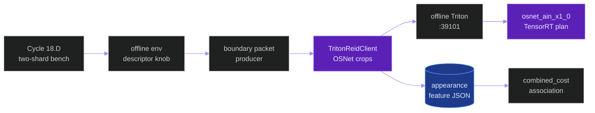
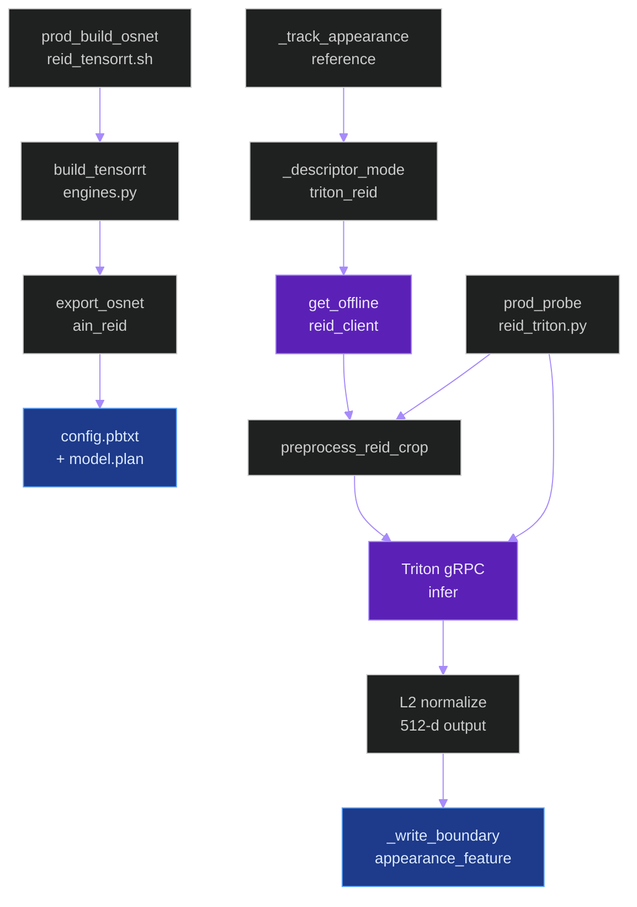
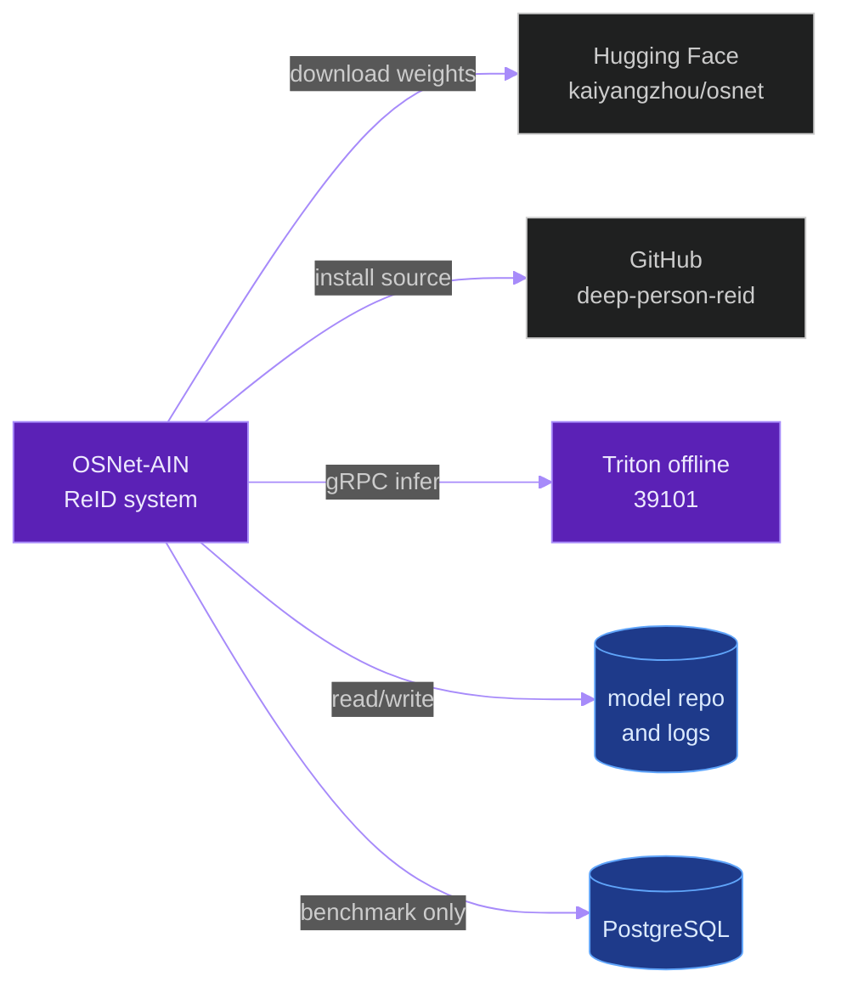
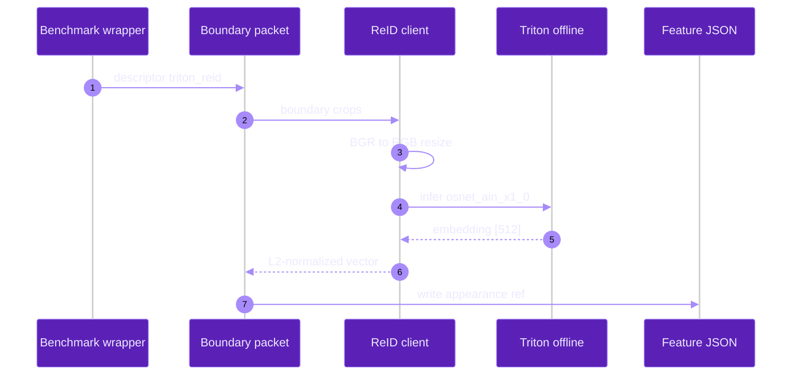
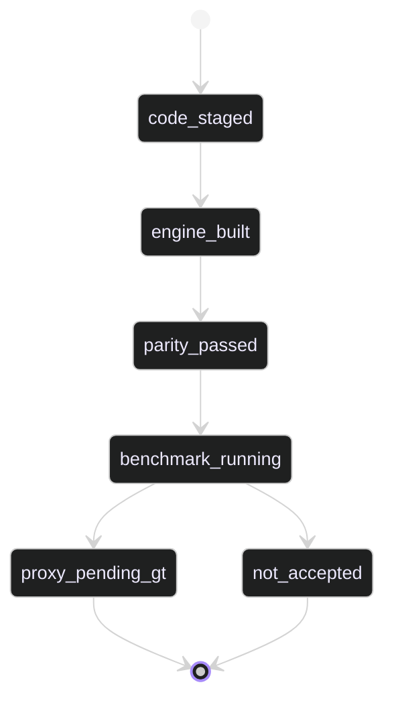

# `osnet_ain_x1_0_reid_model`

**Last updated:** 2026-06-05
**Entity kind:** `system`
**Status:** `active` / `staged`

> Offline-only OSNet-AIN x1.0 person-ReID model served through Triton
> TensorRT for Cycle 18 boundary appearance prototypes.

## Source-of-truth references

| Kind | Reference |
|---|---|
| File | `backend/apps/pipeline/services/reid_triton_client.py` |
| File | `backend/apps/video_analysis/services/offline_sharding.py` |
| File | `backend/scripts/build_tensorrt_engines.py` |
| File | `backend/models/triton_repository_cuda12/osnet_ain_x1_0/config.pbtxt` |
| File | `tools/prod/prod_build_osnet_reid_tensorrt.sh` |
| File | `tools/prod/prod_probe_reid_triton.py` |
| File | `tools/prod/prod_run_cycle15b1_two_shard_runtime_benchmark.sh` |
| File | `tools/prod/prod_enable_parallel_flow.sh` |
| File | `tools/prod/prod_triton_endpoint_policy.sh` |
| File | `backend/config/settings/base.py` |
| File | `backend/tests/unit/pipeline/test_reid_triton_client.py` |
| File | `backend/tests/unit/video_analysis/test_cycle15b1_shard_merge.py` |
| File | `backend/tests/unit/test_live_scheduler.py` |
| File | `backend/tests/unit/scripts/test_prod_probe_reid_triton.py` |
| Symbol | `TritonReidClient` |
| Symbol | `preprocess_reid_crop` |
| Symbol | `export_osnet_ain_reid` |
| Symbol | `_track_appearance_reference` |
| Symbol | `_descriptor_mode` |
| Doc | `docs/cycle_18d_combined_cost_boundary_association_investigation.md` |
| Doc | `docs/cycle_18_identity_association_root_cause_investigation.md` |

## 1. Purpose and scope

This entity serves a learned person re-identification descriptor for the
Cycle 18.D offline boundary association path. It replaces weak boundary
appearance descriptors only when the governed descriptor knob is set to
`triton_reid`; `region_hsv`, `backbone`, and `cv2` remain available for
historical comparison and rollback.

The entity does not replace the persisted `FrameEmbedding` 768-d contract and
does not run on the live RTSP profile. Its current consumer is the offline
boundary packet producer in `offline_sharding.py`, and its production decision
authority is the governed two-shard `combined.mp4` benchmark recorded in the
Cycle 18.D investigation doc.

## 2. Position in the system



Read from left to right: the benchmark wrapper selects the offline descriptor,
the packet producer batches boundary crops through the ReID client, Triton
returns a 512-d descriptor, and the combined-cost association reads the
resulting appearance feature JSON.

## 3. Internal structure

| Component | Path | Role |
|---|---|---|
| TensorRT build entry | `backend/scripts/build_tensorrt_engines.py` | Adds `osnet_ain_x1_0`, checkpoint acquisition, ONNX export, FP32 engine build, Triton config generation, and manifest rows. |
| Triton model config | `backend/models/triton_repository_cuda12/osnet_ain_x1_0/config.pbtxt` | Declares TensorRT backend IO: `input` FP32 `[3,256,128]`, `embedding` FP32 `[512]`, max batch 64, and warmup. |
| Production build wrapper | `tools/prod/prod_build_osnet_reid_tensorrt.sh` | Installs pinned Torchreid, invokes the central builder, updates `.env`, restarts offline Triton, and checks `READY`. |
| Runtime client | `backend/apps/pipeline/services/reid_triton_client.py` | Clamps crops, converts BGR to RGB, resizes to 256x128, normalizes, calls Triton gRPC, L2-normalizes output, and fails closed. |
| Boundary consumer | `backend/apps/video_analysis/services/offline_sharding.py` | Adds `triton_reid` descriptor mode and writes native 512-d appearance references for packet tracks. |
| Parity probe | `tools/prod/prod_probe_reid_triton.py` | Compares PyTorch reference outputs against Triton outputs and writes JSON plus Markdown evidence. |
| Benchmark wrapper | `tools/prod/prod_run_cycle15b1_two_shard_runtime_benchmark.sh` | Adds `--boundary-packet-appearance-descriptor` so the OSNet run is a distinct governed profile. |
| Endpoint policy guard | `tools/prod/prod_triton_endpoint_policy.sh` | Fails live-profile validation if offline sharding, boundary packets, `triton_reid`, or `osnet_ain_x1_0` are active. |

## 4. Call graph



## 5. External connections



The parity probe and ReID client do not write PostgreSQL rows. The governed
two-shard benchmark writes normal video-analysis evidence through the existing
offline pipeline.

## 6. API surface

| Interface | Schema | Caller |
|---|---|---|
| `TritonReidClient.embed_crops(crops)` | List of `(frame_bgr, xyxy)` to `ReidEmbeddingResult` rows | `_track_appearance_reference` |
| `preprocess_reid_crop(frame_bgr, xyxy)` | BGR crop to NCHW FP32 `[3,256,128]` | `TritonReidClient`, parity probe |
| Triton model `osnet_ain_x1_0` | Input `input`; output `embedding`; FP32; dynamic batch | `TritonReidClient` |
| CLI `prod_build_osnet_reid_tensorrt.sh` | `--tag`, `--workspace-mib`, `--skip-pip-install`, `--skip-restart` | Production operator |
| CLI `prod_probe_reid_triton.py` | JSON and Markdown parity evidence outputs | Production operator |

## 7. Dependencies

| Dependency | Reason | Pinned version or source |
|---|---|---|
| Torchreid | Defines OSNet-AIN architecture and weight loading | `KaiyangZhou/deep-person-reid` commit `f8cd150fdf77e8d9e1ed143b7f308c2c609ded50` in `prod_build_osnet_reid_tensorrt.sh`. |
| Hugging Face OSNet repo | Checkpoint acquisition path | `kaiyangzhou/osnet` revision `a5c5cc037c24235cda3b21085b93ad77c9616224` in `build_tensorrt_engines.py`. |
| TensorRT | Builds and serves `model.plan` | Runtime version recorded by `latest_compat.json` from `build_tensorrt_engines.py`. |
| Triton gRPC client | Runtime inference transport | Imported in `reid_triton_client.py`. |
| OpenCV | Crop color conversion and resize | Imported by `preprocess_reid_crop`. |
| NumPy | Tensor layout and L2 normalization | Imported by `reid_triton_client.py`. |

The selected source commit and checkpoint revision are pinned in the build
scripts above. Production checkpoint digest, ONNX digest, engine digest, and
license evidence remain open until the production build writes the governed
manifest.

## 8. Environment variables read

| Variable | Default | Required? | Effect |
|---|---|---|---|
| `TRITON_GRPC_URL` | `localhost:8001` | yes in prod | Selects the Triton gRPC endpoint for `TritonReidClient`. |
| `TRITON_LOAD_MODEL` | Existing core models | yes in prod | `prod_build_osnet_reid_tensorrt.sh` appends `osnet_ain_x1_0` after the plan exists. |
| `OFFLINE_VIDEO_SHARD_BOUNDARY_PACKET_APPEARANCE_DESCRIPTOR` | `region_hsv` | no | `triton_reid` selects this model for boundary appearance. |
| `OFFLINE_VIDEO_SHARD_BOUNDARY_PACKET_REID_MODEL_NAME` | `osnet_ain_x1_0` | no | Triton model name for ReID calls. |
| `OFFLINE_VIDEO_SHARD_BOUNDARY_PACKET_REID_MODEL_VERSION` | `1` | no | Triton model version and packet provenance value. |
| `OFFLINE_VIDEO_SHARD_BOUNDARY_PACKET_REID_MIN_CROP_SIZE` | `16` | no | Rejects tiny or degenerate crops before inference. |
| `OFFLINE_VIDEO_SHARD_BOUNDARY_PACKET_REID_TIMEOUT_MS` | `1500` | no | Per-request gRPC timeout for boundary ReID inference. |
| `TORCHREID_COMMIT` | pinned commit above | no | Override for the production build wrapper. |
| `OSNET_REID_BUILD_TAG` | timestamp tag | no | Engine and manifest version tag for the production build. |

## 9. Sequence diagram



## 10. State machine



The current repository state is `code_staged`. `engine_built`,
`parity_passed`, and any benchmark decision require production evidence.

## 11. Failure modes

| Failure | Detection | Recovery |
|---|---|---|
| Tiny or invalid crop | `preprocess_reid_crop` returns `tiny_crop`, `degenerate_crop`, or `invalid_bbox`; covered by `test_reid_triton_client.py`. | The result is `unavailable`; no zero vector is written. |
| Triton unavailable or error | `TritonReidClient.embed_crops` catches the gRPC error; covered by `test_reid_triton_client.py`. | The result is `unavailable`; boundary producer writes no feature. |
| Missing or mismatched TensorRT engine | `prod_build_osnet_reid_tensorrt.sh` runs `prod_trt_guard.sh` and checks repository `READY`. | Rebuild with the pinned wrapper before benchmarking. |
| PyTorch/Triton parity drift | `prod_probe_reid_triton.py` reports `overall_passed=false`. | Do not benchmark or accept the candidate until the engine/export path is fixed. |
| Live profile activation | Live-isolation test raises if live inference calls boundary packets or ReID client; endpoint policy fails if live env loads `osnet_ain_x1_0` or selects `triton_reid`. | Keep sharding and boundary descriptors disabled on live. |

## 12. Performance characteristics

> Not applicable yet: no completed production parity probe or two-shard
> benchmark for `triton_reid` has been recorded in this repository state.

## 13. Operational notes

Build the production engine after deploying the reviewed SHA:

```bash
bash tools/prod/prod_build_osnet_reid_tensorrt.sh \
  --tag osnet-ain-reid-<UTC>
```

Then run the parity probe before the governed benchmark:

```bash
python tools/prod/prod_probe_reid_triton.py \
  --output backend/logs/<tag>/reid_triton_parity.json \
  --markdown-output backend/logs/<tag>/reid_triton_parity.md
```

The benchmark wrapper must set:

```bash
--track-map-mode combined_cost \
--boundary-packet-enabled 1 \
--boundary-packet-appearance-enabled 1 \
--boundary-packet-appearance-descriptor triton_reid
```

Rollback keeps the model loaded but unused by restoring `best_iou`, sharding
off, packet off, and appearance off.

## 14. Historical diagrams

> Not applicable: no diagrams have been superseded yet.

## 15. Related entities

| Entity | Path | Relationship |
|---|---|---|
| Offline inference pipeline | `docs/entity/systems/offline_inference_pipeline.md` | Calls this model only through the offline sharded benchmark path. |
| Triton inference plane | `docs/entity/systems/triton_inference_plane.md` | Serves the TensorRT `model.plan` through the offline endpoint. |
| Live streaming pipeline | `docs/entity/systems/live_streaming_pipeline.md` | Must not enable boundary sharding or this offline descriptor. |
| Cycle 18.D investigation | `docs/cycle_18d_combined_cost_boundary_association_investigation.md` | Records candidate ledger and final benchmark decision. |

## 16. Open questions

- Owner: Agent 18. Target close date: 2026-06-06. Record the production
  checkpoint, ONNX, engine digests and parity output after the production
  build completes, including the exact checkpoint license evidence.
- Owner: Agent 18. Target close date: 2026-06-06. Record the governed
  two-shard benchmark decision after the RTX 5090 production run completes.

## 17. Change log

| Date | What changed | Commit |
|---|---|---|
| 2026-06-05 | First entity doc for offline OSNet-AIN Triton ReID candidate. | `docs/cycle_18d_combined_cost_boundary_association_investigation.md` |
