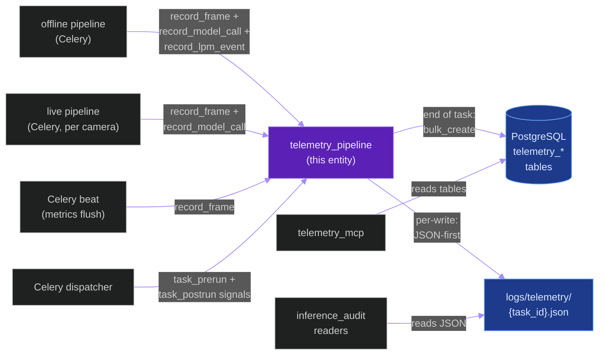
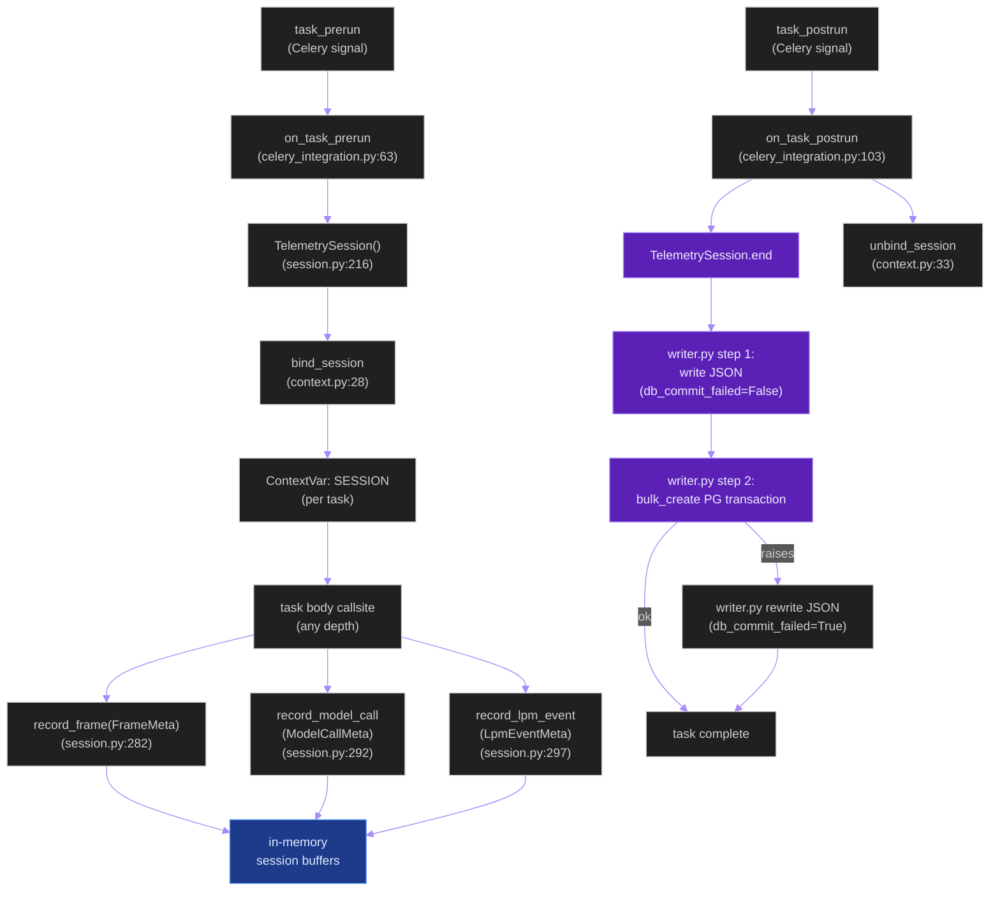
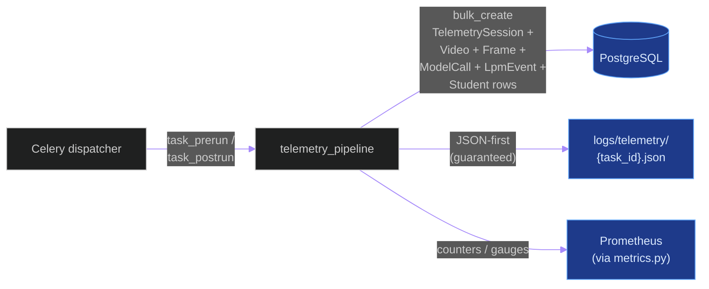
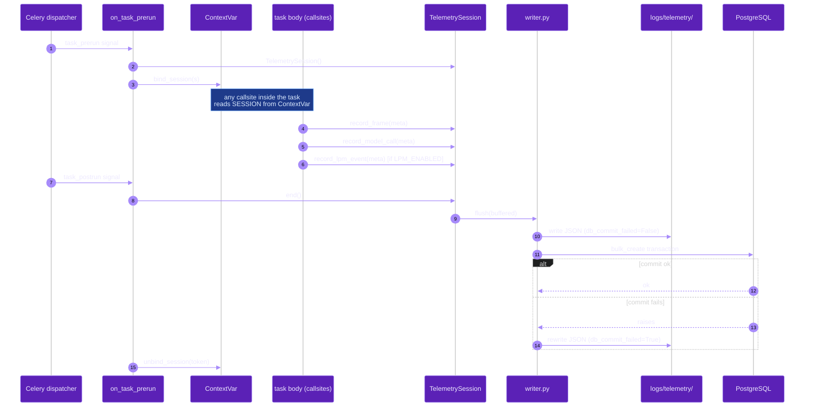
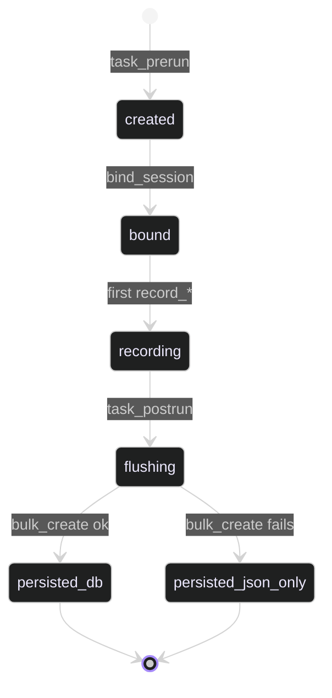

# `telemetry_pipeline`

**Last updated:** 2026-06-02
**Entity kind:** `system`
**Status:** `active`

> Dual-sink (PostgreSQL + JSON-file) per-Celery-task telemetry layer.
> Bound to each Celery task via `task_prerun` / `task_postrun` signals
> and a ContextVar, so any callsite inside the task can record frame
> meta, model-call RTT, LPM events, or student-track outcomes without
> threading a session handle through. The JSON sink is the canonical
> fallback: every write goes there first, then attempts a PostgreSQL
> commit; if the DB commit fails, the JSON file is flagged
> `db_commit_failed: true` so data is never silently lost.

## Source-of-truth references

| Kind | Reference |
|---|---|
| File | `backend/apps/telemetry/session.py` |
| File | `backend/apps/telemetry/writer.py` |
| File | `backend/apps/telemetry/context.py` |
| File | `backend/apps/telemetry/celery_integration.py` |
| File | `backend/apps/telemetry/models.py` |
| File | `backend/apps/telemetry/apps.py` |
| File | `backend/apps/telemetry/metrics.py` |
| File | `backend/apps/telemetry/migrations/0001_initial.py` |
| File | `backend/apps/telemetry/migrations/0002_telemetrylpmevent.py` |
| File | `backend/apps/telemetry/README.md` |
| File | `backend/apps/telemetry_mcp/README.md` |
| File | `backend/tests/unit/telemetry/test_telemetry_layer.py` |
| Symbol | `apps.telemetry.session.TelemetrySession` (line 216) |
| Symbol | `apps.telemetry.session.TelemetrySession.record_frame` (line 282) |
| Symbol | `apps.telemetry.session.TelemetrySession.record_model_call` (line 292) |
| Symbol | `apps.telemetry.session.TelemetrySession.record_lpm_event` (line 297) |
| Symbol | `apps.telemetry.context.bind_session` (line 28) |
| Symbol | `apps.telemetry.context.unbind_session` (line 33) |
| Symbol | `apps.telemetry.celery_integration.on_task_prerun` (line 63) |
| Symbol | `apps.telemetry.celery_integration.on_task_postrun` (line 103) |
| Symbol | `apps.telemetry.models.TelemetrySession` (Django model, line 33) |
| Symbol | `apps.telemetry.models.TelemetryVideo` (line 89) |
| Symbol | `apps.telemetry.models.TelemetryFrame` (line 133) |
| Symbol | `apps.telemetry.models.TelemetryModelCall` (line 183) |
| Symbol | `apps.telemetry.models.TelemetryLpmEvent` (line 230) |
| Symbol | `apps.telemetry.models.TelemetryStudent` (line 267) |
| Commit | `f2a13cbd` (DSP Cycle 2 3/N — sibling Triton-plane doc) |
| Workflow | `.github/workflows/inference-parallelization.yml` |
| Doc | `docs/logical_path_matrix_spec.md` (LPM event schema → `TelemetryLpmEvent`) |
| Doc | `backend/apps/telemetry/README.md` |

## 1. Purpose and scope

The telemetry pipeline captures observability for every Celery task in
the system: video, per-frame timings, per-model-call RTT, LPM events
(when `LPM_ENABLED=1`), per-student outcomes. The capture surface
is bound automatically — every Celery task gets a `TelemetrySession`
on `task_prerun` and that session is bound to a ContextVar so any
helper deep inside the task can call `record_frame(FrameMeta)` or
`record_model_call(ModelCallMeta)` without passing a handle.

The persistence layout is **dual-sink JSON-first**:

1. Every write goes to a per-task JSON file under `logs/telemetry/`
   first (guaranteed durable).
2. Then the bulk write to PostgreSQL is attempted.
3. If PostgreSQL fails or is unreachable, the JSON file is updated
   with `db_commit_failed: true` and the run completes with the JSON
   evidence still on disk.

This is the binding contract behind constitution § 17.3 (Stage outcome
accounting / no silent loss) and § 12 (Acceptance evidence).

The pipeline does NOT do per-record streaming to PostgreSQL (write at
session end only). It does NOT do real-time dashboarding (that is the
`telemetry_mcp` companion app).

## 2. Position in the system

## 3. Internal structure

| Path | Role |
|---|---|
| `backend/apps/telemetry/session.py` | `TelemetrySession` (line 216) — the per-task in-memory state. Methods `record_frame` (282), `record_model_call` (292), `record_lpm_event` (297), `start()`, `end()`. |
| `backend/apps/telemetry/context.py` | `bind_session` (28) + `unbind_session` (33) ContextVar plumbing. |
| `backend/apps/telemetry/celery_integration.py` | `on_task_prerun` (63) + `on_task_postrun` (103). Wires the Celery `task_prerun` / `task_postrun` signals to bind/unbind the ContextVar so any callsite inside the task can `from apps.telemetry.context import get_session` and call `record_*`. |
| `backend/apps/telemetry/writer.py` | The JSON-first writer. Step 1 writes JSON (`db_commit_failed=False`); step 2 attempts the bulk_create transaction; on failure rewrites JSON with `db_commit_failed=True`. |
| `backend/apps/telemetry/models.py` | Django models: `TelemetrySession` (33), `TelemetryVideo` (89), `TelemetryFrame` (133), `TelemetryModelCall` (183), `TelemetryLpmEvent` (230), `TelemetryStudent` (267). |
| `backend/apps/telemetry/migrations/0001_initial.py` | First migration — sessions / videos / frames / model_calls / students tables. |
| `backend/apps/telemetry/migrations/0002_telemetrylpmevent.py` | Cycle 10 LPM migration — adds `telemetry_lpm_events` table. |
| `backend/apps/telemetry/apps.py` | Django AppConfig — connects the Celery signal handlers on app ready. |
| `backend/apps/telemetry/metrics.py` | Prometheus-style counters / gauges for observability of the telemetry layer itself. |
| `backend/apps/telemetry/README.md` | Per-app overview (Phase 9 entry 77 in README reading order). |

The companion `apps.telemetry_mcp` app exposes the persisted tables to
downstream tools; that is a different entity (planned DSP Cycle 3
module doc).

## 4. Call graph (internal — one Celery task lifecycle)

## 5. External connections

## 6. API surface (external calls into this entity)

| Interface | Schema | Caller |
|---|---|---|
| Function `TelemetrySession.record_frame(frame: FrameMeta)` | `FrameMeta` dataclass | offline + live pipelines (any depth via ContextVar) |
| Function `TelemetrySession.record_model_call(call: ModelCallMeta)` | `ModelCallMeta` dataclass with `model`, `rtt_ms`, `status` | every Triton call site |
| Function `TelemetrySession.record_lpm_event(event: LpmEventMeta)` | `LpmEventMeta` dataclass per `docs/logical_path_matrix_spec.md` § 8 | offline pipeline's LPM hook (when `LPM_ENABLED=1`) |
| Function `bind_session(session)` / `unbind_session(token)` | ContextVar plumbing | Celery signal handlers only |
| Signal `task_prerun` (Celery) | task id, args, kwargs | Celery dispatcher |
| Signal `task_postrun` (Celery) | task id, retval | Celery dispatcher |
| Django ORM models (`TelemetrySession`, `TelemetryVideo`, `TelemetryFrame`, `TelemetryModelCall`, `TelemetryLpmEvent`, `TelemetryStudent`) | per migration `0001_initial.py` + `0002_telemetrylpmevent.py` | downstream readers (telemetry_mcp, dashboards, ad-hoc analysis) |

## 7. Dependencies

| Dependency | Reason | Pinned version |
|---|---|---|
| `Celery` (signal API) | `task_prerun` / `task_postrun` binding | 5.4.0 |
| `Django` (ORM + migrations) | persistence | 5.1.5 |
| Python `contextvars` (stdlib) | per-task session binding | stdlib |
| `apps.telemetry_mcp` (downstream) | exposes tables; NOT a dependency, but a known reader | internal |
| `apps.video_analysis` (caller) | upstream record source | internal |

## 8. Environment variables read

| Variable | Default | Required? | Effect |
|---|---|---|---|
| `PYRAMID_INFERENCE_AUDIT_ENABLED` | `true` | no | toggles per-frame audit JSON for offline jobs |
| `PYRAMID_INFERENCE_AUDIT_LIVE_ENABLED` | `true` | no | toggles per-frame audit JSON for live runs |
| `LPM_ENABLED` | `0` | no | when `1`, `record_lpm_event` is called from the offline-pipeline hook |
| `LPM_DEBUG_LOG` | `0` | no | extra log lines around the LPM hook |
| (telemetry layer reads no Triton env vars directly — Triton info is captured from the model-call metadata) |

## 9. Sequence diagram (dominant interaction)

End-to-end for one Celery task that records frames + model calls + flushes at the end:

## 10. State machine

Per-task `TelemetrySession` lifecycle:

## 11. Failure modes

| Failure | Detection | Recovery |
|---|---|---|
| PostgreSQL down at task end | `bulk_create` raises in `writer.py` | JSON file rewritten with `db_commit_failed=True` — never silent loss |
| ContextVar not bound (callsite outside Celery) | `get_session()` raises / returns None | The caller skips recording silently; this is by design — non-Celery code is read-only |
| Task crashed before `task_postrun` | Celery emits `task_postrun` with `exception=...` regardless | Writer flushes whatever buffer exists, marking the session as failed |
| LPM event recorded with `LPM_ENABLED=0` | `record_lpm_event` no-ops at the session helper | None needed; this is the safe default |
| Vector dimension drift (Section 17.2 violation in embeddings) | Validator at the persist boundary | Reject + fail closed per constitution; telemetry records the rejection |

## 12. Performance characteristics

> The telemetry layer's overhead is intentionally negligible — all
> records buffer in-memory and only flush at task end. Per-task flush
> wall is dominated by the `bulk_create` round-trip (~ms-scale for
> the typical 4 541-frame offline job). No explicit benchmark exists
> because the layer's cost has not appeared on any RTT decomposition
> probe.

## 13. Operational notes

- The JSON files at `logs/telemetry/{task_id}.json` are the authoritative
  fallback evidence. Per constitution § 12.5, every accepted cycle's
  inference_audit JSON is one of these files.
- When operating on a failing prod node, JSON files survive PostgreSQL
  outages — `grep db_commit_failed: true logs/telemetry/*.json` finds
  every JSON-only run that needs back-fill.
- The `telemetry_lpm_events` table was added by migration `0002_telemetrylpmevent.py`
  in Cycle 10. It is currently being written-to only when `LPM_ENABLED=1`,
  which is `0` in prod because LPM Phase 1 was NOT ACCEPTED.

## 14. Historical diagrams

> Not applicable: no diagrams in this doc have been superseded yet.

## 15. Related entities

| Entity | Path | Relationship |
|---|---|---|
| Offline inference pipeline | `docs/entity/systems/offline_inference_pipeline.md` | caller — every frame + model call recorded |
| Live streaming pipeline | `docs/entity/systems/live_streaming_pipeline.md` | caller — same recording surface |
| Triton inference plane | `docs/entity/systems/triton_inference_plane.md` | indirect — RTT metadata flows through `record_model_call` |
| `apps.telemetry` module | `docs/entity/modules/apps.telemetry.md` (planned DSP Cycle 3) | parent module |
| `apps.telemetry_mcp` module | `docs/entity/modules/apps.telemetry_mcp.md` (planned DSP Cycle 3) | downstream reader of the tables |
| `logical_path_matrix.py` code | `docs/entity/code/apps.pipeline.services.logical_path_matrix.md` (planned DSP Cycle 6) | LPM event producer (records via `record_lpm_event`) |

## 16. Open questions

- **Q1.** Should the JSON sink rotate / compact over time? Currently
  every Celery task writes one new file. *Owner:* observability
  maintainer. *Target close:* before the next storage-pressure cycle.
- **Q2.** Should `telemetry_mcp` be merged back into `telemetry` or
  stay separate? Currently a two-app split for read/write isolation.
  *Owner:* DSP Cycle 3 module-doc reviewer. *Target close:* during
  module doc.

## 17. Change log

| Date | What changed | Commit |
|---|---|---|
| 2026-06-02 | First version landed under DSP Cycle 2 (4 of ~6 systems). Corrected `apps.telemetry.services.writer` → `apps.telemetry.writer` (the earlier offline_inference_pipeline entity doc had this wrong; fixed in the same commit per § 19.6). | (this commit) |
