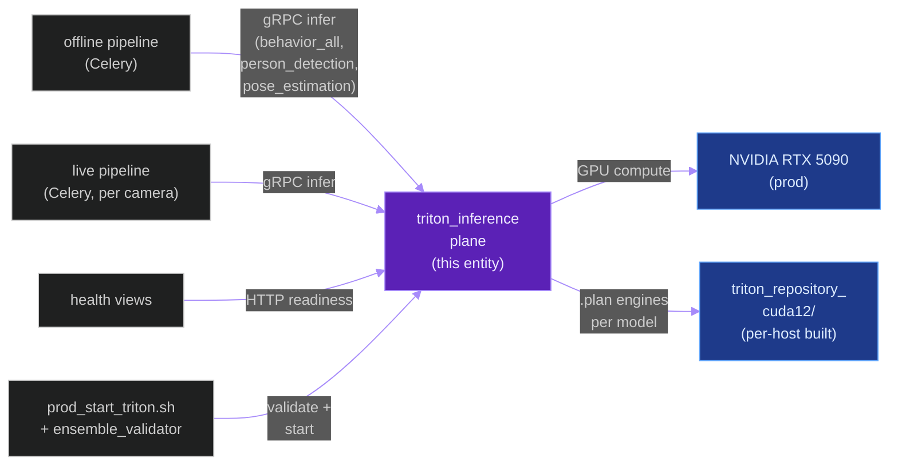
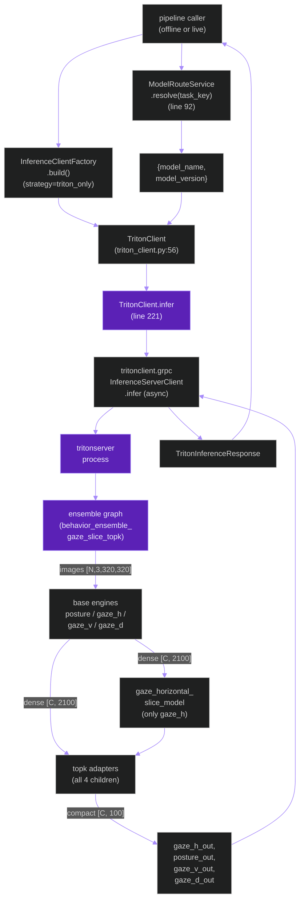
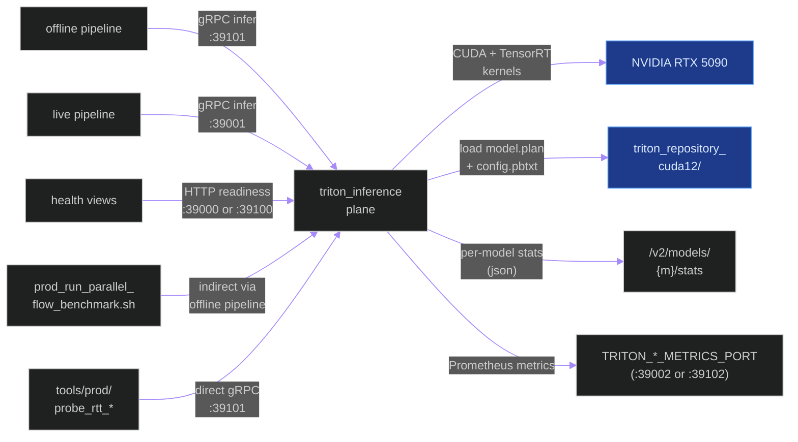
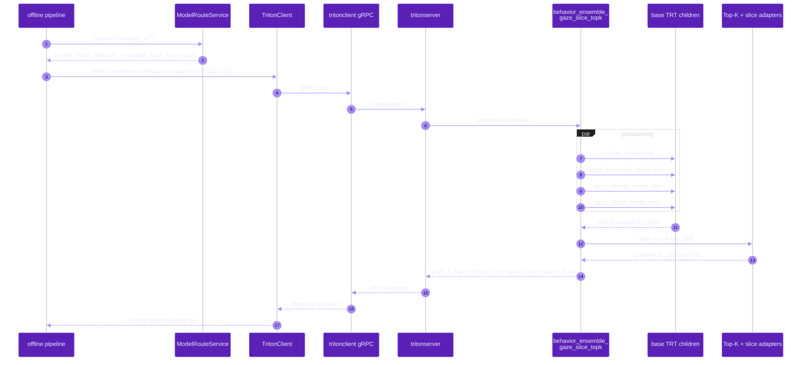
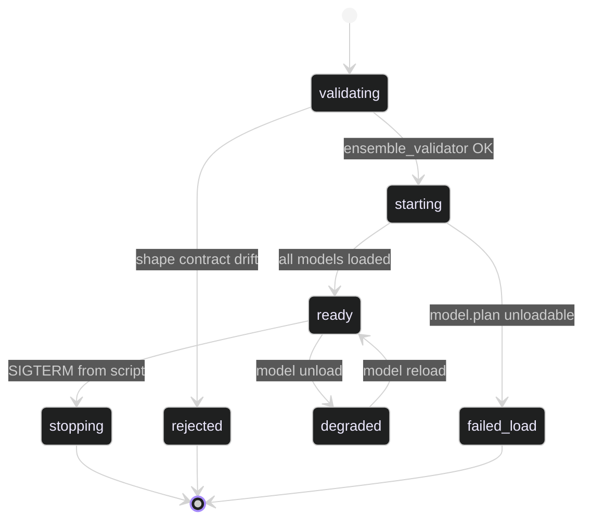

# `triton_inference_plane`

**Last updated:** 2026-06-03
**Entity kind:** `system`
**Status:** `active`

> The native-Linux Triton Inference Server + its TensorRT engine
> fleet + the Python-side service layer that resolves logical model
> names and dispatches gRPC requests. This is the **sole** production
> inference authority per constitution § 2 (Production Runtime
> Constitution): all real inference goes through here, on one active
> endpoint profile at a time (live `:39000/:39001/:39002` XOR
> offline `:39100/:39101/:39102`).

## Source-of-truth references

| Kind | Reference |
|---|---|
| File | `backend/apps/pipeline/services/triton_client.py` |
| File | `backend/apps/pipeline/services/model_route_service.py` |
| File | `backend/apps/pipeline/services/inference_client_factory.py` |
| File | `backend/apps/pipeline/services/runtime_policy.py` |
| File | `backend/apps/pipeline/services/ensemble_validator.py` |
| File | `backend/apps/pipeline/services/triton_ensemble_input_size.py` |
| File | `backend/apps/pipeline/services/base_inference_client.py` |
| File | `backend/apps/pipeline/services/degradation_service.py` |
| File | `backend/scripts/build_tensorrt_engines.py` |
| File | `backend/models/triton_repository_cuda12/behavior_ensemble_gaze_slice_topk/config.pbtxt` |
| File | `backend/models/triton_repository_cuda12/behavior_ensemble/config.pbtxt` |
| File | `backend/models/triton_repository_cuda12/behavior_ensemble_gaze_slice/config.pbtxt` |
| File | `backend/models/triton_repository_cuda12/behavior_ensemble_gaze2/config.pbtxt` |
| File | `backend/models/triton_repository_cuda12/gaze_horizontal_slice_model/config.pbtxt` |
| File | `backend/models/triton_repository_cuda12/gaze_horizontal_slice_adapter/config.pbtxt` |
| File | `backend/models/triton_repository_cuda12/posture_topk_model/config.pbtxt` |
| File | `backend/models/triton_repository_cuda12/gaze_horizontal_slice_topk_model/config.pbtxt` |
| File | `backend/models/triton_repository_cuda12/gaze_vertical_topk_model/config.pbtxt` |
| File | `backend/models/triton_repository_cuda12/gaze_depth_topk_model/config.pbtxt` |
| File | `backend/models/triton_repository_cuda12/person_detector/config.pbtxt` |
| File | `backend/models/triton_repository_cuda12/rtmpose_model/config.pbtxt` |
| File | `backend/models/triton_repository/posture_model/config.pbtxt` |
| File | `backend/models/triton_repository/gaze_horizontal_model/config.pbtxt` |
| File | `backend/models/triton_repository/gaze_vertical_model/config.pbtxt` |
| File | `backend/models/triton_repository/gaze_depth_model/config.pbtxt` |
| File | `.gitignore` (lines that allowlist tracked cuda12 configs) |
| File | `tools/prod/prod_start_triton.sh` |
| File | `tools/prod/prod-rebuild-tensorrt-engines.sh` |
| File | `tools/prod/prod_enable_gaze_horizontal_slice.sh` |
| File | `tools/prod/prod_enable_behavior_topk.sh` |
| File | `tools/prod/prod_set_behavior_input_size.sh` |
| File | `tools/prod/prod_triton_endpoint_policy.sh` |
| Symbol | `apps.pipeline.services.triton_client.TritonClient` (line 56) |
| Symbol | `apps.pipeline.services.triton_client.TritonClient.infer` (line 221) |
| Symbol | `apps.pipeline.services.model_route_service.ModelRouteService` (line 58) |
| Symbol | `apps.pipeline.services.model_route_service.ModelRouteService.resolve` (line 92) |
| Symbol | `apps.pipeline.services.inference_client_factory.InferenceClientFactory` (line 32) |
| Symbol | `apps.pipeline.services.ensemble_validator.validate_behavior_ensemble_repository` |
| Commit | `2ffe6294` (DSP Cycle 2 2/N — sibling live entity doc) |
| Commit | `9bc53d86` (Cycle 9b Top-K accepted — current default ensemble route) |
| Job | `be4ba9ee-4786-48e9-8334-28feb237a1fb` (production benchmark proving the active route) |
| Workflow | `.github/workflows/inference-parallelization.yml` |
| Doc | `docs/triton_models_and_tensor_anatomy.md` |
| Doc | `docs/triton_inference_speed_stabilization_plan.md` |
| Doc | `docs/triton_strategy_implementation_matrix.md` |
| Doc | `docs/triton_throughput_latency_gpu_optimization.md` |
| Doc | `docs/backend/architecture/triton-operations.md` |

## 1. Purpose and scope

The Triton inference plane is the production inference authority.
It owns:

- the **TensorRT engine fleet** (`.plan` files) built by
  `backend/scripts/build_tensorrt_engines.py`;
- the **Triton repository layout** under
  `backend/models/triton_repository_cuda12/` (only ensembles, slice
  adapters, and Top-K adapters are tracked in git; the four base
  behavior engines + their auto-generated configs are
  `.gitignore`-excluded and rebuilt per-host);
- the **Triton server lifecycle** (start, validate, restart) via the
  `tools/prod/prod_start_triton.sh` script;
- the **Python-side dispatch layer**: `TritonClient` (gRPC infer),
  `ModelRouteService` (logical-name → deployed-name),
  `InferenceClientFactory` (selects which client implementation per
  `INFERENCE_STRATEGY`), `runtime_policy.evaluate_runtime_policy`
  (fails closed if the active endpoint isn't ready).

It does NOT do video decode, tracking, persistence, or rendering —
those belong to the offline/live pipelines. It does NOT own the
GPU outside of Triton (the GPU monitor CSV is a sibling tool).

## 2. Position in the system

## 3. Internal structure

### Python service layer (`backend/apps/pipeline/services/`)

| File | Role |
|---|---|
| `triton_client.py` | `TritonClient` (line 56) — the gRPC client. `infer(request)` (line 221) is the single entry point used by both pipelines. Owns timeout policy + retries (`TRITON_RETRY_ATTEMPTS`, `TRITON_RETRY_TIMEOUT_SCALE`). |
| `model_route_service.py` | `ModelRouteService` (line 58). `.resolve(task_key)` (line 92) maps logical names (`behavior_all`, `person_detection`, `gaze_horizontal`, `posture_detection`, `gaze_vertical`, `gaze_depth`, `pose_estimation`) to deployed Triton model names. Reads `MODEL_ROUTE_*` env overrides. |
| `inference_client_factory.py` | `InferenceClientFactory` (line 32). Selects between the real `TritonClient` and dev-only local adapters per `INFERENCE_STRATEGY`. Prod is always `triton_only`. |
| `runtime_policy.py` | `evaluate_runtime_policy(path)` enforces single-active-profile + fail-closed semantics before any inference call. Reads `TRITON_REQUIRED_OFFLINE` / `TRITON_REQUIRED_LIVE`. |
| `ensemble_validator.py` | `validate_behavior_ensemble_repository(...)` enforces the ensemble + child shape contracts before Triton starts. Cycle 11 added `behavior_input_size=` parameter; runs from `prod_start_triton.sh` and `prod_enable_behavior_topk.sh`. |
| `triton_ensemble_input_size.py` | Pure-Python rewriter for the 6 ensemble `images` input dims; used by `prod_set_behavior_input_size.sh`. |
| `base_inference_client.py` | Abstract base — both `TritonClient` and any dev adapter implement it. |
| `degradation_service.py` | Records degraded states (e.g., partial endpoint health) for the health surface. |

### Triton repository (`backend/models/triton_repository_cuda12/`)

Per `.gitignore` (lines 35-50 area), this directory is gitignored EXCEPT for an explicit allowlist. Currently tracked:

| Tracked path | Role |
|---|---|
| `behavior_ensemble/config.pbtxt` | Original Cycle 9 ensemble (legacy, dark on current prod) |
| `behavior_ensemble_gaze2/config.pbtxt` | Cycle 9b B.2.a NOT-ACCEPTED 2-class variant (dark) |
| `behavior_ensemble_gaze_slice/config.pbtxt` | Cycle 9b B.2.b ACCEPTED exact-slice ensemble |
| `behavior_ensemble_gaze_slice_topk/config.pbtxt` | **Cycle 9b B.2.c — current active prod ensemble** |
| `gaze_horizontal_slice_model/config.pbtxt` | TRT plan that gathers channels `[0,1,2,3,8,9]` from the legacy 84-channel output |
| `gaze_horizontal_slice_adapter/config.pbtxt` | Standalone fallback ensemble for the slice route |
| `gaze_horizontal_gaze2_model/config.pbtxt` | Rejected 6-channel re-export (parity failed) |
| `posture_topk_model/config.pbtxt` | FP32 Top-K adapter (input `[14, anchors]` → output `[14, K]`) |
| `gaze_horizontal_slice_topk_model/config.pbtxt` | FP32 Top-K adapter (input `[6, anchors]` → output `[6, K]`) |
| `gaze_vertical_topk_model/config.pbtxt` | FP32 Top-K adapter |
| `gaze_depth_topk_model/config.pbtxt` | FP32 Top-K adapter |
| `person_detector/config.pbtxt` | Full-frame person detection model |
| `rtmpose_model/config.pbtxt` | Pose-estimation model (input `[N, 3, 256, 192]`) |

The four base behavior engines (`posture_model`, `gaze_horizontal_model`, `gaze_vertical_model`, `gaze_depth_model`) are **not** tracked in git — their `.plan` files + auto-generated `config.pbtxt` are produced per host by `backend/scripts/build_tensorrt_engines.py`. The legacy reference configs at `backend/models/triton_repository/` exist for read-only inspection.

### Per-host build + lifecycle scripts (`tools/prod/`)

| Script | Role |
|---|---|
| `prod_start_triton.sh` | Validates the ensemble repo (via `ensemble_validator.py`), forwards `TRITON_CROP_BEHAVIOR_INPUT_SIZE` + `GAZE_HORIZONTAL_HEAD_VARIANT` + `TRITON_BEHAVIOR_TOP_K_*`, then launches `tritonserver` against the active endpoint. |
| `prod-rebuild-tensorrt-engines.sh` | Full engine rebuild for a TRT-version migration. |
| `prod_enable_gaze_horizontal_slice.sh` | Builds + enables the Cycle 9b B.2.b exact-slice route. |
| `prod_enable_behavior_topk.sh` | Builds + enables the Cycle 9b B.2.c Top-K route (FP32 adapters). |
| `prod_set_behavior_input_size.sh` | Cycle 11 orchestrator: config-rewrite + base-engine rebuild + Top-K rebuild + restart. |
| `prod_triton_endpoint_policy.sh` | Single-active-profile enforcement (live XOR offline must be unreachable). |

## 4. Call graph (internal — one infer call lifecycle)

## 5. External connections

## 6. API surface (external calls into this entity)

| Interface | Schema | Caller |
|---|---|---|
| Function `TritonClient.infer(request: TritonInferenceRequest) -> TritonInferenceResponse` | request carries `model_name`, `model_version`, named tensor inputs + requested outputs | offline + live pipelines via `InferenceClientFactory` |
| Function `ModelRouteService.resolve(task_key: str) -> {model_name, model_version}` | task keys: `behavior_all`, `person_detection`, `posture_detection`, `gaze_horizontal`, `gaze_vertical`, `gaze_depth`, `pose_estimation` | every pipeline call before infer |
| HTTP `GET /v2/health/ready` (Triton) | none | health views, prod_start_triton.sh |
| HTTP `GET /v2/models/{name}/ready` (Triton) | none | health views, probe scripts |
| HTTP `GET /v2/models/{name}/stats` (Triton) | none | RTT decomposition probes (`tools/prod/probe_child_stats_topk.py`) |
| gRPC `InferenceServerClient.infer` (tritonclient) | per-model input/output names + dims | `TritonClient.infer` |

## 7. Dependencies

| Dependency | Reason | Pinned version |
|---|---|---|
| `tritonserver` (native Linux binary) | inference runtime | aligned with TRT manifest |
| `TensorRT` runtime + headers | engine load + execution | 10.16.1.11 per `backend/models/tensorrt_builds/latest_compat.json` |
| `tritonclient` (Python, gRPC) | client-side dispatch | per `backend/requirements.txt` |
| CUDA 12.x toolkit | runtime | matches RTX 5090 driver |
| `apps.pipeline` (siblings: `base_inference_client`, `degradation_service`) | shared abstractions | internal |
| `Django settings` | env var reads via `settings.TRITON_*` | 5.1.5 |

## 8. Environment variables read

| Variable | Default | Required? | Effect |
|---|---|---|---|
| `INFERENCE_STRATEGY` | `triton_only` (prod) | yes (prod) | Anything else fails the runtime policy in prod |
| `TRITON_EXECUTION_MODE` | (operator-set) | yes | `live` selects :39000/:39001/:39002; `offline` selects :39100/:39101/:39102 |
| `TRITON_URL` | `http://localhost:8000` | yes | base HTTP URL for health checks |
| `TRITON_LIVE_HTTP_PORT` / `TRITON_LIVE_GRPC_PORT` / `TRITON_LIVE_METRICS_PORT` | `39000` / `39001` / `39002` | no | live endpoint ports |
| `TRITON_OFFLINE_HTTP_PORT` / `..._GRPC_PORT` / `..._METRICS_PORT` | `39100` / `39101` / `39102` | no | offline endpoint ports |
| `TRITON_TIMEOUT_MS` | `1500` | no | per-request default timeout |
| `TRITON_MAX_TIMEOUT_MS` | `5000` | no | upper bound for requested timeouts |
| `TRITON_RETRY_ATTEMPTS` | `2` | no | gRPC retry count |
| `TRITON_RETRY_TIMEOUT_SCALE` | `2.0` | no | backoff scale between retries |
| `TRITON_LOAD_MODEL` | per `prod_enable_parallel_flow.sh` | no | declarative list of models the prod scripts expect loaded |
| `TRITON_BEHAVIOR_TOP_K_ENABLED` | `0` (base), `1` (prod) | no | toggles the Top-K route |
| `TRITON_BEHAVIOR_TOP_K_VALUE` | `100` | no | Top-K anchor count |
| `GAZE_HORIZONTAL_HEAD_VARIANT` | `coco80` (base), `slice` (prod) | no | selects gaze_horizontal output contract |
| `TRITON_CROP_BEHAVIOR_INPUT_SIZE` | `320` (current accepted) | no | square input dim for behavior children |
| `TRITON_CROP_FRAME_BEHAVIOR_OVERLAP` | `1` (accepted prod) | no | app-side Cycle 12.C overlap flag; no Triton model/config change |
| `MODEL_ROUTE_BEHAVIOR_ALL_MODEL_NAME` | `behavior_ensemble` (base), `behavior_ensemble_gaze_slice_topk` (prod) | no | logical-name route override |
| `MODEL_ROUTE_GAZE_HORIZONTAL_MODEL_NAME` | `gaze_horizontal_model` (base), `gaze_horizontal_slice_adapter` (slice route) | no | route override for the standalone gaze_h fallback |

## 9. Sequence diagram (dominant interaction)

End-to-end for a single offline-pipeline behavior-ensemble call:

## 10. State machine

Triton process state machine (managed by `prod_start_triton.sh`):

## 11. Failure modes

| Failure | Detection | Recovery |
|---|---|---|
| Shape-contract drift (config vs engine) | `ensemble_validator.py` pre-start check | Re-run the matching `prod_enable_*` script; reload Triton |
| Both endpoints reachable | `prod_triton_endpoint_policy.sh` | Stop the dark profile |
| TRT version mismatch (manifest vs installed) | `prod_trt_guard.sh` within `prod-rebuild-tensorrt-engines.sh` | Rebuild engines for the installed TRT version |
| Per-model stats `success.ns` flat at 0 (model never invoked) | RTT decomposition probe | Check that `TRITON_LOAD_MODEL` includes the model AND that `ModelRouteService` resolves to it |
| gRPC timeout | `TritonClientError` raised | Caller's retry policy; if persistent, operator inspects `backend/logs/triton.log` |
| `INVALID_ARGUMENT batch-size must be <= 32` | Triton rejects oversize batch | App chunks at 32 (`_run_crop_behaviour_for_items`); probes chunk via `--batch-size 32` |
| Engine load fails after rebuild | Triton log + readiness probe stays at 503 | Rollback `model.plan.rollback.<tag>` is preserved next to every engine; restart Triton on the previous plan |

## 12. Performance characteristics

Per-model server-side compute under the active Cycle 9b Top-K topology (probe `backend/logs/probe_rtt_decompose_topk_20260602T120240.json`):

| Model | bs=17 probe avg ms | bs=32 prod aggregate ms | Note |
|---|---:|---:|---|
| `posture_model` | 16.324 | 29.694 | base TRT engine, FP16 |
| `gaze_horizontal_model` | **18.790** | 29.818 | dominant child (+15 % over next) |
| `gaze_vertical_model` | 16.236 | 29.690 | base TRT engine, FP16 |
| `gaze_depth_model` | 16.377 | 29.695 | base TRT engine, FP16 |
| `gaze_horizontal_slice_model` | — | 1.103 | gather only, negligible |
| `posture_topk_model` | — | 1.210 | FP32 Top-K adapter |
| `gaze_horizontal_slice_topk_model` | — | 1.562 | FP32 Top-K adapter |
| `gaze_vertical_topk_model` | — | 1.203 | FP32 Top-K adapter |
| `gaze_depth_topk_model` | — | 1.216 | FP32 Top-K adapter |
| `behavior_ensemble_gaze_slice_topk` (whole ensemble) | 30.133 | 33.010 | orchestration overhead ≈ 8.7 ms / call |

Per-crop GPU compute is constant at ~0.94 ms/crop across batch sizes.
Source: `docs/cycle_9b_child_critical_path_remeasure_topk_results.md`.

## 13. Operational notes

- **Single-active-profile rule.** Per constitution § 2, exactly one of
  `:39000-39002` (live) or `:39100-39102` (offline) is reachable. The
  inactive profile's ports MUST be closed.
- **Engine rebuild on TRT-version change.** Run `tools/prod/prod-rebuild-tensorrt-engines.sh`
  after any TRT upgrade/downgrade. The script stops Celery + Triton,
  rebuilds all 6 engines, runs `prod_trt_guard.sh`, restarts Triton,
  restarts Celery.
- **Per-host rebuild on input-size change.** `tools/prod/prod_set_behavior_input_size.sh --input-size <N>`
  is the Cycle 11 orchestrator; defaults to 320 (current accepted).
- **Per-host rebuild on ensemble-route change.** `prod_enable_gaze_horizontal_slice.sh`
  for the B.2.b route; `prod_enable_behavior_topk.sh` for the B.2.c route.
- **Rollback every engine.** Each rebuild keeps the prior plan as
  `model.plan.rollback.<tag>` next to the new one — no destructive
  overwrite.
- **Stats endpoint.** `curl -s :39100/v2/models/{name}/stats` gives
  per-model `success.count` + `success.ns` (per-call avg).
- **Health endpoint.** `curl -s :39100/v2/health/ready` returns
  `200` when every loaded model is ready.

## 14. Historical diagrams

> Not applicable: no diagrams in this doc have been superseded yet.
> The Cycle 9 → Cycle 9b transition (`behavior_ensemble` → `behavior_ensemble_gaze_slice_topk`)
> happened before this entity doc existed; the legacy route is still
> visible in the call graph via the dark `behavior_ensemble` entry in
> the tracked-config table.

## 15. Related entities

| Entity | Path | Relationship |
|---|---|---|
| Offline inference pipeline | `docs/entity/systems/offline_inference_pipeline.md` | caller (offline endpoint :39101) |
| Live streaming pipeline | `docs/entity/systems/live_streaming_pipeline.md` | caller (live endpoint :39001) |
| Telemetry pipeline | `docs/entity/systems/telemetry_pipeline.md` (planned DSP Cycle 2) | observer — records per-call RTT |
| `apps.pipeline` module | `docs/entity/modules/apps.pipeline.md` (planned DSP Cycle 3) | parent module |
| `triton_client.py` code | `docs/entity/code/apps.pipeline.services.triton_client.md` (planned DSP Cycle 6) | hot file |
| `ensemble_validator.py` code | `docs/entity/code/apps.pipeline.services.ensemble_validator.md` (planned DSP Cycle 6) | hot file |
| `logical_path_matrix.py` code | `docs/entity/code/apps.pipeline.services.logical_path_matrix.md` (planned DSP Cycle 6) | hot file (currently `LPM_ENABLED=0`) |
| Cycle 9b (ACCEPTED) | `docs/entity/cycles/cycle_9b.md` (planned DSP Cycle 4) | current active prod route originated here |
| `prod_start_triton.sh` | `docs/entity/scripts/tools__prod__prod_start_triton.sh.md` (planned DSP Cycle 5) | lifecycle script |
| `build_tensorrt_engines.py` | `docs/entity/scripts/backend__scripts__build_tensorrt_engines.py.md` (planned DSP Cycle 5) | engine builder |

## 16. Open questions

- **Q1.** Should `TRITON_LOAD_MODEL` be enforced via `--model-control-mode=explicit` so unlisted models are not loaded? Currently Triton ignores the env var and loads every directory in the repo. *Owner:* infra maintainer. *Target close:* before next ensemble-route swap.
- **Q2.** Should base-behavior `config.pbtxt` files be tracked in git (currently `.gitignore`-excluded because they're per-host)? Trade-off: visibility vs per-host drift. *Owner:* DSP Cycle 5 reviewer. *Target close:* during Cycle 5 script audit.

## 17. Change log

| Date | What changed | Commit |
|---|---|---|
| 2026-06-02 | First version landed under DSP Cycle 2 (3 of ~6 systems) | (this commit) |
