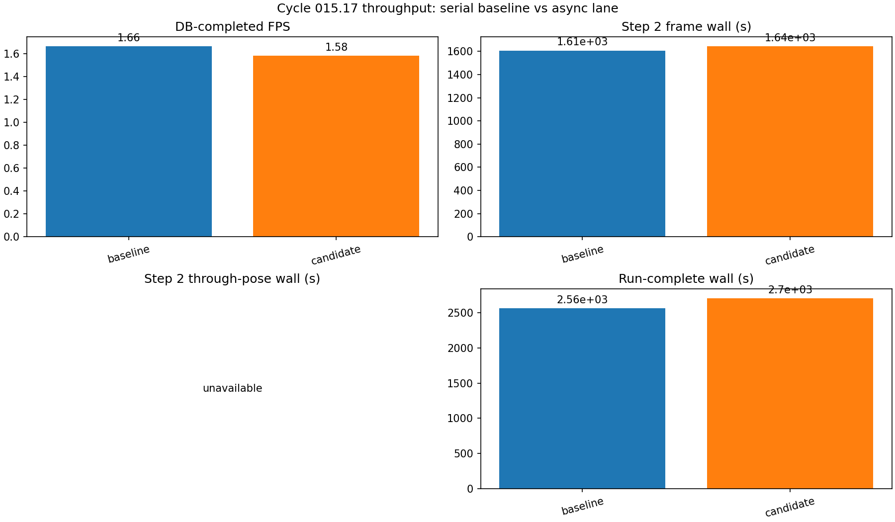
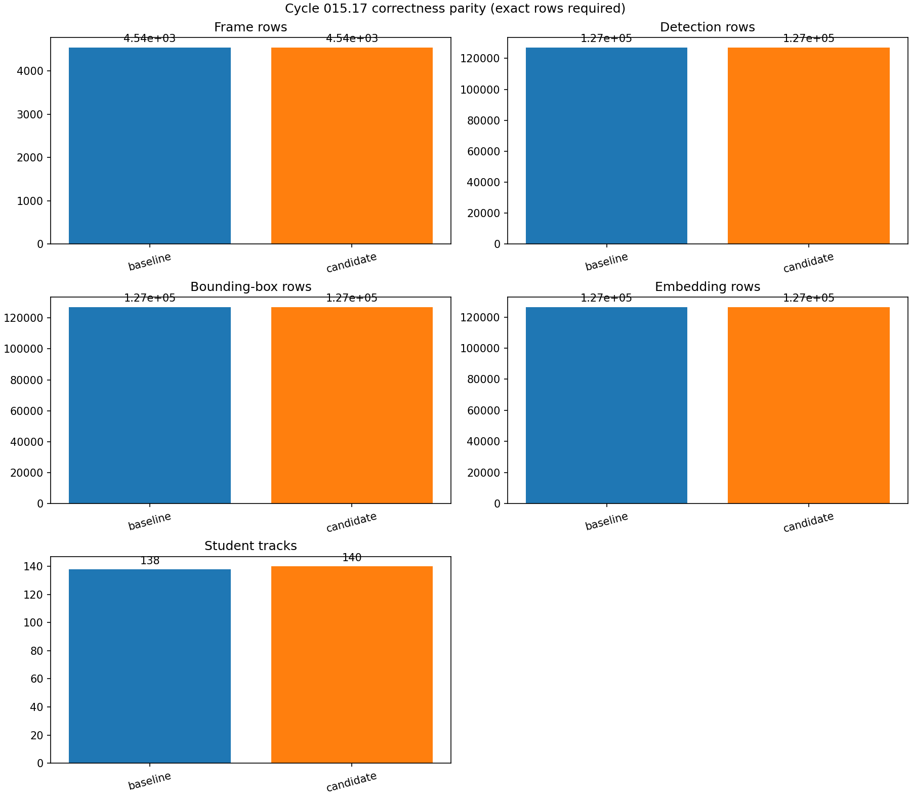
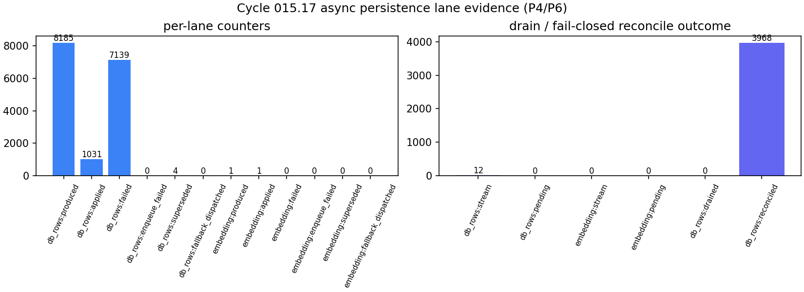
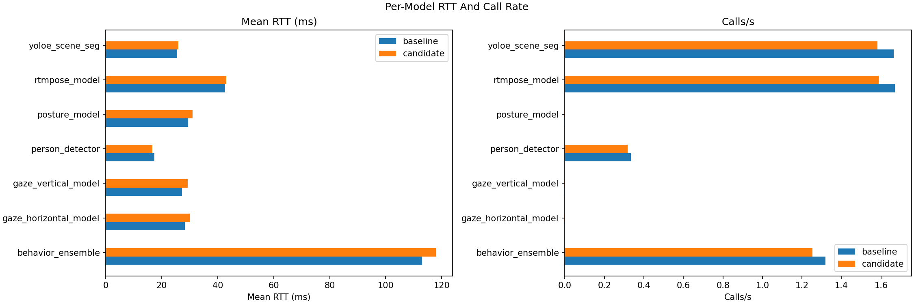

# Cycle 015.17 Figures

Manifest: `MANIFEST.json`

## Throughput: Serial Baseline vs Async Lane

sha256: `1f91ee55c6f1235771692f0b85890abfb305a4381d0f6602c91507ee95f56449`

## Correctness Parity (Exact Rows Required)

sha256: `ff037b5b8484bf85e7500a7fef2ea0b7cc47da594a195d710bd8d6f1b69fa0bd`

## Async Persistence Lane Evidence

sha256: `8cf56d6e4388ab0d63db7d4e8227b00f3a50a16f9df48b0878fdc74534028afa`

## Model RTT And Call Rate

sha256: `7d120298bb6ecfe9d6e5bbfc8f856f0d50c6dcfaf67cb95b27268d9bf9f45beb`

## Unavailable Metric Summary

sha256: `8627efee19e695a48e965dbcd466be2c5999a1dad10a89c86dd086fc502c6a2e`
