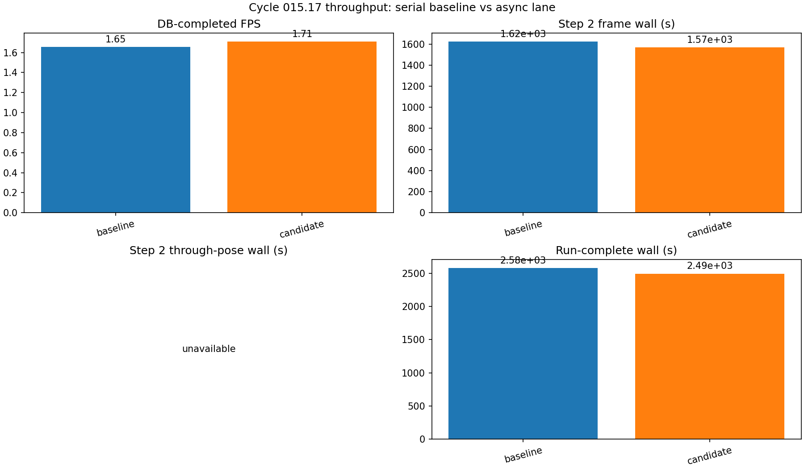
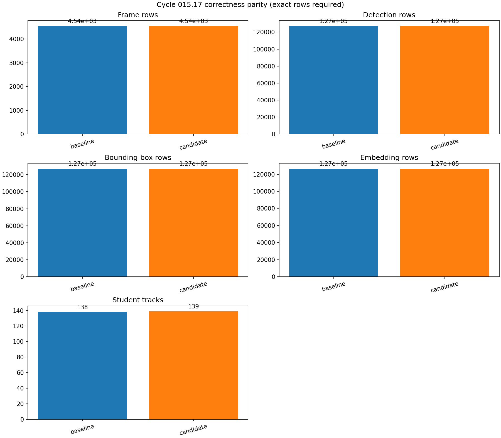
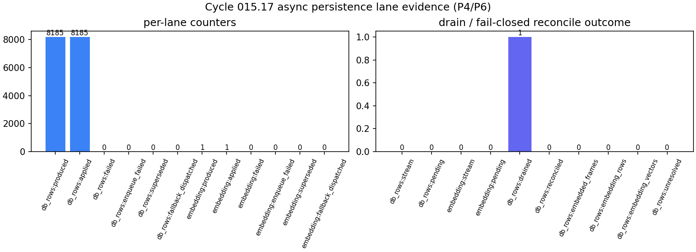
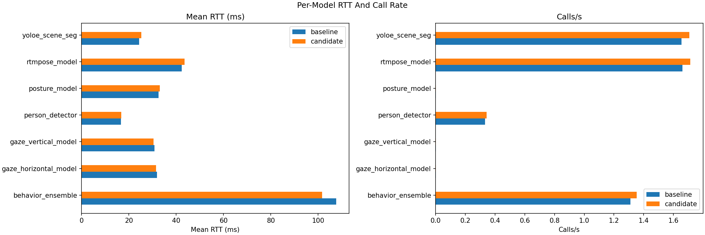
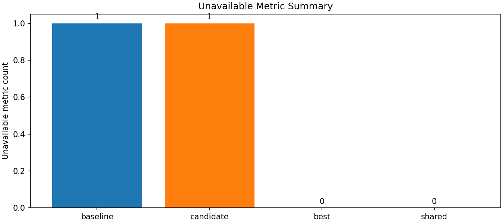

# Cycle 015.17 Figures

Manifest: `MANIFEST.json`

## Throughput: Serial Baseline vs Async Lane

sha256: `05392ca6d169aab3bd4ac8e4ec14bae531c5ffe771af9c0b942a0c3dbaec6935`

## Correctness Parity (Exact Rows Required)

sha256: `bb088d1533c36c3f9f3d82d24976fe8c5d2ee939164e2214bb283379492a4b54`

## Async Persistence Lane Evidence

sha256: `e9a970cb2e4916650a5c8a80406d49b5dbcd3b5c273c3b3c151953d8ebebe139`

## Model RTT And Call Rate

sha256: `34c907e5e08183d31730b041e6c45aa22a756bba3003b0a02e9de1db086e17be`

## Unavailable Metric Summary

sha256: `8627efee19e695a48e965dbcd466be2c5999a1dad10a89c86dd086fc502c6a2e`
